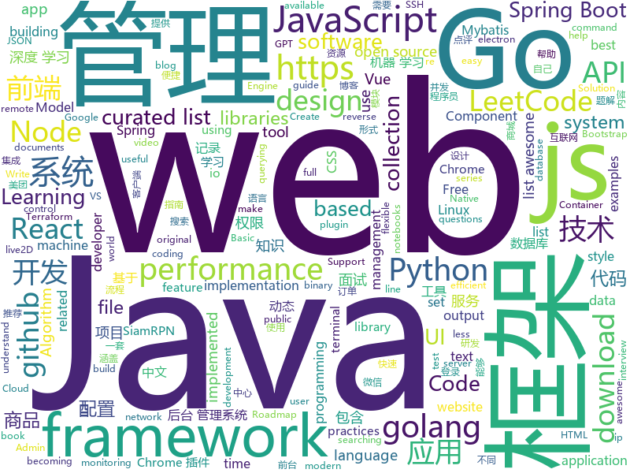

# 2019-05-06
See what the GitHub community is most excited about today.

## python
* [Python](https://github.com/TheAlgorithms/Python)(**509 stars today**): All Algorithms implemented in Python
* [zfsp](https://github.com/alcarithemad/zfsp)(**188 stars today**): ZFS, in Python, without reading the original C.
* [PySnooper](https://github.com/cool-RR/PySnooper)(**132 stars today**): Never use print for debugging again
* [gpt-2](https://github.com/openai/gpt-2)(**103 stars today**): Code for the paper "Language Models are Unsupervised Multitask Learners"
* [AiLearning](https://github.com/apachecn/AiLearning)(**89 stars today**): AiLearning: 机器学习 - MachineLearning - ML、深度学习 - DeepLearning - DL、自然语言处理 NLP
* [faceswap](https://github.com/deepfakes/faceswap)(**64 stars today**): Non official project based on original /r/Deepfakes thread. Many thanks to him!
* [ChromeAppHeroes](https://github.com/zhaoolee/ChromeAppHeroes)(**70 stars today**): 🌈谷粒-Chrome插件英雄榜, 为优秀的Chrome插件写一本中文说明书, 让Chrome插件英雄们造福人类~ ChromePluginHeroes, Write a Chinese manual for the excellent Chrome plugin, let the Chrome plugin heroes benefit the human~
* [awesome-python](https://github.com/vinta/awesome-python)(**60 stars today**): A curated list of awesome Python frameworks, libraries, software and resources
* [system-design-primer](https://github.com/donnemartin/system-design-primer)(**59 stars today**): Learn how to design large-scale systems. Prep for the system design interview. Includes Anki flashcards.
* [models](https://github.com/tensorflow/models)(**48 stars today**): Models and examples built with TensorFlow
* [poetry](https://github.com/sdispater/poetry)(**62 stars today**): Python dependency management and packaging made easy.
* [easyXssPayload](https://github.com/TheKingOfDuck/easyXssPayload)(**48 stars today**): XssPayload List . Usage:
* [public-apis](https://github.com/toddmotto/public-apis)(**48 stars today**): A collective list of free APIs for use in software and web development.
* [awesome-machine-learning](https://github.com/josephmisiti/awesome-machine-learning)(**48 stars today**): A curated list of awesome Machine Learning frameworks, libraries and software.
* [SiamRPN_plus_plus_PyTorch](https://github.com/PengBoXiangShang/SiamRPN_plus_plus_PyTorch)(**44 stars today**): SiamRPN, SiamRPN++, unofficial implementation of "SiamRPN++" (CVPR2019), multi-GPUs, LMDB.
* [jupytext](https://github.com/mwouts/jupytext)(**45 stars today**): Jupyter notebooks as Markdown documents, Julia, Python or R scripts
* [tvm](https://github.com/pytorch/tvm)(**47 stars today**): TVM integration into PyTorch
* [keras](https://github.com/keras-team/keras)(**40 stars today**): Deep Learning for humans
* [gpt-2-simple](https://github.com/minimaxir/gpt-2-simple)(**45 stars today**): Python package to easily retrain OpenAI's GPT-2 text-generating model on new texts
* [botorch](https://github.com/pytorch/botorch)(**42 stars today**): Bayesian optimization in PyTorch
* [youtube-dl](https://github.com/ytdl-org/youtube-dl)(**39 stars today**): Command-line program to download videos from YouTube.com and other video sites
* [gpt-2-output-dataset](https://github.com/openai/gpt-2-output-dataset)(**35 stars today**): Dataset of GPT-2 outputs for research in detection, biases, and more
* [cheat.sh](https://github.com/chubin/cheat.sh)(**38 stars today**): the only cheat sheet you need
* [manim](https://github.com/3b1b/manim)(**35 stars today**): Animation engine for explanatory math videos
* [face_recognition](https://github.com/ageitgey/face_recognition)(**30 stars today**): The world's simplest facial recognition api for Python and the command line

## java
* [CS-Notes](https://github.com/CyC2018/CS-Notes)(**262 stars today**): 📚技术面试必备基础知识、Leetcode 题解、后端面试、Java 面试、春招、秋招、操作系统、计算机网络、系统设计
* [ip2region](https://github.com/lionsoul2014/ip2region)(**173 stars today**): Ip2region is a offline IP location library with accuracy rate of 99.9% and 0.0x millseconds searching performance. DB file is less then 5Mb with all ip address stored. binding for Java,PHP,C,Python,Nodejs,Golang,C#,lua. Binary,B-tree,Memory searching algorithm
* [JavaGuide](https://github.com/Snailclimb/JavaGuide)(**155 stars today**): 【Java学习+面试指南】 一份涵盖大部分Java程序员所需要掌握的核心知识。
* [advanced-java](https://github.com/doocs/advanced-java)(**106 stars today**): 😮互联网 Java 工程师进阶知识完全扫盲：涵盖高并发、分布式、高可用、微服务等领域知识
* [mall](https://github.com/macrozheng/mall)(**75 stars today**): mall项目是一套电商系统，包括前台商城系统及后台管理系统，基于SpringBoot+MyBatis实现。 前台商城系统包含首页门户、商品推荐、商品搜索、商品展示、购物车、订单流程、会员中心、客户服务、帮助中心等模块。 后台管理系统包含商品管理、订单管理、会员管理、促销管理、运营管理、内容管理、统计报表、财务管理、权限管理、设置等模块。
* [manifold](https://github.com/manifold-systems/manifold)(**92 stars today**): Manifold re-energizes Java with powerful features like Type-safe Metaprogramming, Structural Typing, and Extension Methods.
* [DoraemonKit](https://github.com/didi/DoraemonKit)(**87 stars today**): 简称 "DoKit" 。一款功能齐全的客户端（ iOS 、Android ）研发助手，你值得拥有。
* [apollo](https://github.com/ctripcorp/apollo)(**66 stars today**): Apollo（阿波罗）是携程框架部门研发的分布式配置中心，能够集中化管理应用不同环境、不同集群的配置，配置修改后能够实时推送到应用端，并且具备规范的权限、流程治理等特性，适用于微服务配置管理场景。
* [skywalking](https://github.com/apache/skywalking)(**67 stars today**): APM, Application Performance Monitoring System
* [spring-boot](https://github.com/spring-projects/spring-boot)(**53 stars today**): Spring Boot
* [spring-boot-examples](https://github.com/ityouknow/spring-boot-examples)(**52 stars today**): about learning Spring Boot via examples. Spring Boot 教程、技术栈示例代码，快速简单上手教程。
* [hsweb-framework](https://github.com/hs-web/hsweb-framework)(**53 stars today**): hsweb (haʊs wɛb) 是一个用于快速搭建企业后台管理系统的基础项目,集成一揽子便捷功能如:便捷的通用增删改查,强大的权限管理,动态多数据源,动态表单,在线数据库维护等. 基于 spring-boot,mybaits.
* [ZXBlog](https://github.com/ZXZxin/ZXBlog)(**50 stars today**): 记录各种学习笔记(算法、Java、数据库、并发......)
* [Java](https://github.com/TheAlgorithms/Java)(**47 stars today**): All Algorithms implemented in Java
* [cat](https://github.com/dianping/cat)(**46 stars today**): CAT 作为服务端项目基础组件，提供了 Java, C/C++, Node.js, Python, Go 等多语言客户端，已经在美团点评的基础架构中间件框架（MVC框架，RPC框架，数据库框架，缓存框架等，消息队列，配置系统等）深度集成，为美团点评各业务线提供系统丰富的性能指标、健康状况、实时告警等。
* [spring-framework](https://github.com/spring-projects/spring-framework)(**34 stars today**): Spring Framework
* [hutool](https://github.com/looly/hutool)(**41 stars today**): A set of tools that keep Java sweet.
* [java-design-patterns](https://github.com/iluwatar/java-design-patterns)(**42 stars today**): Design patterns implemented in Java
* [sirix](https://github.com/sirixdb/sirix)(**46 stars today**): Sirix facilitates effective and efficient storing and querying of your temporal data through snapshotting (only ever appends changed database pages) and a novel versioning approach called sliding snapshot, which versions at the node level. Currently we support the storage and querying of XML- and JSON-documents in our binary encoding.
* [seata](https://github.com/seata/seata)(**37 stars today**): 🔥Seata is an easy-to-use, high-performance, java based, open source distributed transaction solution.
* [hope-boot](https://github.com/hope-for/hope-boot)(**40 stars today**): 基于Spring Boot 2.x开发 整合：Spring Boot 2.x/Apache Shiro+JWT/Spring Data JPA+Mybatis+Tk.Mybatis+PageHelper/Redis/Flyway/Swagger/SSO/Thymeleaf 动态权限管理 AES+MD5+盐加解密 代码生成 日志记录 Google验证码登录 单点登录 项目地址：https://github.com/hope-for/hope-boot 主语言[java]
* [halo](https://github.com/halo-dev/halo)(**40 stars today**): ✍ Halo 可能是最好的 Java 博客系统
* [ghidra](https://github.com/NationalSecurityAgency/ghidra)(**39 stars today**): Ghidra is a software reverse engineering (SRE) framework
* [tutorials](https://github.com/eugenp/tutorials)(**23 stars today**): The "REST With Spring" Course:
* [UI2018](https://github.com/zincPower/UI2018)(**37 stars today**): 安卓高级UI代码整理和博客代码Demo

## unknown
* [LeetCodeAnimation](https://github.com/MisterBooo/LeetCodeAnimation)(**538 stars today**): Demonstrate all the questions on LeetCode in the form of animation.（用动画的形式呈现解LeetCode题目的思路）
* [industry-machine-learning](https://github.com/firmai/industry-machine-learning)(**137 stars today**): A curated list of applied machine learning and data science notebooks and libraries accross different industries.
* [free-programming-books](https://github.com/EbookFoundation/free-programming-books)(**91 stars today**): 📚Freely available programming books
* [support.996.ICU](https://github.com/MSWorkers/support.996.ICU)(**89 stars today**): Microsoft and GitHub Workers Support 996.ICU
* [awesome](https://github.com/sindresorhus/awesome)(**76 stars today**): 😎Awesome lists about all kinds of interesting topics
* [git-tips](https://github.com/521xueweihan/git-tips)(**71 stars today**): Git的奇技淫巧
* [gitignore](https://github.com/github/gitignore)(**53 stars today**): A collection of useful .gitignore templates
* [TP1](https://github.com/OpenCyberTranslationProject/TP1)(**56 stars today**): Linux Basics for Hackers
* [Awesome-Hacking](https://github.com/Hack-with-Github/Awesome-Hacking)(**61 stars today**): A collection of various awesome lists for hackers, pentesters and security researchers
* [You-Dont-Know-JS](https://github.com/getify/You-Dont-Know-JS)(**63 stars today**): A book series on JavaScript. @YDKJS on twitter.
* [vscode-remote-release](https://github.com/Microsoft/vscode-remote-release)(**64 stars today**): Visual Studio Code Remote Development: Open any folder in WSL, in a Docker container, or on a remote machine using SSH and take advantage of VS Code's full feature set.
* [developer-roadmap](https://github.com/kamranahmedse/developer-roadmap)(**57 stars today**): Roadmap to becoming a web developer in 2019
* [DeepLearning-500-questions](https://github.com/scutan90/DeepLearning-500-questions)(**52 stars today**): 深度学习500问，以问答形式对常用的概率知识、线性代数、机器学习、深度学习、计算机视觉等热点问题进行阐述，以帮助自己及有需要的读者。 全书分为18个章节，50余万字。由于水平有限，书中不妥之处恳请广大读者批评指正。 未完待续............ 如有意合作，联系scutjy2015@163.com 版权所有，违权必究 Tan 2018.06
* [awesome-wechat-weapp](https://github.com/justjavac/awesome-wechat-weapp)(**47 stars today**): 微信小程序开发资源汇总💯
* [commit-messages-guide](https://github.com/RomuloOliveira/commit-messages-guide)(**51 stars today**): A guide to understand the importance of commit messages and how to write them well
* [app-ideas](https://github.com/florinpop17/app-ideas)(**50 stars today**): A Collection of application ideas which can be used to improve your coding skills.
* [fe-note](https://github.com/NuoHui/fe-note)(**46 stars today**): 我的前端之路
* [rust-web-developer-roadmap](https://github.com/csharad/rust-web-developer-roadmap)(**48 stars today**): Roadmap to becoming a Rust Web Developer in 2019
* [weekly](https://github.com/aliyunfe/weekly)(**47 stars today**): 《阿里云前端技术周刊》
* [awesome-vue](https://github.com/vuejs/awesome-vue)(**42 stars today**): 🎉A curated list of awesome things related to Vue.js
* [pumpkin-book](https://github.com/datawhalechina/pumpkin-book)(**37 stars today**): 《机器学习》（西瓜书）公式推导解析，在线阅读地址：https://datawhalechina.github.io/pumpkin-book
* [hosts](https://github.com/googlehosts/hosts)(**29 stars today**): 镜像：https://coding.net/u/scaffrey/p/hosts/git
* [trackerslist](https://github.com/ngosang/trackerslist)(**38 stars today**): An updated list of public BitTorrent trackers
* [conference](https://github.com/gopherchina/conference)(**31 stars today**): 
* [keyhacks](https://github.com/streaak/keyhacks)(**28 stars today**): Keyhacks is a repository which shows quick ways in which API keys leaked by a bug bounty program can be checked to see if they're valid.

## javascript
* [leetcode](https://github.com/azl397985856/leetcode)(**555 stars today**): leetcode题解，记录自己的leetcode解题之路。
* [nodebestpractices](https://github.com/i0natan/nodebestpractices)(**168 stars today**): ✅The largest Node.js best practices list (April 2019)
* [svelte](https://github.com/sveltejs/svelte)(**171 stars today**): Cybernetically enhanced web apps
* [UnblockNeteaseMusic](https://github.com/nondanee/UnblockNeteaseMusic)(**139 stars today**): Revive unavailable songs for Netease Cloud Music
* [response](https://github.com/monzo/response)(**115 stars today**): Monzo's real-time incident response and reporting tool⚡️
* [vue](https://github.com/vuejs/vue)(**97 stars today**): 🖖Vue.js is a progressive, incrementally-adoptable JavaScript framework for building UI on the web.
* [tool](https://github.com/Louiszhai/tool)(**74 stars today**): 开发效率提升：Mac生产力工具链推荐
* [Motrix](https://github.com/agalwood/Motrix)(**66 stars today**): A full-featured download manager.
* [react](https://github.com/facebook/react)(**58 stars today**): A declarative, efficient, and flexible JavaScript library for building user interfaces.
* [30-seconds-of-code](https://github.com/30-seconds/30-seconds-of-code)(**63 stars today**): A curated collection of useful JavaScript snippets that you can understand in 30 seconds or less.
* [uppy](https://github.com/transloadit/uppy)(**65 stars today**): The next open source file uploader for web browsers🐶
* [storybook](https://github.com/storybooks/storybook)(**58 stars today**): UI component dev & test: React, Vue, Angular, React Native, Ember, Web Components & more!
* [Awesome-Design-Tools](https://github.com/LisaDziuba/Awesome-Design-Tools)(**60 stars today**): The best design tools for everything👉
* [shepherd](https://github.com/shipshapecode/shepherd)(**59 stars today**): Guide your users through a tour of your app
* [uni-app](https://github.com/dcloudio/uni-app)(**57 stars today**): 使用 Vue.js 开发跨平台应用的前端框架
* [sql.js](https://github.com/kripken/sql.js)(**56 stars today**): SQLite compiled to JavaScript through Emscripten
* [javascript](https://github.com/airbnb/javascript)(**46 stars today**): JavaScript Style Guide
* [pixi.js](https://github.com/pixijs/pixi.js)(**49 stars today**): The HTML5 Creation Engine: Create beautiful digital content with the fastest, most flexible 2D WebGL renderer.
* [bootstrap](https://github.com/twbs/bootstrap)(**37 stars today**): The most popular HTML, CSS, and JavaScript framework for developing responsive, mobile first projects on the web.
* [axios](https://github.com/axios/axios)(**46 stars today**): Promise based HTTP client for the browser and node.js
* [taro](https://github.com/NervJS/taro)(**44 stars today**): 多端统一开发框架，支持用 React 的开发方式编写一次代码，生成能运行在微信/百度/支付宝/字节跳动小程序、H5、React Native 等的应用。 https://taro.js.org/
* [You-Dont-Need-jQuery](https://github.com/nefe/You-Dont-Need-jQuery)(**46 stars today**): Examples of how to do query, style, dom, ajax, event etc like jQuery with plain javascript.
* [tachyons-styled-react](https://github.com/tachyons-css/tachyons-styled-react)(**45 stars today**): Tachyons implemented with emotion and styled-system. Sits on create-react-app.
* [create-react-app](https://github.com/facebook/create-react-app)(**39 stars today**): Set up a modern web app by running one command.
* [puppeteer](https://github.com/GoogleChrome/puppeteer)(**41 stars today**): Headless Chrome Node API

## html
* [Python-100-Days](https://github.com/jackfrued/Python-100-Days)(**1,345 stars today**): Python - 100天从新手到大师
* [linux-command](https://github.com/jaywcjlove/linux-command)(**191 stars today**): Linux命令大全搜索工具，内容包含Linux命令手册、详解、学习、搜集。https://git.io/linux
* [nndl.github.io](https://github.com/nndl/nndl.github.io)(**107 stars today**): 《神经网络与深度学习》 Neural Network and Deep Learning
* [CLRS](https://github.com/walkccc/CLRS)(**33 stars today**): 📚Solutions to Introduction to Algorithms Third Edition
* [AdminLTE](https://github.com/ColorlibHQ/AdminLTE)(**24 stars today**): AdminLTE - Free Premium Admin control Panel Theme Based On Bootstrap 3.x
* [impatient-js-zh](https://github.com/apachecn/impatient-js-zh)(**19 stars today**): 📖[译] 写给不耐烦程序员的 JavaScript
* [Elf](https://github.com/fguby/Elf)(**18 stars today**): 使用electron和live2D开发的类似桌面精灵的应用（A desktop application developed using electron and live2D）
* [portainer](https://github.com/portainer/portainer)(**15 stars today**): Simple management UI for Docker
* [water.css](https://github.com/kognise/water.css)(**15 stars today**): A just-add-css collection of styles to make simple websites just a little nicer
* [qiubaiying.github.io](https://github.com/qiubaiying/qiubaiying.github.io)(**8 stars today**): BY Blog ->
* [public-sans](https://github.com/uswds/public-sans)(**12 stars today**): A strong, neutral, principles-driven, open source typeface for text or display
* [flutter-in-action](https://github.com/flutterchina/flutter-in-action)(**12 stars today**): 《Flutter实战》电子书
* [fastText](https://github.com/facebookresearch/fastText)(**11 stars today**): Library for fast text representation and classification.
* [Front-end-Developer-Interview-Questions](https://github.com/h5bp/Front-end-Developer-Interview-Questions)(**10 stars today**): A list of helpful front-end related questions you can use to interview potential candidates, test yourself or completely ignore.
* [watchme](https://github.com/vsoch/watchme)(**11 stars today**): Reproducible watchers for research
* [kubernetes-failure-stories](https://github.com/hjacobs/kubernetes-failure-stories)(**10 stars today**): Compilation of public failure/horror stories related to Kubernetes
* [frontendDaily](https://github.com/kujian/frontendDaily)(**10 stars today**): 前端开发技术日报，每日分享互联网最精彩的前端技术、前端资讯、后端编程、设计和资源等，欢迎关注Watch
* [ConardLi.github.io](https://github.com/ConardLi/ConardLi.github.io)(**9 stars today**): ConardLi 写blog的地方
* [personal-website](https://github.com/github/personal-website)(**5 stars today**): Code that'll help you kickstart a personal website that showcases your work as a software developer.
* [gentelella](https://github.com/ColorlibHQ/gentelella)(**7 stars today**): Free Bootstrap 3 Admin Template
* [aws-well-architected-labs](https://github.com/awslabs/aws-well-architected-labs)(**7 stars today**): Hands on labs and code to help you learn, measure, and build using architectural best practices.
* [Spoon-Knife](https://github.com/octocat/Spoon-Knife)(****): This repo is for demonstration purposes only.
* [fonts](https://github.com/google/fonts)(**7 stars today**): Font files available from Google Fonts
* [WebFundamentals](https://github.com/google/WebFundamentals)(**7 stars today**): Best practices for modern web development
* [material-design-lite](https://github.com/google/material-design-lite)(****): Material Design Components in HTML/CSS/JS

## go
* [auxpi](https://github.com/aimerforreimu/auxpi)(**363 stars today**): 🍭集合多家 API 的新一代图床
* [komiser](https://github.com/mlabouardy/komiser)(**257 stars today**): AWS Environment Inspector👮
* [kratos](https://github.com/bilibili/kratos)(**217 stars today**): Kratos是bilibili开源的一套Go微服务框架，包含大量微服务相关框架及工具。
* [mr2](https://github.com/txthinking/mr2)(**196 stars today**): Expose local server to external network
* [gameboy.live](https://github.com/HFO4/gameboy.live)(**161 stars today**): 🕹️A basic gameboy emulator with terminal "Cloud Gaming" support
* [dexon](https://github.com/dexon-foundation/dexon)(**139 stars today**): Official golang DEXON fullnode implementation
* [terraformer](https://github.com/GoogleCloudPlatform/terraformer)(**134 stars today**): CLI tool to generate terraform files from existing infrastructure (reverse Terraform). Infrastructure to Code
* [dexon-consensus](https://github.com/dexon-foundation/dexon-consensus)(**77 stars today**): DEXON consensus Implementation & Simulation
* [jsonschema](https://github.com/alecthomas/jsonschema)(**70 stars today**): Generate JSON Schemas from Go types
* [termdash](https://github.com/mum4k/termdash)(**60 stars today**): Terminal based dashboard.
* [kubernetes](https://github.com/kubernetes/kubernetes)(**49 stars today**): Production-Grade Container Scheduling and Management
* [the-way-to-go_ZH_CN](https://github.com/Unknwon/the-way-to-go_ZH_CN)(**51 stars today**): 《The Way to Go》中文译本，中文正式名《Go 入门指南》
* [go](https://github.com/golang/go)(**54 stars today**): The Go programming language
* [tml](https://github.com/liamg/tml)(**49 stars today**): 🌈💻🎨A tiny markup language for terminal output. Makes formatting output in CLI apps easier!
* [awesome-go](https://github.com/avelino/awesome-go)(**40 stars today**): A curated list of awesome Go frameworks, libraries and software
* [gin](https://github.com/gin-gonic/gin)(**38 stars today**): Gin is a HTTP web framework written in Go (Golang). It features a Martini-like API with much better performance -- up to 40 times faster. If you need smashing performance, get yourself some Gin.
* [build-web-application-with-golang](https://github.com/astaxie/build-web-application-with-golang)(**35 stars today**): A golang ebook intro how to build a web with golang
* [lantern](https://github.com/getlantern/lantern)(**34 stars today**): 🔴蓝灯最新版本下载 https://github.com/getlantern/download🔴Lantern Latest Download https://github.com/getlantern/download🔴
* [prometheus](https://github.com/prometheus/prometheus)(**32 stars today**): The Prometheus monitoring system and time series database.
* [failpoint](https://github.com/pingcap/failpoint)(**33 stars today**): An implementation of failpoints for Golang.
* [istio](https://github.com/istio/istio)(**29 stars today**): Connect, secure, control, and observe services.
* [sshcode](https://github.com/cdr/sshcode)(**31 stars today**): Run VS Code on any server over SSH.
* [hugo](https://github.com/gohugoio/hugo)(**27 stars today**): The world’s fastest framework for building websites.
* [beego](https://github.com/astaxie/beego)(**24 stars today**): beego is an open-source, high-performance web framework for the Go programming language.
* [termshark](https://github.com/gcla/termshark)(**26 stars today**): A terminal UI for tshark, inspired by Wireshark

## WordCloud

