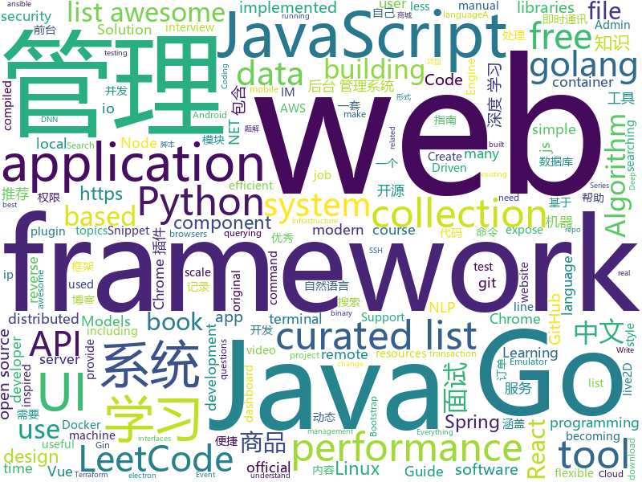

# 2019-05-07
See what the GitHub community is most excited about today.

## python
* [Python](https://github.com/TheAlgorithms/Python)(**543 stars today**): All Algorithms implemented in Python
* [PySnooper](https://github.com/cool-RR/PySnooper)(**145 stars today**): Never use print for debugging again
* [AiLearning](https://github.com/apachecn/AiLearning)(**86 stars today**): AiLearning: 机器学习 - MachineLearning - ML、深度学习 - DeepLearning - DL、自然语言处理 NLP
* [ChromeAppHeroes](https://github.com/zhaoolee/ChromeAppHeroes)(**90 stars today**): 🌈谷粒-Chrome插件英雄榜, 为优秀的Chrome插件写一本中文说明书, 让Chrome插件英雄们造福人类~ ChromePluginHeroes, Write a Chinese manual for the excellent Chrome plugin, let the Chrome plugin heroes benefit the human~
* [models](https://github.com/tensorflow/models)(**59 stars today**): Models and examples built with TensorFlow
* [zfsp](https://github.com/alcarithemad/zfsp)(**76 stars today**): ZFS, in Python, without reading the original C.
* [spending-tracker](https://github.com/j-c-peters/spending-tracker)(**69 stars today**): A simple, unified view of your transaction history across all your payment methods
* [system-design-primer](https://github.com/donnemartin/system-design-primer)(**59 stars today**): Learn how to design large-scale systems. Prep for the system design interview. Includes Anki flashcards.
* [awesome-python](https://github.com/vinta/awesome-python)(**60 stars today**): A curated list of awesome Python frameworks, libraries, software and resources
* [youtube-dl](https://github.com/ytdl-org/youtube-dl)(**54 stars today**): Command-line program to download videos from YouTube.com and other video sites
* [gpt-2](https://github.com/openai/gpt-2)(**53 stars today**): Code for the paper "Language Models are Unsupervised Multitask Learners"
* [flask](https://github.com/pallets/flask)(**37 stars today**): The Python micro framework for building web applications.
* [keras](https://github.com/keras-team/keras)(**42 stars today**): Deep Learning for humans
* [webanalyzer](https://github.com/fate0/webanalyzer)(**51 stars today**): webanalyzer wip
* [public-apis](https://github.com/toddmotto/public-apis)(**45 stars today**): A collective list of free APIs for use in software and web development.
* [cpython](https://github.com/python/cpython)(**32 stars today**): The Python programming language
* [awesome-machine-learning](https://github.com/josephmisiti/awesome-machine-learning)(**43 stars today**): A curated list of awesome Machine Learning frameworks, libraries and software.
* [qr-filetransfer](https://github.com/sdushantha/qr-filetransfer)(**45 stars today**): 📡Transfer files over WiFi between your computer and your smartphone from the terminal
* [CheatSheetSeries](https://github.com/OWASP/CheatSheetSeries)(**42 stars today**): The OWASP Cheat Sheet Series was created to provide a concise collection of high value information on specific application security topics.
* [faceswap](https://github.com/deepfakes/faceswap)(**37 stars today**): Non official project based on original /r/Deepfakes thread. Many thanks to him!
* [NeuronBlocks](https://github.com/microsoft/NeuronBlocks)(**43 stars today**): NLP DNN Toolkit - Building Your NLP DNN Models Like Playing Lego
* [ansible](https://github.com/ansible/ansible)(**34 stars today**): Ansible is a radically simple IT automation platform that makes your applications and systems easier to deploy. Avoid writing scripts or custom code to deploy and update your applications — automate in a language that approaches plain English, using SSH, with no agents to install on remote systems. https://docs.ansible.com/ansible/
* [django](https://github.com/django/django)(**32 stars today**): The Web framework for perfectionists with deadlines.
* [you-get](https://github.com/soimort/you-get)(**35 stars today**): ⏬Dumb downloader that scrapes the web
* [face_recognition](https://github.com/ageitgey/face_recognition)(**33 stars today**): The world's simplest facial recognition api for Python and the command line

## java
* [server](https://github.com/wildfirechat/server)(**365 stars today**): 全开源即时通讯(IM)系统
* [CS-Notes](https://github.com/CyC2018/CS-Notes)(**294 stars today**): 📚技术面试必备基础知识、Leetcode 题解、后端面试、Java 面试、春招、秋招、操作系统、计算机网络、系统设计
* [ip2region](https://github.com/lionsoul2014/ip2region)(**212 stars today**): Ip2region is a offline IP location library with accuracy rate of 99.9% and 0.0x millseconds searching performance. DB file is less then 5Mb with all ip address stored. binding for Java,PHP,C,Python,Nodejs,Golang,C#,lua. Binary,B-tree,Memory searching algorithm
* [JavaGuide](https://github.com/Snailclimb/JavaGuide)(**170 stars today**): 【Java学习+面试指南】 一份涵盖大部分Java程序员所需要掌握的核心知识。
* [sirix](https://github.com/sirixdb/sirix)(**112 stars today**): Sirix facilitates effective and efficient storing and querying of your temporal data through snapshotting (only ever appends changed database pages) and a novel versioning approach called sliding snapshot, which versions at the node level. Currently we support the storage and querying of XML- and JSON-documents in our binary encoding.
* [advanced-java](https://github.com/doocs/advanced-java)(**98 stars today**): 😮互联网 Java 工程师进阶知识完全扫盲：涵盖高并发、分布式、高可用、微服务等领域知识
* [mall](https://github.com/macrozheng/mall)(**75 stars today**): mall项目是一套电商系统，包括前台商城系统及后台管理系统，基于SpringBoot+MyBatis实现。 前台商城系统包含首页门户、商品推荐、商品搜索、商品展示、购物车、订单流程、会员中心、客户服务、帮助中心等模块。 后台管理系统包含商品管理、订单管理、会员管理、促销管理、运营管理、内容管理、统计报表、财务管理、权限管理、设置等模块。
* [DoraemonKit](https://github.com/didi/DoraemonKit)(**84 stars today**): 简称 "DoKit" 。一款功能齐全的客户端（ iOS 、Android ）研发助手，你值得拥有。
* [spring-boot](https://github.com/spring-projects/spring-boot)(**62 stars today**): Spring Boot
* [java-design-patterns](https://github.com/iluwatar/java-design-patterns)(**55 stars today**): Design patterns implemented in Java
* [bento](https://github.com/Yelp/bento)(**57 stars today**): A delicious framework for building modularized Android user interfaces, by Yelp.
* [spring-framework](https://github.com/spring-projects/spring-framework)(**46 stars today**): Spring Framework
* [android-chat](https://github.com/wildfirechat/android-chat)(**50 stars today**): 全开源即时通讯(IM)系统 高仿微信
* [UI2018](https://github.com/zincPower/UI2018)(**53 stars today**): 安卓高级UI代码整理和博客代码Demo
* [skywalking](https://github.com/apache/skywalking)(**46 stars today**): APM, Application Performance Monitoring System
* [tutorials](https://github.com/eugenp/tutorials)(**35 stars today**): The "REST With Spring" Course:
* [seata](https://github.com/seata/seata)(**44 stars today**): 🔥Seata is an easy-to-use, high-performance, java based, open source distributed transaction solution.
* [hutool](https://github.com/looly/hutool)(**45 stars today**): A set of tools that keep Java sweet.
* [ZXBlog](https://github.com/ZXZxin/ZXBlog)(**44 stars today**): 记录各种学习笔记(算法、Java、数据库、并发......)
* [halo](https://github.com/halo-dev/halo)(**42 stars today**): ✍ Halo 可能是最好的 Java 博客系统
* [Java](https://github.com/TheAlgorithms/Java)(**45 stars today**): All Algorithms implemented in Java
* [hsweb-framework](https://github.com/hs-web/hsweb-framework)(**35 stars today**): hsweb (haʊs wɛb) 是一个用于快速搭建企业后台管理系统的基础项目,集成一揽子便捷功能如:便捷的通用增删改查,强大的权限管理,动态多数据源,动态表单,在线数据库维护等. 基于 spring-boot,mybaits.
* [interviews](https://github.com/kdn251/interviews)(**41 stars today**): Everything you need to know to get the job.
* [elasticsearch](https://github.com/elastic/elasticsearch)(**38 stars today**): Open Source, Distributed, RESTful Search Engine
* [HanLP](https://github.com/hankcs/HanLP)(**38 stars today**): 自然语言处理 中文分词 词性标注 命名实体识别 依存句法分析 新词发现 关键词短语提取 自动摘要 文本分类聚类 拼音简繁

## unknown
* [go-perfbook](https://github.com/dgryski/go-perfbook)(**975 stars today**): Thoughts on Go performance optimization
* [LeetCodeAnimation](https://github.com/MisterBooo/LeetCodeAnimation)(**480 stars today**): Demonstrate all the questions on LeetCode in the form of animation.（用动画的形式呈现解LeetCode题目的思路）
* [industry-machine-learning](https://github.com/firmai/industry-machine-learning)(**181 stars today**): A curated list of applied machine learning and data science notebooks and libraries accross different industries.
* [aws_breaking_changes](https://github.com/SummitRoute/aws_breaking_changes)(**111 stars today**): List of changes announced for AWS that may break existing code
* [git-tips](https://github.com/521xueweihan/git-tips)(**79 stars today**): Git的奇技淫巧
* [gitignore](https://github.com/github/gitignore)(**57 stars today**): A collection of useful .gitignore templates
* [developer-roadmap](https://github.com/kamranahmedse/developer-roadmap)(**70 stars today**): Roadmap to becoming a web developer in 2019
* [awesome](https://github.com/sindresorhus/awesome)(**70 stars today**): 😎Awesome lists about all kinds of interesting topics
* [free-programming-books](https://github.com/EbookFoundation/free-programming-books)(**61 stars today**): 📚Freely available programming books
* [DeepLearning-500-questions](https://github.com/scutan90/DeepLearning-500-questions)(**58 stars today**): 深度学习500问，以问答形式对常用的概率知识、线性代数、机器学习、深度学习、计算机视觉等热点问题进行阐述，以帮助自己及有需要的读者。 全书分为18个章节，50余万字。由于水平有限，书中不妥之处恳请广大读者批评指正。 未完待续............ 如有意合作，联系scutjy2015@163.com 版权所有，违权必究 Tan 2018.06
* [commit-messages-guide](https://github.com/RomuloOliveira/commit-messages-guide)(**66 stars today**): A guide to understand the importance of commit messages and how to write them well
* [You-Dont-Know-JS](https://github.com/getify/You-Dont-Know-JS)(**61 stars today**): A book series on JavaScript. @YDKJS on twitter.
* [resources-of-learning](https://github.com/tagnja/resources-of-learning)(**62 stars today**): Documentations, books, courses, git repositories and so on.
* [awesome-remote-job](https://github.com/lukasz-madon/awesome-remote-job)(**49 stars today**): A curated list of awesome remote jobs and resources. Inspired by https://github.com/vinta/awesome-python
* [Trinity](https://github.com/TheOfficialFloW/Trinity)(**55 stars today**): Trinity Exploit - Emulator Escape
* [support.996.ICU](https://github.com/MSWorkers/support.996.ICU)(**52 stars today**): Microsoft and GitHub Workers Support 996.ICU
* [app-ideas](https://github.com/florinpop17/app-ideas)(**51 stars today**): A Collection of application ideas which can be used to improve your coding skills.
* [Book-Recommend-Github](https://github.com/iOShuyang/Book-Recommend-Github)(**45 stars today**): 推荐生活当中积累的优秀Objective-C和Swift三方库
* [fe-interview](https://github.com/haizlin/fe-interview)(**48 stars today**): 前端面试每日 3+1，以面试题来驱动学习，每天进步一点！
* [rust-web-developer-roadmap](https://github.com/csharad/rust-web-developer-roadmap)(**47 stars today**): Roadmap to becoming a Rust Web Developer in 2019
* [awesome-wechat-weapp](https://github.com/justjavac/awesome-wechat-weapp)(**44 stars today**): 微信小程序开发资源汇总💯
* [trackerslist](https://github.com/ngosang/trackerslist)(**44 stars today**): An updated list of public BitTorrent trackers
* [awesome-vue](https://github.com/vuejs/awesome-vue)(**41 stars today**): 🎉A curated list of awesome things related to Vue.js
* [pumpkin-book](https://github.com/datawhalechina/pumpkin-book)(**39 stars today**): 《机器学习》（西瓜书）公式推导解析，在线阅读地址：https://datawhalechina.github.io/pumpkin-book
* [996.Leave](https://github.com/623637646/996.Leave)(**37 stars today**): 逃离996

## javascript
* [leetcode](https://github.com/azl397985856/leetcode)(**379 stars today**): LeetCode Solutions: A Record of My Problem Solving Journey.( leetcode题解，记录自己的leetcode解题之路。)
* [nodebestpractices](https://github.com/i0natan/nodebestpractices)(**243 stars today**): ✅The largest Node.js best practices list (April 2019)
* [svelte](https://github.com/sveltejs/svelte)(**180 stars today**): Cybernetically enhanced web apps
* [react-material-dashboard](https://github.com/devias-io/react-material-dashboard)(**151 stars today**): React Dashboard made with Material UI’s components, React and of course create-react-app to boost your app development process!
* [vue](https://github.com/vuejs/vue)(**119 stars today**): 🖖Vue.js is a progressive, incrementally-adoptable JavaScript framework for building UI on the web.
* [response](https://github.com/monzo/response)(**119 stars today**): Monzo's real-time incident response and reporting tool⚡️
* [Lepton](https://github.com/hackjutsu/Lepton)(**111 stars today**): 💻Democratizing Snippet Management (macOS/Win/Linux)
* [UnblockNeteaseMusic](https://github.com/nondanee/UnblockNeteaseMusic)(**106 stars today**): Revive unavailable songs for Netease Cloud Music
* [hyper](https://github.com/zeit/hyper)(**109 stars today**): A terminal built on web technologies
* [react](https://github.com/facebook/react)(**82 stars today**): A declarative, efficient, and flexible JavaScript library for building user interfaces.
* [baiduyun](https://github.com/syhyz1990/baiduyun)(**79 stars today**): 🖖油猴脚本 一个脚本搞定百度网盘下载
* [tool](https://github.com/Louiszhai/tool)(**74 stars today**): 开发效率提升：Mac生产力工具链推荐
* [shepherd](https://github.com/shipshapecode/shepherd)(**76 stars today**): Guide your users through a tour of your app
* [Awesome-Design-Tools](https://github.com/LisaDziuba/Awesome-Design-Tools)(**73 stars today**): The best design tools for everything👉
* [uppy](https://github.com/transloadit/uppy)(**70 stars today**): The next open source file uploader for web browsers🐶
* [30-seconds-of-code](https://github.com/30-seconds/30-seconds-of-code)(**67 stars today**): A curated collection of useful JavaScript snippets that you can understand in 30 seconds or less.
* [storybook](https://github.com/storybooks/storybook)(**68 stars today**): UI component dev & test: React, Vue, Angular, React Native, Ember, Web Components & more!
* [Motrix](https://github.com/agalwood/Motrix)(**64 stars today**): A full-featured download manager.
* [sql.js](https://github.com/kripken/sql.js)(**64 stars today**): SQLite compiled to JavaScript through Emscripten
* [create-react-app](https://github.com/facebook/create-react-app)(**45 stars today**): Set up a modern web app by running one command.
* [puppeteer](https://github.com/GoogleChrome/puppeteer)(**53 stars today**): Headless Chrome Node API
* [javascript-algorithms](https://github.com/trekhleb/javascript-algorithms)(**53 stars today**): 📝Algorithms and data structures implemented in JavaScript with explanations and links to further readings
* [javascript](https://github.com/airbnb/javascript)(**55 stars today**): JavaScript Style Guide
* [pixi.js](https://github.com/pixijs/pixi.js)(**55 stars today**): The HTML5 Creation Engine: Create beautiful digital content with the fastest, most flexible 2D WebGL renderer.
* [shimport](https://github.com/Rich-Harris/shimport)(**52 stars today**): Use JavaScript modules in all browsers, including dynamic imports

## html
* [Python-100-Days](https://github.com/jackfrued/Python-100-Days)(**2,247 stars today**): Python - 100天从新手到大师
* [linux-command](https://github.com/jaywcjlove/linux-command)(**128 stars today**): Linux命令大全搜索工具，内容包含Linux命令手册、详解、学习、搜集。https://git.io/linux
* [nndl.github.io](https://github.com/nndl/nndl.github.io)(**68 stars today**): 《神经网络与深度学习》 Neural Network and Deep Learning
* [china-githuber.github.io](https://github.com/china-githuber/china-githuber.github.io)(**35 stars today**): The homepage of the china-githuber community.
* [windows-syscalls](https://github.com/j00ru/windows-syscalls)(**31 stars today**): Windows System Call Tables (NT/2000/XP/2003/Vista/2008/7/2012/8/10)
* [luda](https://github.com/oatw/luda)(**29 stars today**): A lightweight and responsive UI framework for modern web development.
* [AdminLTE](https://github.com/ColorlibHQ/AdminLTE)(**19 stars today**): AdminLTE - Free Premium Admin control Panel Theme Based On Bootstrap 3.x
* [Front-end-Developer-Interview-Questions](https://github.com/h5bp/Front-end-Developer-Interview-Questions)(**22 stars today**): A list of helpful front-end related questions you can use to interview potential candidates, test yourself or completely ignore.
* [CLRS](https://github.com/walkccc/CLRS)(**19 stars today**): 📚Solutions to Introduction to Algorithms Third Edition
* [water.css](https://github.com/kognise/water.css)(**14 stars today**): A just-add-css collection of styles to make simple websites just a little nicer
* [portainer](https://github.com/portainer/portainer)(**14 stars today**): Simple management UI for Docker
* [free-for-dev](https://github.com/ripienaar/free-for-dev)(**13 stars today**): A list of SaaS, PaaS and IaaS offerings that have free tiers of interest to devops and infradev
* [flutter-in-action](https://github.com/flutterchina/flutter-in-action)(**13 stars today**): 《Flutter实战》电子书
* [chinese-ig](https://github.com/w3c/chinese-ig)(**6 stars today**): Web中文兴趣组
* [dotnet](https://github.com/microsoft/dotnet)(**13 stars today**): This repo is the official home of .NET on GitHub. It's a great starting point to find many .NET OSS projects from Microsoft and the community, including many that are part of the .NET Foundation.
* [Spoon-Knife](https://github.com/octocat/Spoon-Knife)(****): This repo is for demonstration purposes only.
* [watchme](https://github.com/vsoch/watchme)(**12 stars today**): Reproducible watchers for research
* [Elf](https://github.com/fguby/Elf)(**12 stars today**): 使用electron和live2D开发的类似桌面精灵的应用（A desktop application developed using electron and live2D）
* [gentelella](https://github.com/ColorlibHQ/gentelella)(**11 stars today**): Free Bootstrap 3 Admin Template
* [tianchiorgame](https://github.com/lsh1994/tianchiorgame)(**9 stars today**): 天池比赛，kaggle，点石
* [personal-website](https://github.com/github/personal-website)(**5 stars today**): Code that'll help you kickstart a personal website that showcases your work as a software developer.
* [owasp-mstg](https://github.com/OWASP/owasp-mstg)(**11 stars today**): The Mobile Security Testing Guide (MSTG) is a comprehensive manual for mobile app security testing and reverse engineering.
* [en.javascript.info](https://github.com/javascript-tutorial/en.javascript.info)(**10 stars today**): Modern JavaScript Tutorial
* [sourcegraph](https://github.com/sourcegraph/sourcegraph)(**9 stars today**): Code search and navigation tool (self-hosted)
* [awesome-creative-coding](https://github.com/terkelg/awesome-creative-coding)(**10 stars today**): Creative Coding: Generative Art, Data visualization, Interaction Design, Resources.

## go
* [dexon](https://github.com/dexon-foundation/dexon)(**1,166 stars today**): Official golang DEXON fullnode implementation
* [dexon-consensus](https://github.com/dexon-foundation/dexon-consensus)(**732 stars today**): DEXON consensus Implementation & Simulation
* [sqlflow](https://github.com/sql-machine-learning/sqlflow)(**548 stars today**): Brings SQL and AI together.
* [komiser](https://github.com/mlabouardy/komiser)(**274 stars today**): AWS Environment Inspector👮
* [beam](https://github.com/eBay/beam)(**238 stars today**): A distributed knowledge graph store
* [auxpi](https://github.com/aimerforreimu/auxpi)(**173 stars today**): 🍭集合多家 API 的新一代图床
* [mr2](https://github.com/txthinking/mr2)(**172 stars today**): Expose local server to external network
* [kratos](https://github.com/bilibili/kratos)(**155 stars today**): Kratos是bilibili开源的一套Go微服务框架，包含大量微服务相关框架及工具。
* [keda](https://github.com/kedacore/keda)(**139 stars today**): KEDA is a Kubernetes-based Event Driven Autoscaling component. It provides event driven scale for any container running in Kubernetes
* [terraformer](https://github.com/GoogleCloudPlatform/terraformer)(**101 stars today**): CLI tool to generate terraform files from existing infrastructure (reverse Terraform). Infrastructure to Code
* [gameboy.live](https://github.com/HFO4/gameboy.live)(**101 stars today**): 🕹️A basic gameboy emulator with terminal "Cloud Gaming" support
* [kubernetes](https://github.com/kubernetes/kubernetes)(**60 stars today**): Production-Grade Container Scheduling and Management
* [go](https://github.com/golang/go)(**64 stars today**): The Go programming language
* [tidb-binlog](https://github.com/pingcap/tidb-binlog)(**62 stars today**): A tool used to collect and merge tidb's binlog for real-time data backup and synchronization.
* [git-tidy](https://github.com/drewwyatt/git-tidy)(**64 stars today**): Delete local git branches that have a remote tracking branch that is ": gone".
* [docker-slim](https://github.com/docker-slim/docker-slim)(**61 stars today**): DockerSlim (docker-slim): Don't change anything in your Docker container image and minify it by up to 30x (and for compiled languages even more) making it secure too! (free and open source)
* [termshark](https://github.com/gcla/termshark)(**58 stars today**): A terminal UI for tshark, inspired by Wireshark
* [the-way-to-go_ZH_CN](https://github.com/Unknwon/the-way-to-go_ZH_CN)(**53 stars today**): 《The Way to Go》中文译本，中文正式名《Go 入门指南》
* [awesome-go](https://github.com/avelino/awesome-go)(**54 stars today**): A curated list of awesome Go frameworks, libraries and software
* [termdash](https://github.com/mum4k/termdash)(**50 stars today**): Terminal based dashboard.
* [sshcode](https://github.com/cdr/sshcode)(**49 stars today**): Run VS Code on any server over SSH.
* [frp](https://github.com/fatedier/frp)(**43 stars today**): A fast reverse proxy to help you expose a local server behind a NAT or firewall to the internet.
* [gin](https://github.com/gin-gonic/gin)(**46 stars today**): Gin is a HTTP web framework written in Go (Golang). It features a Martini-like API with much better performance -- up to 40 times faster. If you need smashing performance, get yourself some Gin.
* [collection](https://github.com/jianfengye/collection)(**41 stars today**): go collection package for fasting coding
* [build-web-application-with-golang](https://github.com/astaxie/build-web-application-with-golang)(**35 stars today**): A golang ebook intro how to build a web with golang

## WordCloud

