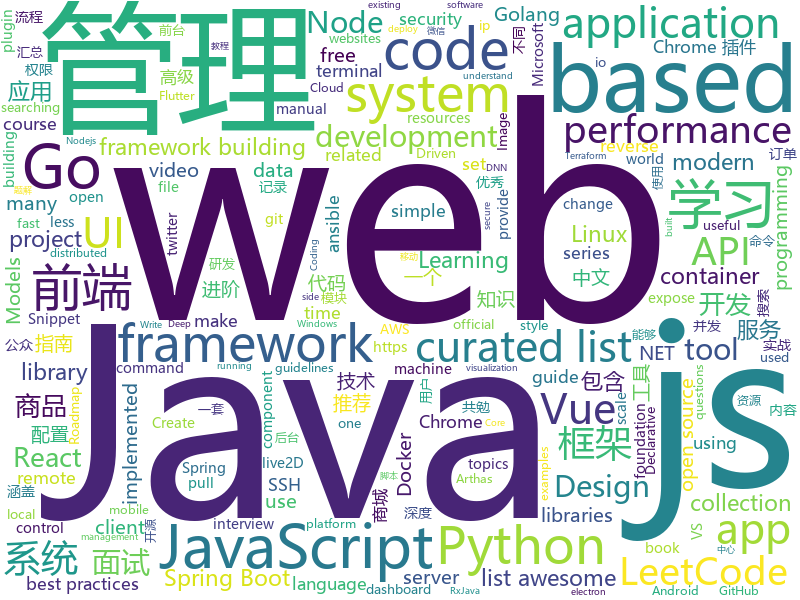

# 2019-05-08
See what the GitHub community is most excited about today.

## python
* [Python](https://github.com/TheAlgorithms/Python)(**745 stars today**): All Algorithms implemented in Python
* [NeuronBlocks](https://github.com/microsoft/NeuronBlocks)(**181 stars today**): NLP DNN Toolkit - Building Your NLP DNN Models Like Playing Lego
* [PySnooper](https://github.com/cool-RR/PySnooper)(**165 stars today**): Never use print for debugging again
* [ChromeAppHeroes](https://github.com/zhaoolee/ChromeAppHeroes)(**135 stars today**): 🌈谷粒-Chrome插件英雄榜, 为优秀的Chrome插件写一本中文说明书, 让Chrome插件英雄们造福人类~ ChromePluginHeroes, Write a Chinese manual for the excellent Chrome plugin, let the Chrome plugin heroes benefit the human~
* [AiLearning](https://github.com/apachecn/AiLearning)(**116 stars today**): AiLearning: 机器学习 - MachineLearning - ML、深度学习 - DeepLearning - DL、自然语言处理 NLP
* [public-apis](https://github.com/toddmotto/public-apis)(**94 stars today**): A collective list of free APIs for use in software and web development.
* [models](https://github.com/tensorflow/models)(**66 stars today**): Models and examples built with TensorFlow
* [system-design-primer](https://github.com/donnemartin/system-design-primer)(**78 stars today**): Learn how to design large-scale systems. Prep for the system design interview. Includes Anki flashcards.
* [awesome-python](https://github.com/vinta/awesome-python)(**74 stars today**): A curated list of awesome Python frameworks, libraries, software and resources
* [open_stt](https://github.com/snakers4/open_stt)(**79 stars today**): Russian open STT dataset
* [CppCoreGuidelines](https://github.com/isocpp/CppCoreGuidelines)(**62 stars today**): The C++ Core Guidelines are a set of tried-and-true guidelines, rules, and best practices about coding in C++
* [Awesome-PyTorch-Chinese](https://github.com/INTERMT/Awesome-PyTorch-Chinese)(**55 stars today**): 【干货】史上最全的PyTorch学习资源汇总
* [models](https://github.com/PaddlePaddle/models)(**54 stars today**): Pre-trained and Reproduced Deep Learning Models （经典复现模型）
* [ansible](https://github.com/ansible/ansible)(**41 stars today**): Ansible is a radically simple IT automation platform that makes your applications and systems easier to deploy. Avoid writing scripts or custom code to deploy and update your applications — automate in a language that approaches plain English, using SSH, with no agents to install on remote systems. https://docs.ansible.com/ansible/
* [altair](https://github.com/altair-viz/altair)(**53 stars today**): Declarative statistical visualization library for Python
* [youtube-dl](https://github.com/ytdl-org/youtube-dl)(**46 stars today**): Command-line program to download videos from YouTube.com and other video sites
* [keras](https://github.com/keras-team/keras)(**41 stars today**): Deep Learning for humans
* [flask](https://github.com/pallets/flask)(**44 stars today**): The Python micro framework for building web applications.
* [CheatSheetSeries](https://github.com/OWASP/CheatSheetSeries)(**43 stars today**): The OWASP Cheat Sheet Series was created to provide a concise collection of high value information on specific application security topics.
* [faceswap](https://github.com/deepfakes/faceswap)(**42 stars today**): Non official project based on original /r/Deepfakes thread. Many thanks to him!
* [you-get](https://github.com/soimort/you-get)(**41 stars today**): ⏬Dumb downloader that scrapes the web
* [cpython](https://github.com/python/cpython)(**27 stars today**): The Python programming language
* [face_recognition](https://github.com/ageitgey/face_recognition)(**35 stars today**): The world's simplest facial recognition api for Python and the command line
* [django](https://github.com/django/django)(**27 stars today**): The Web framework for perfectionists with deadlines.
* [SPADE](https://github.com/NVlabs/SPADE)(**35 stars today**): Semantic Image Synthesis with SPADE

## java
* [CS-Notes](https://github.com/CyC2018/CS-Notes)(**329 stars today**): 📚技术面试必备基础知识、Leetcode 题解、后端面试、Java 面试、春招、秋招、操作系统、计算机网络、系统设计
* [server](https://github.com/wildfirechat/server)(**332 stars today**): 全开源即时通讯(IM)系统
* [JavaGuide](https://github.com/Snailclimb/JavaGuide)(**239 stars today**): 【Java学习+面试指南】 一份涵盖大部分Java程序员所需要掌握的核心知识。
* [advanced-java](https://github.com/doocs/advanced-java)(**125 stars today**): 😮互联网 Java 工程师进阶知识完全扫盲：涵盖高并发、分布式、高可用、微服务等领域知识
* [mall](https://github.com/macrozheng/mall)(**83 stars today**): mall项目是一套电商系统，包括前台商城系统及后台管理系统，基于SpringBoot+MyBatis实现。 前台商城系统包含首页门户、商品推荐、商品搜索、商品展示、购物车、订单流程、会员中心、客户服务、帮助中心等模块。 后台管理系统包含商品管理、订单管理、会员管理、促销管理、运营管理、内容管理、统计报表、财务管理、权限管理、设置等模块。
* [AndroidProject](https://github.com/getActivity/AndroidProject)(**90 stars today**): An advanced template project
* [ip2region](https://github.com/lionsoul2014/ip2region)(**91 stars today**): Ip2region is a offline IP location library with accuracy rate of 99.9% and 0.0x millseconds searching performance. DB file is less then 5Mb with all ip address stored. binding for Java,PHP,C,Python,Nodejs,Golang,C#,lua. Binary,B-tree,Memory searching algorithm
* [arthas](https://github.com/alibaba/arthas)(**84 stars today**): Alibaba Java Diagnostic Tool Arthas/Alibaba Java诊断利器Arthas
* [DoraemonKit](https://github.com/didi/DoraemonKit)(**79 stars today**): 简称 "DoKit" 。一款功能齐全的客户端（ iOS 、Android ）研发助手，你值得拥有。
* [spring-boot-examples](https://github.com/ityouknow/spring-boot-examples)(**63 stars today**): about learning Spring Boot via examples. Spring Boot 教程、技术栈示例代码，快速简单上手教程。
* [flogger](https://github.com/google/flogger)(**79 stars today**): A Fluent Logging API for Java
* [Java](https://github.com/TheAlgorithms/Java)(**69 stars today**): All Algorithms implemented in Java
* [tutorials](https://github.com/eugenp/tutorials)(**40 stars today**): The "REST With Spring" Course:
* [UI2018](https://github.com/zincPower/UI2018)(**61 stars today**): 安卓高级UI代码整理和博客代码Demo
* [apollo](https://github.com/ctripcorp/apollo)(**56 stars today**): Apollo（阿波罗）是携程框架部门研发的分布式配置中心，能够集中化管理应用不同环境、不同集群的配置，配置修改后能够实时推送到应用端，并且具备规范的权限、流程治理等特性，适用于微服务配置管理场景。
* [spring-boot](https://github.com/spring-projects/spring-boot)(**47 stars today**): Spring Boot
* [RxJava2-Operators-Sample](https://github.com/KunMinX/RxJava2-Operators-Sample)(**59 stars today**): 你用不惯 RxJava，只因缺了这把钥匙🔑You are not used to RxJava, just because of the lack of this key.
* [elasticsearch](https://github.com/elastic/elasticsearch)(**49 stars today**): Open Source, Distributed, RESTful Search Engine
* [hutool](https://github.com/looly/hutool)(**48 stars today**): A set of tools that keep Java sweet.
* [spring-framework](https://github.com/spring-projects/spring-framework)(**38 stars today**): Spring Framework
* [skywalking](https://github.com/apache/skywalking)(**44 stars today**): APM, Application Performance Monitoring System
* [Spring-Boot-In-Action](https://github.com/hansonwang99/Spring-Boot-In-Action)(**44 stars today**): Spring Boot 系列实战合集
* [litemall](https://github.com/linlinjava/litemall)(**40 stars today**): 又一个小商城。litemall = Spring Boot后端 + Vue管理员前端 + 微信小程序用户前端 + Vue用户移动端
* [java-design-patterns](https://github.com/iluwatar/java-design-patterns)(**41 stars today**): Design patterns implemented in Java
* [ZXBlog](https://github.com/ZXZxin/ZXBlog)(**44 stars today**): 记录各种学习笔记(算法、Java、数据库、并发......)

## unknown
* [go-perfbook](https://github.com/dgryski/go-perfbook)(**1,286 stars today**): Thoughts on Go performance optimization
* [LeetCodeAnimation](https://github.com/MisterBooo/LeetCodeAnimation)(**634 stars today**): Demonstrate all the questions on LeetCode in the form of animation.（用动画的形式呈现解LeetCode题目的思路）
* [PowerToys](https://github.com/microsoft/PowerToys)(**394 stars today**): Windows system utilities to maximize productivity
* [gitignore](https://github.com/github/gitignore)(**75 stars today**): A collection of useful .gitignore templates
* [FlutterCreateSubmissions2019](https://github.com/pinkeshdarji/FlutterCreateSubmissions2019)(**83 stars today**): An Effort to gather all Flutter Create App submissions at one place from various resources.
* [developer-roadmap](https://github.com/kamranahmedse/developer-roadmap)(**79 stars today**): Roadmap to becoming a web developer in 2019
* [git-tips](https://github.com/521xueweihan/git-tips)(**78 stars today**): Git的奇技淫巧
* [awesome](https://github.com/sindresorhus/awesome)(**79 stars today**): 😎Awesome lists about all kinds of interesting topics
* [free-programming-books](https://github.com/EbookFoundation/free-programming-books)(**73 stars today**): 📚Freely available programming books
* [You-Dont-Know-JS](https://github.com/getify/You-Dont-Know-JS)(**66 stars today**): A book series on JavaScript. @YDKJS on twitter.
* [Book-Recommend-Github](https://github.com/iOShuyang/Book-Recommend-Github)(**69 stars today**): 推荐生活当中积累的优秀Objective-C和Swift三方库
* [Android-Daily-Interview](https://github.com/Moosphan/Android-Daily-Interview)(**71 stars today**): 每工作日更新一道 Android 面试题，小聚成河，大聚成江，共勉之～
* [blog](https://github.com/yygmind/blog)(**66 stars today**): 我是木易杨，公众号「高级前端进阶」作者，跟着我每周重点攻克一个前端面试重难点。接下来让我带你走进高级前端的世界，在进阶的路上，共勉！
* [support.996.ICU](https://github.com/MSWorkers/support.996.ICU)(**66 stars today**): Microsoft and GitHub Workers Support 996.ICU
* [industry-machine-learning](https://github.com/firmai/industry-machine-learning)(**65 stars today**): A curated list of applied machine learning and data science notebooks and libraries accross different industries.
* [aws_breaking_changes](https://github.com/SummitRoute/aws_breaking_changes)(**58 stars today**): List of changes announced for AWS that may break existing code
* [resources-of-learning](https://github.com/tagnja/resources-of-learning)(**52 stars today**): Documentations, books, courses, git repositories and so on.
* [996.Leave](https://github.com/623637646/996.Leave)(**53 stars today**): 逃离996
* [Nodejs-Roadmap](https://github.com/Q-Angelo/Nodejs-Roadmap)(**48 stars today**): 【Nodejs-Roadmap】侧重于Node.js服务端的开发指南，公众号“Node.js技术栈”
* [awesome-wechat-weapp](https://github.com/justjavac/awesome-wechat-weapp)(**45 stars today**): 微信小程序开发资源汇总💯
* [project-based-learning](https://github.com/tuvtran/project-based-learning)(**46 stars today**): Curated list of project-based tutorials
* [awesome-vue](https://github.com/vuejs/awesome-vue)(**47 stars today**): 🎉A curated list of awesome things related to Vue.js
* [vscode-remote-release](https://github.com/microsoft/vscode-remote-release)(**47 stars today**): Visual Studio Code Remote Development: Open any folder in WSL, in a Docker container, or on a remote machine using SSH and take advantage of VS Code's full feature set.
* [awesome-wysiwyg](https://github.com/JefMari/awesome-wysiwyg)(**47 stars today**): A curated list of awesome WYSIWYG editors.
* [commit-messages-guide](https://github.com/RomuloOliveira/commit-messages-guide)(**45 stars today**): A guide to understand the importance of commit messages and how to write them well

## javascript
* [leetcode](https://github.com/azl397985856/leetcode)(**470 stars today**): LeetCode Solutions: A Record of My Problem Solving Journey.( leetcode题解，记录自己的leetcode解题之路。)
* [nodebestpractices](https://github.com/i0natan/nodebestpractices)(**271 stars today**): ✅The largest Node.js best practices list (April 2019)
* [react-material-dashboard](https://github.com/devias-io/react-material-dashboard)(**172 stars today**): React Dashboard made with Material UI’s components, React and of course create-react-app to boost your app development process!
* [hyper](https://github.com/zeit/hyper)(**159 stars today**): A terminal built on web technologies
* [svelte](https://github.com/sveltejs/svelte)(**153 stars today**): Cybernetically enhanced web apps
* [jsmpeg](https://github.com/phoboslab/jsmpeg)(**126 stars today**): MPEG1 Video Decoder in JavaScript
* [vue](https://github.com/vuejs/vue)(**111 stars today**): 🖖Vue.js is a progressive, incrementally-adoptable JavaScript framework for building UI on the web.
* [Lepton](https://github.com/hackjutsu/Lepton)(**90 stars today**): 💻Democratizing Snippet Management (macOS/Win/Linux)
* [react](https://github.com/facebook/react)(**77 stars today**): A declarative, efficient, and flexible JavaScript library for building user interfaces.
* [lxhToolHTTPDecrypt](https://github.com/lyxhh/lxhToolHTTPDecrypt)(**76 stars today**): HTTPDecrypt
* [response](https://github.com/monzo/response)(**81 stars today**): Monzo's real-time incident response and reporting tool⚡️
* [UnblockNeteaseMusic](https://github.com/nondanee/UnblockNeteaseMusic)(**69 stars today**): Revive unavailable songs for Netease Cloud Music
* [puppeteer](https://github.com/GoogleChrome/puppeteer)(**65 stars today**): Headless Chrome Node API
* [create-react-app](https://github.com/facebook/create-react-app)(**56 stars today**): Set up a modern web app by running one command.
* [Watch-Me-Build-a-Trading-Bot](https://github.com/llSourcell/Watch-Me-Build-a-Trading-Bot)(**62 stars today**): This is the code for "Watch Me Build a Trading Bot" by Siraj Raval on Youtube
* [p5.js](https://github.com/processing/p5.js)(**67 stars today**): p5.js is a client-side JS platform that empowers artists, designers, students, and anyone to learn to code and express themselves creatively on the web. It is based on the core principles of Processing. http://twitter.com/p5xjs —
* [baiduyun](https://github.com/syhyz1990/baiduyun)(**67 stars today**): 🖖油猴脚本 一个脚本搞定百度网盘下载
* [javascript](https://github.com/airbnb/javascript)(**61 stars today**): JavaScript Style Guide
* [react-native](https://github.com/facebook/react-native)(**60 stars today**): A framework for building native apps with React.
* [axios](https://github.com/axios/axios)(**59 stars today**): Promise based HTTP client for the browser and node.js
* [CVE-2019-9810](https://github.com/0vercl0k/CVE-2019-9810)(**60 stars today**): Exploit for CVE-2019-9810 Firefox on Windows 64 bits.
* [monaco-editor](https://github.com/microsoft/monaco-editor)(**61 stars today**): A browser based code editor
* [uni-app](https://github.com/dcloudio/uni-app)(**57 stars today**): 使用 Vue.js 开发跨平台应用的前端框架
* [tool](https://github.com/Louiszhai/tool)(**55 stars today**): 开发效率提升：Mac生产力工具链推荐
* [30-seconds-of-code](https://github.com/30-seconds/30-seconds-of-code)(**57 stars today**): A curated collection of useful JavaScript snippets that you can understand in 30 seconds or less.

## html
* [Python-100-Days](https://github.com/jackfrued/Python-100-Days)(**2,256 stars today**): Python - 100天从新手到大师
* [linux-command](https://github.com/jaywcjlove/linux-command)(**66 stars today**): Linux命令大全搜索工具，内容包含Linux命令手册、详解、学习、搜集。https://git.io/linux
* [nndl.github.io](https://github.com/nndl/nndl.github.io)(**67 stars today**): 《神经网络与深度学习》 Neural Network and Deep Learning
* [water.css](https://github.com/kognise/water.css)(**31 stars today**): A just-add-css collection of styles to make simple websites just a little nicer
* [clash](https://github.com/frainzy1477/clash)(**29 stars today**): Clash for openwrt
* [windows-syscalls](https://github.com/j00ru/windows-syscalls)(**29 stars today**): Windows System Call Tables (NT/2000/XP/2003/Vista/2008/7/2012/8/10)
* [en.javascript.info](https://github.com/javascript-tutorial/en.javascript.info)(**26 stars today**): Modern JavaScript Tutorial
* [dotnet](https://github.com/microsoft/dotnet)(**26 stars today**): This repo is the official home of .NET on GitHub. It's a great starting point to find many .NET OSS projects from Microsoft and the community, including many that are part of the .NET Foundation.
* [Front-end-Developer-Interview-Questions](https://github.com/h5bp/Front-end-Developer-Interview-Questions)(**24 stars today**): A list of helpful front-end related questions you can use to interview potential candidates, test yourself or completely ignore.
* [AdminLTE](https://github.com/ColorlibHQ/AdminLTE)(**22 stars today**): AdminLTE - Free Premium Admin control Panel Theme Based On Bootstrap 3.x
* [flutter-in-action](https://github.com/flutterchina/flutter-in-action)(**23 stars today**): 《Flutter实战》电子书
* [luda](https://github.com/oatw/luda)(**23 stars today**): A lightweight and responsive UI framework for modern web development.
* [Spoon-Knife](https://github.com/octocat/Spoon-Knife)(****): This repo is for demonstration purposes only.
* [kubernetes-failure-stories](https://github.com/hjacobs/kubernetes-failure-stories)(**20 stars today**): Compilation of public failure/horror stories related to Kubernetes
* [styleguide](https://github.com/google/styleguide)(**14 stars today**): Style guides for Google-originated open-source projects
* [Elf](https://github.com/fguby/Elf)(**17 stars today**): 使用electron和live2D开发的类似桌面精灵的应用（A desktop application developed using electron and live2D）
* [portainer](https://github.com/portainer/portainer)(**16 stars today**): Simple management UI for Docker
* [owasp-mstg](https://github.com/OWASP/owasp-mstg)(**14 stars today**): The Mobile Security Testing Guide (MSTG) is a comprehensive manual for mobile app security testing and reverse engineering.
* [mxgraph](https://github.com/jgraph/mxgraph)(**11 stars today**): mxGraph is a fully client side JavaScript diagramming library
* [fastText](https://github.com/facebookresearch/fastText)(**10 stars today**): Library for fast text representation and classification.
* [WebFundamentals](https://github.com/google/WebFundamentals)(**12 stars today**): Best practices for modern web development
* [mescroll](https://github.com/mescroll/mescroll)(**11 stars today**): 精致的下拉刷新和上拉加载 js框架.支持vue,完美运行于移动端和主流PC浏览器 (JS framework for pull-refresh and pull-up-loading)
* [IsometricSass](https://github.com/MorganCaron/IsometricSass)(**11 stars today**): Sass library to make isometric 2D without javascript
* [design-tips](https://github.com/caneco/design-tips)(**10 stars today**): The “🔥Design Tips” series, now in TailwindCSS
* [awesome-creative-coding](https://github.com/terkelg/awesome-creative-coding)(**9 stars today**): Creative Coding: Generative Art, Data visualization, Interaction Design, Resources.

## go
* [sqlflow](https://github.com/sql-machine-learning/sqlflow)(**453 stars today**): Brings SQL and AI together.
* [keda](https://github.com/kedacore/keda)(**283 stars today**): KEDA is a Kubernetes-based Event Driven Autoscaling component. It provides event driven scale for any container running in Kubernetes
* [dexon](https://github.com/dexon-foundation/dexon)(**168 stars today**): Official golang DEXON fullnode implementation
* [dexon-consensus](https://github.com/dexon-foundation/dexon-consensus)(**130 stars today**): DEXON consensus Implementation & Simulation
* [beam](https://github.com/eBay/beam)(**124 stars today**): A distributed knowledge graph store
* [terraformer](https://github.com/GoogleCloudPlatform/terraformer)(**115 stars today**): CLI tool to generate terraform files from existing infrastructure (reverse Terraform). Infrastructure to Code
* [kratos](https://github.com/bilibili/kratos)(**99 stars today**): Kratos是bilibili开源的一套Go微服务框架，包含大量微服务相关框架及工具。
* [komiser](https://github.com/mlabouardy/komiser)(**100 stars today**): AWS Environment Inspector👮
* [auxpi](https://github.com/aimerforreimu/auxpi)(**91 stars today**): 🍭集合多家 API 的新一代图床
* [mr2](https://github.com/txthinking/mr2)(**85 stars today**): Expose local server to external network
* [kubernetes](https://github.com/kubernetes/kubernetes)(**71 stars today**): Production-Grade Container Scheduling and Management
* [go](https://github.com/golang/go)(**71 stars today**): The Go programming language
* [the-way-to-go_ZH_CN](https://github.com/Unknwon/the-way-to-go_ZH_CN)(**58 stars today**): 《The Way to Go》中文译本，中文正式名《Go 入门指南》
* [sshcode](https://github.com/cdr/sshcode)(**62 stars today**): Run VS Code on any server over SSH.
* [gui](https://github.com/faiface/gui)(**62 stars today**): Super minimal, rock-solid foundation for concurrent GUI in Go.
* [gameboy.live](https://github.com/HFO4/gameboy.live)(**60 stars today**): 🕹️A basic gameboy emulator with terminal "Cloud Gaming" support
* [gin](https://github.com/gin-gonic/gin)(**51 stars today**): Gin is a HTTP web framework written in Go (Golang). It features a Martini-like API with much better performance -- up to 40 times faster. If you need smashing performance, get yourself some Gin.
* [frp](https://github.com/fatedier/frp)(**46 stars today**): A fast reverse proxy to help you expose a local server behind a NAT or firewall to the internet.
* [awesome-go](https://github.com/avelino/awesome-go)(**47 stars today**): A curated list of awesome Go frameworks, libraries and software
* [istio](https://github.com/istio/istio)(**41 stars today**): Connect, secure, control, and observe services.
* [termshark](https://github.com/gcla/termshark)(**38 stars today**): A terminal UI for tshark, inspired by Wireshark
* [termdash](https://github.com/mum4k/termdash)(**37 stars today**): Terminal based dashboard.
* [tidb-binlog](https://github.com/pingcap/tidb-binlog)(**31 stars today**): A tool used to collect and merge tidb's binlog for real-time data backup and synchronization.
* [hugo](https://github.com/gohugoio/hugo)(**31 stars today**): The world’s fastest framework for building websites.
* [docker-slim](https://github.com/docker-slim/docker-slim)(**30 stars today**): DockerSlim (docker-slim): Don't change anything in your Docker container image and minify it by up to 30x (and for compiled languages even more) making it secure too! (free and open source)

## WordCloud

