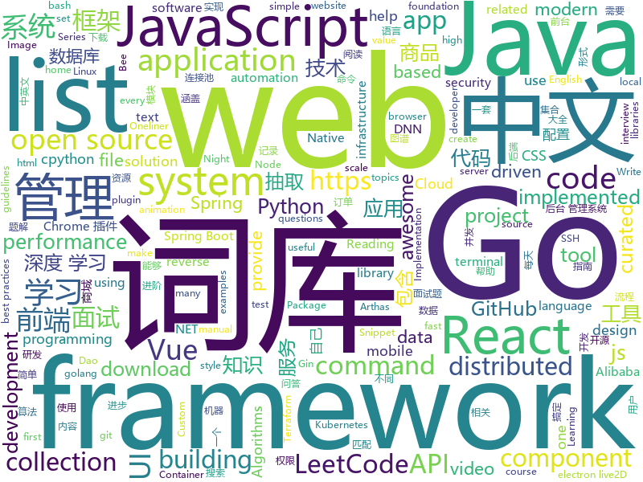

# 2019-05-09
See what the GitHub community is most excited about today.

## python
* [Python](https://github.com/TheAlgorithms/Python)(**489 stars today**): All Algorithms implemented in Python
* [self-driving-desktop](https://github.com/hofstadter-io/self-driving-desktop)(**228 stars today**): Desktop Automation framework
* [PySnooper](https://github.com/cool-RR/PySnooper)(**132 stars today**): Never use print for debugging again
* [AiLearning](https://github.com/apachecn/AiLearning)(**91 stars today**): AiLearning: 机器学习 - MachineLearning - ML、深度学习 - DeepLearning - DL、自然语言处理 NLP
* [models](https://github.com/tensorflow/models)(**62 stars today**): Models and examples built with TensorFlow
* [ChromeAppHeroes](https://github.com/zhaoolee/ChromeAppHeroes)(**75 stars today**): 🌈谷粒-Chrome插件英雄榜, 为优秀的Chrome插件写一本中文说明书, 让Chrome插件英雄们造福人类~ ChromePluginHeroes, Write a Chinese manual for the excellent Chrome plugin, let the Chrome plugin heroes benefit the human~
* [Awesome-PyTorch-Chinese](https://github.com/INTERMT/Awesome-PyTorch-Chinese)(**76 stars today**): 【干货】史上最全的PyTorch学习资源汇总
* [awesome-python](https://github.com/vinta/awesome-python)(**65 stars today**): A curated list of awesome Python frameworks, libraries, software and resources
* [system-design-primer](https://github.com/donnemartin/system-design-primer)(**65 stars today**): Learn how to design large-scale systems. Prep for the system design interview. Includes Anki flashcards.
* [public-apis](https://github.com/toddmotto/public-apis)(**67 stars today**): A collective list of free APIs for use in software and web development.
* [funNLP](https://github.com/fighting41love/funNLP)(**55 stars today**): 中英文敏感词、语言检测、中外手机/电话归属地/运营商查询、名字推断性别、手机号抽取、身份证抽取、邮箱抽取、中日文人名库、中文缩写库、拆字词典、词汇情感值、停用词、反动词表、暴恐词表、繁简体转换、英文模拟中文发音、汪峰歌词生成器、职业名称词库、同义词库、反义词库、否定词库、汽车品牌词库、汽车零件词库、连续英文切割、各种中文词向量、公司名字大全、古诗词库、IT词库、财经词库、成语词库、地名词库、历史名人词库、诗词词库、医学词库、饮食词库、法律词库、汽车词库、动物词库、中文聊天语料、中文谣言数据、百度中文问答数据集、句子相似度匹配算法集合、bert资源、文本生成&摘要相关工具、cocoNLP信息抽取工具、国内电话号码正则匹配、清华大学XLORE:中英文跨语言百科知识图谱、清华大学人工智能技术…
* [manim](https://github.com/3b1b/manim)(**50 stars today**): Animation engine for explanatory math videos
* [NeuronBlocks](https://github.com/microsoft/NeuronBlocks)(**50 stars today**): NLP DNN Toolkit - Building Your NLP DNN Models Like Playing Lego
* [CheatSheetSeries](https://github.com/OWASP/CheatSheetSeries)(**50 stars today**): The OWASP Cheat Sheet Series was created to provide a concise collection of high value information on specific application security topics.
* [CppCoreGuidelines](https://github.com/isocpp/CppCoreGuidelines)(**50 stars today**): The C++ Core Guidelines are a set of tried-and-true guidelines, rules, and best practices about coding in C++
* [youtube-dl](https://github.com/ytdl-org/youtube-dl)(**42 stars today**): Command-line program to download videos from YouTube.com and other video sites
* [keras](https://github.com/keras-team/keras)(**36 stars today**): Deep Learning for humans
* [face_recognition](https://github.com/ageitgey/face_recognition)(**41 stars today**): The world's simplest facial recognition api for Python and the command line
* [django](https://github.com/django/django)(**34 stars today**): The Web framework for perfectionists with deadlines.
* [home-assistant](https://github.com/home-assistant/home-assistant)(**35 stars today**): 🏡Open source home automation that puts local control and privacy first
* [SPADE](https://github.com/NVlabs/SPADE)(**35 stars today**): Semantic Image Synthesis with SPADE
* [ansible](https://github.com/ansible/ansible)(**33 stars today**): Ansible is a radically simple IT automation platform that makes your applications and systems easier to deploy. Avoid writing scripts or custom code to deploy and update your applications — automate in a language that approaches plain English, using SSH, with no agents to install on remote systems. https://docs.ansible.com/ansible/
* [PyOne](https://github.com/abbeyokgo/PyOne)(**35 stars today**): PyOne-directory of onedrive
* [flask](https://github.com/pallets/flask)(**33 stars today**): The Python micro framework for building web applications.
* [cpython](https://github.com/python/cpython)(**25 stars today**): The Python programming language

## java
* [CS-Notes](https://github.com/CyC2018/CS-Notes)(**306 stars today**): 📚技术面试必备基础知识、Leetcode 题解、后端面试、Java 面试、春招、秋招、操作系统、计算机网络、系统设计
* [JavaGuide](https://github.com/Snailclimb/JavaGuide)(**203 stars today**): 【Java学习+面试指南】 一份涵盖大部分Java程序员所需要掌握的核心知识。
* [server](https://github.com/wildfirechat/server)(**146 stars today**): 全开源即时通讯(IM)系统
* [advanced-java](https://github.com/doocs/advanced-java)(**109 stars today**): 😮互联网 Java 工程师进阶知识完全扫盲：涵盖高并发、分布式、高可用、微服务等领域知识
* [spring-boot-examples](https://github.com/ityouknow/spring-boot-examples)(**71 stars today**): about learning Spring Boot via examples. Spring Boot 教程、技术栈示例代码，快速简单上手教程。
* [mall](https://github.com/macrozheng/mall)(**63 stars today**): mall项目是一套电商系统，包括前台商城系统及后台管理系统，基于SpringBoot+MyBatis实现。 前台商城系统包含首页门户、商品推荐、商品搜索、商品展示、购物车、订单流程、会员中心、客户服务、帮助中心等模块。 后台管理系统包含商品管理、订单管理、会员管理、促销管理、运营管理、内容管理、统计报表、财务管理、权限管理、设置等模块。
* [spring-boot](https://github.com/spring-projects/spring-boot)(**59 stars today**): Spring Boot
* [Java](https://github.com/TheAlgorithms/Java)(**61 stars today**): All Algorithms implemented in Java
* [arthas](https://github.com/alibaba/arthas)(**61 stars today**): Alibaba Java Diagnostic Tool Arthas/Alibaba Java诊断利器Arthas
* [DoraemonKit](https://github.com/didi/DoraemonKit)(**54 stars today**): 简称 "DoKit" 。一款功能齐全的客户端（ iOS 、Android ）研发助手，你值得拥有。
* [hutool](https://github.com/looly/hutool)(**49 stars today**): A set of tools that keep Java sweet.
* [react-native-fast-image](https://github.com/DylanVann/react-native-fast-image)(**52 stars today**): 🚩FastImage, performant React Native image component.
* [spring-framework](https://github.com/spring-projects/spring-framework)(**39 stars today**): Spring Framework
* [elasticsearch](https://github.com/elastic/elasticsearch)(**44 stars today**): Open Source, Distributed, RESTful Search Engine
* [apollo](https://github.com/ctripcorp/apollo)(**40 stars today**): Apollo（阿波罗）是携程框架部门研发的分布式配置中心，能够集中化管理应用不同环境、不同集群的配置，配置修改后能够实时推送到应用端，并且具备规范的权限、流程治理等特性，适用于微服务配置管理场景。
* [tutorials](https://github.com/eugenp/tutorials)(**21 stars today**): The "REST With Spring" Course:
* [litemall](https://github.com/linlinjava/litemall)(**36 stars today**): 又一个小商城。litemall = Spring Boot后端 + Vue管理员前端 + 微信小程序用户前端 + Vue用户移动端
* [bee](https://github.com/automvc/bee)(**41 stars today**): Bee is an easy and high efficiency ORM framework.You don't need to write the Dao by yourself anymore. 有了简单、高效的ORM框架Bee,你可以不用再写dao代码。
* [skywalking](https://github.com/apache/skywalking)(**38 stars today**): APM, Application Performance Monitoring System
* [spring-cloud-alibaba](https://github.com/spring-cloud-incubator/spring-cloud-alibaba)(**37 stars today**): Spring Cloud Alibaba provides a one-stop solution for application development for the distributed solutions of Alibaba middleware.
* [java-design-patterns](https://github.com/iluwatar/java-design-patterns)(**34 stars today**): Design patterns implemented in Java
* [ZXBlog](https://github.com/ZXZxin/ZXBlog)(**34 stars today**): 记录各种学习笔记(算法、Java、数据库、并发......)
* [halo](https://github.com/halo-dev/halo)(**31 stars today**): ✍ Halo 可能是最好的 Java 博客系统
* [druid](https://github.com/alibaba/druid)(**30 stars today**): 阿里巴巴数据库事业部出品，为监控而生的数据库连接池。阿里云Data Lake Analytics(https://www.aliyun.com/product/datalakeanalytics )、DRDS、TDDL 连接池powered by Druid
* [UI2018](https://github.com/zincPower/UI2018)(**33 stars today**): 安卓高级UI代码整理和博客代码Demo

## unknown
* [PowerToys](https://github.com/microsoft/PowerToys)(**683 stars today**): Windows system utilities to maximize productivity
* [LeetCodeAnimation](https://github.com/MisterBooo/LeetCodeAnimation)(**620 stars today**): Demonstrate all the questions on LeetCode in the form of animation.（用动画的形式呈现解LeetCode题目的思路）
* [go-perfbook](https://github.com/dgryski/go-perfbook)(**377 stars today**): Thoughts on Go performance optimization
* [conference](https://github.com/gopherchina/conference)(**103 stars today**): 
* [pysot](https://github.com/STVIR/pysot)(**104 stars today**): 
* [Data-Science--Cheat-Sheet](https://github.com/abhat222/Data-Science--Cheat-Sheet)(**85 stars today**): Cheat Sheets
* [gitignore](https://github.com/github/gitignore)(**76 stars today**): A collection of useful .gitignore templates
* [Bash-Oneliner](https://github.com/onceupon/Bash-Oneliner)(**91 stars today**): Bash Oneliner will focus on bash commands for parsing plain text; some of the commands are for system maintaining. I apologize that there won't be any citation of the code, but they are probably from dear Google and Stackoverflow. Not all the code here are oneliner (if the ';' counts..). English and bash are not my first language, so... correct …
* [fe-interview](https://github.com/haizlin/fe-interview)(**84 stars today**): 前端面试每日 3+1，以面试题来驱动学习，每天进步一点！
* [awesome](https://github.com/sindresorhus/awesome)(**80 stars today**): 😎Awesome lists about all kinds of interesting topics
* [architect-awesome](https://github.com/xingshaocheng/architect-awesome)(**72 stars today**): 后端架构师技术图谱
* [free-programming-books](https://github.com/EbookFoundation/free-programming-books)(**66 stars today**): 📚Freely available programming books
* [developer-roadmap](https://github.com/kamranahmedse/developer-roadmap)(**66 stars today**): Roadmap to becoming a web developer in 2019
* [You-Dont-Know-JS](https://github.com/getify/You-Dont-Know-JS)(**62 stars today**): A book series on JavaScript. @YDKJS on twitter.
* [git-tips](https://github.com/521xueweihan/git-tips)(**57 stars today**): Git的奇技淫巧
* [CPython-Internals](https://github.com/zpoint/CPython-Internals)(**64 stars today**): Dive into cpython internal, trying to illustrate every detail of cpython implementation | cpython源码阅读笔记, 多图展示底层实现细节
* [Daily-Interview-Question](https://github.com/Advanced-Frontend/Daily-Interview-Question)(**63 stars today**): 我是木易杨，公众号「高级前端进阶」作者，每天搞定一道前端大厂面试题，祝大家天天进步，一年后会看到不一样的自己。
* [DeepLearning-500-questions](https://github.com/scutan90/DeepLearning-500-questions)(**50 stars today**): 深度学习500问，以问答形式对常用的概率知识、线性代数、机器学习、深度学习、计算机视觉等热点问题进行阐述，以帮助自己及有需要的读者。 全书分为18个章节，50余万字。由于水平有限，书中不妥之处恳请广大读者批评指正。 未完待续............ 如有意合作，联系scutjy2015@163.com 版权所有，违权必究 Tan 2018.06
* [haskell-resources](https://github.com/cohomolo-gy/haskell-resources)(**56 stars today**): A List of Foundational Haskell Papers
* [support.996.ICU](https://github.com/MSWorkers/support.996.ICU)(**49 stars today**): Microsoft and GitHub Workers Support 996.ICU
* [EfficientDNNs](https://github.com/MingSun-Tse/EfficientDNNs)(**49 stars today**): Collection of recent methods on DNN compression and acceleration
* [996.Leave](https://github.com/623637646/996.Leave)(**47 stars today**): 逃离996
* [project-based-learning](https://github.com/tuvtran/project-based-learning)(**40 stars today**): Curated list of project-based tutorials
* [first-contributions](https://github.com/firstcontributions/first-contributions)(**23 stars today**): 🚀✨Help beginners to contribute to open source projects
* [awesome-vue](https://github.com/vuejs/awesome-vue)(**40 stars today**): 🎉A curated list of awesome things related to Vue.js

## javascript
* [leetcode](https://github.com/azl397985856/leetcode)(**532 stars today**): LeetCode Solutions: A Record of My Problem Solving Journey.( leetcode题解，记录自己的leetcode解题之路。)
* [react-material-dashboard](https://github.com/devias-io/react-material-dashboard)(**192 stars today**): React Dashboard made with Material UI’s components, React and of course create-react-app to boost your app development process!
* [nodebestpractices](https://github.com/i0natan/nodebestpractices)(**157 stars today**): ✅The largest Node.js best practices list (April 2019)
* [training](https://github.com/cloud-annotations/training)(**153 stars today**): 🐝Custom Object Detection and Classification Training
* [vue](https://github.com/vuejs/vue)(**120 stars today**): 🖖Vue.js is a progressive, incrementally-adoptable JavaScript framework for building UI on the web.
* [svelte](https://github.com/sveltejs/svelte)(**107 stars today**): Cybernetically enhanced web apps
* [hyper](https://github.com/zeit/hyper)(**103 stars today**): A terminal built on web technologies
* [react](https://github.com/facebook/react)(**79 stars today**): A declarative, efficient, and flexible JavaScript library for building user interfaces.
* [UnblockNeteaseMusic](https://github.com/nondanee/UnblockNeteaseMusic)(**81 stars today**): Revive unavailable songs for Netease Cloud Music
* [baiduyun](https://github.com/syhyz1990/baiduyun)(**76 stars today**): 🖖油猴脚本 一个脚本搞定百度网盘下载
* [uni-app](https://github.com/dcloudio/uni-app)(**75 stars today**): 使用 Vue.js 开发跨平台应用的前端框架
* [react-native](https://github.com/facebook/react-native)(**65 stars today**): A framework for building native apps with React.
* [uppy](https://github.com/transloadit/uppy)(**67 stars today**): The next open source file uploader for web browsers🐶
* [storybook](https://github.com/storybooks/storybook)(**65 stars today**): UI component dev & test: React, Vue, Angular, React Native, Ember, Web Components & more!
* [javascript-algorithms](https://github.com/trekhleb/javascript-algorithms)(**60 stars today**): 📝Algorithms and data structures implemented in JavaScript with explanations and links to further readings
* [create-react-app](https://github.com/facebook/create-react-app)(**55 stars today**): Set up a modern web app by running one command.
* [30-seconds-of-code](https://github.com/30-seconds/30-seconds-of-code)(**59 stars today**): A curated collection of useful JavaScript snippets that you can understand in 30 seconds or less.
* [advanced-react-hooks](https://github.com/kentcdodds/advanced-react-hooks)(**61 stars today**): Learn Advanced React Hooks workshop
* [axios](https://github.com/axios/axios)(**57 stars today**): Promise based HTTP client for the browser and node.js
* [node](https://github.com/nodejs/node)(**49 stars today**): Node.js JavaScript runtime✨🐢🚀✨
* [Lepton](https://github.com/hackjutsu/Lepton)(**56 stars today**): 💻Democratizing Snippet Management (macOS/Win/Linux)
* [lxhToolHTTPDecrypt](https://github.com/lyxhh/lxhToolHTTPDecrypt)(**47 stars today**): HTTPDecrypt
* [bootstrap](https://github.com/twbs/bootstrap)(**40 stars today**): The most popular HTML, CSS, and JavaScript framework for developing responsive, mobile first projects on the web.
* [three.js](https://github.com/mrdoob/three.js)(**39 stars today**): JavaScript 3D library.
* [jsmpeg](https://github.com/phoboslab/jsmpeg)(**45 stars today**): MPEG1 Video Decoder in JavaScript

## html
* [Python-100-Days](https://github.com/jackfrued/Python-100-Days)(**1,694 stars today**): Python - 100天从新手到大师
* [nndl.github.io](https://github.com/nndl/nndl.github.io)(**65 stars today**): 《神经网络与深度学习》 Neural Network and Deep Learning
* [linux-command](https://github.com/jaywcjlove/linux-command)(**59 stars today**): Linux命令大全搜索工具，内容包含Linux命令手册、详解、学习、搜集。https://git.io/linux
* [windows-syscalls](https://github.com/j00ru/windows-syscalls)(**39 stars today**): Windows System Call Tables (NT/2000/XP/2003/Vista/2008/7/2012/8/10)
* [flutter-in-action](https://github.com/flutterchina/flutter-in-action)(**31 stars today**): 《Flutter实战》电子书
* [styleguide](https://github.com/google/styleguide)(**25 stars today**): Style guides for Google-originated open-source projects
* [Front-end-Developer-Interview-Questions](https://github.com/h5bp/Front-end-Developer-Interview-Questions)(**20 stars today**): A list of helpful front-end related questions you can use to interview potential candidates, test yourself or completely ignore.
* [owasp-mstg](https://github.com/OWASP/owasp-mstg)(**17 stars today**): The Mobile Security Testing Guide (MSTG) is a comprehensive manual for mobile app security testing and reverse engineering.
* [en.javascript.info](https://github.com/javascript-tutorial/en.javascript.info)(**18 stars today**): Modern JavaScript Tutorial
* [water.css](https://github.com/kognise/water.css)(**17 stars today**): A just-add-css collection of styles to make simple websites just a little nicer
* [luda](https://github.com/oatw/luda)(**17 stars today**): A lightweight and responsive UI framework for modern web development.
* [dotnet](https://github.com/microsoft/dotnet)(**15 stars today**): This repo is the official home of .NET on GitHub. It's a great starting point to find many .NET OSS projects from Microsoft and the community, including many that are part of the .NET Foundation.
* [Spoon-Knife](https://github.com/octocat/Spoon-Knife)(****): This repo is for demonstration purposes only.
* [all-contributors](https://github.com/all-contributors/all-contributors)(**14 stars today**): ✨Recognize all contributors, not just the ones who push code✨
* [personal-website](https://github.com/github/personal-website)(**8 stars today**): Code that'll help you kickstart a personal website that showcases your work as a software developer.
* [fastText](https://github.com/facebookresearch/fastText)(**13 stars today**): Library for fast text representation and classification.
* [grd](https://github.com/1000ch/grd)(**14 stars today**): A CSS grid framework using Flexbox. Only 321 bytes (Gzipped).
* [Elf](https://github.com/fguby/Elf)(**14 stars today**): 使用electron和live2D开发的类似桌面精灵的应用（A desktop application developed using electron and live2D）
* [ru.javascript.info](https://github.com/javascript-tutorial/ru.javascript.info)(**12 stars today**): Современный учебник JavaScript
* [clash](https://github.com/frainzy1477/clash)(**12 stars today**): Clash for openwrt
* [kubernetes-failure-stories](https://github.com/hjacobs/kubernetes-failure-stories)(**12 stars today**): Compilation of public failure/horror stories related to Kubernetes
* [qiubaiying.github.io](https://github.com/qiubaiying/qiubaiying.github.io)(**6 stars today**): BY Blog ->
* [public-sans](https://github.com/uswds/public-sans)(**11 stars today**): A strong, neutral, principles-driven, open source typeface for text or display
* [encryptedRmd](https://github.com/dirkschumacher/encryptedRmd)(**9 stars today**): 🔑Password protected markdown html reports in R
* [ecma262](https://github.com/tc39/ecma262)(**8 stars today**): Status, process, and documents for ECMA262

## go
* [sqlflow](https://github.com/sql-machine-learning/sqlflow)(**403 stars today**): Brings SQL and AI together.
* [keda](https://github.com/kedacore/keda)(**184 stars today**): KEDA is a Kubernetes-based Event Driven Autoscaling component. It provides event driven scale for any container running in Kubernetes
* [collection](https://github.com/jianfengye/collection)(**94 stars today**): go collection package for fasting coding
* [go](https://github.com/golang/go)(**78 stars today**): The Go programming language
* [kubernetes](https://github.com/kubernetes/kubernetes)(**75 stars today**): Production-Grade Container Scheduling and Management
* [gui](https://github.com/faiface/gui)(**78 stars today**): Super minimal, rock-solid foundation for concurrent GUI in Go.
* [kratos](https://github.com/bilibili/kratos)(**73 stars today**): Kratos是bilibili开源的一套Go微服务框架，包含大量微服务相关框架及工具。
* [reading-go](https://github.com/developer-learning/reading-go)(**72 stars today**): Go 每日阅读和 Go 夜读 > Daily Reading Go and Night Reading Go - Go source reading and offline technical or another articles or discussion on every night.
* [gameboy.live](https://github.com/HFO4/gameboy.live)(**68 stars today**): 🕹️A basic gameboy emulator with terminal "Cloud Gaming" support
* [awesome-go](https://github.com/avelino/awesome-go)(**57 stars today**): A curated list of awesome Go frameworks, libraries and software
* [frp](https://github.com/fatedier/frp)(**54 stars today**): A fast reverse proxy to help you expose a local server behind a NAT or firewall to the internet.
* [terraformer](https://github.com/GoogleCloudPlatform/terraformer)(**57 stars today**): CLI tool to generate terraform files from existing infrastructure (reverse Terraform). Infrastructure to Code
* [dexon](https://github.com/dexon-foundation/dexon)(**52 stars today**): Official golang DEXON fullnode implementation
* [dexon-consensus](https://github.com/dexon-foundation/dexon-consensus)(**51 stars today**): DEXON consensus Implementation & Simulation
* [auxpi](https://github.com/aimerforreimu/auxpi)(**44 stars today**): 🍭集合多家 API 的新一代图床
* [gin](https://github.com/gin-gonic/gin)(**40 stars today**): Gin is a HTTP web framework written in Go (Golang). It features a Martini-like API with much better performance -- up to 40 times faster. If you need smashing performance, get yourself some Gin.
* [beam](https://github.com/eBay/beam)(**40 stars today**): A distributed knowledge graph store
* [komiser](https://github.com/mlabouardy/komiser)(**40 stars today**): AWS Environment Inspector👮
* [the-way-to-go_ZH_CN](https://github.com/Unknwon/the-way-to-go_ZH_CN)(**36 stars today**): 《The Way to Go》中文译本，中文正式名《Go 入门指南》
* [lantern](https://github.com/getlantern/lantern)(**36 stars today**): 🔴蓝灯最新版本下载 https://github.com/getlantern/download🔴Lantern Latest Download https://github.com/getlantern/download🔴
* [termshark](https://github.com/gcla/termshark)(**36 stars today**): A terminal UI for tshark, inspired by Wireshark
* [sshcode](https://github.com/cdr/sshcode)(**36 stars today**): Run VS Code on any server over SSH.
* [etcd](https://github.com/etcd-io/etcd)(**26 stars today**): Distributed reliable key-value store for the most critical data of a distributed system
* [helm](https://github.com/helm/helm)(**28 stars today**): The Kubernetes Package Manager
* [terraform](https://github.com/hashicorp/terraform)(**28 stars today**): Terraform enables you to safely and predictably create, change, and improve infrastructure. It is an open source tool that codifies APIs into declarative configuration files that can be shared amongst team members, treated as code, edited, reviewed, and versioned.

## WordCloud

