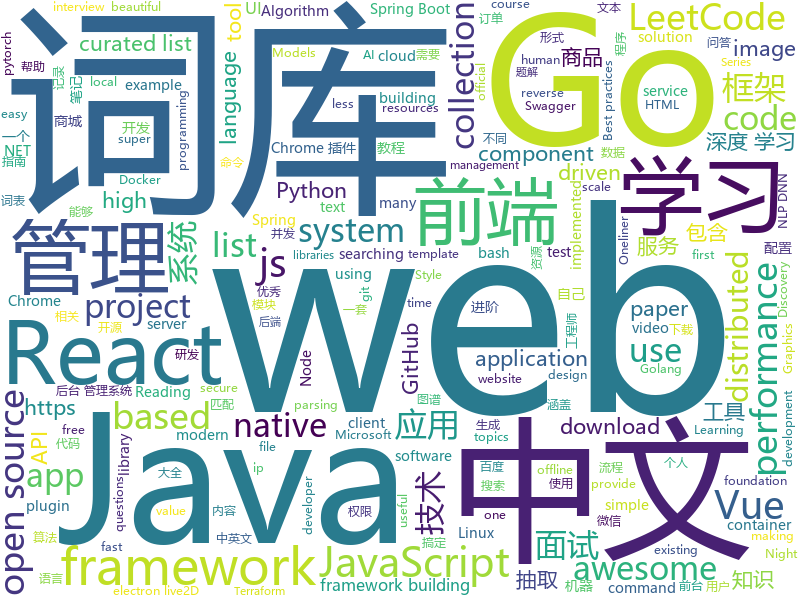

# 2019-05-10
See what the GitHub community is most excited about today.

## python
* [Python](https://github.com/TheAlgorithms/Python)(**386 stars today**): All Algorithms implemented in Python
* [edgedb](https://github.com/edgedb/edgedb)(**167 stars today**): The next generation object-relational database. A @MagicStack project.
* [PySnooper](https://github.com/cool-RR/PySnooper)(**129 stars today**): Never use print for debugging again
* [graphics](https://github.com/tensorflow/graphics)(**129 stars today**): TensorFlow Graphics: Differentiable Graphics Layers for TensorFlow
* [self-driving-desktop](https://github.com/hofstadter-io/self-driving-desktop)(**114 stars today**): Desktop Automation framework
* [AiLearning](https://github.com/apachecn/AiLearning)(**87 stars today**): AiLearning: 机器学习 - MachineLearning - ML、深度学习 - DeepLearning - DL、自然语言处理 NLP
* [models](https://github.com/tensorflow/models)(**67 stars today**): Models and examples built with TensorFlow
* [Awesome-PyTorch-Chinese](https://github.com/INTERMT/Awesome-PyTorch-Chinese)(**71 stars today**): 【干货】史上最全的PyTorch学习资源汇总
* [pytorch-mobilenet-v3](https://github.com/kuan-wang/pytorch-mobilenet-v3)(**73 stars today**): MobileNetV3 in pytorch
* [ChromeAppHeroes](https://github.com/zhaoolee/ChromeAppHeroes)(**67 stars today**): 🌈谷粒-Chrome插件英雄榜, 为优秀的Chrome插件写一本中文说明书, 让Chrome插件英雄们造福人类~ ChromePluginHeroes, Write a Chinese manual for the excellent Chrome plugin, let the Chrome plugin heroes benefit the human~
* [system-design-primer](https://github.com/donnemartin/system-design-primer)(**62 stars today**): Learn how to design large-scale systems. Prep for the system design interview. Includes Anki flashcards.
* [funNLP](https://github.com/fighting41love/funNLP)(**55 stars today**): 中英文敏感词、语言检测、中外手机/电话归属地/运营商查询、名字推断性别、手机号抽取、身份证抽取、邮箱抽取、中日文人名库、中文缩写库、拆字词典、词汇情感值、停用词、反动词表、暴恐词表、繁简体转换、英文模拟中文发音、汪峰歌词生成器、职业名称词库、同义词库、反义词库、否定词库、汽车品牌词库、汽车零件词库、连续英文切割、各种中文词向量、公司名字大全、古诗词库、IT词库、财经词库、成语词库、地名词库、历史名人词库、诗词词库、医学词库、饮食词库、法律词库、汽车词库、动物词库、中文聊天语料、中文谣言数据、百度中文问答数据集、句子相似度匹配算法集合、bert资源、文本生成&摘要相关工具、cocoNLP信息抽取工具、国内电话号码正则匹配、清华大学XLORE:中英文跨语言百科知识图谱、清华大学人工智能技术…
* [public-apis](https://github.com/toddmotto/public-apis)(**58 stars today**): A collective list of free APIs for use in software and web development.
* [awesome-python](https://github.com/vinta/awesome-python)(**52 stars today**): A curated list of awesome Python frameworks, libraries, software and resources
* [transfer-learning-conv-ai](https://github.com/huggingface/transfer-learning-conv-ai)(**53 stars today**): 🦄State-of-the-Art Conversational AI with Transfer Learning
* [maildown](https://github.com/chris104957/maildown)(**55 stars today**): A super simple CLI for sending emails
* [youtube-dl](https://github.com/ytdl-org/youtube-dl)(**48 stars today**): Command-line program to download videos from YouTube.com and other video sites
* [gpt-2](https://github.com/openai/gpt-2)(**47 stars today**): Code for the paper "Language Models are Unsupervised Multitask Learners"
* [NeuronBlocks](https://github.com/microsoft/NeuronBlocks)(**44 stars today**): NLP DNN Toolkit - Building Your NLP DNN Models Like Playing Lego
* [flask](https://github.com/pallets/flask)(**39 stars today**): The Python micro framework for building web applications.
* [faceswap](https://github.com/deepfakes/faceswap)(**38 stars today**): Non official project based on original /r/Deepfakes thread. Many thanks to him!
* [CheatSheetSeries](https://github.com/OWASP/CheatSheetSeries)(**41 stars today**): The OWASP Cheat Sheet Series was created to provide a concise collection of high value information on specific application security topics.
* [lighttrack](https://github.com/Guanghan/lighttrack)(**39 stars today**): Code for paper "LightTrack: A Generic Framework for Online Top-Down Human Pose Tracking"
* [MobileNetV3-Pytorch](https://github.com/leaderj1001/MobileNetV3-Pytorch)(**39 stars today**): Implementing Searching for MobileNetV3 paper using Pytorch
* [django](https://github.com/django/django)(**33 stars today**): The Web framework for perfectionists with deadlines.

## java
* [LeetCodeAnimation](https://github.com/MisterBooo/LeetCodeAnimation)(**759 stars today**): Demonstrate all the questions on LeetCode in the form of animation.（用动画的形式呈现解LeetCode题目的思路）
* [CS-Notes](https://github.com/CyC2018/CS-Notes)(**366 stars today**): 📚技术面试必备基础知识、Leetcode 题解、后端面试、Java 面试、春招、秋招、操作系统、计算机网络、系统设计
* [JavaGuide](https://github.com/Snailclimb/JavaGuide)(**175 stars today**): 【Java学习+面试指南】 一份涵盖大部分Java程序员所需要掌握的核心知识。
* [spring-boot-examples](https://github.com/ityouknow/spring-boot-examples)(**147 stars today**): about learning Spring Boot via examples. Spring Boot 教程、技术栈示例代码，快速简单上手教程。
* [advanced-java](https://github.com/doocs/advanced-java)(**92 stars today**): 😮互联网 Java 工程师进阶知识完全扫盲：涵盖高并发、分布式、高可用、微服务等领域知识
* [mall](https://github.com/macrozheng/mall)(**74 stars today**): mall项目是一套电商系统，包括前台商城系统及后台管理系统，基于SpringBoot+MyBatis实现。 前台商城系统包含首页门户、商品推荐、商品搜索、商品展示、购物车、订单流程、会员中心、客户服务、帮助中心等模块。 后台管理系统包含商品管理、订单管理、会员管理、促销管理、运营管理、内容管理、统计报表、财务管理、权限管理、设置等模块。
* [spring-framework](https://github.com/spring-projects/spring-framework)(**56 stars today**): Spring Framework
* [server](https://github.com/wildfirechat/server)(**62 stars today**): 全开源即时通讯(IM)系统
* [spring-boot](https://github.com/spring-projects/spring-boot)(**50 stars today**): Spring Boot
* [java-design-patterns](https://github.com/iluwatar/java-design-patterns)(**48 stars today**): Design patterns implemented in Java
* [seata](https://github.com/seata/seata)(**46 stars today**): 🔥Seata is an easy-to-use, high-performance, java based, open source distributed transaction solution.
* [litemall](https://github.com/linlinjava/litemall)(**41 stars today**): 又一个小商城。litemall = Spring Boot后端 + Vue管理员前端 + 微信小程序用户前端 + Vue用户移动端
* [tutorials](https://github.com/eugenp/tutorials)(**29 stars today**): The "REST With Spring" Course:
* [apollo](https://github.com/ctripcorp/apollo)(**43 stars today**): Apollo（阿波罗）是携程框架部门研发的分布式配置中心，能够集中化管理应用不同环境、不同集群的配置，配置修改后能够实时推送到应用端，并且具备规范的权限、流程治理等特性，适用于微服务配置管理场景。
* [elasticsearch](https://github.com/elastic/elasticsearch)(**42 stars today**): Open Source, Distributed, RESTful Search Engine
* [Java](https://github.com/TheAlgorithms/Java)(**41 stars today**): All Algorithms implemented in Java
* [arthas](https://github.com/alibaba/arthas)(**41 stars today**): Alibaba Java Diagnostic Tool Arthas/Alibaba Java诊断利器Arthas
* [DoraemonKit](https://github.com/didi/DoraemonKit)(**39 stars today**): 简称 "DoKit" 。一款功能齐全的客户端（ iOS 、Android ）研发助手，你值得拥有。
* [product-microgateway](https://github.com/wso2/product-microgateway)(**40 stars today**): A cloud native, developer centric and decentralized API gateway for microservices
* [nacos](https://github.com/alibaba/nacos)(**33 stars today**): an easy-to-use dynamic service discovery, configuration and service management platform for building cloud native applications.
* [incubator-dubbo](https://github.com/apache/incubator-dubbo)(**27 stars today**): Apache Dubbo (incubating) is a high-performance, java based, open source RPC framework.
* [ip2region](https://github.com/lionsoul2014/ip2region)(**33 stars today**): Ip2region is a offline IP location library with accuracy rate of 99.9% and 0.0x millseconds searching performance. DB file is less then 5Mb with all ip address stored. binding for Java,PHP,C,Python,Nodejs,Golang,C#,lua. Binary,B-tree,Memory searching algorithm
* [HanLP](https://github.com/hankcs/HanLP)(**31 stars today**): 自然语言处理 中文分词 词性标注 命名实体识别 依存句法分析 新词发现 关键词短语提取 自动摘要 文本分类聚类 拼音简繁
* [ZXBlog](https://github.com/ZXZxin/ZXBlog)(**28 stars today**): 记录各种学习笔记(算法、Java、数据库、并发......)
* [hutool](https://github.com/looly/hutool)(**25 stars today**): A set of tools that keep Java sweet.

## unknown
* [PowerToys](https://github.com/microsoft/PowerToys)(**764 stars today**): Windows system utilities to maximize productivity
* [backslide](https://github.com/sabakkps/backslide)(**421 stars today**): CLI tool for making HTML presentations with Remark.js using Markdown
* [pysot](https://github.com/STVIR/pysot)(**281 stars today**): 
* [awesome-product-design](https://github.com/teoga/awesome-product-design)(**251 stars today**): A collection of bookmarks, resources, articles for product designers.
* [go-perfbook](https://github.com/dgryski/go-perfbook)(**197 stars today**): Thoughts on Go performance optimization
* [Data-Science--Cheat-Sheet](https://github.com/abhat222/Data-Science--Cheat-Sheet)(**135 stars today**): Cheat Sheets
* [weekly](https://github.com/ruanyf/weekly)(**123 stars today**): 技术分享周刊，每周五发布
* [haskell-resources](https://github.com/cohomolo-gy/haskell-resources)(**94 stars today**): A List of Foundational Haskell Papers
* [awesome](https://github.com/sindresorhus/awesome)(**89 stars today**): 😎Awesome lists about all kinds of interesting topics
* [architect-awesome](https://github.com/xingshaocheng/architect-awesome)(**85 stars today**): 后端架构师技术图谱
* [gitignore](https://github.com/github/gitignore)(**61 stars today**): A collection of useful .gitignore templates
* [free-programming-books](https://github.com/EbookFoundation/free-programming-books)(**78 stars today**): 📚Freely available programming books
* [You-Dont-Know-JS](https://github.com/getify/You-Dont-Know-JS)(**75 stars today**): A book series on JavaScript. @YDKJS on twitter.
* [awesome-vue](https://github.com/vuejs/awesome-vue)(**74 stars today**): 🎉A curated list of awesome things related to Vue.js
* [developer-roadmap](https://github.com/kamranahmedse/developer-roadmap)(**67 stars today**): Roadmap to becoming a web developer in 2019
* [FUNIT](https://github.com/NVlabs/FUNIT)(**73 stars today**): Translate images to unseen domains in the test time with few example images.
* [git-tips](https://github.com/521xueweihan/git-tips)(**64 stars today**): Git的奇技淫巧
* [CyberSecurityRSS](https://github.com/zer0yu/CyberSecurityRSS)(**64 stars today**): RSS: 优秀的个人情报来源
* [DeepLearning-500-questions](https://github.com/scutan90/DeepLearning-500-questions)(**57 stars today**): 深度学习500问，以问答形式对常用的概率知识、线性代数、机器学习、深度学习、计算机视觉等热点问题进行阐述，以帮助自己及有需要的读者。 全书分为18个章节，50余万字。由于水平有限，书中不妥之处恳请广大读者批评指正。 未完待续............ 如有意合作，联系scutjy2015@163.com 版权所有，违权必究 Tan 2018.06
* [Daily-Interview-Question](https://github.com/Advanced-Frontend/Daily-Interview-Question)(**51 stars today**): 我是木易杨，公众号「高级前端进阶」作者，每天搞定一道前端大厂面试题，祝大家天天进步，一年后会看到不一样的自己。
* [Bash-Oneliner](https://github.com/onceupon/Bash-Oneliner)(**52 stars today**): Bash Oneliner will focus on bash commands for parsing plain text; some of the commands are for system maintaining. I apologize that there won't be any citation of the code, but they are probably from dear Google and Stackoverflow. Not all the code here are oneliner (if the ';' counts..). English and bash are not my first language, so... correct …
* [support.996.ICU](https://github.com/MSWorkers/support.996.ICU)(**48 stars today**): Microsoft and GitHub Workers Support 996.ICU
* [Awesome-Asset-Discovery](https://github.com/redhuntlabs/Awesome-Asset-Discovery)(**45 stars today**): List of Awesome Asset Discovery Resources
* [coding-interview-university](https://github.com/jwasham/coding-interview-university)(**35 stars today**): A complete computer science study plan to become a software engineer.
* [project-based-learning](https://github.com/tuvtran/project-based-learning)(**36 stars today**): Curated list of project-based tutorials

## javascript
* [Web](https://github.com/qianguyihao/Web)(**324 stars today**): Web前端入门和进阶学习笔记，超详细的前端学习图文教程。从零开始学前端，做一个Web全栈工程师。持续更新...
* [leetcode](https://github.com/azl397985856/leetcode)(**222 stars today**): LeetCode Solutions: A Record of My Problem Solving Journey.( leetcode题解，记录自己的leetcode解题之路。)
* [vue](https://github.com/vuejs/vue)(**122 stars today**): 🖖Vue.js is a progressive, incrementally-adoptable JavaScript framework for building UI on the web.
* [react-material-dashboard](https://github.com/devias-io/react-material-dashboard)(**121 stars today**): React Dashboard made with Material UI’s components, React and of course create-react-app to boost your app development process!
* [lxhToolHTTPDecrypt](https://github.com/lyxhh/lxhToolHTTPDecrypt)(**99 stars today**): HTTPDecrypt
* [react](https://github.com/facebook/react)(**104 stars today**): A declarative, efficient, and flexible JavaScript library for building user interfaces.
* [training](https://github.com/cloud-annotations/training)(**98 stars today**): 🐝Custom Object Detection and Classification Training
* [svelte](https://github.com/sveltejs/svelte)(**97 stars today**): Cybernetically enhanced web apps
* [nodebestpractices](https://github.com/i0natan/nodebestpractices)(**77 stars today**): ✅The largest Node.js best practices list (April 2019)
* [hyper](https://github.com/zeit/hyper)(**67 stars today**): A terminal built on web technologies
* [30-seconds-of-code](https://github.com/30-seconds/30-seconds-of-code)(**68 stars today**): A curated collection of useful JavaScript snippets that you can understand in 30 seconds or less.
* [storybook](https://github.com/storybooks/storybook)(**63 stars today**): UI component dev & test: React, Vue, Angular, React Native, Ember, Web Components & more!
* [create-react-app](https://github.com/facebook/create-react-app)(**58 stars today**): Set up a modern web app by running one command.
* [react-native](https://github.com/facebook/react-native)(**61 stars today**): A framework for building native apps with React.
* [xgplayer](https://github.com/bytedance/xgplayer)(**66 stars today**): A HTML5 video player with a parser that saves traffic
* [baiduyun](https://github.com/syhyz1990/baiduyun)(**63 stars today**): 🖖油猴脚本 一个脚本搞定百度网盘下载
* [uni-app](https://github.com/dcloudio/uni-app)(**57 stars today**): 使用 Vue.js 开发跨平台应用的前端框架
* [bootstrap](https://github.com/twbs/bootstrap)(**40 stars today**): The most popular HTML, CSS, and JavaScript framework for developing responsive, mobile first projects on the web.
* [taro](https://github.com/NervJS/taro)(**52 stars today**): 多端统一开发框架，支持用 React 的开发方式编写一次代码，生成能运行在微信/百度/支付宝/字节跳动小程序、H5、React Native 等的应用。 https://taro.js.org/
* [puppeteer](https://github.com/GoogleChrome/puppeteer)(**52 stars today**): Headless Chrome Node API
* [next.js](https://github.com/zeit/next.js)(**50 stars today**): The React Framework
* [three.js](https://github.com/mrdoob/three.js)(**43 stars today**): JavaScript 3D library.
* [axios](https://github.com/axios/axios)(**47 stars today**): Promise based HTTP client for the browser and node.js
* [javascript](https://github.com/airbnb/javascript)(**42 stars today**): JavaScript Style Guide
* [node](https://github.com/nodejs/node)(**45 stars today**): Node.js JavaScript runtime✨🐢🚀✨

## html
* [Python-100-Days](https://github.com/jackfrued/Python-100-Days)(**1,732 stars today**): Python - 100天从新手到大师
* [linux-command](https://github.com/jaywcjlove/linux-command)(**394 stars today**): Linux命令大全搜索工具，内容包含Linux命令手册、详解、学习、搜集。https://git.io/linux
* [flutter-in-action](https://github.com/flutterchina/flutter-in-action)(**126 stars today**): 《Flutter实战》电子书
* [Electron-elf](https://github.com/fguby/Electron-elf)(**56 stars today**): 使用electron和live2D开发的类似桌面精灵的应用（A desktop application developed using electron and live2D）
* [nndl.github.io](https://github.com/nndl/nndl.github.io)(**47 stars today**): 《神经网络与深度学习》 Neural Network and Deep Learning
* [CV](https://github.com/Wscats/CV)(**29 stars today**): 🙈《切图仔面试宝典》曾立心想放弃，仍竭力以心献技
* [styleguide](https://github.com/google/styleguide)(**17 stars today**): Style guides for Google-originated open-source projects
* [vue-page-transition](https://github.com/Orlandster/vue-page-transition)(**24 stars today**): A lightweight Vue.js plugin for page / route transitions.
* [Coursera-ML-AndrewNg-Notes](https://github.com/fengdu78/Coursera-ML-AndrewNg-Notes)(**19 stars today**): 吴恩达老师的机器学习课程个人笔记
* [windows-syscalls](https://github.com/j00ru/windows-syscalls)(**19 stars today**): Windows System Call Tables (NT/2000/XP/2003/Vista/2008/7/2012/8/10)
* [portainer](https://github.com/portainer/portainer)(**18 stars today**): Simple management UI for Docker
* [Front-end-Developer-Interview-Questions](https://github.com/h5bp/Front-end-Developer-Interview-Questions)(**16 stars today**): A list of helpful front-end related questions you can use to interview potential candidates, test yourself or completely ignore.
* [en.javascript.info](https://github.com/javascript-tutorial/en.javascript.info)(**16 stars today**): Modern JavaScript Tutorial
* [dotnet](https://github.com/microsoft/dotnet)(**16 stars today**): This repo is the official home of .NET on GitHub. It's a great starting point to find many .NET OSS projects from Microsoft and the community, including many that are part of the .NET Foundation.
* [web.dev](https://github.com/GoogleChrome/web.dev)(**15 stars today**): Content repository for web.dev
* [fastText](https://github.com/facebookresearch/fastText)(**12 stars today**): Library for fast text representation and classification.
* [TranslatorX](https://github.com/pingfangx/TranslatorX)(**14 stars today**): JetBrains 系列软件汉化包
* [WebFundamentals](https://github.com/google/WebFundamentals)(**13 stars today**): Best practices for modern web development
* [Spoon-Knife](https://github.com/octocat/Spoon-Knife)(****): This repo is for demonstration purposes only.
* [beautiful-jekyll](https://github.com/daattali/beautiful-jekyll)(**6 stars today**): ✨Build a beautiful and simple website in literally minutes. Demo at http://deanattali.com/beautiful-jekyll
* [public-sans](https://github.com/uswds/public-sans)(**12 stars today**): A strong, neutral, principles-driven, open source typeface for text or display
* [mxgraph](https://github.com/jgraph/mxgraph)(**11 stars today**): mxGraph is a fully client side JavaScript diagramming library
* [qiubaiying.github.io](https://github.com/qiubaiying/qiubaiying.github.io)(**6 stars today**): BY Blog ->
* [all-contributors](https://github.com/all-contributors/all-contributors)(**9 stars today**): ✨Recognize all contributors, not just the ones who push code✨
* [swagger-codegen](https://github.com/swagger-api/swagger-codegen)(**8 stars today**): swagger-codegen contains a template-driven engine to generate documentation, API clients and server stubs in different languages by parsing your OpenAPI / Swagger definition.

## go
* [flipt](https://github.com/markphelps/flipt)(**246 stars today**): A feature flag solution that runs in your existing infrastructure
* [sqlflow](https://github.com/sql-machine-learning/sqlflow)(**233 stars today**): Brings SQL and AI together.
* [gameboy.live](https://github.com/HFO4/gameboy.live)(**80 stars today**): 🕹️A basic gameboy emulator with terminal "Cloud Gaming" support
* [go](https://github.com/golang/go)(**68 stars today**): The Go programming language
* [kratos](https://github.com/bilibili/kratos)(**66 stars today**): Kratos是bilibili开源的一套Go微服务框架，包含大量微服务相关框架及工具。
* [kubernetes](https://github.com/kubernetes/kubernetes)(**55 stars today**): Production-Grade Container Scheduling and Management
* [Golang](https://github.com/overnote/Golang)(**62 stars today**): Notes for Golang
* [inlets](https://github.com/alexellis/inlets)(**63 stars today**): Expose your local endpoints to the Internet
* [awesome-go](https://github.com/avelino/awesome-go)(**57 stars today**): A curated list of awesome Go frameworks, libraries and software
* [gin](https://github.com/gin-gonic/gin)(**53 stars today**): Gin is a HTTP web framework written in Go (Golang). It features a Martini-like API with much better performance -- up to 40 times faster. If you need smashing performance, get yourself some Gin.
* [keda](https://github.com/kedacore/keda)(**52 stars today**): KEDA is a Kubernetes-based Event Driven Autoscaling component. It provides event driven scale for any container running in Kubernetes
* [collection](https://github.com/jianfengye/collection)(**50 stars today**): go collection package for fasting coding
* [taas](https://github.com/seata/taas)(**47 stars today**): Seata compatible high availability server
* [reading-go](https://github.com/developer-learning/reading-go)(**44 stars today**): Go 每日阅读和 Go 夜读 > Daily Reading Go and Night Reading Go - Go source reading and offline technical or another articles or discussion on every night.
* [terraformer](https://github.com/GoogleCloudPlatform/terraformer)(**41 stars today**): CLI tool to generate terraform files from existing infrastructure (reverse Terraform). Infrastructure to Code
* [caire](https://github.com/esimov/caire)(**40 stars today**): Content aware image resize library
* [frp](https://github.com/fatedier/frp)(**35 stars today**): A fast reverse proxy to help you expose a local server behind a NAT or firewall to the internet.
* [sshcode](https://github.com/cdr/sshcode)(**37 stars today**): Run VS Code on any server over SSH.
* [gui](https://github.com/faiface/gui)(**36 stars today**): Super minimal, rock-solid foundation for concurrent GUI in Go.
* [the-way-to-go_ZH_CN](https://github.com/Unknwon/the-way-to-go_ZH_CN)(**35 stars today**): 《The Way to Go》中文译本，中文正式名《Go 入门指南》
* [hugo](https://github.com/gohugoio/hugo)(**35 stars today**): The world’s fastest framework for building websites.
* [etcd](https://github.com/etcd-io/etcd)(**30 stars today**): Distributed reliable key-value store for the most critical data of a distributed system
* [docker-slim](https://github.com/docker-slim/docker-slim)(**34 stars today**): DockerSlim (docker-slim): Don't change anything in your Docker container image and minify it by up to 30x (and for compiled languages even more) making it secure too! (free and open source)
* [istio](https://github.com/istio/istio)(**27 stars today**): Connect, secure, control, and observe services.
* [lantern](https://github.com/getlantern/lantern)(**28 stars today**): 🔴蓝灯最新版本下载 https://github.com/getlantern/download🔴Lantern Latest Download https://github.com/getlantern/download🔴

## WordCloud

