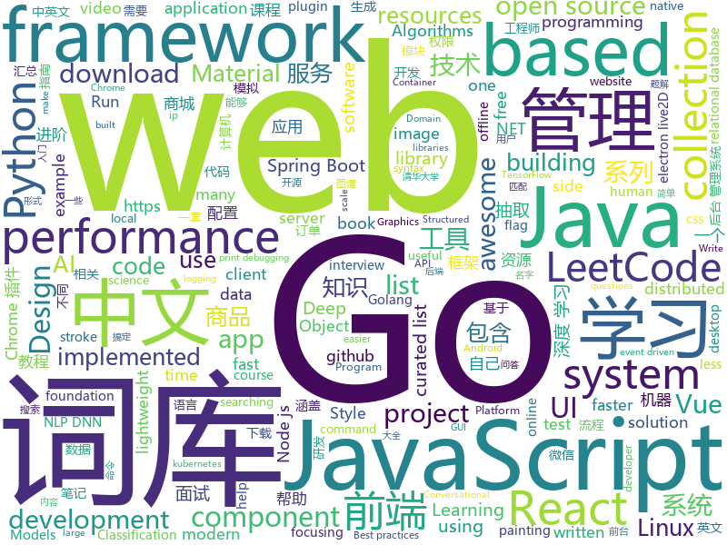

# 2019-05-11
See what the GitHub community is most excited about today.

## python
* [graphics](https://github.com/tensorflow/graphics)(**538 stars today**): TensorFlow Graphics: Differentiable Graphics Layers for TensorFlow
* [edgedb](https://github.com/edgedb/edgedb)(**414 stars today**): The next generation object-relational database. A @MagicStack project.
* [Python](https://github.com/TheAlgorithms/Python)(**320 stars today**): All Algorithms implemented in Python
* [icecream](https://github.com/gruns/icecream)(**145 stars today**): 🍦Sweet and creamy print debugging.
* [PySnooper](https://github.com/cool-RR/PySnooper)(**134 stars today**): Never use print for debugging again
* [lighttrack](https://github.com/Guanghan/lighttrack)(**87 stars today**): Code for paper "LightTrack: A Generic Framework for Online Top-Down Human Pose Tracking"
* [models](https://github.com/tensorflow/models)(**68 stars today**): Models and examples built with TensorFlow
* [ChromeAppHeroes](https://github.com/zhaoolee/ChromeAppHeroes)(**87 stars today**): 🌈谷粒-Chrome插件英雄榜, 为优秀的Chrome插件写一本中文说明书, 让Chrome插件英雄们造福人类~ ChromePluginHeroes, Write a Chinese manual for the excellent Chrome plugin, let the Chrome plugin heroes benefit the human~
* [AiLearning](https://github.com/apachecn/AiLearning)(**71 stars today**): AiLearning: 机器学习 - MachineLearning - ML、深度学习 - DeepLearning - DL、自然语言处理 NLP
* [awesome-python](https://github.com/vinta/awesome-python)(**74 stars today**): A curated list of awesome Python frameworks, libraries, software and resources
* [transfer-learning-conv-ai](https://github.com/huggingface/transfer-learning-conv-ai)(**71 stars today**): 🦄State-of-the-Art Conversational AI with Transfer Learning
* [system-design-primer](https://github.com/donnemartin/system-design-primer)(**66 stars today**): Learn how to design large-scale systems. Prep for the system design interview. Includes Anki flashcards.
* [funNLP](https://github.com/fighting41love/funNLP)(**54 stars today**): 中英文敏感词、语言检测、中外手机/电话归属地/运营商查询、名字推断性别、手机号抽取、身份证抽取、邮箱抽取、中日文人名库、中文缩写库、拆字词典、词汇情感值、停用词、反动词表、暴恐词表、繁简体转换、英文模拟中文发音、汪峰歌词生成器、职业名称词库、同义词库、反义词库、否定词库、汽车品牌词库、汽车零件词库、连续英文切割、各种中文词向量、公司名字大全、古诗词库、IT词库、财经词库、成语词库、地名词库、历史名人词库、诗词词库、医学词库、饮食词库、法律词库、汽车词库、动物词库、中文聊天语料、中文谣言数据、百度中文问答数据集、句子相似度匹配算法集合、bert资源、文本生成&摘要相关工具、cocoNLP信息抽取工具、国内电话号码正则匹配、清华大学XLORE:中英文跨语言百科知识图谱、清华大学人工智能技术…
* [keras](https://github.com/keras-team/keras)(**46 stars today**): Deep Learning for humans
* [youtube-dl](https://github.com/ytdl-org/youtube-dl)(**50 stars today**): Command-line program to download videos from YouTube.com and other video sites
* [awesome-jenkins-rce-2019](https://github.com/orangetw/awesome-jenkins-rce-2019)(**48 stars today**): There is no pre-auth RCE in Jenkins since May 2017, but this is the one!
* [NeuronBlocks](https://github.com/microsoft/NeuronBlocks)(**45 stars today**): NLP DNN Toolkit - Building Your NLP DNN Models Like Playing Lego
* [Awesome-PyTorch-Chinese](https://github.com/INTERMT/Awesome-PyTorch-Chinese)(**43 stars today**): 【干货】史上最全的PyTorch学习资源汇总
* [public-apis](https://github.com/toddmotto/public-apis)(**45 stars today**): A collective list of free APIs for use in software and web development.
* [mindmeld](https://github.com/cisco/mindmeld)(**42 stars today**): An Open Source Conversational AI Platform for Deep-Domain Voice Interfaces and Chatbots.
* [django](https://github.com/django/django)(**39 stars today**): The Web framework for perfectionists with deadlines.
* [faceswap](https://github.com/deepfakes/faceswap)(**38 stars today**): Non official project based on original /r/Deepfakes thread. Many thanks to him!
* [awesome-python-login-model](https://github.com/CriseLYJ/awesome-python-login-model)(**38 stars today**): 😮python模拟登陆一些大型网站，还有一些简单的爬虫，希望对你们有所帮助❤️，如果喜欢记得给个star哦🌟
* [cpython](https://github.com/python/cpython)(**28 stars today**): The Python programming language
* [LearningToPaint](https://github.com/hzwer/LearningToPaint)(**40 stars today**): A painting AI that can reproduce paintings stroke by stroke using deep reinforcement learning.

## java
* [LeetCodeAnimation](https://github.com/MisterBooo/LeetCodeAnimation)(**618 stars today**): Demonstrate all the questions on LeetCode in the form of animation.（用动画的形式呈现解LeetCode题目的思路）
* [CS-Notes](https://github.com/CyC2018/CS-Notes)(**200 stars today**): 📚技术面试必备基础知识、Leetcode 题解、后端面试、Java 面试、春招、秋招、操作系统、计算机网络、系统设计
* [learnxinyminutes-docs](https://github.com/adambard/learnxinyminutes-docs)(**203 stars today**): Code documentation written as code! How novel and totally my idea!
* [JavaGuide](https://github.com/Snailclimb/JavaGuide)(**133 stars today**): 【Java学习+面试指南】 一份涵盖大部分Java程序员所需要掌握的核心知识。
* [advanced-java](https://github.com/doocs/advanced-java)(**100 stars today**): 😮互联网 Java 工程师进阶知识完全扫盲：涵盖高并发、分布式、高可用、微服务等领域知识
* [Linkage-RecyclerView](https://github.com/KunMinX/Linkage-RecyclerView)(**76 stars today**): 即使不用饿了么订餐，也请务必收藏好该库！🔥一行代码即可接入，二级联动订餐列表 - RecyclerView + AndroidX
* [mall](https://github.com/macrozheng/mall)(**67 stars today**): mall项目是一套电商系统，包括前台商城系统及后台管理系统，基于SpringBoot+MyBatis实现。 前台商城系统包含首页门户、商品推荐、商品搜索、商品展示、购物车、订单流程、会员中心、客户服务、帮助中心等模块。 后台管理系统包含商品管理、订单管理、会员管理、促销管理、运营管理、内容管理、统计报表、财务管理、权限管理、设置等模块。
* [spring-boot](https://github.com/spring-projects/spring-boot)(**52 stars today**): Spring Boot
* [android-DarkTheme](https://github.com/googlesamples/android-DarkTheme)(**67 stars today**): 
* [server](https://github.com/wildfirechat/server)(**61 stars today**): 全开源即时通讯(IM)系统
* [spring-boot-examples](https://github.com/ityouknow/spring-boot-examples)(**50 stars today**): about learning Spring Boot via examples. Spring Boot 教程、技术栈示例代码，快速简单上手教程。
* [litemall](https://github.com/linlinjava/litemall)(**45 stars today**): 又一个小商城。litemall = Spring Boot后端 + Vue管理员前端 + 微信小程序用户前端 + Vue用户移动端
* [elasticsearch](https://github.com/elastic/elasticsearch)(**40 stars today**): Open Source, Distributed, RESTful Search Engine
* [Java](https://github.com/TheAlgorithms/Java)(**37 stars today**): All Algorithms implemented in Java
* [tutorials](https://github.com/eugenp/tutorials)(**21 stars today**): The "REST With Spring" Course:
* [java-design-patterns](https://github.com/iluwatar/java-design-patterns)(**37 stars today**): Design patterns implemented in Java
* [ip2region](https://github.com/lionsoul2014/ip2region)(**36 stars today**): Ip2region is a offline IP location library with accuracy rate of 99.9% and 0.0x millseconds searching performance. DB file is less then 5Mb with all ip address stored. binding for Java,PHP,C,Python,Nodejs,Golang,C#,lua. Binary,B-tree,Memory searching algorithm
* [arthas](https://github.com/alibaba/arthas)(**37 stars today**): Alibaba Java Diagnostic Tool Arthas/Alibaba Java诊断利器Arthas
* [graal](https://github.com/oracle/graal)(**39 stars today**): GraalVM: Run Programs Faster Anywhere🚀
* [material-components-android](https://github.com/material-components/material-components-android)(**38 stars today**): Modular and customizable Material Design UI components for Android
* [DoraemonKit](https://github.com/didi/DoraemonKit)(**35 stars today**): 简称 "DoKit" 。一款功能齐全的客户端（ iOS 、Android ）研发助手，你值得拥有。
* [apollo](https://github.com/ctripcorp/apollo)(**33 stars today**): Apollo（阿波罗）是携程框架部门研发的分布式配置中心，能够集中化管理应用不同环境、不同集群的配置，配置修改后能够实时推送到应用端，并且具备规范的权限、流程治理等特性，适用于微服务配置管理场景。
* [seata](https://github.com/seata/seata)(**33 stars today**): 🔥Seata is an easy-to-use, high-performance, java based, open source distributed transaction solution.
* [incubator-dubbo](https://github.com/apache/incubator-dubbo)(**26 stars today**): Apache Dubbo (incubating) is a high-performance, java based, open source RPC framework.
* [skywalking](https://github.com/apache/skywalking)(**25 stars today**): APM, Application Performance Monitoring System

## unknown
* [PowerToys](https://github.com/microsoft/PowerToys)(**308 stars today**): Windows system utilities to maximize productivity
* [awesome-product-design](https://github.com/teoga/awesome-product-design)(**296 stars today**): A collection of bookmarks, resources, articles for product designers.
* [FUNIT](https://github.com/NVlabs/FUNIT)(**217 stars today**): Translate images to unseen domains in the test time with few example images.
* [go-perfbook](https://github.com/dgryski/go-perfbook)(**165 stars today**): Thoughts on Go performance optimization
* [Bash-Oneliner](https://github.com/onceupon/Bash-Oneliner)(**126 stars today**): A large collection of handy Bash one-liner commands focusing on data processing and for Linux system maintenance. I apologize that there won't be any citation of the code, but they are probably from dear Google and Stackoverflow.
* [Data-Science--Cheat-Sheet](https://github.com/abhat222/Data-Science--Cheat-Sheet)(**97 stars today**): Cheat Sheets
* [awesome-typescript](https://github.com/dzharii/awesome-typescript)(**104 stars today**): A collection of awesome TypeScript resources for client-side and server-side development. Write your awesome JavaScript in TypeScript
* [gitignore](https://github.com/github/gitignore)(**75 stars today**): A collection of useful .gitignore templates
* [gdut-course](https://github.com/brenner8023/gdut-course)(**92 stars today**): 广东工业大学计算机学院课程攻略
* [awesome](https://github.com/sindresorhus/awesome)(**88 stars today**): 😎Awesome lists about all kinds of interesting topics
* [pysot](https://github.com/STVIR/pysot)(**88 stars today**): 
* [architect-awesome](https://github.com/xingshaocheng/architect-awesome)(**65 stars today**): 后端架构师技术图谱
* [datascience](https://github.com/r0f1/datascience)(**66 stars today**): Curated list of Python resources for data science.
* [You-Dont-Know-JS](https://github.com/getify/You-Dont-Know-JS)(**61 stars today**): A book series on JavaScript. @YDKJS on twitter.
* [developer-roadmap](https://github.com/kamranahmedse/developer-roadmap)(**64 stars today**): Roadmap to becoming a web developer in 2019
* [free-programming-books](https://github.com/EbookFoundation/free-programming-books)(**53 stars today**): 📚Freely available programming books
* [weekly](https://github.com/ruanyf/weekly)(**56 stars today**): 技术分享周刊，每周五发布
* [LEDNet](https://github.com/xiaoyufenfei/LEDNet)(**54 stars today**): LEDNet: A Lightweight Encoder-Decoder Network for Real-time Semantic Segmentation
* [Blog](https://github.com/mqyqingfeng/Blog)(**55 stars today**): 冴羽写博客的地方，预计写四个系列：JavaScript深入系列、JavaScript专题系列、ES6系列、React系列。
* [coding-interview-university](https://github.com/jwasham/coding-interview-university)(**48 stars today**): A complete computer science study plan to become a software engineer.
* [Daily-Interview-Question](https://github.com/Advanced-Frontend/Daily-Interview-Question)(**50 stars today**): 我是木易杨，公众号「高级前端进阶」作者，每天搞定一道前端大厂面试题，祝大家天天进步，一年后会看到不一样的自己。
* [awesome-wechat-weapp](https://github.com/justjavac/awesome-wechat-weapp)(**46 stars today**): 微信小程序开发资源汇总💯
* [DeepLearning-500-questions](https://github.com/scutan90/DeepLearning-500-questions)(**42 stars today**): 深度学习500问，以问答形式对常用的概率知识、线性代数、机器学习、深度学习、计算机视觉等热点问题进行阐述，以帮助自己及有需要的读者。 全书分为18个章节，50余万字。由于水平有限，书中不妥之处恳请广大读者批评指正。 未完待续............ 如有意合作，联系scutjy2015@163.com 版权所有，违权必究 Tan 2018.06
* [my-development-tools](https://github.com/adoyle-h/my-development-tools)(**48 stars today**): 我的开发工具箱
* [project-based-learning](https://github.com/tuvtran/project-based-learning)(**45 stars today**): Curated list of project-based tutorials

## javascript
* [Web](https://github.com/qianguyihao/Web)(**240 stars today**): Web前端入门和进阶学习笔记，超详细的前端学习图文教程。从零开始学前端，做一个Web全栈工程师。持续更新...
* [comlink](https://github.com/GoogleChromeLabs/comlink)(**222 stars today**): Comlink makes WebWorkers enjoyable.
* [leetcode](https://github.com/azl397985856/leetcode)(**147 stars today**): LeetCode Solutions: A Record of My Problem Solving Journey.( leetcode题解，记录自己的leetcode解题之路。)
* [vue](https://github.com/vuejs/vue)(**140 stars today**): 🖖Vue.js is a progressive, incrementally-adoptable JavaScript framework for building UI on the web.
* [react](https://github.com/facebook/react)(**106 stars today**): A declarative, efficient, and flexible JavaScript library for building user interfaces.
* [amis](https://github.com/baidu/amis)(**85 stars today**): 一种基于特定 JSON 格式生成 MIS 页面的工具
* [dinoql](https://github.com/victorvoid/dinoql)(**86 stars today**): A query language for JavaScript Objects using GraphQL syntax.
* [nodebestpractices](https://github.com/i0natan/nodebestpractices)(**78 stars today**): ✅The largest Node.js best practices list (April 2019)
* [30-seconds-of-code](https://github.com/30-seconds/30-seconds-of-code)(**72 stars today**): A curated collection of useful JavaScript snippets that you can understand in 30 seconds or less.
* [training](https://github.com/cloud-annotations/training)(**67 stars today**): 🐝Custom Object Detection and Classification Training
* [hackathon-starter](https://github.com/sahat/hackathon-starter)(**65 stars today**): A boilerplate for Node.js web applications
* [svelte](https://github.com/sveltejs/svelte)(**65 stars today**): Cybernetically enhanced web apps
* [react-material-dashboard](https://github.com/devias-io/react-material-dashboard)(**62 stars today**): React Dashboard made with Material UI’s components, React and of course create-react-app to boost your app development process!
* [progressive-rendering-frameworks-samples](https://github.com/GoogleChromeLabs/progressive-rendering-frameworks-samples)(**59 stars today**): Samples and demos from the Progressive Rendering I/O talk
* [create-react-app](https://github.com/facebook/create-react-app)(**51 stars today**): Set up a modern web app by running one command.
* [three.js](https://github.com/mrdoob/three.js)(**48 stars today**): JavaScript 3D library.
* [storybook](https://github.com/storybooks/storybook)(**53 stars today**): UI component dev & test: React, Vue, Angular, React Native, Ember, Web Components & more!
* [react-native](https://github.com/facebook/react-native)(**50 stars today**): A framework for building native apps with React.
* [javascript-algorithms](https://github.com/trekhleb/javascript-algorithms)(**50 stars today**): 📝Algorithms and data structures implemented in JavaScript with explanations and links to further readings
* [javascript](https://github.com/airbnb/javascript)(**50 stars today**): JavaScript Style Guide
* [xgplayer](https://github.com/bytedance/xgplayer)(**52 stars today**): A HTML5 video player with a parser that saves traffic
* [axios](https://github.com/axios/axios)(**51 stars today**): Promise based HTTP client for the browser and node.js
* [libpku](https://github.com/lib-pku/libpku)(**47 stars today**): 贵校课程资料民间整理
* [baiduyun](https://github.com/syhyz1990/baiduyun)(**48 stars today**): 🖖油猴脚本 一个脚本搞定百度网盘下载
* [material-ui](https://github.com/mui-org/material-ui)(**39 stars today**): React components for faster and easier web development. Build your own design system, or start with Material Design.

## html
* [Python-100-Days](https://github.com/jackfrued/Python-100-Days)(**1,151 stars today**): Python - 100天从新手到大师
* [linux-command](https://github.com/jaywcjlove/linux-command)(**192 stars today**): Linux命令大全搜索工具，内容包含Linux命令手册、详解、学习、搜集。https://git.io/linux
* [flutter-in-action](https://github.com/flutterchina/flutter-in-action)(**103 stars today**): 《Flutter实战》电子书
* [Electron-elf](https://github.com/fguby/Electron-elf)(**47 stars today**): 使用electron和live2D开发的类似桌面精灵的应用（A desktop application developed using electron and live2D）
* [nndl.github.io](https://github.com/nndl/nndl.github.io)(**37 stars today**): 《神经网络与深度学习》 Neural Network and Deep Learning
* [flag-icon-css](https://github.com/lipis/flag-icon-css)(**33 stars today**): 🎏A collection of all country flags in SVG — plus the CSS for easier integration
* [vue-unit-test-with-jest](https://github.com/holylovelqq/vue-unit-test-with-jest)(**32 stars today**): 吃透本仓库，变身vue项目单体测试大神
* [dom_diff](https://github.com/zhangna0703/dom_diff)(**26 stars today**): 学海无涯，心存高远
* [go101](https://github.com/go101/go101)(**24 stars today**): An online book focusing on Go syntax/semantics.
* [styleguide](https://github.com/google/styleguide)(**22 stars today**): Style guides for Google-originated open-source projects
* [Coursera-ML-AndrewNg-Notes](https://github.com/fengdu78/Coursera-ML-AndrewNg-Notes)(**13 stars today**): 吴恩达老师的机器学习课程个人笔记
* [water.css](https://github.com/kognise/water.css)(**17 stars today**): A just-add-css collection of styles to make simple websites just a little nicer
* [en.javascript.info](https://github.com/javascript-tutorial/en.javascript.info)(**16 stars today**): Modern JavaScript Tutorial
* [Front-end-Developer-Interview-Questions](https://github.com/h5bp/Front-end-Developer-Interview-Questions)(**15 stars today**): A list of helpful front-end related questions you can use to interview potential candidates, test yourself or completely ignore.
* [WebFundamentals](https://github.com/google/WebFundamentals)(**14 stars today**): Best practices for modern web development
* [windows-syscalls](https://github.com/j00ru/windows-syscalls)(**14 stars today**): Windows System Call Tables (NT/2000/XP/2003/Vista/2008/7/2012/8/10)
* [fastText](https://github.com/facebookresearch/fastText)(**14 stars today**): Library for fast text representation and classification.
* [mxgraph](https://github.com/jgraph/mxgraph)(**12 stars today**): mxGraph is a fully client side JavaScript diagramming library
* [personal-website](https://github.com/github/personal-website)(**6 stars today**): Code that'll help you kickstart a personal website that showcases your work as a software developer.
* [portainer](https://github.com/portainer/portainer)(**10 stars today**): Simple management UI for Docker
* [Spoon-Knife](https://github.com/octocat/Spoon-Knife)(****): This repo is for demonstration purposes only.
* [dotnet](https://github.com/microsoft/dotnet)(**10 stars today**): This repo is the official home of .NET on GitHub. It's a great starting point to find many .NET OSS projects from Microsoft and the community, including many that are part of the .NET Foundation.
* [luda](https://github.com/oatw/luda)(**9 stars today**): A lightweight and responsive UI framework for modern web development.
* [gentelella](https://github.com/ColorlibHQ/gentelella)(**7 stars today**): Free Bootstrap 3 Admin Template
* [free-for-dev](https://github.com/ripienaar/free-for-dev)(**8 stars today**): A list of SaaS, PaaS and IaaS offerings that have free tiers of interest to devops and infradev

## go
* [gameboy.live](https://github.com/HFO4/gameboy.live)(**161 stars today**): 🕹️A basic gameboy emulator with terminal "Cloud Gaming" support
* [sqlflow](https://github.com/sql-machine-learning/sqlflow)(**142 stars today**): Brings SQL and AI together.
* [flipt](https://github.com/markphelps/flipt)(**109 stars today**): A feature flag solution that runs in your existing infrastructure
* [fyne](https://github.com/fyne-io/fyne)(**109 stars today**): Cross platform GUI in Go based on Material Design
* [wails](https://github.com/wailsapp/wails)(**81 stars today**): Create desktop apps using Go and Web Technologies
* [kubernetes](https://github.com/kubernetes/kubernetes)(**69 stars today**): Production-Grade Container Scheduling and Management
* [go](https://github.com/golang/go)(**66 stars today**): The Go programming language
* [caire](https://github.com/esimov/caire)(**66 stars today**): Content aware image resize library
* [kratos](https://github.com/bilibili/kratos)(**60 stars today**): Kratos是bilibili开源的一套Go微服务框架，包含大量微服务相关框架及工具。
* [frp](https://github.com/fatedier/frp)(**52 stars today**): A fast reverse proxy to help you expose a local server behind a NAT or firewall to the internet.
* [awesome-go](https://github.com/avelino/awesome-go)(**53 stars today**): A curated list of awesome Go frameworks, libraries and software
* [gin](https://github.com/gin-gonic/gin)(**52 stars today**): Gin is a HTTP web framework written in Go (Golang). It features a Martini-like API with much better performance -- up to 40 times faster. If you need smashing performance, get yourself some Gin.
* [logrus](https://github.com/sirupsen/logrus)(**47 stars today**): Structured, pluggable logging for Go.
* [zap](https://github.com/uber-go/zap)(**48 stars today**): Blazing fast, structured, leveled logging in Go.
* [the-way-to-go_ZH_CN](https://github.com/Unknwon/the-way-to-go_ZH_CN)(**40 stars today**): 《The Way to Go》中文译本，中文正式名《Go 入门指南》
* [sshcode](https://github.com/cdr/sshcode)(**44 stars today**): Run VS Code on any server over SSH.
* [gorse](https://github.com/zhenghaoz/gorse)(**42 stars today**): An offline recommender system backend based on collaborative filtering written in Go
* [gui](https://github.com/faiface/gui)(**41 stars today**): Super minimal, rock-solid foundation for concurrent GUI in Go.
* [keda](https://github.com/kedacore/keda)(**38 stars today**): KEDA is a Kubernetes-based Event Driven Autoscaling component. It provides event driven scale for any container running in Kubernetes
* [spotitube](https://github.com/streambinder/spotitube)(**39 stars today**): Shell go-lang application to incrementally download from Spotify into local folder
* [rqlite](https://github.com/rqlite/rqlite)(**36 stars today**): The lightweight, distributed relational database built on SQLite.
* [istio](https://github.com/istio/istio)(**34 stars today**): Connect, secure, control, and observe services.
* [lantern](https://github.com/getlantern/lantern)(**31 stars today**): 🔴蓝灯最新版本下载 https://github.com/getlantern/download🔴Lantern Latest Download https://github.com/getlantern/download🔴
* [dexon-consensus](https://github.com/dexon-foundation/dexon-consensus)(**32 stars today**): DEXON consensus Implementation & Simulation
* [sealos](https://github.com/fanux/sealos)(**32 stars today**): Build a production kubernetes HA cluster.

## WordCloud

