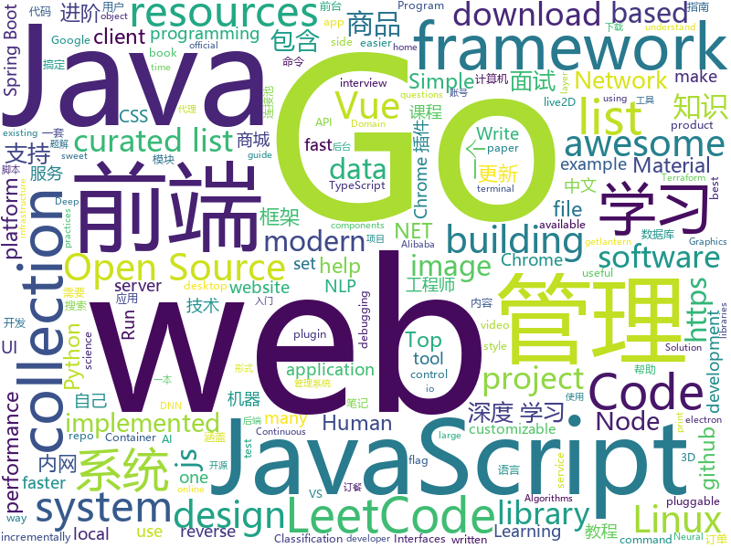

# 2019-05-12
See what the GitHub community is most excited about today.

## python
* [machine-learning-course](https://github.com/machinelearningmindset/machine-learning-course)(**361 stars today**): 💬Machine Learning Course with Python
* [Python](https://github.com/TheAlgorithms/Python)(**212 stars today**): All Algorithms implemented in Python
* [tg2](https://github.com/TurboGears/tg2)(**229 stars today**): Python web framework with full-stack layer implemented on top of a microframework core with support for MongoDB, Pluggable Applications and autogenerated Admin
* [graphics](https://github.com/tensorflow/graphics)(**221 stars today**): TensorFlow Graphics: Differentiable Graphics Layers for TensorFlow
* [edgedb](https://github.com/edgedb/edgedb)(**157 stars today**): The next generation relational database. A @MagicStack project.
* [PySnooper](https://github.com/cool-RR/PySnooper)(**80 stars today**): Never use print for debugging again
* [awesome-python](https://github.com/vinta/awesome-python)(**60 stars today**): A curated list of awesome Python frameworks, libraries, software and resources
* [models](https://github.com/tensorflow/models)(**45 stars today**): Models and examples built with TensorFlow
* [mindmeld](https://github.com/cisco/mindmeld)(**53 stars today**): An Open Source Conversational AI Platform for Deep-Domain Voice Interfaces and Chatbots.
* [awesome-jenkins-rce-2019](https://github.com/orangetw/awesome-jenkins-rce-2019)(**49 stars today**): There is no pre-auth RCE in Jenkins since May 2017, but this is the one!
* [AiLearning](https://github.com/apachecn/AiLearning)(**47 stars today**): AiLearning: 机器学习 - MachineLearning - ML、深度学习 - DeepLearning - DL、自然语言处理 NLP
* [icecream](https://github.com/gruns/icecream)(**48 stars today**): 🍦Sweet and creamy print debugging.
* [black](https://github.com/python/black)(**46 stars today**): The uncompromising Python code formatter
* [youtube-dl](https://github.com/ytdl-org/youtube-dl)(**39 stars today**): Command-line program to download videos from YouTube.com and other video sites
* [system-design-primer](https://github.com/donnemartin/system-design-primer)(**37 stars today**): Learn how to design large-scale systems. Prep for the system design interview. Includes Anki flashcards.
* [NeuronBlocks](https://github.com/microsoft/NeuronBlocks)(**39 stars today**): NLP DNN Toolkit - Building Your NLP DNN Models Like Playing Lego
* [public-apis](https://github.com/toddmotto/public-apis)(**32 stars today**): A collective list of free APIs for use in software and web development.
* [faceswap](https://github.com/deepfakes/faceswap)(**29 stars today**): Non official project based on original /r/Deepfakes thread. Many thanks to him!
* [easy-linux-pwn](https://github.com/xairy/easy-linux-pwn)(**34 stars today**): A set of Linux binary exploitation tasks for beginners
* [ChromeAppHeroes](https://github.com/zhaoolee/ChromeAppHeroes)(**32 stars today**): 🌈谷粒-Chrome插件英雄榜, 为优秀的Chrome插件写一本中文说明书, 让Chrome插件英雄们造福人类~ ChromePluginHeroes, Write a Chinese manual for the excellent Chrome plugin, let the Chrome plugin heroes benefit the human~
* [MeshCNN](https://github.com/ranahanocka/MeshCNN)(**32 stars today**): Convolutional Neural Network for 3D meshes in PyTorch
* [occupancy_networks](https://github.com/autonomousvision/occupancy_networks)(**30 stars today**): This repository contains the code for the paper "Occupancy Networks - Learning 3D Reconstruction in Function Space"
* [home-assistant](https://github.com/home-assistant/home-assistant)(**27 stars today**): 🏡Open source home automation that puts local control and privacy first
* [SPADE](https://github.com/NVlabs/SPADE)(**27 stars today**): Semantic Image Synthesis with SPADE
* [lighttrack](https://github.com/Guanghan/lighttrack)(**27 stars today**): Code for paper "LightTrack: A Generic Framework for Online Top-Down Human Pose Tracking"

## java
* [LeetCodeAnimation](https://github.com/MisterBooo/LeetCodeAnimation)(**348 stars today**): Demonstrate all the questions on LeetCode in the form of animation.（用动画的形式呈现解LeetCode题目的思路）
* [CS-Notes](https://github.com/CyC2018/CS-Notes)(**117 stars today**): 📚技术面试必备基础知识、Leetcode 题解、后端面试、Java 面试、春招、秋招、操作系统、计算机网络、系统设计
* [JavaGuide](https://github.com/Snailclimb/JavaGuide)(**67 stars today**): 【Java学习+面试指南】 一份涵盖大部分Java程序员所需要掌握的核心知识。
* [learnxinyminutes-docs](https://github.com/adambard/learnxinyminutes-docs)(**72 stars today**): Code documentation written as code! How novel and totally my idea!
* [Linkage-RecyclerView](https://github.com/KunMinX/Linkage-RecyclerView)(**67 stars today**): 即使不用饿了么订餐，也请务必收藏好该库！🔥一行代码即可接入，二级联动订餐列表 - RecyclerView + AndroidX
* [metatron-discovery](https://github.com/metatron-app/metatron-discovery)(**64 stars today**): Powerful & Easy way for big data discovery
* [advanced-java](https://github.com/doocs/advanced-java)(**59 stars today**): 😮互联网 Java 工程师进阶知识完全扫盲：涵盖高并发、分布式、高可用、微服务等领域知识
* [server](https://github.com/wildfirechat/server)(**37 stars today**): 全开源即时通讯(IM)系统
* [mall](https://github.com/macrozheng/mall)(**27 stars today**): mall项目是一套电商系统，包括前台商城系统及后台管理系统，基于SpringBoot+MyBatis实现。 前台商城系统包含首页门户、商品推荐、商品搜索、商品展示、购物车、订单流程、会员中心、客户服务、帮助中心等模块。 后台管理系统包含商品管理、订单管理、会员管理、促销管理、运营管理、内容管理、统计报表、财务管理、权限管理、设置等模块。
* [spring-boot](https://github.com/spring-projects/spring-boot)(**29 stars today**): Spring Boot
* [spring-boot-examples](https://github.com/ityouknow/spring-boot-examples)(**26 stars today**): about learning Spring Boot via examples. Spring Boot 教程、技术栈示例代码，快速简单上手教程。
* [elasticsearch](https://github.com/elastic/elasticsearch)(**29 stars today**): Open Source, Distributed, RESTful Search Engine
* [spring-framework](https://github.com/spring-projects/spring-framework)(**24 stars today**): Spring Framework
* [java-design-patterns](https://github.com/iluwatar/java-design-patterns)(**24 stars today**): Design patterns implemented in Java
* [halo](https://github.com/halo-dev/halo)(**25 stars today**): ✍ Halo 可能是最好的 Java 博客系统
* [Java](https://github.com/TheAlgorithms/Java)(**24 stars today**): All Algorithms implemented in Java
* [graal](https://github.com/oracle/graal)(**27 stars today**): GraalVM: Run Programs Faster Anywhere🚀
* [hutool](https://github.com/looly/hutool)(**22 stars today**): A set of tools that keep Java sweet.
* [android-DarkTheme](https://github.com/googlesamples/android-DarkTheme)(**25 stars today**): 
* [toBeTopJavaer](https://github.com/hollischuang/toBeTopJavaer)(**24 stars today**): To Be Top Javaer - Java工程师成神之路
* [arthas](https://github.com/alibaba/arthas)(**21 stars today**): Alibaba Java Diagnostic Tool Arthas/Alibaba Java诊断利器Arthas
* [ghidra](https://github.com/NationalSecurityAgency/ghidra)(**21 stars today**): Ghidra is a software reverse engineering (SRE) framework
* [druid](https://github.com/alibaba/druid)(**17 stars today**): 阿里巴巴数据库事业部出品，为监控而生的数据库连接池。阿里云Data Lake Analytics(https://www.aliyun.com/product/datalakeanalytics )、DRDS、TDDL 连接池powered by Druid
* [litemall](https://github.com/linlinjava/litemall)(**19 stars today**): 又一个小商城。litemall = Spring Boot后端 + Vue管理员前端 + 微信小程序用户前端 + Vue用户移动端
* [material-components-android](https://github.com/material-components/material-components-android)(**20 stars today**): Modular and customizable Material Design UI components for Android

## unknown
* [PowerToys](https://github.com/microsoft/PowerToys)(**170 stars today**): Windows system utilities to maximize productivity
* [awesome-product-design](https://github.com/teoga/awesome-product-design)(**149 stars today**): A collection of bookmarks, resources, articles for product designers.
* [Bash-Oneliner](https://github.com/onceupon/Bash-Oneliner)(**103 stars today**): A large collection of handy Bash one-liner commands and terminal tricks for data processing and Linux system maintenance.
* [go-perfbook](https://github.com/dgryski/go-perfbook)(**91 stars today**): Thoughts on Go performance optimization
* [FUNIT](https://github.com/NVlabs/FUNIT)(**71 stars today**): Translate images to unseen domains in the test time with few example images.
* [Data-Science--Cheat-Sheet](https://github.com/abhat222/Data-Science--Cheat-Sheet)(**57 stars today**): Cheat Sheets
* [developer-roadmap](https://github.com/kamranahmedse/developer-roadmap)(**58 stars today**): Roadmap to becoming a web developer in 2019
* [gitignore](https://github.com/github/gitignore)(**46 stars today**): A collection of useful .gitignore templates
* [You-Dont-Know-JS](https://github.com/getify/You-Dont-Know-JS)(**52 stars today**): A book series on JavaScript. @YDKJS on twitter.
* [awesome](https://github.com/sindresorhus/awesome)(**51 stars today**): 😎Awesome lists about all kinds of interesting topics
* [coding-interview-university](https://github.com/jwasham/coding-interview-university)(**43 stars today**): A complete computer science study plan to become a software engineer.
* [Anime-Girls-Holding-Programming-Books](https://github.com/boyEstrogen/Anime-Girls-Holding-Programming-Books)(**45 stars today**): Anime Girls Holding Programming Books
* [awesome-typescript](https://github.com/dzharii/awesome-typescript)(**43 stars today**): A collection of awesome TypeScript resources for client-side and server-side development. Write your awesome JavaScript in TypeScript
* [free-programming-books](https://github.com/EbookFoundation/free-programming-books)(**35 stars today**): 📚Freely available programming books
* [trackerslist](https://github.com/ngosang/trackerslist)(**36 stars today**): An updated list of public BitTorrent trackers
* [Resources-for-Beginner-Bug-Bounty-Hunters](https://github.com/nahamsec/Resources-for-Beginner-Bug-Bounty-Hunters)(**29 stars today**): A list of resources for those interested in getting started in bug bounties
* [architect-awesome](https://github.com/xingshaocheng/architect-awesome)(**26 stars today**): 后端架构师技术图谱
* [DeepLearning-500-questions](https://github.com/scutan90/DeepLearning-500-questions)(**26 stars today**): 深度学习500问，以问答形式对常用的概率知识、线性代数、机器学习、深度学习、计算机视觉等热点问题进行阐述，以帮助自己及有需要的读者。 全书分为18个章节，50余万字。由于水平有限，书中不妥之处恳请广大读者批评指正。 未完待续............ 如有意合作，联系scutjy2015@163.com 版权所有，违权必究 Tan 2018.06
* [Daily-Interview-Question](https://github.com/Advanced-Frontend/Daily-Interview-Question)(**29 stars today**): 我是木易杨，公众号「高级前端进阶」作者，每天搞定一道前端大厂面试题，祝大家天天进步，一年后会看到不一样的自己。
* [datascience](https://github.com/r0f1/datascience)(**26 stars today**): Curated list of Python resources for data science.
* [gdut-course](https://github.com/brenner8023/gdut-course)(**24 stars today**): 广东工业大学计算机学院课程攻略
* [project-based-learning](https://github.com/tuvtran/project-based-learning)(**25 stars today**): Curated list of project-based tutorials
* [commit-messages-guide](https://github.com/RomuloOliveira/commit-messages-guide)(**25 stars today**): A guide to understand the importance of commit messages and how to write them well
* [Free-SS-SSR](https://github.com/dxxzst/Free-SS-SSR)(**24 stars today**): 免费的SS账号、SSR账号，定期更新。优先更新：
* [first-contributions](https://github.com/firstcontributions/first-contributions)(**12 stars today**): 🚀✨Help beginners to contribute to open source projects

## javascript
* [comlink](https://github.com/GoogleChromeLabs/comlink)(**261 stars today**): Comlink makes WebWorkers enjoyable.
* [fusuma](https://github.com/hiroppy/fusuma)(**193 stars today**): ✍️Fusuma makes slides with Markdown easily.
* [wildduck](https://github.com/nodemailer/wildduck)(**127 stars today**): Opinionated email server
* [dinoql](https://github.com/victorvoid/dinoql)(**125 stars today**): A customizable GraphQL style query language for interacting with JavaScript objects.
* [leetcode](https://github.com/azl397985856/leetcode)(**101 stars today**): LeetCode Solutions: A Record of My Problem Solving Journey.( leetcode题解，记录自己的leetcode解题之路。)
* [vue](https://github.com/vuejs/vue)(**92 stars today**): 🖖Vue.js is a progressive, incrementally-adoptable JavaScript framework for building UI on the web.
* [Web](https://github.com/qianguyihao/Web)(**78 stars today**): Web前端入门和进阶学习笔记，超详细的前端学习图文教程。从零开始学前端，做一个Web全栈工程师。持续更新...
* [react](https://github.com/facebook/react)(**61 stars today**): A declarative, efficient, and flexible JavaScript library for building user interfaces.
* [nodebestpractices](https://github.com/i0natan/nodebestpractices)(**52 stars today**): ✅The largest Node.js best practices list (April 2019)
* [training](https://github.com/cloud-annotations/training)(**45 stars today**): 🐝Custom Object Detection and Classification Training
* [svelte](https://github.com/sveltejs/svelte)(**47 stars today**): Cybernetically enhanced web apps
* [30-seconds-of-code](https://github.com/30-seconds/30-seconds-of-code)(**41 stars today**): A curated collection of useful JavaScript snippets that you can understand in 30 seconds or less.
* [autoComplete.js](https://github.com/TarekRaafat/autoComplete.js)(**43 stars today**): Simple autocomplete pure vanilla Javascript library.
* [create-react-app](https://github.com/facebook/create-react-app)(**33 stars today**): Set up a modern web app by running one command.
* [node](https://github.com/nodejs/node)(**36 stars today**): Node.js JavaScript runtime✨🐢🚀✨
* [cash](https://github.com/kenwheeler/cash)(**39 stars today**): An absurdly small jQuery alternative for modern browsers
* [tippyjs](https://github.com/atomiks/tippyjs)(**38 stars today**): Highly customizable tooltip and popover library
* [libpku](https://github.com/lib-pku/libpku)(**35 stars today**): 贵校课程资料民间整理
* [uni-app](https://github.com/dcloudio/uni-app)(**37 stars today**): 使用 Vue.js 开发跨平台应用的前端框架
* [baiduyun](https://github.com/syhyz1990/baiduyun)(**34 stars today**): 🖖油猴脚本 一个脚本搞定百度网盘下载
* [awesome-vscode](https://github.com/viatsko/awesome-vscode)(**34 stars today**): 🎨A curated list of delightful VS Code packages and resources.
* [next.js](https://github.com/zeit/next.js)(**30 stars today**): The React Framework
* [puppeteer](https://github.com/GoogleChrome/puppeteer)(**33 stars today**): Headless Chrome Node API
* [material-ui](https://github.com/mui-org/material-ui)(**28 stars today**): React components for faster and easier web development. Build your own design system, or start with Material Design.
* [axios](https://github.com/axios/axios)(**32 stars today**): Promise based HTTP client for the browser and node.js

## html
* [Python-100-Days](https://github.com/jackfrued/Python-100-Days)(**736 stars today**): Python - 100天从新手到大师
* [go101](https://github.com/go101/go101)(**258 stars today**): An online book focusing on Go syntax/semantics.
* [linux-command](https://github.com/jaywcjlove/linux-command)(**87 stars today**): Linux命令大全搜索工具，内容包含Linux命令手册、详解、学习、搜集。https://git.io/linux
* [flutter-in-action](https://github.com/flutterchina/flutter-in-action)(**36 stars today**): 《Flutter实战》电子书
* [water.css](https://github.com/kognise/water.css)(**24 stars today**): A just-add-css collection of styles to make simple websites just a little nicer
* [nndl.github.io](https://github.com/nndl/nndl.github.io)(**21 stars today**): 《神经网络与深度学习》 Neural Network and Deep Learning
* [styleguide](https://github.com/google/styleguide)(**18 stars today**): Style guides for Google-originated open-source projects
* [Electron-elf](https://github.com/fguby/Electron-elf)(**17 stars today**): 使用electron和live2D开发的类似桌面精灵的应用（A desktop application developed using electron and live2D）
* [Front-end-Developer-Interview-Questions](https://github.com/h5bp/Front-end-Developer-Interview-Questions)(**16 stars today**): A list of helpful front-end related questions you can use to interview potential candidates, test yourself or completely ignore.
* [golang101](https://github.com/golang101/golang101)(**14 stars today**): Go语言101 : 一本侧重于Go语言语法和语义的编程解释和指导书
* [Coursera-ML-AndrewNg-Notes](https://github.com/fengdu78/Coursera-ML-AndrewNg-Notes)(**12 stars today**): 吴恩达老师的机器学习课程个人笔记
* [WebFundamentals](https://github.com/google/WebFundamentals)(**12 stars today**): Best practices for modern web development
* [Spoon-Knife](https://github.com/octocat/Spoon-Knife)(****): This repo is for demonstration purposes only.
* [fastText](https://github.com/facebookresearch/fastText)(**10 stars today**): Library for fast text representation and classification.
* [dotnet](https://github.com/microsoft/dotnet)(**11 stars today**): This repo is the official home of .NET on GitHub. It's a great starting point to find many .NET OSS projects from Microsoft and the community, including many that are part of the .NET Foundation.
* [en.javascript.info](https://github.com/javascript-tutorial/en.javascript.info)(**9 stars today**): Modern JavaScript Tutorial
* [personal-website](https://github.com/github/personal-website)(**5 stars today**): Code that'll help you kickstart a personal website that showcases your work as a software developer.
* [devops-essentials-sample-app](https://github.com/linuxacademy/devops-essentials-sample-app)(****): 
* [portainer](https://github.com/portainer/portainer)(**7 stars today**): Simple management UI for Docker
* [fonts](https://github.com/google/fonts)(**7 stars today**): Font files available from Google Fonts
* [flag-icon-css](https://github.com/lipis/flag-icon-css)(**5 stars today**): 🎏A collection of all country flags in SVG — plus the CSS for easier integration
* [dropcss](https://github.com/leeoniya/dropcss)(**6 stars today**): An exceptionally fast, thorough and tiny unused-CSS cleaner
* [requests-html](https://github.com/kennethreitz/requests-html)(**6 stars today**): Pythonic HTML Parsing for Humans™
* [vue-unit-test-with-jest](https://github.com/holylovelqq/vue-unit-test-with-jest)(**6 stars today**): 吃透本仓库，变身vue项目单体测试大神
* [ru.javascript.info](https://github.com/javascript-tutorial/ru.javascript.info)(**5 stars today**): Современный учебник JavaScript

## go
* [sqlflow](https://github.com/sql-machine-learning/sqlflow)(**68 stars today**): Brings SQL and AI together.
* [gameboy.live](https://github.com/HFO4/gameboy.live)(**70 stars today**): 🕹️A basic gameboy emulator with terminal "Cloud Gaming" support
* [fyne](https://github.com/fyne-io/fyne)(**45 stars today**): Cross platform GUI in Go based on Material Design
* [kubernetes](https://github.com/kubernetes/kubernetes)(**38 stars today**): Production-Grade Container Scheduling and Management
* [gin](https://github.com/gin-gonic/gin)(**35 stars today**): Gin is a HTTP web framework written in Go (Golang). It features a Martini-like API with much better performance -- up to 40 times faster. If you need smashing performance, get yourself some Gin.
* [awesome-go](https://github.com/avelino/awesome-go)(**32 stars today**): A curated list of awesome Go frameworks, libraries and software
* [wails](https://github.com/wailsapp/wails)(**33 stars today**): Create desktop apps using Go and Web Technologies
* [frp](https://github.com/fatedier/frp)(**28 stars today**): A fast reverse proxy to help you expose a local server behind a NAT or firewall to the internet.
* [go](https://github.com/golang/go)(**32 stars today**): The Go programming language
* [hugo](https://github.com/gohugoio/hugo)(**29 stars today**): The world’s fastest framework for building websites.
* [sshcode](https://github.com/cdr/sshcode)(**29 stars today**): Run VS Code on any server over SSH.
* [kratos](https://github.com/bilibili/kratos)(**26 stars today**): Kratos是bilibili开源的一套Go微服务框架，包含大量微服务相关框架及工具。
* [lantern](https://github.com/getlantern/lantern)(**23 stars today**): 🔴蓝灯最新版本下载 https://github.com/getlantern/download🔴Lantern Latest Download https://github.com/getlantern/download🔴
* [flipt](https://github.com/markphelps/flipt)(**22 stars today**): A feature flag solution that runs in your existing infrastructure
* [client](https://github.com/keybase/client)(**21 stars today**): Keybase Go Library, Client, Service, OS X, iOS, Android, Electron
* [spotitube](https://github.com/streambinder/spotitube)(**21 stars today**): Shell go-lang application to incrementally download from Spotify into local folder
* [caire](https://github.com/esimov/caire)(**20 stars today**): Content aware image resize library
* [syncthing](https://github.com/syncthing/syncthing)(**18 stars today**): Open Source Continuous File Synchronization
* [terraformer](https://github.com/GoogleCloudPlatform/terraformer)(**18 stars today**): CLI tool to generate terraform files from existing infrastructure (reverse Terraform). Infrastructure to Code
* [logrus](https://github.com/sirupsen/logrus)(**18 stars today**): Structured, pluggable logging for Go.
* [the-way-to-go_ZH_CN](https://github.com/Unknwon/the-way-to-go_ZH_CN)(**16 stars today**): 《The Way to Go》中文译本，中文正式名《Go 入门指南》
* [drone](https://github.com/drone/drone)(**18 stars today**): Drone is a Container-Native, Continuous Delivery Platform
* [v2ray-core](https://github.com/v2ray/v2ray-core)(**14 stars today**): A platform for building proxies to bypass network restrictions.
* [nps](https://github.com/cnlh/nps)(**15 stars today**): 一款轻量级、功能强大的内网穿透代理服务器。支持tcp、udp流量转发，支持内网http代理、内网socks5代理，同时支持snappy压缩、站点保护、加密传输、多路复用、header修改等。支持web图形化管理，集成多用户模式。
* [istio](https://github.com/istio/istio)(**16 stars today**): Connect, secure, control, and observe services.

## WordCloud

