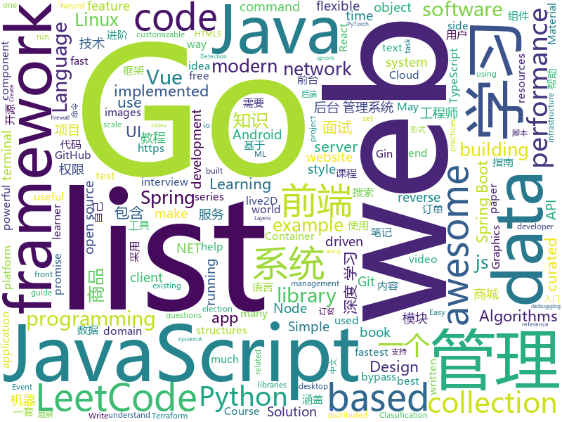

# 2019-05-13
See what the GitHub community is most excited about today.

## python
* [machine-learning-course](https://github.com/machinelearningmindset/machine-learning-course)(**502 stars today**): 💬Machine Learning Course with Python
* [Python](https://github.com/TheAlgorithms/Python)(**307 stars today**): All Algorithms implemented in Python
* [graphics](https://github.com/tensorflow/graphics)(**132 stars today**): TensorFlow Graphics: Differentiable Graphics Layers for TensorFlow
* [stumpy](https://github.com/TDAmeritrade/stumpy)(**112 stars today**): STUMPY is a powerful and scalable Python library that can be used for a variety of time series data mining tasks
* [edgedb](https://github.com/edgedb/edgedb)(**99 stars today**): The next generation relational database.
* [MeshCNN](https://github.com/ranahanocka/MeshCNN)(**95 stars today**): Convolutional Neural Network for 3D meshes in PyTorch
* [PySnooper](https://github.com/cool-RR/PySnooper)(**51 stars today**): Never use print for debugging again
* [models](https://github.com/tensorflow/models)(**38 stars today**): Models and examples built with TensorFlow
* [system-design-primer](https://github.com/donnemartin/system-design-primer)(**43 stars today**): Learn how to design large-scale systems. Prep for the system design interview. Includes Anki flashcards.
* [youtube-dl](https://github.com/ytdl-org/youtube-dl)(**40 stars today**): Command-line program to download videos from YouTube.com and other video sites
* [awesome-python](https://github.com/vinta/awesome-python)(**40 stars today**): A curated list of awesome Python frameworks, libraries, software and resources
* [public-apis](https://github.com/toddmotto/public-apis)(**40 stars today**): A collective list of free APIs for use in software and web development.
* [easy-linux-pwn](https://github.com/xairy/easy-linux-pwn)(**38 stars today**): A set of Linux binary exploitation tasks for beginners
* [AiLearning](https://github.com/apachecn/AiLearning)(**35 stars today**): AiLearning: 机器学习 - MachineLearning - ML、深度学习 - DeepLearning - DL、自然语言处理 NLP
* [gradtype](https://github.com/indutny/gradtype)(**38 stars today**): WIP
* [black](https://github.com/python/black)(**37 stars today**): The uncompromising Python code formatter
* [you-get](https://github.com/soimort/you-get)(**29 stars today**): ⏬Dumb downloader that scrapes the web
* [django](https://github.com/django/django)(**30 stars today**): The Web framework for perfectionists with deadlines.
* [gpt-2](https://github.com/openai/gpt-2)(**29 stars today**): Code for the paper "Language Models are Unsupervised Multitask Learners"
* [metalearn-leap](https://github.com/amzn/metalearn-leap)(**30 stars today**): Original PyTorch implementation of the Leap meta-learner (https://arxiv.org/abs/1812.01054) along with code for running the Omniglot experiment presented in the paper.
* [100-Days-Of-ML-Code](https://github.com/Avik-Jain/100-Days-Of-ML-Code)(**27 stars today**): 100 Days of ML Coding
* [keras](https://github.com/keras-team/keras)(**24 stars today**): Deep Learning for humans
* [awesome-jenkins-rce-2019](https://github.com/orangetw/awesome-jenkins-rce-2019)(**27 stars today**): There is no pre-auth RCE in Jenkins since May 2017, but this is the one!
* [face_recognition](https://github.com/ageitgey/face_recognition)(**26 stars today**): The world's simplest facial recognition api for Python and the command line
* [pandas](https://github.com/pandas-dev/pandas)(**26 stars today**): Flexible and powerful data analysis / manipulation library for Python, providing labeled data structures similar to R data.frame objects, statistical functions, and much more

## java
* [LeetCodeAnimation](https://github.com/MisterBooo/LeetCodeAnimation)(**272 stars today**): Demonstrate all the questions on LeetCode in the form of animation.（用动画的形式呈现解LeetCode题目的思路）
* [CS-Notes](https://github.com/CyC2018/CS-Notes)(**119 stars today**): 📚技术面试必备基础知识、Leetcode 题解、后端面试、Java 面试、春招、秋招、操作系统、计算机网络、系统设计
* [JavaGuide](https://github.com/Snailclimb/JavaGuide)(**76 stars today**): 【Java学习+面试指南】 一份涵盖大部分Java程序员所需要掌握的核心知识。
* [Linkage-RecyclerView](https://github.com/KunMinX/Linkage-RecyclerView)(**41 stars today**): 即使不用饿了么订餐，也请务必收藏好该库！🔥一行代码即可接入，二级联动订餐列表 - RecyclerView + AndroidX
* [mall](https://github.com/macrozheng/mall)(**38 stars today**): mall项目是一套电商系统，包括前台商城系统及后台管理系统，基于SpringBoot+MyBatis实现。 前台商城系统包含首页门户、商品推荐、商品搜索、商品展示、购物车、订单流程、会员中心、客户服务、帮助中心等模块。 后台管理系统包含商品管理、订单管理、会员管理、促销管理、运营管理、内容管理、统计报表、财务管理、权限管理、设置等模块。
* [advanced-java](https://github.com/doocs/advanced-java)(**36 stars today**): 😮互联网 Java 工程师进阶知识完全扫盲：涵盖高并发、分布式、高可用、微服务等领域知识
* [spring-boot](https://github.com/spring-projects/spring-boot)(**30 stars today**): Spring Boot
* [Java](https://github.com/TheAlgorithms/Java)(**34 stars today**): All Algorithms implemented in Java
* [litemall](https://github.com/linlinjava/litemall)(**30 stars today**): 又一个小商城。litemall = Spring Boot后端 + Vue管理员前端 + 微信小程序用户前端 + Vue用户移动端
* [tutorials](https://github.com/eugenp/tutorials)(**23 stars today**): The "REST With Spring" Course:
* [toBeTopJavaer](https://github.com/hollischuang/toBeTopJavaer)(**31 stars today**): To Be Top Javaer - Java工程师成神之路
* [eladmin](https://github.com/elunez/eladmin)(**27 stars today**): 项目基于 Spring Boot 2.1.0 、 Jpa、 Spring Security、redis、Vue的前后端分离的后台管理系统，项目采用分模块开发方式， 权限控制采用 RBAC，支持数据字典与数据权限管理，前端菜单支持动态路由
* [spring-boot-examples](https://github.com/ityouknow/spring-boot-examples)(**21 stars today**): about learning Spring Boot via examples. Spring Boot 教程、技术栈示例代码，快速简单上手教程。
* [spring-framework](https://github.com/spring-projects/spring-framework)(**19 stars today**): Spring Framework
* [metatron-discovery](https://github.com/metatron-app/metatron-discovery)(**25 stars today**): Powerful & Easy way for big data discovery
* [halo](https://github.com/halo-dev/halo)(**20 stars today**): ✍ Halo 可能是最好的 Java 博客系统
* [server](https://github.com/wildfirechat/server)(**23 stars today**): 全开源即时通讯(IM)系统
* [ghidra](https://github.com/NationalSecurityAgency/ghidra)(**24 stars today**): Ghidra is a software reverse engineering (SRE) framework
* [elasticsearch](https://github.com/elastic/elasticsearch)(**20 stars today**): Open Source, Distributed, RESTful Search Engine
* [learnxinyminutes-docs](https://github.com/adambard/learnxinyminutes-docs)(**22 stars today**): Code documentation written as code! How novel and totally my idea!
* [java-design-patterns](https://github.com/iluwatar/java-design-patterns)(**20 stars today**): Design patterns implemented in Java
* [material-components-android](https://github.com/material-components/material-components-android)(**20 stars today**): Modular and customizable Material Design UI components for Android
* [Component](https://github.com/xiaojinzi123/Component)(**21 stars today**): 一个强大完善的Android组件化方案,后续我会跟上一个使用了组件化的 App 真实例子.
* [incubator-dubbo](https://github.com/apache/incubator-dubbo)(**17 stars today**): Apache Dubbo (incubating) is a high-performance, java based, open source RPC framework.
* [android-DarkTheme](https://github.com/googlesamples/android-DarkTheme)(**19 stars today**): 

## unknown
* [PowerToys](https://github.com/microsoft/PowerToys)(**213 stars today**): Windows system utilities to maximize productivity
* [go-perfbook](https://github.com/dgryski/go-perfbook)(**145 stars today**): Thoughts on Go performance optimization
* [awesome-product-design](https://github.com/teoga/awesome-product-design)(**83 stars today**): A collection of bookmarks, resources, articles for product designers.
* [Data-Science--Cheat-Sheet](https://github.com/abhat222/Data-Science--Cheat-Sheet)(**47 stars today**): Cheat Sheets
* [You-Dont-Know-JS](https://github.com/getify/You-Dont-Know-JS)(**50 stars today**): A book series on JavaScript. @YDKJS on twitter.
* [gitignore](https://github.com/github/gitignore)(**39 stars today**): A collection of useful .gitignore templates
* [developer-roadmap](https://github.com/kamranahmedse/developer-roadmap)(**50 stars today**): Roadmap to becoming a web developer in 2019
* [dsl-syllabus-fall-2016](https://github.com/jeanqasaur/dsl-syllabus-fall-2016)(**52 stars today**): The syllabus from 15-819, the PhD seminar I taught on domain-specific programming languages fall 2016.
* [coding-interview-university](https://github.com/jwasham/coding-interview-university)(**39 stars today**): A complete computer science study plan to become a software engineer.
* [awesome](https://github.com/sindresorhus/awesome)(**47 stars today**): 😎Awesome lists about all kinds of interesting topics
* [Anime-Girls-Holding-Programming-Books](https://github.com/boyEstrogen/Anime-Girls-Holding-Programming-Books)(**45 stars today**): Anime Girls Holding Programming Books
* [XSS-Payloads](https://github.com/RenwaX23/XSS-Payloads)(**42 stars today**): List of XSS Vectors/Payloads
* [free-programming-books](https://github.com/EbookFoundation/free-programming-books)(**33 stars today**): 📚Freely available programming books
* [github-cheat-sheet](https://github.com/tiimgreen/github-cheat-sheet)(**37 stars today**): A list of cool features of Git and GitHub.
* [MSSQL_SQL_BYPASS_WIKI](https://github.com/aleenzz/MSSQL_SQL_BYPASS_WIKI)(**34 stars today**): MSSQL注入提权,bypass的一些总结
* [trackerslist](https://github.com/ngosang/trackerslist)(**34 stars today**): An updated list of public BitTorrent trackers
* [project-based-learning](https://github.com/tuvtran/project-based-learning)(**32 stars today**): Curated list of project-based tutorials
* [architect-awesome](https://github.com/xingshaocheng/architect-awesome)(**29 stars today**): 后端架构师技术图谱
* [commit-messages-guide](https://github.com/RomuloOliveira/commit-messages-guide)(**32 stars today**): A guide to understand the importance of commit messages and how to write them well
* [FUNIT](https://github.com/NVlabs/FUNIT)(**25 stars today**): Translate images to unseen domains in the test time with few example images.
* [git-tips](https://github.com/521xueweihan/git-tips)(**25 stars today**): Git的奇技淫巧
* [awesome-typescript](https://github.com/dzharii/awesome-typescript)(**27 stars today**): A collection of awesome TypeScript resources for client-side and server-side development. Write your awesome JavaScript in TypeScript
* [DeepLearning-500-questions](https://github.com/scutan90/DeepLearning-500-questions)(**25 stars today**): 深度学习500问，以问答形式对常用的概率知识、线性代数、机器学习、深度学习、计算机视觉等热点问题进行阐述，以帮助自己及有需要的读者。 全书分为18个章节，50余万字。由于水平有限，书中不妥之处恳请广大读者批评指正。 未完待续............ 如有意合作，联系scutjy2015@163.com 版权所有，违权必究 Tan 2018.06
* [awesome-vue](https://github.com/vuejs/awesome-vue)(**23 stars today**): 🎉A curated list of awesome things related to Vue.js
* [app-ideas](https://github.com/florinpop17/app-ideas)(**21 stars today**): A Collection of application ideas which can be used to improve your coding skills.

## javascript
* [comlink](https://github.com/GoogleChromeLabs/comlink)(**257 stars today**): Comlink makes WebWorkers enjoyable.
* [dinoql](https://github.com/victorvoid/dinoql)(**188 stars today**): A customizable GraphQL style query language for interacting with JavaScript objects.
* [fusuma](https://github.com/hiroppy/fusuma)(**164 stars today**): ✍️Fusuma makes slides with Markdown easily.
* [react-tetris](https://github.com/chvin/react-tetris)(**146 stars today**): Use React, Redux, Immutable to code Tetris.🎮
* [leetcode](https://github.com/azl397985856/leetcode)(**99 stars today**): LeetCode Solutions: A Record of My Problem Solving Journey.( leetcode题解，记录自己的leetcode解题之路。)
* [svelte](https://github.com/sveltejs/svelte)(**74 stars today**): Cybernetically enhanced web apps
* [nodebestpractices](https://github.com/i0natan/nodebestpractices)(**69 stars today**): ✅The largest Node.js best practices list (May 2019)
* [vue](https://github.com/vuejs/vue)(**60 stars today**): 🖖Vue.js is a progressive, incrementally-adoptable JavaScript framework for building UI on the web.
* [react-async](https://github.com/ghengeveld/react-async)(**62 stars today**): 🍾Flexible promise-based React data loader
* [react](https://github.com/facebook/react)(**54 stars today**): A declarative, efficient, and flexible JavaScript library for building user interfaces.
* [javascript-algorithms](https://github.com/trekhleb/javascript-algorithms)(**49 stars today**): 📝Algorithms and data structures implemented in JavaScript with explanations and links to further readings
* [Web](https://github.com/qianguyihao/Web)(**49 stars today**): Web前端入门和进阶学习笔记，超详细的前端学习图文教程。从零开始学前端，做一个Web全栈工程师。持续更新...
* [tesseract.js](https://github.com/naptha/tesseract.js)(**49 stars today**): Pure Javascript OCR for 62 Languages📖🎉🖥
* [create-react-app](https://github.com/facebook/create-react-app)(**38 stars today**): Set up a modern web app by running one command.
* [wildduck](https://github.com/nodemailer/wildduck)(**45 stars today**): Opinionated email server
* [training](https://github.com/cloud-annotations/training)(**42 stars today**): 🐝Custom Object Detection and Classification Training
* [libpku](https://github.com/lib-pku/libpku)(**39 stars today**): 贵校课程资料民间整理
* [axios](https://github.com/axios/axios)(**41 stars today**): Promise based HTTP client for the browser and node.js
* [baiduyun](https://github.com/syhyz1990/baiduyun)(**40 stars today**): 🖖油猴脚本 一个脚本搞定百度网盘下载
* [pixi.js](https://github.com/pixijs/pixi.js)(**40 stars today**): The HTML5 Creation Engine: Create beautiful digital content with the fastest, most flexible 2D WebGL renderer.
* [30-seconds-of-code](https://github.com/30-seconds/30-seconds-of-code)(**40 stars today**): A curated collection of useful JavaScript snippets that you can understand in 30 seconds or less.
* [javascript](https://github.com/airbnb/javascript)(**36 stars today**): JavaScript Style Guide
* [node](https://github.com/nodejs/node)(**31 stars today**): Node.js JavaScript runtime✨🐢🚀✨
* [cash](https://github.com/kenwheeler/cash)(**34 stars today**): An absurdly small jQuery alternative for modern browsers
* [hyper](https://github.com/zeit/hyper)(**32 stars today**): A terminal built on web technologies

## html
* [Python-100-Days](https://github.com/jackfrued/Python-100-Days)(**717 stars today**): Python - 100天从新手到大师
* [go101](https://github.com/go101/go101)(**192 stars today**): An online book focusing on Go syntax/semantics.
* [linux-command](https://github.com/jaywcjlove/linux-command)(**51 stars today**): Linux命令大全搜索工具，内容包含Linux命令手册、详解、学习、搜集。https://git.io/linux
* [nndl.github.io](https://github.com/nndl/nndl.github.io)(**29 stars today**): 《神经网络与深度学习》 Neural Network and Deep Learning
* [playground](https://github.com/tailwindcss/playground)(**25 stars today**): 
* [flutter-in-action](https://github.com/flutterchina/flutter-in-action)(**23 stars today**): 《Flutter实战》电子书
* [Coursera-ML-AndrewNg-Notes](https://github.com/fengdu78/Coursera-ML-AndrewNg-Notes)(**19 stars today**): 吴恩达老师的机器学习课程个人笔记
* [water.css](https://github.com/kognise/water.css)(**20 stars today**): A just-add-css collection of styles to make simple websites just a little nicer
* [Electron-elf](https://github.com/fguby/Electron-elf)(**19 stars today**): 使用electron和live2D开发的类似桌面精灵的应用（A desktop application developed using electron and live2D）
* [golang101](https://github.com/golang101/golang101)(**18 stars today**): Go语言101 : 一本侧重于Go语言语法和语义的编程解释和指导书
* [en.javascript.info](https://github.com/javascript-tutorial/en.javascript.info)(**16 stars today**): Modern JavaScript Tutorial
* [personal-website](https://github.com/github/personal-website)(**8 stars today**): Code that'll help you kickstart a personal website that showcases your work as a software developer.
* [fastText](https://github.com/facebookresearch/fastText)(**15 stars today**): Library for fast text representation and classification.
* [WebFundamentals](https://github.com/google/WebFundamentals)(**13 stars today**): Best practices for modern web development
* [styleguide](https://github.com/google/styleguide)(**11 stars today**): Style guides for Google-originated open-source projects
* [CalculusWithJulia.github.io](https://github.com/CalculusWithJulia/CalculusWithJulia.github.io)(**11 stars today**): Introductory Calculus with the Julia Programming Language
* [front-end-handbook-2019](https://github.com/FrontendMasters/front-end-handbook-2019)(**12 stars today**): [Book] 2019 edition of our front-end development handbook
* [Front-end-Developer-Interview-Questions](https://github.com/h5bp/Front-end-Developer-Interview-Questions)(**11 stars today**): A list of helpful front-end related questions you can use to interview potential candidates, test yourself or completely ignore.
* [portainer](https://github.com/portainer/portainer)(**11 stars today**): Simple management UI for Docker
* [speedtest](https://github.com/adolfintel/speedtest)(**9 stars today**): Self-hosted HTML5 Speedtest. Easy setup, examples, configurable, responsive and mobile friendly. Supports PHP, Node, and more.
* [dotnet](https://github.com/microsoft/dotnet)(**8 stars today**): This repo is the official home of .NET on GitHub. It's a great starting point to find many .NET OSS projects from Microsoft and the community, including many that are part of the .NET Foundation.
* [free-for-dev](https://github.com/ripienaar/free-for-dev)(**8 stars today**): A list of SaaS, PaaS and IaaS offerings that have free tiers of interest to devops and infradev
* [CLRS](https://github.com/walkccc/CLRS)(**8 stars today**): 📚Solutions to Introduction to Algorithms Third Edition
* [TranslatorX](https://github.com/pingfangx/TranslatorX)(**8 stars today**): JetBrains 系列软件汉化包
* [public-sans](https://github.com/uswds/public-sans)(**7 stars today**): A strong, neutral, principles-driven, open source typeface for text or display

## go
* [gameboy.live](https://github.com/HFO4/gameboy.live)(**172 stars today**): 🕹️A basic gameboy emulator with terminal "Cloud Gaming" support
* [sqlflow](https://github.com/sql-machine-learning/sqlflow)(**103 stars today**): Brings SQL and AI together.
* [go](https://github.com/golang/go)(**46 stars today**): The Go programming language
* [frp](https://github.com/fatedier/frp)(**31 stars today**): A fast reverse proxy to help you expose a local server behind a NAT or firewall to the internet.
* [gin](https://github.com/gin-gonic/gin)(**31 stars today**): Gin is a HTTP web framework written in Go (Golang). It features a Martini-like API with much better performance -- up to 40 times faster. If you need smashing performance, get yourself some Gin.
* [terraformer](https://github.com/GoogleCloudPlatform/terraformer)(**30 stars today**): CLI tool to generate terraform files from existing infrastructure (reverse Terraform). Infrastructure to Code
* [awesome-go](https://github.com/avelino/awesome-go)(**27 stars today**): A curated list of awesome Go frameworks, libraries and software
* [kratos](https://github.com/bilibili/kratos)(**27 stars today**): Kratos是bilibili开源的一套Go微服务框架，包含大量微服务相关框架及工具。
* [fyne](https://github.com/fyne-io/fyne)(**28 stars today**): Cross platform GUI in Go based on Material Design
* [kubernetes](https://github.com/kubernetes/kubernetes)(**23 stars today**): Production-Grade Container Scheduling and Management
* [the-way-to-go_ZH_CN](https://github.com/Unknwon/the-way-to-go_ZH_CN)(**24 stars today**): 《The Way to Go》中文译本，中文正式名《Go 入门指南》
* [multiwatch](https://github.com/Enapiuz/multiwatch)(**26 stars today**): Simple task runner on directory changes
* [etcd](https://github.com/etcd-io/etcd)(**23 stars today**): Distributed reliable key-value store for the most critical data of a distributed system
* [profilinggo](https://github.com/samonzeweb/profilinggo)(**24 stars today**): A quick tour (or reminder) of Go performance tools
* [komiser](https://github.com/mlabouardy/komiser)(**21 stars today**): Cloud Environment Inspector👮
* [hugo](https://github.com/gohugoio/hugo)(**20 stars today**): The world’s fastest framework for building websites.
* [flipt](https://github.com/markphelps/flipt)(**21 stars today**): A feature flag solution that runs in your existing infrastructure
* [traefik](https://github.com/containous/traefik)(**20 stars today**): The Cloud Native Edge Router
* [wails](https://github.com/wailsapp/wails)(**19 stars today**): Create desktop apps using Go and Web Technologies
* [mixin](https://github.com/MixinNetwork/mixin)(**19 stars today**): the Mixin TEE-BFT-DAG network reference implementation
* [client](https://github.com/keybase/client)(**18 stars today**): Keybase Go Library, Client, Service, OS X, iOS, Android, Electron
* [keda](https://github.com/kedacore/keda)(**18 stars today**): KEDA is a Kubernetes-based Event Driven Autoscaling component. It provides event driven scale for any container running in Kubernetes
* [v2ray-core](https://github.com/v2ray/v2ray-core)(**13 stars today**): A platform for building proxies to bypass network restrictions.
* [sshcode](https://github.com/cdr/sshcode)(**17 stars today**): Run VS Code on any server over SSH.
* [termshark](https://github.com/gcla/termshark)(**16 stars today**): A terminal UI for tshark, inspired by Wireshark

## WordCloud

