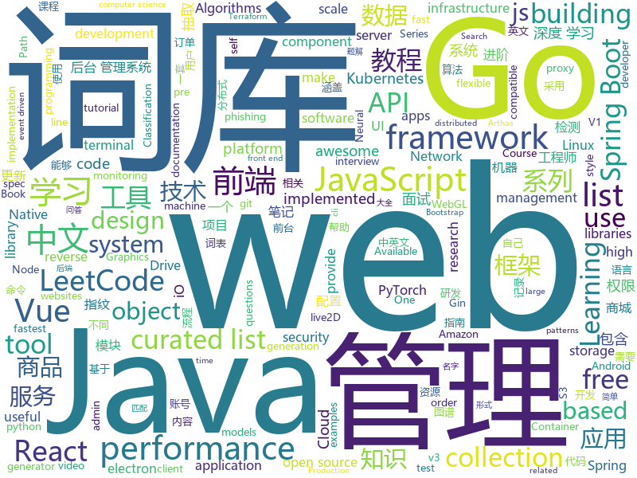

# 2019-05-15
See what the GitHub community is most excited about today.

## python
* [machine-learning-course](https://github.com/machinelearningmindset/machine-learning-course)(**422 stars today**): 💬Machine Learning Course with Python
* [Python](https://github.com/TheAlgorithms/Python)(**370 stars today**): All Algorithms implemented in Python
* [client](https://github.com/wandb/client)(**254 stars today**): The official cli and python API client for W&B
* [pysot](https://github.com/STVIR/pysot)(**183 stars today**): SenseTime Research platform for single object tracking, implementing algorithms like SiamRPN and SiamMask.
* [pishot](https://github.com/revalo/pishot)(**154 stars today**): Operate Raspberry Pi v1 camera in global exposure mode (instead of rolling shutter)📷✨
* [pytorch-image-models](https://github.com/rwightman/pytorch-image-models)(**105 stars today**): PyTorch image models, scripts, pretrained weights -- (SE)ResNet/ResNeXT, DPN, MobileNet-V3/V2/V1, MNASNet, Single-Path NAS, FBNet, and more
* [AiLearning](https://github.com/apachecn/AiLearning)(**81 stars today**): AiLearning: 机器学习 - MachineLearning - ML、深度学习 - DeepLearning - DL、自然语言处理 NLP
* [models](https://github.com/tensorflow/models)(**61 stars today**): Models and examples built with TensorFlow
* [system-design-primer](https://github.com/donnemartin/system-design-primer)(**74 stars today**): Learn how to design large-scale systems. Prep for the system design interview. Includes Anki flashcards.
* [PySnooper](https://github.com/cool-RR/PySnooper)(**79 stars today**): Never use print for debugging again
* [TideFinger](https://github.com/TideSec/TideFinger)(**69 stars today**): TideFinger——指纹识别小工具，汲取整合了多个web指纹库，结合了多种指纹检测方法，让指纹检测更快捷、准确。
* [funNLP](https://github.com/fighting41love/funNLP)(**59 stars today**): 中英文敏感词、语言检测、中外手机/电话归属地/运营商查询、名字推断性别、手机号抽取、身份证抽取、邮箱抽取、中日文人名库、中文缩写库、拆字词典、词汇情感值、停用词、反动词表、暴恐词表、繁简体转换、英文模拟中文发音、汪峰歌词生成器、职业名称词库、同义词库、反义词库、否定词库、汽车品牌词库、汽车零件词库、连续英文切割、各种中文词向量、公司名字大全、古诗词库、IT词库、财经词库、成语词库、地名词库、历史名人词库、诗词词库、医学词库、饮食词库、法律词库、汽车词库、动物词库、中文聊天语料、中文谣言数据、百度中文问答数据集、句子相似度匹配算法集合、bert资源、文本生成&摘要相关工具、cocoNLP信息抽取工具、国内电话号码正则匹配、清华大学XLORE:中英文跨语言百科知识图谱、清华大学人工智能技术…
* [graphics](https://github.com/tensorflow/graphics)(**65 stars today**): TensorFlow Graphics: Differentiable Graphics Layers for TensorFlow
* [tensor2robot](https://github.com/google-research/tensor2robot)(**60 stars today**): Distributed machine learning infrastructure for large-scale robotics research
* [Chinese-Chatbot-PyTorch-Implementation](https://github.com/Doragd/Chinese-Chatbot-PyTorch-Implementation)(**59 stars today**): 🍀Another Chinese chatbot implemented in PyTorch, which is the sub-module of intelligent work order processing robot.👩‍🔧
* [awesome-python](https://github.com/vinta/awesome-python)(**55 stars today**): A curated list of awesome Python frameworks, libraries, software and resources
* [youtube-dl](https://github.com/ytdl-org/youtube-dl)(**47 stars today**): Command-line program to download videos from YouTube.com and other video sites
* [CheatSheetSeries](https://github.com/OWASP/CheatSheetSeries)(**46 stars today**): The OWASP Cheat Sheet Series was created to provide a concise collection of high value information on specific application security topics.
* [public-apis](https://github.com/toddmotto/public-apis)(**46 stars today**): A collective list of free APIs for use in software and web development.
* [keras](https://github.com/keras-team/keras)(**40 stars today**): Deep Learning for humans
* [mobilenetv3](https://github.com/xiaolai-sqlai/mobilenetv3)(**46 stars today**): mobilenetv3 with pytorch，provide pre-train model
* [bert](https://github.com/google-research/bert)(**37 stars today**): TensorFlow code and pre-trained models for BERT
* [100-Days-Of-ML-Code](https://github.com/Avik-Jain/100-Days-Of-ML-Code)(**36 stars today**): 100 Days of ML Coding
* [MeshCNN](https://github.com/ranahanocka/MeshCNN)(**43 stars today**): Convolutional Neural Network for 3D meshes in PyTorch
* [manim](https://github.com/3b1b/manim)(**41 stars today**): Animation engine for explanatory math videos

## java
* [LeetCodeAnimation](https://github.com/MisterBooo/LeetCodeAnimation)(**466 stars today**): Demonstrate all the questions on LeetCode in the form of animation.（用动画的形式呈现解LeetCode题目的思路）
* [CS-Notes](https://github.com/CyC2018/CS-Notes)(**218 stars today**): 📚技术面试必备基础知识、Leetcode 题解、后端面试、Java 面试、春招、秋招、操作系统、计算机网络、系统设计
* [JavaGuide](https://github.com/Snailclimb/JavaGuide)(**210 stars today**): 【Java学习+面试指南】 一份涵盖大部分Java程序员所需要掌握的核心知识。
* [mall](https://github.com/macrozheng/mall)(**180 stars today**): mall项目是一套电商系统，包括前台商城系统及后台管理系统，基于SpringBoot+MyBatis实现。 前台商城系统包含首页门户、商品推荐、商品搜索、商品展示、购物车、订单流程、会员中心、客户服务、帮助中心等模块。 后台管理系统包含商品管理、订单管理、会员管理、促销管理、运营管理、内容管理、统计报表、财务管理、权限管理、设置等模块。
* [Linkage-RecyclerView](https://github.com/KunMinX/Linkage-RecyclerView)(**148 stars today**): 即使不用饿了么订餐，也请务必收藏好该库！🔥一行代码即可接入，二级联动订餐列表 - Even if you don't order by Eleme, please be sure to collect the library!🔥This secondary linkage list widget can be accessed by only one line of code. Supporting by RecyclerView & AndroidX.
* [advanced-java](https://github.com/doocs/advanced-java)(**125 stars today**): 😮互联网 Java 工程师进阶知识完全扫盲：涵盖高并发、分布式、高可用、微服务等领域知识
* [toBeTopJavaer](https://github.com/hollischuang/toBeTopJavaer)(**123 stars today**): To Be Top Javaer - Java工程师成神之路
* [Java](https://github.com/TheAlgorithms/Java)(**81 stars today**): All Algorithms implemented in Java
* [spring-boot-examples](https://github.com/ityouknow/spring-boot-examples)(**71 stars today**): about learning Spring Boot via examples. Spring Boot 教程、技术栈示例代码，快速简单上手教程。
* [spring-boot](https://github.com/spring-projects/spring-boot)(**50 stars today**): Spring Boot
* [eladmin](https://github.com/elunez/eladmin)(**45 stars today**): 项目基于 Spring Boot 2.1.0 、 Jpa、 Spring Security、redis、Vue的前后端分离的后台管理系统，项目采用分模块开发方式， 权限控制采用 RBAC，支持数据字典与数据权限管理，前端菜单支持动态路由
* [tutorials](https://github.com/eugenp/tutorials)(**28 stars today**): The "REST With Spring" Course:
* [spring-framework](https://github.com/spring-projects/spring-framework)(**45 stars today**): Spring Framework
* [seata](https://github.com/seata/seata)(**47 stars today**): 🔥Seata is an easy-to-use, high-performance, java based, open source distributed transaction solution.
* [apollo](https://github.com/ctripcorp/apollo)(**46 stars today**): Apollo（阿波罗）是携程框架部门研发的分布式配置中心，能够集中化管理应用不同环境、不同集群的配置，配置修改后能够实时推送到应用端，并且具备规范的权限、流程治理等特性，适用于微服务配置管理场景。
* [litemall](https://github.com/linlinjava/litemall)(**41 stars today**): 又一个小商城。litemall = Spring Boot后端 + Vue管理员前端 + 微信小程序用户前端 + Vue用户移动端
* [ZXBlog](https://github.com/ZXZxin/ZXBlog)(**41 stars today**): 记录各种学习笔记(算法、Java、数据库、并发......)
* [arthas](https://github.com/alibaba/arthas)(**44 stars today**): Alibaba Java Diagnostic Tool Arthas/Alibaba Java诊断利器Arthas
* [DoraemonKit](https://github.com/didi/DoraemonKit)(**39 stars today**): 简称 "DoKit" 。一款功能齐全的客户端（ iOS 、Android ）研发助手，你值得拥有。
* [incubator-dubbo](https://github.com/apache/incubator-dubbo)(**32 stars today**): Apache Dubbo (incubating) is a high-performance, java based, open source RPC framework.
* [skywalking](https://github.com/apache/skywalking)(**38 stars today**): APM, Application Performance Monitoring System
* [openapi-generator](https://github.com/OpenAPITools/openapi-generator)(**40 stars today**): OpenAPI Generator allows generation of API client libraries (SDK generation), server stubs, documentation and configuration automatically given an OpenAPI Spec (v2, v3)
* [java-design-patterns](https://github.com/iluwatar/java-design-patterns)(**36 stars today**): Design patterns implemented in Java
* [elasticsearch](https://github.com/elastic/elasticsearch)(**30 stars today**): Open Source, Distributed, RESTful Search Engine
* [hutool](https://github.com/looly/hutool)(**34 stars today**): A set of tools that keep Java sweet.

## unknown
* [hacker-laws](https://github.com/dwmkerr/hacker-laws)(**1,163 stars today**): 💻📖Laws, Theories, Principles and Patterns that developers will find useful.
* [nlp-beginner](https://github.com/FudanNLP/nlp-beginner)(**191 stars today**): NLP上手教程
* [PowerToys](https://github.com/microsoft/PowerToys)(**205 stars today**): Windows system utilities to maximize productivity
* [awesome-react-hooks](https://github.com/glauberfc/awesome-react-hooks)(**172 stars today**): A curated list about React Hooks
* [gitignore](https://github.com/github/gitignore)(**74 stars today**): A collection of useful .gitignore templates
* [awesome](https://github.com/sindresorhus/awesome)(**82 stars today**): 😎Awesome lists about all kinds of interesting topics
* [developer-roadmap](https://github.com/kamranahmedse/developer-roadmap)(**78 stars today**): Roadmap to becoming a web developer in 2019
* [git-flight-rules](https://github.com/k88hudson/git-flight-rules)(**80 stars today**): Flight rules for git
* [free-programming-books](https://github.com/EbookFoundation/free-programming-books)(**59 stars today**): 📚Freely available programming books
* [go-perfbook](https://github.com/dgryski/go-perfbook)(**60 stars today**): Thoughts on Go performance optimization
* [Data-Science--Cheat-Sheet](https://github.com/abhat222/Data-Science--Cheat-Sheet)(**47 stars today**): Cheat Sheets
* [trackerslist](https://github.com/ngosang/trackerslist)(**51 stars today**): An updated list of public BitTorrent trackers
* [DeepLearning-500-questions](https://github.com/scutan90/DeepLearning-500-questions)(**43 stars today**): 深度学习500问，以问答形式对常用的概率知识、线性代数、机器学习、深度学习、计算机视觉等热点问题进行阐述，以帮助自己及有需要的读者。 全书分为18个章节，50余万字。由于水平有限，书中不妥之处恳请广大读者批评指正。 未完待续............ 如有意合作，联系scutjy2015@163.com 版权所有，违权必究 Tan 2018.06
* [coding-interview-university](https://github.com/jwasham/coding-interview-university)(**40 stars today**): A complete computer science study plan to become a software engineer.
* [awesome-wechat-weapp](https://github.com/justjavac/awesome-wechat-weapp)(**43 stars today**): 微信小程序开发资源汇总💯
* [nginx-admins-handbook](https://github.com/trimstray/nginx-admins-handbook)(**45 stars today**): These notes describes how to improve NGINX performance, security and other important things; @ssllabs A+ 100%, @mozilla A+ 120/100.
* [Blog](https://github.com/mqyqingfeng/Blog)(**41 stars today**): 冴羽写博客的地方，预计写四个系列：JavaScript深入系列、JavaScript专题系列、ES6系列、React系列。
* [awesome-vue](https://github.com/vuejs/awesome-vue)(**43 stars today**): 🎉A curated list of awesome things related to Vue.js
* [architect-awesome](https://github.com/xingshaocheng/architect-awesome)(**38 stars today**): 后端架构师技术图谱
* [awesome-decision-tree-papers](https://github.com/benedekrozemberczki/awesome-decision-tree-papers)(**38 stars today**): A collection of research papers on decision, classification and regression trees with implementations.
* [computer-science](https://github.com/ossu/computer-science)(**36 stars today**): 🎓Path to a free self-taught education in Computer Science!
* [vps](https://github.com/pig6/vps)(**31 stars today**): 国外vps搭建教程
* [Free-SS-SSR](https://github.com/dxxzst/Free-SS-SSR)(**32 stars today**): 免费的SS账号、SSR账号，定期更新。优先更新：
* [project-based-learning](https://github.com/tuvtran/project-based-learning)(**32 stars today**): Curated list of project-based tutorials
* [996.Leave](https://github.com/623637646/996.Leave)(**34 stars today**): 逃离996

## javascript
* [comlink](https://github.com/GoogleChromeLabs/comlink)(**208 stars today**): Comlink makes WebWorkers enjoyable.
* [react-tetris](https://github.com/chvin/react-tetris)(**199 stars today**): Use React, Redux, Immutable to code Tetris.🎮
* [Eigengrau-s-Essential-Establishment-Generator](https://github.com/ryceg/Eigengrau-s-Essential-Establishment-Generator)(**198 stars today**): An establishment generator that is suitable for out of the box play in any fantasy campaign.
* [fusuma](https://github.com/hiroppy/fusuma)(**134 stars today**): ✍️Fusuma makes slides with Markdown easily.
* [training](https://github.com/cloud-annotations/training)(**118 stars today**): 🐝Custom Object Detection and Classification Training
* [react](https://github.com/facebook/react)(**104 stars today**): A declarative, efficient, and flexible JavaScript library for building user interfaces.
* [svelte](https://github.com/sveltejs/svelte)(**108 stars today**): Cybernetically enhanced web apps
* [vue](https://github.com/vuejs/vue)(**88 stars today**): 🖖Vue.js is a progressive, incrementally-adoptable JavaScript framework for building UI on the web.
* [libpku](https://github.com/lib-pku/libpku)(**82 stars today**): 贵校课程资料民间整理
* [buster](https://github.com/dessant/buster)(**93 stars today**): Captcha solver extension for humans
* [dinoql](https://github.com/victorvoid/dinoql)(**91 stars today**): A customizable GraphQL style query language for interacting with JavaScript objects.
* [leetcode](https://github.com/azl397985856/leetcode)(**79 stars today**): LeetCode Solutions: A Record of My Problem Solving Journey.( leetcode题解，记录自己的leetcode解题之路。)
* [storybook](https://github.com/storybooks/storybook)(**74 stars today**): UI component dev & test: React, Vue, Angular, React Native, Ember, Web Components & more!
* [tesseract.js](https://github.com/naptha/tesseract.js)(**75 stars today**): Pure Javascript OCR for 62 Languages📖🎉🖥
* [Web](https://github.com/qianguyihao/Web)(**65 stars today**): Web前端入门和进阶学习笔记，超详细的前端学习图文教程。从零开始学前端，做一个Web全栈工程师。持续更新...
* [30-seconds-of-code](https://github.com/30-seconds/30-seconds-of-code)(**66 stars today**): A curated collection of useful JavaScript snippets that you can understand in 30 seconds or less.
* [uni-app](https://github.com/dcloudio/uni-app)(**70 stars today**): 使用 Vue.js 开发跨平台应用的前端框架
* [react-native](https://github.com/facebook/react-native)(**58 stars today**): A framework for building native apps with React.
* [nodebestpractices](https://github.com/i0natan/nodebestpractices)(**60 stars today**): ✅The largest Node.js best practices list (May 2019)
* [sakura-ui](https://github.com/Firenzia/sakura-ui)(**58 stars today**): 🌸梦回樱花飘落的坡道~~
* [pixi.js](https://github.com/pixijs/pixi.js)(**57 stars today**): The HTML5 Creation Engine: Create beautiful digital content with the fastest, most flexible 2D WebGL renderer.
* [runpkg](https://github.com/FormidableLabs/runpkg)(**61 stars today**): the online package explorer
* [puppeteer](https://github.com/GoogleChrome/puppeteer)(**55 stars today**): Headless Chrome Node API
* [zhuoyao_radar](https://github.com/liuzirui1122/zhuoyao_radar)(**51 stars today**): 捉妖雷达 web版
* [ola](https://github.com/franciscop/ola)(**59 stars today**): 🌊Smooth animation library for interpolating numbers

## html
* [Python-100-Days](https://github.com/jackfrued/Python-100-Days)(**992 stars today**): Python - 100天从新手到大师
* [linux-command](https://github.com/jaywcjlove/linux-command)(**62 stars today**): Linux命令大全搜索工具，内容包含Linux命令手册、详解、学习、搜集。https://git.io/linux
* [nndl.github.io](https://github.com/nndl/nndl.github.io)(**47 stars today**): 《神经网络与深度学习》 Neural Network and Deep Learning
* [flutter-in-action](https://github.com/flutterchina/flutter-in-action)(**43 stars today**): 《Flutter实战》电子书
* [Blog](https://github.com/YvetteLau/Blog)(**25 stars today**): 【前端进阶】优质博文
* [go101](https://github.com/go101/go101)(**33 stars today**): An online book focusing on Go syntax/semantics.
* [Front-end-Developer-Interview-Questions](https://github.com/h5bp/Front-end-Developer-Interview-Questions)(**25 stars today**): A list of helpful front-end related questions you can use to interview potential candidates, test yourself or completely ignore.
* [en.javascript.info](https://github.com/javascript-tutorial/en.javascript.info)(**22 stars today**): Modern JavaScript Tutorial
* [Coursera-ML-AndrewNg-Notes](https://github.com/fengdu78/Coursera-ML-AndrewNg-Notes)(**16 stars today**): 吴恩达老师的机器学习课程个人笔记
* [Spoon-Knife](https://github.com/octocat/Spoon-Knife)(****): This repo is for demonstration purposes only.
* [Electron-elf](https://github.com/fguby/Electron-elf)(**17 stars today**): 使用electron和live2D开发的类似桌面精灵的应用（A desktop application developed using electron and live2D）
* [gl](https://github.com/sveltejs/gl)(**17 stars today**): A (very experimental) project to bring WebGL to Svelte
* [sourcegraph](https://github.com/sourcegraph/sourcegraph)(**13 stars today**): Code search and navigation tool (self-hosted)
* [water.css](https://github.com/kognise/water.css)(**12 stars today**): A just-add-css collection of styles to make simple websites just a little nicer
* [sa-admin](https://github.com/shengzhang666/sa-admin)(**12 stars today**): 一个简单又强大的后台模板，演示地址：http://sa-admin.dev33.cn
* [coreui-free-bootstrap-admin-template](https://github.com/coreui/coreui-free-bootstrap-admin-template)(**11 stars today**): CoreUI is free bootstrap admin template
* [free-for-dev](https://github.com/ripienaar/free-for-dev)(**10 stars today**): A list of SaaS, PaaS and IaaS offerings that have free tiers of interest to devops and infradev
* [front-end-handbook-2019](https://github.com/FrontendMasters/front-end-handbook-2019)(**11 stars today**): [Book] 2019 edition of our front-end development handbook
* [capacitor](https://github.com/ionic-team/capacitor)(**10 stars today**): Build cross-platform Native Progressive Web Apps for iOS, Android, and the web⚡️
* [qiubaiying.github.io](https://github.com/qiubaiying/qiubaiying.github.io)(**5 stars today**): BY Blog ->
* [portainer](https://github.com/portainer/portainer)(**9 stars today**): Simple management UI for Docker
* [wpt](https://github.com/web-platform-tests/wpt)(**8 stars today**): Test suites for Web platform specs — including WHATWG, W3C, and others
* [electron-api-demos](https://github.com/electron/electron-api-demos)(**9 stars today**): Explore the Electron APIs
* [docs](https://github.com/knative/docs)(**9 stars today**): User documentation for Knative components
* [uix-kit](https://github.com/xizon/uix-kit)(**9 stars today**): A free web kits for fast web design and development, compatible with Bootstrap v4.

## go
* [gameboy.live](https://github.com/HFO4/gameboy.live)(**309 stars today**): 🕹️A basic gameboy emulator with terminal "Cloud Gaming" support
* [sqlflow](https://github.com/sql-machine-learning/sqlflow)(**105 stars today**): Brings SQL and AI together.
* [kratos](https://github.com/bilibili/kratos)(**97 stars today**): Kratos是bilibili开源的一套Go微服务框架，包含大量微服务相关框架及工具。
* [kubernetes](https://github.com/kubernetes/kubernetes)(**75 stars today**): Production-Grade Container Scheduling and Management
* [webrtc](https://github.com/pion/webrtc)(**76 stars today**): Pure Go implementation of the WebRTC API
* [go](https://github.com/golang/go)(**67 stars today**): The Go programming language
* [awesome-go](https://github.com/avelino/awesome-go)(**70 stars today**): A curated list of awesome Go frameworks, libraries and software
* [kubeone](https://github.com/kubermatic/kubeone)(**65 stars today**): A lifecycle management tool for Highly-Available Kubernetes clusters
* [grafterm](https://github.com/slok/grafterm)(**53 stars today**): Metrics dashboards on terminal (a grafana inspired terminal version)
* [muraena](https://github.com/muraenateam/muraena)(**47 stars today**): Muraena is an almost-transparent reverse proxy aimed at automating phishing and post-phishing activities.
* [gin](https://github.com/gin-gonic/gin)(**45 stars today**): Gin is a HTTP web framework written in Go (Golang). It features a Martini-like API with much better performance -- up to 40 times faster. If you need smashing performance, get yourself some Gin.
* [frp](https://github.com/fatedier/frp)(**42 stars today**): A fast reverse proxy to help you expose a local server behind a NAT or firewall to the internet.
* [the-way-to-go_ZH_CN](https://github.com/Unknwon/the-way-to-go_ZH_CN)(**41 stars today**): 《The Way to Go》中文译本，中文正式名《Go 入门指南》
* [profilinggo](https://github.com/samonzeweb/profilinggo)(**43 stars today**): A quick tour (or reminder) of Go performance tools
* [prometheus](https://github.com/prometheus/prometheus)(**34 stars today**): The Prometheus monitoring system and time series database.
* [sealos](https://github.com/fanux/sealos)(**37 stars today**): Build a production kubernetes HA cluster.
* [terraformer](https://github.com/GoogleCloudPlatform/terraformer)(**35 stars today**): CLI tool to generate terraform files from existing infrastructure (reverse Terraform). Infrastructure to Code
* [komiser](https://github.com/mlabouardy/komiser)(**34 stars today**): ☁️Cloud Environment Inspector👮🔒💰
* [istio](https://github.com/istio/istio)(**33 stars today**): Connect, secure, control, and observe services.
* [v2ray-core](https://github.com/v2ray/v2ray-core)(**29 stars today**): A platform for building proxies to bypass network restrictions.
* [rclone](https://github.com/ncw/rclone)(**32 stars today**): "rsync for cloud storage" - Google Drive, Amazon Drive, S3, Dropbox, Backblaze B2, One Drive, Swift, Hubic, Cloudfiles, Google Cloud Storage, Yandex Files
* [hugo](https://github.com/gohugoio/hugo)(**27 stars today**): The world’s fastest framework for building websites.
* [orchestrator](https://github.com/github/orchestrator)(**27 stars today**): MySQL replication topology management and HA
* [minio](https://github.com/minio/minio)(**27 stars today**): MinIO is an open source object storage server compatible with Amazon S3 APIs
* [keda](https://github.com/kedacore/keda)(**27 stars today**): KEDA is a Kubernetes-based Event Driven Autoscaling component. It provides event driven scale for any container running in Kubernetes

## WordCloud

