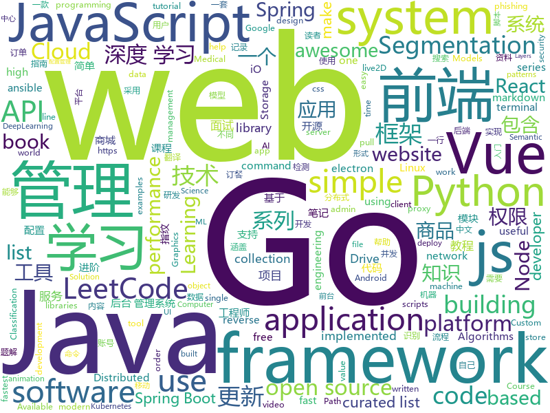

# 2019-05-16
See what the GitHub community is most excited about today.

## python
* [uds](https://github.com/stewartmcgown/uds)(**1,198 stars today**): Unlimited Drive Storage by splitting binary files into base64
* [machine-learning-course](https://github.com/machinelearningmindset/machine-learning-course)(**433 stars today**): 💬Machine Learning Course with Python
* [Python](https://github.com/TheAlgorithms/Python)(**371 stars today**): All Algorithms implemented in Python
* [client](https://github.com/wandb/client)(**118 stars today**): The official cli and python API client for W&B
* [PySnooper](https://github.com/cool-RR/PySnooper)(**99 stars today**): Never use print for debugging again
* [model-optimization](https://github.com/tensorflow/model-optimization)(**97 stars today**): 
* [AiLearning](https://github.com/apachecn/AiLearning)(**70 stars today**): AiLearning: 机器学习 - MachineLearning - ML、深度学习 - DeepLearning - DL、自然语言处理 NLP
* [system-design-primer](https://github.com/donnemartin/system-design-primer)(**77 stars today**): Learn how to design large-scale systems. Prep for the system design interview. Includes Anki flashcards.
* [models](https://github.com/tensorflow/models)(**52 stars today**): Models and examples built with TensorFlow
* [awesome-python](https://github.com/vinta/awesome-python)(**61 stars today**): A curated list of awesome Python frameworks, libraries, software and resources
* [pysot](https://github.com/STVIR/pysot)(**55 stars today**): SenseTime Research platform for single object tracking, implementing algorithms like SiamRPN and SiamMask.
* [youtube-dl](https://github.com/ytdl-org/youtube-dl)(**52 stars today**): Command-line program to download videos from YouTube.com and other video sites
* [keras](https://github.com/keras-team/keras)(**44 stars today**): Deep Learning for humans
* [pytorch-image-models](https://github.com/rwightman/pytorch-image-models)(**50 stars today**): PyTorch image models, scripts, pretrained weights -- (SE)ResNet/ResNeXT, DPN, MobileNet-V3/V2/V1, MNASNet, Single-Path NAS, FBNet, and more
* [ZeroNet](https://github.com/HelloZeroNet/ZeroNet)(**49 stars today**): ZeroNet - Decentralized websites using Bitcoin crypto and BitTorrent network
* [Chinese-Chatbot-PyTorch-Implementation](https://github.com/Doragd/Chinese-Chatbot-PyTorch-Implementation)(**44 stars today**): 🍀Another Chinese chatbot implemented in PyTorch, which is the sub-module of intelligent work order processing robot.👩‍🔧
* [TensorFlow-Course](https://github.com/machinelearningmindset/TensorFlow-Course)(**41 stars today**): Simple and ready-to-use tutorials for TensorFlow
* [100-Days-Of-ML-Code](https://github.com/Avik-Jain/100-Days-Of-ML-Code)(**40 stars today**): 100 Days of ML Coding
* [flask](https://github.com/pallets/flask)(**41 stars today**): The Python micro framework for building web applications.
* [ansible](https://github.com/ansible/ansible)(**32 stars today**): Ansible is a radically simple IT automation platform that makes your applications and systems easier to deploy. Avoid writing scripts or custom code to deploy and update your applications — automate in a language that approaches plain English, using SSH, with no agents to install on remote systems. https://docs.ansible.com/ansible/
* [TideFinger](https://github.com/TideSec/TideFinger)(**40 stars today**): TideFinger——指纹识别小工具，汲取整合了多个web指纹库，结合了多种指纹检测方法，让指纹检测更快捷、准确。
* [CheatSheetSeries](https://github.com/OWASP/CheatSheetSeries)(**39 stars today**): The OWASP Cheat Sheet Series was created to provide a concise collection of high value information on specific application security topics.
* [public-apis](https://github.com/toddmotto/public-apis)(**39 stars today**): A collective list of free APIs for use in software and web development.
* [face_recognition](https://github.com/ageitgey/face_recognition)(**37 stars today**): The world's simplest facial recognition api for Python and the command line
* [graphics](https://github.com/tensorflow/graphics)(**38 stars today**): TensorFlow Graphics: Differentiable Graphics Layers for TensorFlow

## java
* [LeetCodeAnimation](https://github.com/MisterBooo/LeetCodeAnimation)(**434 stars today**): Demonstrate all the questions on LeetCode in the form of animation.（用动画的形式呈现解LeetCode题目的思路）
* [CS-Notes](https://github.com/CyC2018/CS-Notes)(**187 stars today**): 📚技术面试必备基础知识、Leetcode 题解、后端面试、Java 面试、春招、秋招、操作系统、计算机网络、系统设计
* [JavaGuide](https://github.com/Snailclimb/JavaGuide)(**164 stars today**): 【Java学习+面试指南】 一份涵盖大部分Java程序员所需要掌握的核心知识。
* [mall](https://github.com/macrozheng/mall)(**150 stars today**): mall项目是一套电商系统，包括前台商城系统及后台管理系统，基于SpringBoot+MyBatis实现。 前台商城系统包含首页门户、商品推荐、商品搜索、商品展示、购物车、订单流程、会员中心、客户服务、帮助中心等模块。 后台管理系统包含商品管理、订单管理、会员管理、促销管理、运营管理、内容管理、统计报表、财务管理、权限管理、设置等模块。
* [RxDogTag](https://github.com/uber/RxDogTag)(**100 stars today**): Automatic tagging of RxJava 2 originating subscribe points for onError() investigation.
* [Linkage-RecyclerView](https://github.com/KunMinX/Linkage-RecyclerView)(**84 stars today**): 即使不用饿了么订餐，也请务必收藏好该库！🔥一行代码即可接入，二级联动订餐列表 - Even if you don't order by Eleme, please be sure to collect the library!🔥This secondary linkage list widget can be accessed by only one line of code. Supporting by RecyclerView & AndroidX.
* [toBeTopJavaer](https://github.com/hollischuang/toBeTopJavaer)(**78 stars today**): To Be Top Javaer - Java工程师成神之路
* [advanced-java](https://github.com/doocs/advanced-java)(**71 stars today**): 😮互联网 Java 工程师进阶知识完全扫盲：涵盖高并发、分布式、高可用、微服务等领域知识
* [Java](https://github.com/TheAlgorithms/Java)(**60 stars today**): All Algorithms implemented in Java
* [spring-boot-examples](https://github.com/ityouknow/spring-boot-examples)(**51 stars today**): about learning Spring Boot via examples. Spring Boot 教程、技术栈示例代码，快速简单上手教程。
* [spring-boot](https://github.com/spring-projects/spring-boot)(**49 stars today**): Spring Boot
* [apollo](https://github.com/ctripcorp/apollo)(**49 stars today**): Apollo（阿波罗）是携程框架部门研发的分布式配置中心，能够集中化管理应用不同环境、不同集群的配置，配置修改后能够实时推送到应用端，并且具备规范的权限、流程治理等特性，适用于微服务配置管理场景。
* [spring-framework](https://github.com/spring-projects/spring-framework)(**39 stars today**): Spring Framework
* [open_nsfw_android](https://github.com/devzwy/open_nsfw_android)(**47 stars today**): 色情图片离线识别，基于TensorFlow实现。识别只需200ms,可断网测试，成功率99%，调用只要一行代码，从雅虎的开源项目open_nsfw_python移植，tflite（6M）为训练好的模型，该模型文件可用于iOS、java、C++等平台
* [tutorials](https://github.com/eugenp/tutorials)(**25 stars today**): The "REST With Spring" Course:
* [elasticsearch](https://github.com/elastic/elasticsearch)(**38 stars today**): Open Source, Distributed, RESTful Search Engine
* [ZXBlog](https://github.com/ZXZxin/ZXBlog)(**35 stars today**): 记录各种学习笔记(算法、Java、数据库、并发......)
* [hutool](https://github.com/looly/hutool)(**36 stars today**): A set of tools that keep Java sweet.
* [litemall](https://github.com/linlinjava/litemall)(**31 stars today**): 又一个小商城。litemall = Spring Boot后端 + Vue管理员前端 + 微信小程序用户前端 + Vue用户移动端
* [eladmin](https://github.com/elunez/eladmin)(**32 stars today**): 项目基于 Spring Boot 2.1.0 、 Jpa、 Spring Security、redis、Vue的前后端分离的后台管理系统，项目采用分模块开发方式， 权限控制采用 RBAC，支持数据字典与数据权限管理，前端菜单支持动态路由
* [incubator-dubbo](https://github.com/apache/incubator-dubbo)(**26 stars today**): Apache Dubbo (incubating) is a high-performance, java based, open source RPC framework.
* [ghidra](https://github.com/NationalSecurityAgency/ghidra)(**33 stars today**): Ghidra is a software reverse engineering (SRE) framework
* [DoraemonKit](https://github.com/didi/DoraemonKit)(**34 stars today**): 简称 "DoKit" 。一款功能齐全的客户端（ iOS 、Android ）研发助手，你值得拥有。
* [alluxio](https://github.com/Alluxio/alluxio)(**35 stars today**): Alluxio, data orchestration for analytics and machine learning in the cloud
* [java-design-patterns](https://github.com/iluwatar/java-design-patterns)(**31 stars today**): Design patterns implemented in Java

## unknown
* [hacker-laws](https://github.com/dwmkerr/hacker-laws)(**1,348 stars today**): 💻📖Laws, Theories, Principles and Patterns that developers will find useful.
* [PowerToys](https://github.com/microsoft/PowerToys)(**314 stars today**): Windows system utilities to maximize productivity
* [nlp-beginner](https://github.com/FudanNLP/nlp-beginner)(**258 stars today**): NLP上手教程
* [choerodon](https://github.com/choerodon/choerodon)(**133 stars today**): Open Source Multi-Cloud Application Platform.
* [resilience-engineering](https://github.com/lorin/resilience-engineering)(**107 stars today**): Resilience Engineering Notes
* [awesome-react-hooks](https://github.com/glauberfc/awesome-react-hooks)(**99 stars today**): A curated list about React Hooks
* [Learn_Physics_in_2_Months](https://github.com/llSourcell/Learn_Physics_in_2_Months)(**85 stars today**): This is the curriculum for "Learn Physics in 2 Months" by Siraj Raval on Youtube
* [gitignore](https://github.com/github/gitignore)(**64 stars today**): A collection of useful .gitignore templates
* [How-to-collaborate-on-github](https://github.com/eonist/How-to-collaborate-on-github)(**90 stars today**): A mini book about collaborating on GitHub
* [You-Dont-Know-JS](https://github.com/getify/You-Dont-Know-JS)(**75 stars today**): A book series on JavaScript. @YDKJS on twitter.
* [awesome](https://github.com/sindresorhus/awesome)(**77 stars today**): 😎Awesome lists about all kinds of interesting topics
* [developer-roadmap](https://github.com/kamranahmedse/developer-roadmap)(**64 stars today**): Roadmap to becoming a web developer in 2019
* [free-programming-books](https://github.com/EbookFoundation/free-programming-books)(**49 stars today**): 📚Freely available programming books
* [CV-News](https://github.com/xiaoketongxue/CV-News)(**48 stars today**): Summarize the paper and code in Semantation(Semantic Segmentation,2D Medical Segmentation,3D Medical Segmentation,Instance Segmentation,Panoptic Segmentation)
* [DeepLearning-500-questions](https://github.com/scutan90/DeepLearning-500-questions)(**41 stars today**): 深度学习500问，以问答形式对常用的概率知识、线性代数、机器学习、深度学习、计算机视觉等热点问题进行阐述，以帮助自己及有需要的读者。 全书分为18个章节，50余万字。由于水平有限，书中不妥之处恳请广大读者批评指正。 未完待续............ 如有意合作，联系scutjy2015@163.com 版权所有，违权必究 Tan 2018.06
* [coding-interview-university](https://github.com/jwasham/coding-interview-university)(**41 stars today**): A complete computer science study plan to become a software engineer.
* [awesome-vue](https://github.com/vuejs/awesome-vue)(**40 stars today**): 🎉A curated list of awesome things related to Vue.js
* [architect-awesome](https://github.com/xingshaocheng/architect-awesome)(**35 stars today**): 后端架构师技术图谱
* [Free-SS-SSR](https://github.com/dxxzst/Free-SS-SSR)(**40 stars today**): 免费的SS账号、SSR账号，定期更新。优先更新：
* [Blog](https://github.com/mqyqingfeng/Blog)(**38 stars today**): 冴羽写博客的地方，预计写四个系列：JavaScript深入系列、JavaScript专题系列、ES6系列、React系列。
* [SJTU-Courses](https://github.com/CoolPhilChen/SJTU-Courses)(**37 stars today**): 上海交通大学课程资料分享
* [computer-science](https://github.com/ossu/computer-science)(**37 stars today**): 🎓Path to a free self-taught education in Computer Science!
* [go-perfbook](https://github.com/dgryski/go-perfbook)(**37 stars today**): Thoughts on Go performance optimization
* [Android-Daily-Interview](https://github.com/Moosphan/Android-Daily-Interview)(**35 stars today**): 每工作日更新一道 Android 面试题，小聚成河，大聚成江，共勉之～
* [gold-miner](https://github.com/xitu/gold-miner)(**32 stars today**): 🥇掘金翻译计划，可能是世界最大最好的英译中技术社区，最懂读者和译者的翻译平台：

## javascript
* [svelte](https://github.com/sveltejs/svelte)(**204 stars today**): Cybernetically enhanced web apps
* [stop-runaway-react-effects](https://github.com/kentcdodds/stop-runaway-react-effects)(**186 stars today**): 🏃Catches situations when a react use(Layout)Effect runs repeatedly in rapid succession
* [my-budget](https://github.com/reZach/my-budget)(**166 stars today**): Free, open source offline cross-platform budgeting solution built with Electron.
* [log-process-errors](https://github.com/ehmicky/log-process-errors)(**138 stars today**): Show some❤️to Node.js process errors
* [vue](https://github.com/vuejs/vue)(**121 stars today**): 🖖Vue.js is a progressive, incrementally-adoptable JavaScript framework for building UI on the web.
* [libpku](https://github.com/lib-pku/libpku)(**111 stars today**): 贵校课程资料民间整理
* [nodebestpractices](https://github.com/i0natan/nodebestpractices)(**117 stars today**): ✅The largest Node.js best practices list (May 2019)
* [react](https://github.com/facebook/react)(**98 stars today**): A declarative, efficient, and flexible JavaScript library for building user interfaces.
* [comlink](https://github.com/GoogleChromeLabs/comlink)(**107 stars today**): Comlink makes WebWorkers enjoyable.
* [ola](https://github.com/franciscop/ola)(**96 stars today**): 🌊Smooth animation library for interpolating numbers
* [leetcode](https://github.com/azl397985856/leetcode)(**83 stars today**): LeetCode Solutions: A Record of My Problem Solving Journey.( leetcode题解，记录自己的leetcode解题之路。)
* [react-tetris](https://github.com/chvin/react-tetris)(**80 stars today**): Use React, Redux, Immutable to code Tetris.🎮
* [Web](https://github.com/qianguyihao/Web)(**77 stars today**): Web前端入门和进阶学习笔记，超详细的前端学习图文教程。从零开始学前端，做一个Web全栈工程师。持续更新...
* [training](https://github.com/cloud-annotations/training)(**71 stars today**): 🐝Custom Object Detection and Classification Training
* [uni-app](https://github.com/dcloudio/uni-app)(**69 stars today**): 使用 Vue.js 开发跨平台应用的前端框架
* [axios](https://github.com/axios/axios)(**65 stars today**): Promise based HTTP client for the browser and node.js
* [puppeteer](https://github.com/GoogleChrome/puppeteer)(**68 stars today**): Headless Chrome Node API
* [zhuoyao_radar](https://github.com/liuzirui1122/zhuoyao_radar)(**55 stars today**): 捉妖雷达 web版
* [sakura-ui](https://github.com/Firenzia/sakura-ui)(**65 stars today**): 🌸梦回樱花飘落的坡道~~
* [30-seconds-of-code](https://github.com/30-seconds/30-seconds-of-code)(**61 stars today**): A curated collection of useful JavaScript snippets that you can understand in 30 seconds or less.
* [fusuma](https://github.com/hiroppy/fusuma)(**60 stars today**): ✍️Fusuma makes slides with Markdown easily.
* [buster](https://github.com/dessant/buster)(**60 stars today**): Captcha solver extension for humans
* [create-react-app](https://github.com/facebook/create-react-app)(**52 stars today**): Set up a modern web app by running one command.
* [baiduyun](https://github.com/syhyz1990/baiduyun)(**58 stars today**): 🖖油猴脚本 一个脚本搞定百度网盘下载
* [slow-json-stringify](https://github.com/lucagez/slow-json-stringify)(**59 stars today**): The slowest stringifier in the known universe. Just kidding, it's the fastest (:

## html
* [Python-100-Days](https://github.com/jackfrued/Python-100-Days)(**1,443 stars today**): Python - 100天从新手到大师
* [linux-command](https://github.com/jaywcjlove/linux-command)(**62 stars today**): Linux命令大全搜索工具，内容包含Linux命令手册、详解、学习、搜集。https://git.io/linux
* [flutter-in-action](https://github.com/flutterchina/flutter-in-action)(**54 stars today**): 《Flutter实战》电子书
* [nndl.github.io](https://github.com/nndl/nndl.github.io)(**34 stars today**): 《神经网络与深度学习》 Neural Network and Deep Learning
* [technical_books](https://github.com/TIM168/technical_books)(**33 stars today**): IT技术书籍，不间断更新中
* [en.javascript.info](https://github.com/javascript-tutorial/en.javascript.info)(**21 stars today**): Modern JavaScript Tutorial
* [Blog](https://github.com/YvetteLau/Blog)(**17 stars today**): 【前端进阶】优质博文
* [markdown-to-html-github-style](https://github.com/KrauseFx/markdown-to-html-github-style)(**20 stars today**): Generate a simple HTML page based on a markdown file, that looks like GitHub's stylesheet
* [nginxconfig.io](https://github.com/valentinxxx/nginxconfig.io)(**19 stars today**): ⚙️NGiИX config generator on steroids💉
* [deeplearning_ai_books](https://github.com/fengdu78/deeplearning_ai_books)(**15 stars today**): deeplearning.ai（吴恩达老师的深度学习课程笔记及资源）
* [subspace](https://github.com/subspacecloud/subspace)(**18 stars today**): A simple WireGuard VPN server GUI
* [coreui-free-bootstrap-admin-template](https://github.com/coreui/coreui-free-bootstrap-admin-template)(**15 stars today**): CoreUI is free bootstrap admin template
* [go101](https://github.com/go101/go101)(**18 stars today**): An online book focusing on Go syntax/semantics.
* [Electron-elf](https://github.com/fguby/Electron-elf)(**16 stars today**): 使用electron和live2D开发的类似桌面精灵的应用（A desktop application developed using electron and live2D）
* [portainer](https://github.com/portainer/portainer)(**15 stars today**): Simple management UI for Docker
* [Spoon-Knife](https://github.com/octocat/Spoon-Knife)(****): This repo is for demonstration purposes only.
* [water.css](https://github.com/kognise/water.css)(**13 stars today**): A just-add-css collection of styles to make simple websites just a little nicer
* [elasticsearch-definitive-guide](https://github.com/elasticsearch-cn/elasticsearch-definitive-guide)(**12 stars today**): 欢迎加QQ群：109764489，贡献力量！
* [personal-website](https://github.com/github/personal-website)(**6 stars today**): Code that'll help you kickstart a personal website that showcases your work as a software developer.
* [front-end-handbook-2019](https://github.com/FrontendMasters/front-end-handbook-2019)(**12 stars today**): [Book] 2019 edition of our front-end development handbook
* [dropcss](https://github.com/leeoniya/dropcss)(**12 stars today**): An exceptionally fast, thorough and tiny unused-CSS cleaner
* [sa-admin](https://github.com/shengzhang666/sa-admin)(**12 stars today**): 一个简单又强大的后台模板，演示地址：http://sa-admin.dev33.cn
* [openmoji](https://github.com/hfg-gmuend/openmoji)(**11 stars today**): Open-source emojis for designers, developers and everyone else!
* [mescroll](https://github.com/mescroll/mescroll)(**10 stars today**): 精致的下拉刷新和上拉加载 js框架.支持vue,完美运行于移动端和主流PC浏览器 (JS framework for pull-refresh and pull-up-loading)
* [fastText](https://github.com/facebookresearch/fastText)(**9 stars today**): Library for fast text representation and classification.

## go
* [gameboy.live](https://github.com/HFO4/gameboy.live)(**135 stars today**): 🕹️A basic gameboy emulator with terminal "Cloud Gaming" support
* [kratos](https://github.com/bilibili/kratos)(**66 stars today**): Kratos是bilibili开源的一套Go微服务框架，包含大量微服务相关框架及工具。
* [v2ray-core](https://github.com/v2ray/v2ray-core)(**39 stars today**): A platform for building proxies to bypass network restrictions.
* [go](https://github.com/golang/go)(**52 stars today**): The Go programming language
* [muraena](https://github.com/muraenateam/muraena)(**55 stars today**): Muraena is an almost-transparent reverse proxy aimed at automating phishing and post-phishing activities.
* [kubernetes](https://github.com/kubernetes/kubernetes)(**45 stars today**): Production-Grade Container Scheduling and Management
* [sqlflow](https://github.com/sql-machine-learning/sqlflow)(**51 stars today**): Brings SQL and AI together.
* [goldmark](https://github.com/yuin/goldmark)(**54 stars today**): 🏆A markdown parser written in Go. Easy to extend, standard(CommonMark) compliant, well structured.
* [webrtc](https://github.com/pion/webrtc)(**51 stars today**): Pure Go implementation of the WebRTC API
* [awesome-go](https://github.com/avelino/awesome-go)(**47 stars today**): A curated list of awesome Go frameworks, libraries and software
* [rclone](https://github.com/ncw/rclone)(**48 stars today**): "rsync for cloud storage" - Google Drive, Amazon Drive, S3, Dropbox, Backblaze B2, One Drive, Swift, Hubic, Cloudfiles, Google Cloud Storage, Yandex Files
* [grafterm](https://github.com/slok/grafterm)(**48 stars today**): Metrics dashboards on terminal (a grafana inspired terminal version)
* [frp](https://github.com/fatedier/frp)(**40 stars today**): A fast reverse proxy to help you expose a local server behind a NAT or firewall to the internet.
* [gopenpgp](https://github.com/ProtonMail/gopenpgp)(**45 stars today**): A high-level OpenPGP library
* [ktop](https://github.com/ynqa/ktop)(**40 stars today**): top for k8s
* [gin](https://github.com/gin-gonic/gin)(**37 stars today**): Gin is a HTTP web framework written in Go (Golang). It features a Martini-like API with much better performance -- up to 40 times faster. If you need smashing performance, get yourself some Gin.
* [the-way-to-go_ZH_CN](https://github.com/Unknwon/the-way-to-go_ZH_CN)(**32 stars today**): 《The Way to Go》中文译本，中文正式名《Go 入门指南》
* [hugo](https://github.com/gohugoio/hugo)(**34 stars today**): The world’s fastest framework for building websites.
* [prometheus](https://github.com/prometheus/prometheus)(**29 stars today**): The Prometheus monitoring system and time series database.
* [kubeone](https://github.com/kubermatic/kubeone)(**30 stars today**): A lifecycle management tool for Highly-Available Kubernetes clusters
* [helm](https://github.com/helm/helm)(**27 stars today**): The Kubernetes Package Manager
* [clash](https://github.com/Dreamacro/clash)(**13 stars today**): A rule-based tunnel in Go.
* [etcd](https://github.com/etcd-io/etcd)(**25 stars today**): Distributed reliable key-value store for the most critical data of a distributed system
* [chaosblade](https://github.com/chaosblade-io/chaosblade)(**28 stars today**): An easy to use and powerful chaos engineering experiment toolkit.（阿里巴巴开源的一款简单易用、功能强大的混沌实验注入工具）
* [harbor](https://github.com/goharbor/harbor)(**27 stars today**): An open source trusted cloud native registry project that stores, signs, and scans content.

## WordCloud

