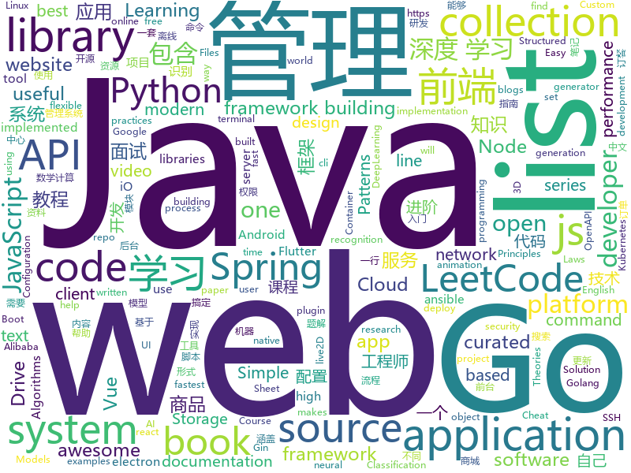

# 2019-05-17
See what the GitHub community is most excited about today.

## python
* [uds](https://github.com/stewartmcgown/uds)(**589 stars today**): Unlimited Drive Storage by splitting binary files into base64
* [machine-learning-course](https://github.com/machinelearningmindset/machine-learning-course)(**355 stars today**): 💬Machine Learning Course with Python
* [Python](https://github.com/TheAlgorithms/Python)(**302 stars today**): All Algorithms implemented in Python
* [client](https://github.com/wandb/client)(**244 stars today**): The official cli and python API client for W&B
* [mathAI](https://github.com/Roujack/mathAI)(**98 stars today**): 一个拍照做题程序。输入一张包含数学计算题的图片，输出识别出的数学计算式以及计算结果。This is a mathematic expression recognition project.
* [models](https://github.com/tensorflow/models)(**81 stars today**): Models and examples built with TensorFlow
* [CVE-2019-0708](https://github.com/k8gege/CVE-2019-0708)(**66 stars today**): 
* [PySnooper](https://github.com/cool-RR/PySnooper)(**85 stars today**): Never use print for debugging again
* [system-design-primer](https://github.com/donnemartin/system-design-primer)(**75 stars today**): Learn how to design large-scale systems. Prep for the system design interview. Includes Anki flashcards.
* [AiLearning](https://github.com/apachecn/AiLearning)(**57 stars today**): AiLearning: 机器学习 - MachineLearning - ML、深度学习 - DeepLearning - DL、自然语言处理 NLP
* [mixmatch](https://github.com/google-research/mixmatch)(**66 stars today**): 
* [awesome-python](https://github.com/vinta/awesome-python)(**58 stars today**): A curated list of awesome Python frameworks, libraries, software and resources
* [model-optimization](https://github.com/tensorflow/model-optimization)(**59 stars today**): 
* [keras](https://github.com/keras-team/keras)(**51 stars today**): Deep Learning for humans
* [pysot](https://github.com/STVIR/pysot)(**49 stars today**): SenseTime Research platform for single object tracking, implementing algorithms like SiamRPN and SiamMask.
* [textgenrnn](https://github.com/minimaxir/textgenrnn)(**47 stars today**): Easily train your own text-generating neural network of any size and complexity on any text dataset with a few lines of code.
* [public-apis](https://github.com/toddmotto/public-apis)(**45 stars today**): A collective list of free APIs for use in software and web development.
* [100-Days-Of-ML-Code](https://github.com/Avik-Jain/100-Days-Of-ML-Code)(**40 stars today**): 100 Days of ML Coding
* [CheatSheetSeries](https://github.com/OWASP/CheatSheetSeries)(**38 stars today**): The OWASP Cheat Sheet Series was created to provide a concise collection of high value information on specific application security topics.
* [face_recognition](https://github.com/ageitgey/face_recognition)(**38 stars today**): The world's simplest facial recognition api for Python and the command line
* [bert](https://github.com/google-research/bert)(**36 stars today**): TensorFlow code and pre-trained models for BERT
* [EigenDamage-Pytorch](https://github.com/alecwangcq/EigenDamage-Pytorch)(**40 stars today**): Pytorch implementations of the paper "EigenDamage: Structured Pruning in the Kronecker-Factored Eigenbasis".
* [ansible](https://github.com/ansible/ansible)(**31 stars today**): Ansible is a radically simple IT automation platform that makes your applications and systems easier to deploy. Avoid writing scripts or custom code to deploy and update your applications — automate in a language that approaches plain English, using SSH, with no agents to install on remote systems. https://docs.ansible.com/ansible/
* [flask](https://github.com/pallets/flask)(**34 stars today**): The Python micro framework for building web applications.
* [youtube-dl](https://github.com/ytdl-org/youtube-dl)(**35 stars today**): Command-line program to download videos from YouTube.com and other video sites

## java
* [LeetCodeAnimation](https://github.com/MisterBooo/LeetCodeAnimation)(**505 stars today**): Demonstrate all the questions on LeetCode in the form of animation.（用动画的形式呈现解LeetCode题目的思路）
* [CS-Notes](https://github.com/CyC2018/CS-Notes)(**212 stars today**): 📚技术面试必备基础知识、Leetcode 题解、后端面试、Java 面试、春招、秋招、操作系统、计算机网络、系统设计
* [JavaGuide](https://github.com/Snailclimb/JavaGuide)(**165 stars today**): 【Java学习+面试指南】 一份涵盖大部分Java程序员所需要掌握的核心知识。
* [flutter_boost](https://github.com/alibaba/flutter_boost)(**140 stars today**): FlutterBoost is a Flutter plugin which enables hybrid integration of Flutter for your existing native apps with minimum efforts
* [advanced-java](https://github.com/doocs/advanced-java)(**110 stars today**): 😮互联网 Java 工程师进阶知识完全扫盲：涵盖高并发、分布式、高可用、微服务等领域知识
* [toBeTopJavaer](https://github.com/hollischuang/toBeTopJavaer)(**84 stars today**): To Be Top Javaer - Java工程师成神之路
* [mall](https://github.com/macrozheng/mall)(**72 stars today**): mall项目是一套电商系统，包括前台商城系统及后台管理系统，基于SpringBoot+MyBatis实现。 前台商城系统包含首页门户、商品推荐、商品搜索、商品展示、购物车、订单流程、会员中心、客户服务、帮助中心等模块。 后台管理系统包含商品管理、订单管理、会员管理、促销管理、运营管理、内容管理、统计报表、财务管理、权限管理、设置等模块。
* [Linkage-RecyclerView](https://github.com/KunMinX/Linkage-RecyclerView)(**83 stars today**): 即使不用饿了么订餐，也请务必收藏好该库！🔥一行代码即可接入，二级联动订餐列表 - Even if you don't order by Eleme, please be sure to collect the library!🔥This secondary linkage list widget can be accessed by only one line of code. Supporting by RecyclerView & AndroidX.
* [open_nsfw_android](https://github.com/devzwy/open_nsfw_android)(**74 stars today**): 色情图片离线识别，基于TensorFlow实现。识别只需200ms,可断网测试，成功率99%，调用只要一行代码，从雅虎的开源项目open_nsfw_python移植，tflite（6M）为训练好的模型，该模型文件可用于iOS、java、C++等平台
* [spring-boot](https://github.com/spring-projects/spring-boot)(**54 stars today**): Spring Boot
* [metatron-discovery](https://github.com/metatron-app/metatron-discovery)(**72 stars today**): Powerful & Easy way for big data discovery
* [spring-boot-examples](https://github.com/ityouknow/spring-boot-examples)(**52 stars today**): about learning Spring Boot via examples. Spring Boot 教程、技术栈示例代码，快速简单上手教程。
* [spring-framework](https://github.com/spring-projects/spring-framework)(**39 stars today**): Spring Framework
* [Java](https://github.com/TheAlgorithms/Java)(**45 stars today**): All Algorithms implemented in Java
* [tutorials](https://github.com/eugenp/tutorials)(**33 stars today**): The "REST With Spring" Course:
* [java-design-patterns](https://github.com/iluwatar/java-design-patterns)(**39 stars today**): Design patterns implemented in Java
* [apollo](https://github.com/ctripcorp/apollo)(**36 stars today**): Apollo（阿波罗）是携程框架部门研发的分布式配置中心，能够集中化管理应用不同环境、不同集群的配置，配置修改后能够实时推送到应用端，并且具备规范的权限、流程治理等特性，适用于微服务配置管理场景。
* [arthas](https://github.com/alibaba/arthas)(**36 stars today**): Alibaba Java Diagnostic Tool Arthas/Alibaba Java诊断利器Arthas
* [elasticsearch](https://github.com/elastic/elasticsearch)(**35 stars today**): Open Source, Distributed, RESTful Search Engine
* [DroidAssist](https://github.com/didi/DroidAssist)(**39 stars today**): A lightweight Android Studio gradle plugin based on Javassist for editing bytecode in Android.
* [DoraemonKit](https://github.com/didi/DoraemonKit)(**38 stars today**): 简称 "DoKit" 。一款功能齐全的客户端（ iOS 、Android ）研发助手，你值得拥有。
* [incubator-dubbo](https://github.com/apache/incubator-dubbo)(**32 stars today**): Apache Dubbo (incubating) is a high-performance, java based, open source RPC framework.
* [RxDogTag](https://github.com/uber/RxDogTag)(**36 stars today**): Automatic tagging of RxJava 2 originating subscribe points for onError() investigation.
* [hutool](https://github.com/looly/hutool)(**33 stars today**): A set of tools that keep Java sweet.
* [openapi-generator](https://github.com/OpenAPITools/openapi-generator)(**26 stars today**): OpenAPI Generator allows generation of API client libraries (SDK generation), server stubs, documentation and configuration automatically given an OpenAPI Spec (v2, v3)

## unknown
* [hacker-laws](https://github.com/dwmkerr/hacker-laws)(**753 stars today**): 💻📖Laws, Theories, Principles and Patterns that developers will find useful.
* [resilience-engineering](https://github.com/lorin/resilience-engineering)(**348 stars today**): Resilience Engineering Notes
* [PowerToys](https://github.com/microsoft/PowerToys)(**154 stars today**): Windows system utilities to maximize productivity
* [choerodon](https://github.com/choerodon/choerodon)(**151 stars today**): Open Source Multi-Cloud Application Platform.
* [nlp-beginner](https://github.com/FudanNLP/nlp-beginner)(**129 stars today**): NLP上手教程
* [Data-Science--Cheat-Sheet](https://github.com/abhat222/Data-Science--Cheat-Sheet)(**110 stars today**): Cheat Sheets
* [hacker-laws-zh](https://github.com/nusr/hacker-laws-zh)(**113 stars today**): 💻📖Laws, Theories, Principles and Patterns that developers will find useful.(对开发人员有用的定律，理论，原则和模式。)
* [developer-roadmap](https://github.com/kamranahmedse/developer-roadmap)(**77 stars today**): Roadmap to becoming a web developer in 2019
* [electron-ssr-backup](https://github.com/qingshuisiyuan/electron-ssr-backup)(**50 stars today**): electron-ssr原作者删除了这个伟大的项目，故备份了下来，不继续开发,且用且珍惜
* [The-Hackers-Hardware-Toolkit](https://github.com/yadox666/The-Hackers-Hardware-Toolkit)(**67 stars today**): The best hacker's gadgets for Red Team pentesters and security researchers.
* [gitignore](https://github.com/github/gitignore)(**44 stars today**): A collection of useful .gitignore templates
* [awesome](https://github.com/sindresorhus/awesome)(**65 stars today**): 😎Awesome lists about all kinds of interesting topics
* [You-Dont-Know-JS](https://github.com/getify/You-Dont-Know-JS)(**60 stars today**): A book series on JavaScript. @YDKJS on twitter.
* [DeepLearning-500-questions](https://github.com/scutan90/DeepLearning-500-questions)(**48 stars today**): 深度学习500问，以问答形式对常用的概率知识、线性代数、机器学习、深度学习、计算机视觉等热点问题进行阐述，以帮助自己及有需要的读者。 全书分为18个章节，50余万字。由于水平有限，书中不妥之处恳请广大读者批评指正。 未完待续............ 如有意合作，联系scutjy2015@163.com 版权所有，违权必究 Tan 2018.06
* [coding-interview-university](https://github.com/jwasham/coding-interview-university)(**40 stars today**): A complete computer science study plan to become a software engineer.
* [fancyss_history_package](https://github.com/hq450/fancyss_history_package)(**32 stars today**): 科学上网插件的离线安装包储存在这里
* [free-programming-books](https://github.com/EbookFoundation/free-programming-books)(**35 stars today**): 📚Freely available programming books
* [awesome-vue](https://github.com/vuejs/awesome-vue)(**39 stars today**): 🎉A curated list of awesome things related to Vue.js
* [app-ideas](https://github.com/florinpop17/app-ideas)(**38 stars today**): A Collection of application ideas which can be used to improve your coding skills.
* [SJTU-Courses](https://github.com/CoolPhilChen/SJTU-Courses)(**31 stars today**): 上海交通大学课程资料分享
* [the-book-of-secret-knowledge](https://github.com/trimstray/the-book-of-secret-knowledge)(**32 stars today**): A collection of inspiring lists, manuals, cheatsheets, blogs, hacks, one-liners, cli/web tools and more.
* [awesome-wechat-weapp](https://github.com/justjavac/awesome-wechat-weapp)(**30 stars today**): 微信小程序开发资源汇总💯
* [Daily-Interview-Question](https://github.com/Advanced-Frontend/Daily-Interview-Question)(**31 stars today**): 我是木易杨，公众号「高级前端进阶」作者，每天搞定一道前端大厂面试题，祝大家天天进步，一年后会看到不一样的自己。
* [How-to-collaborate-on-github](https://github.com/eonist/How-to-collaborate-on-github)(**32 stars today**): A mini book about collaborating on GitHub
* [Learn_Physics_in_2_Months](https://github.com/llSourcell/Learn_Physics_in_2_Months)(**30 stars today**): This is the curriculum for "Learn Physics in 2 Months" by Siraj Raval on Youtube

## javascript
* [my-budget](https://github.com/reZach/my-budget)(**391 stars today**): Free, open source offline cross-platform budgeting solution built with Electron.
* [svelte](https://github.com/sveltejs/svelte)(**315 stars today**): Cybernetically enhanced web apps
* [leetcode](https://github.com/azl397985856/leetcode)(**263 stars today**): LeetCode Solutions: A Record of My Problem Solving Journey.( leetcode题解，记录自己的leetcode解题之路。)
* [nodebestpractices](https://github.com/i0natan/nodebestpractices)(**244 stars today**): ✅The largest Node.js best practices list (May 2019)
* [vue](https://github.com/vuejs/vue)(**118 stars today**): 🖖Vue.js is a progressive, incrementally-adoptable JavaScript framework for building UI on the web.
* [react](https://github.com/facebook/react)(**87 stars today**): A declarative, efficient, and flexible JavaScript library for building user interfaces.
* [baiduyun](https://github.com/syhyz1990/baiduyun)(**99 stars today**): 🖖油猴脚本 一个脚本搞定百度网盘下载
* [ola](https://github.com/franciscop/ola)(**91 stars today**): 🌊Smooth animation library for interpolating numbers
* [libpku](https://github.com/lib-pku/libpku)(**78 stars today**): 贵校课程资料民间整理
* [Web](https://github.com/qianguyihao/Web)(**76 stars today**): Web前端入门和进阶学习笔记，超详细的前端学习图文教程。从零开始学前端，做一个Web全栈工程师。持续更新...
* [puppeteer](https://github.com/GoogleChrome/puppeteer)(**71 stars today**): Headless Chrome Node API
* [30-seconds-of-code](https://github.com/30-seconds/30-seconds-of-code)(**63 stars today**): A curated collection of useful JavaScript snippets that you can understand in 30 seconds or less.
* [training](https://github.com/cloud-annotations/training)(**57 stars today**): 🐝Custom Object Detection and Classification Training
* [three.js](https://github.com/mrdoob/three.js)(**50 stars today**): JavaScript 3D library.
* [axios](https://github.com/axios/axios)(**55 stars today**): Promise based HTTP client for the browser and node.js
* [uni-app](https://github.com/dcloudio/uni-app)(**59 stars today**): 使用 Vue.js 开发跨平台应用的前端框架
* [create-react-app](https://github.com/facebook/create-react-app)(**47 stars today**): Set up a modern web app by running one command.
* [pixi.js](https://github.com/pixijs/pixi.js)(**54 stars today**): The HTML5 Creation Engine: Create beautiful digital content with the fastest, most flexible 2D WebGL renderer.
* [html2canvas](https://github.com/niklasvh/html2canvas)(**57 stars today**): Screenshots with JavaScript
* [comlink](https://github.com/GoogleChromeLabs/comlink)(**55 stars today**): Comlink makes WebWorkers enjoyable.
* [stop-runaway-react-effects](https://github.com/kentcdodds/stop-runaway-react-effects)(**55 stars today**): 🏃Catches situations when a react use(Layout)Effect runs repeatedly in rapid succession
* [nuxt.js](https://github.com/nuxt/nuxt.js)(**53 stars today**): The Vue.js Framework
* [react-native](https://github.com/facebook/react-native)(**47 stars today**): A framework for building native apps with React.
* [shepherd](https://github.com/shipshapecode/shepherd)(**51 stars today**): Guide your users through a tour of your app
* [log-process-errors](https://github.com/ehmicky/log-process-errors)(**51 stars today**): Show some❤️to Node.js process errors

## html
* [awesome-modern-cpp](https://github.com/rigtorp/awesome-modern-cpp)(**246 stars today**): A collection of resources on modern C++
* [human_dynamics](https://github.com/akanazawa/human_dynamics)(**67 stars today**): project for paper "Learning 3D Human Dynamics from Video"
* [linux-command](https://github.com/jaywcjlove/linux-command)(**51 stars today**): Linux命令大全搜索工具，内容包含Linux命令手册、详解、学习、搜集。https://git.io/linux
* [Home-Assistant-Config](https://github.com/JamesMcCarthy79/Home-Assistant-Config)(**53 stars today**): Home Assistant Configuration & Documentation for my Smart House.
* [csinva.github.io](https://github.com/csinva/csinva.github.io)(**46 stars today**): Source for chandan's website: contains notes, blogs, slides, and research.
* [flutter-in-action](https://github.com/flutterchina/flutter-in-action)(**45 stars today**): 《Flutter实战》电子书
* [nndl.github.io](https://github.com/nndl/nndl.github.io)(**30 stars today**): 《神经网络与深度学习》 Neural Network and Deep Learning
* [go101](https://github.com/go101/go101)(**28 stars today**): An online book focusing on Go syntax/semantics.
* [playground](https://github.com/tailwindcss/playground)(**21 stars today**): 
* [fastText](https://github.com/facebookresearch/fastText)(**16 stars today**): Library for fast text representation and classification.
* [deeplearning_ai_books](https://github.com/fengdu78/deeplearning_ai_books)(**15 stars today**): deeplearning.ai（吴恩达老师的深度学习课程笔记及资源）
* [en.javascript.info](https://github.com/javascript-tutorial/en.javascript.info)(**14 stars today**): Modern JavaScript Tutorial
* [website](https://github.com/kubernetes/website)(**5 stars today**): Kubernetes website and documentation repo:
* [personal-website](https://github.com/github/personal-website)(**10 stars today**): Code that'll help you kickstart a personal website that showcases your work as a software developer.
* [Electron-elf](https://github.com/fguby/Electron-elf)(**16 stars today**): 使用electron和live2D开发的类似桌面精灵的应用（A desktop application developed using electron and live2D）
* [openmoji](https://github.com/hfg-gmuend/openmoji)(**15 stars today**): Open-source emojis for designers, developers and everyone else!
* [technical_books](https://github.com/TIM168/technical_books)(**14 stars today**): IT技术书籍，不间断更新中
* [Spoon-Knife](https://github.com/octocat/Spoon-Knife)(****): This repo is for demonstration purposes only.
* [nginxconfig.io](https://github.com/valentinxxx/nginxconfig.io)(**14 stars today**): ⚙️NGiИX config generator on steroids💉
* [front-end-handbook-2019](https://github.com/FrontendMasters/front-end-handbook-2019)(**11 stars today**): [Book] 2019 edition of our front-end development handbook
* [coreui-free-bootstrap-admin-template](https://github.com/coreui/coreui-free-bootstrap-admin-template)(**10 stars today**): CoreUI is free bootstrap admin template
* [ecma262](https://github.com/tc39/ecma262)(**11 stars today**): Status, process, and documents for ECMA262
* [ctf-wiki](https://github.com/ctf-wiki/ctf-wiki)(**10 stars today**): CTF Wiki Online, English version coming!
* [portainer](https://github.com/portainer/portainer)(**10 stars today**): Simple management UI for Docker
* [devops-essentials-sample-app](https://github.com/linuxacademy/devops-essentials-sample-app)(****): 

## go
* [echoip](https://github.com/alifarah9/echoip)(**163 stars today**): 
* [trivy](https://github.com/knqyf263/trivy)(**140 stars today**): A Simple and Comprehensive Vulnerability Scanner for Containers, Suitable for CI
* [gopenpgp](https://github.com/ProtonMail/gopenpgp)(**110 stars today**): A high-level OpenPGP library
* [uuid](https://github.com/alifarah9/uuid)(**107 stars today**): 
* [gameboy.live](https://github.com/HFO4/gameboy.live)(**79 stars today**): 🕹️A basic gameboy emulator with terminal "Cloud Gaming" support
* [kubernetes](https://github.com/kubernetes/kubernetes)(**69 stars today**): Production-Grade Container Scheduling and Management
* [uiprogress](https://github.com/gosuri/uiprogress)(**70 stars today**): A go library to render progress bars in terminal applications
* [go](https://github.com/golang/go)(**62 stars today**): The Go programming language
* [v2ray-core](https://github.com/v2ray/v2ray-core)(**37 stars today**): A platform for building proxies to bypass network restrictions.
* [gin](https://github.com/gin-gonic/gin)(**56 stars today**): Gin is a HTTP web framework written in Go (Golang). It features a Martini-like API with much better performance -- up to 40 times faster. If you need smashing performance, get yourself some Gin.
* [kratos](https://github.com/bilibili/kratos)(**53 stars today**): Kratos是bilibili开源的一套Go微服务框架，包含大量微服务相关框架及工具。
* [panicparse](https://github.com/maruel/panicparse)(**51 stars today**): Crash your app in style (Golang)
* [polaris](https://github.com/reactiveops/polaris)(**50 stars today**): Validation of best practices in your Kubernetes clusters
* [frp](https://github.com/fatedier/frp)(**45 stars today**): A fast reverse proxy to help you expose a local server behind a NAT or firewall to the internet.
* [awesome-go](https://github.com/avelino/awesome-go)(**42 stars today**): A curated list of awesome Go frameworks, libraries and software
* [hugo](https://github.com/gohugoio/hugo)(**42 stars today**): The world’s fastest framework for building websites.
* [helm](https://github.com/helm/helm)(**38 stars today**): The Kubernetes Package Manager
* [sshcode](https://github.com/cdr/sshcode)(**40 stars today**): Run VS Code on any server over SSH.
* [goldmark](https://github.com/yuin/goldmark)(**39 stars today**): 🏆A markdown parser written in Go. Easy to extend, standard(CommonMark) compliant, well structured.
* [istio](https://github.com/istio/istio)(**36 stars today**): Connect, secure, control, and observe services.
* [sqlflow](https://github.com/sql-machine-learning/sqlflow)(**37 stars today**): Brings SQL and AI together.
* [rclone](https://github.com/ncw/rclone)(**37 stars today**): "rsync for cloud storage" - Google Drive, Amazon Drive, S3, Dropbox, Backblaze B2, One Drive, Swift, Hubic, Cloudfiles, Google Cloud Storage, Yandex Files
* [the-way-to-go_ZH_CN](https://github.com/Unknwon/the-way-to-go_ZH_CN)(**30 stars today**): 《The Way to Go》中文译本，中文正式名《Go 入门指南》
* [prometheus](https://github.com/prometheus/prometheus)(**33 stars today**): The Prometheus monitoring system and time series database.
* [webrtc](https://github.com/pion/webrtc)(**33 stars today**): Pure Go implementation of the WebRTC API

## WordCloud

