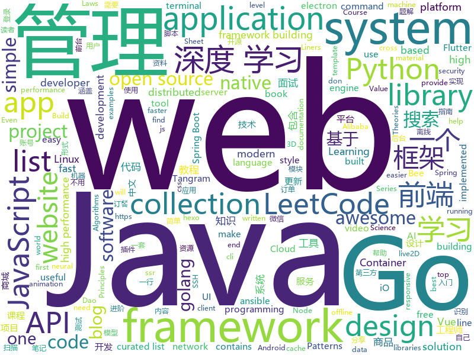

# 2019-05-18
See what the GitHub community is most excited about today.

## python
* [uds](https://github.com/stewartmcgown/uds)(**486 stars today**): Unlimited Drive Storage by splitting binary files into base64
* [Python](https://github.com/TheAlgorithms/Python)(**422 stars today**): All Algorithms implemented in Python
* [machine-learning-course](https://github.com/machinelearningmindset/machine-learning-course)(**343 stars today**): 💬Machine Learning Course with Python
* [black](https://github.com/python/black)(**334 stars today**): The uncompromising Python code formatter
* [client](https://github.com/wandb/client)(**168 stars today**): 🔥A tool for visualizing and tracking your machine learning experiments. This repo contains the CLI and Python API.
* [pywick](https://github.com/achaiah/pywick)(**106 stars today**): High-level batteries-included neural network training library for Pytorch
* [models](https://github.com/tensorflow/models)(**63 stars today**): Models and examples built with TensorFlow
* [PySnooper](https://github.com/cool-RR/PySnooper)(**77 stars today**): Never use print for debugging again
* [transfer-learning-conv-ai](https://github.com/huggingface/transfer-learning-conv-ai)(**72 stars today**): 🦄State-of-the-Art Conversational AI with Transfer Learning
* [ray](https://github.com/ray-project/ray)(**67 stars today**): A fast and simple framework for building and running distributed applications.
* [awesome-python](https://github.com/vinta/awesome-python)(**57 stars today**): A curated list of awesome Python frameworks, libraries, software and resources
* [system-design-primer](https://github.com/donnemartin/system-design-primer)(**58 stars today**): Learn how to design large-scale systems. Prep for the system design interview. Includes Anki flashcards.
* [AiLearning](https://github.com/apachecn/AiLearning)(**51 stars today**): AiLearning: 机器学习 - MachineLearning - ML、深度学习 - DeepLearning - DL、自然语言处理 NLP
* [public-apis](https://github.com/toddmotto/public-apis)(**55 stars today**): A collective list of free APIs for use in software and web development.
* [CVE-2019-0708](https://github.com/k8gege/CVE-2019-0708)(**39 stars today**): 
* [mixmatch](https://github.com/google-research/mixmatch)(**44 stars today**): 
* [face_recognition](https://github.com/ageitgey/face_recognition)(**37 stars today**): The world's simplest facial recognition api for Python and the command line
* [d2l-zh](https://github.com/d2l-ai/d2l-zh)(**38 stars today**): 《动手学深度学习》，英文版即伯克利深度学习（STAT 157，2019春）教材。面向中文读者、能运行、可讨论。
* [ansible](https://github.com/ansible/ansible)(**34 stars today**): Ansible is a radically simple IT automation platform that makes your applications and systems easier to deploy. Avoid writing scripts or custom code to deploy and update your applications — automate in a language that approaches plain English, using SSH, with no agents to install on remote systems. https://docs.ansible.com/ansible/
* [you-get](https://github.com/soimort/you-get)(**38 stars today**): ⏬Dumb downloader that scrapes the web
* [Superpaper](https://github.com/hhannine/Superpaper)(**42 stars today**): A cross-platform multi monitor wallpaper manager.
* [youtube-dl](https://github.com/ytdl-org/youtube-dl)(**36 stars today**): Command-line program to download videos from YouTube.com and other video sites
* [lottery-ticket-hypothesis](https://github.com/google-research/lottery-ticket-hypothesis)(**39 stars today**): A reimplementation of "The Lottery Ticket Hypothesis" (Frankle and Carbin) on MNIST.
* [django-rest-framework](https://github.com/encode/django-rest-framework)(**35 stars today**): Web APIs for Django.⚡️
* [CheatSheetSeries](https://github.com/OWASP/CheatSheetSeries)(**36 stars today**): The OWASP Cheat Sheet Series was created to provide a concise collection of high value information on specific application security topics.

## java
* [LeetCodeAnimation](https://github.com/MisterBooo/LeetCodeAnimation)(**432 stars today**): Demonstrate all the questions on LeetCode in the form of animation.（用动画的形式呈现解LeetCode题目的思路）
* [CS-Notes](https://github.com/CyC2018/CS-Notes)(**180 stars today**): 📚技术面试必备基础知识、Leetcode 题解、后端面试、Java 面试、春招、秋招、操作系统、计算机网络、系统设计
* [JavaGuide](https://github.com/Snailclimb/JavaGuide)(**151 stars today**): 【Java学习+面试指南】 一份涵盖大部分Java程序员所需要掌握的核心知识。
* [mall](https://github.com/macrozheng/mall)(**84 stars today**): mall项目是一套电商系统，包括前台商城系统及后台管理系统，基于SpringBoot+MyBatis实现。 前台商城系统包含首页门户、商品推荐、商品搜索、商品展示、购物车、订单流程、会员中心、客户服务、帮助中心等模块。 后台管理系统包含商品管理、订单管理、会员管理、促销管理、运营管理、内容管理、统计报表、财务管理、权限管理、设置等模块。
* [Linkage-RecyclerView](https://github.com/KunMinX/Linkage-RecyclerView)(**92 stars today**): 即使不用饿了么订餐，也请务必收藏好该库！🔥一行代码即可接入，二级联动订餐列表 - Even if you don't order by PrubHub, please be sure to collect the library!🔥This secondary linkage list widget can be accessed by only one line of code. Supporting by RecyclerView & AndroidX.
* [advanced-java](https://github.com/doocs/advanced-java)(**75 stars today**): 😮互联网 Java 工程师进阶知识完全扫盲：涵盖高并发、分布式、高可用、微服务等领域知识
* [spring-boot-examples](https://github.com/ityouknow/spring-boot-examples)(**75 stars today**): about learning Spring Boot via examples. Spring Boot 教程、技术栈示例代码，快速简单上手教程。
* [gogo](https://github.com/zenuo/gogo)(**70 stars today**): 「勾勾」是一个搜索工具，搜索结果基于谷歌，致力于「安全和简洁」的搜索体验。
* [arthas](https://github.com/alibaba/arthas)(**57 stars today**): Alibaba Java Diagnostic Tool Arthas/Alibaba Java诊断利器Arthas
* [spring-boot](https://github.com/spring-projects/spring-boot)(**53 stars today**): Spring Boot
* [hermes](https://github.com/allegro/hermes)(**60 stars today**): Fast and reliable message broker built on top of Kafka.
* [toBeTopJavaer](https://github.com/hollischuang/toBeTopJavaer)(**50 stars today**): To Be Top Javaer - Java工程师成神之路
* [Tangram-Android](https://github.com/alibaba/Tangram-Android)(**51 stars today**): Tangram is a modular UI solution for building native page dynamically including Tangram for Android, Tangram for iOS and even backend CMS. This project provides the sdk on Android.
* [spring-framework](https://github.com/spring-projects/spring-framework)(**37 stars today**): Spring Framework
* [java-design-patterns](https://github.com/iluwatar/java-design-patterns)(**43 stars today**): Design patterns implemented in Java
* [open_nsfw_android](https://github.com/devzwy/open_nsfw_android)(**43 stars today**): 色情图片离线识别，基于TensorFlow实现。识别只需200ms,可断网测试，成功率99%，调用只要一行代码，从雅虎的开源项目open_nsfw_python移植，tflite（6M）为训练好的模型，该模型文件可用于iOS、java、C++等平台
* [Java](https://github.com/TheAlgorithms/Java)(**40 stars today**): All Algorithms implemented in Java
* [JustAuth](https://github.com/zhangyd-c/JustAuth)(**43 stars today**): 💯史上最全的整合第三方登录的工具,目前已支持Github、Gitee、微博、钉钉和百度、Coding、腾讯云开发者平台和OSChina等第三方平台的授权登录。 Login, so easy!
* [tutorials](https://github.com/eugenp/tutorials)(**21 stars today**): The "REST With Spring" Course:
* [litemall](https://github.com/linlinjava/litemall)(**37 stars today**): 又一个小商城。litemall = Spring Boot后端 + Vue管理员前端 + 微信小程序用户前端 + Vue用户移动端
* [bee](https://github.com/automvc/bee)(**39 stars today**): Bee is an easy and high efficiency ORM framework.You don't need to write the Dao by yourself anymore. Bee是简单、高效的ORM框架，它的编码复杂度是O(1)，即用了Bee，你可以不用另外写dao代码。
* [seata](https://github.com/seata/seata)(**34 stars today**): 🔥Seata is an easy-to-use, high-performance, java based, open source distributed transaction solution.
* [flutter_boost](https://github.com/alibaba/flutter_boost)(**33 stars today**): FlutterBoost is a Flutter plugin which enables hybrid integration of Flutter for your existing native apps with minimum efforts
* [incubator-dubbo](https://github.com/apache/incubator-dubbo)(**22 stars today**): Apache Dubbo (incubating) is a high-performance, java based, open source RPC framework.
* [elasticsearch](https://github.com/elastic/elasticsearch)(**29 stars today**): Open Source, Distributed, RESTful Search Engine

## unknown
* [hacker-laws](https://github.com/dwmkerr/hacker-laws)(**593 stars today**): 💻📖Laws, Theories, Principles and Patterns that developers will find useful.
* [hacker-laws-zh](https://github.com/nusr/hacker-laws-zh)(**416 stars today**): 💻📖Laws, Theories, Principles and Patterns that developers will find useful. (对开发人员有用的定律、理论、原则和模式。)
* [The-Hackers-Hardware-Toolkit](https://github.com/yadox666/The-Hackers-Hardware-Toolkit)(**162 stars today**): The best hacker's gadgets for Red Team pentesters and security researchers.
* [resilience-engineering](https://github.com/lorin/resilience-engineering)(**159 stars today**): Resilience Engineering Notes
* [Data-Science--Cheat-Sheet](https://github.com/abhat222/Data-Science--Cheat-Sheet)(**102 stars today**): Cheat Sheets
* [awesome](https://github.com/sindresorhus/awesome)(**73 stars today**): 😎Awesome lists about all kinds of interesting topics
* [PowerToys](https://github.com/microsoft/PowerToys)(**77 stars today**): Windows system utilities to maximize productivity
* [gitignore](https://github.com/github/gitignore)(**53 stars today**): A collection of useful .gitignore templates
* [free-programming-books](https://github.com/EbookFoundation/free-programming-books)(**62 stars today**): 📚Freely available programming books
* [developer-roadmap](https://github.com/kamranahmedse/developer-roadmap)(**64 stars today**): Roadmap to becoming a web developer in 2019
* [You-Dont-Know-JS](https://github.com/getify/You-Dont-Know-JS)(**52 stars today**): A book series on JavaScript. @YDKJS on twitter.
* [coding-interview-university](https://github.com/jwasham/coding-interview-university)(**49 stars today**): A complete computer science study plan to become a software engineer.
* [nlp-beginner](https://github.com/FudanNLP/nlp-beginner)(**48 stars today**): NLP上手教程
* [DeepLearning-500-questions](https://github.com/scutan90/DeepLearning-500-questions)(**34 stars today**): 深度学习500问，以问答形式对常用的概率知识、线性代数、机器学习、深度学习、计算机视觉等热点问题进行阐述，以帮助自己及有需要的读者。 全书分为18个章节，50余万字。由于水平有限，书中不妥之处恳请广大读者批评指正。 未完待续............ 如有意合作，联系scutjy2015@163.com 版权所有，违权必究 Tan 2018.06
* [Free-SS-SSR](https://github.com/dxxzst/Free-SS-SSR)(**37 stars today**): 免费的SS账号、SSR账号，定期更新。优先更新：
* [weekly](https://github.com/ruanyf/weekly)(**38 stars today**): 技术分享周刊，每周五发布
* [SJTU-Courses](https://github.com/CoolPhilChen/SJTU-Courses)(**28 stars today**): 上海交通大学课程资料分享
* [awesome-wechat-weapp](https://github.com/justjavac/awesome-wechat-weapp)(**26 stars today**): 微信小程序开发资源汇总💯
* [AwesomeCppGameDev](https://github.com/Cmdu76/AwesomeCppGameDev)(**27 stars today**): My curated list of awesome C++ (mainly) things for Game Development. Inspired by awesome-... stuff.
* [Bash-Oneliner](https://github.com/onceupon/Bash-Oneliner)(**28 stars today**): A collection of handy Bash One-Liners and terminal tricks for data processing and Linux system maintenance.
* [trackerslist](https://github.com/ngosang/trackerslist)(**26 stars today**): An updated list of public BitTorrent trackers
* [electron-ssr-backup](https://github.com/qingshuisiyuan/electron-ssr-backup)(**19 stars today**): electron-ssr原作者删除了这个伟大的项目，故备份了下来，不继续开发,且用且珍惜
* [the-book-of-secret-knowledge](https://github.com/trimstray/the-book-of-secret-knowledge)(**24 stars today**): A collection of inspiring lists, manuals, cheatsheets, blogs, hacks, one-liners, cli/web tools and more.
* [fancyss_history_package](https://github.com/hq450/fancyss_history_package)(**17 stars today**): 科学上网插件的离线安装包储存在这里
* [computer-science](https://github.com/ossu/computer-science)(**25 stars today**): 🎓Path to a free self-taught education in Computer Science!

## javascript
* [leetcode](https://github.com/azl397985856/leetcode)(**347 stars today**): LeetCode Solutions: A Record of My Problem Solving Journey.( leetcode题解，记录自己的leetcode解题之路。)
* [svelte](https://github.com/sveltejs/svelte)(**198 stars today**): Cybernetically enhanced web apps
* [ola](https://github.com/franciscop/ola)(**143 stars today**): 🌊Smooth animation library for interpolating numbers
* [my-budget](https://github.com/reZach/my-budget)(**139 stars today**): Free, open source offline cross-platform budgeting solution built with Electron.
* [get-v2ex](https://github.com/7nights/get-v2ex)(**134 stars today**): The back-end of bv2ex web application.
* [vue](https://github.com/vuejs/vue)(**104 stars today**): 🖖Vue.js is a progressive, incrementally-adoptable JavaScript framework for building UI on the web.
* [baiduyun](https://github.com/syhyz1990/baiduyun)(**90 stars today**): 🖖油猴脚本 一个脚本搞定百度网盘下载
* [noa](https://github.com/andyhall/noa)(**93 stars today**): Experimental voxel game engine.
* [gun](https://github.com/amark/gun)(**93 stars today**): A realtime, decentralized, offline-first, mutable graph protocol to sync the web.
* [react](https://github.com/facebook/react)(**66 stars today**): A declarative, efficient, and flexible JavaScript library for building user interfaces.
* [vscode-recipes](https://github.com/microsoft/vscode-recipes)(**75 stars today**): 
* [libpku](https://github.com/lib-pku/libpku)(**63 stars today**): 贵校课程资料民间整理
* [create-react-app](https://github.com/facebook/create-react-app)(**57 stars today**): Set up a modern web app by running one command.
* [comlink](https://github.com/GoogleChromeLabs/comlink)(**62 stars today**): Comlink makes WebWorkers enjoyable.
* [uni-app](https://github.com/dcloudio/uni-app)(**60 stars today**): 使用 Vue.js 开发跨平台应用的前端框架
* [three.js](https://github.com/mrdoob/three.js)(**48 stars today**): JavaScript 3D library.
* [react-native](https://github.com/facebook/react-native)(**50 stars today**): A framework for building native apps with React.
* [puppeteer](https://github.com/GoogleChrome/puppeteer)(**52 stars today**): Headless Chrome Node API
* [axios](https://github.com/axios/axios)(**50 stars today**): Promise based HTTP client for the browser and node.js
* [Web](https://github.com/qianguyihao/Web)(**51 stars today**): Web前端入门和进阶学习笔记，超详细的前端学习图文教程。从零开始学前端，做一个Web全栈工程师。持续更新...
* [bootstrap](https://github.com/twbs/bootstrap)(**34 stars today**): The most popular HTML, CSS, and JavaScript framework for developing responsive, mobile first projects on the web.
* [gatsby](https://github.com/gatsbyjs/gatsby)(**42 stars today**): Build blazing fast, modern apps and websites with React
* [esx](https://github.com/esxjs/esx)(**48 stars today**): Like JSX, but native and fast
* [javascript](https://github.com/airbnb/javascript)(**43 stars today**): JavaScript Style Guide
* [material-ui](https://github.com/mui-org/material-ui)(**34 stars today**): React components for faster and easier web development. Build your own design system, or start with Material Design.

## html
* [awesome-modern-cpp](https://github.com/rigtorp/awesome-modern-cpp)(**209 stars today**): A collection of resources on modern C++
* [human_dynamics](https://github.com/akanazawa/human_dynamics)(**45 stars today**): project for paper "Learning 3D Human Dynamics from Video"
* [flutter-in-action](https://github.com/flutterchina/flutter-in-action)(**37 stars today**): 《Flutter实战》电子书
* [TrackRay](https://github.com/iSafeBlue/TrackRay)(**31 stars today**): 溯光 (TrackRay) 3 插件式渗透测试框架（资产扫描|指纹识别|暴力破解|网页爬虫|端口扫描|漏洞扫描|AWVS|NMAP|Metasploit）
* [linux-command](https://github.com/jaywcjlove/linux-command)(**35 stars today**): Linux命令大全搜索工具，内容包含Linux命令手册、详解、学习、搜集。https://git.io/linux
* [nndl.github.io](https://github.com/nndl/nndl.github.io)(**24 stars today**): 《神经网络与深度学习》 Neural Network and Deep Learning
* [go101](https://github.com/go101/go101)(**23 stars today**): An online book focusing on Go syntax/semantics.
* [free-for-dev](https://github.com/ripienaar/free-for-dev)(**21 stars today**): A list of SaaS, PaaS and IaaS offerings that have free tiers of interest to devops and infradev
* [deeplearning_ai_books](https://github.com/fengdu78/deeplearning_ai_books)(**20 stars today**): deeplearning.ai（吴恩达老师的深度学习课程笔记及资源）
* [playground](https://github.com/tailwindcss/playground)(**19 stars today**): 
* [Home-Assistant-Config](https://github.com/JamesMcCarthy79/Home-Assistant-Config)(**16 stars today**): Home Assistant Configuration & Documentation for my Smart House.
* [Electron-elf](https://github.com/fguby/Electron-elf)(**16 stars today**): 使用electron和live2D开发的类似桌面精灵的应用（A desktop application developed using electron and live2D）
* [en.javascript.info](https://github.com/javascript-tutorial/en.javascript.info)(**14 stars today**): Modern JavaScript Tutorial
* [Spoon-Knife](https://github.com/octocat/Spoon-Knife)(****): This repo is for demonstration purposes only.
* [ConardLi.github.io](https://github.com/ConardLi/ConardLi.github.io)(**13 stars today**): ConardLi 写blog的地方
* [csinva.github.io](https://github.com/csinva/csinva.github.io)(**11 stars today**): Source for chandan's website: contains notes, blogs, slides, and research.
* [personal-website](https://github.com/github/personal-website)(**6 stars today**): Code that'll help you kickstart a personal website that showcases your work as a software developer.
* [portainer](https://github.com/portainer/portainer)(**11 stars today**): Simple management UI for Docker
* [html](https://github.com/whatwg/html)(**12 stars today**): HTML Standard
* [front-end-handbook-2019](https://github.com/FrontendMasters/front-end-handbook-2019)(**12 stars today**): [Book] 2019 edition of our front-end development handbook
* [web.dev](https://github.com/GoogleChrome/web.dev)(**10 stars today**): Content repository for web.dev
* [swagger-codegen](https://github.com/swagger-api/swagger-codegen)(**9 stars today**): swagger-codegen contains a template-driven engine to generate documentation, API clients and server stubs in different languages by parsing your OpenAPI / Swagger definition.
* [hexo-theme-matery](https://github.com/blinkfox/hexo-theme-matery)(**9 stars today**): A beautiful hexo blog theme with material design and responsive design.一个基于材料设计和响应式设计而成的全面、美观的Hexo主题。
* [water.css](https://github.com/kognise/water.css)(**9 stars today**): A just-add-css collection of styles to make simple websites just a little nicer
* [fastText](https://github.com/facebookresearch/fastText)(**8 stars today**): Library for fast text representation and classification.

## go
* [trivy](https://github.com/knqyf263/trivy)(**350 stars today**): A Simple and Comprehensive Vulnerability Scanner for Containers, Suitable for CI
* [polaris](https://github.com/reactiveops/polaris)(**228 stars today**): Validation of best practices in your Kubernetes clusters
* [uiprogress](https://github.com/gosuri/uiprogress)(**94 stars today**): A go library to render progress bars in terminal applications
* [kubernetes](https://github.com/kubernetes/kubernetes)(**76 stars today**): Production-Grade Container Scheduling and Management
* [panicparse](https://github.com/maruel/panicparse)(**77 stars today**): Crash your app in style (Golang)
* [go](https://github.com/golang/go)(**65 stars today**): The Go programming language
* [frp](https://github.com/fatedier/frp)(**61 stars today**): A fast reverse proxy to help you expose a local server behind a NAT or firewall to the internet.
* [awesome-go](https://github.com/avelino/awesome-go)(**50 stars today**): A curated list of awesome Go frameworks, libraries and software
* [gameboy.live](https://github.com/HFO4/gameboy.live)(**50 stars today**): 🕹️A basic gameboy emulator with terminal "Cloud Gaming" support
* [gin](https://github.com/gin-gonic/gin)(**43 stars today**): Gin is a HTTP web framework written in Go (Golang). It features a Martini-like API with much better performance -- up to 40 times faster. If you need smashing performance, get yourself some Gin.
* [gopenpgp](https://github.com/ProtonMail/gopenpgp)(**44 stars today**): A high-level OpenPGP library
* [sqlflow](https://github.com/sql-machine-learning/sqlflow)(**35 stars today**): Brings SQL and AI together.
* [owlcache](https://github.com/xssed/owlcache)(**37 stars today**): 🦉owlcache is a lightweight, high-performance, non-centralized, distributed Key/Value memory-cached data sharing application written by Go . keyword : golang cache、go cache、golang nosql
* [kratos](https://github.com/bilibili/kratos)(**36 stars today**): Kratos是bilibili开源的一套Go微服务框架，包含大量微服务相关框架及工具。
* [istio](https://github.com/istio/istio)(**33 stars today**): Connect, secure, control, and observe services.
* [the-way-to-go_ZH_CN](https://github.com/Unknwon/the-way-to-go_ZH_CN)(**33 stars today**): 《The Way to Go》中文译本，中文正式名《Go 入门指南》
* [komiser](https://github.com/mlabouardy/komiser)(**34 stars today**): ☁️Cloud Environment Inspector👮🔒💰
* [sshcode](https://github.com/cdr/sshcode)(**34 stars today**): Run VS Code on any server over SSH.
* [v2ray-core](https://github.com/v2ray/v2ray-core)(**22 stars today**): A platform for building proxies to bypass network restrictions.
* [helm](https://github.com/helm/helm)(**28 stars today**): The Kubernetes Package Manager
* [quicktest](https://github.com/frankban/quicktest)(**32 stars today**): Quick helpers for testing Go applications
* [hugo](https://github.com/gohugoio/hugo)(**30 stars today**): The world’s fastest framework for building websites.
* [traefik](https://github.com/containous/traefik)(**29 stars today**): The Cloud Native Edge Router
* [moby](https://github.com/moby/moby)(**28 stars today**): Moby Project - a collaborative project for the container ecosystem to assemble container-based systems
* [beego](https://github.com/astaxie/beego)(**27 stars today**): beego is an open-source, high-performance web framework for the Go programming language.

## WordCloud

