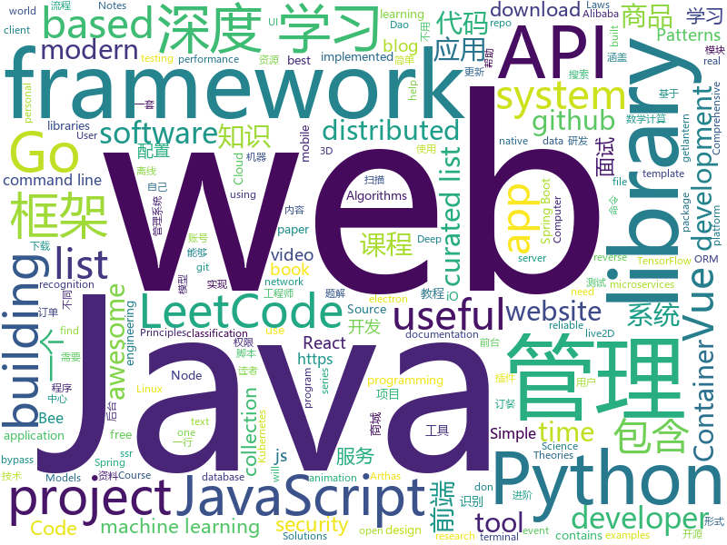

# 2019-05-19
See what the GitHub community is most excited about today.

## python
* [Python](https://github.com/TheAlgorithms/Python)(**230 stars today**): All Algorithms implemented in Python
* [machine-learning-course](https://github.com/machinelearningmindset/machine-learning-course)(**229 stars today**): 💬Machine Learning Course with Python
* [black](https://github.com/python/black)(**225 stars today**): The uncompromising Python code formatter
* [uds](https://github.com/stewartmcgown/uds)(**136 stars today**): Unlimited Drive Storage by splitting binary files into base64
* [awesome-python](https://github.com/vinta/awesome-python)(**51 stars today**): A curated list of awesome Python frameworks, libraries, software and resources
* [system-design-primer](https://github.com/donnemartin/system-design-primer)(**46 stars today**): Learn how to design large-scale systems. Prep for the system design interview. Includes Anki flashcards.
* [youtube-dl](https://github.com/ytdl-org/youtube-dl)(**46 stars today**): Command-line program to download videos from YouTube.com and other video sites
* [public-apis](https://github.com/toddmotto/public-apis)(**45 stars today**): A collective list of free APIs for use in software and web development.
* [client](https://github.com/wandb/client)(**48 stars today**): 🔥A tool for visualizing and tracking your machine learning experiments. This repo contains the CLI and Python API.
* [interpret](https://github.com/microsoft/interpret)(**39 stars today**): Fit interpretable models. Explain blackbox machine learning.
* [models](https://github.com/tensorflow/models)(**29 stars today**): Models and examples built with TensorFlow
* [mathAI](https://github.com/Roujack/mathAI)(**33 stars today**): 一个拍照做题程序。输入一张包含数学计算题的图片，输出识别出的数学计算式以及计算结果。This is a mathematic expression recognition project.
* [PySnooper](https://github.com/cool-RR/PySnooper)(**34 stars today**): Never use print for debugging again
* [AiLearning](https://github.com/apachecn/AiLearning)(**27 stars today**): AiLearning: 机器学习 - MachineLearning - ML、深度学习 - DeepLearning - DL、自然语言处理 NLP
* [django-rest-framework](https://github.com/encode/django-rest-framework)(**32 stars today**): Web APIs for Django.⚡️
* [d2l-zh](https://github.com/d2l-ai/d2l-zh)(**30 stars today**): 《动手学深度学习》，英文版即伯克利深度学习（STAT 157，2019春）教材。面向中文读者、能运行、可讨论。
* [Superpaper](https://github.com/hhannine/Superpaper)(**30 stars today**): A cross-platform multi monitor wallpaper manager.
* [faceswap](https://github.com/deepfakes/faceswap)(**27 stars today**): Non official project based on original /r/Deepfakes thread. Many thanks to him!
* [keras](https://github.com/keras-team/keras)(**24 stars today**): Deep Learning for humans
* [mixmatch](https://github.com/google-research/mixmatch)(**26 stars today**): 
* [PayloadsAllTheThings](https://github.com/swisskyrepo/PayloadsAllTheThings)(**24 stars today**): A list of useful payloads and bypass for Web Application Security and Pentest/CTF
* [face_recognition](https://github.com/ageitgey/face_recognition)(**25 stars today**): The world's simplest facial recognition api for Python and the command line
* [you-get](https://github.com/soimort/you-get)(**23 stars today**): ⏬Dumb downloader that scrapes the web
* [USTC-Course](https://github.com/USTC-Resource/USTC-Course)(**21 stars today**): ❤️中国科学技术大学课程资源
* [cpython](https://github.com/python/cpython)(**19 stars today**): The Python programming language

## java
* [LeetCodeAnimation](https://github.com/MisterBooo/LeetCodeAnimation)(**243 stars today**): Demonstrate all the questions on LeetCode in the form of animation.（用动画的形式呈现解LeetCode题目的思路）
* [CS-Notes](https://github.com/CyC2018/CS-Notes)(**97 stars today**): 📚技术面试必备基础知识、Leetcode 题解、后端面试、Java 面试、春招、秋招、操作系统、计算机网络、系统设计
* [JavaGuide](https://github.com/Snailclimb/JavaGuide)(**71 stars today**): 【Java学习+面试指南】 一份涵盖大部分Java程序员所需要掌握的核心知识。
* [mall](https://github.com/macrozheng/mall)(**37 stars today**): mall项目是一套电商系统，包括前台商城系统及后台管理系统，基于SpringBoot+MyBatis实现。 前台商城系统包含首页门户、商品推荐、商品搜索、商品展示、购物车、订单流程、会员中心、客户服务、帮助中心等模块。 后台管理系统包含商品管理、订单管理、会员管理、促销管理、运营管理、内容管理、统计报表、财务管理、权限管理、设置等模块。
* [spring-framework](https://github.com/spring-projects/spring-framework)(**33 stars today**): Spring Framework
* [spring-boot](https://github.com/spring-projects/spring-boot)(**33 stars today**): Spring Boot
* [advanced-java](https://github.com/doocs/advanced-java)(**27 stars today**): 😮互联网 Java 工程师进阶知识完全扫盲：涵盖高并发、分布式、高可用、微服务等领域知识
* [bee](https://github.com/automvc/bee)(**33 stars today**): Bee is an easy and high efficiency ORM framework.You don't need to write the Dao by yourself anymore(Coding Complexity is O(1) ). Bee是简单、高效的ORM框架，它的编码复杂度是O(1)，即用了Bee，你可以不用另外写dao代码。
* [Java](https://github.com/TheAlgorithms/Java)(**30 stars today**): All Algorithms implemented in Java
* [toBeTopJavaer](https://github.com/hollischuang/toBeTopJavaer)(**31 stars today**): To Be Top Javaer - Java工程师成神之路
* [java-design-patterns](https://github.com/iluwatar/java-design-patterns)(**25 stars today**): Design patterns implemented in Java
* [Linkage-RecyclerView](https://github.com/KunMinX/Linkage-RecyclerView)(**25 stars today**): 即使不用饿了么订餐，也请务必收藏好该库！🔥一行代码即可接入，二级联动订餐列表 - Even if you don't order food by PrubHub, be sure to collect this library, please!🔥This secondary linkage list widget can be accessed by only one line of code. Supporting by RecyclerView & AndroidX.
* [spring-boot-examples](https://github.com/ityouknow/spring-boot-examples)(**22 stars today**): about learning Spring Boot via examples. Spring Boot 教程、技术栈示例代码，快速简单上手教程。
* [arthas](https://github.com/alibaba/arthas)(**22 stars today**): Alibaba Java Diagnostic Tool Arthas/Alibaba Java诊断利器Arthas
* [litemall](https://github.com/linlinjava/litemall)(**20 stars today**): 又一个小商城。litemall = Spring Boot后端 + Vue管理员前端 + 微信小程序用户前端 + Vue用户移动端
* [tutorials](https://github.com/eugenp/tutorials)(**13 stars today**): The "REST With Spring" Course:
* [elasticsearch](https://github.com/elastic/elasticsearch)(**20 stars today**): Open Source, Distributed, RESTful Search Engine
* [ghidra](https://github.com/NationalSecurityAgency/ghidra)(**19 stars today**): Ghidra is a software reverse engineering (SRE) framework
* [72crm-java](https://github.com/72crm/72crm-java)(**19 stars today**): The JAVA version for "72CRM"
* [product-microgateway](https://github.com/wso2/product-microgateway)(**18 stars today**): A cloud native, developer centric and decentralized API gateway for microservices
* [DoraemonKit](https://github.com/didi/DoraemonKit)(**18 stars today**): 简称 "DoKit" 。一款功能齐全的客户端（ iOS 、Android ）研发助手，你值得拥有。
* [open_nsfw_android](https://github.com/devzwy/open_nsfw_android)(**17 stars today**): 色情图片离线识别，基于TensorFlow实现。识别只需200ms,可断网测试，成功率99%，调用只要一行代码，从雅虎的开源项目open_nsfw_python移植，tflite（6M）为训练好的模型，该模型文件可用于iOS、java、C++等平台
* [guava](https://github.com/google/guava)(**15 stars today**): Google core libraries for Java
* [apollo](https://github.com/ctripcorp/apollo)(**15 stars today**): Apollo（阿波罗）是携程框架部门研发的分布式配置中心，能够集中化管理应用不同环境、不同集群的配置，配置修改后能够实时推送到应用端，并且具备规范的权限、流程治理等特性，适用于微服务配置管理场景。
* [RxJava](https://github.com/ReactiveX/RxJava)(**13 stars today**): RxJava – Reactive Extensions for the JVM – a library for composing asynchronous and event-based programs using observable sequences for the Java VM.

## unknown
* [hacker-laws](https://github.com/dwmkerr/hacker-laws)(**273 stars today**): 💻📖Laws, Theories, Principles and Patterns that developers will find useful.
* [hacker-laws-zh](https://github.com/nusr/hacker-laws-zh)(**222 stars today**): 💻📖Laws, Theories, Principles and Patterns that developers will find useful. (对开发人员有用的定律、理论、原则和模式。)
* [awesome-decision-tree-papers](https://github.com/benedekrozemberczki/awesome-decision-tree-papers)(**94 stars today**): A collection of research papers on decision, classification and regression trees with implementations.
* [The-Hackers-Hardware-Toolkit](https://github.com/yadox666/The-Hackers-Hardware-Toolkit)(**91 stars today**): The best hacker's gadgets for Red Team pentesters and security researchers.
* [Data-Science--Cheat-Sheet](https://github.com/abhat222/Data-Science--Cheat-Sheet)(**63 stars today**): Cheat Sheets
* [gitignore](https://github.com/github/gitignore)(**38 stars today**): A collection of useful .gitignore templates
* [awesome](https://github.com/sindresorhus/awesome)(**46 stars today**): 😎Awesome lists about all kinds of interesting topics
* [You-Dont-Know-JS](https://github.com/getify/You-Dont-Know-JS)(**44 stars today**): A book series on JavaScript. @YDKJS on twitter.
* [developer-roadmap](https://github.com/kamranahmedse/developer-roadmap)(**44 stars today**): Roadmap to becoming a web developer in 2019
* [PowerToys](https://github.com/microsoft/PowerToys)(**44 stars today**): Windows system utilities to maximize productivity
* [coding-interview-university](https://github.com/jwasham/coding-interview-university)(**38 stars today**): A complete computer science study plan to become a software engineer.
* [nlp-beginner](https://github.com/FudanNLP/nlp-beginner)(**34 stars today**): NLP上手教程
* [free-programming-books](https://github.com/EbookFoundation/free-programming-books)(**32 stars today**): 📚Freely available programming books
* [awesome-react-hooks](https://github.com/glauberfc/awesome-react-hooks)(**33 stars today**): A curated list about React Hooks
* [Free-SS-SSR](https://github.com/dxxzst/Free-SS-SSR)(**26 stars today**): 免费的SS账号、SSR账号，定期更新。优先更新：
* [fancyss_history_package](https://github.com/hq450/fancyss_history_package)(**17 stars today**): 科学上网插件的离线安装包储存在这里
* [trackerslist](https://github.com/ngosang/trackerslist)(**22 stars today**): An updated list of public BitTorrent trackers
* [resilience-engineering](https://github.com/lorin/resilience-engineering)(**23 stars today**): Resilience Engineering Notes
* [DeepLearning-500-questions](https://github.com/scutan90/DeepLearning-500-questions)(**22 stars today**): 深度学习500问，以问答形式对常用的概率知识、线性代数、机器学习、深度学习、计算机视觉等热点问题进行阐述，以帮助自己及有需要的读者。 全书分为18个章节，50余万字。由于水平有限，书中不妥之处恳请广大读者批评指正。 未完待续............ 如有意合作，联系scutjy2015@163.com 版权所有，违权必究 Tan 2018.06
* [SJTU-Courses](https://github.com/CoolPhilChen/SJTU-Courses)(**22 stars today**): 上海交通大学课程资料分享
* [Machine-learning-for-proteins](https://github.com/yangkky/Machine-learning-for-proteins)(**22 stars today**): Listing of papers about machine learning for proteins.
* [computer-science](https://github.com/ossu/computer-science)(**19 stars today**): 🎓Path to a free self-taught education in Computer Science!
* [issues-launcher](https://github.com/SkyrimTogether/issues-launcher)(**20 stars today**): For all bugs, crashes and exceptions for the Harbor launcher.
* [awesome-vue](https://github.com/vuejs/awesome-vue)(**21 stars today**): 🎉A curated list of awesome things related to Vue.js
* [electron-ssr-backup](https://github.com/qingshuisiyuan/electron-ssr-backup)(**14 stars today**): electron-ssr原作者删除了这个伟大的项目，故备份了下来，不继续开发,且用且珍惜

## javascript
* [gitfolio](https://github.com/imfunniee/gitfolio)(**217 stars today**): personal website + blog for every github user
* [leetcode](https://github.com/azl397985856/leetcode)(**201 stars today**): LeetCode Solutions: A Record of My Problem Solving Journey.( leetcode题解，记录自己的leetcode解题之路。)
* [ola](https://github.com/franciscop/ola)(**141 stars today**): 🌊Smooth animation library for interpolating numbers
* [svelte](https://github.com/sveltejs/svelte)(**108 stars today**): Cybernetically enhanced web apps
* [i18nize-react](https://github.com/Ghost---Shadow/i18nize-react)(**78 stars today**): Internationalize react apps within a lunch break
* [vue](https://github.com/vuejs/vue)(**71 stars today**): 🖖Vue.js is a progressive, incrementally-adoptable JavaScript framework for building UI on the web.
* [MikuTools](https://github.com/Ice-Hazymoon/MikuTools)(**62 stars today**): 一个轻量的工具集合
* [react](https://github.com/facebook/react)(**54 stars today**): A declarative, efficient, and flexible JavaScript library for building user interfaces.
* [vscode-recipes](https://github.com/microsoft/vscode-recipes)(**58 stars today**): 
* [baiduyun](https://github.com/syhyz1990/baiduyun)(**54 stars today**): 🖖油猴脚本 一个脚本搞定百度网盘下载
* [tourguide.js](https://github.com/LikaloLLC/tourguide.js)(**50 stars today**): A simple, lightweight, clean and small library for creating guided product tours for your web app.
* [Instagram](https://github.com/EvanBacon/Instagram)(**48 stars today**): A universal instagram clone built with Expo
* [three.js](https://github.com/mrdoob/three.js)(**39 stars today**): JavaScript 3D library.
* [libpku](https://github.com/lib-pku/libpku)(**37 stars today**): 贵校课程资料民间整理
* [axios](https://github.com/axios/axios)(**41 stars today**): Promise based HTTP client for the browser and node.js
* [create-react-app](https://github.com/facebook/create-react-app)(**32 stars today**): Set up a modern web app by running one command.
* [node](https://github.com/nodejs/node)(**33 stars today**): Node.js JavaScript runtime✨🐢🚀✨
* [react-native](https://github.com/facebook/react-native)(**36 stars today**): A framework for building native apps with React.
* [uni-app](https://github.com/dcloudio/uni-app)(**35 stars today**): 使用 Vue.js 开发跨平台应用的前端框架
* [bootstrap](https://github.com/twbs/bootstrap)(**26 stars today**): The most popular HTML, CSS, and JavaScript framework for developing responsive, mobile first projects on the web.
* [netlify-cms](https://github.com/netlify/netlify-cms)(**34 stars today**): A CMS for Static Site Generators
* [puppeteer](https://github.com/GoogleChrome/puppeteer)(**31 stars today**): Headless Chrome Node API
* [javascript](https://github.com/airbnb/javascript)(**29 stars today**): JavaScript Style Guide
* [atom](https://github.com/atom/atom)(**22 stars today**): The hackable text editor
* [30-seconds-of-code](https://github.com/30-seconds/30-seconds-of-code)(**29 stars today**): A curated collection of useful JavaScript snippets that you can understand in 30 seconds or less.

## html
* [awesome-modern-cpp](https://github.com/rigtorp/awesome-modern-cpp)(**104 stars today**): A collection of resources on modern C++
* [TrackRay](https://github.com/iSafeBlue/TrackRay)(**33 stars today**): 溯光 (TrackRay) 3 插件式渗透测试框架（资产扫描|指纹识别|暴力破解|网页爬虫|端口扫描|漏洞扫描|AWVS|NMAP|Metasploit）
* [flutter-in-action](https://github.com/flutterchina/flutter-in-action)(**22 stars today**): 《Flutter实战》电子书
* [linux-command](https://github.com/jaywcjlove/linux-command)(**21 stars today**): Linux命令大全搜索工具，内容包含Linux命令手册、详解、学习、搜集。https://git.io/linux
* [AdminLTE](https://github.com/ColorlibHQ/AdminLTE)(**11 stars today**): AdminLTE - Free Premium Admin control Panel Theme Based On Bootstrap 3.x
* [Electron-elf](https://github.com/fguby/Electron-elf)(**15 stars today**): 使用electron和live2D开发的类似桌面精灵的应用（A desktop application developed using electron and live2D）
* [nndl.github.io](https://github.com/nndl/nndl.github.io)(**13 stars today**): 《神经网络与深度学习》 Neural Network and Deep Learning
* [deeplearning_ai_books](https://github.com/fengdu78/deeplearning_ai_books)(**10 stars today**): deeplearning.ai（吴恩达老师的深度学习课程笔记及资源）
* [Spoon-Knife](https://github.com/octocat/Spoon-Knife)(****): This repo is for demonstration purposes only.
* [personal-website](https://github.com/github/personal-website)(**7 stars today**): Code that'll help you kickstart a personal website that showcases your work as a software developer.
* [go101](https://github.com/go101/go101)(**10 stars today**): An online book focusing on Go syntax/semantics.
* [Blog](https://github.com/YvetteLau/Blog)(**9 stars today**): 【前端进阶】优质博文
* [human_dynamics](https://github.com/akanazawa/human_dynamics)(**8 stars today**): project for paper "Learning 3D Human Dynamics from Video"
* [csinva.github.io](https://github.com/csinva/csinva.github.io)(**7 stars today**): Source for chandan's website: contains slides, notes, blogs, and research.
* [portainer](https://github.com/portainer/portainer)(**7 stars today**): Simple management UI for Docker
* [front-end-handbook-2019](https://github.com/FrontendMasters/front-end-handbook-2019)(**7 stars today**): [Book] 2019 edition of our front-end development handbook
* [owasp-mstg](https://github.com/OWASP/owasp-mstg)(**7 stars today**): The Mobile Security Testing Guide (MSTG) is a comprehensive manual for mobile app security development, testing and reverse engineering.
* [Home-Assistant-Config](https://github.com/JamesMcCarthy79/Home-Assistant-Config)(**7 stars today**): Home Assistant Configuration & Documentation for my Smart House.
* [en.javascript.info](https://github.com/javascript-tutorial/en.javascript.info)(**6 stars today**): Modern JavaScript Tutorial
* [swagger-codegen](https://github.com/swagger-api/swagger-codegen)(**5 stars today**): swagger-codegen contains a template-driven engine to generate documentation, API clients and server stubs in different languages by parsing your OpenAPI / Swagger definition.
* [WebFundamentals](https://github.com/google/WebFundamentals)(**6 stars today**): Best practices for modern web development
* [CLRS](https://github.com/walkccc/CLRS)(**6 stars today**): 📚Solutions to Introduction to Algorithms Third Edition
* [web.dev](https://github.com/GoogleChrome/web.dev)(**6 stars today**): Content repository for web.dev
* [ConardLi.github.io](https://github.com/ConardLi/ConardLi.github.io)(**6 stars today**): ConardLi 写blog的地方
* [fastText](https://github.com/facebookresearch/fastText)(**5 stars today**): Library for fast text representation and classification.

## go
* [trivy](https://github.com/knqyf263/trivy)(**121 stars today**): A Simple and Comprehensive Vulnerability Scanner for Containers, Suitable for CI
* [polaris](https://github.com/reactiveops/polaris)(**90 stars today**): Validation of best practices in your Kubernetes clusters
* [Voronoi_Image_Manipulation](https://github.com/MauriceGit/Voronoi_Image_Manipulation)(**84 stars today**): A system independent tool for real-time image manipulation with Voronoi and Delaunay data structures.
* [go](https://github.com/golang/go)(**57 stars today**): The Go programming language
* [awesome-go](https://github.com/avelino/awesome-go)(**54 stars today**): A curated list of awesome Go frameworks, libraries and software
* [hugo](https://github.com/gohugoio/hugo)(**49 stars today**): The world’s fastest framework for building websites.
* [lantern](https://github.com/getlantern/lantern)(**43 stars today**): 🔴蓝灯最新版本下载 https://github.com/getlantern/download🔴Lantern Latest Download https://github.com/getlantern/download🔴
* [kubernetes](https://github.com/kubernetes/kubernetes)(**32 stars today**): Production-Grade Container Scheduling and Management
* [v2ray-core](https://github.com/v2ray/v2ray-core)(**25 stars today**): A platform for building proxies to bypass network restrictions.
* [moby](https://github.com/moby/moby)(**27 stars today**): Moby Project - a collaborative project for the container ecosystem to assemble container-based systems
* [uiprogress](https://github.com/gosuri/uiprogress)(**28 stars today**): A go library to render progress bars in terminal applications
* [gin](https://github.com/gin-gonic/gin)(**27 stars today**): Gin is a HTTP web framework written in Go (Golang). It features a Martini-like API with much better performance -- up to 40 times faster. If you need smashing performance, get yourself some Gin.
* [failure](https://github.com/morikuni/failure)(**28 stars today**): failure is a utility package for handling application errors.
* [prometheus](https://github.com/prometheus/prometheus)(**27 stars today**): The Prometheus monitoring system and time series database.
* [Hippo](https://github.com/Clivern/Hippo)(**25 stars today**): 💨A well crafted go packages that help you build robust, reliable, maintainable microservices.
* [etcd](https://github.com/etcd-io/etcd)(**22 stars today**): Distributed reliable key-value store for the most critical data of a distributed system
* [kratos](https://github.com/bilibili/kratos)(**21 stars today**): Kratos是bilibili开源的一套Go微服务框架，包含大量微服务相关框架及工具。
* [gameboy.live](https://github.com/HFO4/gameboy.live)(**21 stars today**): 🕹️A basic gameboy emulator with terminal "Cloud Gaming" support
* [hub](https://github.com/github/hub)(**20 stars today**): A command-line tool that makes git easier to use with GitHub.
* [sshcode](https://github.com/cdr/sshcode)(**19 stars today**): Run VS Code on any server over SSH.
* [influxdb](https://github.com/influxdata/influxdb)(**18 stars today**): Scalable datastore for metrics, events, and real-time analytics
* [syncthing](https://github.com/syncthing/syncthing)(**17 stars today**): Open Source Continuous File Synchronization
* [kubectl-bindrole](https://github.com/Ladicle/kubectl-bindrole)(**18 stars today**): Finding Kubernetes Roles bound to a specified ServiceAccount, Group or User.
* [tidb](https://github.com/pingcap/tidb)(**17 stars today**): TiDB is a distributed HTAP database compatible with the MySQL protocol
* [komiser](https://github.com/mlabouardy/komiser)(**16 stars today**): ☁️Cloud Environment Inspector👮🔒💰

## WordCloud

