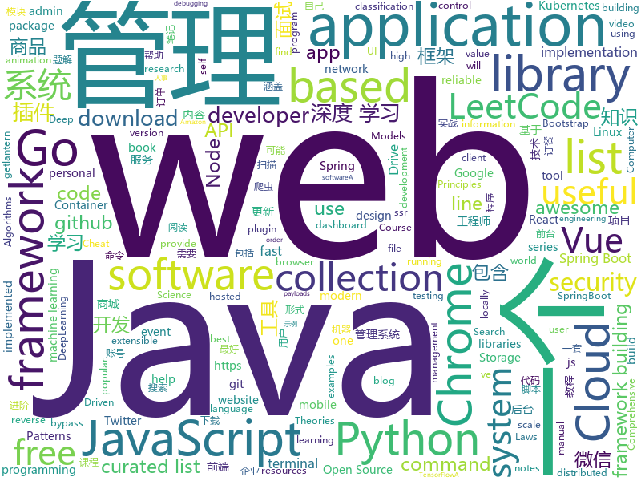

# 2019-05-20
See what the GitHub community is most excited about today.

## python
* [machine-learning-course](https://github.com/machinelearningmindset/machine-learning-course)(**209 stars today**): 💬Machine Learning Course with Python
* [Python](https://github.com/TheAlgorithms/Python)(**153 stars today**): All Algorithms implemented in Python
* [PayloadsAllTheThings](https://github.com/swisskyrepo/PayloadsAllTheThings)(**146 stars today**): A list of useful payloads and bypass for Web Application Security and Pentest/CTF
* [uds](https://github.com/stewartmcgown/uds)(**92 stars today**): Unlimited Drive Storage by splitting binary files into base64
* [black](https://github.com/python/black)(**91 stars today**): The uncompromising Python code formatter
* [fuzzDicts](https://github.com/TheKingOfDuck/fuzzDicts)(**59 stars today**): Web Pentesting Fuzz 字典,一个就够了。
* [system-design-primer](https://github.com/donnemartin/system-design-primer)(**47 stars today**): Learn how to design large-scale systems. Prep for the system design interview. Includes Anki flashcards.
* [interpret](https://github.com/microsoft/interpret)(**47 stars today**): Fit interpretable models. Explain blackbox machine learning.
* [fast-bert](https://github.com/kaushaltrivedi/fast-bert)(**44 stars today**): Super easy library for BERT based NLP models
* [public-apis](https://github.com/toddmotto/public-apis)(**41 stars today**): A collective list of free APIs for use in software and web development.
* [models](https://github.com/tensorflow/models)(**31 stars today**): Models and examples built with TensorFlow
* [uxy](https://github.com/sustrik/uxy)(**41 stars today**): 
* [awesome-python](https://github.com/vinta/awesome-python)(**36 stars today**): A curated list of awesome Python frameworks, libraries, software and resources
* [home-assistant](https://github.com/home-assistant/home-assistant)(**34 stars today**): 🏡Open source home automation that puts local control and privacy first
* [CheatSheetSeries](https://github.com/OWASP/CheatSheetSeries)(**36 stars today**): The OWASP Cheat Sheet Series was created to provide a concise collection of high value information on specific application security topics.
* [keras](https://github.com/keras-team/keras)(**32 stars today**): Deep Learning for humans
* [cpython](https://github.com/python/cpython)(**25 stars today**): The Python programming language
* [PySnooper](https://github.com/cool-RR/PySnooper)(**33 stars today**): Never use print for debugging again
* [face_recognition](https://github.com/ageitgey/face_recognition)(**28 stars today**): The world's simplest facial recognition api for Python and the command line
* [youtube-dl](https://github.com/ytdl-org/youtube-dl)(**25 stars today**): Command-line program to download videos from YouTube.com and other video sites
* [ChromeAppHeroes](https://github.com/zhaoolee/ChromeAppHeroes)(**28 stars today**): 🌈谷粒-Chrome插件英雄榜, 为优秀的Chrome插件写一本中文说明书, 让Chrome插件英雄们造福人类~ ChromePluginHeroes, Write a Chinese manual for the excellent Chrome plugin, let the Chrome plugin heroes benefit the human~
* [twint](https://github.com/twintproject/twint)(**27 stars today**): An advanced Twitter scraping & OSINT tool written in Python that doesn't use Twitter's API, allowing you to scrape a user's followers, following, Tweets and more while evading most API limitations.
* [flask](https://github.com/pallets/flask)(**24 stars today**): The Python micro framework for building web applications.
* [AiLearning](https://github.com/apachecn/AiLearning)(**21 stars today**): AiLearning: 机器学习 - MachineLearning - ML、深度学习 - DeepLearning - DL、自然语言处理 NLP
* [django](https://github.com/django/django)(**16 stars today**): The Web framework for perfectionists with deadlines.

## java
* [mall](https://github.com/macrozheng/mall)(**187 stars today**): mall项目是一套电商系统，包括前台商城系统及后台管理系统，基于SpringBoot+MyBatis实现。 前台商城系统包含首页门户、商品推荐、商品搜索、商品展示、购物车、订单流程、会员中心、客户服务、帮助中心等模块。 后台管理系统包含商品管理、订单管理、会员管理、促销管理、运营管理、内容管理、统计报表、财务管理、权限管理、设置等模块。
* [LeetCodeAnimation](https://github.com/MisterBooo/LeetCodeAnimation)(**197 stars today**): Demonstrate all the questions on LeetCode in the form of animation.（用动画的形式呈现解LeetCode题目的思路）
* [CS-Notes](https://github.com/CyC2018/CS-Notes)(**133 stars today**): 📚技术面试必备基础知识、Leetcode 题解、后端面试、Java 面试、春招、秋招、操作系统、计算机网络、系统设计
* [litemall](https://github.com/linlinjava/litemall)(**96 stars today**): 又一个小商城。litemall = Spring Boot后端 + Vue管理员前端 + 微信小程序用户前端 + Vue用户移动端
* [JavaGuide](https://github.com/Snailclimb/JavaGuide)(**90 stars today**): 【Java学习+面试指南】 一份涵盖大部分Java程序员所需要掌握的核心知识。
* [advanced-java](https://github.com/doocs/advanced-java)(**44 stars today**): 😮互联网 Java 工程师进阶知识完全扫盲：涵盖高并发、分布式、高可用、微服务等领域知识
* [spring-boot-examples](https://github.com/ityouknow/spring-boot-examples)(**37 stars today**): about learning Spring Boot via examples. Spring Boot 教程、技术栈示例代码，快速简单上手教程。
* [spring-boot](https://github.com/spring-projects/spring-boot)(**35 stars today**): Spring Boot
* [tutorials](https://github.com/eugenp/tutorials)(**22 stars today**): The "REST With Spring" Course:
* [toBeTopJavaer](https://github.com/hollischuang/toBeTopJavaer)(**31 stars today**): To Be Top Javaer - Java工程师成神之路
* [Java](https://github.com/TheAlgorithms/Java)(**27 stars today**): All Algorithms implemented in Java
* [elasticsearch](https://github.com/elastic/elasticsearch)(**27 stars today**): Open Source, Distributed, RESTful Search Engine
* [spring-framework](https://github.com/spring-projects/spring-framework)(**22 stars today**): Spring Framework
* [hope-cloud](https://github.com/hope-for/hope-cloud)(**24 stars today**): 🐳Hope-Cloud可能是最好的 Java 微服务项目。基于 Spring Boot、Spring Cloud。一系列框架构建而成。
* [guava](https://github.com/google/guava)(**24 stars today**): Google core libraries for Java
* [ghidra](https://github.com/NationalSecurityAgency/ghidra)(**24 stars today**): Ghidra is a software reverse engineering (SRE) framework
* [bazel](https://github.com/bazelbuild/bazel)(**22 stars today**): a fast, scalable, multi-language and extensible build system
* [MyBookshelf](https://github.com/gedoor/MyBookshelf)(**21 stars today**): 阅读是一款可以自定义来源阅读网络内容的工具，为广大网络文学爱好者提供一种方便、快捷舒适的试读体验。
* [Linkage-RecyclerView](https://github.com/KunMinX/Linkage-RecyclerView)(**20 stars today**): 即使不用饿了么订餐，也请务必收藏好该库！🔥一行代码即可接入，二级联动订餐列表 - Even if you don't order food by PrubHub, be sure to collect this library, please!🔥This secondary linkage list widget can be accessed by only one line of code. Supporting by RecyclerView & AndroidX.
* [incubator-dubbo](https://github.com/apache/incubator-dubbo)(**16 stars today**): Apache Dubbo (incubating) is a high-performance, java based, open source RPC framework.
* [java-design-patterns](https://github.com/iluwatar/java-design-patterns)(**18 stars today**): Design patterns implemented in Java
* [halo](https://github.com/halo-dev/halo)(**18 stars today**): ✍ Halo 可能是最好的 Java 博客系统
* [RxJava](https://github.com/ReactiveX/RxJava)(**18 stars today**): RxJava – Reactive Extensions for the JVM – a library for composing asynchronous and event-based programs using observable sequences for the Java VM.
* [72crm-java](https://github.com/72crm/72crm-java)(**19 stars today**): The JAVA version for "72CRM"
* [WxJava](https://github.com/Wechat-Group/WxJava)(**17 stars today**): WxJava （微信开发 Java SDK），支持包括微信支付、开放平台、小程序、企业微信/企业号和公众号等的后端开发

## unknown
* [hacker-laws-zh](https://github.com/nusr/hacker-laws-zh)(**290 stars today**): 💻📖Laws, Theories, Principles and Patterns that developers will find useful. (对开发人员有用的定律、理论、原则和模式。)
* [hacker-laws](https://github.com/dwmkerr/hacker-laws)(**290 stars today**): 💻📖Laws, Theories, Principles and Patterns that developers will find useful.
* [The-Hackers-Hardware-Toolkit](https://github.com/yadox666/The-Hackers-Hardware-Toolkit)(**73 stars today**): The best hacker's gadgets for Red Team pentesters and security researchers.
* [Data-Science--Cheat-Sheet](https://github.com/abhat222/Data-Science--Cheat-Sheet)(**64 stars today**): Cheat Sheets
* [nlp-beginner](https://github.com/FudanNLP/nlp-beginner)(**56 stars today**): NLP上手教程
* [gitignore](https://github.com/github/gitignore)(**43 stars today**): A collection of useful .gitignore templates
* [You-Dont-Know-JS](https://github.com/getify/You-Dont-Know-JS)(**48 stars today**): A book series on JavaScript. @YDKJS on twitter.
* [awesome](https://github.com/sindresorhus/awesome)(**45 stars today**): 😎Awesome lists about all kinds of interesting topics
* [developer-roadmap](https://github.com/kamranahmedse/developer-roadmap)(**40 stars today**): Roadmap to becoming a web developer in 2019
* [PowerToys](https://github.com/microsoft/PowerToys)(**42 stars today**): Windows system utilities to maximize productivity
* [coding-interview-university](https://github.com/jwasham/coding-interview-university)(**34 stars today**): A complete computer science study plan to become a software engineer.
* [DeepLearning-500-questions](https://github.com/scutan90/DeepLearning-500-questions)(**28 stars today**): 深度学习500问，以问答形式对常用的概率知识、线性代数、机器学习、深度学习、计算机视觉等热点问题进行阐述，以帮助自己及有需要的读者。 全书分为18个章节，50余万字。由于水平有限，书中不妥之处恳请广大读者批评指正。 未完待续............ 如有意合作，联系scutjy2015@163.com 版权所有，违权必究 Tan 2018.06
* [awesome-decision-tree-papers](https://github.com/benedekrozemberczki/awesome-decision-tree-papers)(**32 stars today**): A collection of research papers on decision, classification and regression trees with implementations.
* [computer-science](https://github.com/ossu/computer-science)(**32 stars today**): 🎓Path to a free self-taught education in Computer Science!
* [certified-aws-developer-associate-notes](https://github.com/mostafa-abdo/certified-aws-developer-associate-notes)(**31 stars today**): My notes in preparation for the 2019 AWS developer associate exam
* [free-programming-books](https://github.com/EbookFoundation/free-programming-books)(**24 stars today**): 📚Freely available programming books
* [Free-SS-SSR](https://github.com/dxxzst/Free-SS-SSR)(**25 stars today**): 免费的SS账号、SSR账号，定期更新。优先更新：
* [Emergency-Response-Notes](https://github.com/Bypass007/Emergency-Response-Notes)(**21 stars today**): 应急响应实战笔记，一个安全工程师的自我修养。
* [trackerslist](https://github.com/ngosang/trackerslist)(**24 stars today**): An updated list of public BitTorrent trackers
* [awesome-vue](https://github.com/vuejs/awesome-vue)(**25 stars today**): 🎉A curated list of awesome things related to Vue.js
* [electron-ssr-backup](https://github.com/qingshuisiyuan/electron-ssr-backup)(**15 stars today**): electron-ssr原作者删除了这个伟大的项目，故备份了下来，不继续开发,且用且珍惜
* [awesome-react-hooks](https://github.com/glauberfc/awesome-react-hooks)(**24 stars today**): A curated list about React Hooks
* [fancyss_history_package](https://github.com/hq450/fancyss_history_package)(**15 stars today**): 科学上网插件的离线安装包储存在这里
* [app-ideas](https://github.com/florinpop17/app-ideas)(**23 stars today**): A Collection of application ideas which can be used to improve your coding skills.
* [books](https://github.com/yuanliangding/books)(**21 stars today**): "我的阅历"

## javascript
* [gitfolio](https://github.com/imfunniee/gitfolio)(**402 stars today**): personal website + blog for every github user
* [svelte](https://github.com/sveltejs/svelte)(**260 stars today**): Cybernetically enhanced web apps
* [leetcode](https://github.com/azl397985856/leetcode)(**174 stars today**): LeetCode Solutions: A Record of My Problem Solving Journey.( leetcode题解，记录自己的leetcode解题之路。)
* [ola](https://github.com/franciscop/ola)(**141 stars today**): 🌊Smooth animation library for interpolating numbers
* [vhr](https://github.com/lenve/vhr)(**91 stars today**): 微人事是一个前后端分离的人力资源管理系统，项目采用SpringBoot+Vue开发。
* [i18nize-react](https://github.com/Ghost---Shadow/i18nize-react)(**106 stars today**): Internationalize react apps within a lunch break
* [libpku](https://github.com/lib-pku/libpku)(**79 stars today**): 贵校课程资料民间整理
* [tornis](https://github.com/robb0wen/tornis)(**89 stars today**): Tornis helps you watch and respond to changes in your browser's viewport🌲
* [vue](https://github.com/vuejs/vue)(**58 stars today**): 🖖Vue.js is a progressive, incrementally-adoptable JavaScript framework for building UI on the web.
* [react](https://github.com/facebook/react)(**53 stars today**): A declarative, efficient, and flexible JavaScript library for building user interfaces.
* [UnblockNeteaseMusic](https://github.com/nondanee/UnblockNeteaseMusic)(**43 stars today**): Revive unavailable songs for Netease Cloud Music
* [baiduyun](https://github.com/syhyz1990/baiduyun)(**37 stars today**): 🖖油猴脚本 一个脚本搞定百度网盘下载
* [hurried](https://github.com/yankouskia/hurried)(**38 stars today**): ⚡️JavaScript library for parallel code execution🔀
* [MikuTools](https://github.com/Ice-Hazymoon/MikuTools)(**36 stars today**): 一个轻量的工具集合
* [berry](https://github.com/yarnpkg/berry)(**33 stars today**): 📦🐈A modern, fast, reliable, package manager; part of the Yarn organization
* [axios](https://github.com/axios/axios)(**34 stars today**): Promise based HTTP client for the browser and node.js
* [create-react-app](https://github.com/facebook/create-react-app)(**32 stars today**): Set up a modern web app by running one command.
* [bootstrap](https://github.com/twbs/bootstrap)(**23 stars today**): The most popular HTML, CSS, and JavaScript framework for developing responsive, mobile first projects on the web.
* [30-seconds-of-code](https://github.com/30-seconds/30-seconds-of-code)(**30 stars today**): A curated collection of useful JavaScript snippets that you can understand in 30 seconds or less.
* [node](https://github.com/nodejs/node)(**26 stars today**): Node.js JavaScript runtime✨🐢🚀✨
* [puppeteer](https://github.com/GoogleChrome/puppeteer)(**30 stars today**): Headless Chrome Node API
* [react-native](https://github.com/facebook/react-native)(**28 stars today**): A framework for building native apps with React.
* [vim-language-server](https://github.com/iamcco/vim-language-server)(**31 stars today**): vim language server
* [javascript](https://github.com/airbnb/javascript)(**28 stars today**): JavaScript Style Guide
* [awesome-selfhosted](https://github.com/Kickball/awesome-selfhosted)(**29 stars today**): This is a list of Free Software network services and web applications which can be hosted locally. Selfhosting is the process of locally hosting and managing applications instead of renting from SaaS providers.

## html
* [awesome-modern-cpp](https://github.com/rigtorp/awesome-modern-cpp)(**129 stars today**): A collection of resources on modern C++
* [TrackRay](https://github.com/iSafeBlue/TrackRay)(**20 stars today**): 溯光 (TrackRay) 3 插件式渗透测试框架（资产扫描|指纹识别|暴力破解|网页爬虫|端口扫描|漏洞扫描|AWVS|NMAP|Metasploit）
* [linux-command](https://github.com/jaywcjlove/linux-command)(**19 stars today**): Linux命令大全搜索工具，内容包含Linux命令手册、详解、学习、搜集。https://git.io/linux
* [nndl.github.io](https://github.com/nndl/nndl.github.io)(**18 stars today**): 《神经网络与深度学习》 Neural Network and Deep Learning
* [AdminLTE](https://github.com/ColorlibHQ/AdminLTE)(**15 stars today**): AdminLTE - Free Premium Admin control Panel Theme Based On Bootstrap 3.x
* [flutter-in-action](https://github.com/flutterchina/flutter-in-action)(**16 stars today**): 《Flutter实战》电子书
* [deeplearning_ai_books](https://github.com/fengdu78/deeplearning_ai_books)(**11 stars today**): deeplearning.ai（吴恩达老师的深度学习课程笔记及资源）
* [personal-website](https://github.com/github/personal-website)(**8 stars today**): Code that'll help you kickstart a personal website that showcases your work as a software developer.
* [Spoon-Knife](https://github.com/octocat/Spoon-Knife)(****): This repo is for demonstration purposes only.
* [prototurk.com](https://github.com/tayfunerbilen/prototurk.com)(**6 stars today**): Web dilleri ve teknolojileriyle ilgili referanslar JSON formatında ve Türkçe olarak hazırlanmaktadır.
* [chromium_for_spider](https://github.com/myvyang/chromium_for_spider)(**11 stars today**): 为漏扫动态爬虫定制的浏览器
* [web.dev](https://github.com/GoogleChrome/web.dev)(**10 stars today**): Content repository for web.dev
* [blog_os](https://github.com/phil-opp/blog_os)(**9 stars today**): Writing an OS in Rust
* [portainer](https://github.com/portainer/portainer)(**8 stars today**): Simple management UI for Docker
* [sourcegraph](https://github.com/sourcegraph/sourcegraph)(**8 stars today**): Code search and navigation tool (self-hosted)
* [go101](https://github.com/go101/go101)(**7 stars today**): An online book focusing on Go syntax/semantics.
* [zenbot](https://github.com/DeviaVir/zenbot)(**7 stars today**): Zenbot is a command-line cryptocurrency trading bot using Node.js and MongoDB.
* [Blog](https://github.com/YvetteLau/Blog)(**7 stars today**): 【前端进阶】优质博文
* [technical_books](https://github.com/TIM168/technical_books)(**6 stars today**): IT技术书籍，不间断更新中
* [coreui-free-bootstrap-admin-template](https://github.com/coreui/coreui-free-bootstrap-admin-template)(**6 stars today**): CoreUI is free bootstrap admin template
* [simple-icons](https://github.com/simple-icons/simple-icons)(**6 stars today**): SVG icons for popular brands
* [sa-admin](https://github.com/shengzhang666/sa-admin)(**6 stars today**): 一个基于iframe的多窗口后台模板，演示地址：http://sa-admin.dev33.cn
* [fastText](https://github.com/facebookresearch/fastText)(**5 stars today**): Library for fast text representation and classification.
* [csinva.github.io](https://github.com/csinva/csinva.github.io)(**5 stars today**): Slides, notes, blog posts, and research on machine learning and statistics.
* [owasp-mstg](https://github.com/OWASP/owasp-mstg)(**5 stars today**): The Mobile Security Testing Guide (MSTG) is a comprehensive manual for mobile app security development, testing and reverse engineering.

## go
* [trivy](https://github.com/knqyf263/trivy)(**100 stars today**): A Simple and Comprehensive Vulnerability Scanner for Containers, Suitable for CI
* [polaris](https://github.com/reactiveops/polaris)(**56 stars today**): Validation of best practices in your Kubernetes clusters
* [go](https://github.com/golang/go)(**40 stars today**): The Go programming language
* [awesome-go](https://github.com/avelino/awesome-go)(**34 stars today**): A curated list of awesome Go frameworks, libraries and software
* [v2ray-core](https://github.com/v2ray/v2ray-core)(**27 stars today**): A platform for building proxies to bypass network restrictions.
* [kubernetes](https://github.com/kubernetes/kubernetes)(**26 stars today**): Production-Grade Container Scheduling and Management
* [lantern](https://github.com/getlantern/lantern)(**29 stars today**): 🔴蓝灯最新版本下载 https://github.com/getlantern/download🔴Lantern Latest Download https://github.com/getlantern/download🔴
* [go-git](https://github.com/src-d/go-git)(**26 stars today**): A highly extensible Git implementation in pure Go.
* [gameboy.live](https://github.com/HFO4/gameboy.live)(**25 stars today**): 🕹️A basic gameboy emulator with terminal "Cloud Gaming" support
* [gopeed](https://github.com/monkeyWie/gopeed)(**21 stars today**): A fast download client,support HTTP&P2P.
* [build-web-application-with-golang](https://github.com/astaxie/build-web-application-with-golang)(**19 stars today**): A golang ebook intro how to build a web with golang
* [hugo](https://github.com/gohugoio/hugo)(**20 stars today**): The world’s fastest framework for building websites.
* [rclone](https://github.com/ncw/rclone)(**19 stars today**): "rsync for cloud storage" - Google Drive, Amazon Drive, S3, Dropbox, Backblaze B2, One Drive, Swift, Hubic, Cloudfiles, Google Cloud Storage, Yandex Files
* [etcd](https://github.com/etcd-io/etcd)(**17 stars today**): Distributed reliable key-value store for the most critical data of a distributed system
* [iotex-core](https://github.com/iotexproject/iotex-core)(**18 stars today**): Official Go implementation of the IoTeX protocol
* [grafterm](https://github.com/slok/grafterm)(**17 stars today**): Metrics dashboards on terminal (a grafana inspired terminal version)
* [failure](https://github.com/morikuni/failure)(**17 stars today**): failure is a utility package for handling application errors.
* [Hippo](https://github.com/Clivern/Hippo)(**17 stars today**): 💨A well crafted go packages that help you build robust, reliable, maintainable microservices.
* [wtf](https://github.com/wtfutil/wtf)(**16 stars today**): The personal information dashboard for your terminal.
* [go-snark](https://github.com/arnaucube/go-snark)(**16 stars today**): zkSNARK library implementation in Go
* [prometheus](https://github.com/prometheus/prometheus)(**16 stars today**): The Prometheus monitoring system and time series database.
* [kratos](https://github.com/bilibili/kratos)(**15 stars today**): Kratos是bilibili开源的一套Go微服务框架，包含大量微服务相关框架及工具。
* [syncthing](https://github.com/syncthing/syncthing)(**15 stars today**): Open Source Continuous File Synchronization
* [hub](https://github.com/github/hub)(**15 stars today**): A command-line tool that makes git easier to use with GitHub.
* [keda](https://github.com/kedacore/keda)(**15 stars today**): KEDA is a Kubernetes-based Event Driven Autoscaling component. It provides event driven scale for any container running in Kubernetes

## WordCloud

