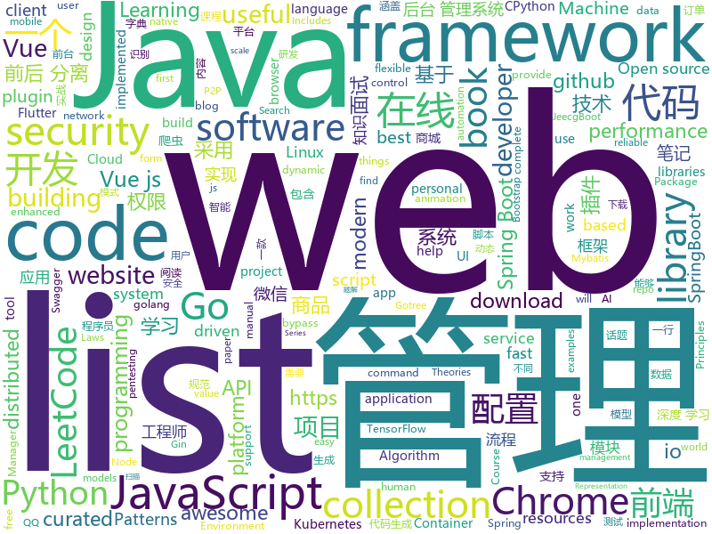

# 2019-05-21
See what the GitHub community is most excited about today.

## python
* [DeleteFB](https://github.com/weskerfoot/DeleteFB)(**389 stars today**): Selenium script to delete all of your Facebook wall posts
* [machine-learning-course](https://github.com/machinelearningmindset/machine-learning-course)(**345 stars today**): 💬Machine Learning Course with Python
* [uxy](https://github.com/sustrik/uxy)(**300 stars today**): 
* [Python](https://github.com/TheAlgorithms/Python)(**207 stars today**): All Algorithms implemented in Python
* [CVE-2019-0708-PoC-Hitting-Path](https://github.com/digital-missiles/CVE-2019-0708-PoC-Hitting-Path)(**172 stars today**): It's only hitting vulnerable path in termdd.sys!!! NOT DOS
* [PayloadsAllTheThings](https://github.com/swisskyrepo/PayloadsAllTheThings)(**155 stars today**): A list of useful payloads and bypass for Web Application Security and Pentest/CTF
* [uds](https://github.com/stewartmcgown/uds)(**126 stars today**): Unlimited Drive Storage by splitting binary files into base64
* [transfer-nlp](https://github.com/feedly/transfer-nlp)(**95 stars today**): NLP library designed for flexible research and development
* [models](https://github.com/tensorflow/models)(**55 stars today**): Models and examples built with TensorFlow
* [fuzzDicts](https://github.com/TheKingOfDuck/fuzzDicts)(**66 stars today**): Web Pentesting Fuzz 字典,一个就够了。
* [CheatSheetSeries](https://github.com/OWASP/CheatSheetSeries)(**59 stars today**): The OWASP Cheat Sheet Series was created to provide a concise collection of high value information on specific application security topics.
* [black](https://github.com/python/black)(**55 stars today**): The uncompromising Python code formatter
* [ERNIE](https://github.com/thunlp/ERNIE)(**54 stars today**): Source code and dataset for ACL 2019 paper "ERNIE: Enhanced Language Representation with Informative Entities"
* [awesome-python](https://github.com/vinta/awesome-python)(**48 stars today**): A curated list of awesome Python frameworks, libraries, software and resources
* [PySnooper](https://github.com/cool-RR/PySnooper)(**50 stars today**): Never use print for debugging again
* [system-design-primer](https://github.com/donnemartin/system-design-primer)(**42 stars today**): Learn how to design large-scale systems. Prep for the system design interview. Includes Anki flashcards.
* [face_recognition](https://github.com/ageitgey/face_recognition)(**37 stars today**): The world's simplest facial recognition api for Python and the command line
* [AiLearning](https://github.com/apachecn/AiLearning)(**38 stars today**): AiLearning: 机器学习 - MachineLearning - ML、深度学习 - DeepLearning - DL、自然语言处理 NLP
* [public-apis](https://github.com/toddmotto/public-apis)(**39 stars today**): A collective list of free APIs for use in software and web development.
* [ChromeAppHeroes](https://github.com/zhaoolee/ChromeAppHeroes)(**41 stars today**): 🌈谷粒-Chrome插件英雄榜, 为优秀的Chrome插件写一本中文说明书, 让Chrome插件英雄们造福人类~ ChromePluginHeroes, Write a Chinese manual for the excellent Chrome plugin, let the Chrome plugin heroes benefit the human~
* [bert](https://github.com/google-research/bert)(**33 stars today**): TensorFlow code and pre-trained models for BERT
* [home-assistant](https://github.com/home-assistant/home-assistant)(**38 stars today**): 🏡Open source home automation that puts local control and privacy first
* [cpython](https://github.com/python/cpython)(**31 stars today**): The Python programming language
* [interpret](https://github.com/microsoft/interpret)(**38 stars today**): Fit interpretable models. Explain blackbox machine learning.
* [examples-of-web-crawlers](https://github.com/shengqiangzhang/examples-of-web-crawlers)(**32 stars today**): python爬虫例子,对新手比较友好,主要爬取淘宝、天猫、微信、豆瓣、QQ等网站。

## java
* [LeetCodeAnimation](https://github.com/MisterBooo/LeetCodeAnimation)(**335 stars today**): Demonstrate all the questions on LeetCode in the form of animation.（用动画的形式呈现解LeetCode题目的思路）
* [mall](https://github.com/macrozheng/mall)(**229 stars today**): mall项目是一套电商系统，包括前台商城系统及后台管理系统，基于SpringBoot+MyBatis实现。 前台商城系统包含首页门户、商品推荐、商品搜索、商品展示、购物车、订单流程、会员中心、客户服务、帮助中心等模块。 后台管理系统包含商品管理、订单管理、会员管理、促销管理、运营管理、内容管理、统计报表、财务管理、权限管理、设置等模块。
* [CS-Notes](https://github.com/CyC2018/CS-Notes)(**198 stars today**): 📚技术面试必备基础知识、Leetcode 题解、后端面试、Java 面试、春招、秋招、操作系统、计算机网络、系统设计
* [JavaGuide](https://github.com/Snailclimb/JavaGuide)(**160 stars today**): 【Java学习+面试指南】 一份涵盖大部分Java程序员所需要掌握的核心知识。
* [eladmin](https://github.com/elunez/eladmin)(**108 stars today**): 项目基于 Spring Boot 2.1.0 、 Jpa、 Spring Security、redis、Vue的前后端分离的后台管理系统，项目采用分模块开发方式， 权限控制采用 RBAC，支持数据字典与数据权限管理，支持一键生成前后端代码，支持动态路由
* [litemall](https://github.com/linlinjava/litemall)(**89 stars today**): 又一个小商城。litemall = Spring Boot后端 + Vue管理员前端 + 微信小程序用户前端 + Vue用户移动端
* [advanced-java](https://github.com/doocs/advanced-java)(**83 stars today**): 😮互联网 Java 工程师进阶知识完全扫盲：涵盖高并发、分布式、高可用、微服务等领域知识
* [rhizobia_J](https://github.com/momosecurity/rhizobia_J)(**83 stars today**): JAVA安全SDK及编码规范
* [spring-boot-examples](https://github.com/ityouknow/spring-boot-examples)(**67 stars today**): about learning Spring Boot via examples. Spring Boot 教程、技术栈示例代码，快速简单上手教程。
* [jeecg-boot](https://github.com/zhangdaiscott/jeecg-boot)(**70 stars today**): Jeecg-Boot 是一款基于代码生成器的智能开发平台！采用前后端分离架构：SpringBoot，Mybatis，Shiro，JWT，Vue&Ant Design。强大的代码生成器让前端和后台代码一键生成，不需要写任何代码，绝对是全栈开发福音！！ JeecgBoot的宗旨是提高UI能力的同时,降低前后分离的开发成本，JeecgBoot还独创在线开发模式，No代码概念，一系列在线智能开发：在线配置表单、在线配置报表、在线设计流程等等。
* [Linkage-RecyclerView](https://github.com/KunMinX/Linkage-RecyclerView)(**66 stars today**): 即使不用饿了么订餐，也请务必收藏好该库！🔥一行代码即可接入，二级联动订餐列表 - Even if you don't order food by PrubHub, be sure to collect this library, please!🔥This secondary linkage list widget can be accessed by only one line of code. Supporting by RecyclerView & AndroidX.
* [Java](https://github.com/TheAlgorithms/Java)(**60 stars today**): All Algorithms implemented in Java
* [spring-boot](https://github.com/spring-projects/spring-boot)(**44 stars today**): Spring Boot
* [tutorials](https://github.com/eugenp/tutorials)(**28 stars today**): The "REST With Spring" Course:
* [open_nsfw_android](https://github.com/devzwy/open_nsfw_android)(**51 stars today**): 色情图片离线识别，基于TensorFlow实现。识别只需200ms,可断网测试，成功率99%，调用只要一行代码，从雅虎的开源项目open_nsfw移植，tflite（6M）为训练好的模型，该模型文件可用于iOS、java、C++等平台
* [toBeTopJavaer](https://github.com/hollischuang/toBeTopJavaer)(**45 stars today**): To Be Top Javaer - Java工程师成神之路
* [DoraemonKit](https://github.com/didi/DoraemonKit)(**44 stars today**): 简称 "DoKit" 。一款功能齐全的客户端（ iOS 、Android ）研发助手，你值得拥有。
* [apollo](https://github.com/ctripcorp/apollo)(**39 stars today**): Apollo（阿波罗）是携程框架部门研发的分布式配置中心，能够集中化管理应用不同环境、不同集群的配置，配置修改后能够实时推送到应用端，并且具备规范的权限、流程治理等特性，适用于微服务配置管理场景。
* [arthas](https://github.com/alibaba/arthas)(**41 stars today**): Alibaba Java Diagnostic Tool Arthas/Alibaba Java诊断利器Arthas
* [spring-framework](https://github.com/spring-projects/spring-framework)(**31 stars today**): Spring Framework
* [flutter_boost](https://github.com/alibaba/flutter_boost)(**38 stars today**): FlutterBoost is a Flutter plugin which enables hybrid integration of Flutter for your existing native apps with minimum efforts
* [elasticsearch](https://github.com/elastic/elasticsearch)(**30 stars today**): Open Source, Distributed, RESTful Search Engine
* [java-design-patterns](https://github.com/iluwatar/java-design-patterns)(**30 stars today**): Design patterns implemented in Java
* [guava](https://github.com/google/guava)(**33 stars today**): Google core libraries for Java
* [nacos](https://github.com/alibaba/nacos)(**32 stars today**): an easy-to-use dynamic service discovery, configuration and service management platform for building cloud native applications.

## unknown
* [hacker-laws-zh](https://github.com/nusr/hacker-laws-zh)(**494 stars today**): 💻📖Laws, Theories, Principles and Patterns that developers will find useful. (对开发人员有用的定律、理论、原则和模式。)
* [hacker-laws](https://github.com/dwmkerr/hacker-laws)(**410 stars today**): 💻📖Laws, Theories, Principles and Patterns that developers will find useful.
* [Emergency-Response-Notes](https://github.com/Bypass007/Emergency-Response-Notes)(**211 stars today**): 应急响应实战笔记，一个安全工程师的自我修养。
* [The-Hackers-Hardware-Toolkit](https://github.com/yadox666/The-Hackers-Hardware-Toolkit)(**161 stars today**): The best hacker's gadgets for Red Team pentesters and security researchers.
* [CPython-Internals](https://github.com/zpoint/CPython-Internals)(**102 stars today**): Dive into CPython internals, trying to illustrate every detail of CPython implementation | CPython 源码阅读笔记, 多图展示底层实现细节
* [gitignore](https://github.com/github/gitignore)(**68 stars today**): A collection of useful .gitignore templates
* [developer-roadmap](https://github.com/kamranahmedse/developer-roadmap)(**81 stars today**): Roadmap to becoming a web developer in 2019
* [Data-Science--Cheat-Sheet](https://github.com/abhat222/Data-Science--Cheat-Sheet)(**67 stars today**): Cheat Sheets
* [free-programming-books](https://github.com/EbookFoundation/free-programming-books)(**59 stars today**): 📚Freely available programming books
* [awesome](https://github.com/sindresorhus/awesome)(**61 stars today**): 😎Awesome lists about all kinds of interesting topics
* [You-Dont-Know-JS](https://github.com/getify/You-Dont-Know-JS)(**53 stars today**): A book series on JavaScript. @YDKJS on twitter.
* [the-book-of-secret-knowledge](https://github.com/trimstray/the-book-of-secret-knowledge)(**52 stars today**): A collection of inspiring lists, manuals, cheatsheets, blogs, hacks, one-liners, cli/web tools and more.
* [996action](https://github.com/CPdogson/996action)(**49 stars today**): 
* [coding-interview-university](https://github.com/jwasham/coding-interview-university)(**41 stars today**): A complete computer science study plan to become a software engineer.
* [PowerToys](https://github.com/microsoft/PowerToys)(**48 stars today**): Windows system utilities to maximize productivity
* [trackerslist](https://github.com/ngosang/trackerslist)(**42 stars today**): An updated list of public BitTorrent trackers
* [morphogenesis-resources](https://github.com/jasonwebb/morphogenesis-resources)(**45 stars today**): Comprehensive list of resources on the topic of digital morphogenesis (the creation of form through code). Includes links to major articles, code repos, creative projects, books, software, and more.
* [nginx-admins-handbook](https://github.com/trimstray/nginx-admins-handbook)(**43 stars today**): These notes describes how to improve NGINX performance, security and other important things; @ssllabs A+ 100%, @mozilla A+ 120/100.
* [pumpkin-book](https://github.com/datawhalechina/pumpkin-book)(**40 stars today**): 《机器学习》（西瓜书）公式推导解析，在线阅读地址：https://datawhalechina.github.io/pumpkin-book
* [StanfordDoggoProject](https://github.com/Nate711/StanfordDoggoProject)(**39 stars today**): 
* [awesome-vue](https://github.com/vuejs/awesome-vue)(**37 stars today**): 🎉A curated list of awesome things related to Vue.js
* [996.Leave](https://github.com/623637646/996.Leave)(**38 stars today**): 逃离996
* [Awesome-Quant-Machine-Learning-Trading](https://github.com/grananqvist/Awesome-Quant-Machine-Learning-Trading)(**31 stars today**): Quant/Algorithm trading resources with an emphasis on Machine Learning
* [fe-necessary-book](https://github.com/ddzy/fe-necessary-book)(**31 stars today**): A pdf and software collection about frontend
* [weekly](https://github.com/dt-fe/weekly)(**31 stars today**): 前端精读周刊

## javascript
* [gitfolio](https://github.com/imfunniee/gitfolio)(**702 stars today**): personal website + blog for every github user
* [ola](https://github.com/franciscop/ola)(**369 stars today**): 🌊Smooth animation library for interpolating numbers
* [WebGL-Fluid-Simulation](https://github.com/PavelDoGreat/WebGL-Fluid-Simulation)(**332 stars today**): Play with fluids in your browser (works even on mobile)
* [svelte](https://github.com/sveltejs/svelte)(**271 stars today**): Cybernetically enhanced web apps
* [leetcode](https://github.com/azl397985856/leetcode)(**238 stars today**): LeetCode Solutions: A Record of My Problem Solving Journey.( leetcode题解，记录自己的leetcode解题之路。)
* [vhr](https://github.com/lenve/vhr)(**133 stars today**): 微人事是一个前后端分离的人力资源管理系统，项目采用SpringBoot+Vue开发。
* [vue](https://github.com/vuejs/vue)(**105 stars today**): 🖖Vue.js is a progressive, incrementally-adoptable JavaScript framework for building UI on the web.
* [tornis](https://github.com/robb0wen/tornis)(**113 stars today**): Tornis helps you watch and respond to changes in your browser's viewport🌲
* [react](https://github.com/facebook/react)(**90 stars today**): A declarative, efficient, and flexible JavaScript library for building user interfaces.
* [javascript](https://github.com/airbnb/javascript)(**91 stars today**): JavaScript Style Guide
* [libpku](https://github.com/lib-pku/libpku)(**71 stars today**): 贵校课程资料民间整理
* [hurried](https://github.com/yankouskia/hurried)(**84 stars today**): ⚡️JavaScript library for parallel code execution🔀
* [storefront-ui](https://github.com/DivanteLtd/storefront-ui)(**67 stars today**): Customization-first Vue.js UI framework for eCommerce.
* [30-seconds-of-code](https://github.com/30-seconds/30-seconds-of-code)(**65 stars today**): A curated collection of useful JavaScript snippets that you can understand in 30 seconds or less.
* [i18nize-react](https://github.com/Ghost---Shadow/i18nize-react)(**67 stars today**): Internationalize react apps within a lunch break
* [baiduyun](https://github.com/syhyz1990/baiduyun)(**63 stars today**): 🖖油猴脚本 一个脚本搞定百度网盘下载
* [axios](https://github.com/axios/axios)(**62 stars today**): Promise based HTTP client for the browser and node.js
* [fusuma](https://github.com/hiroppy/fusuma)(**56 stars today**): ✍️Fusuma makes slides with Markdown easily.
* [bootstrap](https://github.com/twbs/bootstrap)(**43 stars today**): The most popular HTML, CSS, and JavaScript framework for developing responsive, mobile first projects on the web.
* [create-react-app](https://github.com/facebook/create-react-app)(**49 stars today**): Set up a modern web app by running one command.
* [uni-app](https://github.com/dcloudio/uni-app)(**53 stars today**): 使用 Vue.js 开发跨平台应用的前端框架
* [puppeteer](https://github.com/GoogleChrome/puppeteer)(**46 stars today**): Headless Chrome Node API
* [node](https://github.com/nodejs/node)(**38 stars today**): Node.js JavaScript runtime✨🐢🚀✨
* [loveyue](https://github.com/wuxia2001/loveyue)(**31 stars today**): loveyue系列1到8的源码
* [berry](https://github.com/yarnpkg/berry)(**44 stars today**): 📦🐈A modern, fast, reliable, package manager; part of the Yarn organization

## html
* [awesome-modern-cpp](https://github.com/rigtorp/awesome-modern-cpp)(**114 stars today**): A collection of resources on modern C++
* [flutter-in-action](https://github.com/flutterchina/flutter-in-action)(**37 stars today**): 《Flutter实战》电子书
* [linux-command](https://github.com/jaywcjlove/linux-command)(**34 stars today**): Linux命令大全搜索工具，内容包含Linux命令手册、详解、学习、搜集。https://git.io/linux
* [chromium_for_spider](https://github.com/myvyang/chromium_for_spider)(**36 stars today**): 为漏扫动态爬虫定制的浏览器
* [TrackRay](https://github.com/iSafeBlue/TrackRay)(**31 stars today**): 溯光 (TrackRay) 3 插件式渗透测试框架（资产扫描|指纹识别|暴力破解|网页爬虫|端口扫描|漏洞扫描|AWVS|NMAP|Metasploit）
* [AdminLTE](https://github.com/ColorlibHQ/AdminLTE)(**23 stars today**): AdminLTE - Free Premium Admin control Panel Theme Based On Bootstrap 3.x
* [nndl.github.io](https://github.com/nndl/nndl.github.io)(**22 stars today**): 《神经网络与深度学习》 Neural Network and Deep Learning
* [Spoon-Knife](https://github.com/octocat/Spoon-Knife)(****): This repo is for demonstration purposes only.
* [fastText](https://github.com/facebookresearch/fastText)(**13 stars today**): Library for fast text representation and classification.
* [en.javascript.info](https://github.com/javascript-tutorial/en.javascript.info)(**12 stars today**): Modern JavaScript Tutorial
* [deeplearning_ai_books](https://github.com/fengdu78/deeplearning_ai_books)(**12 stars today**): deeplearning.ai（吴恩达老师的深度学习课程笔记及资源）
* [personal-website](https://github.com/github/personal-website)(**6 stars today**): Code that'll help you kickstart a personal website that showcases your work as a software developer.
* [DetectionLab](https://github.com/clong/DetectionLab)(**10 stars today**): Vagrant & Packer scripts to build a lab environment complete with security tooling and logging best practices
* [craftinginterpreters](https://github.com/munificent/craftinginterpreters)(**9 stars today**): Repository for the book "Crafting Interpreters"
* [swagger-codegen](https://github.com/swagger-api/swagger-codegen)(**9 stars today**): swagger-codegen contains a template-driven engine to generate documentation, API clients and server stubs in different languages by parsing your OpenAPI / Swagger definition.
* [electron-api-demos](https://github.com/electron/electron-api-demos)(**9 stars today**): Explore the Electron APIs
* [hugo-academic](https://github.com/gcushen/hugo-academic)(**7 stars today**): The website builder for Hugo. Build and deploy a beautiful website in minutes🚀
* [impatient-js-zh](https://github.com/apachecn/impatient-js-zh)(**9 stars today**): 📖[译] 写给不耐烦程序员的 JavaScript
* [technical_books](https://github.com/TIM168/technical_books)(**6 stars today**): IT技术书籍，不间断更新中
* [vulnreport](https://github.com/salesforce/vulnreport)(**7 stars today**): Open-source pentesting management and automation platform by Salesforce Product Security
* [nginxconfig.io](https://github.com/valentinxxx/nginxconfig.io)(**8 stars today**): ⚙️NGiИX config generator on steroids💉
* [elasticsearch-definitive-guide](https://github.com/elasticsearch-cn/elasticsearch-definitive-guide)(**8 stars today**): 欢迎加QQ群：109764489，贡献力量！
* [sourcegraph](https://github.com/sourcegraph/sourcegraph)(**8 stars today**): Code search and navigation tool (self-hosted)
* [human_dynamics](https://github.com/akanazawa/human_dynamics)(**8 stars today**): project for paper "Learning 3D Human Dynamics from Video"
* [wpt](https://github.com/web-platform-tests/wpt)(**7 stars today**): Test suites for Web platform specs — including WHATWG, W3C, and others

## go
* [reading-go](https://github.com/developer-learning/reading-go)(**369 stars today**): Go 夜读 > 每周通过 zoom 在线直播的方式分享 Go 相关的技术话题，每天大家在 微信/Slack 上及时沟通交流编程技术话题。
* [trivy](https://github.com/knqyf263/trivy)(**173 stars today**): A Simple and Comprehensive Vulnerability Scanner for Containers, Suitable for CI
* [werf](https://github.com/flant/werf)(**97 stars today**): Werf (previously known as dapp) helps to implement and support Continuous Integration and Continuous Delivery
* [kubernetes](https://github.com/kubernetes/kubernetes)(**43 stars today**): Production-Grade Container Scheduling and Management
* [oya](https://github.com/tooploox/oya)(**71 stars today**): Using Oya packs containing reusable boilerplate & scripts, you can bootstrap easy to work with, deployable projects
* [go](https://github.com/golang/go)(**56 stars today**): The Go programming language
* [polaris](https://github.com/reactiveops/polaris)(**50 stars today**): Validation of best practices in your Kubernetes clusters
* [awesome-go](https://github.com/avelino/awesome-go)(**48 stars today**): A curated list of awesome Go frameworks, libraries and software
* [go-git](https://github.com/src-d/go-git)(**43 stars today**): A highly extensible Git implementation in pure Go.
* [gameboy.live](https://github.com/HFO4/gameboy.live)(**41 stars today**): 🕹️A basic gameboy emulator with terminal "Cloud Gaming" support
* [build-web-application-with-golang](https://github.com/astaxie/build-web-application-with-golang)(**37 stars today**): A golang ebook intro how to build a web with golang
* [hugo](https://github.com/gohugoio/hugo)(**36 stars today**): The world’s fastest framework for building websites.
* [wtf](https://github.com/wtfutil/wtf)(**35 stars today**): The personal information dashboard for your terminal.
* [gin](https://github.com/gin-gonic/gin)(**33 stars today**): Gin is a HTTP web framework written in Go (Golang). It features a Martini-like API with much better performance -- up to 40 times faster. If you need smashing performance, get yourself some Gin.
* [keda](https://github.com/kedacore/keda)(**35 stars today**): KEDA is a Kubernetes-based Event Driven Autoscaling component. It provides event driven scale for any container running in Kubernetes
* [etcd](https://github.com/etcd-io/etcd)(**30 stars today**): Distributed reliable key-value store for the most critical data of a distributed system
* [v2ray-core](https://github.com/v2ray/v2ray-core)(**26 stars today**): A platform for building proxies to bypass network restrictions.
* [lantern](https://github.com/getlantern/lantern)(**29 stars today**): 🔴蓝灯最新版本下载 https://github.com/getlantern/download🔴Lantern Latest Download https://github.com/getlantern/download🔴
* [beego](https://github.com/astaxie/beego)(**30 stars today**): beego is an open-source, high-performance web framework for the Go programming language.
* [sqlflow](https://github.com/sql-machine-learning/sqlflow)(**30 stars today**): Brings SQL and AI together.
* [helm](https://github.com/helm/helm)(**25 stars today**): The Kubernetes Package Manager
* [komiser](https://github.com/mlabouardy/komiser)(**29 stars today**): ☁️Cloud Environment Inspector👮🔒💰
* [gotree](https://github.com/8treenet/gotree)(**29 stars today**): Gotree is a vertically distributed framework. Gotree's goal is to easily develop distributed services and liberate the mental burden of developers.
* [gopeed](https://github.com/monkeyWie/gopeed)(**27 stars today**): A fast download client,support HTTP&P2P.
* [kraken](https://github.com/uber/kraken)(**28 stars today**): P2P Docker registry capable of distributing TBs of data in seconds

## WordCloud

