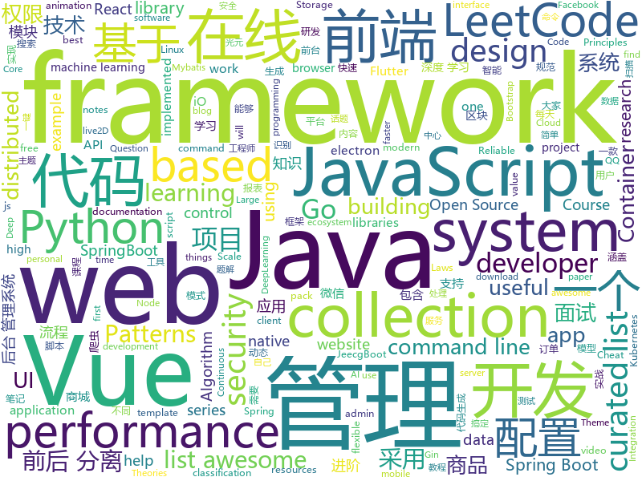

# 2019-05-22
See what the GitHub community is most excited about today.

## python
* [DeleteFB](https://github.com/weskerfoot/DeleteFB)(**1,053 stars today**): Selenium script to delete all of your Facebook wall posts
* [Python](https://github.com/TheAlgorithms/Python)(**676 stars today**): All Algorithms implemented in Python
* [pythia](https://github.com/facebookresearch/pythia)(**174 stars today**): A modular framework for Visual Question Answering research from Facebook AI Research (FAIR)
* [machine-learning-course](https://github.com/machinelearningmindset/machine-learning-course)(**143 stars today**): 💬Machine Learning Course with Python
* [uxy](https://github.com/sustrik/uxy)(**91 stars today**): 
* [models](https://github.com/tensorflow/models)(**64 stars today**): Models and examples built with TensorFlow
* [uds](https://github.com/stewartmcgown/uds)(**80 stars today**): Unlimited Drive Storage by splitting binary files into base64
* [CVE-2019-0708-PoC-Hitting-Path](https://github.com/digital-missiles/CVE-2019-0708-PoC-Hitting-Path)(**64 stars today**): It's only hitting vulnerable path in termdd.sys!!! NOT DOS
* [ChineseBQB](https://github.com/zhaoolee/ChineseBQB)(**69 stars today**): 🇨🇳Chinese sticker pack / 中国表情包大集合
* [examples-of-web-crawlers](https://github.com/shengqiangzhang/examples-of-web-crawlers)(**56 stars today**): python爬虫例子,对新手比较友好,主要爬取淘宝、天猫、微信、豆瓣、QQ等网站。
* [transfer-nlp](https://github.com/feedly/transfer-nlp)(**67 stars today**): NLP library designed for flexible research and development
* [system-design-primer](https://github.com/donnemartin/system-design-primer)(**60 stars today**): Learn how to design large-scale systems. Prep for the system design interview. Includes Anki flashcards.
* [awesome-python](https://github.com/vinta/awesome-python)(**59 stars today**): A curated list of awesome Python frameworks, libraries, software and resources
* [home-assistant](https://github.com/home-assistant/home-assistant)(**52 stars today**): 🏡Open source home automation that puts local control and privacy first
* [AiLearning](https://github.com/apachecn/AiLearning)(**48 stars today**): AiLearning: 机器学习 - MachineLearning - ML、深度学习 - DeepLearning - DL、自然语言处理 NLP
* [black](https://github.com/python/black)(**53 stars today**): The uncompromising Python code formatter
* [simpleui](https://github.com/newpanjing/simpleui)(**48 stars today**): 🚀simpleui是一个django admin theme 主题 。基于element-ui+vue开发的主题，重写和优化90%以上的页面。🍉如果喜欢记得给个🌟star哦
* [CheatSheetSeries](https://github.com/OWASP/CheatSheetSeries)(**46 stars today**): The OWASP Cheat Sheet Series was created to provide a concise collection of high value information on specific application security topics.
* [youtube-dl](https://github.com/ytdl-org/youtube-dl)(**42 stars today**): Command-line program to download videos from YouTube.com and other video sites
* [PySnooper](https://github.com/cool-RR/PySnooper)(**50 stars today**): Never use print for debugging again
* [keras](https://github.com/keras-team/keras)(**42 stars today**): Deep Learning for humans
* [face_recognition](https://github.com/ageitgey/face_recognition)(**42 stars today**): The world's simplest facial recognition api for Python and the command line
* [scikit-learn](https://github.com/scikit-learn/scikit-learn)(**41 stars today**): scikit-learn: machine learning in Python
* [flask](https://github.com/pallets/flask)(**41 stars today**): The Python micro framework for building web applications.
* [django](https://github.com/django/django)(**35 stars today**): The Web framework for perfectionists with deadlines.

## java
* [LeetCodeAnimation](https://github.com/MisterBooo/LeetCodeAnimation)(**568 stars today**): Demonstrate all the questions on LeetCode in the form of animation.（用动画的形式呈现解LeetCode题目的思路）
* [CS-Notes](https://github.com/CyC2018/CS-Notes)(**204 stars today**): 📚技术面试必备基础知识、Leetcode 题解、后端面试、Java 面试、春招、秋招、操作系统、计算机网络、系统设计
* [JavaGuide](https://github.com/Snailclimb/JavaGuide)(**178 stars today**): 【Java学习+面试指南】 一份涵盖大部分Java程序员所需要掌握的核心知识。
* [mall](https://github.com/macrozheng/mall)(**179 stars today**): mall项目是一套电商系统，包括前台商城系统及后台管理系统，基于SpringBoot+MyBatis实现。 前台商城系统包含首页门户、商品推荐、商品搜索、商品展示、购物车、订单流程、会员中心、客户服务、帮助中心等模块。 后台管理系统包含商品管理、订单管理、会员管理、促销管理、运营管理、内容管理、统计报表、财务管理、权限管理、设置等模块。
* [advanced-java](https://github.com/doocs/advanced-java)(**104 stars today**): 😮互联网 Java 工程师进阶知识完全扫盲：涵盖高并发、分布式、高可用、微服务等领域知识
* [Java](https://github.com/TheAlgorithms/Java)(**102 stars today**): All Algorithms implemented in Java
* [jeecg-boot](https://github.com/zhangdaiscott/jeecg-boot)(**60 stars today**): Jeecg-Boot 是一款基于代码生成器的智能开发平台！采用前后端分离架构：SpringBoot，Mybatis，Shiro，JWT，Vue&Ant Design。强大的代码生成器让前端和后台代码一键生成，不需要写任何代码，绝对是全栈开发福音！！ JeecgBoot的宗旨是提高UI能力的同时,降低前后分离的开发成本，JeecgBoot还独创在线开发模式，No代码概念，一系列在线智能开发：在线配置表单、在线配置报表、在线设计流程等等。
* [flutter_boost](https://github.com/alibaba/flutter_boost)(**65 stars today**): FlutterBoost is a Flutter plugin which enables hybrid integration of Flutter for your existing native apps with minimum efforts
* [spring-boot](https://github.com/spring-projects/spring-boot)(**51 stars today**): Spring Boot
* [spring-boot-examples](https://github.com/ityouknow/spring-boot-examples)(**58 stars today**): about learning Spring Boot via examples. Spring Boot 教程、技术栈示例代码，快速简单上手教程。
* [eladmin](https://github.com/elunez/eladmin)(**53 stars today**): 项目基于 Spring Boot 2.1.0 、 Jpa、 Spring Security、redis、Vue的前后端分离的后台管理系统，项目采用分模块开发方式， 权限控制采用 RBAC，支持数据字典与数据权限管理，支持一键生成前后端代码，支持动态路由
* [elasticsearch](https://github.com/elastic/elasticsearch)(**53 stars today**): Open Source, Distributed, RESTful Search Engine
* [tutorials](https://github.com/eugenp/tutorials)(**31 stars today**): The "REST With Spring" Course:
* [incubator-dubbo](https://github.com/apache/incubator-dubbo)(**47 stars today**): Apache Dubbo (incubating) is a high-performance, java based, open source RPC framework.
* [litemall](https://github.com/linlinjava/litemall)(**51 stars today**): 又一个小商城。litemall = Spring Boot后端 + Vue管理员前端 + 微信小程序用户前端 + Vue用户移动端
* [dev-ref](https://github.com/keikai/dev-ref)(**51 stars today**): 
* [android-wallet](https://github.com/sunpowerio/android-wallet)(**35 stars today**): 光元区块链安卓钱包
* [open_nsfw_android](https://github.com/devzwy/open_nsfw_android)(**46 stars today**): 色情图片离线识别，基于TensorFlow实现。识别只需200ms,可断网测试，成功率99%，调用只要一行代码，从雅虎的开源项目open_nsfw移植，tflite（6M）为训练好的模型，该模型文件可用于iOS、java、C++等平台
* [apollo](https://github.com/ctripcorp/apollo)(**40 stars today**): Apollo（阿波罗）是携程框架部门研发的分布式配置中心，能够集中化管理应用不同环境、不同集群的配置，配置修改后能够实时推送到应用端，并且具备规范的权限、流程治理等特性，适用于微服务配置管理场景。
* [guava](https://github.com/google/guava)(**38 stars today**): Google core libraries for Java
* [java-design-patterns](https://github.com/iluwatar/java-design-patterns)(**32 stars today**): Design patterns implemented in Java
* [easyexcel](https://github.com/alibaba/easyexcel)(**33 stars today**): 快速、简单避免OOM的java处理Excel工具
* [rhizobia_J](https://github.com/momosecurity/rhizobia_J)(**36 stars today**): JAVA安全SDK及编码规范
* [JCSprout](https://github.com/crossoverJie/JCSprout)(**32 stars today**): 👨‍🎓Java Core Sprout : basic, concurrent, algorithm
* [DoraemonKit](https://github.com/didi/DoraemonKit)(**34 stars today**): 简称 "DoKit" 。一款功能齐全的客户端（ iOS 、Android ）研发助手，你值得拥有。

## unknown
* [StanfordDoggoProject](https://github.com/Nate711/StanfordDoggoProject)(**438 stars today**): 
* [hacker-laws-zh](https://github.com/nusr/hacker-laws-zh)(**323 stars today**): 💻📖Laws, Theories, Principles and Patterns that developers will find useful. (对开发人员有用的定律、理论、原则和模式。)
* [hacker-laws](https://github.com/dwmkerr/hacker-laws)(**273 stars today**): 💻📖Laws, Theories, Principles and Patterns that developers will find useful.
* [Emergency-Response-Notes](https://github.com/Bypass007/Emergency-Response-Notes)(**255 stars today**): 应急响应实战笔记，一个安全工程师的自我修养。
* [the-art-of-command-line](https://github.com/jlevy/the-art-of-command-line)(**221 stars today**): Master the command line, in one page
* [The-Hackers-Hardware-Toolkit](https://github.com/yadox666/The-Hackers-Hardware-Toolkit)(**155 stars today**): The best hacker's gadgets for Red Team pentesters and security researchers.
* [developer-roadmap](https://github.com/kamranahmedse/developer-roadmap)(**87 stars today**): Roadmap to becoming a web developer in 2019
* [gitignore](https://github.com/github/gitignore)(**62 stars today**): A collection of useful .gitignore templates
* [awesome](https://github.com/sindresorhus/awesome)(**69 stars today**): 😎Awesome lists about all kinds of interesting topics
* [You-Dont-Know-JS](https://github.com/getify/You-Dont-Know-JS)(**65 stars today**): A book series on JavaScript. @YDKJS on twitter.
* [the-book-of-secret-knowledge](https://github.com/trimstray/the-book-of-secret-knowledge)(**68 stars today**): A collection of inspiring lists, manuals, cheatsheets, blogs, hacks, one-liners, cli/web tools and more.
* [PowerToys](https://github.com/microsoft/PowerToys)(**69 stars today**): Windows system utilities to maximize productivity
* [free-programming-books](https://github.com/EbookFoundation/free-programming-books)(**59 stars today**): 📚Freely available programming books
* [Awesome-Cellular-Hacking](https://github.com/W00t3k/Awesome-Cellular-Hacking)(**64 stars today**): Awesome-Cellular-Hacking
* [awesome-decision-tree-papers](https://github.com/benedekrozemberczki/awesome-decision-tree-papers)(**62 stars today**): A collection of research papers on decision, classification and regression trees with implementations.
* [Data-Science--Cheat-Sheet](https://github.com/abhat222/Data-Science--Cheat-Sheet)(**54 stars today**): Cheat Sheets
* [awesome-react-hooks](https://github.com/glauberfc/awesome-react-hooks)(**60 stars today**): A curated list about React Hooks
* [awesome-scalability](https://github.com/binhnguyennus/awesome-scalability)(**59 stars today**): The Patterns Behind Scalable, Reliable, and Performant Large-Scale Systems
* [Daily-Interview-Question](https://github.com/Advanced-Frontend/Daily-Interview-Question)(**56 stars today**): 我是木易杨，公众号「高级前端进阶」作者，每天搞定一道前端大厂面试题，祝大家天天进步，一年后会看到不一样的自己。
* [whitepaper](https://github.com/sunpowerio/whitepaper)(**34 stars today**): 光元区块链白皮书
* [security-token-docs](https://github.com/lrvick/security-token-docs)(**47 stars today**): Documentation of Security Tokens and their uses.
* [awesome-shell](https://github.com/alebcay/awesome-shell)(**44 stars today**): A curated list of awesome command-line frameworks, toolkits, guides and gizmos. Inspired by awesome-php.
* [AnchorFreeDetection](https://github.com/VCBE123/AnchorFreeDetection)(**44 stars today**): list the paper for recently anchor free detector
* [smi-spec](https://github.com/deislabs/smi-spec)(**42 stars today**): Service Mesh Interface
* [awesome-wasi](https://github.com/wasmerio/awesome-wasi)(**39 stars today**): 😎Curated list of awesome things regarding WebAssembly WASI ecosystem.

## javascript
* [WebGL-Fluid-Simulation](https://github.com/PavelDoGreat/WebGL-Fluid-Simulation)(**1,024 stars today**): Play with fluids in your browser (works even on mobile)
* [gitfolio](https://github.com/imfunniee/gitfolio)(**438 stars today**): personal website + blog for every github user
* [leetcode](https://github.com/azl397985856/leetcode)(**236 stars today**): LeetCode Solutions: A Record of My Problem Solving Journey.( leetcode题解，记录自己的leetcode解题之路。)
* [svelte](https://github.com/sveltejs/svelte)(**202 stars today**): Cybernetically enhanced web apps
* [ola](https://github.com/franciscop/ola)(**187 stars today**): 🌊Smooth animation library for interpolating numbers
* [vue](https://github.com/vuejs/vue)(**133 stars today**): 🖖Vue.js is a progressive, incrementally-adoptable JavaScript framework for building UI on the web.
* [Motrix](https://github.com/agalwood/Motrix)(**127 stars today**): A full-featured download manager.
* [tornis](https://github.com/robb0wen/tornis)(**113 stars today**): Tornis helps you watch and respond to changes in your browser's viewport🌲
* [react](https://github.com/facebook/react)(**96 stars today**): A declarative, efficient, and flexible JavaScript library for building user interfaces.
* [libpku](https://github.com/lib-pku/libpku)(**90 stars today**): 贵校课程资料民间整理
* [vhr](https://github.com/lenve/vhr)(**70 stars today**): 微人事是一个前后端分离的人力资源管理系统，项目采用SpringBoot+Vue开发。
* [javascript](https://github.com/airbnb/javascript)(**76 stars today**): JavaScript Style Guide
* [30-seconds-of-code](https://github.com/30-seconds/30-seconds-of-code)(**68 stars today**): A curated collection of useful JavaScript snippets that you can understand in 30 seconds or less.
* [react-native](https://github.com/facebook/react-native)(**65 stars today**): A framework for building native apps with React.
* [puppeteer](https://github.com/GoogleChrome/puppeteer)(**67 stars today**): Headless Chrome Node API
* [react-beautiful-dnd](https://github.com/atlassian/react-beautiful-dnd)(**68 stars today**): Beautiful and accessible drag and drop for lists with React
* [axios](https://github.com/axios/axios)(**64 stars today**): Promise based HTTP client for the browser and node.js
* [netron](https://github.com/lutzroeder/netron)(**62 stars today**): Visualizer for deep learning and machine learning models
* [baiduyun](https://github.com/syhyz1990/baiduyun)(**56 stars today**): 🖖油猴脚本 一个脚本搞定百度网盘下载
* [storefront-ui](https://github.com/DivanteLtd/storefront-ui)(**58 stars today**): Customization-first Vue.js UI framework for eCommerce.
* [bootstrap](https://github.com/twbs/bootstrap)(**29 stars today**): The most popular HTML, CSS, and JavaScript framework for developing responsive, mobile first projects on the web.
* [create-react-app](https://github.com/facebook/create-react-app)(**45 stars today**): Set up a modern web app by running one command.
* [material-ui](https://github.com/mui-org/material-ui)(**49 stars today**): React components for faster and easier web development. Build your own design system, or start with Material Design.
* [website](https://github.com/sunpowerio/website)(**35 stars today**): 光元区块链官方网站
* [three.js](https://github.com/mrdoob/three.js)(**41 stars today**): JavaScript 3D library.

## html
* [linux-command](https://github.com/jaywcjlove/linux-command)(**47 stars today**): Linux命令大全搜索工具，内容包含Linux命令手册、详解、学习、搜集。https://git.io/linux
* [awesome-modern-cpp](https://github.com/rigtorp/awesome-modern-cpp)(**43 stars today**): A collection of resources on modern C++
* [nndl.github.io](https://github.com/nndl/nndl.github.io)(**33 stars today**): 《神经网络与深度学习》 Neural Network and Deep Learning
* [flutter-in-action](https://github.com/flutterchina/flutter-in-action)(**27 stars today**): 《Flutter实战》电子书
* [AdminLTE](https://github.com/ColorlibHQ/AdminLTE)(**18 stars today**): AdminLTE - Free Premium Admin control Panel Theme Based On Bootstrap 3.x
* [GAPITA](https://github.com/ehsan-mohammadi/GAPITA)(**20 stars today**): An anonymous and random chat messaging for talking to strangers! (Using SignalR C# and TypeScript)
* [nginx-admins-handbook](https://github.com/trimstray/nginx-admins-handbook)(**19 stars today**): These notes describes how to improve NGINX performance, security and other important things; @ssllabs A+ 100%, @mozilla A+ 120/100.
* [technical_books](https://github.com/TIM168/technical_books)(**16 stars today**): IT技术书籍，不间断更新中
* [TrackRay](https://github.com/iSafeBlue/TrackRay)(**17 stars today**): 溯光 (TrackRay) 3 插件式渗透测试框架（资产扫描|指纹识别|暴力破解|网页爬虫|端口扫描|漏洞扫描|AWVS|NMAP|Metasploit）
* [Electron-elf](https://github.com/fguby/Electron-elf)(**16 stars today**): 使用electron和live2D开发的类似桌面精灵的应用（A desktop application developed using electron and live2D）
* [Spoon-Knife](https://github.com/octocat/Spoon-Knife)(****): This repo is for demonstration purposes only.
* [chromium_for_spider](https://github.com/myvyang/chromium_for_spider)(**15 stars today**): 为漏扫动态爬虫定制的浏览器
* [deeplearning_ai_books](https://github.com/fengdu78/deeplearning_ai_books)(**15 stars today**): deeplearning.ai（吴恩达老师的深度学习课程笔记及资源）
* [personal-website](https://github.com/github/personal-website)(**6 stars today**): Code that'll help you kickstart a personal website that showcases your work as a software developer.
* [nginxconfig.io](https://github.com/valentinxxx/nginxconfig.io)(**13 stars today**): ⚙️NGiИX config generator on steroids💉
* [workshops](https://github.com/ansible/workshops)(**9 stars today**): Training Course for Ansible Automation
* [en.javascript.info](https://github.com/javascript-tutorial/en.javascript.info)(**10 stars today**): Modern JavaScript Tutorial
* [django-ex](https://github.com/sclorg/django-ex)(****): Django Example
* [elasticsearch-definitive-guide](https://github.com/elasticsearch-cn/elasticsearch-definitive-guide)(**8 stars today**): 欢迎加QQ群：109764489，贡献力量！
* [Blog](https://github.com/YvetteLau/Blog)(**9 stars today**): 【前端进阶】优质博文
* [cs231n.github.io](https://github.com/cs231n/cs231n.github.io)(**9 stars today**): Public facing notes page
* [swagger-codegen](https://github.com/swagger-api/swagger-codegen)(**7 stars today**): swagger-codegen contains a template-driven engine to generate documentation, API clients and server stubs in different languages by parsing your OpenAPI / Swagger definition.
* [devopsdays-web](https://github.com/devopsdays/devopsdays-web)(**7 stars today**): This is the website for devopsdays
* [fastText](https://github.com/facebookresearch/fastText)(**8 stars today**): Library for fast text representation and classification.
* [electron-api-demos](https://github.com/electron/electron-api-demos)(**7 stars today**): Explore the Electron APIs

## go
* [reading-go](https://github.com/developer-learning/reading-go)(**221 stars today**): Go 夜读 > 每周通过 zoom 在线直播的方式分享 Go 相关的技术话题，每天大家在 微信/Slack 上及时沟通交流编程技术话题。
* [simple-computer](https://github.com/djhworld/simple-computer)(**128 stars today**): the scott CPU from "But How Do It Know?" by J. Clark Scott
* [trivy](https://github.com/knqyf263/trivy)(**90 stars today**): A Simple and Comprehensive Vulnerability Scanner for Containers, Suitable for CI
* [cloud-on-k8s](https://github.com/elastic/cloud-on-k8s)(**86 stars today**): Elastic Cloud on Kubernetes
* [kubernetes](https://github.com/kubernetes/kubernetes)(**70 stars today**): Production-Grade Container Scheduling and Management
* [sail](https://github.com/cdr/sail)(**72 stars today**): The universal standard for instant, pre-configured development environments.
* [go](https://github.com/golang/go)(**63 stars today**): The Go programming language
* [werf](https://github.com/flant/werf)(**63 stars today**): Werf (previously known as dapp) helps to implement and support Continuous Integration and Continuous Delivery
* [conftest](https://github.com/instrumenta/conftest)(**50 stars today**): Write tests against structured configuration data using the Rego query language
* [minigo](https://github.com/DQNEO/minigo)(**45 stars today**): a Go compiler from scratch. It can compile itself.
* [oya](https://github.com/tooploox/oya)(**43 stars today**): Using Oya packs containing reusable boilerplate & scripts, you can bootstrap easy to work with, deployable projects
* [istio](https://github.com/istio/istio)(**37 stars today**): Connect, secure, control, and observe services.
* [gin](https://github.com/gin-gonic/gin)(**36 stars today**): Gin is a HTTP web framework written in Go (Golang). It features a Martini-like API with much better performance -- up to 40 times faster. If you need smashing performance, get yourself some Gin.
* [moby](https://github.com/moby/moby)(**33 stars today**): Moby Project - a collaborative project for the container ecosystem to assemble container-based systems
* [kraken](https://github.com/uber/kraken)(**36 stars today**): P2P Docker registry capable of distributing TBs of data in seconds
* [gotree](https://github.com/8treenet/gotree)(**37 stars today**): Gotree is a vertically distributed framework. Gotree's goal is to easily develop distributed services and liberate the mental burden of developers.
* [prometheus](https://github.com/prometheus/prometheus)(**33 stars today**): The Prometheus monitoring system and time series database.
* [polaris](https://github.com/reactiveops/polaris)(**36 stars today**): Validation of best practices in your Kubernetes clusters
* [awesome-go](https://github.com/avelino/awesome-go)(**34 stars today**): A curated list of awesome Go frameworks, libraries and software
* [minio](https://github.com/minio/minio)(**32 stars today**): MinIO is a high performance object storage server compatible with Amazon S3 APIs
* [helm](https://github.com/helm/helm)(**27 stars today**): The Kubernetes Package Manager
* [etcd](https://github.com/etcd-io/etcd)(**31 stars today**): Distributed reliable key-value store for the most critical data of a distributed system
* [rio](https://github.com/rancher/rio)(**32 stars today**): Kubernetes based MicroPaaS
* [fzf](https://github.com/junegunn/fzf)(**30 stars today**): 🌸A command-line fuzzy finder
* [traefik](https://github.com/containous/traefik)(**29 stars today**): The Cloud Native Edge Router

## WordCloud

