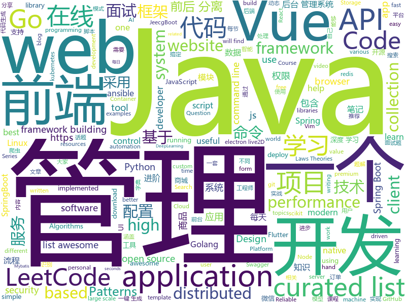

# 2019-05-23
See what the GitHub community is most excited about today.

## python
* [pythia](https://github.com/facebookresearch/pythia)(**617 stars today**): A modular framework for Visual Question Answering research from Facebook AI Research (FAIR)
* [Python](https://github.com/TheAlgorithms/Python)(**353 stars today**): All Algorithms implemented in Python
* [DeleteFB](https://github.com/weskerfoot/DeleteFB)(**340 stars today**): Selenium script to delete all of your Facebook wall posts
* [httpie](https://github.com/jakubroztocil/httpie)(**212 stars today**): As easy as httpie /aitch-tee-tee-pie/ 🥧 Modern command line HTTP client – user-friendly curl alternative with intuitive UI, JSON support, syntax highlighting, wget-like downloads, extensions, etc. https://twitter.com/clihttp
* [machine-learning-course](https://github.com/machinelearningmindset/machine-learning-course)(**110 stars today**): 💬Machine Learning Course with Python
* [fuzzDicts](https://github.com/TheKingOfDuck/fuzzDicts)(**106 stars today**): Web Pentesting Fuzz 字典,一个就够了。
* [models](https://github.com/tensorflow/models)(**87 stars today**): Models and examples built with TensorFlow
* [AiLearning](https://github.com/apachecn/AiLearning)(**74 stars today**): AiLearning: 机器学习 - MachineLearning - ML、深度学习 - DeepLearning - DL、自然语言处理 NLP
* [PySnooper](https://github.com/cool-RR/PySnooper)(**69 stars today**): Never use print for debugging again
* [system-design-primer](https://github.com/donnemartin/system-design-primer)(**63 stars today**): Learn how to design large-scale systems. Prep for the system design interview. Includes Anki flashcards.
* [examples-of-web-crawlers](https://github.com/shengqiangzhang/examples-of-web-crawlers)(**56 stars today**): python爬虫例子,对新手比较友好,主要爬取淘宝、天猫、微信、豆瓣、QQ等网站。
* [awesome-python](https://github.com/vinta/awesome-python)(**55 stars today**): A curated list of awesome Python frameworks, libraries, software and resources
* [black](https://github.com/python/black)(**58 stars today**): The uncompromising Python code formatter
* [CheatSheetSeries](https://github.com/OWASP/CheatSheetSeries)(**55 stars today**): The OWASP Cheat Sheet Series was created to provide a concise collection of high value information on specific application security topics.
* [youtube-dl](https://github.com/ytdl-org/youtube-dl)(**49 stars today**): Command-line program to download videos from YouTube.com and other video sites
* [uds](https://github.com/stewartmcgown/uds)(**52 stars today**): Unlimited Drive Storage by splitting binary files into base64
* [HelloGitHub](https://github.com/521xueweihan/HelloGitHub)(**49 stars today**): 一个分享 GitHub 上有趣、入门级的开源项目。让你找到编程的乐趣，欢迎推荐、自荐项目「每月28号更新」
* [face_recognition](https://github.com/ageitgey/face_recognition)(**43 stars today**): The world's simplest facial recognition api for Python and the command line
* [home-assistant](https://github.com/home-assistant/home-assistant)(**41 stars today**): 🏡Open source home automation that puts local control and privacy first
* [ChineseBQB](https://github.com/zhaoolee/ChineseBQB)(**43 stars today**): 🇨🇳Chinese sticker pack / 中国表情包大集合
* [scikit-learn](https://github.com/scikit-learn/scikit-learn)(**35 stars today**): scikit-learn: machine learning in Python
* [public-apis](https://github.com/toddmotto/public-apis)(**40 stars today**): A collective list of free APIs for use in software and web development.
* [ansible](https://github.com/ansible/ansible)(**33 stars today**): Ansible is a radically simple IT automation platform that makes your applications and systems easier to deploy. Avoid writing scripts or custom code to deploy and update your applications — automate in a language that approaches plain English, using SSH, with no agents to install on remote systems. https://docs.ansible.com/ansible/
* [ray](https://github.com/ray-project/ray)(**39 stars today**): A fast and simple framework for building and running distributed applications.
* [CVE-2019-0708](https://github.com/n1xbyte/CVE-2019-0708)(**36 stars today**): dump

## java
* [LeetCodeAnimation](https://github.com/MisterBooo/LeetCodeAnimation)(**332 stars today**): Demonstrate all the questions on LeetCode in the form of animation.（用动画的形式呈现解LeetCode题目的思路）
* [mall](https://github.com/macrozheng/mall)(**236 stars today**): mall项目是一套电商系统，包括前台商城系统及后台管理系统，基于SpringBoot+MyBatis实现。 前台商城系统包含首页门户、商品推荐、商品搜索、商品展示、购物车、订单流程、会员中心、客户服务、帮助中心等模块。 后台管理系统包含商品管理、订单管理、会员管理、促销管理、运营管理、内容管理、统计报表、财务管理、权限管理、设置等模块。
* [sia-task](https://github.com/siaorg/sia-task)(**208 stars today**): 微服务任务调度框架
* [CS-Notes](https://github.com/CyC2018/CS-Notes)(**195 stars today**): 📚技术面试必备基础知识、Leetcode 题解、后端面试、Java 面试、春招、秋招、操作系统、计算机网络、系统设计
* [JavaGuide](https://github.com/Snailclimb/JavaGuide)(**186 stars today**): 【Java学习+面试指南】 一份涵盖大部分Java程序员所需要掌握的核心知识。
* [litemall](https://github.com/linlinjava/litemall)(**107 stars today**): 又一个小商城。litemall = Spring Boot后端 + Vue管理员前端 + 微信小程序用户前端 + Vue用户移动端
* [advanced-java](https://github.com/doocs/advanced-java)(**91 stars today**): 😮互联网 Java 工程师进阶知识完全扫盲：涵盖高并发、分布式、高可用、微服务等领域知识
* [spring-boot-examples](https://github.com/ityouknow/spring-boot-examples)(**81 stars today**): about learning Spring Boot via examples. Spring Boot 教程、技术栈示例代码，快速简单上手教程。
* [spring-boot](https://github.com/spring-projects/spring-boot)(**51 stars today**): Spring Boot
* [incubator-dubbo](https://github.com/apache/incubator-dubbo)(**49 stars today**): Apache Dubbo (incubating) is a high-performance, java based, open source RPC framework.
* [tutorials](https://github.com/eugenp/tutorials)(**33 stars today**): The "REST With Spring" Course:
* [open_nsfw_android](https://github.com/devzwy/open_nsfw_android)(**55 stars today**): 色情图片离线识别，基于TensorFlow实现。识别只需200ms,可断网测试，成功率99%，调用只要一行代码，从雅虎的开源项目open_nsfw移植，tflite（6M）为训练好的模型，该模型文件可用于iOS、java、C++等平台
* [easyexcel](https://github.com/alibaba/easyexcel)(**53 stars today**): 快速、简单避免OOM的java处理Excel工具
* [teammate-android](https://github.com/tunjid/teammate-android)(**48 stars today**): A Team Management app for creating tournaments and games for various sports
* [elasticsearch](https://github.com/elastic/elasticsearch)(**35 stars today**): Open Source, Distributed, RESTful Search Engine
* [spring-framework](https://github.com/spring-projects/spring-framework)(**38 stars today**): Spring Framework
* [jeecg-boot](https://github.com/zhangdaiscott/jeecg-boot)(**38 stars today**): Jeecg-Boot 是一款基于代码生成器的智能开发平台！采用前后端分离架构：SpringBoot，Mybatis，Shiro，JWT，Vue&Ant Design。强大的代码生成器让前端和后台代码一键生成，不需要写任何代码，绝对是全栈开发福音！！ JeecgBoot的宗旨是提高UI能力的同时,降低前后分离的开发成本，JeecgBoot还独创在线开发模式，No代码概念，一系列在线智能开发：在线配置表单、在线配置报表、在线设计流程等等。
* [seata](https://github.com/seata/seata)(**38 stars today**): 🔥Seata is an easy-to-use, high-performance, java based, open source distributed transaction solution.
* [java-design-patterns](https://github.com/iluwatar/java-design-patterns)(**39 stars today**): Design patterns implemented in Java
* [pulsar](https://github.com/apache/pulsar)(**39 stars today**): Apache Pulsar - distributed pub-sub messaging system
* [flutter_boost](https://github.com/alibaba/flutter_boost)(**39 stars today**): FlutterBoost is a Flutter plugin which enables hybrid integration of Flutter for your existing native apps with minimum efforts
* [eladmin](https://github.com/elunez/eladmin)(**33 stars today**): 项目基于 Spring Boot 2.1.0 、 Jpa、 Spring Security、redis、Vue的前后端分离的后台管理系统，项目采用分模块开发方式， 权限控制采用 RBAC，支持数据字典与数据权限管理，支持一键生成前后端代码，支持动态路由
* [Java](https://github.com/TheAlgorithms/Java)(**35 stars today**): All Algorithms implemented in Java
* [apollo](https://github.com/ctripcorp/apollo)(**31 stars today**): Apollo（阿波罗）是携程框架部门研发的分布式配置中心，能够集中化管理应用不同环境、不同集群的配置，配置修改后能够实时推送到应用端，并且具备规范的权限、流程治理等特性，适用于微服务配置管理场景。
* [okhttp](https://github.com/square/okhttp)(**35 stars today**): An HTTP+HTTP/2 client for Android and Java applications.

## unknown
* [the-art-of-command-line](https://github.com/jlevy/the-art-of-command-line)(**783 stars today**): Master the command line, in one page
* [hacker-laws](https://github.com/dwmkerr/hacker-laws)(**261 stars today**): 💻📖Laws, Theories, Principles and Patterns that developers will find useful.
* [hacker-laws-zh](https://github.com/nusr/hacker-laws-zh)(**195 stars today**): 💻📖Laws, Theories, Principles and Patterns that developers will find useful. (对开发人员有用的定律、理论、原则和模式。)
* [Emergency-Response-Notes](https://github.com/Bypass007/Emergency-Response-Notes)(**155 stars today**): 应急响应实战笔记，一个安全工程师的自我修养。
* [RenZhengfei](https://github.com/HuijieL/RenZhengfei)(**111 stars today**): 任正非思想
* [The-Hackers-Hardware-Toolkit](https://github.com/yadox666/The-Hackers-Hardware-Toolkit)(**118 stars today**): The best hacker's gadgets for Red Team pentesters and security researchers.
* [developer-roadmap](https://github.com/kamranahmedse/developer-roadmap)(**99 stars today**): Roadmap to becoming a web developer in 2019
* [Awesome](https://github.com/Awesome-Windows/Awesome)(**91 stars today**): 💻An awesome & curated list of best applications and tools for Windows.
* [awesome](https://github.com/sindresorhus/awesome)(**80 stars today**): 😎Awesome lists about all kinds of interesting topics
* [awesome-wasi](https://github.com/wasmerio/awesome-wasi)(**81 stars today**): 😎Curated list of awesome things regarding WebAssembly WASI ecosystem.
* [awesome-react-hooks](https://github.com/glauberfc/awesome-react-hooks)(**72 stars today**): A curated list about React Hooks
* [gitignore](https://github.com/github/gitignore)(**53 stars today**): A collection of useful .gitignore templates
* [free-programming-books](https://github.com/EbookFoundation/free-programming-books)(**55 stars today**): 📚Freely available programming books
* [RollToolsApi](https://github.com/MZCretin/RollToolsApi)(**53 stars today**): 一个提供开发中常用数据的一个稳定聚合Api接口源，运行于独立服务器，免费，且长期维护，会持续添加新的接口！
* [awesome-vue](https://github.com/vuejs/awesome-vue)(**48 stars today**): 🎉A curated list of awesome things related to Vue.js
* [smi-spec](https://github.com/deislabs/smi-spec)(**49 stars today**): Service Mesh Interface
* [security-token-docs](https://github.com/lrvick/security-token-docs)(**42 stars today**): Documentation of Security Tokens and their uses.
* [the-book-of-secret-knowledge](https://github.com/trimstray/the-book-of-secret-knowledge)(**37 stars today**): A collection of inspiring lists, manuals, cheatsheets, blogs, hacks, one-liners, cli/web tools and more.
* [fe-interview](https://github.com/haizlin/fe-interview)(**39 stars today**): 前端面试每日 3+1，以面试题来驱动学习，提倡每日学习，每天进步一点！
* [awesome-annotation-processing](https://github.com/gunnarmorling/awesome-annotation-processing)(**37 stars today**): A curated list of resources related to the Java annotation processing API (JSR 269)
* [Data-Science--Cheat-Sheet](https://github.com/abhat222/Data-Science--Cheat-Sheet)(**34 stars today**): Cheat Sheets
* [architect-awesome](https://github.com/xingshaocheng/architect-awesome)(**35 stars today**): 后端架构师技术图谱
* [Daily-Interview-Question](https://github.com/Advanced-Frontend/Daily-Interview-Question)(**36 stars today**): 我是木易杨，公众号「高级前端进阶」作者，每天搞定一道前端大厂面试题，祝大家天天进步，一年后会看到不一样的自己。
* [Awesome-Cellular-Hacking](https://github.com/W00t3k/Awesome-Cellular-Hacking)(**29 stars today**): Awesome-Cellular-Hacking
* [awesome-scalability](https://github.com/binhnguyennus/awesome-scalability)(**29 stars today**): The Patterns Behind Scalable, Reliable, and Performant Large-Scale Systems

## javascript
* [WebGL-Fluid-Simulation](https://github.com/PavelDoGreat/WebGL-Fluid-Simulation)(**579 stars today**): Play with fluids in your browser (works even on mobile)
* [scar](https://github.com/cloudkj/scar)(**539 stars today**): Deploy static websites in seconds - with HTTPS, a global CDN, and custom domains.
* [sdk-js](https://github.com/TankerHQ/sdk-js)(**285 stars today**): Tanker client-side encryption SDK for JavaScript
* [Motrix](https://github.com/agalwood/Motrix)(**201 stars today**): A full-featured download manager.
* [leetcode](https://github.com/azl397985856/leetcode)(**197 stars today**): LeetCode Solutions: A Record of My Problem Solving Journey.( leetcode题解，记录自己的leetcode解题之路。)
* [gitfolio](https://github.com/imfunniee/gitfolio)(**188 stars today**): personal website + blog for every github user
* [svelte](https://github.com/sveltejs/svelte)(**157 stars today**): Cybernetically enhanced web apps
* [react](https://github.com/facebook/react)(**125 stars today**): A declarative, efficient, and flexible JavaScript library for building user interfaces.
* [NeteaseCloudMusicApi](https://github.com/Binaryify/NeteaseCloudMusicApi)(**130 stars today**): 网易云音乐 Node.js API service
* [dlv](https://github.com/developit/dlv)(**139 stars today**): Safe deep property access in 120 bytes. x = dlv(obj, 'a.b.x')
* [vue](https://github.com/vuejs/vue)(**109 stars today**): 🖖Vue.js is a progressive, incrementally-adoptable JavaScript framework for building UI on the web.
* [tornis](https://github.com/robb0wen/tornis)(**111 stars today**): Tornis helps you watch and respond to changes in your browser's viewport🌲
* [vhr](https://github.com/lenve/vhr)(**84 stars today**): 微人事是一个前后端分离的人力资源管理系统，项目采用SpringBoot+Vue开发。
* [awesome-mac](https://github.com/jaywcjlove/awesome-mac)(**78 stars today**):  Now we have become very big, Different from the original idea. Collect premium software in various categories.
* [axios](https://github.com/axios/axios)(**65 stars today**): Promise based HTTP client for the browser and node.js
* [libpku](https://github.com/lib-pku/libpku)(**56 stars today**): 贵校课程资料民间整理
* [ola](https://github.com/franciscop/ola)(**64 stars today**): 🌊Smooth animation library for interpolating numbers
* [three.js](https://github.com/mrdoob/three.js)(**52 stars today**): JavaScript 3D library.
* [uppy](https://github.com/transloadit/uppy)(**59 stars today**): The next open source file uploader for web browsers🐶
* [custom-forms](https://github.com/tailwindcss/custom-forms)(**60 stars today**): A better base for styling form elements with Tailwind CSS.
* [baiduyun](https://github.com/syhyz1990/baiduyun)(**59 stars today**): 🖖油猴脚本 一个脚本搞定百度网盘下载
* [create-react-app](https://github.com/facebook/create-react-app)(**51 stars today**): Set up a modern web app by running one command.
* [algorithm-visualizer](https://github.com/algorithm-visualizer/algorithm-visualizer)(**56 stars today**): 🎆Interactive Online Platform that Visualizes Algorithms from Code
* [uni-app](https://github.com/dcloudio/uni-app)(**57 stars today**): 使用 Vue.js 开发跨平台应用的前端框架
* [react-native](https://github.com/facebook/react-native)(**54 stars today**): A framework for building native apps with React.

## html
* [linux-command](https://github.com/jaywcjlove/linux-command)(**94 stars today**): Linux命令大全搜索工具，内容包含Linux命令手册、详解、学习、搜集。https://git.io/linux
* [flutter-in-action](https://github.com/flutterchina/flutter-in-action)(**38 stars today**): 《Flutter实战》电子书
* [deeplearning_ai_books](https://github.com/fengdu78/deeplearning_ai_books)(**29 stars today**): deeplearning.ai（吴恩达老师的深度学习课程笔记及资源）
* [nndl.github.io](https://github.com/nndl/nndl.github.io)(**23 stars today**): 《神经网络与深度学习》 Neural Network and Deep Learning
* [awesome-modern-cpp](https://github.com/rigtorp/awesome-modern-cpp)(**24 stars today**): A collection of resources on modern C++
* [chromium_for_spider](https://github.com/myvyang/chromium_for_spider)(**21 stars today**): 为漏扫动态爬虫定制的浏览器
* [learn-vim](https://github.com/yyq123/learn-vim)(**21 stars today**): 无废话极简版Vim学习笔记！文章按主题分拆为多个章节，并尽量控制每节的信息量；通过文字色彩和字体，将命令、快捷键突出显示；在每节结尾，提供一个命令列表，以便回顾文中介绍的重要命令。如果这些文章能对喜欢Vim的朋友有所益处，我将不胜荣幸。
* [personal-website](https://github.com/github/personal-website)(**13 stars today**): Code that'll help you kickstart a personal website that showcases your work as a software developer.
* [Spoon-Knife](https://github.com/octocat/Spoon-Knife)(****): This repo is for demonstration purposes only.
* [AdminLTE](https://github.com/ColorlibHQ/AdminLTE)(**14 stars today**): AdminLTE - Free Premium Admin control Panel Theme Based On Bootstrap 3.x
* [Electron-elf](https://github.com/fguby/Electron-elf)(**15 stars today**): 使用electron和live2D开发的类似桌面精灵的应用（A desktop application developed using electron and live2D）
* [aws-well-architected-labs](https://github.com/awslabs/aws-well-architected-labs)(**12 stars today**): Hands on labs and code to help you learn, measure, and build using architectural best practices.
* [30-seconds-of-angular](https://github.com/nycJSorg/30-seconds-of-angular)(**12 stars today**): Curated collection of Angular snippets everyone can understand in 30 seconds or less
* [en.javascript.info](https://github.com/javascript-tutorial/en.javascript.info)(**11 stars today**): Modern JavaScript Tutorial
* [fastText](https://github.com/facebookresearch/fastText)(**11 stars today**): Library for fast text representation and classification.
* [patchwork](https://github.com/jlord/patchwork)(****): All the Git-it Workshop completers!
* [nginxconfig.io](https://github.com/valentinxxx/nginxconfig.io)(**11 stars today**): ⚙️NGiИX config generator on steroids💉
* [now-github-starter](https://github.com/zeit/now-github-starter)(****): Starter project to demonstrate a project whose pull requests get automatically deployed
* [scikit-learn-doc-zh](https://github.com/apachecn/scikit-learn-doc-zh)(**10 stars today**): 📖[译] scikit-learn（sklearn） 中文文档
* [blog_os](https://github.com/phil-opp/blog_os)(**9 stars today**): Writing an OS in Rust
* [devopsdays-web](https://github.com/devopsdays/devopsdays-web)(**8 stars today**): This is the website for devopsdays
* [Blog](https://github.com/YvetteLau/Blog)(**9 stars today**): 【前端进阶】优质博文
* [technical_books](https://github.com/TIM168/technical_books)(**8 stars today**): IT技术书籍
* [sourcegraph](https://github.com/sourcegraph/sourcegraph)(**9 stars today**): Code search and navigation tool (self-hosted)
* [swagger-codegen](https://github.com/swagger-api/swagger-codegen)(**8 stars today**): swagger-codegen contains a template-driven engine to generate documentation, API clients and server stubs in different languages by parsing your OpenAPI / Swagger definition.

## go
* [simple-computer](https://github.com/djhworld/simple-computer)(**237 stars today**): the scott CPU from "But How Do It Know?" by J. Clark Scott
* [trivy](https://github.com/knqyf263/trivy)(**111 stars today**): A Simple and Comprehensive Vulnerability Scanner for Containers, Suitable for CI
* [rio](https://github.com/rancher/rio)(**101 stars today**): Kubernetes based MicroPaaS
* [sail](https://github.com/cdr/sail)(**102 stars today**): The universal standard for instant, pre-configured development environments.
* [reading-go](https://github.com/developer-learning/reading-go)(**85 stars today**): Go 夜读 > 每周通过 zoom 在线直播的方式分享 Go 相关的技术话题，每天大家在 微信/Slack 上及时沟通交流编程技术话题。
* [kubernetes](https://github.com/kubernetes/kubernetes)(**65 stars today**): Production-Grade Container Scheduling and Management
* [awesome-go](https://github.com/avelino/awesome-go)(**64 stars today**): A curated list of awesome Go frameworks, libraries and software
* [gopenpgp](https://github.com/ProtonMail/gopenpgp)(**56 stars today**): A high-level OpenPGP library
* [go](https://github.com/golang/go)(**54 stars today**): The Go programming language
* [gin](https://github.com/gin-gonic/gin)(**51 stars today**): Gin is a HTTP web framework written in Go (Golang). It features a Martini-like API with much better performance -- up to 40 times faster. If you need smashing performance, get yourself some Gin.
* [shell-operator](https://github.com/flant/shell-operator)(**47 stars today**): Shell-operator is a tool for running event-driven scripts in a Kubernetes cluster
* [tedis](https://github.com/eleme/tedis)(**43 stars today**): 基于TiKV的兼容Redis协议的强一致性NoSQL数据库
* [hugo](https://github.com/gohugoio/hugo)(**42 stars today**): The world’s fastest framework for building websites.
* [g](https://github.com/voidint/g)(**44 stars today**): Golang Version Manager
* [uint128](https://github.com/lukechampine/uint128)(**44 stars today**): uint128 for Go
* [build-web-application-with-golang](https://github.com/astaxie/build-web-application-with-golang)(**37 stars today**): A golang ebook intro how to build a web with golang
* [kubectl-dig](https://github.com/sysdiglabs/kubectl-dig)(**42 stars today**): Deep kubernetes visibility from the kubectl
* [cloud-on-k8s](https://github.com/elastic/cloud-on-k8s)(**36 stars today**): Elastic Cloud on Kubernetes
* [minio](https://github.com/minio/minio)(**33 stars today**): MinIO is a high performance object storage server compatible with Amazon S3 APIs
* [etcd](https://github.com/etcd-io/etcd)(**27 stars today**): Distributed reliable key-value store for the most critical data of a distributed system
* [minigo](https://github.com/DQNEO/minigo)(**31 stars today**): a Go compiler written from scratch by my hand. It can compile itself.
* [istio](https://github.com/istio/istio)(**28 stars today**): Connect, secure, control, and observe services.
* [prometheus](https://github.com/prometheus/prometheus)(**27 stars today**): The Prometheus monitoring system and time series database.
* [kratos](https://github.com/bilibili/kratos)(**28 stars today**): Kratos是bilibili开源的一套Go微服务框架，包含大量微服务相关框架及工具。
* [traefik](https://github.com/containous/traefik)(**27 stars today**): The Cloud Native Edge Router

## WordCloud

