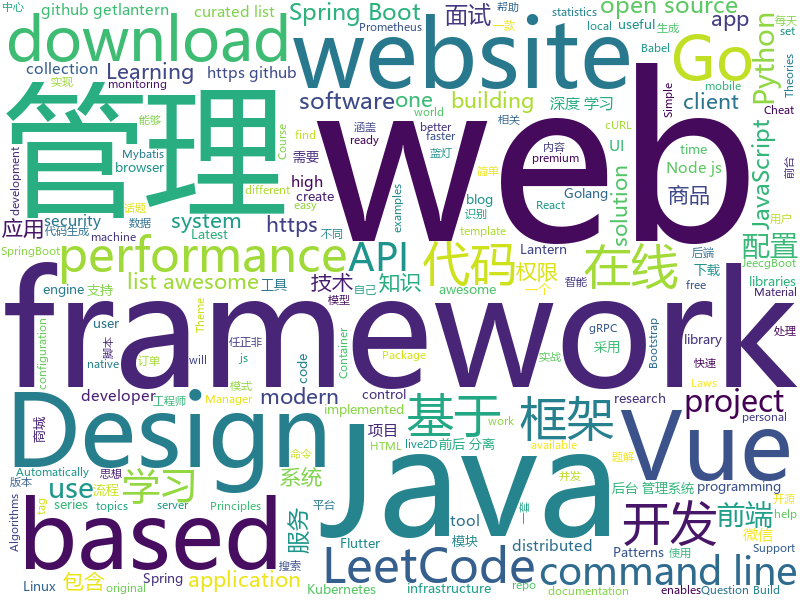

# 2019-05-24
See what the GitHub community is most excited about today.

## python
* [Python](https://github.com/TheAlgorithms/Python)(**337 stars today**): All Algorithms implemented in Python
* [pythia](https://github.com/facebookresearch/pythia)(**323 stars today**): A modular framework for Visual Question Answering research from Facebook AI Research (FAIR)
* [machine-learning-course](https://github.com/machinelearningmindset/machine-learning-course)(**79 stars today**): 💬Machine Learning Course with Python
* [DeleteFB](https://github.com/weskerfoot/DeleteFB)(**81 stars today**): Selenium script to delete all of your Facebook wall posts
* [models](https://github.com/tensorflow/models)(**58 stars today**): Models and examples built with TensorFlow
* [CheatSheetSeries](https://github.com/OWASP/CheatSheetSeries)(**73 stars today**): The OWASP Cheat Sheet Series was created to provide a concise collection of high value information on specific application security topics.
* [httpie](https://github.com/jakubroztocil/httpie)(**72 stars today**): As easy as httpie /aitch-tee-tee-pie/ 🥧 Modern command line HTTP client – user-friendly curl alternative with intuitive UI, JSON support, syntax highlighting, wget-like downloads, extensions, etc. https://twitter.com/clihttp
* [AiLearning](https://github.com/apachecn/AiLearning)(**63 stars today**): AiLearning: 机器学习 - MachineLearning - ML、深度学习 - DeepLearning - DL、自然语言处理 NLP
* [PySnooper](https://github.com/cool-RR/PySnooper)(**67 stars today**): Never use print for debugging again
* [automate-the-boring-stuff-projects](https://github.com/kudeh/automate-the-boring-stuff-projects)(**63 stars today**): My project solutions for automate the boring stuff with python
* [system-design-primer](https://github.com/donnemartin/system-design-primer)(**58 stars today**): Learn how to design large-scale systems. Prep for the system design interview. Includes Anki flashcards.
* [awesome-python](https://github.com/vinta/awesome-python)(**55 stars today**): A curated list of awesome Python frameworks, libraries, software and resources
* [cpython](https://github.com/python/cpython)(**53 stars today**): The Python programming language
* [examples-of-web-crawlers](https://github.com/shengqiangzhang/examples-of-web-crawlers)(**54 stars today**): python爬虫例子,对新手比较友好,主要爬取淘宝、天猫、微信、豆瓣、QQ等网站。
* [public-apis](https://github.com/toddmotto/public-apis)(**51 stars today**): A collective list of free APIs for use in software and web development.
* [home-assistant](https://github.com/home-assistant/home-assistant)(**41 stars today**): 🏡Open source home automation that puts local control and privacy first
* [face_recognition](https://github.com/ageitgey/face_recognition)(**38 stars today**): The world's simplest facial recognition api for Python and the command line
* [pyecharts](https://github.com/pyecharts/pyecharts)(**42 stars today**): 🎨Python Echarts Plotting Library
* [keras](https://github.com/keras-team/keras)(**35 stars today**): Deep Learning for humans
* [dstat](https://github.com/dagwieers/dstat)(**41 stars today**): Versatile resource statistics tool
* [colabtools](https://github.com/googlecolab/colabtools)(**42 stars today**): Python libraries for Google Colaboratory
* [faceswap](https://github.com/deepfakes/faceswap)(**36 stars today**): Non official project based on original /r/Deepfakes thread. Many thanks to him!
* [black](https://github.com/python/black)(**39 stars today**): The uncompromising Python code formatter
* [django](https://github.com/django/django)(**28 stars today**): The Web framework for perfectionists with deadlines.
* [kube-hunter](https://github.com/aquasecurity/kube-hunter)(**34 stars today**): Hunt for security weaknesses in Kubernetes clusters

## java
* [LeetCodeAnimation](https://github.com/MisterBooo/LeetCodeAnimation)(**334 stars today**): Demonstrate all the questions on LeetCode in the form of animation.（用动画的形式呈现解LeetCode题目的思路）
* [JavaGuide](https://github.com/Snailclimb/JavaGuide)(**178 stars today**): 【Java学习+面试指南】 一份涵盖大部分Java程序员所需要掌握的核心知识。
* [CS-Notes](https://github.com/CyC2018/CS-Notes)(**177 stars today**): 📚技术面试必备基础知识、Leetcode 题解、后端面试、Java 面试、春招、秋招、操作系统、计算机网络、系统设计
* [mall](https://github.com/macrozheng/mall)(**158 stars today**): mall项目是一套电商系统，包括前台商城系统及后台管理系统，基于SpringBoot+MyBatis实现。 前台商城系统包含首页门户、商品推荐、商品搜索、商品展示、购物车、订单流程、会员中心、客户服务、帮助中心等模块。 后台管理系统包含商品管理、订单管理、会员管理、促销管理、运营管理、内容管理、统计报表、财务管理、权限管理、设置等模块。
* [sia-task](https://github.com/siaorg/sia-task)(**127 stars today**): 微服务任务调度框架
* [advanced-java](https://github.com/doocs/advanced-java)(**67 stars today**): 😮互联网 Java 工程师进阶知识完全扫盲：涵盖高并发、分布式、高可用、微服务等领域知识
* [spring-boot-examples](https://github.com/ityouknow/spring-boot-examples)(**65 stars today**): about learning Spring Boot via examples. Spring Boot 教程、技术栈示例代码，快速简单上手教程。
* [litemall](https://github.com/linlinjava/litemall)(**65 stars today**): 又一个小商城。litemall = Spring Boot后端 + Vue管理员前端 + 微信小程序用户前端 + Vue用户移动端
* [tutorials](https://github.com/eugenp/tutorials)(**40 stars today**): The "REST With Spring" Course:
* [spring-boot](https://github.com/spring-projects/spring-boot)(**55 stars today**): Spring Boot
* [open_nsfw_android](https://github.com/devzwy/open_nsfw_android)(**57 stars today**): 色情图片离线识别，基于TensorFlow实现。识别只需200ms,可断网测试，成功率99%，调用只要一行代码，从雅虎的开源项目open_nsfw移植，tflite（6M）为训练好的模型，该模型文件可用于iOS、java、C++等平台
* [incubator-dubbo](https://github.com/apache/incubator-dubbo)(**48 stars today**): Apache Dubbo (incubating) is a high-performance, java based, open source RPC framework.
* [apollo](https://github.com/ctripcorp/apollo)(**48 stars today**): Apollo（阿波罗）是携程框架部门研发的分布式配置中心，能够集中化管理应用不同环境、不同集群的配置，配置修改后能够实时推送到应用端，并且具备规范的权限、流程治理等特性，适用于微服务配置管理场景。
* [elasticsearch](https://github.com/elastic/elasticsearch)(**42 stars today**): Open Source, Distributed, RESTful Search Engine
* [easyexcel](https://github.com/alibaba/easyexcel)(**42 stars today**): 快速、简单避免OOM的java处理Excel工具
* [snow-owl](https://github.com/b2ihealthcare/snow-owl)(**47 stars today**): 🦉Snow Owl - production ready, scalable terminology server (SNOMED CT, ATC, ICD-10, LOINC and others)
* [seata](https://github.com/seata/seata)(**40 stars today**): 🔥Seata is an easy-to-use, high-performance, java based, open source distributed transaction solution.
* [Java](https://github.com/TheAlgorithms/Java)(**40 stars today**): All Algorithms implemented in Java
* [arthas](https://github.com/alibaba/arthas)(**40 stars today**): Alibaba Java Diagnostic Tool Arthas/Alibaba Java诊断利器Arthas
* [jeecg-boot](https://github.com/zhangdaiscott/jeecg-boot)(**38 stars today**): Jeecg-Boot 是一款基于代码生成器的智能开发平台！采用前后端分离架构：SpringBoot，Mybatis，Shiro，JWT，Vue&Ant Design。强大的代码生成器让前端和后台代码一键生成，不需要写任何代码，绝对是全栈开发福音！！ JeecgBoot的宗旨是提高UI能力的同时,降低前后分离的开发成本，JeecgBoot还独创在线开发模式，No代码概念，一系列在线智能开发：在线配置表单、在线配置报表、在线设计流程等等。
* [spring-framework](https://github.com/spring-projects/spring-framework)(**31 stars today**): Spring Framework
* [skywalking](https://github.com/apache/skywalking)(**36 stars today**): APM, Application Performance Monitoring System
* [flutter_boost](https://github.com/alibaba/flutter_boost)(**35 stars today**): FlutterBoost is a Flutter plugin which enables hybrid integration of Flutter for your existing native apps with minimum efforts
* [eladmin](https://github.com/elunez/eladmin)(**28 stars today**): 项目基于 Spring Boot 2.1.0 、 Jpa、 Spring Security、redis、Vue的前后端分离的后台管理系统，项目采用分模块开发方式， 权限控制采用 RBAC，支持数据字典与数据权限管理，支持一键生成前后端代码，支持动态路由
* [java-design-patterns](https://github.com/iluwatar/java-design-patterns)(**30 stars today**): Design patterns implemented in Java

## unknown
* [the-art-of-command-line](https://github.com/jlevy/the-art-of-command-line)(**2,920 stars today**): Master the command line, in one page
* [RenZhengfei](https://github.com/benmahr/RenZhengfei)(**691 stars today**): 任正非思想
* [babel-handbook](https://github.com/jamiebuilds/babel-handbook)(**211 stars today**): 📘A guided handbook on how to use Babel and how to create plugins for Babel.
* [hacker-laws](https://github.com/dwmkerr/hacker-laws)(**202 stars today**): 💻📖Laws, Theories, Principles and Patterns that developers will find useful.
* [Data-Science--Cheat-Sheet](https://github.com/abhat222/Data-Science--Cheat-Sheet)(**114 stars today**): Cheat Sheets
* [hacker-laws-zh](https://github.com/nusr/hacker-laws-zh)(**126 stars today**): 💻📖Laws, Theories, Principles and Patterns that developers will find useful. (对开发人员有用的定律、理论、原则和模式。)
* [awesome](https://github.com/sindresorhus/awesome)(**101 stars today**): 😎Awesome lists about all kinds of interesting topics
* [Emergency-Response-Notes](https://github.com/Bypass007/Emergency-Response-Notes)(**94 stars today**): 应急响应实战笔记，一个安全工程师的自我修养。
* [developer-roadmap](https://github.com/kamranahmedse/developer-roadmap)(**83 stars today**): Roadmap to becoming a web developer in 2019
* [gitignore](https://github.com/github/gitignore)(**56 stars today**): A collection of useful .gitignore templates
* [free-programming-books](https://github.com/EbookFoundation/free-programming-books)(**53 stars today**): 📚Freely available programming books
* [The-Hackers-Hardware-Toolkit](https://github.com/yadox666/The-Hackers-Hardware-Toolkit)(**49 stars today**): The best hacker's gadgets for Red Team pentesters and security researchers.
* [DeepLearning-500-questions](https://github.com/scutan90/DeepLearning-500-questions)(**43 stars today**): 深度学习500问，以问答形式对常用的概率知识、线性代数、机器学习、深度学习、计算机视觉等热点问题进行阐述，以帮助自己及有需要的读者。 全书分为18个章节，50余万字。由于水平有限，书中不妥之处恳请广大读者批评指正。 未完待续............ 如有意合作，联系scutjy2015@163.com 版权所有，违权必究 Tan 2018.06
* [download](https://github.com/getlantern/download)(**47 stars today**): 🔴蓝灯最新版本下载 https://github.com/getlantern/download🔴Lantern Latest Download https://github.com/getlantern/lantern/releases/tag/latest🔴
* [RenZhengfei](https://github.com/HuijieL/RenZhengfei)(**44 stars today**): 任正非思想
* [awesome-vue](https://github.com/vuejs/awesome-vue)(**43 stars today**): 🎉A curated list of awesome things related to Vue.js
* [awesome-shell](https://github.com/alebcay/awesome-shell)(**42 stars today**): A curated list of awesome command-line frameworks, toolkits, guides and gizmos. Inspired by awesome-php.
* [the-book-of-secret-knowledge](https://github.com/trimstray/the-book-of-secret-knowledge)(**38 stars today**): A collection of inspiring lists, manuals, cheatsheets, blogs, hacks, one-liners, cli/web tools and more.
* [awesome-wechat-weapp](https://github.com/justjavac/awesome-wechat-weapp)(**37 stars today**): 微信小程序开发资源汇总💯
* [awesome-macos-command-line](https://github.com/herrbischoff/awesome-macos-command-line)(**36 stars today**): Use your macOS terminal shell to do awesome things.
* [architect-awesome](https://github.com/xingshaocheng/architect-awesome)(**32 stars today**): 后端架构师技术图谱
* [trackerslist](https://github.com/ngosang/trackerslist)(**30 stars today**): An updated list of public BitTorrent trackers
* [support.996.ICU](https://github.com/MSWorkers/support.996.ICU)(**31 stars today**): Microsoft and GitHub Workers Support 996.ICU
* [fe-interview](https://github.com/haizlin/fe-interview)(**29 stars today**): 前端面试每日 3+1，以面试题来驱动学习，提倡每日学习，每天进步一点！
* [awesome-nodejs](https://github.com/sindresorhus/awesome-nodejs)(**28 stars today**): ⚡️Delightful Node.js packages and resources

## javascript
* [scar](https://github.com/cloudkj/scar)(**445 stars today**): Deploy static websites in seconds - with HTTPS, a global CDN, and custom domains.
* [leetcode](https://github.com/azl397985856/leetcode)(**195 stars today**): LeetCode Solutions: A Record of My Problem Solving Journey.( leetcode题解，记录自己的leetcode解题之路。)
* [WebGL-Fluid-Simulation](https://github.com/PavelDoGreat/WebGL-Fluid-Simulation)(**205 stars today**): Play with fluids in your browser (works even on mobile)
* [gitfolio](https://github.com/imfunniee/gitfolio)(**192 stars today**): personal website + blog for every github user
* [dlv](https://github.com/developit/dlv)(**147 stars today**): Safe deep property access in 120 bytes. x = dlv(obj, 'a.b.x')
* [vue](https://github.com/vuejs/vue)(**125 stars today**): 🖖Vue.js is a progressive, incrementally-adoptable JavaScript framework for building UI on the web.
* [svelte](https://github.com/sveltejs/svelte)(**140 stars today**): Cybernetically enhanced web apps
* [sdk-js](https://github.com/TankerHQ/sdk-js)(**134 stars today**): Tanker client-side encryption SDK for JavaScript
* [engine](https://github.com/playcanvas/engine)(**127 stars today**): Fast and lightweight WebGL game engine
* [libpku](https://github.com/lib-pku/libpku)(**96 stars today**): 贵校课程资料民间整理
* [Motrix](https://github.com/agalwood/Motrix)(**87 stars today**): A full-featured download manager.
* [react](https://github.com/facebook/react)(**84 stars today**): A declarative, efficient, and flexible JavaScript library for building user interfaces.
* [material-ui](https://github.com/mui-org/material-ui)(**63 stars today**): React components for faster and easier web development. Build your own design system, or start with Material Design.
* [uni-app](https://github.com/dcloudio/uni-app)(**70 stars today**): 使用 Vue.js 开发跨平台应用的前端框架
* [react-native](https://github.com/facebook/react-native)(**61 stars today**): A framework for building native apps with React.
* [awesome-mac](https://github.com/jaywcjlove/awesome-mac)(**67 stars today**):  Now we have become very big, Different from the original idea. Collect premium software in various categories.
* [tornis](https://github.com/robb0wen/tornis)(**68 stars today**): Tornis helps you watch and respond to changes in your browser's viewport🌲
* [baiduyun](https://github.com/syhyz1990/baiduyun)(**62 stars today**): 🖖油猴脚本 一个脚本搞定百度网盘下载
* [axios](https://github.com/axios/axios)(**61 stars today**): Promise based HTTP client for the browser and node.js
* [ola](https://github.com/franciscop/ola)(**63 stars today**): 🌊Smooth animation library for interpolating numbers
* [NeteaseCloudMusicApi](https://github.com/Binaryify/NeteaseCloudMusicApi)(**57 stars today**): 网易云音乐 Node.js API service
* [three.js](https://github.com/mrdoob/three.js)(**53 stars today**): JavaScript 3D library.
* [create-react-app](https://github.com/facebook/create-react-app)(**49 stars today**): Set up a modern web app by running one command.
* [bootstrap](https://github.com/twbs/bootstrap)(**46 stars today**): The most popular HTML, CSS, and JavaScript framework for developing responsive, mobile first projects on the web.
* [node](https://github.com/nodejs/node)(**49 stars today**): Node.js JavaScript runtime✨🐢🚀✨

## html
* [linux-command](https://github.com/jaywcjlove/linux-command)(**49 stars today**): Linux命令大全搜索工具，内容包含Linux命令手册、详解、学习、搜集。https://git.io/linux
* [nndl.github.io](https://github.com/nndl/nndl.github.io)(**36 stars today**): 《神经网络与深度学习》 Neural Network and Deep Learning
* [Terminus2049.github.io](https://github.com/Terminus2049/Terminus2049.github.io)(**37 stars today**): No more 404
* [flutter-in-action](https://github.com/flutterchina/flutter-in-action)(**36 stars today**): 《Flutter实战》电子书
* [AdminLTE](https://github.com/ColorlibHQ/AdminLTE)(**18 stars today**): AdminLTE - Free Premium Admin control Panel Theme Based On Bootstrap 3.x
* [design-blocks](https://github.com/froala/design-blocks)(**21 stars today**): A set of 170+ Bootstrap based design blocks ready to be used to create clean modern websites.
* [awesome-modern-cpp](https://github.com/rigtorp/awesome-modern-cpp)(**16 stars today**): A collection of resources on modern C++
* [csinva.github.io](https://github.com/csinva/csinva.github.io)(**14 stars today**): Slides, notes, blog posts, and research on machine learning, statistics, and artificial intelligence.
* [instapipe](https://github.com/KrauseFx/instapipe)(**16 stars today**): Automatically cross-post your Instagram stories
* [personal-website](https://github.com/github/personal-website)(**8 stars today**): Code that'll help you kickstart a personal website that showcases your work as a software developer.
* [Electron-elf](https://github.com/fguby/Electron-elf)(**15 stars today**): 使用electron和live2D开发的类似桌面精灵的应用（A desktop application developed using electron and live2D）
* [portainer](https://github.com/portainer/portainer)(**13 stars today**): Simple management UI for Docker
* [fastText](https://github.com/facebookresearch/fastText)(**12 stars today**): Library for fast text representation and classification.
* [Spoon-Knife](https://github.com/octocat/Spoon-Knife)(****): This repo is for demonstration purposes only.
* [intro.js](https://github.com/usablica/intro.js)(**11 stars today**): A better way for new feature introduction and step-by-step users guide for your website and project.
* [ru.javascript.info](https://github.com/javascript-tutorial/ru.javascript.info)(**11 stars today**): Современный учебник JavaScript
* [en.javascript.info](https://github.com/javascript-tutorial/en.javascript.info)(**9 stars today**): Modern JavaScript Tutorial
* [website](https://github.com/kubernetes/website)(**5 stars today**): Kubernetes website and documentation repo:
* [all-contributors](https://github.com/all-contributors/all-contributors)(**9 stars today**): ✨Recognize all contributors, not just the ones who push code✨
* [zjcqoo.github.io](https://github.com/zjcqoo/zjcqoo.github.io)(**8 stars today**): jsproxy demo site
* [ecma262](https://github.com/tc39/ecma262)(**9 stars today**): Status, process, and documents for ECMA262
* [mkdocs-material](https://github.com/squidfunk/mkdocs-material)(**8 stars today**): A Material Design theme for MkDocs
* [now-github-starter](https://github.com/zeit/now-github-starter)(****): Starter project to demonstrate a project whose pull requests get automatically deployed
* [swagger-codegen](https://github.com/swagger-api/swagger-codegen)(**6 stars today**): swagger-codegen contains a template-driven engine to generate documentation, API clients and server stubs in different languages by parsing your OpenAPI / Swagger definition.
* [js-xss](https://github.com/leizongmin/js-xss)(**8 stars today**): Sanitize untrusted HTML (to prevent XSS) with a configuration specified by a Whitelist

## go
* [simple-computer](https://github.com/djhworld/simple-computer)(**221 stars today**): the scott CPU from "But How Do It Know?" by J. Clark Scott
* [kubernetes](https://github.com/kubernetes/kubernetes)(**72 stars today**): Production-Grade Container Scheduling and Management
* [go](https://github.com/golang/go)(**78 stars today**): The Go programming language
* [VictoriaMetrics](https://github.com/VictoriaMetrics/VictoriaMetrics)(**79 stars today**): VictoriaMetrics - high-performance and cost-effective time series database
* [terraform](https://github.com/hashicorp/terraform)(**57 stars today**): Terraform enables you to safely and predictably create, change, and improve infrastructure. It is an open source tool that codifies APIs into declarative configuration files that can be shared amongst team members, treated as code, edited, reviewed, and versioned.
* [awesome-go](https://github.com/avelino/awesome-go)(**52 stars today**): A curated list of awesome Go frameworks, libraries and software
* [zinx](https://github.com/aceld/zinx)(**49 stars today**): 基于Golang解决的长连接并发服务器框架
* [rio](https://github.com/rancher/rio)(**50 stars today**): Kubernetes based MicroPaaS
* [wide](https://github.com/b3log/wide)(**50 stars today**): 🌈一款基于 Web 的 Go 语言 IDE。https://hacpai.com/tag/wide
* [kind](https://github.com/kubernetes-sigs/kind)(**49 stars today**): Kubernetes IN Docker - local clusters for testing Kubernetes
* [gin](https://github.com/gin-gonic/gin)(**46 stars today**): Gin is a HTTP web framework written in Go (Golang). It features a Martini-like API with much better performance -- up to 40 times faster. If you need smashing performance, get yourself some Gin.
* [pulumi](https://github.com/pulumi/pulumi)(**46 stars today**): Define cloud apps and infrastructure in your favorite language and deploy to any cloud
* [build-web-application-with-golang](https://github.com/astaxie/build-web-application-with-golang)(**36 stars today**): A golang ebook intro how to build a web with golang
* [istio](https://github.com/istio/istio)(**34 stars today**): Connect, secure, control, and observe services.
* [fzf](https://github.com/junegunn/fzf)(**39 stars today**): 🌸A command-line fuzzy finder
* [prometheus](https://github.com/prometheus/prometheus)(**37 stars today**): The Prometheus monitoring system and time series database.
* [reading-go](https://github.com/developer-learning/reading-go)(**35 stars today**): Go 夜读 > 每周通过 zoom 在线直播的方式分享 Go 相关的技术话题，每天大家在 微信/Slack 上及时沟通交流编程技术话题。
* [trivy](https://github.com/knqyf263/trivy)(**35 stars today**): A Simple and Comprehensive Vulnerability Scanner for Containers, Suitable for CI
* [loki](https://github.com/grafana/loki)(**34 stars today**): Like Prometheus, but for logs.
* [hugo](https://github.com/gohugoio/hugo)(**31 stars today**): The world’s fastest framework for building websites.
* [kratos](https://github.com/bilibili/kratos)(**31 stars today**): Kratos是bilibili开源的一套Go微服务框架，包含大量微服务相关框架及工具。
* [grpcurl](https://github.com/fullstorydev/grpcurl)(**31 stars today**): Like cURL, but for gRPC: Command-line tool for interacting with gRPC servers
* [consul](https://github.com/hashicorp/consul)(**27 stars today**): Consul is a distributed, highly available, and data center aware solution to connect and configure applications across dynamic, distributed infrastructure.
* [helm](https://github.com/helm/helm)(**24 stars today**): The Kubernetes Package Manager
* [lantern](https://github.com/getlantern/lantern)(**28 stars today**): 🔴蓝灯最新版本下载 https://github.com/getlantern/download🔴Lantern Latest Download https://github.com/getlantern/download🔴

## WordCloud

