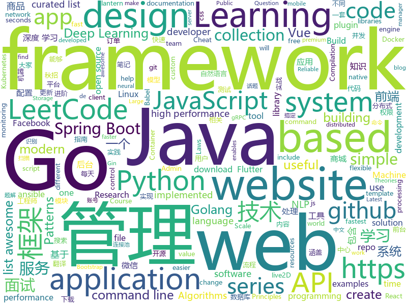

# 2019-05-25
See what the GitHub community is most excited about today.

## python
* [Python](https://github.com/TheAlgorithms/Python)(**273 stars today**): All Algorithms implemented in Python
* [pythia](https://github.com/facebookresearch/pythia)(**130 stars today**): A modular framework for Visual Question Answering research from Facebook AI Research (FAIR)
* [pysot](https://github.com/STVIR/pysot)(**113 stars today**): SenseTime Research platform for single object tracking, implementing algorithms like SiamRPN and SiamMask.
* [machine-learning-course](https://github.com/machinelearningmindset/machine-learning-course)(**100 stars today**): 💬Machine Learning Course with Python
* [models](https://github.com/tensorflow/models)(**58 stars today**): Models and examples built with TensorFlow
* [system-design-primer](https://github.com/donnemartin/system-design-primer)(**66 stars today**): Learn how to design large-scale systems. Prep for the system design interview. Includes Anki flashcards.
* [DeleteFB](https://github.com/weskerfoot/DeleteFB)(**71 stars today**): Selenium script to delete all of your Facebook wall posts
* [AiLearning](https://github.com/apachecn/AiLearning)(**56 stars today**): AiLearning: 机器学习 - MachineLearning - ML、深度学习 - DeepLearning - DL、自然语言处理 NLP
* [cpython](https://github.com/python/cpython)(**50 stars today**): The Python programming language
* [public-apis](https://github.com/toddmotto/public-apis)(**57 stars today**): A collective list of free APIs for use in software and web development.
* [awesome-python](https://github.com/vinta/awesome-python)(**53 stars today**): A curated list of awesome Python frameworks, libraries, software and resources
* [googler](https://github.com/jarun/googler)(**48 stars today**): 👀Google from the terminal
* [CheatSheetSeries](https://github.com/OWASP/CheatSheetSeries)(**46 stars today**): The OWASP Cheat Sheet Series was created to provide a concise collection of high value information on specific application security topics.
* [ansible](https://github.com/ansible/ansible)(**37 stars today**): Ansible is a radically simple IT automation platform that makes your applications and systems easier to deploy. Avoid writing scripts or custom code to deploy and update your applications — automate in a language that approaches plain English, using SSH, with no agents to install on remote systems. https://docs.ansible.com/ansible/
* [torchgpipe](https://github.com/KakaoBrain/torchgpipe)(**48 stars today**): A GPipe implementation in PyTorch
* [faceswap](https://github.com/deepfakes/faceswap)(**42 stars today**): Non official project based on original /r/Deepfakes thread. Many thanks to him!
* [videoflow](https://github.com/videoflow/videoflow)(**44 stars today**): Python framework that facilitates the quick development of complex video analysis applications and other series-processing based applications in a multiprocessing environment.
* [keras](https://github.com/keras-team/keras)(**38 stars today**): Deep Learning for humans
* [PySnooper](https://github.com/cool-RR/PySnooper)(**43 stars today**): Never use print for debugging again
* [black](https://github.com/python/black)(**39 stars today**): The uncompromising Python code formatter
* [face_recognition](https://github.com/ageitgey/face_recognition)(**36 stars today**): The world's simplest facial recognition api for Python and the command line
* [Algorithm_Interview_Notes-Chinese](https://github.com/imhuay/Algorithm_Interview_Notes-Chinese)(**37 stars today**): 2018/2019/校招/春招/秋招/算法/机器学习(Machine Learning)/深度学习(Deep Learning)/自然语言处理(NLP)/C/C++/Python/面试笔记
* [HRDevHelper](https://github.com/patois/HRDevHelper)(**37 stars today**): HexRays decompiler plugin that visualizes the ctree of decompiled functions.
* [NLP-progress](https://github.com/sebastianruder/NLP-progress)(**35 stars today**): Repository to track the progress in Natural Language Processing (NLP), including the datasets and the current state-of-the-art for the most common NLP tasks.
* [uds](https://github.com/stewartmcgown/uds)(**36 stars today**): Unlimited Drive Storage by splitting binary files into base64

## java
* [LeetCodeAnimation](https://github.com/MisterBooo/LeetCodeAnimation)(**328 stars today**): Demonstrate all the questions on LeetCode in the form of animation.（用动画的形式呈现解LeetCode题目的思路）
* [JavaGuide](https://github.com/Snailclimb/JavaGuide)(**193 stars today**): 【Java学习+面试指南】 一份涵盖大部分Java程序员所需要掌握的核心知识。
* [CS-Notes](https://github.com/CyC2018/CS-Notes)(**156 stars today**): 📚技术面试必备基础知识、Leetcode 题解、后端面试、Java 面试、春招、秋招、操作系统、计算机网络、系统设计
* [mall](https://github.com/macrozheng/mall)(**115 stars today**): mall项目是一套电商系统，包括前台商城系统及后台管理系统，基于SpringBoot+MyBatis实现。 前台商城系统包含首页门户、商品推荐、商品搜索、商品展示、购物车、订单流程、会员中心、客户服务、帮助中心等模块。 后台管理系统包含商品管理、订单管理、会员管理、促销管理、运营管理、内容管理、统计报表、财务管理、权限管理、设置等模块。
* [sia-task](https://github.com/siaorg/sia-task)(**79 stars today**): 微服务任务调度框架
* [advanced-java](https://github.com/doocs/advanced-java)(**74 stars today**): 😮互联网 Java 工程师进阶知识完全扫盲：涵盖高并发、分布式、高可用、微服务等领域知识
* [open_nsfw_android](https://github.com/devzwy/open_nsfw_android)(**55 stars today**): 色情图片离线识别，基于TensorFlow实现。识别只需200ms,可断网测试，成功率99%，调用只要一行代码，从雅虎的开源项目open_nsfw移植，tflite（6M）为训练好的模型，该模型文件可用于iOS、java、C++等平台
* [spring-boot-examples](https://github.com/ityouknow/spring-boot-examples)(**47 stars today**): about learning Spring Boot via examples. Spring Boot 教程、技术栈示例代码，快速简单上手教程。
* [spring-boot](https://github.com/spring-projects/spring-boot)(**44 stars today**): Spring Boot
* [easyexcel](https://github.com/alibaba/easyexcel)(**42 stars today**): 快速、简单避免OOM的java处理Excel工具
* [tutorials](https://github.com/eugenp/tutorials)(**25 stars today**): The "REST With Spring" Course:
* [java-design-patterns](https://github.com/iluwatar/java-design-patterns)(**42 stars today**): Design patterns implemented in Java
* [MaterialFiles](https://github.com/zhanghai/MaterialFiles)(**46 stars today**): Material Design file manager for Android
* [Java](https://github.com/TheAlgorithms/Java)(**34 stars today**): All Algorithms implemented in Java
* [litemall](https://github.com/linlinjava/litemall)(**34 stars today**): 又一个小商城。litemall = Spring Boot后端 + Vue管理员前端 + 微信小程序用户前端 + Vue用户移动端
* [dubbo](https://github.com/apache/dubbo)(**33 stars today**): Apache Dubbo is a high-performance, java based, open source RPC framework.
* [bundletool](https://github.com/google/bundletool)(**38 stars today**): Bundletool is a command-line tool to manipulate Android App Bundles
* [spring-framework](https://github.com/spring-projects/spring-framework)(**30 stars today**): Spring Framework
* [springboot-learning-example](https://github.com/JeffLi1993/springboot-learning-example)(**34 stars today**): spring boot 实践学习案例，是 spring boot 初学者及核心技术巩固的最佳实践。
* [flutter_boost](https://github.com/alibaba/flutter_boost)(**35 stars today**): FlutterBoost is a Flutter plugin which enables hybrid integration of Flutter for your existing native apps with minimum efforts
* [apollo](https://github.com/ctripcorp/apollo)(**31 stars today**): Apollo（阿波罗）是携程框架部门研发的分布式配置中心，能够集中化管理应用不同环境、不同集群的配置，配置修改后能够实时推送到应用端，并且具备规范的权限、流程治理等特性，适用于微服务配置管理场景。
* [seata](https://github.com/seata/seata)(**30 stars today**): 🔥Seata is an easy-to-use, high-performance, java based, open source distributed transaction solution.
* [druid](https://github.com/alibaba/druid)(**33 stars today**): 阿里巴巴数据库事业部出品，为监控而生的数据库连接池。阿里云Data Lake Analytics(https://www.aliyun.com/product/datalakeanalytics )、DRDS、TDDL 连接池powered by Druid
* [skywalking](https://github.com/apache/skywalking)(**29 stars today**): APM, Application Performance Monitoring System
* [jadx](https://github.com/skylot/jadx)(**29 stars today**): Dex to Java decompiler

## unknown
* [the-art-of-command-line](https://github.com/jlevy/the-art-of-command-line)(**1,109 stars today**): Master the command line, in one page
* [hacker-laws](https://github.com/dwmkerr/hacker-laws)(**127 stars today**): 💻📖Laws, Theories, Principles and Patterns that developers will find useful.
* [polarbearrepo](https://github.com/SandboxEscaper/polarbearrepo)(**101 stars today**): 
* [Data-Science--Cheat-Sheet](https://github.com/abhat222/Data-Science--Cheat-Sheet)(**85 stars today**): Cheat Sheets
* [awesome-wechat-weapp](https://github.com/justjavac/awesome-wechat-weapp)(**89 stars today**): 微信小程序开发资源汇总💯
* [babel-handbook](https://github.com/jamiebuilds/babel-handbook)(**81 stars today**): 📘A guided handbook on how to use Babel and how to create plugins for Babel.
* [awesome](https://github.com/sindresorhus/awesome)(**75 stars today**): 😎Awesome lists about all kinds of interesting topics
* [gitignore](https://github.com/github/gitignore)(**56 stars today**): A collection of useful .gitignore templates
* [hacker-laws-zh](https://github.com/nusr/hacker-laws-zh)(**64 stars today**): 💻📖Laws, Theories, Principles and Patterns that developers will find useful. (对开发人员有用的定律、理论、原则和模式。)
* [developer-roadmap](https://github.com/kamranahmedse/developer-roadmap)(**55 stars today**): Roadmap to becoming a web developer in 2019
* [awesome-scalability](https://github.com/binhnguyennus/awesome-scalability)(**50 stars today**): The Patterns Behind Scalable, Reliable, and Performant Large-Scale Systems
* [fs-pacer](https://github.com/eloraiby/fs-pacer)(**54 stars today**): 
* [You-Dont-Know-JS](https://github.com/getify/You-Dont-Know-JS)(**47 stars today**): A book series on JavaScript. @YDKJS on twitter.
* [free-programming-books](https://github.com/EbookFoundation/free-programming-books)(**47 stars today**): 📚Freely available programming books
* [deep-learning-drizzle](https://github.com/kmario23/deep-learning-drizzle)(**42 stars today**): Drench yourself in Deep Learning, Reinforcement Learning, Machine Learning, Computer Vision, and NLP by learning from these exciting lectures!!
* [Emergency-Response-Notes](https://github.com/Bypass007/Emergency-Response-Notes)(**42 stars today**): 应急响应实战笔记，一个安全工程师的自我修养。
* [architect-awesome](https://github.com/xingshaocheng/architect-awesome)(**37 stars today**): 后端架构师技术图谱
* [CreawsomeMod](https://github.com/trouch/CreawsomeMod)(**40 stars today**): Modification for Ultimaker Cura
* [Free-SS-SSR](https://github.com/dxxzst/Free-SS-SSR)(**39 stars today**): 免费的SS账号、SSR账号，定期更新。优先更新：
* [Must-read-papers-and-continuous-tracking-on-Graph-Neural-Network-GNN-progress](https://github.com/jdlc105/Must-read-papers-and-continuous-tracking-on-Graph-Neural-Network-GNN-progress)(**37 stars today**): Papers on Graph neural network(GNN)
* [download](https://github.com/getlantern/download)(**34 stars today**): 🔴蓝灯最新版本下载 https://github.com/getlantern/download🔴Lantern Latest Download https://github.com/getlantern/lantern/releases/tag/latest🔴
* [gold-miner](https://github.com/xitu/gold-miner)(**34 stars today**): 🥇掘金翻译计划，可能是世界最大最好的英译中技术社区，最懂读者和译者的翻译平台：
* [awesome-shell](https://github.com/alebcay/awesome-shell)(**34 stars today**): A curated list of awesome command-line frameworks, toolkits, guides and gizmos. Inspired by awesome-php.
* [Daily-Interview-Question](https://github.com/Advanced-Frontend/Daily-Interview-Question)(**33 stars today**): 我是木易杨，公众号「高级前端进阶」作者，每天搞定一道前端大厂面试题，祝大家天天进步，一年后会看到不一样的自己。
* [awesome-vue](https://github.com/vuejs/awesome-vue)(**30 stars today**): 🎉A curated list of awesome things related to Vue.js

## javascript
* [gitfolio](https://github.com/imfunniee/gitfolio)(**264 stars today**): personal website + blog for every github user
* [dsa.js](https://github.com/amejiarosario/dsa.js)(**235 stars today**): Data Structures and Algorithms explained and implemented in JavaScript
* [scar](https://github.com/cloudkj/scar)(**224 stars today**): Deploy static websites in seconds - with HTTPS, a global CDN, and custom domains.
* [Motrix](https://github.com/agalwood/Motrix)(**174 stars today**): A full-featured download manager.
* [leetcode](https://github.com/azl397985856/leetcode)(**150 stars today**): LeetCode Solutions: A Record of My Problem Solving Journey.( leetcode题解，记录自己的leetcode解题之路。)
* [vue](https://github.com/vuejs/vue)(**141 stars today**): 🖖Vue.js is a progressive, incrementally-adoptable JavaScript framework for building UI on the web.
* [js-cloudimage-360-view](https://github.com/scaleflex/js-cloudimage-360-view)(**140 stars today**): Engage your customers with a stunning 360 view of your products
* [svelte](https://github.com/sveltejs/svelte)(**136 stars today**): Cybernetically enhanced web apps
* [WebGL-Fluid-Simulation](https://github.com/PavelDoGreat/WebGL-Fluid-Simulation)(**109 stars today**): Play with fluids in your browser (works even on mobile)
* [react](https://github.com/facebook/react)(**98 stars today**): A declarative, efficient, and flexible JavaScript library for building user interfaces.
* [pixi.js](https://github.com/pixijs/pixi.js)(**99 stars today**): The HTML5 Creation Engine: Create beautiful digital content with the fastest, most flexible 2D WebGL renderer.
* [material-ui](https://github.com/mui-org/material-ui)(**83 stars today**): React components for faster and easier web development. Build your own design system, or start with Material Design.
* [hanKuoYu-Filter](https://github.com/maxchou415/hanKuoYu-Filter)(**81 stars today**): The Chrome Extension to hide any post which is include "HanKuoYu" on Facebook.
* [tornis](https://github.com/robb0wen/tornis)(**80 stars today**): Tornis helps you watch and respond to changes in your browser's viewport🌲
* [sdk-js](https://github.com/TankerHQ/sdk-js)(**71 stars today**): Tanker client-side encryption SDK for JavaScript
* [three.js](https://github.com/mrdoob/three.js)(**54 stars today**): JavaScript 3D library.
* [bootstrap](https://github.com/twbs/bootstrap)(**41 stars today**): The most popular HTML, CSS, and JavaScript framework for developing responsive, mobile first projects on the web.
* [react-native](https://github.com/facebook/react-native)(**54 stars today**): A framework for building native apps with React.
* [awesome-mac](https://github.com/jaywcjlove/awesome-mac)(**53 stars today**):  Now we have become very big, Different from the original idea. Collect premium software in various categories.
* [libpku](https://github.com/lib-pku/libpku)(**48 stars today**): 贵校课程资料民间整理
* [node](https://github.com/nodejs/node)(**47 stars today**): Node.js JavaScript runtime✨🐢🚀✨
* [baiduyun](https://github.com/syhyz1990/baiduyun)(**52 stars today**): 🖖油猴脚本 一个脚本搞定百度网盘下载
* [gatsby](https://github.com/gatsbyjs/gatsby)(**44 stars today**): Build blazing fast, modern apps and websites with React
* [create-react-app](https://github.com/facebook/create-react-app)(**41 stars today**): Set up a modern web app by running one command.
* [30-seconds-of-code](https://github.com/30-seconds/30-seconds-of-code)(**45 stars today**): A curated collection of useful JavaScript snippets that you can understand in 30 seconds or less.

## html
* [water.css](https://github.com/kognise/water.css)(**134 stars today**): A just-add-css collection of styles to make simple websites just a little nicer
* [Terminus2049.github.io](https://github.com/Terminus2049/Terminus2049.github.io)(**39 stars today**): No more 404
* [design-blocks](https://github.com/froala/design-blocks)(**33 stars today**): A set of 170+ Bootstrap based design blocks ready to be used to create clean modern websites.
* [linux-command](https://github.com/jaywcjlove/linux-command)(**31 stars today**): Linux命令大全搜索工具，内容包含Linux命令手册、详解、学习、搜集。https://git.io/linux
* [nndl.github.io](https://github.com/nndl/nndl.github.io)(**26 stars today**): 《神经网络与深度学习》 Neural Network and Deep Learning
* [flutter-in-action](https://github.com/flutterchina/flutter-in-action)(**26 stars today**): 《Flutter实战》电子书
* [AdminLTE](https://github.com/ColorlibHQ/AdminLTE)(**16 stars today**): AdminLTE - Free Premium Admin control Panel Theme Based On Bootstrap 3.x
* [hyperblog](https://github.com/freddier/hyperblog)(**10 stars today**): Un blog increíble para el curso de Git y Github de Platzi
* [Spoon-Knife](https://github.com/octocat/Spoon-Knife)(****): This repo is for demonstration purposes only.
* [fastText](https://github.com/facebookresearch/fastText)(**12 stars today**): Library for fast text representation and classification.
* [personal-website](https://github.com/github/personal-website)(**10 stars today**): Code that'll help you kickstart a personal website that showcases your work as a software developer.
* [kubernetes-failure-stories](https://github.com/hjacobs/kubernetes-failure-stories)(**14 stars today**): Compilation of public failure/horror stories related to Kubernetes
* [awesome-modern-cpp](https://github.com/rigtorp/awesome-modern-cpp)(**13 stars today**): A collection of resources on modern C++
* [website](https://github.com/kubernetes/website)(**7 stars today**): Kubernetes website and documentation repo:
* [learning-area](https://github.com/mdn/learning-area)(**7 stars today**): Github repo for the MDN Learning Area.
* [portainer](https://github.com/portainer/portainer)(**11 stars today**): Simple management UI for Docker
* [Electron-elf](https://github.com/fguby/Electron-elf)(**10 stars today**): 使用electron和live2D开发的类似桌面精灵的应用（A desktop application developed using electron and live2D）
* [sa-admin](https://github.com/shengzhang666/sa-admin)(**10 stars today**): 一个基于iframe的多窗口后台模板，演示地址：http://sa-admin.dev33.cn
* [0.30000000000000004](https://github.com/erikwiffin/0.30000000000000004)(**9 stars today**): Floating Point Math Examples
* [all-contributors](https://github.com/all-contributors/all-contributors)(**9 stars today**): ✨Recognize all contributors, not just the ones who push code✨
* [TrackRay](https://github.com/iSafeBlue/TrackRay)(**9 stars today**): 溯光 (TrackRay) 3 插件式渗透测试框架（资产扫描|指纹识别|暴力破解|网页爬虫|端口扫描|漏洞扫描|AWVS|NMAP|Metasploit）
* [cs231n.github.io](https://github.com/cs231n/cs231n.github.io)(**7 stars today**): Public facing notes page
* [swagger-codegen](https://github.com/swagger-api/swagger-codegen)(**7 stars today**): swagger-codegen contains a template-driven engine to generate documentation, API clients and server stubs in different languages by parsing your OpenAPI / Swagger definition.
* [zjcqoo.github.io](https://github.com/zjcqoo/zjcqoo.github.io)(**6 stars today**): jsproxy demo site
* [elasticsearch-definitive-guide](https://github.com/elasticsearch-cn/elasticsearch-definitive-guide)(**9 stars today**): 欢迎加QQ群：109764489，贡献力量！

## go
* [Gaea](https://github.com/XiaoMi/Gaea)(**359 stars today**): Gaea is a mysql proxy, it's developed by xiaomi b2c-systech team.
* [simple-computer](https://github.com/djhworld/simple-computer)(**115 stars today**): the scott CPU from "But How Do It Know?" by J. Clark Scott
* [kubernetes](https://github.com/kubernetes/kubernetes)(**71 stars today**): Production-Grade Container Scheduling and Management
* [rio](https://github.com/rancher/rio)(**67 stars today**): Kubernetes based MicroPaaS
* [VictoriaMetrics](https://github.com/VictoriaMetrics/VictoriaMetrics)(**64 stars today**): VictoriaMetrics - high-performance and cost-effective time series database
* [grpcurl](https://github.com/fullstorydev/grpcurl)(**63 stars today**): Like cURL, but for gRPC: Command-line tool for interacting with gRPC servers
* [gos](https://github.com/storyicon/gos)(**58 stars today**): Gos: Armed Golang💪( solutions for go module, goproxy, cross compilation, etc.)
* [go](https://github.com/golang/go)(**51 stars today**): The Go programming language
* [awesome-go](https://github.com/avelino/awesome-go)(**52 stars today**): A curated list of awesome Go frameworks, libraries and software
* [trivy](https://github.com/knqyf263/trivy)(**43 stars today**): A Simple and Comprehensive Vulnerability Scanner for Containers, Suitable for CI
* [hugo](https://github.com/gohugoio/hugo)(**42 stars today**): The world’s fastest framework for building websites.
* [zinx](https://github.com/aceld/zinx)(**43 stars today**): 基于Golang解决的长连接并发服务器框架
* [reading-go](https://github.com/developer-learning/reading-go)(**42 stars today**): Go 夜读 > 每周通过 zoom 在线直播的方式分享 Go 相关的技术话题，每天大家在 微信/Slack 上及时沟通交流编程技术话题。
* [go-i18n](https://github.com/nicksnyder/go-i18n)(**42 stars today**): Translate your Go program into multiple languages.
* [gin](https://github.com/gin-gonic/gin)(**41 stars today**): Gin is a HTTP web framework written in Go (Golang). It features a Martini-like API with much better performance -- up to 40 times faster. If you need smashing performance, get yourself some Gin.
* [kind](https://github.com/kubernetes-sigs/kind)(**35 stars today**): Kubernetes IN Docker - local clusters for testing Kubernetes
* [limiter](https://github.com/ulule/limiter)(**35 stars today**): Dead simple rate limit middleware for Go.
* [terraform](https://github.com/hashicorp/terraform)(**33 stars today**): Terraform enables you to safely and predictably create, change, and improve infrastructure. It is an open source tool that codifies APIs into declarative configuration files that can be shared amongst team members, treated as code, edited, reviewed, and versioned.
* [the-way-to-go_ZH_CN](https://github.com/Unknwon/the-way-to-go_ZH_CN)(**32 stars today**): 《The Way to Go》中文译本，中文正式名《Go 入门指南》
* [build-web-application-with-golang](https://github.com/astaxie/build-web-application-with-golang)(**30 stars today**): A golang ebook intro how to build a web with golang
* [etcd](https://github.com/etcd-io/etcd)(**29 stars today**): Distributed reliable key-value store for the most critical data of a distributed system
* [istio](https://github.com/istio/istio)(**27 stars today**): Connect, secure, control, and observe services.
* [prometheus](https://github.com/prometheus/prometheus)(**26 stars today**): The Prometheus monitoring system and time series database.
* [kratos](https://github.com/bilibili/kratos)(**27 stars today**): Kratos是bilibili开源的一套Go微服务框架，包含大量微服务相关框架及工具。
* [minio](https://github.com/minio/minio)(**27 stars today**): MinIO is a high performance object storage server compatible with Amazon S3 APIs

## WordCloud

