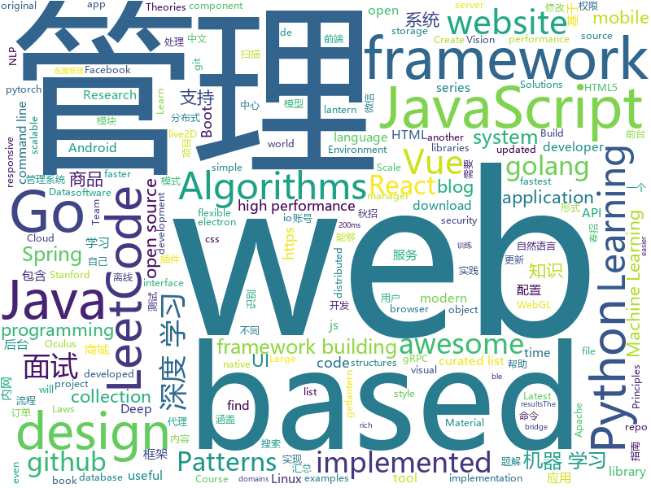

# 2019-05-26
See what the GitHub community is most excited about today.

## python
* [videoflow](https://github.com/videoflow/videoflow)(**367 stars today**): Python framework that facilitates the quick development of complex video analysis applications and other series-processing based applications in a multiprocessing environment.
* [Python](https://github.com/TheAlgorithms/Python)(**223 stars today**): All Algorithms implemented in Python
* [pysot](https://github.com/STVIR/pysot)(**100 stars today**): SenseTime Research platform for single object tracking, implementing algorithms like SiamRPN and SiamMask.
* [Machine-Learning](https://github.com/shunliz/Machine-Learning)(**99 stars today**): 机器学习原理
* [maildown](https://github.com/chris104957/maildown)(**102 stars today**): A super simple CLI for sending emails
* [machine-learning-course](https://github.com/machinelearningmindset/machine-learning-course)(**69 stars today**): 💬Machine Learning Course with Python
* [pythia](https://github.com/facebookresearch/pythia)(**65 stars today**): A modular framework for vision & language multimodal research from Facebook AI Research (FAIR)
* [system-design-primer](https://github.com/donnemartin/system-design-primer)(**56 stars today**): Learn how to design large-scale systems. Prep for the system design interview. Includes Anki flashcards.
* [Vision_UI](https://github.com/asvcode/Vision_UI)(**52 stars today**): UI visual interface for fastai
* [minimalRL](https://github.com/seungeunrho/minimalRL)(**50 stars today**): Implementations of basic RL algorithms with minimal lines of codes! (pytorch based)
* [torchgpipe](https://github.com/KakaoBrain/torchgpipe)(**44 stars today**): A GPipe implementation in PyTorch
* [AiLearning](https://github.com/apachecn/AiLearning)(**37 stars today**): AiLearning: 机器学习 - MachineLearning - ML、深度学习 - DeepLearning - DL、自然语言处理 NLP
* [models](https://github.com/tensorflow/models)(**34 stars today**): Models and examples built with TensorFlow
* [awesome-python](https://github.com/vinta/awesome-python)(**35 stars today**): A curated list of awesome Python frameworks, libraries, software and resources
* [keras](https://github.com/keras-team/keras)(**30 stars today**): Deep Learning for humans
* [PytorchInsight](https://github.com/implus/PytorchInsight)(**36 stars today**): a pytorch lib with state-of-the-art architectures, pretrained models and real-time updated results
* [cpython](https://github.com/python/cpython)(**27 stars today**): The Python programming language
* [iptv-m3u-maker](https://github.com/EvilCult/iptv-m3u-maker)(**31 stars today**): IPTV 国内电视台直播源 收集&汇总
* [LeakLooker](https://github.com/woj-ciech/LeakLooker)(**28 stars today**): Find open databases with Shodan
* [face_recognition](https://github.com/ageitgey/face_recognition)(**25 stars today**): The world's simplest facial recognition api for Python and the command line
* [faceswap](https://github.com/deepfakes/faceswap)(**24 stars today**): Non official project based on original /r/Deepfakes thread. Many thanks to him!
* [Algorithm_Interview_Notes-Chinese](https://github.com/imhuay/Algorithm_Interview_Notes-Chinese)(**25 stars today**): 2018/2019/校招/春招/秋招/算法/机器学习(Machine Learning)/深度学习(Deep Learning)/自然语言处理(NLP)/C/C++/Python/面试笔记
* [flask](https://github.com/pallets/flask)(**26 stars today**): The Python micro framework for building web applications.
* [scikit-learn](https://github.com/scikit-learn/scikit-learn)(**26 stars today**): scikit-learn: machine learning in Python
* [DeleteFB](https://github.com/weskerfoot/DeleteFB)(**27 stars today**): Selenium script to delete all of your Facebook wall posts

## java
* [LeetCodeAnimation](https://github.com/MisterBooo/LeetCodeAnimation)(**167 stars today**): Demonstrate all the questions on LeetCode in the form of animation.（用动画的形式呈现解LeetCode题目的思路）
* [JavaGuide](https://github.com/Snailclimb/JavaGuide)(**97 stars today**): 【Java学习+面试指南】 一份涵盖大部分Java程序员所需要掌握的核心知识。
* [CS-Notes](https://github.com/CyC2018/CS-Notes)(**89 stars today**): 📚技术面试必备基础知识、Leetcode 题解、后端面试、Java 面试、春招、秋招、操作系统、计算机网络、系统设计
* [mall](https://github.com/macrozheng/mall)(**50 stars today**): mall项目是一套电商系统，包括前台商城系统及后台管理系统，基于SpringBoot+MyBatis实现。 前台商城系统包含首页门户、商品推荐、商品搜索、商品展示、购物车、订单流程、会员中心、客户服务、帮助中心等模块。 后台管理系统包含商品管理、订单管理、会员管理、促销管理、运营管理、内容管理、统计报表、财务管理、权限管理、设置等模块。
* [advanced-java](https://github.com/doocs/advanced-java)(**39 stars today**): 😮互联网 Java 工程师进阶知识完全扫盲：涵盖高并发、分布式、高可用、微服务等领域知识
* [uranus](https://github.com/resotto/uranus)(**42 stars today**): Memo & Task web-app
* [spring-boot](https://github.com/spring-projects/spring-boot)(**25 stars today**): Spring Boot
* [sia-task](https://github.com/siaorg/sia-task)(**33 stars today**): 微服务任务调度框架
* [Java](https://github.com/TheAlgorithms/Java)(**30 stars today**): All Algorithms implemented in Java
* [tutorials](https://github.com/eugenp/tutorials)(**17 stars today**): The "REST With Spring" Course:
* [spring-framework](https://github.com/spring-projects/spring-framework)(**22 stars today**): Spring Framework
* [elasticsearch](https://github.com/elastic/elasticsearch)(**23 stars today**): Open Source, Distributed, RESTful Search Engine
* [ghidra](https://github.com/NationalSecurityAgency/ghidra)(**19 stars today**): Ghidra is a software reverse engineering (SRE) framework
* [gdbghidra](https://github.com/Comsecuris/gdbghidra)(**21 stars today**): gdbghidra - a visual bridge between a GDB session and GHIDRA
* [open_nsfw_android](https://github.com/devzwy/open_nsfw_android)(**19 stars today**): 色情图片离线识别，基于TensorFlow实现。识别只需200ms,可断网测试，成功率99%，调用只要一行代码，从雅虎的开源项目open_nsfw移植，tflite（6M）为训练好的模型，该模型文件可用于iOS、java、C++等平台
* [MaterialFiles](https://github.com/zhanghai/MaterialFiles)(**20 stars today**): Material Design file manager for Android
* [litemall](https://github.com/linlinjava/litemall)(**15 stars today**): 又一个小商城。litemall = Spring Boot后端 + Vue管理员前端 + 微信小程序用户前端 + Vue用户移动端
* [dubbo](https://github.com/apache/dubbo)(**15 stars today**): Apache Dubbo is a high-performance, java based, open source RPC framework.
* [java-design-patterns](https://github.com/iluwatar/java-design-patterns)(**15 stars today**): Design patterns implemented in Java
* [springboot-learning-example](https://github.com/JeffLi1993/springboot-learning-example)(**16 stars today**): spring boot 实践学习案例，是 spring boot 初学者及核心技术巩固的最佳实践。
* [apollo](https://github.com/ctripcorp/apollo)(**14 stars today**): Apollo（阿波罗）是携程框架部门研发的分布式配置中心，能够集中化管理应用不同环境、不同集群的配置，配置修改后能够实时推送到应用端，并且具备规范的权限、流程治理等特性，适用于微服务配置管理场景。
* [72crm-java](https://github.com/72crm/72crm-java)(**16 stars today**): The JAVA version for "72CRM"
* [pulsar](https://github.com/apache/pulsar)(**15 stars today**): Apache Pulsar - distributed pub-sub messaging system
* [mybatis-3](https://github.com/mybatis/mybatis-3)(**12 stars today**): MyBatis SQL mapper framework for Java
* [QMUI_Android](https://github.com/Tencent/QMUI_Android)(**14 stars today**): 提高 Android UI 开发效率的 UI 库

## unknown
* [the-art-of-command-line](https://github.com/jlevy/the-art-of-command-line)(**537 stars today**): Master the command line, in one page
* [stanford-cs-221-artificial-intelligence](https://github.com/afshinea/stanford-cs-221-artificial-intelligence)(**176 stars today**): VIP cheatsheets for Stanford's CS 221 Artificial Intelligence
* [awesome-scalability](https://github.com/binhnguyennus/awesome-scalability)(**166 stars today**): The Patterns Behind Scalable, Reliable, and Performant Large-Scale Systems
* [hacker-laws](https://github.com/dwmkerr/hacker-laws)(**170 stars today**): 💻📖Laws, Theories, Principles and Patterns that developers will find useful.
* [fs-pacer](https://github.com/eloraiby/fs-pacer)(**68 stars today**): 
* [Data-Science--Cheat-Sheet](https://github.com/abhat222/Data-Science--Cheat-Sheet)(**54 stars today**): Cheat Sheets
* [hacker-laws-zh](https://github.com/nusr/hacker-laws-zh)(**57 stars today**): 💻📖Laws, Theories, Principles and Patterns that developers will find useful. (对开发人员有用的定律、理论、原则和模式。)
* [developer-roadmap](https://github.com/kamranahmedse/developer-roadmap)(**52 stars today**): Roadmap to becoming a web developer in 2019
* [awesome](https://github.com/sindresorhus/awesome)(**47 stars today**): 😎Awesome lists about all kinds of interesting topics
* [free-programming-books](https://github.com/EbookFoundation/free-programming-books)(**45 stars today**): 📚Freely available programming books
* [awesome-wechat-weapp](https://github.com/justjavac/awesome-wechat-weapp)(**46 stars today**): 微信小程序开发资源汇总💯
* [gitignore](https://github.com/github/gitignore)(**30 stars today**): A collection of useful .gitignore templates
* [You-Dont-Know-JS](https://github.com/getify/You-Dont-Know-JS)(**43 stars today**): A book series on JavaScript. @YDKJS on twitter.
* [trackerslist](https://github.com/ngosang/trackerslist)(**38 stars today**): An updated list of public BitTorrent trackers
* [Free-SS-SSR](https://github.com/dxxzst/Free-SS-SSR)(**32 stars today**): 免费的SS账号、SSR账号，定期更新。优先更新：
* [polarbearrepo](https://github.com/SandboxEscaper/polarbearrepo)(**28 stars today**): 
* [StanfordDoggoProject](https://github.com/Nate711/StanfordDoggoProject)(**28 stars today**): Stanford Doggo is an open source quadruped robot that jumps, flips, and trots!
* [awesome-vue](https://github.com/vuejs/awesome-vue)(**24 stars today**): 🎉A curated list of awesome things related to Vue.js
* [fancyss_history_package](https://github.com/hq450/fancyss_history_package)(**22 stars today**): 科学上网插件的离线安装包储存在这里
* [RenZhengfei](https://github.com/HuijieL/RenZhengfei)(**20 stars today**): 任正非思想
* [download](https://github.com/getlantern/download)(**21 stars today**): 🔴蓝灯最新版本下载 https://github.com/getlantern/download🔴Lantern Latest Download https://github.com/getlantern/lantern/releases/tag/latest🔴
* [awesome-security-hardening](https://github.com/decalage2/awesome-security-hardening)(**23 stars today**): A collection of awesome security hardening guides, tools and other resources
* [The-Hackers-Hardware-Toolkit](https://github.com/yadox666/The-Hackers-Hardware-Toolkit)(**21 stars today**): The best hacker's gadgets for Red Team pentesters and security researchers.
* [deep-learning-drizzle](https://github.com/kmario23/deep-learning-drizzle)(**16 stars today**): Drench yourself in Deep Learning, Reinforcement Learning, Machine Learning, Computer Vision, and NLP by learning from these exciting lectures!!
* [DeepLearning-500-questions](https://github.com/scutan90/DeepLearning-500-questions)(**19 stars today**): 深度学习500问，以问答形式对常用的概率知识、线性代数、机器学习、深度学习、计算机视觉等热点问题进行阐述，以帮助自己及有需要的读者。 全书分为18个章节，50余万字。由于水平有限，书中不妥之处恳请广大读者批评指正。 未完待续............ 如有意合作，联系scutjy2015@163.com 版权所有，违权必究 Tan 2018.06

## javascript
* [tiptap](https://github.com/scrumpy/tiptap)(**356 stars today**): A rich-text editor for Vue.js
* [svelte](https://github.com/sveltejs/svelte)(**215 stars today**): Cybernetically enhanced web apps
* [gitfolio](https://github.com/imfunniee/gitfolio)(**141 stars today**): personal website + blog for every github user
* [pixi.js](https://github.com/pixijs/pixi.js)(**122 stars today**): The HTML5 Creation Engine: Create beautiful digital content with the fastest, most flexible 2D WebGL renderer.
* [scar](https://github.com/cloudkj/scar)(**121 stars today**): Deploy static websites in seconds - with HTTPS, a global CDN, and custom domains.
* [Motrix](https://github.com/agalwood/Motrix)(**112 stars today**): A full-featured download manager.
* [leetcode](https://github.com/azl397985856/leetcode)(**89 stars today**): LeetCode Solutions: A Record of My Problem Solving Journey.( leetcode题解，记录自己的leetcode解题之路。)
* [react](https://github.com/facebook/react)(**80 stars today**): A declarative, efficient, and flexible JavaScript library for building user interfaces.
* [dsa.js](https://github.com/amejiarosario/dsa.js)(**90 stars today**): Data Structures and Algorithms explained and implemented in JavaScript
* [vue](https://github.com/vuejs/vue)(**72 stars today**): 🖖Vue.js is a progressive, incrementally-adoptable JavaScript framework for building UI on the web.
* [tornis](https://github.com/robb0wen/tornis)(**61 stars today**): Tornis helps you watch and respond to changes in your browser's viewport🌲
* [material-ui](https://github.com/mui-org/material-ui)(**51 stars today**): React components for faster and easier web development. Build your own design system, or start with Material Design.
* [WebGL-Fluid-Simulation](https://github.com/PavelDoGreat/WebGL-Fluid-Simulation)(**49 stars today**): Play with fluids in your browser (works even on mobile)
* [jlua](https://github.com/hsiaosiyuan0/jlua)(**48 stars today**): Yet another Lua implementation in pure JavaScript.
* [react-vertex](https://github.com/sghall/react-vertex)(**43 stars today**): ◾️React Vertex | Hooks-based WebGL library for React
* [js-cloudimage-360-view](https://github.com/scaleflex/js-cloudimage-360-view)(**40 stars today**): Engage your customers with a stunning 360 view of your products
* [await-timeout](https://github.com/vitalets/await-timeout)(**40 stars today**): A Promise-based API for setTimeout / clearTimeout
* [bootstrap](https://github.com/twbs/bootstrap)(**31 stars today**): The most popular HTML, CSS, and JavaScript framework for developing responsive, mobile first projects on the web.
* [reveal.js](https://github.com/hakimel/reveal.js)(**30 stars today**): The HTML Presentation Framework
* [react-native](https://github.com/facebook/react-native)(**33 stars today**): A framework for building native apps with React.
* [libpku](https://github.com/lib-pku/libpku)(**30 stars today**): 贵校课程资料民间整理
* [next.js](https://github.com/zeit/next.js)(**32 stars today**): The React Framework
* [javascript](https://github.com/airbnb/javascript)(**29 stars today**): JavaScript Style Guide
* [node](https://github.com/nodejs/node)(**24 stars today**): Node.js JavaScript runtime✨🐢🚀✨
* [javascript-algorithms](https://github.com/trekhleb/javascript-algorithms)(**26 stars today**): 📝Algorithms and data structures implemented in JavaScript with explanations and links to further readings

## html
* [water.css](https://github.com/kognise/water.css)(**40 stars today**): A just-add-css collection of styles to make simple websites just a little nicer
* [WebFundamentals](https://github.com/google/WebFundamentals)(**29 stars today**): Best practices for modern web development
* [linux-command](https://github.com/jaywcjlove/linux-command)(**21 stars today**): Linux命令大全搜索工具，内容包含Linux命令手册、详解、学习、搜集。https://git.io/linux
* [nndl.github.io](https://github.com/nndl/nndl.github.io)(**15 stars today**): 《神经网络与深度学习》 Neural Network and Deep Learning
* [sa-admin](https://github.com/shengzhang666/sa-admin)(**15 stars today**): 一个基于iframe的多窗口后台模板，演示地址：http://sa-admin.dev33.cn
* [awesome-modern-cpp](https://github.com/rigtorp/awesome-modern-cpp)(**14 stars today**): A collection of resources on modern C++
* [SideQuest](https://github.com/the-expanse/SideQuest)(**13 stars today**): A open app store for mobile android based VR devices such as the Oculus Go, Oculus Quest or even the Moverio BT 300 ( IKR? )
* [Terminus2049.github.io](https://github.com/Terminus2049/Terminus2049.github.io)(**10 stars today**): No more 404
* [hyperblog](https://github.com/freddier/hyperblog)(**7 stars today**): Un blog increíble para el curso de Git y Github de Platzi
* [terrahub](https://github.com/TerraHubCorp/terrahub)(**11 stars today**): Terraform Automation and Orchestration Tool (Open Source)
* [Iosevka](https://github.com/be5invis/Iosevka)(**11 stars today**): Slender typeface for code, from code.
* [design-blocks](https://github.com/froala/design-blocks)(**10 stars today**): A set of 170+ Bootstrap based design blocks ready to be used to create clean modern websites.
* [qiubaiying.github.io](https://github.com/qiubaiying/qiubaiying.github.io)(**5 stars today**): BY Blog ->
* [Spoon-Knife](https://github.com/octocat/Spoon-Knife)(****): This repo is for demonstration purposes only.
* [TrackRay](https://github.com/iSafeBlue/TrackRay)(**9 stars today**): 溯光 (TrackRay) 3 插件式渗透测试框架（资产扫描|指纹识别|暴力破解|网页爬虫|端口扫描|漏洞扫描|AWVS|NMAP|Metasploit）
* [0.30000000000000004](https://github.com/erikwiffin/0.30000000000000004)(**8 stars today**): Floating Point Math Examples
* [en.javascript.info](https://github.com/javascript-tutorial/en.javascript.info)(**7 stars today**): Modern JavaScript Tutorial
* [Electron-elf](https://github.com/fguby/Electron-elf)(**7 stars today**): 使用electron和live2D开发的类似桌面精灵的应用（A desktop application developed using electron and live2D）
* [devops-essentials-sample-app](https://github.com/linuxacademy/devops-essentials-sample-app)(****): 
* [thinkspace](https://github.com/heiswayi/thinkspace)(**6 stars today**): Just another minimalist Jekyll theme which designed for technical writing blog.
* [nginxconfig.io](https://github.com/valentinxxx/nginxconfig.io)(**6 stars today**): ⚙️NGiИX config generator on steroids💉
* [speedtest](https://github.com/adolfintel/speedtest)(**6 stars today**): Self-hosted HTML5 Speedtest. Easy setup, examples, configurable, responsive and mobile friendly. Supports PHP, Node, and more.
* [vitalab.github.io](https://github.com/vitalab/vitalab.github.io)(**5 stars today**): Literature repo of the Vitalab :
* [html](https://github.com/whatwg/html)(**5 stars today**): HTML Standard
* [polymer](https://github.com/Polymer/polymer)(**5 stars today**): Our original Web Component library.

## go
* [Gaea](https://github.com/XiaoMi/Gaea)(**88 stars today**): Gaea is a mysql proxy, it's developed by xiaomi b2c-systech team.
* [nps](https://github.com/cnlh/nps)(**74 stars today**): 一款轻量级、功能强大的内网穿透代理服务器。支持tcp、udp流量转发，支持内网http代理、内网socks5代理，同时支持snappy压缩、站点保护、加密传输、多路复用、header修改等。支持web图形化管理，集成多用户模式。
* [rio](https://github.com/rancher/rio)(**67 stars today**): Kubernetes based MicroPaaS
* [g-fu](https://github.com/codr7/g-fu)(**56 stars today**): a Lisp to Go
* [kubernetes](https://github.com/kubernetes/kubernetes)(**38 stars today**): Production-Grade Container Scheduling and Management
* [go](https://github.com/golang/go)(**38 stars today**): The Go programming language
* [VictoriaMetrics](https://github.com/VictoriaMetrics/VictoriaMetrics)(**38 stars today**): VictoriaMetrics - high-performance, cost-effective and scalable time series database, long-term remote storage for Prometheus
* [hugo](https://github.com/gohugoio/hugo)(**30 stars today**): The world’s fastest framework for building websites.
* [grpcurl](https://github.com/fullstorydev/grpcurl)(**29 stars today**): Like cURL, but for gRPC: Command-line tool for interacting with gRPC servers
* [simple-computer](https://github.com/djhworld/simple-computer)(**28 stars today**): the scott CPU from "But How Do It Know?" by J. Clark Scott
* [gin](https://github.com/gin-gonic/gin)(**25 stars today**): Gin is a HTTP web framework written in Go (Golang). It features a Martini-like API with much better performance -- up to 40 times faster. If you need smashing performance, get yourself some Gin.
* [nftables](https://github.com/google/nftables)(**25 stars today**): This package manipulates Linux nftables (the iptables successor)
* [istio](https://github.com/istio/istio)(**23 stars today**): Connect, secure, control, and observe services.
* [beego](https://github.com/astaxie/beego)(**21 stars today**): beego is an open-source, high-performance web framework for the Go programming language.
* [awesome-go](https://github.com/avelino/awesome-go)(**20 stars today**): A curated list of awesome Go frameworks, libraries and software
* [syncthing](https://github.com/syncthing/syncthing)(**20 stars today**): Open Source Continuous File Synchronization
* [build-web-application-with-golang](https://github.com/astaxie/build-web-application-with-golang)(**18 stars today**): A golang ebook intro how to build a web with golang
* [fzf](https://github.com/junegunn/fzf)(**18 stars today**): 🌸A command-line fuzzy finder
* [gos](https://github.com/storyicon/gos)(**18 stars today**): Gos: Armed Golang💪( solutions for go module, goproxy, cross compilation, etc.)
* [go-i18n](https://github.com/nicksnyder/go-i18n)(**17 stars today**): Translate your Go program into multiple languages.
* [traefik](https://github.com/containous/traefik)(**17 stars today**): The Cloud Native Edge Router
* [komiser](https://github.com/mlabouardy/komiser)(**17 stars today**): ☁️Cloud Environment Inspector👮🔒💰
* [the-way-to-go_ZH_CN](https://github.com/Unknwon/the-way-to-go_ZH_CN)(**16 stars today**): 《The Way to Go》中文译本，中文正式名《Go 入门指南》
* [minio](https://github.com/minio/minio)(**16 stars today**): MinIO is a high performance object storage server compatible with Amazon S3 APIs
* [sshcode](https://github.com/cdr/sshcode)(**16 stars today**): Run VS Code on any server over SSH.

## WordCloud

