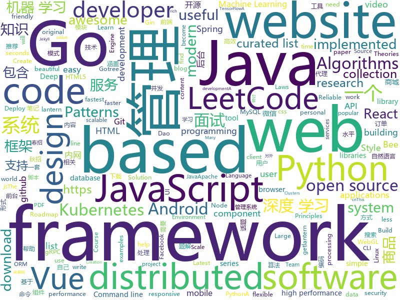

# 2019-05-27
See what the GitHub community is most excited about today.

## python
* [Python](https://github.com/TheAlgorithms/Python)(**189 stars today**): All Algorithms implemented in Python
* [maildown](https://github.com/chris104957/maildown)(**147 stars today**): A super simple CLI for sending emails
* [minimalRL](https://github.com/seungeunrho/minimalRL)(**146 stars today**): Implementations of basic RL algorithms with minimal lines of codes! (pytorch based)
* [Machine-Learning](https://github.com/shunliz/Machine-Learning)(**113 stars today**): 机器学习原理
* [videoflow](https://github.com/videoflow/videoflow)(**114 stars today**): Python framework that facilitates the quick development of complex video analysis applications and other series-processing based applications in a multiprocessing environment.
* [system-design-primer](https://github.com/donnemartin/system-design-primer)(**49 stars today**): Learn how to design large-scale systems. Prep for the system design interview. Includes Anki flashcards.
* [AiLearning](https://github.com/apachecn/AiLearning)(**51 stars today**): AiLearning: 机器学习 - MachineLearning - ML、深度学习 - DeepLearning - DL、自然语言处理 NLP
* [LeakLooker](https://github.com/woj-ciech/LeakLooker)(**50 stars today**): Find open databases with Shodan
* [models](https://github.com/tensorflow/models)(**41 stars today**): Models and examples built with TensorFlow
* [awesome-python](https://github.com/vinta/awesome-python)(**46 stars today**): A curated list of awesome Python frameworks, libraries, software and resources
* [pysot](https://github.com/STVIR/pysot)(**42 stars today**): SenseTime Research platform for single object tracking, implementing algorithms like SiamRPN and SiamMask.
* [machine-learning-course](https://github.com/machinelearningmindset/machine-learning-course)(**41 stars today**): 💬Machine Learning Course with Python
* [pythia](https://github.com/facebookresearch/pythia)(**40 stars today**): A modular framework for vision & language multimodal research from Facebook AI Research (FAIR)
* [ERNIE](https://github.com/thunlp/ERNIE)(**38 stars today**): Source code and dataset for ACL 2019 paper "ERNIE: Enhanced Language Representation with Informative Entities"
* [public-apis](https://github.com/toddmotto/public-apis)(**35 stars today**): A collective list of free APIs for use in software and web development.
* [DeleteFB](https://github.com/weskerfoot/DeleteFB)(**35 stars today**): A Selenium script to delete your Facebook content.
* [black](https://github.com/python/black)(**33 stars today**): The uncompromising Python code formatter
* [face_recognition](https://github.com/ageitgey/face_recognition)(**28 stars today**): The world's simplest facial recognition api for Python and the command line
* [faceswap](https://github.com/deepfakes/faceswap)(**28 stars today**): Non official project based on original /r/Deepfakes thread. Many thanks to him!
* [kopf](https://github.com/zalando-incubator/kopf)(**31 stars today**): A Python framework to write Kubernetes operators in just few lines of code.
* [youtube-dl](https://github.com/ytdl-org/youtube-dl)(**26 stars today**): Command-line program to download videos from YouTube.com and other video sites
* [efficient-decision-tree-notes](https://github.com/wepe/efficient-decision-tree-notes)(**27 stars today**): 高效决策树算法系列笔记
* [Algorithm_Interview_Notes-Chinese](https://github.com/imhuay/Algorithm_Interview_Notes-Chinese)(**24 stars today**): 2018/2019/校招/春招/秋招/算法/机器学习(Machine Learning)/深度学习(Deep Learning)/自然语言处理(NLP)/C/C++/Python/面试笔记
* [scikit-learn](https://github.com/scikit-learn/scikit-learn)(**23 stars today**): scikit-learn: machine learning in Python
* [cpython](https://github.com/python/cpython)(**21 stars today**): The Python programming language

## java
* [LeetCodeAnimation](https://github.com/MisterBooo/LeetCodeAnimation)(**164 stars today**): Demonstrate all the questions on LeetCode in the form of animation.（用动画的形式呈现解LeetCode题目的思路）
* [JavaGuide](https://github.com/Snailclimb/JavaGuide)(**105 stars today**): 【Java学习+面试指南】 一份涵盖大部分Java程序员所需要掌握的核心知识。
* [CS-Notes](https://github.com/CyC2018/CS-Notes)(**91 stars today**): 📚技术面试必备基础知识、Leetcode 题解、后端面试、Java 面试、春招、秋招、操作系统、计算机网络、系统设计
* [mall](https://github.com/macrozheng/mall)(**49 stars today**): mall项目是一套电商系统，包括前台商城系统及后台管理系统，基于SpringBoot+MyBatis实现。 前台商城系统包含首页门户、商品推荐、商品搜索、商品展示、购物车、订单流程、会员中心、客户服务、帮助中心等模块。 后台管理系统包含商品管理、订单管理、会员管理、促销管理、运营管理、内容管理、统计报表、财务管理、权限管理、设置等模块。
* [advanced-java](https://github.com/doocs/advanced-java)(**43 stars today**): 😮互联网 Java 工程师进阶知识完全扫盲：涵盖高并发、分布式、高可用、微服务等领域知识
* [FocusLayoutManager](https://github.com/CCY0122/FocusLayoutManager)(**42 stars today**): 有焦点item的水平/垂直滚动RecyclerView-LayoutManager。仿Android豆瓣书影音“推荐“频道列表布局
* [okhttp](https://github.com/square/okhttp)(**33 stars today**): An HTTP+HTTP/2 client for Android and Java applications.
* [spring-boot](https://github.com/spring-projects/spring-boot)(**26 stars today**): Spring Boot
* [spring-framework](https://github.com/spring-projects/spring-framework)(**23 stars today**): Spring Framework
* [tutorials](https://github.com/eugenp/tutorials)(**20 stars today**): The "REST With Spring" Course:
* [Java](https://github.com/TheAlgorithms/Java)(**29 stars today**): All Algorithms implemented in Java
* [dubbo](https://github.com/apache/dubbo)(**26 stars today**): Apache Dubbo is a high-performance, java based, open source RPC framework.
* [sia-task](https://github.com/siaorg/sia-task)(**25 stars today**): 微服务任务调度框架
* [java-design-patterns](https://github.com/iluwatar/java-design-patterns)(**23 stars today**): Design patterns implemented in Java
* [pulsar](https://github.com/apache/pulsar)(**23 stars today**): Apache Pulsar - distributed pub-sub messaging system
* [elasticsearch](https://github.com/elastic/elasticsearch)(**15 stars today**): Open Source, Distributed, RESTful Search Engine
* [litemall](https://github.com/linlinjava/litemall)(**16 stars today**): 又一个小商城。litemall = Spring Boot后端 + Vue管理员前端 + 微信小程序用户前端 + Vue用户移动端
* [bee](https://github.com/automvc/bee)(**20 stars today**): Bee is an easy and high efficiency ORM framework.You don't need to write the Dao by yourself anymore(Coding Complexity is O(1) ). Bee是开发速度快、编码少、简单、高效的ORM框架，它的编码复杂度是O(1)，即用了Bee，你可以不用另外写dao代码。
* [mangle](https://github.com/vmware/mangle)(**20 stars today**): Git Repository for the Mangle tool
* [seata](https://github.com/seata/seata)(**19 stars today**): 🔥Seata is an easy-to-use, high-performance, java based, open source distributed transaction solution.
* [guava](https://github.com/google/guava)(**18 stars today**): Google core libraries for Java
* [Component](https://github.com/xiaojinzi123/Component)(**19 stars today**): 一个强大完善的Android组件化方案,后续我会跟上一个使用了组件化的 App 真实例子.
* [ghidra](https://github.com/NationalSecurityAgency/ghidra)(**18 stars today**): Ghidra is a software reverse engineering (SRE) framework
* [halo](https://github.com/halo-dev/halo)(**17 stars today**): ✍ Halo 可能是最好的 Java 博客系统
* [Signal-Android](https://github.com/signalapp/Signal-Android)(**18 stars today**): A private messenger for Android.

## unknown
* [the-art-of-command-line](https://github.com/jlevy/the-art-of-command-line)(**529 stars today**): Master the command line, in one page
* [awesome-scalability](https://github.com/binhnguyennus/awesome-scalability)(**315 stars today**): The Patterns Behind Scalable, Reliable, and Performant Large-Scale Systems
* [RenZhengfei](https://github.com/benmahr/RenZhengfei)(**187 stars today**): 任正非思想
* [stanford-cs-221-artificial-intelligence](https://github.com/afshinea/stanford-cs-221-artificial-intelligence)(**163 stars today**): VIP cheatsheets for Stanford's CS 221 Artificial Intelligence
* [hacker-laws](https://github.com/dwmkerr/hacker-laws)(**157 stars today**): 💻📖Laws, Theories, Principles and Patterns that developers will find useful.
* [cryptocoding](https://github.com/veorq/cryptocoding)(**77 stars today**): Guidelines for low-level cryptography software
* [hacker-laws-zh](https://github.com/nusr/hacker-laws-zh)(**58 stars today**): 💻📖Laws, Theories, Principles and Patterns that developers will find useful. (对开发人员有用的定律、理论、原则和模式。)
* [You-Dont-Know-JS](https://github.com/getify/You-Dont-Know-JS)(**50 stars today**): A book series on JavaScript. @YDKJS on twitter.
* [gitignore](https://github.com/github/gitignore)(**39 stars today**): A collection of useful .gitignore templates
* [Data-Science--Cheat-Sheet](https://github.com/abhat222/Data-Science--Cheat-Sheet)(**43 stars today**): Cheat Sheets
* [free-programming-books](https://github.com/EbookFoundation/free-programming-books)(**44 stars today**): 📚Freely available programming books
* [coding-interview-university](https://github.com/jwasham/coding-interview-university)(**39 stars today**): A complete computer science study plan to become a software engineer.
* [developer-roadmap](https://github.com/kamranahmedse/developer-roadmap)(**42 stars today**): Roadmap to becoming a web developer in 2019
* [awesome](https://github.com/sindresorhus/awesome)(**39 stars today**): 😎Awesome lists about all kinds of interesting topics
* [awesome-gradient-boosting-papers](https://github.com/benedekrozemberczki/awesome-gradient-boosting-papers)(**38 stars today**): A curated list of gradient boosting research papers with implementations.
* [DeepLearning-500-questions](https://github.com/scutan90/DeepLearning-500-questions)(**30 stars today**): 深度学习500问，以问答形式对常用的概率知识、线性代数、机器学习、深度学习、计算机视觉等热点问题进行阐述，以帮助自己及有需要的读者。 全书分为18个章节，50余万字。由于水平有限，书中不妥之处恳请广大读者批评指正。 未完待续............ 如有意合作，联系scutjy2015@163.com 版权所有，违权必究 Tan 2018.06
* [awesome-wechat-weapp](https://github.com/justjavac/awesome-wechat-weapp)(**30 stars today**): 微信小程序开发资源汇总💯
* [trackerslist](https://github.com/ngosang/trackerslist)(**29 stars today**): Updated list of public BitTorrent trackers
* [download](https://github.com/getlantern/download)(**29 stars today**): 🔴蓝灯最新版本下载 https://github.com/getlantern/download🔴Lantern Latest Download https://github.com/getlantern/lantern/releases/tag/latest🔴
* [android-developer-roadmap](https://github.com/anacoimbrag/android-developer-roadmap)(**30 stars today**): Android Developer Roadmap 2019
* [awesome-vue](https://github.com/vuejs/awesome-vue)(**25 stars today**): 🎉A curated list of awesome things related to Vue.js
* [StanfordDoggoProject](https://github.com/Nate711/StanfordDoggoProject)(**24 stars today**): Stanford Doggo is an open source quadruped robot that jumps, flips, and trots!
* [ossa](https://github.com/bloodzer0/ossa)(**25 stars today**): Open-Source Security Architecture | 开源安全架构
* [CreawsomeMod](https://github.com/trouch/CreawsomeMod)(**24 stars today**): Modification for Ultimaker Cura
* [The-Hackers-Hardware-Toolkit](https://github.com/yadox666/The-Hackers-Hardware-Toolkit)(**24 stars today**): The best hacker's gadgets for Red Team pentesters and security researchers.

## javascript
* [react-vertex](https://github.com/sghall/react-vertex)(**364 stars today**): ◾️React Vertex | Hooks-based WebGL library for React
* [tiptap](https://github.com/scrumpy/tiptap)(**314 stars today**): A rich-text editor for Vue.js
* [pixi.js](https://github.com/pixijs/pixi.js)(**126 stars today**): The HTML5 Creation Engine: Create beautiful digital content with the fastest, most flexible 2D WebGL renderer.
* [Motrix](https://github.com/agalwood/Motrix)(**120 stars today**): A full-featured download manager.
* [leetcode](https://github.com/azl397985856/leetcode)(**107 stars today**): LeetCode Solutions: A Record of My Problem Solving Journey.( leetcode题解，记录自己的leetcode解题之路。)
* [awesome-mac](https://github.com/jaywcjlove/awesome-mac)(**103 stars today**):  Now we have become very big, Different from the original idea. Collect premium software in various categories.
* [gitfolio](https://github.com/imfunniee/gitfolio)(**104 stars today**): personal website + blog for every github user
* [vue](https://github.com/vuejs/vue)(**89 stars today**): 🖖Vue.js is a progressive, incrementally-adoptable JavaScript framework for building UI on the web.
* [enquirer](https://github.com/enquirer/enquirer)(**76 stars today**): Stylish, intuitive and user-friendly prompts.
* [scar](https://github.com/cloudkj/scar)(**70 stars today**): Deploy static websites in seconds - with HTTPS, a global CDN, and custom domains.
* [react](https://github.com/facebook/react)(**61 stars today**): A declarative, efficient, and flexible JavaScript library for building user interfaces.
* [WebGL-Fluid-Simulation](https://github.com/PavelDoGreat/WebGL-Fluid-Simulation)(**62 stars today**): Play with fluids in your browser (works even on mobile)
* [axios](https://github.com/axios/axios)(**47 stars today**): Promise based HTTP client for the browser and node.js
* [reveal.js](https://github.com/hakimel/reveal.js)(**39 stars today**): The HTML Presentation Framework
* [firebase-startup-kit](https://github.com/snakajima/firebase-startup-kit)(**47 stars today**): 
* [tornis](https://github.com/robb0wen/tornis)(**49 stars today**): Tornis helps you watch and respond to changes in your browser's viewport🌲
* [bootstrap](https://github.com/twbs/bootstrap)(**36 stars today**): The most popular HTML, CSS, and JavaScript framework for developing responsive, mobile first projects on the web.
* [libpku](https://github.com/lib-pku/libpku)(**41 stars today**): 贵校课程资料民间整理
* [material-ui](https://github.com/mui-org/material-ui)(**40 stars today**): React components for faster and easier web development. Build your own design system, or start with Material Design.
* [baiduyun](https://github.com/syhyz1990/baiduyun)(**38 stars today**): 🖖油猴脚本 一个脚本搞定百度网盘下载
* [30-seconds-of-code](https://github.com/30-seconds/30-seconds-of-code)(**37 stars today**): A curated collection of useful JavaScript snippets that you can understand in 30 seconds or less.
* [storybook](https://github.com/storybooks/storybook)(**37 stars today**): UI component dev & test: React, Vue, Angular, React Native, Ember, Web Components & more!
* [javascript](https://github.com/airbnb/javascript)(**33 stars today**): JavaScript Style Guide
* [prettier](https://github.com/prettier/prettier)(**37 stars today**): Prettier is an opinionated code formatter.
* [javascript-algorithms](https://github.com/trekhleb/javascript-algorithms)(**33 stars today**): 📝Algorithms and data structures implemented in JavaScript with explanations and links to further readings

## html
* [linux-command](https://github.com/jaywcjlove/linux-command)(**242 stars today**): Linux命令大全搜索工具，内容包含Linux命令手册、详解、学习、搜集。https://git.io/linux
* [WebFundamentals](https://github.com/google/WebFundamentals)(**20 stars today**): Best practices for modern web development
* [water.css](https://github.com/kognise/water.css)(**18 stars today**): A just-add-css collection of styles to make simple websites just a little nicer
* [awesome-modern-cpp](https://github.com/rigtorp/awesome-modern-cpp)(**16 stars today**): A collection of resources on modern C++
* [flutter-in-action](https://github.com/flutterchina/flutter-in-action)(**14 stars today**): 《Flutter实战》电子书
* [en.javascript.info](https://github.com/javascript-tutorial/en.javascript.info)(**12 stars today**): Modern JavaScript Tutorial
* [sa-admin](https://github.com/shengzhang666/sa-admin)(**13 stars today**): 一个基于iframe的多窗口后台模板，演示地址：http://sa-admin.dev33.cn
* [Spoon-Knife](https://github.com/octocat/Spoon-Knife)(****): This repo is for demonstration purposes only.
* [nndl.github.io](https://github.com/nndl/nndl.github.io)(**11 stars today**): 《神经网络与深度学习》 Neural Network and Deep Learning
* [thinkspace](https://github.com/heiswayi/thinkspace)(**10 stars today**): Just another minimalist Jekyll theme which designed for technical writing blog.
* [personal-website](https://github.com/github/personal-website)(**5 stars today**): Code that'll help you kickstart a personal website that showcases your work as a software developer.
* [zjcqoo.github.io](https://github.com/zjcqoo/zjcqoo.github.io)(**5 stars today**): jsproxy demo site
* [home](https://github.com/apachecn/home)(**7 stars today**): ApacheCN 开源组织：公告、介绍、成员、活动、交流方式
* [Iosevka](https://github.com/be5invis/Iosevka)(**7 stars today**): Slender typeface for code, from code.
* [Terminus2049.github.io](https://github.com/Terminus2049/Terminus2049.github.io)(**6 stars today**): No more 404
* [requests-html](https://github.com/kennethreitz/requests-html)(**6 stars today**): Pythonic HTML Parsing for Humans™
* [hugo-academic](https://github.com/gcushen/hugo-academic)(**5 stars today**): The website builder for Hugo. Build and deploy a beautiful website in minutes🚀
* [speedtest](https://github.com/adolfintel/speedtest)(**6 stars today**): Self-hosted HTML5 Speedtest. Easy setup, examples, configurable, responsive and mobile friendly. Supports PHP, Node, and more.
* [ctf-wiki](https://github.com/ctf-wiki/ctf-wiki)(**6 stars today**): CTF Wiki Online, English version coming!
* [devops-essentials-sample-app](https://github.com/linuxacademy/devops-essentials-sample-app)(****): 
* [design-blocks](https://github.com/froala/design-blocks)(**5 stars today**): A set of 170+ Bootstrap based design blocks ready to be used to create clean modern websites.
* [nginxconfig.io](https://github.com/valentinxxx/nginxconfig.io)(**5 stars today**): ⚙️NGiИX config generator on steroids💉
* [terrahub](https://github.com/TerraHubCorp/terrahub)(**5 stars today**): Terraform Automation and Orchestration Tool (Open Source)
* [patchwork](https://github.com/jlord/patchwork)(****): All the Git-it Workshop completers!
* [simple-icons](https://github.com/simple-icons/simple-icons)(**5 stars today**): SVG icons for popular brands

## go
* [Gaea](https://github.com/XiaoMi/Gaea)(**79 stars today**): Gaea is a mysql proxy, it's developed by xiaomi b2c-systech team.
* [dive-to-gosync-workshop](https://github.com/smallnest/dive-to-gosync-workshop)(**63 stars today**): 深入Go并发编程研讨课
* [VictoriaMetrics](https://github.com/VictoriaMetrics/VictoriaMetrics)(**56 stars today**): VictoriaMetrics - high-performance, cost-effective and scalable time series database, long-term remote storage for Prometheus
* [unipdf](https://github.com/unidoc/unipdf)(**52 stars today**): Golang PDF library for creating and processing PDF files (pure go)
* [rback](https://github.com/mhausenblas/rback)(**49 stars today**): RBAC in Kubernetes visualizer
* [go](https://github.com/golang/go)(**38 stars today**): The Go programming language
* [awesome-go](https://github.com/avelino/awesome-go)(**34 stars today**): A curated list of awesome Go frameworks, libraries and software
* [kubernetes](https://github.com/kubernetes/kubernetes)(**28 stars today**): Production-Grade Container Scheduling and Management
* [rio](https://github.com/rancher/rio)(**33 stars today**): Kubernetes based MicroPaaS
* [nps](https://github.com/cnlh/nps)(**28 stars today**): 一款轻量级、功能强大的内网穿透代理服务器。支持tcp、udp流量转发，支持内网http代理、内网socks5代理，同时支持snappy压缩、站点保护、加密传输、多路复用、header修改等。支持web图形化管理，集成多用户模式。
* [grpcurl](https://github.com/fullstorydev/grpcurl)(**27 stars today**): Like cURL, but for gRPC: Command-line tool for interacting with gRPC servers
* [komiser](https://github.com/mlabouardy/komiser)(**26 stars today**): ☁️Cloud Environment Inspector👮🔒💰
* [hugo](https://github.com/gohugoio/hugo)(**23 stars today**): The world’s fastest framework for building websites.
* [limiter](https://github.com/ulule/limiter)(**24 stars today**): Dead simple rate limit middleware for Go.
* [k3s](https://github.com/rancher/k3s)(**20 stars today**): Lightweight Kubernetes. 5 less than k8s.
* [gin](https://github.com/gin-gonic/gin)(**19 stars today**): Gin is a HTTP web framework written in Go (Golang). It features a Martini-like API with much better performance -- up to 40 times faster. If you need smashing performance, get yourself some Gin.
* [kratos](https://github.com/bilibili/kratos)(**17 stars today**): Kratos是bilibili开源的一套Go微服务框架，包含大量微服务相关框架及工具。
* [gotree](https://github.com/8treenet/gotree)(**18 stars today**): Gotree is a vertically distributed framework. Gotree's goal is to easily develop distributed services and liberate the mental burden of developers.
* [k9s](https://github.com/derailed/k9s)(**17 stars today**): 🐶Kubernetes CLI To Manage Your Clusters In Style!
* [tidb](https://github.com/pingcap/tidb)(**17 stars today**): TiDB is a distributed HTAP database compatible with the MySQL protocol
* [nftables](https://github.com/google/nftables)(**17 stars today**): This package manipulates Linux nftables (the iptables successor)
* [reading-go](https://github.com/developer-learning/reading-go)(**15 stars today**): Go 夜读 > 每周通过 zoom 在线直播的方式分享 Go 相关的技术话题，每天大家在 微信/Slack 上及时沟通交流编程技术话题。
* [kubectl-dig](https://github.com/sysdiglabs/kubectl-dig)(**16 stars today**): Deep kubernetes visibility from the kubectl
* [etcd](https://github.com/etcd-io/etcd)(**14 stars today**): Distributed reliable key-value store for the most critical data of a distributed system
* [istio](https://github.com/istio/istio)(**15 stars today**): Connect, secure, control, and observe services.

## WordCloud

