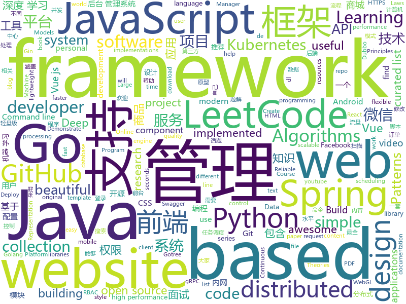

# 2019-05-28
See what the GitHub community is most excited about today.

## python
* [minimalRL](https://github.com/seungeunrho/minimalRL)(**376 stars today**): Implementations of basic RL algorithms with minimal lines of codes! (pytorch based)
* [Python](https://github.com/TheAlgorithms/Python)(**211 stars today**): All Algorithms implemented in Python
* [Machine-Learning](https://github.com/shunliz/Machine-Learning)(**135 stars today**): 机器学习原理
* [maildown](https://github.com/chris104957/maildown)(**84 stars today**): A super simple CLI for sending emails
* [AiLearning](https://github.com/apachecn/AiLearning)(**73 stars today**): AiLearning: 机器学习 - MachineLearning - ML、深度学习 - DeepLearning - DL、自然语言处理 NLP
* [pysot](https://github.com/STVIR/pysot)(**72 stars today**): SenseTime Research platform for single object tracking, implementing algorithms like SiamRPN and SiamMask.
* [models](https://github.com/tensorflow/models)(**52 stars today**): Models and examples built with TensorFlow
* [pythia](https://github.com/facebookresearch/pythia)(**69 stars today**): A modular framework for vision & language multimodal research from Facebook AI Research (FAIR)
* [awesome-python](https://github.com/vinta/awesome-python)(**57 stars today**): A curated list of awesome Python frameworks, libraries, software and resources
* [ERNIE](https://github.com/thunlp/ERNIE)(**65 stars today**): Source code and dataset for ACL 2019 paper "ERNIE: Enhanced Language Representation with Informative Entities"
* [youtube-dl](https://github.com/ytdl-org/youtube-dl)(**63 stars today**): Command-line program to download videos from YouTube.com and other video sites
* [faceswap](https://github.com/deepfakes/faceswap)(**46 stars today**): Non official project based on original /r/Deepfakes thread. Many thanks to him!
* [DeleteFB](https://github.com/weskerfoot/DeleteFB)(**58 stars today**): A Selenium script to delete your Facebook content.
* [open_model_zoo](https://github.com/opencv/open_model_zoo)(**58 stars today**): Pre-trained Deep Learning models and samples (high quality and extremely fast)
* [LeakLooker](https://github.com/woj-ciech/LeakLooker)(**53 stars today**): Find open databases with Shodan
* [videoflow](https://github.com/videoflow/videoflow)(**51 stars today**): Python framework that facilitates the quick development of complex video analysis applications and other series-processing based applications in a multiprocessing environment.
* [system-design-primer](https://github.com/donnemartin/system-design-primer)(**47 stars today**): Learn how to design large-scale systems. Prep for the system design interview. Includes Anki flashcards.
* [machine-learning-course](https://github.com/machinelearningmindset/machine-learning-course)(**47 stars today**): 💬Machine Learning Course with Python
* [HelloGitHub](https://github.com/521xueweihan/HelloGitHub)(**44 stars today**): 一个分享 GitHub 上有趣、入门级的开源项目。让你找到编程的乐趣，欢迎推荐、自荐项目「每月28号更新」
* [home-assistant](https://github.com/home-assistant/home-assistant)(**37 stars today**): 🏡Open source home automation that puts local control and privacy first
* [opendevops](https://github.com/opendevops-cn/opendevops)(**39 stars today**): CODO是为用户提供企业多混合云、自动化运维、完全开源的云管理平台
* [kopf](https://github.com/zalando-incubator/kopf)(**39 stars today**): A Python framework to write Kubernetes operators in just few lines of code.
* [face_recognition](https://github.com/ageitgey/face_recognition)(**32 stars today**): The world's simplest facial recognition api for Python and the command line
* [public-apis](https://github.com/toddmotto/public-apis)(**36 stars today**): A collective list of free APIs for use in software and web development.
* [flask](https://github.com/pallets/flask)(**32 stars today**): The Python micro framework for building web applications.

## java
* [LeetCodeAnimation](https://github.com/MisterBooo/LeetCodeAnimation)(**298 stars today**): Demonstrate all the questions on LeetCode in the form of animation.（用动画的形式呈现解LeetCode题目的思路）
* [CS-Notes](https://github.com/CyC2018/CS-Notes)(**164 stars today**): 📚技术面试必备基础知识、Leetcode 题解、后端面试、Java 面试、春招、秋招、操作系统、计算机网络、系统设计
* [JavaGuide](https://github.com/Snailclimb/JavaGuide)(**146 stars today**): 【Java学习+面试指南】 一份涵盖大部分Java程序员所需要掌握的核心知识。
* [mall](https://github.com/macrozheng/mall)(**134 stars today**): mall项目是一套电商系统，包括前台商城系统及后台管理系统，基于SpringBoot+MyBatis实现。 前台商城系统包含首页门户、商品推荐、商品搜索、商品展示、购物车、订单流程、会员中心、客户服务、帮助中心等模块。 后台管理系统包含商品管理、订单管理、会员管理、促销管理、运营管理、内容管理、统计报表、财务管理、权限管理、设置等模块。
* [SoulPermission](https://github.com/soulqw/SoulPermission)(**116 stars today**): a permission check or request for android
* [advanced-java](https://github.com/doocs/advanced-java)(**85 stars today**): 😮互联网 Java 工程师进阶知识完全扫盲：涵盖高并发、分布式、高可用、微服务等领域知识
* [sia-task](https://github.com/siaorg/sia-task)(**84 stars today**): 微服务任务调度框架
* [FocusLayoutManager](https://github.com/CCY0122/FocusLayoutManager)(**79 stars today**): 有焦点item的水平/垂直滚动RecyclerView-LayoutManager。仿Android豆瓣书影音“推荐“频道列表布局
* [eladmin](https://github.com/elunez/eladmin)(**60 stars today**): 项目基于 Spring Boot 2.1.0 、 Jpa、 Spring Security、redis、Vue的前后端分离的后台管理系统，项目采用分模块开发方式， 权限控制采用 RBAC，支持数据字典与数据权限管理，支持一键生成前后端代码，支持动态路由
* [litemall](https://github.com/linlinjava/litemall)(**58 stars today**): 又一个小商城。litemall = Spring Boot后端 + Vue管理员前端 + 微信小程序用户前端 + Vue用户移动端
* [spring-boot](https://github.com/spring-projects/spring-boot)(**40 stars today**): Spring Boot
* [tutorials](https://github.com/eugenp/tutorials)(**23 stars today**): The "REST With Spring" Course:
* [spring-framework](https://github.com/spring-projects/spring-framework)(**31 stars today**): Spring Framework
* [easyexcel](https://github.com/alibaba/easyexcel)(**39 stars today**): 快速、简单避免OOM的java处理Excel工具
* [JustAuth](https://github.com/zhangyd-c/JustAuth)(**41 stars today**): 💯史上最全的整合第三方登录的工具,目前已支持Github、Gitee、微博、钉钉、百度、Coding、腾讯云开发者平台、OSChina、支付宝、QQ、微信、淘宝、Google、Facebook、抖音和领英等第三方平台的授权登录。 Login, so easy!
* [apollo](https://github.com/ctripcorp/apollo)(**36 stars today**): Apollo（阿波罗）是携程框架部门研发的分布式配置中心，能够集中化管理应用不同环境、不同集群的配置，配置修改后能够实时推送到应用端，并且具备规范的权限、流程治理等特性，适用于微服务配置管理场景。
* [Sentinel](https://github.com/alibaba/Sentinel)(**39 stars today**): A lightweight powerful flow control component enabling reliability and monitoring for microservices. (轻量级的流量控制、熔断降级 Java 库)
* [arthas](https://github.com/alibaba/arthas)(**34 stars today**): Alibaba Java Diagnostic Tool Arthas/Alibaba Java诊断利器Arthas
* [dubbo](https://github.com/apache/dubbo)(**27 stars today**): Apache Dubbo is a high-performance, java based, open source RPC framework.
* [elasticsearch](https://github.com/elastic/elasticsearch)(**31 stars today**): Open Source, Distributed, RESTful Search Engine
* [Java](https://github.com/TheAlgorithms/Java)(**30 stars today**): All Algorithms implemented in Java
* [seata](https://github.com/seata/seata)(**31 stars today**): 🔥Seata is an easy-to-use, high-performance, java based, open source distributed transaction solution.
* [java-design-patterns](https://github.com/iluwatar/java-design-patterns)(**28 stars today**): Design patterns implemented in Java
* [CVE-2019-12086-jackson-databind-file-read](https://github.com/c0d3p1ut0s/CVE-2019-12086-jackson-databind-file-read)(**31 stars today**): 
* [xxl-job](https://github.com/xuxueli/xxl-job)(**22 stars today**): A lightweight distributed task scheduling framework.（分布式任务调度平台XXL-JOB）

## unknown
* [the-art-of-command-line](https://github.com/jlevy/the-art-of-command-line)(**733 stars today**): Master the command line, in one page
* [awesome-scalability](https://github.com/binhnguyennus/awesome-scalability)(**478 stars today**): The Patterns Behind Scalable, Reliable, and Performant Large-Scale Systems
* [RenZhengfei1](https://github.com/benmahr/RenZhengfei1)(**340 stars today**): 任正非思想
* [stanford-cs-221-artificial-intelligence](https://github.com/afshinea/stanford-cs-221-artificial-intelligence)(**263 stars today**): VIP cheatsheets for Stanford's CS 221 Artificial Intelligence
* [android-developer-roadmap](https://github.com/anacoimbrag/android-developer-roadmap)(**211 stars today**): Android Developer Roadmap 2019
* [hacker-laws](https://github.com/dwmkerr/hacker-laws)(**148 stars today**): 💻📖Laws, Theories, Principles and Patterns that developers will find useful. #hackerlaws
* [gitignore](https://github.com/github/gitignore)(**60 stars today**): A collection of useful .gitignore templates
* [hacker-laws-zh](https://github.com/nusr/hacker-laws-zh)(**77 stars today**): 💻📖Laws, Theories, Principles and Patterns that developers will find useful. (对开发人员有用的定律、理论、原则和模式。)
* [gdpr-documents](https://github.com/good-lly/gdpr-documents)(**75 stars today**): 🇪🇺Your Right to be Informed and Erased. The General Data Protection Regulation (EU) 2016/679 ("GDPR") documents for personal use.
* [Data-Science--Cheat-Sheet](https://github.com/abhat222/Data-Science--Cheat-Sheet)(**65 stars today**): Cheat Sheets
* [awesome](https://github.com/sindresorhus/awesome)(**69 stars today**): 😎Awesome lists about all kinds of interesting topics
* [developer-roadmap](https://github.com/kamranahmedse/developer-roadmap)(**68 stars today**): Roadmap to becoming a web developer in 2019
* [You-Dont-Know-JS](https://github.com/getify/You-Dont-Know-JS)(**50 stars today**): A book series on JavaScript. @YDKJS on twitter.
* [your-dns](https://github.com/yegle/your-dns)(**58 stars today**): A docker-compose file to provide a secure adblocking DNS server
* [awesome-gradient-boosting-papers](https://github.com/benedekrozemberczki/awesome-gradient-boosting-papers)(**53 stars today**): A curated list of gradient boosting research papers with implementations.
* [free-programming-books](https://github.com/EbookFoundation/free-programming-books)(**44 stars today**): 📚Freely available programming books
* [TNFE-Diagram](https://github.com/Tnfe/TNFE-Diagram)(**49 stars today**): 前端技术图解
* [free-programming-books-zh_CN](https://github.com/justjavac/free-programming-books-zh_CN)(**44 stars today**): 📚免费的计算机编程类中文书籍，欢迎投稿
* [DeepLearning-500-questions](https://github.com/scutan90/DeepLearning-500-questions)(**38 stars today**): 深度学习500问，以问答形式对常用的概率知识、线性代数、机器学习、深度学习、计算机视觉等热点问题进行阐述，以帮助自己及有需要的读者。 全书分为18个章节，50余万字。由于水平有限，书中不妥之处恳请广大读者批评指正。 未完待续............ 如有意合作，联系scutjy2015@163.com 版权所有，违权必究 Tan 2018.06
* [deep-learning-drizzle](https://github.com/kmario23/deep-learning-drizzle)(**39 stars today**): Drench yourself in Deep Learning, Reinforcement Learning, Machine Learning, Computer Vision, and NLP by learning from these exciting lectures!!
* [Step-By-Step](https://github.com/YvetteLau/Step-By-Step)(**44 stars today**): 不积跬步,无以至千里；我是公众号【前端宇宙】作者刘小夕，我将和大家一起一步一个脚印，向前端专家迈进。
* [awesome-dubbo](https://github.com/dubbo/awesome-dubbo)(**38 stars today**): Dubbo resources collection
* [awesome-vue](https://github.com/vuejs/awesome-vue)(**39 stars today**): 🎉A curated list of awesome things related to Vue.js
* [coding-interview-university](https://github.com/jwasham/coding-interview-university)(**36 stars today**): A complete computer science study plan to become a software engineer.
* [architect-awesome](https://github.com/xingshaocheng/architect-awesome)(**32 stars today**): 后端架构师技术图谱

## javascript
* [youtube-dl-interactive](https://github.com/synox/youtube-dl-interactive)(**301 stars today**): Interactively select the quality and format for youtube-dl
* [react-vertex](https://github.com/sghall/react-vertex)(**280 stars today**): ◾️React Vertex | Hooks-based WebGL library for React
* [tiptap](https://github.com/scrumpy/tiptap)(**240 stars today**): A rich-text editor for Vue.js
* [awesome-mac](https://github.com/jaywcjlove/awesome-mac)(**194 stars today**):  Now we have become very big, Different from the original idea. Collect premium software in various categories.
* [mini-github](https://github.com/kezhenxu94/mini-github)(**189 stars today**): GitHub WeChat Mini Program (可能是功能最全的 GitHub 微信小程序)
* [xstyled](https://github.com/smooth-code/xstyled)(**175 stars today**): Consistent theme based CSS for styled-components💅
* [pixi.js](https://github.com/pixijs/pixi.js)(**161 stars today**): The HTML5 Creation Engine: Create beautiful digital content with the fastest, most flexible 2D WebGL renderer.
* [vue](https://github.com/vuejs/vue)(**131 stars today**): 🖖Vue.js is a progressive, incrementally-adoptable JavaScript framework for building UI on the web.
* [leetcode](https://github.com/azl397985856/leetcode)(**132 stars today**): LeetCode Solutions: A Record of My Problem Solving Journey.( leetcode题解，记录自己的leetcode解题之路。)
* [gitfolio](https://github.com/imfunniee/gitfolio)(**134 stars today**): personal website + blog for every github user
* [WebGL-Fluid-Simulation](https://github.com/PavelDoGreat/WebGL-Fluid-Simulation)(**129 stars today**): Play with fluids in your browser (works even on mobile)
* [Motrix](https://github.com/agalwood/Motrix)(**112 stars today**): A full-featured download manager.
* [dsa.js](https://github.com/amejiarosario/dsa.js)(**98 stars today**): Data Structures and Algorithms explained and implemented in JavaScript
* [react](https://github.com/facebook/react)(**75 stars today**): A declarative, efficient, and flexible JavaScript library for building user interfaces.
* [material-ui](https://github.com/mui-org/material-ui)(**64 stars today**): React components for faster and easier web development. Build your own design system, or start with Material Design.
* [algorithm-visualizer](https://github.com/algorithm-visualizer/algorithm-visualizer)(**61 stars today**): 🎆Interactive Online Platform that Visualizes Algorithms from Code
* [uni-app](https://github.com/dcloudio/uni-app)(**68 stars today**): 使用 Vue.js 开发跨平台应用的前端框架
* [30-seconds-of-code](https://github.com/30-seconds/30-seconds-of-code)(**68 stars today**): A curated collection of useful JavaScript snippets that you can understand in 30 seconds or less.
* [scar](https://github.com/cloudkj/scar)(**65 stars today**): Deploy static websites in seconds - with HTTPS, a global CDN, and custom domains.
* [reveal.js](https://github.com/hakimel/reveal.js)(**56 stars today**): The HTML Presentation Framework
* [axios](https://github.com/axios/axios)(**56 stars today**): Promise based HTTP client for the browser and node.js
* [enquirer](https://github.com/enquirer/enquirer)(**60 stars today**): Stylish, intuitive and user-friendly prompts.
* [bootstrap](https://github.com/twbs/bootstrap)(**49 stars today**): The most popular HTML, CSS, and JavaScript framework for developing responsive, mobile first projects on the web.
* [baiduyun](https://github.com/syhyz1990/baiduyun)(**53 stars today**): 🖖油猴脚本 一个脚本搞定百度网盘下载
* [v8n](https://github.com/imbrn/v8n)(**56 stars today**): ☑️JavaScript fluent validation library

## html
* [linux-command](https://github.com/jaywcjlove/linux-command)(**362 stars today**): Linux命令大全搜索工具，内容包含Linux命令手册、详解、学习、搜集。https://git.io/linux
* [water.css](https://github.com/kognise/water.css)(**43 stars today**): A just-add-css collection of styles to make simple websites just a little nicer
* [flutter-in-action](https://github.com/flutterchina/flutter-in-action)(**26 stars today**): 《Flutter实战》电子书
* [personal-website](https://github.com/github/personal-website)(**19 stars today**): Code that'll help you kickstart a personal website that showcases your work as a software developer.
* [nndl.github.io](https://github.com/nndl/nndl.github.io)(**24 stars today**): 《神经网络与深度学习》 Neural Network and Deep Learning
* [website](https://github.com/kubernetes/website)(**12 stars today**): Kubernetes website and documentation repo:
* [hyperblog](https://github.com/freddier/hyperblog)(**11 stars today**): Un blog increíble para el curso de Git y Github de Platzi
* [Spoon-Knife](https://github.com/octocat/Spoon-Knife)(****): This repo is for demonstration purposes only.
* [awesome-modern-cpp](https://github.com/rigtorp/awesome-modern-cpp)(**16 stars today**): A collection of resources on modern C++
* [portainer](https://github.com/portainer/portainer)(**14 stars today**): Simple management UI for Docker
* [fastText](https://github.com/facebookresearch/fastText)(**13 stars today**): Library for fast text representation and classification.
* [patchwork](https://github.com/jlord/patchwork)(****): All the Git-it Workshop completers!
* [swagger-codegen](https://github.com/swagger-api/swagger-codegen)(**11 stars today**): swagger-codegen contains a template-driven engine to generate documentation, API clients and server stubs in different languages by parsing your OpenAPI / Swagger definition.
* [beautiful-jekyll](https://github.com/daattali/beautiful-jekyll)(**6 stars today**): ✨Build a beautiful and simple website in literally minutes. Demo at http://deanattali.com/beautiful-jekyll
* [TrackRay](https://github.com/iSafeBlue/TrackRay)(**11 stars today**): 溯光 (TrackRay) 3 插件式渗透测试框架（资产扫描|指纹识别|暴力破解|网页爬虫|端口扫描|漏洞扫描|AWVS|NMAP|Metasploit）
* [rplibs](https://github.com/refscn/rplibs)(**9 stars today**): Refs.cn 原型设计元件库，基于Axure RP 9/8，支持 Android、Apple、Windows、微信，移动、桌面平台的应用和网站原型设计。
* [design-blocks](https://github.com/froala/design-blocks)(**9 stars today**): A set of 170+ Bootstrap based design blocks ready to be used to create clean modern websites.
* [en.javascript.info](https://github.com/javascript-tutorial/en.javascript.info)(**8 stars today**): Modern JavaScript Tutorial
* [hugo-academic](https://github.com/gcushen/hugo-academic)(**7 stars today**): The website builder for Hugo. Build and deploy a beautiful website in minutes🚀
* [Terminus2049.github.io](https://github.com/Terminus2049/Terminus2049.github.io)(**8 stars today**): No more 404
* [ctf-wiki](https://github.com/ctf-wiki/ctf-wiki)(**8 stars today**): CTF Wiki Online, English version coming!
* [now-github-starter](https://github.com/zeit/now-github-starter)(****): Starter project to demonstrate a project whose pull requests get automatically deployed
* [zfaka](https://github.com/zlkbdotnet/zfaka)(**7 stars today**): 免费、安全、稳定、高效的发卡系统，值得拥有!
* [cs231n.github.io](https://github.com/cs231n/cs231n.github.io)(**7 stars today**): Public facing notes page
* [zh.javascript.info](https://github.com/javascript-tutorial/zh.javascript.info)(**6 stars today**): Modern JavaScript Tutorial

## go
* [Gaea](https://github.com/XiaoMi/Gaea)(**197 stars today**): Gaea is a mysql proxy, it's developed by xiaomi b2c-dev team.
* [dive-to-gosync-workshop](https://github.com/smallnest/dive-to-gosync-workshop)(**185 stars today**): 深入Go并发编程研讨课
* [VictoriaMetrics](https://github.com/VictoriaMetrics/VictoriaMetrics)(**112 stars today**): VictoriaMetrics - high-performance, cost-effective and scalable time series database, long-term remote storage for Prometheus
* [nps](https://github.com/cnlh/nps)(**89 stars today**): 一款轻量级、功能强大的内网穿透代理服务器。支持tcp、udp流量转发，支持内网http代理、内网socks5代理，同时支持snappy压缩、站点保护、加密传输、多路复用、header修改等。支持web图形化管理，集成多用户模式。
* [unipdf](https://github.com/unidoc/unipdf)(**68 stars today**): Golang PDF library for creating and processing PDF files (pure go)
* [limiter](https://github.com/ulule/limiter)(**66 stars today**): Dead simple rate limit middleware for Go.
* [werf](https://github.com/flant/werf)(**64 stars today**): Werf (previously known as dapp) helps to implement and support Continuous Integration and Continuous Delivery
* [grpcurl](https://github.com/fullstorydev/grpcurl)(**53 stars today**): Like cURL, but for gRPC: Command-line tool for interacting with gRPC servers
* [kubernetes](https://github.com/kubernetes/kubernetes)(**44 stars today**): Production-Grade Container Scheduling and Management
* [go](https://github.com/golang/go)(**49 stars today**): The Go programming language
* [rio](https://github.com/rancher/rio)(**47 stars today**): Kubernetes based MicroPaaS
* [etcd](https://github.com/etcd-io/etcd)(**41 stars today**): Distributed reliable key-value store for the most critical data of a distributed system
* [awesome-go](https://github.com/avelino/awesome-go)(**40 stars today**): A curated list of awesome Go frameworks, libraries and software
* [gulu](https://github.com/b3log/gulu)(**43 stars today**): ⭕ Go 语言常用工具库，这个轱辘还算圆！
* [gotree](https://github.com/8treenet/gotree)(**42 stars today**): Gotree is a vertically distributed framework. Gotree's goal is to easily develop distributed services and liberate the mental burden of developers.
* [gin](https://github.com/gin-gonic/gin)(**35 stars today**): Gin is a HTTP web framework written in Go (Golang). It features a Martini-like API with much better performance -- up to 40 times faster. If you need smashing performance, get yourself some Gin.
* [kubectl-dig](https://github.com/sysdiglabs/kubectl-dig)(**37 stars today**): Deep kubernetes visibility from the kubectl
* [hugo](https://github.com/gohugoio/hugo)(**34 stars today**): The world’s fastest framework for building websites.
* [cloud-game](https://github.com/giongto35/cloud-game)(**36 stars today**): POGO, Web-based Cloud Gaming Service
* [kratos](https://github.com/bilibili/kratos)(**29 stars today**): Kratos是bilibili开源的一套Go微服务框架，包含大量微服务相关框架及工具。
* [rback](https://github.com/mhausenblas/rback)(**33 stars today**): RBAC in Kubernetes visualizer
* [k9s](https://github.com/derailed/k9s)(**32 stars today**): 🐶Kubernetes CLI To Manage Your Clusters In Style!
* [reading-go](https://github.com/developer-learning/reading-go)(**30 stars today**): Go 夜读 > 每周通过 zoom 在线直播的方式分享 Go 相关的技术话题，每天大家在 微信/Slack 上及时沟通交流编程技术话题。
* [simple-computer](https://github.com/djhworld/simple-computer)(**29 stars today**): the scott CPU from "But How Do It Know?" by J. Clark Scott
* [helm](https://github.com/helm/helm)(**25 stars today**): The Kubernetes Package Manager

## WordCloud

