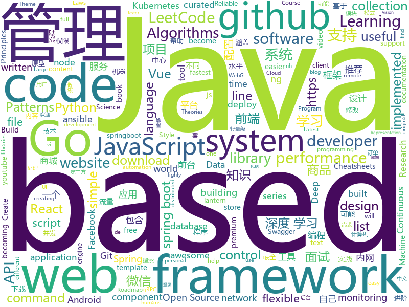

# 2019-05-29
See what the GitHub community is most excited about today.

## python
* [Python](https://github.com/TheAlgorithms/Python)(**237 stars today**): All Algorithms implemented in Python
* [minimalRL](https://github.com/seungeunrho/minimalRL)(**176 stars today**): Implementations of basic RL algorithms with minimal lines of codes! (pytorch based)
* [ring](https://github.com/youknowone/ring)(**120 stars today**): Python cache interface with clean API and built-in memcache & redis + asyncio support.
* [AiLearning](https://github.com/apachecn/AiLearning)(**85 stars today**): AiLearning: 机器学习 - MachineLearning - ML、深度学习 - DeepLearning - DL、自然语言处理 NLP
* [fatt](https://github.com/0x4D31/fatt)(**86 stars today**): fatt /fingerprintAllTheThings - a pyshark based script for extracting network metadata and fingerprints from pcap files and live network traffic
* [awesome-python](https://github.com/vinta/awesome-python)(**69 stars today**): A curated list of awesome Python frameworks, libraries, software and resources
* [models](https://github.com/tensorflow/models)(**48 stars today**): Models and examples built with TensorFlow
* [face_recognition](https://github.com/ageitgey/face_recognition)(**67 stars today**): The world's simplest facial recognition api for Python and the command line
* [youtube-dl](https://github.com/ytdl-org/youtube-dl)(**69 stars today**): Command-line program to download videos from YouTube.com and other video sites
* [system-design-primer](https://github.com/donnemartin/system-design-primer)(**60 stars today**): Learn how to design large-scale systems. Prep for the system design interview. Includes Anki flashcards.
* [pysot](https://github.com/STVIR/pysot)(**60 stars today**): SenseTime Research platform for single object tracking, implementing algorithms like SiamRPN and SiamMask.
* [PySnooper](https://github.com/cool-RR/PySnooper)(**59 stars today**): Never use print for debugging again
* [LeakLooker](https://github.com/woj-ciech/LeakLooker)(**49 stars today**): Find open databases with Shodan
* [HelloGitHub](https://github.com/521xueweihan/HelloGitHub)(**52 stars today**): 一个分享 GitHub 上有趣、入门级的开源项目。让你找到编程的乐趣，欢迎推荐、自荐项目「每月28号更新」
* [keras](https://github.com/keras-team/keras)(**38 stars today**): Deep Learning for humans
* [machine-learning-course](https://github.com/machinelearningmindset/machine-learning-course)(**47 stars today**): 💬Machine Learning Course with Python
* [public-apis](https://github.com/toddmotto/public-apis)(**43 stars today**): A collective list of free APIs for use in software and web development.
* [pythia](https://github.com/facebookresearch/pythia)(**43 stars today**): A modular framework for vision & language multimodal research from Facebook AI Research (FAIR)
* [ansible](https://github.com/ansible/ansible)(**31 stars today**): Ansible is a radically simple IT automation platform that makes your applications and systems easier to deploy. Avoid writing scripts or custom code to deploy and update your applications — automate in a language that approaches plain English, using SSH, with no agents to install on remote systems. https://docs.ansible.com/ansible/
* [DeleteFB](https://github.com/weskerfoot/DeleteFB)(**43 stars today**): A Selenium script to delete your Facebook content.
* [black](https://github.com/python/black)(**42 stars today**): The uncompromising Python code formatter
* [django](https://github.com/django/django)(**33 stars today**): The Web framework for perfectionists with deadlines.
* [faceswap](https://github.com/deepfakes/faceswap)(**37 stars today**): Non official project based on original /r/Deepfakes thread. Many thanks to him!
* [ERNIE](https://github.com/thunlp/ERNIE)(**36 stars today**): Source code and dataset for ACL 2019 paper "ERNIE: Enhanced Language Representation with Informative Entities"
* [home-assistant](https://github.com/home-assistant/home-assistant)(**32 stars today**): 🏡Open source home automation that puts local control and privacy first

## java
* [LeetCodeAnimation](https://github.com/MisterBooo/LeetCodeAnimation)(**323 stars today**): Demonstrate all the questions on LeetCode in the form of animation.（用动画的形式呈现解LeetCode题目的思路）
* [JavaGuide](https://github.com/Snailclimb/JavaGuide)(**178 stars today**): 【Java学习+面试指南】 一份涵盖大部分Java程序员所需要掌握的核心知识。
* [CS-Notes](https://github.com/CyC2018/CS-Notes)(**173 stars today**): 📚技术面试必备基础知识、Leetcode 题解、后端面试、Java 面试、春招、秋招、操作系统、计算机网络、系统设计
* [mall](https://github.com/macrozheng/mall)(**144 stars today**): mall项目是一套电商系统，包括前台商城系统及后台管理系统，基于SpringBoot+MyBatis实现。 前台商城系统包含首页门户、商品推荐、商品搜索、商品展示、购物车、订单流程、会员中心、客户服务、帮助中心等模块。 后台管理系统包含商品管理、订单管理、会员管理、促销管理、运营管理、内容管理、统计报表、财务管理、权限管理、设置等模块。
* [SoulPermission](https://github.com/soulqw/SoulPermission)(**106 stars today**): a permission check or request for android
* [advanced-java](https://github.com/doocs/advanced-java)(**92 stars today**): 😮互联网 Java 工程师进阶知识完全扫盲：涵盖高并发、分布式、高可用、微服务等领域知识
* [spring-boot](https://github.com/spring-projects/spring-boot)(**60 stars today**): Spring Boot
* [apollo](https://github.com/ctripcorp/apollo)(**58 stars today**): Apollo（阿波罗）是携程框架部门研发的分布式配置中心，能够集中化管理应用不同环境、不同集群的配置，配置修改后能够实时推送到应用端，并且具备规范的权限、流程治理等特性，适用于微服务配置管理场景。
* [tutorials](https://github.com/eugenp/tutorials)(**31 stars today**): The "REST With Spring" Course:
* [halo](https://github.com/halo-dev/halo)(**50 stars today**): ✍ Halo 可能是最好的 Java 博客系统
* [dubbo](https://github.com/apache/dubbo)(**45 stars today**): Apache Dubbo is a high-performance, java based, open source RPC framework.
* [FocusLayoutManager](https://github.com/CCY0122/FocusLayoutManager)(**47 stars today**): 有焦点item的水平/垂直滚动RecyclerView-LayoutManager。仿Android豆瓣书影音“推荐“频道列表布局
* [easyexcel](https://github.com/alibaba/easyexcel)(**42 stars today**): 快速、简单避免OOM的java处理Excel工具
* [spring-boot-learning](https://github.com/loda-kun/spring-boot-learning)(**46 stars today**): 🍀🍀Hướng dẫn tất tần tật về Spring Boot, Spring Cloud, Code mẫu tiếng việt, có bài viết hướng dẫn đi kèm hình ảnh dễ hiểu
* [elasticsearch](https://github.com/elastic/elasticsearch)(**38 stars today**): Open Source, Distributed, RESTful Search Engine
* [spring-framework](https://github.com/spring-projects/spring-framework)(**31 stars today**): Spring Framework
* [java-design-patterns](https://github.com/iluwatar/java-design-patterns)(**34 stars today**): Design patterns implemented in Java
* [JustAuth](https://github.com/zhangyd-c/JustAuth)(**38 stars today**): 💯史上最全的整合第三方登录的工具,目前已支持Github、Gitee、微博、钉钉、百度、Coding、腾讯云开发者平台、OSChina、支付宝、QQ、微信、淘宝、Google、Facebook、抖音、领英、小米和微软等第三方平台的授权登录。 Login, so easy!
* [litemall](https://github.com/linlinjava/litemall)(**31 stars today**): 又一个小商城。litemall = Spring Boot后端 + Vue管理员前端 + 微信小程序用户前端 + Vue用户移动端
* [arthas](https://github.com/alibaba/arthas)(**36 stars today**): Alibaba Java Diagnostic Tool Arthas/Alibaba Java诊断利器Arthas
* [Java](https://github.com/TheAlgorithms/Java)(**30 stars today**): All Algorithms implemented in Java
* [Sentinel](https://github.com/alibaba/Sentinel)(**34 stars today**): A lightweight powerful flow control component enabling reliability and monitoring for microservices. (轻量级的流量控制、熔断降级 Java 库)
* [skywalking](https://github.com/apache/skywalking)(**29 stars today**): APM, Application Performance Monitoring System
* [sia-task](https://github.com/siaorg/sia-task)(**30 stars today**): 微服务任务调度框架
* [springboot-learning-example](https://github.com/JeffLi1993/springboot-learning-example)(**29 stars today**): spring boot 实践学习案例，是 spring boot 初学者及核心技术巩固的最佳实践。

## unknown
* [the-art-of-command-line](https://github.com/jlevy/the-art-of-command-line)(**706 stars today**): Master the command line, in one page
* [awesome-scalability](https://github.com/binhnguyennus/awesome-scalability)(**559 stars today**): The Patterns Behind Scalable, Reliable, and Performant Large-Scale Systems
* [android-developer-roadmap](https://github.com/anacoimbrag/android-developer-roadmap)(**351 stars today**): Android Developer Roadmap 2019
* [stanford-cs-221-artificial-intelligence](https://github.com/afshinea/stanford-cs-221-artificial-intelligence)(**139 stars today**): VIP cheatsheets for Stanford's CS 221 Artificial Intelligence
* [hacker-laws](https://github.com/dwmkerr/hacker-laws)(**136 stars today**): 💻📖Laws, Theories, Principles and Patterns that developers will find useful. #hackerlaws
* [ds-cheatsheets](https://github.com/FavioVazquez/ds-cheatsheets)(**85 stars today**): List of Data Science Cheatsheets to rule the world
* [pentest](https://github.com/ring04h/pentest)(**80 stars today**): 渗透测试用到的东东
* [free-programming-books-zh_CN](https://github.com/justjavac/free-programming-books-zh_CN)(**82 stars today**): 📚免费的计算机编程类中文书籍，欢迎投稿
* [You-Dont-Know-JS](https://github.com/getify/You-Dont-Know-JS)(**76 stars today**): A book series on JavaScript. @YDKJS on twitter.
* [developer-roadmap](https://github.com/kamranahmedse/developer-roadmap)(**81 stars today**): Roadmap to becoming a web developer in 2019
* [hacker-laws-zh](https://github.com/nusr/hacker-laws-zh)(**80 stars today**): 💻📖Laws, Theories, Principles and Patterns that developers will find useful. (对开发人员有用的定律、理论、原则和模式。)
* [gitignore](https://github.com/github/gitignore)(**60 stars today**): A collection of useful .gitignore templates
* [toolnetes](https://github.com/Aracki/toolnetes)(**78 stars today**): 🔧Collection of miscellaneous Kubernetes tools and articles.
* [coding-interview-university](https://github.com/jwasham/coding-interview-university)(**64 stars today**): A complete computer science study plan to become a software engineer.
* [awesome](https://github.com/sindresorhus/awesome)(**69 stars today**): 😎Awesome lists about all kinds of interesting topics
* [Decryption-Tools](https://github.com/jiansiting/Decryption-Tools)(**65 stars today**): Decryption-Tools
* [golang-developer-roadmap](https://github.com/Alikhll/golang-developer-roadmap)(**63 stars today**): Roadmap to becoming a Go developer in 2019
* [Data-Science--Cheat-Sheet](https://github.com/abhat222/Data-Science--Cheat-Sheet)(**39 stars today**): Cheat Sheets
* [free-programming-books](https://github.com/EbookFoundation/free-programming-books)(**48 stars today**): 📚Freely available programming books
* [Daily-Interview-Question](https://github.com/Advanced-Frontend/Daily-Interview-Question)(**47 stars today**): 我是木易杨，公众号「高级前端进阶」作者，每天搞定一道前端大厂面试题，祝大家天天进步，一年后会看到不一样的自己。
* [deep-learning-drizzle](https://github.com/kmario23/deep-learning-drizzle)(**39 stars today**): Drench yourself in Deep Learning, Reinforcement Learning, Machine Learning, Computer Vision, and NLP by learning from these exciting lectures!!
* [architect-awesome](https://github.com/xingshaocheng/architect-awesome)(**34 stars today**): 后端架构师技术图谱
* [DeepLearning-500-questions](https://github.com/scutan90/DeepLearning-500-questions)(**37 stars today**): 深度学习500问，以问答形式对常用的概率知识、线性代数、机器学习、深度学习、计算机视觉等热点问题进行阐述，以帮助自己及有需要的读者。 全书分为18个章节，50余万字。由于水平有限，书中不妥之处恳请广大读者批评指正。 未完待续............ 如有意合作，联系scutjy2015@163.com 版权所有，违权必究 Tan 2018.06
* [download](https://github.com/getlantern/download)(**34 stars today**): 🔴蓝灯最新版本下载 https://github.com/getlantern/download🔴Lantern Latest Download https://github.com/getlantern/lantern/releases/tag/latest🔴
* [RenZhengfei](https://github.com/ttpianobirds/RenZhengfei)(**27 stars today**): 任正非思想

## javascript
* [youtube-dl-interactive](https://github.com/synox/youtube-dl-interactive)(**405 stars today**): Interactively select the quality and format for youtube-dl
* [zdog](https://github.com/metafizzy/zdog)(**379 stars today**): Flat, round, designer-friendly pseudo-3D engine
* [xstyled](https://github.com/smooth-code/xstyled)(**373 stars today**): Consistent theme based CSS for styled-components💅
* [imgsquash](https://github.com/eashish93/imgsquash)(**230 stars today**): Simple image compression full website code written in node, react and next.js framework. Easy to deploy as a microservice.
* [react-vertex](https://github.com/sghall/react-vertex)(**199 stars today**): ◾️React Vertex | Hooks-based WebGL library for React
* [awesome-mac](https://github.com/jaywcjlove/awesome-mac)(**191 stars today**):  Now we have become very big, Different from the original idea. Collect premium software in various categories.
* [leetcode](https://github.com/azl397985856/leetcode)(**164 stars today**): LeetCode Solutions: A Record of My Problem Solving Journey.( leetcode题解，记录自己的leetcode解题之路。)
* [vue](https://github.com/vuejs/vue)(**120 stars today**): 🖖Vue.js is a progressive, incrementally-adoptable JavaScript framework for building UI on the web.
* [tiptap](https://github.com/scrumpy/tiptap)(**121 stars today**): A rich-text editor for Vue.js
* [Springboot_v2](https://github.com/fuce1314/Springboot_v2)(**95 stars today**): SpringBoot_v2项目是努力打造springboot框架的极致细腻的脚手架。包括一套漂亮的前台。无其他杂七杂八的功能，原生纯净。
* [pixi.js](https://github.com/pixijs/pixi.js)(**110 stars today**): The HTML5 Creation Engine: Create beautiful digital content with the fastest, most flexible 2D WebGL renderer.
* [codespeak](https://github.com/sethwilsonUS/codespeak)(**96 stars today**): A web-based speech-to-code editor for humans.
* [react](https://github.com/facebook/react)(**79 stars today**): A declarative, efficient, and flexible JavaScript library for building user interfaces.
* [Motrix](https://github.com/agalwood/Motrix)(**78 stars today**): A full-featured download manager.
* [gitfolio](https://github.com/imfunniee/gitfolio)(**79 stars today**): personal website + blog for every github user
* [mini-github](https://github.com/kezhenxu94/mini-github)(**73 stars today**): GitHub WeChat Mini Program (可能是功能最全的 GitHub 微信小程序)
* [material-ui](https://github.com/mui-org/material-ui)(**59 stars today**): React components for faster and easier web development. Build your own design system, or start with Material Design.
* [30-seconds-of-code](https://github.com/30-seconds/30-seconds-of-code)(**63 stars today**): A curated collection of useful JavaScript snippets that you can understand in 30 seconds or less.
* [create-react-app](https://github.com/facebook/create-react-app)(**55 stars today**): Set up a modern web app by running one command.
* [axios](https://github.com/axios/axios)(**61 stars today**): Promise based HTTP client for the browser and node.js
* [comfygure](https://github.com/marmelab/comfygure)(**62 stars today**): Encrypted and versioned configuration store built with collaboration in mind
* [javascript](https://github.com/airbnb/javascript)(**57 stars today**): JavaScript Style Guide
* [baiduyun](https://github.com/syhyz1990/baiduyun)(**57 stars today**): 🖖油猴脚本 一个脚本搞定百度网盘下载
* [dsa.js](https://github.com/amejiarosario/dsa.js)(**54 stars today**): Data Structures and Algorithms explained and implemented in JavaScript
* [puppeteer](https://github.com/GoogleChrome/puppeteer)(**50 stars today**): Headless Chrome Node API

## html
* [linux-command](https://github.com/jaywcjlove/linux-command)(**170 stars today**): Linux命令大全搜索工具，内容包含Linux命令手册、详解、学习、搜集。https://git.io/linux
* [nullboard](https://github.com/apankrat/nullboard)(**47 stars today**): Nullboard is a minimalist kanban board, focused on compactness and readability.
* [flutter-in-action](https://github.com/flutterchina/flutter-in-action)(**35 stars today**): 《Flutter实战》电子书
* [nndl.github.io](https://github.com/nndl/nndl.github.io)(**19 stars today**): 《神经网络与深度学习》 Neural Network and Deep Learning
* [en.javascript.info](https://github.com/javascript-tutorial/en.javascript.info)(**16 stars today**): Modern JavaScript Tutorial
* [ATTACK-Tools](https://github.com/nshalabi/ATTACK-Tools)(**16 stars today**): Utilities for MITRE™ ATT&CK
* [hyperblog](https://github.com/freddier/hyperblog)(**11 stars today**): Un blog increíble para el curso de Git y Github de Platzi
* [documentation](https://github.com/pantheon-systems/documentation)(**13 stars today**): Pantheon Docs
* [website](https://github.com/kubernetes/website)(**10 stars today**): Kubernetes website and documentation repo:
* [index](https://github.com/openspug/index)(**13 stars today**): 企业内部导航页
* [scikit-learn-doc-zh](https://github.com/apachecn/scikit-learn-doc-zh)(**14 stars today**): 📖[译] scikit-learn（sklearn） 中文文档
* [Spoon-Knife](https://github.com/octocat/Spoon-Knife)(****): This repo is for demonstration purposes only.
* [nginxconfig.io](https://github.com/valentinxxx/nginxconfig.io)(**13 stars today**): ⚙️NGiИX config generator on steroids💉
* [Micromodal](https://github.com/ghosh/Micromodal)(**13 stars today**): ⭕ Tiny javascript library for creating accessible modal dialogs
* [personal-website](https://github.com/github/personal-website)(**8 stars today**): Code that'll help you kickstart a personal website that showcases your work as a software developer.
* [patchwork](https://github.com/jlord/patchwork)(****): All the Git-it Workshop completers!
* [JS-Alpha](https://github.com/terjanq/JS-Alpha)(**12 stars today**): Funny project to create an encoder/obfuscator that converts any javascript code into a code that only consist of /[a-z().]/ characters
* [AdminLTE](https://github.com/ColorlibHQ/AdminLTE)(**8 stars today**): AdminLTE - Free Premium Admin control Panel Theme Based On Bootstrap 3.x
* [awesome-modern-cpp](https://github.com/rigtorp/awesome-modern-cpp)(**11 stars today**): A collection of resources on modern C++
* [portainer](https://github.com/portainer/portainer)(**11 stars today**): Simple management UI for Docker
* [html](https://github.com/whatwg/html)(**10 stars today**): HTML Standard
* [keep-a-changelog](https://github.com/olivierlacan/keep-a-changelog)(**7 stars today**): If you build software, keep a changelog.
* [rplibs](https://github.com/refscn/rplibs)(**9 stars today**): Refs.cn 原型设计元件库，基于Axure RP 9/8，支持 Android、Apple、Windows、微信，移动、桌面平台的应用和网站原型设计。
* [fastText](https://github.com/facebookresearch/fastText)(**9 stars today**): Library for fast text representation and classification.
* [swagger-codegen](https://github.com/swagger-api/swagger-codegen)(**8 stars today**): swagger-codegen contains a template-driven engine to generate documentation, API clients and server stubs in different languages by parsing your OpenAPI / Swagger definition.

## go
* [dive-to-gosync-workshop](https://github.com/smallnest/dive-to-gosync-workshop)(**168 stars today**): 深入Go并发编程研讨课
* [xuperunion](https://github.com/xuperchain/xuperunion)(**157 stars today**): A highly flexible blockchain architecture with great transaction performance.
* [kubernetes](https://github.com/kubernetes/kubernetes)(**70 stars today**): Production-Grade Container Scheduling and Management
* [go](https://github.com/golang/go)(**68 stars today**): The Go programming language
* [unipdf](https://github.com/unidoc/unipdf)(**70 stars today**): Golang PDF library for creating and processing PDF files (pure go)
* [Gaea](https://github.com/XiaoMi/Gaea)(**65 stars today**): Gaea is a mysql proxy, it's developed by xiaomi b2c-dev team.
* [expr](https://github.com/antonmedv/expr)(**64 stars today**): Evaluate expression in Go
* [gin](https://github.com/gin-gonic/gin)(**51 stars today**): Gin is a HTTP web framework written in Go (Golang). It features a Martini-like API with much better performance -- up to 40 times faster. If you need smashing performance, get yourself some Gin.
* [gones](https://github.com/vfreex/gones)(**50 stars today**): Yet Another NES Emulator Written in Go
* [nps](https://github.com/cnlh/nps)(**47 stars today**): 一款轻量级、功能强大的内网穿透代理服务器。支持tcp、udp流量转发，支持内网http代理、内网socks5代理，同时支持snappy压缩、站点保护、加密传输、多路复用、header修改等。支持web图形化管理，集成多用户模式。
* [syncthing](https://github.com/syncthing/syncthing)(**47 stars today**): Open Source Continuous File Synchronization
* [awesome-go](https://github.com/avelino/awesome-go)(**44 stars today**): A curated list of awesome Go frameworks, libraries and software
* [cloud-game](https://github.com/giongto35/cloud-game)(**44 stars today**): Web-based Cloud Gaming Service
* [grpcurl](https://github.com/fullstorydev/grpcurl)(**45 stars today**): Like cURL, but for gRPC: Command-line tool for interacting with gRPC servers
* [werf](https://github.com/flant/werf)(**45 stars today**): Werf (previously known as dapp) helps to implement and support Continuous Integration and Continuous Delivery
* [VictoriaMetrics](https://github.com/VictoriaMetrics/VictoriaMetrics)(**44 stars today**): VictoriaMetrics - high-performance, cost-effective and scalable time series database, long-term remote storage for Prometheus
* [prometheus](https://github.com/prometheus/prometheus)(**36 stars today**): The Prometheus monitoring system and time series database.
* [devdash](https://github.com/Phantas0s/devdash)(**40 stars today**): 🍱Highly Configurable Terminal Dashboard for Developers
* [istio](https://github.com/istio/istio)(**37 stars today**): Connect, secure, control, and observe services.
* [hugo](https://github.com/gohugoio/hugo)(**36 stars today**): The world’s fastest framework for building websites.
* [g-fu](https://github.com/codr7/g-fu)(**38 stars today**): a Lisp to Go
* [etcd](https://github.com/etcd-io/etcd)(**31 stars today**): Distributed reliable key-value store for the most critical data of a distributed system
* [helm](https://github.com/helm/helm)(**29 stars today**): The Kubernetes Package Manager
* [limiter](https://github.com/ulule/limiter)(**31 stars today**): Dead simple rate limit middleware for Go.
* [k9s](https://github.com/derailed/k9s)(**31 stars today**): 🐶Kubernetes CLI To Manage Your Clusters In Style!

## WordCloud

