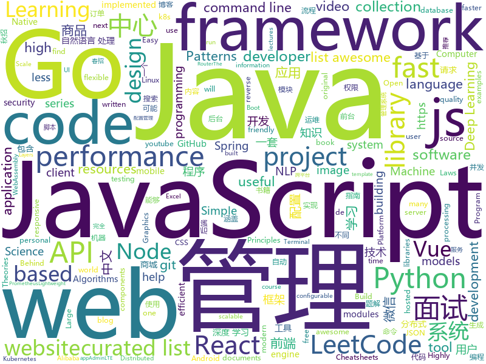

# 2019-05-31
See what the GitHub community is most excited about today.

## python
* [Python](https://github.com/TheAlgorithms/Python)(**270 stars today**): All Algorithms implemented in Python
* [BlueKeep](https://github.com/Ekultek/BlueKeep)(**210 stars today**): Proof of concept for CVE-2019-0708
* [SMRCToolkit](https://github.com/sogou/SMRCToolkit)(**155 stars today**): This toolkit was designed for the fast and efficient development of modern machine comprehension models, including both published models and original prototypes.
* [open_model_zoo](https://github.com/opencv/open_model_zoo)(**98 stars today**): Pre-trained Deep Learning models and samples (high quality and extremely fast)
* [AiLearning](https://github.com/apachecn/AiLearning)(**73 stars today**): AiLearning: 机器学习 - MachineLearning - ML、深度学习 - DeepLearning - DL、自然语言处理 NLP
* [models](https://github.com/tensorflow/models)(**63 stars today**): Models and examples built with TensorFlow
* [idea_exploit](https://github.com/lijiejie/idea_exploit)(**74 stars today**): Gather sensitive information from (.idea) folder for pentesters
* [opendevops](https://github.com/opendevops-cn/opendevops)(**70 stars today**): CODO是为用户提供企业多混合云、自动化运维、完全开源的云管理平台
* [pugsql](https://github.com/mcfunley/pugsql)(**75 stars today**): A HugSQL-inspired database library for Python
* [PySnooper](https://github.com/cool-RR/PySnooper)(**67 stars today**): Never use print for debugging again
* [system-design-primer](https://github.com/donnemartin/system-design-primer)(**61 stars today**): Learn how to design large-scale systems. Prep for the system design interview. Includes Anki flashcards.
* [youtube-dl](https://github.com/ytdl-org/youtube-dl)(**61 stars today**): Command-line program to download videos from YouTube.com and other video sites
* [awesome-python](https://github.com/vinta/awesome-python)(**53 stars today**): A curated list of awesome Python frameworks, libraries, software and resources
* [faceswap](https://github.com/deepfakes/faceswap)(**50 stars today**): Non official project based on original /r/Deepfakes thread. Many thanks to him!
* [cpython](https://github.com/python/cpython)(**45 stars today**): The Python programming language
* [public-apis](https://github.com/toddmotto/public-apis)(**49 stars today**): A collective list of free APIs for use in software and web development.
* [TeamViewer-Free](https://github.com/itgoyo/TeamViewer-Free)(**43 stars today**): Mac/Windows TeamViewer 破解版，解除被检测出商业用途限制
* [CheatSheetSeries](https://github.com/OWASP/CheatSheetSeries)(**48 stars today**): The OWASP Cheat Sheet Series was created to provide a concise collection of high value information on specific application security topics.
* [you-get](https://github.com/soimort/you-get)(**42 stars today**): ⏬Dumb downloader that scrapes the web
* [django](https://github.com/django/django)(**38 stars today**): The Web framework for perfectionists with deadlines.
* [face_recognition](https://github.com/ageitgey/face_recognition)(**36 stars today**): The world's simplest facial recognition api for Python and the command line
* [qmnist](https://github.com/facebookresearch/qmnist)(**39 stars today**): The QMNIST dataset
* [black](https://github.com/python/black)(**36 stars today**): The uncompromising Python code formatter
* [Algorithm_Interview_Notes-Chinese](https://github.com/imhuay/Algorithm_Interview_Notes-Chinese)(**32 stars today**): 2018/2019/校招/春招/秋招/算法/机器学习(Machine Learning)/深度学习(Deep Learning)/自然语言处理(NLP)/C/C++/Python/面试笔记
* [graphics](https://github.com/tensorflow/graphics)(**34 stars today**): TensorFlow Graphics: Differentiable Graphics Layers for TensorFlow

## java
* [LeetCodeAnimation](https://github.com/MisterBooo/LeetCodeAnimation)(**262 stars today**): Demonstrate all the questions on LeetCode in the form of animation.（用动画的形式呈现解LeetCode题目的思路）
* [JavaGuide](https://github.com/Snailclimb/JavaGuide)(**186 stars today**): 【Java学习+面试指南】 一份涵盖大部分Java程序员所需要掌握的核心知识。
* [CS-Notes](https://github.com/CyC2018/CS-Notes)(**173 stars today**): 📚技术面试必备基础知识、Leetcode 题解、后端面试、Java 面试、春招、秋招、操作系统、计算机网络、系统设计
* [mall](https://github.com/macrozheng/mall)(**144 stars today**): mall项目是一套电商系统，包括前台商城系统及后台管理系统，基于SpringBoot+MyBatis实现。 前台商城系统包含首页门户、商品推荐、商品搜索、商品展示、购物车、订单流程、会员中心、客户服务、帮助中心等模块。 后台管理系统包含商品管理、订单管理、会员管理、促销管理、运营管理、内容管理、统计报表、财务管理、权限管理、设置等模块。
* [cloud-template](https://github.com/TyCoding/cloud-template)(**119 stars today**): 😆基于SpringCloud开发的一套极简的分布式微服务项目，使用Vue+Nodejs前后端分离，实现分布式注册中心Eureka、熔断器Hystrix、路由网关Zuul、配置中心Config、链路追踪ZipKin、监控中心SpringBootAdmin
* [advanced-java](https://github.com/doocs/advanced-java)(**93 stars today**): 😮互联网 Java 工程师进阶知识完全扫盲：涵盖高并发、分布式、高可用、微服务等领域知识
* [easyexcel](https://github.com/alibaba/easyexcel)(**93 stars today**): 快速、简单避免OOM的java处理Excel工具
* [skywalking](https://github.com/apache/skywalking)(**69 stars today**): APM, Application Performance Monitoring System
* [spring-boot](https://github.com/spring-projects/spring-boot)(**59 stars today**): Spring Boot
* [halo](https://github.com/halo-dev/halo)(**56 stars today**): ✍ Halo 可能是最好的 Java 博客系统
* [FocusLayoutManager](https://github.com/CCY0122/FocusLayoutManager)(**63 stars today**): 有焦点item的水平/垂直滚动RecyclerView-LayoutManager。仿Android豆瓣书影音“推荐“频道列表布局
* [APIJSON](https://github.com/APIJSON/APIJSON)(**59 stars today**): 🏆Gitee Most Valuable Project🚀A JSON Transmission Protocol and an ORM Library for auto providing APIs and Documents.
* [spring-framework](https://github.com/spring-projects/spring-framework)(**43 stars today**): Spring Framework
* [tutorials](https://github.com/eugenp/tutorials)(**30 stars today**): The "REST With Spring" Course:
* [dubbo](https://github.com/apache/dubbo)(**39 stars today**): Apache Dubbo is a high-performance, java based, open source RPC framework.
* [apollo](https://github.com/ctripcorp/apollo)(**39 stars today**): Apollo（阿波罗）是携程框架部门研发的分布式配置中心，能够集中化管理应用不同环境、不同集群的配置，配置修改后能够实时推送到应用端，并且具备规范的权限、流程治理等特性，适用于微服务配置管理场景。
* [Java](https://github.com/TheAlgorithms/Java)(**34 stars today**): All Algorithms implemented in Java
* [RxHttp](https://github.com/liujingxing/RxHttp)(**41 stars today**): OkHttp+RxJava 一条链发送请求，Activity/Fragment销毁 自动关闭未完成的请求，新一代Http请求神器
* [java-design-patterns](https://github.com/iluwatar/java-design-patterns)(**37 stars today**): Design patterns implemented in Java
* [hutool](https://github.com/looly/hutool)(**36 stars today**): A set of tools that keep Java sweet.
* [okhttp](https://github.com/square/okhttp)(**39 stars today**): An HTTP+HTTP/2 client for Android and Java applications.
* [elasticsearch](https://github.com/elastic/elasticsearch)(**32 stars today**): Open Source, Distributed, RESTful Search Engine
* [HanLP](https://github.com/hankcs/HanLP)(**35 stars today**): 自然语言处理 中文分词 词性标注 命名实体识别 依存句法分析 新词发现 关键词短语提取 自动摘要 文本分类聚类 拼音简繁
* [litemall](https://github.com/linlinjava/litemall)(**29 stars today**): 又一个小商城。litemall = Spring Boot后端 + Vue管理员前端 + 微信小程序用户前端 + Vue用户移动端
* [arthas](https://github.com/alibaba/arthas)(**32 stars today**): Alibaba Java Diagnostic Tool Arthas/Alibaba Java诊断利器Arthas

## unknown
* [the-art-of-command-line](https://github.com/jlevy/the-art-of-command-line)(**395 stars today**): Master the command line, in one page
* [awesome-scalability](https://github.com/binhnguyennus/awesome-scalability)(**321 stars today**): The Patterns Behind Scalable, Reliable, and Performant Large-Scale Systems
* [PHP-Interview-QA](https://github.com/colinlet/PHP-Interview-QA)(**154 stars today**): PHP面试问答
* [free-programming-books](https://github.com/EbookFoundation/free-programming-books)(**132 stars today**): 📚Freely available programming books
* [build-your-own-x](https://github.com/danistefanovic/build-your-own-x)(**118 stars today**): 🤓Build your own (insert technology here)
* [awesome-quantum-computing](https://github.com/desireevl/awesome-quantum-computing)(**109 stars today**): A curated list of awesome quantum computing learning and developing resources.
* [hacker-laws](https://github.com/dwmkerr/hacker-laws)(**94 stars today**): 💻📖Laws, Theories, Principles and Patterns that developers will find useful. #hackerlaws
* [awesome-nonsan](https://github.com/krta2/awesome-nonsan)(**85 stars today**): 🔫논산 육군훈련소에 대한 정보와 팁
* [awesome](https://github.com/sindresorhus/awesome)(**77 stars today**): 😎Awesome lists about all kinds of interesting topics
* [developer-roadmap](https://github.com/kamranahmedse/developer-roadmap)(**69 stars today**): Roadmap to becoming a web developer in 2019
* [You-Dont-Know-JS](https://github.com/getify/You-Dont-Know-JS)(**59 stars today**): A book series on JavaScript. @YDKJS on twitter.
* [cs-video-courses](https://github.com/Developer-Y/cs-video-courses)(**66 stars today**): List of Computer Science courses with video lectures.
* [coding-interview-university](https://github.com/jwasham/coding-interview-university)(**54 stars today**): A complete computer science study plan to become a software engineer.
* [gitignore](https://github.com/github/gitignore)(**40 stars today**): A collection of useful .gitignore templates
* [android-developer-roadmap](https://github.com/anacoimbrag/android-developer-roadmap)(**56 stars today**): Android Developer Roadmap 2019
* [architect-awesome](https://github.com/xingshaocheng/architect-awesome)(**48 stars today**): 后端架构师技术图谱
* [free-programming-books-zh_CN](https://github.com/justjavac/free-programming-books-zh_CN)(**48 stars today**): 📚免费的计算机编程类中文书籍，欢迎投稿
* [deep-learning-drizzle](https://github.com/kmario23/deep-learning-drizzle)(**37 stars today**): Drench yourself in Deep Learning, Reinforcement Learning, Machine Learning, Computer Vision, and NLP by learning from these exciting lectures!!
* [stanford-cs-221-artificial-intelligence](https://github.com/afshinea/stanford-cs-221-artificial-intelligence)(**43 stars today**): VIP cheatsheets for Stanford's CS 221 Artificial Intelligence
* [awesome-programming-books](https://github.com/royeo/awesome-programming-books)(**40 stars today**): 📚经典技术书籍 PDF 文件，持续更新...
* [ds-cheatsheets](https://github.com/FavioVazquez/ds-cheatsheets)(**37 stars today**): List of Data Science Cheatsheets to rule the world
* [awesome-code-review](https://github.com/joho/awesome-code-review)(**40 stars today**): An "Awesome" list of code review resources - articles, papers, tools, etc
* [awesome-nlp](https://github.com/keon/awesome-nlp)(**38 stars today**): 📖A curated list of resources dedicated to Natural Language Processing (NLP)
* [hosts](https://github.com/googlehosts/hosts)(**34 stars today**): 镜像：https://coding.net/u/scaffrey/p/hosts/git
* [hacker-laws-zh](https://github.com/nusr/hacker-laws-zh)(**40 stars today**): 💻📖Laws, Theories, Principles and Patterns that developers will find useful. (对开发人员有用的定律、理论、原则和模式。)

## javascript
* [zdog](https://github.com/metafizzy/zdog)(**1,040 stars today**): Flat, round, designer-friendly pseudo-3D engine
* [algorithm-visualizer](https://github.com/algorithm-visualizer/algorithm-visualizer)(**606 stars today**): 🎆Interactive Online Platform that Visualizes Algorithms from Code
* [FunctionScript](https://github.com/FunctionScript/FunctionScript)(**372 stars today**): A language and specification for turning JavaScript functions into typed HTTP APIs
* [leetcode](https://github.com/azl397985856/leetcode)(**139 stars today**): LeetCode Solutions: A Record of My Problem Solving Journey.( leetcode题解，记录自己的leetcode解题之路。)
* [vue](https://github.com/vuejs/vue)(**126 stars today**): 🖖Vue.js is a progressive, incrementally-adoptable JavaScript framework for building UI on the web.
* [hyper](https://github.com/zeit/hyper)(**118 stars today**): A terminal built on web technologies
* [jtools](https://github.com/paulhodel/jtools)(**120 stars today**): jTools is a collection of lightweight common required javascript web components. It is composed of fully responsive vanilla plugins to help you bring the best user experience to your projects, independent of the platform.
* [AdNauseam](https://github.com/dhowe/AdNauseam)(**119 stars today**): AdNauseam: Fight back against advertising surveillance
* [youtube-dl-interactive](https://github.com/synox/youtube-dl-interactive)(**101 stars today**): Interactively select the quality and format for youtube-dl
* [axios](https://github.com/axios/axios)(**90 stars today**): Promise based HTTP client for the browser and node.js
* [alita](https://github.com/areslabs/alita)(**86 stars today**): 一套把React Native代码转换成微信小程序代码的转换引擎工具
* [react](https://github.com/facebook/react)(**76 stars today**): A declarative, efficient, and flexible JavaScript library for building user interfaces.
* [imgsquash](https://github.com/eashish93/imgsquash)(**81 stars today**): Simple image compression full website code written in node, react and next.js framework. Easy to deploy as a microservice.
* [gitfolio](https://github.com/imfunniee/gitfolio)(**73 stars today**): personal website + blog for every github user
* [mini-github](https://github.com/kezhenxu94/mini-github)(**71 stars today**): GitHub WeChat Mini Program (可能是功能最全的 GitHub 微信小程序)
* [webpack](https://github.com/webpack/webpack)(**68 stars today**): A bundler for javascript and friends. Packs many modules into a few bundled assets. Code Splitting allows for loading parts of the application on demand. Through "loaders", modules can be CommonJs, AMD, ES6 modules, CSS, Images, JSON, Coffeescript, LESS, ... and your custom stuff.
* [30-seconds-of-code](https://github.com/30-seconds/30-seconds-of-code)(**65 stars today**): A curated collection of useful JavaScript snippets that you can understand in 30 seconds or less.
* [material-ui](https://github.com/mui-org/material-ui)(**52 stars today**): React components for faster and easier web development. Build your own design system, or start with Material Design.
* [taro](https://github.com/NervJS/taro)(**60 stars today**): 多端统一开发框架，支持用 React 的开发方式编写一次代码，生成能运行在微信/百度/支付宝/字节跳动小程序、H5、React Native 等的应用。 https://taro.jd.com/
* [libpku](https://github.com/lib-pku/libpku)(**57 stars today**): 贵校课程资料民间整理
* [baiduyun](https://github.com/syhyz1990/baiduyun)(**57 stars today**): 🖖油猴脚本 一个脚本搞定百度网盘下载
* [node](https://github.com/nodejs/node)(**52 stars today**): Node.js JavaScript runtime✨🐢🚀✨
* [puppeteer](https://github.com/GoogleChrome/puppeteer)(**54 stars today**): Headless Chrome Node API
* [uBlock](https://github.com/gorhill/uBlock)(**56 stars today**): uBlock Origin - An efficient blocker for Chromium and Firefox. Fast and lean.
* [uni-app](https://github.com/dcloudio/uni-app)(**55 stars today**): 使用 Vue.js 开发跨平台应用的前端框架

## html
* [linux-command](https://github.com/jaywcjlove/linux-command)(**72 stars today**): Linux命令大全搜索工具，内容包含Linux命令手册、详解、学习、搜集。https://git.io/linux
* [comicgen](https://github.com/gramener/comicgen)(**30 stars today**): Create comics for your website or app
* [AdminLTE](https://github.com/ColorlibHQ/AdminLTE)(**24 stars today**): AdminLTE - Free Premium Admin control Panel Theme Based On Bootstrap 3.x
* [nndl.github.io](https://github.com/nndl/nndl.github.io)(**23 stars today**): 《神经网络与深度学习》 Neural Network and Deep Learning
* [flutter-in-action](https://github.com/flutterchina/flutter-in-action)(**19 stars today**): 《Flutter实战》电子书
* [owasp-mstg](https://github.com/OWASP/owasp-mstg)(**21 stars today**): The Mobile Security Testing Guide (MSTG) is a comprehensive manual for mobile app security development, testing and reverse engineering.
* [endoflife.date](https://github.com/captn3m0/endoflife.date)(**19 stars today**): Informative site with EoL dates of everything
* [Spoon-Knife](https://github.com/octocat/Spoon-Knife)(****): This repo is for demonstration purposes only.
* [portainer](https://github.com/portainer/portainer)(**16 stars today**): Simple management UI for Docker
* [cs231n.github.io](https://github.com/cs231n/cs231n.github.io)(**12 stars today**): Public facing notes page
* [en.javascript.info](https://github.com/javascript-tutorial/en.javascript.info)(**12 stars today**): Modern JavaScript Tutorial
* [fastText](https://github.com/facebookresearch/fastText)(**12 stars today**): Library for fast text representation and classification.
* [nataliemarleny.github.io](https://github.com/nataliemarleny/nataliemarleny.github.io)(**13 stars today**): A Githubbified Resume using Primer CSS, a d3.js customised heatmap and illustrated with Figma
* [hyperblog](https://github.com/freddier/hyperblog)(**8 stars today**): Un blog increíble para el curso de Git y Github de Platzi
* [wysiwyg-editor](https://github.com/froala/wysiwyg-editor)(**12 stars today**): The next generation Javascript WYSIWYG HTML Editor.
* [personal-website](https://github.com/github/personal-website)(**8 stars today**): Code that'll help you kickstart a personal website that showcases your work as a software developer.
* [Iosevka](https://github.com/be5invis/Iosevka)(**9 stars today**): Slender typeface for code, from code.
* [all-contributors](https://github.com/all-contributors/all-contributors)(**8 stars today**): ✨Recognize all contributors, not just the ones who push code✨
* [awesome-modern-cpp](https://github.com/rigtorp/awesome-modern-cpp)(**8 stars today**): A collection of resources on modern C++
* [my_blog](https://github.com/shengxinjing/my_blog)(**6 stars today**): 🐌写一点博客，python web 前端 运维
* [now-github-starter](https://github.com/zeit/now-github-starter)(****): Starter project to demonstrate a project whose pull requests get automatically deployed
* [swagger-codegen](https://github.com/swagger-api/swagger-codegen)(**6 stars today**): swagger-codegen contains a template-driven engine to generate documentation, API clients and server stubs in different languages by parsing your OpenAPI / Swagger definition.
* [awesome-angular](https://github.com/PatrickJS/awesome-angular)(**7 stars today**): 📄A curated list of awesome Angular resources
* [devops-essentials-sample-app](https://github.com/linuxacademy/devops-essentials-sample-app)(****): 
* [speedtest](https://github.com/adolfintel/speedtest)(**6 stars today**): Self-hosted HTML5 Speedtest. Easy setup, examples, configurable, responsive and mobile friendly. Supports PHP, Node, and more.

## go
* [ojichat](https://github.com/greymd/ojichat)(**373 stars today**): おじさんがLINEやメールで送ってきそうな文を生成する
* [go-ext-wasm](https://github.com/wasmerio/go-ext-wasm)(**261 stars today**): 🐹🕸️Go library to run WebAssembly binaries.
* [unioffice](https://github.com/unidoc/unioffice)(**146 stars today**): Pure go library for creating and processing Office Word (.docx), Excel (.xlsx) and Powerpoint (.pptx) documents
* [annie](https://github.com/iawia002/annie)(**66 stars today**): 👾Fast, simple and clean video downloader
* [xuperunion](https://github.com/xuperchain/xuperunion)(**59 stars today**): A highly flexible blockchain architecture with great transaction performance.
* [kubernetes](https://github.com/kubernetes/kubernetes)(**55 stars today**): Production-Grade Container Scheduling and Management
* [go](https://github.com/golang/go)(**53 stars today**): The Go programming language
* [dive-to-gosync-workshop](https://github.com/smallnest/dive-to-gosync-workshop)(**52 stars today**): 深入Go并发编程研讨课
* [VictoriaMetrics](https://github.com/VictoriaMetrics/VictoriaMetrics)(**54 stars today**): VictoriaMetrics - high-performance, cost-effective and scalable time series database, long-term remote storage for Prometheus
* [k3s](https://github.com/rancher/k3s)(**47 stars today**): Lightweight Kubernetes. 5 less than k8s.
* [devdash](https://github.com/Phantas0s/devdash)(**49 stars today**): 🍱Highly Configurable Terminal Dashboard for Developers
* [frp](https://github.com/fatedier/frp)(**45 stars today**): A fast reverse proxy to help you expose a local server behind a NAT or firewall to the internet.
* [awesome-go](https://github.com/avelino/awesome-go)(**43 stars today**): A curated list of awesome Go frameworks, libraries and software
* [fzf](https://github.com/junegunn/fzf)(**46 stars today**): 🌸A command-line fuzzy finder
* [offlinenotepad](https://github.com/schollz/offlinenotepad)(**42 stars today**): An offline-first, secure, private notepad.📔✏️
* [tinygo](https://github.com/tinygo-org/tinygo)(**38 stars today**): Go compiler for small places. Microcontrollers, WebAssembly, and command-line tools. Based on LLVM.
* [minikube](https://github.com/kubernetes/minikube)(**36 stars today**): Run Kubernetes locally
* [gin](https://github.com/gin-gonic/gin)(**31 stars today**): Gin is a HTTP web framework written in Go (Golang). It features a Martini-like API with much better performance -- up to 40 times faster. If you need smashing performance, get yourself some Gin.
* [easy-rollback](https://github.com/Trendyol/easy-rollback)(**34 stars today**): ♻️Now you can easily rollback to previous deployed images whatever you want on k8s environment
* [expr](https://github.com/antonmedv/expr)(**33 stars today**): Evaluate expression in Go
* [traefik](https://github.com/containous/traefik)(**28 stars today**): The Cloud Native Edge Router
* [hugo](https://github.com/gohugoio/hugo)(**25 stars today**): The world’s fastest framework for building websites.
* [dolphin](https://github.com/2SE/dolphin)(**28 stars today**): Distributed API Gateway
* [gitea](https://github.com/go-gitea/gitea)(**27 stars today**): Git with a cup of tea, painless self-hosted git service
* [the-way-to-go_ZH_CN](https://github.com/Unknwon/the-way-to-go_ZH_CN)(**23 stars today**): 《The Way to Go》中文译本，中文正式名《Go 入门指南》

## WordCloud

