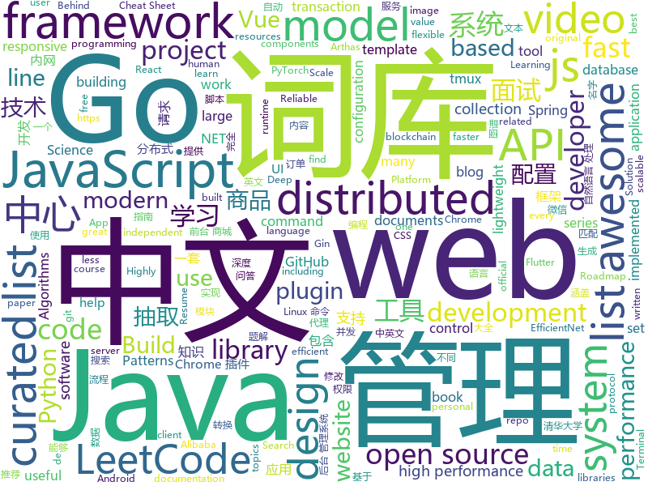

# 2019-06-01
See what the GitHub community is most excited about today.

## python
* [Python](https://github.com/TheAlgorithms/Python)(**223 stars today**): All Algorithms implemented in Python
* [BlueKeep](https://github.com/Ekultek/BlueKeep)(**205 stars today**): Proof of concept for CVE-2019-0708
* [CVE-2019-0708](https://github.com/n1xbyte/CVE-2019-0708)(**122 stars today**): dump
* [opendevops](https://github.com/opendevops-cn/opendevops)(**92 stars today**): CODO是为用户提供企业多混合云、自动化运维、完全开源的云管理平台
* [pytorch-image-models](https://github.com/rwightman/pytorch-image-models)(**94 stars today**): PyTorch image models, scripts, pretrained weights -- (SE)ResNet/ResNeXT, DPN, EfficientNet, MobileNet-V3/V2/V1, MNASNet, Single-Path NAS, FBNet, and more
* [system-design-primer](https://github.com/donnemartin/system-design-primer)(**73 stars today**): Learn how to design large-scale systems. Prep for the system design interview. Includes Anki flashcards.
* [ChromeAppHeroes](https://github.com/zhaoolee/ChromeAppHeroes)(**76 stars today**): 🌈谷粒-Chrome插件英雄榜, 为优秀的Chrome插件写一本中文说明书, 让Chrome插件英雄们造福人类~ ChromePluginHeroes, Write a Chinese manual for the excellent Chrome plugin, let the Chrome plugin heroes benefit the human~
* [public-apis](https://github.com/toddmotto/public-apis)(**69 stars today**): A collective list of free APIs for use in software and web development.
* [BitGlitter](https://github.com/MarkMichon1/BitGlitter)(**73 stars today**): ⚡ Embed data payloads inside of ordinary images or video with high-performance 2-D barcodes.
* [SMRCToolkit](https://github.com/sogou/SMRCToolkit)(**64 stars today**): This toolkit was designed for the fast and efficient development of modern machine comprehension models, including both published models and original prototypes.
* [bluekeep_CVE-2019-0708_poc_to_exploit](https://github.com/algo7/bluekeep_CVE-2019-0708_poc_to_exploit)(**52 stars today**): Porting BlueKeep PoC from @Ekultek to actual exploits
* [faceswap](https://github.com/deepfakes/faceswap)(**52 stars today**): Non official project based on original /r/Deepfakes thread. Many thanks to him!
* [models](https://github.com/tensorflow/models)(**45 stars today**): Models and examples built with TensorFlow
* [AiLearning](https://github.com/apachecn/AiLearning)(**53 stars today**): AiLearning: 机器学习 - MachineLearning - ML、深度学习 - DeepLearning - DL、自然语言处理 NLP
* [efficientnet](https://github.com/qubvel/efficientnet)(**56 stars today**): Implementation on EfficientNet model. Keras.
* [awesome-python](https://github.com/vinta/awesome-python)(**47 stars today**): A curated list of awesome Python frameworks, libraries, software and resources
* [youtube-dl](https://github.com/ytdl-org/youtube-dl)(**47 stars today**): Command-line program to download videos from YouTube.com and other video sites
* [PySnooper](https://github.com/cool-RR/PySnooper)(**47 stars today**): Never use print for debugging again
* [bert](https://github.com/google-research/bert)(**40 stars today**): TensorFlow code and pre-trained models for BERT
* [face_recognition](https://github.com/ageitgey/face_recognition)(**36 stars today**): The world's simplest facial recognition api for Python and the command line
* [flask](https://github.com/pallets/flask)(**26 stars today**): The Python micro framework for building web applications.
* [keras](https://github.com/keras-team/keras)(**34 stars today**): Deep Learning for humans
* [funNLP](https://github.com/fighting41love/funNLP)(**33 stars today**): 中英文敏感词、语言检测、中外手机/电话归属地/运营商查询、名字推断性别、手机号抽取、身份证抽取、邮箱抽取、中日文人名库、中文缩写库、拆字词典、词汇情感值、停用词、反动词表、暴恐词表、繁简体转换、英文模拟中文发音、汪峰歌词生成器、职业名称词库、同义词库、反义词库、否定词库、汽车品牌词库、汽车零件词库、连续英文切割、各种中文词向量、公司名字大全、古诗词库、IT词库、财经词库、成语词库、地名词库、历史名人词库、诗词词库、医学词库、饮食词库、法律词库、汽车词库、动物词库、中文聊天语料、中文谣言数据、百度中文问答数据集、句子相似度匹配算法集合、bert资源、文本生成&摘要相关工具、cocoNLP信息抽取工具、国内电话号码正则匹配、清华大学XLORE:中英文跨语言百科知识图谱、清华大学人工智能技术…
* [CheatSheetSeries](https://github.com/OWASP/CheatSheetSeries)(**34 stars today**): The OWASP Cheat Sheet Series was created to provide a concise collection of high value information on specific application security topics.
* [black](https://github.com/python/black)(**31 stars today**): The uncompromising Python code formatter

## java
* [LeetCodeAnimation](https://github.com/MisterBooo/LeetCodeAnimation)(**261 stars today**): Demonstrate all the questions on LeetCode in the form of animation.（用动画的形式呈现解LeetCode题目的思路）
* [JavaGuide](https://github.com/Snailclimb/JavaGuide)(**140 stars today**): 【Java学习+面试指南】 一份涵盖大部分Java程序员所需要掌握的核心知识。
* [CS-Notes](https://github.com/CyC2018/CS-Notes)(**133 stars today**): 📚技术面试必备基础知识、Leetcode 题解、后端面试、Java 面试、春招、秋招、操作系统、计算机网络、系统设计
* [mall](https://github.com/macrozheng/mall)(**106 stars today**): mall项目是一套电商系统，包括前台商城系统及后台管理系统，基于SpringBoot+MyBatis实现。 前台商城系统包含首页门户、商品推荐、商品搜索、商品展示、购物车、订单流程、会员中心、客户服务、帮助中心等模块。 后台管理系统包含商品管理、订单管理、会员管理、促销管理、运营管理、内容管理、统计报表、财务管理、权限管理、设置等模块。
* [advanced-java](https://github.com/doocs/advanced-java)(**86 stars today**): 😮互联网 Java 工程师进阶知识完全扫盲：涵盖高并发、分布式、高可用、微服务等领域知识
* [HanLP](https://github.com/hankcs/HanLP)(**69 stars today**): 自然语言处理 中文分词 词性标注 命名实体识别 依存句法分析 新词发现 关键词短语提取 自动摘要 文本分类聚类 拼音简繁
* [RxHttp](https://github.com/liujingxing/RxHttp)(**62 stars today**): OkHttp+RxJava 一条链发送请求，Activity/Fragment销毁 自动关闭未完成的请求，新一代Http请求神器
* [halo](https://github.com/halo-dev/halo)(**50 stars today**): ✍ Halo 可能是最好的 Java 博客系统
* [spring-boot](https://github.com/spring-projects/spring-boot)(**37 stars today**): Spring Boot
* [learnxinyminutes-docs](https://github.com/adambard/learnxinyminutes-docs)(**43 stars today**): Code documentation written as code! How novel and totally my idea!
* [Java](https://github.com/TheAlgorithms/Java)(**38 stars today**): All Algorithms implemented in Java
* [FocusLayoutManager](https://github.com/CCY0122/FocusLayoutManager)(**42 stars today**): 有焦点item的水平/垂直滚动RecyclerView-LayoutManager。仿Android豆瓣书影音“推荐“频道列表布局
* [java-design-patterns](https://github.com/iluwatar/java-design-patterns)(**36 stars today**): Design patterns implemented in Java
* [dubbo](https://github.com/apache/dubbo)(**37 stars today**): Apache Dubbo is a high-performance, java based, open source RPC framework.
* [tutorials](https://github.com/eugenp/tutorials)(**22 stars today**): The "REST With Spring" Course:
* [spring-framework](https://github.com/spring-projects/spring-framework)(**29 stars today**): Spring Framework
* [apollo](https://github.com/ctripcorp/apollo)(**33 stars today**): Apollo（阿波罗）是携程框架部门研发的分布式配置中心，能够集中化管理应用不同环境、不同集群的配置，配置修改后能够实时推送到应用端，并且具备规范的权限、流程治理等特性，适用于微服务配置管理场景。
* [APIJSON](https://github.com/APIJSON/APIJSON)(**37 stars today**): 🏆Gitee Most Valuable Project🚀A JSON Transmission Protocol and an ORM Library for auto providing APIs and Documents.
* [arthas](https://github.com/alibaba/arthas)(**35 stars today**): Alibaba Java Diagnostic Tool Arthas/Alibaba Java诊断利器Arthas
* [cloud-template](https://github.com/TyCoding/cloud-template)(**33 stars today**): 😆基于SpringCloud开发的一套极简的分布式微服务项目，使用Vue+Nodejs前后端分离，实现分布式注册中心Eureka、熔断器Hystrix、路由网关Zuul、配置中心Config、链路追踪ZipKin、监控中心SpringBootAdmin
* [elasticsearch](https://github.com/elastic/elasticsearch)(**32 stars today**): Open Source, Distributed, RESTful Search Engine
* [hutool](https://github.com/looly/hutool)(**30 stars today**): A set of tools that keep Java sweet.
* [skywalking](https://github.com/apache/skywalking)(**32 stars today**): APM, Application Performance Monitoring System
* [seata](https://github.com/seata/seata)(**25 stars today**): 🔥Seata is an easy-to-use, high-performance, open source distributed transaction solution.
* [IntelliJ-Key-Promoter-X](https://github.com/halirutan/IntelliJ-Key-Promoter-X)(**30 stars today**): Modern IntelliJ plugin to learn shortcuts for buttons

## unknown
* [the-art-of-command-line](https://github.com/jlevy/the-art-of-command-line)(**347 stars today**): Master the command line, in one page
* [awesome-scalability](https://github.com/binhnguyennus/awesome-scalability)(**258 stars today**): The Patterns Behind Scalable, Reliable, and Performant Large-Scale Systems
* [PHP-Interview-QA](https://github.com/colinlet/PHP-Interview-QA)(**162 stars today**): PHP面试问答
* [ds-cheatsheets](https://github.com/FavioVazquez/ds-cheatsheets)(**108 stars today**): List of Data Science Cheatsheets to rule the world
* [EfficientNet-PyTorch](https://github.com/lukemelas/EfficientNet-PyTorch)(**84 stars today**): A PyTorch implementation of EfficientNet
* [gitignore](https://github.com/github/gitignore)(**57 stars today**): A collection of useful .gitignore templates
* [free-programming-books](https://github.com/EbookFoundation/free-programming-books)(**73 stars today**): 📚Freely available programming books
* [free-programming-books-zh_CN](https://github.com/justjavac/free-programming-books-zh_CN)(**72 stars today**): 📚免费的计算机编程类中文书籍，欢迎投稿
* [build-your-own-x](https://github.com/danistefanovic/build-your-own-x)(**75 stars today**): 🤓Build your own (insert technology here)
* [You-Dont-Know-JS](https://github.com/getify/You-Dont-Know-JS)(**61 stars today**): A book series on JavaScript. @YDKJS on twitter.
* [hacker-laws](https://github.com/dwmkerr/hacker-laws)(**65 stars today**): 💻📖Laws, Theories, Principles and Patterns that developers will find useful. #hackerlaws
* [awesome](https://github.com/sindresorhus/awesome)(**60 stars today**): 😎Awesome lists about all kinds of interesting topics
* [architect-awesome](https://github.com/xingshaocheng/architect-awesome)(**53 stars today**): 后端架构师技术图谱
* [developer-roadmap](https://github.com/kamranahmedse/developer-roadmap)(**50 stars today**): Roadmap to becoming a web developer in 2019
* [coding-interview-university](https://github.com/jwasham/coding-interview-university)(**48 stars today**): A complete computer science study plan to become a software engineer.
* [OSCP-Archives](https://github.com/CyDefUnicorn/OSCP-Archives)(**47 stars today**): An archive of everything related to OSCP
* [awesome-opensource-documents](https://github.com/hubtee/awesome-opensource-documents)(**48 stars today**): 📘A curated list of awesome open source or open source licensed documents, guides, books.
* [android-developer-roadmap](https://github.com/anacoimbrag/android-developer-roadmap)(**46 stars today**): Android Developer Roadmap 2019
* [cs-video-courses](https://github.com/Developer-Y/cs-video-courses)(**45 stars today**): List of Computer Science courses with video lectures.
* [GZXTaoBaoAppFlutter](https://github.com/GanZhiXiong/GZXTaoBaoAppFlutter)(**43 stars today**): 这个一个用Flutter开发仿淘宝的App
* [weekly](https://github.com/ruanyf/weekly)(**39 stars today**): 技术分享周刊，每周五发布
* [ICRA2019-paper-list](https://github.com/PaoPaoRobot/ICRA2019-paper-list)(**32 stars today**): ICRA2019 paper list from PaopaoRobot
* [awesome-quantum-computing](https://github.com/desireevl/awesome-quantum-computing)(**35 stars today**): A curated list of awesome quantum computing learning and developing resources.
* [.tmux](https://github.com/gpakosz/.tmux)(**33 stars today**): 🇫🇷Oh My Tmux! Pretty & versatile tmux configuration made with❤️(imho the best tmux configuration that just works)
* [awesome-vue](https://github.com/vuejs/awesome-vue)(**31 stars today**): 🎉A curated list of awesome things related to Vue.js

## javascript
* [algorithm-visualizer](https://github.com/algorithm-visualizer/algorithm-visualizer)(**844 stars today**): 🎆Interactive Online Platform that Visualizes Algorithms from Code
* [zdog](https://github.com/metafizzy/zdog)(**590 stars today**): Flat, round, designer-friendly pseudo-3D engine
* [medium-to-own-blog](https://github.com/mathieudutour/medium-to-own-blog)(**450 stars today**): Switch from Medium to your own blog in a few minutes
* [FunctionScript](https://github.com/FunctionScript/FunctionScript)(**319 stars today**): A language and specification for turning JavaScript functions into typed HTTP APIs
* [hyper](https://github.com/zeit/hyper)(**245 stars today**): A terminal built on web technologies
* [leetcode](https://github.com/azl397985856/leetcode)(**147 stars today**): LeetCode Solutions: A Record of My Problem Solving Journey.( leetcode题解，记录自己的leetcode解题之路。)
* [vue](https://github.com/vuejs/vue)(**126 stars today**): 🖖Vue.js is a progressive, incrementally-adoptable JavaScript framework for building UI on the web.
* [graphql-engine](https://github.com/hasura/graphql-engine)(**142 stars today**): Blazing fast, instant realtime GraphQL APIs on Postgres with fine grained access control, also trigger webhooks on database events.
* [alita](https://github.com/areslabs/alita)(**101 stars today**): 一套把React Native代码转换成微信小程序代码的转换引擎工具。我们不造轮子，不发明新框架，只是提供工具把RN扩展到微信小程序端。
* [nightfall](https://github.com/EYBlockchain/nightfall)(**91 stars today**): EY's Nightfall protocols for private transactions on the Ethereum blockchain using zk-snarks
* [react](https://github.com/facebook/react)(**85 stars today**): A declarative, efficient, and flexible JavaScript library for building user interfaces.
* [PapaParse](https://github.com/mholt/PapaParse)(**85 stars today**): Fast and powerful CSV (delimited text) parser that gracefully handles large files and malformed input
* [react-zdog](https://github.com/drcmda/react-zdog)(**78 stars today**): 🐶React bindings for zdog
* [foliate](https://github.com/johnfactotum/foliate)(**70 stars today**): A simple and modern GTK eBook reader
* [libpku](https://github.com/lib-pku/libpku)(**54 stars today**): 贵校课程资料民间整理
* [30-seconds-of-code](https://github.com/30-seconds/30-seconds-of-code)(**62 stars today**): A curated collection of useful JavaScript snippets that you can understand in 30 seconds or less.
* [axios](https://github.com/axios/axios)(**58 stars today**): Promise based HTTP client for the browser and node.js
* [uni-app](https://github.com/dcloudio/uni-app)(**62 stars today**): 使用 Vue.js 开发跨平台应用的前端框架
* [gitfolio](https://github.com/imfunniee/gitfolio)(**58 stars today**): personal website + blog for every github user
* [material-ui](https://github.com/mui-org/material-ui)(**42 stars today**): React components for faster and easier web development. Build your own design system, or start with Material Design.
* [baiduyun](https://github.com/syhyz1990/baiduyun)(**54 stars today**): 🖖油猴脚本 一个脚本搞定百度网盘下载
* [hedgehog](https://github.com/AudiusProject/hedgehog)(**50 stars today**): 🦔 Build DApps like Apps -- A Metamask alternative that empowers you to build good UX
* [javascript](https://github.com/airbnb/javascript)(**45 stars today**): JavaScript Style Guide
* [node](https://github.com/nodejs/node)(**43 stars today**): Node.js JavaScript runtime✨🐢🚀✨
* [jtools](https://github.com/paulhodel/jtools)(**50 stars today**): jTools is a collection of lightweight common required javascript web components. It is composed of fully responsive vanilla plugins to help you bring the best user experience to your projects, independent of the platform.

## html
* [linux-command](https://github.com/jaywcjlove/linux-command)(**52 stars today**): Linux命令大全搜索工具，内容包含Linux命令手册、详解、学习、搜集。https://git.io/linux
* [Spoon-Knife](https://github.com/octocat/Spoon-Knife)(****): This repo is for demonstration purposes only.
* [universal-resume](https://github.com/WebPraktikos/universal-resume)(**36 stars today**): Resume website template that works on a monitor, paper, and phone.
* [flutter-in-action](https://github.com/flutterchina/flutter-in-action)(**30 stars today**): 《Flutter实战》电子书
* [Scala-CheatSheet](https://github.com/riiswa/Scala-CheatSheet)(**19 stars today**): The Biggest Scala Cheat-Sheet.
* [nndl.github.io](https://github.com/nndl/nndl.github.io)(**15 stars today**): 《神经网络与深度学习》 Neural Network and Deep Learning
* [AdminLTE](https://github.com/ColorlibHQ/AdminLTE)(**12 stars today**): AdminLTE - Free Premium Admin control Panel Theme Based On Bootstrap 3.x
* [personal-website](https://github.com/github/personal-website)(**11 stars today**): Code that'll help you kickstart a personal website that showcases your work as a software developer.
* [mikutap](https://github.com/HFIProgramming/mikutap)(**14 stars today**): A Mainland China Friendly and independent version extracted from https://aidn.jp/mikutap
* [portainer](https://github.com/portainer/portainer)(**12 stars today**): Simple management UI for Docker
* [comicgen](https://github.com/gramener/comicgen)(**12 stars today**): Create comics for your website or app
* [swagger-codegen](https://github.com/swagger-api/swagger-codegen)(**10 stars today**): swagger-codegen contains a template-driven engine to generate documentation, API clients and server stubs in different languages by parsing your OpenAPI / Swagger definition.
* [endoflife.date](https://github.com/captn3m0/endoflife.date)(**11 stars today**): Informative site with EoL dates of everything
* [en.javascript.info](https://github.com/javascript-tutorial/en.javascript.info)(**9 stars today**): Modern JavaScript Tutorial
* [scikit-learn-doc-zh](https://github.com/apachecn/scikit-learn-doc-zh)(**8 stars today**): 📖[译] scikit-learn（sklearn） 中文文档
* [dotnet](https://github.com/microsoft/dotnet)(**8 stars today**): This repo is the official home of .NET on GitHub. It's a great starting point to find many .NET OSS projects from Microsoft and the community, including many that are part of the .NET Foundation.
* [devops-essentials-sample-app](https://github.com/linuxacademy/devops-essentials-sample-app)(****): 
* [simple-icons](https://github.com/simple-icons/simple-icons)(**8 stars today**): SVG icons for popular brands
* [hyperblog](https://github.com/freddier/hyperblog)(**5 stars today**): Un blog increíble para el curso de Git y Github de Platzi
* [nataliemarleny.github.io](https://github.com/nataliemarleny/nataliemarleny.github.io)(**7 stars today**): A GitHubbified Resume using Primer CSS, a d3.js customised heatmap and illustrated with Figma
* [pure](https://github.com/pure-css/pure)(**6 stars today**): A set of small, responsive CSS modules that you can use in every web project.
* [awesome-angular](https://github.com/PatrickJS/awesome-angular)(**6 stars today**): 📄A curated list of awesome Angular resources
* [all-contributors](https://github.com/all-contributors/all-contributors)(**6 stars today**): ✨Recognize all contributors, not just the ones who push code✨
* [sourcegraph](https://github.com/sourcegraph/sourcegraph)(**6 stars today**): Code search and navigation tool (self-hosted)
* [luda](https://github.com/oatw/luda)(**6 stars today**): A lightweight and responsive UI framework for modern web development.

## go
* [unioffice](https://github.com/unidoc/unioffice)(**228 stars today**): Pure go library for creating and processing Office Word (.docx), Excel (.xlsx) and Powerpoint (.pptx) documents
* [ojichat](https://github.com/greymd/ojichat)(**175 stars today**): おじさんがLINEやメールで送ってきそうな文を生成する
* [go-ext-wasm](https://github.com/wasmerio/go-ext-wasm)(**130 stars today**): 🐹🕸️Go library to run WebAssembly binaries.
* [go](https://github.com/golang/go)(**61 stars today**): The Go programming language
* [kubernetes](https://github.com/kubernetes/kubernetes)(**49 stars today**): Production-Grade Container Scheduling and Management
* [frp](https://github.com/fatedier/frp)(**52 stars today**): A fast reverse proxy to help you expose a local server behind a NAT or firewall to the internet.
* [annie](https://github.com/iawia002/annie)(**50 stars today**): 👾Fast, simple and clean video downloader
* [viper](https://github.com/spf13/viper)(**43 stars today**): Go configuration with fangs
* [pilosa](https://github.com/pilosa/pilosa)(**44 stars today**): Pilosa is an open source, distributed bitmap index that dramatically accelerates queries across multiple, massive data sets.
* [music-get](https://github.com/winterssy/music-get)(**39 stars today**): 网易云音乐、QQ音乐一键下载工具
* [gin](https://github.com/gin-gonic/gin)(**39 stars today**): Gin is a HTTP web framework written in Go (Golang). It features a Martini-like API with much better performance -- up to 40 times faster. If you need smashing performance, get yourself some Gin.
* [awesome-go](https://github.com/avelino/awesome-go)(**37 stars today**): A curated list of awesome Go frameworks, libraries and software
* [websocket](https://github.com/nhooyr/websocket)(**39 stars today**): A minimal and idiomatic WebSocket library for Go
* [fzf](https://github.com/junegunn/fzf)(**38 stars today**): 🌸A command-line fuzzy finder
* [micro](https://github.com/micro/micro)(**37 stars today**): A microservice development runtime
* [dive-to-gosync-workshop](https://github.com/smallnest/dive-to-gosync-workshop)(**33 stars today**): 深入Go并发编程研讨课
* [k3s](https://github.com/rancher/k3s)(**33 stars today**): Lightweight Kubernetes. 5 less than k8s.
* [tidb](https://github.com/pingcap/tidb)(**31 stars today**): TiDB is a distributed HTAP database compatible with the MySQL protocol
* [VictoriaMetrics](https://github.com/VictoriaMetrics/VictoriaMetrics)(**32 stars today**): VictoriaMetrics - high-performance, cost-effective and scalable time series database, long-term remote storage for Prometheus
* [nps](https://github.com/cnlh/nps)(**28 stars today**): 一款轻量级、功能强大的内网穿透代理服务器。支持tcp、udp流量转发，支持内网http代理、内网socks5代理，同时支持snappy压缩、站点保护、加密传输、多路复用、header修改等。支持web图形化管理，集成多用户模式。
* [istio](https://github.com/istio/istio)(**30 stars today**): Connect, secure, control, and observe services.
* [devdash](https://github.com/Phantas0s/devdash)(**30 stars today**): 🍱Highly Configurable Terminal Dashboard for Developers
* [the-way-to-go_ZH_CN](https://github.com/Unknwon/the-way-to-go_ZH_CN)(**29 stars today**): 《The Way to Go》中文译本，中文正式名《Go 入门指南》
* [xuperunion](https://github.com/xuperchain/xuperunion)(**25 stars today**): A highly flexible blockchain architecture with great transaction performance.
* [etcd](https://github.com/etcd-io/etcd)(**25 stars today**): Distributed reliable key-value store for the most critical data of a distributed system

## WordCloud

