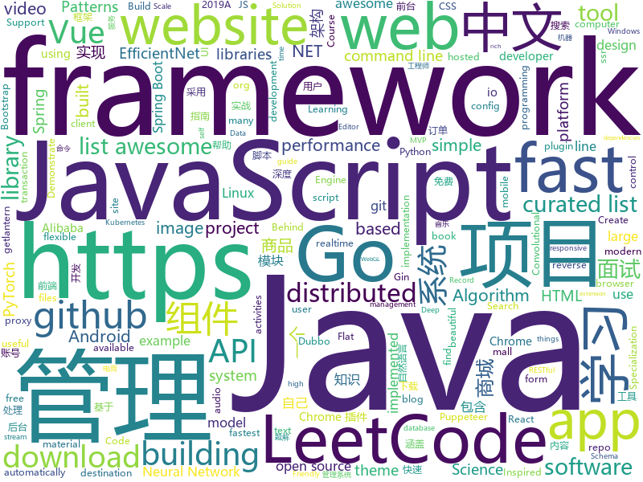

# 2019-06-02
See what the GitHub community is most excited about today.

## python
* [Python](https://github.com/TheAlgorithms/Python)(**142 stars today**): All Algorithms implemented in Python
* [EdgeRealtimeVideoAnalytics](https://github.com/RedisGears/EdgeRealtimeVideoAnalytics)(**146 stars today**): An example of using Redis Streams, RedisGears, RedisAI and RedisTimeSeries for Realtime Video Analytics (i.e. counting people)
* [sunfish](https://github.com/thomasahle/sunfish)(**129 stars today**): Sunfish: a Python Chess Engine in 111 lines of code
* [pytorch-image-models](https://github.com/rwightman/pytorch-image-models)(**113 stars today**): PyTorch image models, scripts, pretrained weights -- (SE)ResNet/ResNeXT, DPN, EfficientNet, MobileNet-V3/V2/V1, MNASNet, Single-Path NAS, FBNet, and more
* [Super-mario-bros-A3C-pytorch](https://github.com/vietnguyen91/Super-mario-bros-A3C-pytorch)(**95 stars today**): Asynchronous Advantage Actor-Critic (A3C) algorithm for Super Mario Bros
* [efficientnet](https://github.com/qubvel/efficientnet)(**90 stars today**): Implementation on EfficientNet model. Keras.
* [EfficientNet-PyTorch](https://github.com/lukemelas/EfficientNet-PyTorch)(**87 stars today**): A PyTorch implementation of EfficientNet
* [BlueKeep](https://github.com/Ekultek/BlueKeep)(**62 stars today**): Proof of concept for CVE-2019-0708
* [ray](https://github.com/ray-project/ray)(**65 stars today**): A fast and simple framework for building and running distributed applications.
* [ChromeAppHeroes](https://github.com/zhaoolee/ChromeAppHeroes)(**57 stars today**): 🌈谷粒-Chrome插件英雄榜, 为优秀的Chrome插件写一本中文说明书, 让Chrome插件英雄们造福人类~ ChromePluginHeroes, Write a Chinese manual for the excellent Chrome plugin, let the Chrome plugin heroes benefit the human~
* [videoAscii](https://github.com/eebmagic/videoAscii)(**54 stars today**): 
* [system-design-primer](https://github.com/donnemartin/system-design-primer)(**44 stars today**): Learn how to design large-scale systems. Prep for the system design interview. Includes Anki flashcards.
* [awesome-python](https://github.com/vinta/awesome-python)(**42 stars today**): A curated list of awesome Python frameworks, libraries, software and resources
* [ProjectInitializationAutomation](https://github.com/KalleHallden/ProjectInitializationAutomation)(**37 stars today**): 
* [CVE-2019-0708](https://github.com/n1xbyte/CVE-2019-0708)(**38 stars today**): dump
* [PhoneInfoga](https://github.com/sundowndev/PhoneInfoga)(**39 stars today**): Advanced information gathering & OSINT tool for phone numbers.
* [PySnooper](https://github.com/cool-RR/PySnooper)(**37 stars today**): Never use print for debugging again
* [public-apis](https://github.com/toddmotto/public-apis)(**37 stars today**): A collective list of free APIs for use in software and web development.
* [pacnet](https://github.com/NVlabs/pacnet)(**36 stars today**): Pixel-Adaptive Convolutional Neural Networks (CVPR '19)
* [TorchSnooper](https://github.com/zasdfgbnm/TorchSnooper)(**37 stars today**): Debug PyTorch code using PySnooper
* [youtube-dl](https://github.com/ytdl-org/youtube-dl)(**31 stars today**): Command-line program to download videos from YouTube.com and other video sites
* [models](https://github.com/tensorflow/models)(**19 stars today**): Models and examples built with TensorFlow
* [AiLearning](https://github.com/apachecn/AiLearning)(**26 stars today**): AiLearning: 机器学习 - MachineLearning - ML、深度学习 - DeepLearning - DL、自然语言处理 NLP
* [machine-learning-course](https://github.com/machinelearningmindset/machine-learning-course)(**29 stars today**): 💬Machine Learning Course with Python
* [EfficientNets-PyTorch](https://github.com/zsef123/EfficientNets-PyTorch)(**29 stars today**): A PyTorch implementation of " EfficientNet: Rethinking Model Scaling for Convolutional Neural Networks."

## java
* [LeetCodeAnimation](https://github.com/MisterBooo/LeetCodeAnimation)(**173 stars today**): Demonstrate all the questions on LeetCode in the form of animation.（用动画的形式呈现解LeetCode题目的思路）
* [halo](https://github.com/halo-dev/halo)(**141 stars today**): ✍ Halo 可能是最好的 Java 博客系统
* [CS-Notes](https://github.com/CyC2018/CS-Notes)(**77 stars today**): 📚技术面试必备基础知识、Leetcode 题解、后端面试、Java 面试、春招、秋招、操作系统、计算机网络、系统设计
* [JavaGuide](https://github.com/Snailclimb/JavaGuide)(**69 stars today**): 【Java学习+面试指南】 一份涵盖大部分Java程序员所需要掌握的核心知识。
* [x7](https://github.com/x-ream/x7)(**47 stars today**): 
* [mall](https://github.com/macrozheng/mall)(**47 stars today**): mall项目是一套电商系统，包括前台商城系统及后台管理系统，基于SpringBoot+MyBatis实现。 前台商城系统包含首页门户、商品推荐、商品搜索、商品展示、购物车、订单流程、会员中心、客户服务、帮助中心等模块。 后台管理系统包含商品管理、订单管理、会员管理、促销管理、运营管理、内容管理、统计报表、财务管理、权限管理、设置等模块。
* [advanced-java](https://github.com/doocs/advanced-java)(**49 stars today**): 😮互联网 Java 工程师进阶知识完全扫盲：涵盖高并发、分布式、高可用、微服务等领域知识
* [Java-Deep-Learning-Cookbook](https://github.com/rahul-raj/Java-Deep-Learning-Cookbook)(**39 stars today**): Code for Java Deep Learning Cookbook
* [toBeTopJavaer](https://github.com/hollischuang/toBeTopJavaer)(**34 stars today**): To Be Top Javaer - Java工程师成神之路
* [spring-boot](https://github.com/spring-projects/spring-boot)(**25 stars today**): Spring Boot
* [litemall](https://github.com/linlinjava/litemall)(**26 stars today**): 又一个小商城。litemall = Spring Boot后端 + Vue管理员前端 + 微信小程序用户前端 + Vue用户移动端
* [spring-framework](https://github.com/spring-projects/spring-framework)(**19 stars today**): Spring Framework
* [Java](https://github.com/TheAlgorithms/Java)(**22 stars today**): All Algorithms implemented in Java
* [tutorials](https://github.com/eugenp/tutorials)(**13 stars today**): The "REST With Spring" Course:
* [HanLP](https://github.com/hankcs/HanLP)(**19 stars today**): 自然语言处理 中文分词 词性标注 命名实体识别 依存句法分析 新词发现 关键词短语提取 自动摘要 文本分类聚类 拼音简繁
* [hutool](https://github.com/looly/hutool)(**18 stars today**): A set of tools that keep Java sweet.
* [onemall](https://github.com/YunaiV/onemall)(**18 stars today**): mall 商城，基于微服务的思想，构建在 B2C 电商场景下的项目实战。核心技术栈，是 Spring Boot + Dubbo 。未来，会重构成 Spring Cloud Alibaba 。
* [elasticsearch](https://github.com/elastic/elasticsearch)(**15 stars today**): Open Source, Distributed, RESTful Search Engine
* [java-design-patterns](https://github.com/iluwatar/java-design-patterns)(**15 stars today**): Design patterns implemented in Java
* [FlyTour](https://github.com/geduo83/FlyTour)(**15 stars today**): 🔥🔥🔥FlyTour新闻客户端是Android MVP+Dagger2+Retrofit+RxJava+组件化项目框架，工程架构采用gradle配置实现组件化，模块的架构采用典型的MVP架构，帮助你快速的搭建自己的App项目开发框架，以便把主要的精力放在自己的项目的业务功能实现上，另外在长期的工作实践中总结整理大量的实用工具类在项目lib_common组件的util包当中方便大家调用
* [dubbo](https://github.com/apache/dubbo)(**13 stars today**): Apache Dubbo is a high-performance, java based, open source RPC framework.
* [Component](https://github.com/xiaojinzi123/Component)(**18 stars today**): 一个强大完善的Android组件化方案,后续我会跟上一个使用了组件化的 App 真实例子.
* [seata](https://github.com/seata/seata)(**16 stars today**): 🔥Seata is an easy-to-use, high-performance, open source distributed transaction solution.
* [arthas](https://github.com/alibaba/arthas)(**14 stars today**): Alibaba Java Diagnostic Tool Arthas/Alibaba Java诊断利器Arthas
* [ghidra](https://github.com/NationalSecurityAgency/ghidra)(**15 stars today**): Ghidra is a software reverse engineering (SRE) framework

## unknown
* [the-art-of-command-line](https://github.com/jlevy/the-art-of-command-line)(**212 stars today**): Master the command line, in one page
* [awesome-scalability](https://github.com/binhnguyennus/awesome-scalability)(**152 stars today**): The Patterns Behind Scalable, Reliable, and Performant Large-Scale Systems
* [ds-cheatsheets](https://github.com/FavioVazquez/ds-cheatsheets)(**64 stars today**): List of Data Science Cheatsheets to rule the world
* [Data-Science--Cheat-Sheet](https://github.com/abhat222/Data-Science--Cheat-Sheet)(**45 stars today**): Cheat Sheets
* [awesome](https://github.com/sindresorhus/awesome)(**49 stars today**): 😎Awesome lists about all kinds of interesting topics
* [gitignore](https://github.com/github/gitignore)(**40 stars today**): A collection of useful .gitignore templates
* [free-programming-books](https://github.com/EbookFoundation/free-programming-books)(**43 stars today**): 📚Freely available programming books
* [hosts](https://github.com/googlehosts/hosts)(**38 stars today**): 镜像：https://coding.net/u/scaffrey/p/hosts/git
* [developer-roadmap](https://github.com/kamranahmedse/developer-roadmap)(**42 stars today**): Roadmap to becoming a web developer in 2019
* [awesome-shell](https://github.com/alebcay/awesome-shell)(**42 stars today**): A curated list of awesome command-line frameworks, toolkits, guides and gizmos. Inspired by awesome-php.
* [You-Dont-Know-JS](https://github.com/getify/You-Dont-Know-JS)(**35 stars today**): A book series on JavaScript. @YDKJS on twitter.
* [free-programming-books-zh_CN](https://github.com/justjavac/free-programming-books-zh_CN)(**32 stars today**): 📚免费的计算机编程类中文书籍，欢迎投稿
* [awesome-resume-for-chinese](https://github.com/dyweb/awesome-resume-for-chinese)(**31 stars today**): 适合中文的简历模板收集（LaTeX，HTML/JS and so on）
* [Free-SS-SSR](https://github.com/dxxzst/Free-SS-SSR)(**32 stars today**): 免费的SS账号、SSR账号，定期更新
* [hacker-laws](https://github.com/dwmkerr/hacker-laws)(**32 stars today**): 💻📖Laws, Theories, Principles and Patterns that developers will find useful. #hackerlaws
* [coding-interview-university](https://github.com/jwasham/coding-interview-university)(**25 stars today**): A complete computer science study plan to become a software engineer.
* [trackerslist](https://github.com/ngosang/trackerslist)(**23 stars today**): Updated list of public BitTorrent trackers
* [PHP-Interview-QA](https://github.com/colinlet/PHP-Interview-QA)(**22 stars today**): PHP面试问答
* [FUNIT](https://github.com/NVlabs/FUNIT)(**22 stars today**): Translate images to unseen domains in the test time with few example images.
* [android-developer-roadmap](https://github.com/anacoimbrag/android-developer-roadmap)(**20 stars today**): Android Developer Roadmap 2019
* [awesome-cpp](https://github.com/fffaraz/awesome-cpp)(**21 stars today**): A curated list of awesome C++ (or C) frameworks, libraries, resources, and shiny things. Inspired by awesome-... stuff.
* [pumpkin-book](https://github.com/datawhalechina/pumpkin-book)(**18 stars today**): 《机器学习》（西瓜书）公式推导解析，在线阅读地址：https://datawhalechina.github.io/pumpkin-book
* [electron-ssr-backup](https://github.com/qingshuisiyuan/electron-ssr-backup)(**15 stars today**): electron-ssr原作者删除了这个伟大的项目，故备份了下来，不继续开发,且用且珍惜
* [PowerToys](https://github.com/microsoft/PowerToys)(**20 stars today**): Windows system utilities to maximize productivity
* [awesome-vue](https://github.com/vuejs/awesome-vue)(**19 stars today**): 🎉A curated list of awesome things related to Vue.js

## javascript
* [medium-to-own-blog](https://github.com/mathieudutour/medium-to-own-blog)(**555 stars today**): Switch from Medium to your own blog in a few minutes
* [entropic](https://github.com/entropic-dev/entropic)(**343 stars today**): a package registry for anything, but mostly javascript
* [algorithm-visualizer](https://github.com/algorithm-visualizer/algorithm-visualizer)(**301 stars today**): 🎆Interactive Online Platform that Visualizes Algorithms from Code
* [graphql-engine](https://github.com/hasura/graphql-engine)(**253 stars today**): Blazing fast, instant realtime GraphQL APIs on Postgres with fine grained access control, also trigger webhooks on database events.
* [zdog](https://github.com/metafizzy/zdog)(**204 stars today**): Flat, round, designer-friendly pseudo-3D engine
* [PapaParse](https://github.com/mholt/PapaParse)(**128 stars today**): Fast and powerful CSV (delimited text) parser that gracefully handles large files and malformed input
* [mindCast](https://github.com/steniowagner/mindCast)(**102 stars today**): A React-Native streaming-audio app that provides knowledge in the form of Podcasts.
* [leetcode](https://github.com/azl397985856/leetcode)(**95 stars today**): LeetCode Solutions: A Record of My Problem Solving Journey.( leetcode题解，记录自己的leetcode解题之路。)
* [mindcast-server](https://github.com/steniowagner/mindcast-server)(**69 stars today**): RESTful API built with NodeJS + Express + MongoDB to stream audio files to MindCast app.
* [FunctionScript](https://github.com/FunctionScript/FunctionScript)(**74 stars today**): A language and specification for turning JavaScript functions into typed HTTP APIs
* [hyper](https://github.com/zeit/hyper)(**70 stars today**): A terminal built on web technologies
* [nightfall](https://github.com/EYBlockchain/nightfall)(**62 stars today**): EY's Nightfall protocols for private transactions on the Ethereum blockchain using zk-snarks
* [react](https://github.com/facebook/react)(**60 stars today**): A declarative, efficient, and flexible JavaScript library for building user interfaces.
* [vue](https://github.com/vuejs/vue)(**55 stars today**): 🖖Vue.js is a progressive, incrementally-adoptable JavaScript framework for building UI on the web.
* [pickr](https://github.com/Simonwep/pickr)(**57 stars today**): 🍭Flat, simple, responsive and hackable Color-Picker library. No dependencies, no jQuery. Compatible with all CSS Frameworks e.g. Bootstrap, Materialize. Supports alpha channel, rgba, hsla, hsva and more!
* [puppeteer-recorder](https://github.com/checkly/puppeteer-recorder)(**45 stars today**): Puppeteer recorder is a Chrome extension that records your browser interactions and generates a Puppeteer script.
* [gitfolio](https://github.com/imfunniee/gitfolio)(**41 stars today**): personal website + blog for every github user
* [baiduyun](https://github.com/syhyz1990/baiduyun)(**39 stars today**): 🖖油猴脚本 一个脚本搞定百度网盘下载
* [gatsby](https://github.com/gatsbyjs/gatsby)(**36 stars today**): Build blazing fast, modern apps and websites with React
* [pixi.js](https://github.com/pixijs/pixi.js)(**37 stars today**): The HTML5 Creation Engine: Create beautiful digital content with the fastest, most flexible 2D WebGL renderer.
* [tiptap](https://github.com/scrumpy/tiptap)(**35 stars today**): A rich-text editor for Vue.js
* [deck-of-cards](https://github.com/pakastin/deck-of-cards)(**34 stars today**): HTML5 Deck of Cards
* [bootstrap](https://github.com/twbs/bootstrap)(**25 stars today**): The most popular HTML, CSS, and JavaScript framework for developing responsive, mobile first projects on the web.
* [react-zdog](https://github.com/drcmda/react-zdog)(**33 stars today**): 🐶React bindings for zdog
* [axios](https://github.com/axios/axios)(**30 stars today**): Promise based HTTP client for the browser and node.js

## html
* [mikutap](https://github.com/HFIProgramming/mikutap)(**34 stars today**): A Mainland China Friendly and independent version extracted from https://aidn.jp/mikutap
* [linuxtools_rst](https://github.com/me115/linuxtools_rst)(**30 stars today**): Linux工具快速教程
* [linux-command](https://github.com/jaywcjlove/linux-command)(**25 stars today**): Linux命令大全搜索工具，内容包含Linux命令手册、详解、学习、搜集。https://git.io/linux
* [AdminLTE](https://github.com/ColorlibHQ/AdminLTE)(**9 stars today**): AdminLTE - Free Premium Admin control Panel Theme Based On Bootstrap 3.x
* [sourcegraph](https://github.com/sourcegraph/sourcegraph)(**13 stars today**): Code search and navigation tool (self-hosted)
* [Spoon-Knife](https://github.com/octocat/Spoon-Knife)(****): This repo is for demonstration purposes only.
* [flutter-in-action](https://github.com/flutterchina/flutter-in-action)(**10 stars today**): 《Flutter实战》电子书
* [en.javascript.info](https://github.com/javascript-tutorial/en.javascript.info)(**9 stars today**): Modern JavaScript Tutorial
* [nginxconfig.io](https://github.com/0xB4LINT/nginxconfig.io)(**7 stars today**): ⚙️NGiИX config generator on steroids💉
* [nndl.github.io](https://github.com/nndl/nndl.github.io)(**7 stars today**): 《神经网络与深度学习》 Neural Network and Deep Learning
* [wysiwyg-editor](https://github.com/froala/wysiwyg-editor)(**6 stars today**): The next generation Javascript WYSIWYG HTML Editor.
* [imglab](https://github.com/NaturalIntelligence/imglab)(**6 stars today**): To speedup and simplify image labeling/ annotation process with multiple supported formats.
* [endoflife.date](https://github.com/captn3m0/endoflife.date)(**6 stars today**): Informative site with EoL dates of everything
* [mkdocs-material](https://github.com/squidfunk/mkdocs-material)(**5 stars today**): A Material Design theme for MkDocs
* [portainer](https://github.com/portainer/portainer)(**5 stars today**): Simple management UI for Docker
* [dotnet](https://github.com/microsoft/dotnet)(**5 stars today**): This repo is the official home of .NET on GitHub. It's a great starting point to find many .NET OSS projects from Microsoft and the community, including many that are part of the .NET Foundation.
* [schemaorg](https://github.com/schemaorg/schemaorg)(**5 stars today**): Schema.org - schemas and (appengine) software
* [hugo-academic](https://github.com/gcushen/hugo-academic)(**5 stars today**): The website builder for Hugo. Build and deploy a beautiful website in minutes🚀
* [comicgen](https://github.com/gramener/comicgen)(**5 stars today**): Create comics for your website or app
* [now-github-starter](https://github.com/zeit/now-github-starter)(****): Starter project to demonstrate a project whose pull requests get automatically deployed
* [patchwork](https://github.com/jlord/patchwork)(****): All the Git-it Workshop completers!
* [travel-guide](https://github.com/zero-to-mastery/travel-guide)(****): "A travel guide to suggest activities you can do once you arrive to a certain destination. Or you can just browse destinations and check out the different available activities."
* [SuzenEscape](https://github.com/bykvaadm/SuzenEscape)(****): Game
* [courses](https://github.com/bcaffo/courses)(****): Course materials for the Data Science Specialization: https://www.coursera.org/specialization/jhudatascience/1
* [automatic-app-landing-page](https://github.com/emilbaehr/automatic-app-landing-page)(****): A Jekyll theme for automatically generating and deploying landing page sites for mobile apps.

## go
* [unioffice](https://github.com/unidoc/unioffice)(**161 stars today**): Pure go library for creating and processing Office Word (.docx), Excel (.xlsx) and Powerpoint (.pptx) documents
* [v2ray-core](https://github.com/v2ray/v2ray-core)(**69 stars today**): A platform for building proxies to bypass network restrictions.
* [lantern](https://github.com/getlantern/lantern)(**56 stars today**): 🔴蓝灯最新版本下载 https://github.com/getlantern/download🔴Lantern Latest Download https://github.com/getlantern/download🔴
* [k3s](https://github.com/rancher/k3s)(**51 stars today**): Lightweight Kubernetes. 5 less than k8s.
* [go](https://github.com/golang/go)(**38 stars today**): The Go programming language
* [resilience](https://github.com/kaepora/resilience)(**41 stars today**): Resilience is an ad blocker for your computer.
* [kubernetes](https://github.com/kubernetes/kubernetes)(**33 stars today**): Production-Grade Container Scheduling and Management
* [music-get](https://github.com/winterssy/music-get)(**34 stars today**): 网易云音乐、QQ音乐一键下载工具
* [frp](https://github.com/fatedier/frp)(**28 stars today**): A fast reverse proxy to help you expose a local server behind a NAT or firewall to the internet.
* [go-ext-wasm](https://github.com/wasmerio/go-ext-wasm)(**29 stars today**): 🐹🕸️Go library to run WebAssembly binaries.
* [brook](https://github.com/txthinking/brook)(**27 stars today**): Brook is a cross-platform(Linux/MacOS/Windows/Android/iOS) proxy/vpn software
* [ojichat](https://github.com/greymd/ojichat)(**28 stars today**): おじさんがLINEやメールで送ってきそうな文を生成する
* [rio](https://github.com/rancher/rio)(**25 stars today**): Kubernetes based MicroPaaS
* [websocket](https://github.com/nhooyr/websocket)(**23 stars today**): A minimal and idiomatic WebSocket library for Go
* [hugo](https://github.com/gohugoio/hugo)(**20 stars today**): The world’s fastest framework for building websites.
* [gin](https://github.com/gin-gonic/gin)(**21 stars today**): Gin is a HTTP web framework written in Go (Golang). It features a Martini-like API with much better performance -- up to 40 times faster. If you need smashing performance, get yourself some Gin.
* [CovenantSQL](https://github.com/CovenantSQL/CovenantSQL)(**21 stars today**): Byzantine-Fault Tolerant distributed relational database built on SQLite
* [the-way-to-go_ZH_CN](https://github.com/Unknwon/the-way-to-go_ZH_CN)(**19 stars today**): 《The Way to Go》中文译本，中文正式名《Go 入门指南》
* [annie](https://github.com/iawia002/annie)(**19 stars today**): 👾Fast, simple and clean video downloader
* [gopeed](https://github.com/monkeyWie/gopeed)(**19 stars today**): A fast download client,support HTTP&P2P.
* [dolphin](https://github.com/2SE/dolphin)(**20 stars today**): Distributed API Gateway
* [gitea](https://github.com/go-gitea/gitea)(**19 stars today**): Git with a cup of tea, painless self-hosted git service
* [awesome-go](https://github.com/avelino/awesome-go)(**16 stars today**): A curated list of awesome Go frameworks, libraries and software
* [mkcert](https://github.com/FiloSottile/mkcert)(**16 stars today**): A simple zero-config tool to make locally trusted development certificates with any names you'd like.
* [fzf](https://github.com/junegunn/fzf)(**15 stars today**): 🌸A command-line fuzzy finder

## WordCloud

