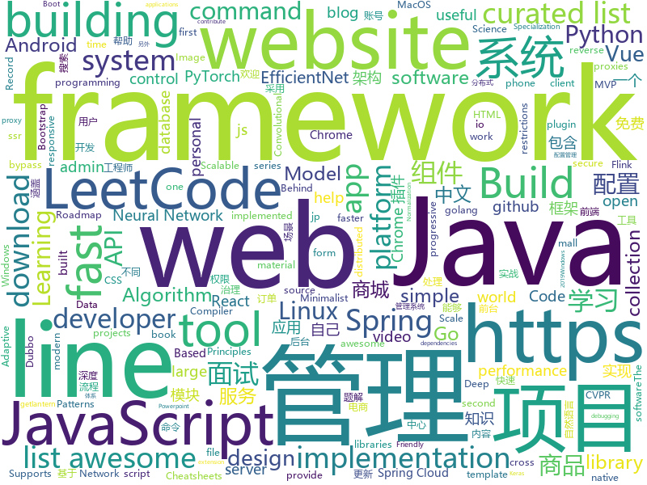

# 2019-06-03
See what the GitHub community is most excited about today.

## python
* [EfficientNet-PyTorch](https://github.com/lukemelas/EfficientNet-PyTorch)(**172 stars today**): A PyTorch implementation of EfficientNet
* [Super-mario-bros-A3C-pytorch](https://github.com/vietnguyen91/Super-mario-bros-A3C-pytorch)(**133 stars today**): Asynchronous Advantage Actor-Critic (A3C) algorithm for Super Mario Bros
* [Python](https://github.com/TheAlgorithms/Python)(**112 stars today**): All Algorithms implemented in Python
* [sunfish](https://github.com/thomasahle/sunfish)(**102 stars today**): Sunfish: a Python Chess Engine in 111 lines of code
* [pytorch-image-models](https://github.com/rwightman/pytorch-image-models)(**84 stars today**): PyTorch image models, scripts, pretrained weights -- (SE)ResNet/ResNeXT, DPN, EfficientNet, MobileNet-V3/V2/V1, MNASNet, Single-Path NAS, FBNet, and more
* [system-design-primer](https://github.com/donnemartin/system-design-primer)(**66 stars today**): Learn how to design large-scale systems. Prep for the system design interview. Includes Anki flashcards.
* [EfficientNets-PyTorch](https://github.com/zsef123/EfficientNets-PyTorch)(**54 stars today**): A PyTorch implementation of " EfficientNet: Rethinking Model Scaling for Convolutional Neural Networks."
* [AiLearning](https://github.com/apachecn/AiLearning)(**44 stars today**): AiLearning: 机器学习 - MachineLearning - ML、深度学习 - DeepLearning - DL、自然语言处理 NLP
* [naacl_transfer_learning_tutorial](https://github.com/huggingface/naacl_transfer_learning_tutorial)(**40 stars today**): Repository of code for the NAACL tutorial on Transfer Learning in NLP
* [youtube-dl](https://github.com/ytdl-org/youtube-dl)(**37 stars today**): Command-line program to download videos from YouTube.com and other video sites
* [awesome-python](https://github.com/vinta/awesome-python)(**35 stars today**): A curated list of awesome Python frameworks, libraries, software and resources
* [pyright](https://github.com/microsoft/pyright)(**39 stars today**): Static type checker for Python
* [dmm_face_compare](https://github.com/fqxufo/dmm_face_compare)(**37 stars today**): 对比dmm.co.jp上的封面与预告片中人脸的差值
* [models](https://github.com/tensorflow/models)(**28 stars today**): Models and examples built with TensorFlow
* [BlueKeep](https://github.com/Ekultek/BlueKeep)(**35 stars today**): Proof of concept for CVE-2019-0708
* [pacnet](https://github.com/NVlabs/pacnet)(**37 stars today**): Pixel-Adaptive Convolutional Neural Networks (CVPR '19)
* [efficientnet](https://github.com/qubvel/efficientnet)(**36 stars today**): Implementation on EfficientNet model. Keras.
* [ChromeAppHeroes](https://github.com/zhaoolee/ChromeAppHeroes)(**35 stars today**): 🌈谷粒-Chrome插件英雄榜, 为优秀的Chrome插件写一本中文说明书, 让Chrome插件英雄们造福人类~ ChromePluginHeroes, Write a Chinese manual for the excellent Chrome plugin, let the Chrome plugin heroes benefit the human~
* [PhoneSploit](https://github.com/Zucccs/PhoneSploit)(**28 stars today**): Using open Adb ports we can exploit a Andriod Device
* [PySnooper](https://github.com/cool-RR/PySnooper)(**31 stars today**): Never use print for debugging again
* [face_recognition](https://github.com/ageitgey/face_recognition)(**29 stars today**): The world's simplest facial recognition api for Python and the command line
* [tiny-tetris](https://github.com/nickmpaz/tiny-tetris)(**29 stars today**): A Tetris implementation that "fits on a business card" (30 lines x 80 characters)
* [PhoneInfoga](https://github.com/sundowndev/PhoneInfoga)(**29 stars today**): Advanced information gathering & OSINT tool for phone numbers.
* [SPADE-Tensorflow](https://github.com/taki0112/SPADE-Tensorflow)(**28 stars today**): Simple Tensorflow implementation of "Semantic Image Synthesis with Spatially-Adaptive Normalization" (CVPR 2019 Oral)
* [ProjectInitializationAutomation](https://github.com/KalleHallden/ProjectInitializationAutomation)(**20 stars today**): 

## java
* [halo](https://github.com/halo-dev/halo)(**353 stars today**): ✍ Halo 可能是最好的 Java 博客系统
* [LeetCodeAnimation](https://github.com/MisterBooo/LeetCodeAnimation)(**153 stars today**): Demonstrate all the questions on LeetCode in the form of animation.（用动画的形式呈现解LeetCode题目的思路）
* [CS-Notes](https://github.com/CyC2018/CS-Notes)(**102 stars today**): 📚技术面试必备基础知识、Leetcode 题解、后端面试、Java 面试、春招、秋招、操作系统、计算机网络、系统设计
* [JavaGuide](https://github.com/Snailclimb/JavaGuide)(**79 stars today**): 【Java学习+面试指南】 一份涵盖大部分Java程序员所需要掌握的核心知识。
* [advanced-java](https://github.com/doocs/advanced-java)(**52 stars today**): 😮互联网 Java 工程师进阶知识完全扫盲：涵盖高并发、分布式、高可用、微服务等领域知识
* [mall](https://github.com/macrozheng/mall)(**42 stars today**): mall项目是一套电商系统，包括前台商城系统及后台管理系统，基于SpringBoot+MyBatis实现。 前台商城系统包含首页门户、商品推荐、商品搜索、商品展示、购物车、订单流程、会员中心、客户服务、帮助中心等模块。 后台管理系统包含商品管理、订单管理、会员管理、促销管理、运营管理、内容管理、统计报表、财务管理、权限管理、设置等模块。
* [spring-boot](https://github.com/spring-projects/spring-boot)(**31 stars today**): Spring Boot
* [toBeTopJavaer](https://github.com/hollischuang/toBeTopJavaer)(**38 stars today**): To Be Top Javaer - Java工程师成神之路
* [Moss](https://github.com/SpringCloud/Moss)(**35 stars today**): Moss(莫斯)-Spring Cloud体系的服务治理平台，让Spring Cloud应用不再流浪！欢迎Star！
* [spring-framework](https://github.com/spring-projects/spring-framework)(**30 stars today**): Spring Framework
* [Java-Deep-Learning-Cookbook](https://github.com/rahul-raj/Java-Deep-Learning-Cookbook)(**35 stars today**): Code for Java Deep Learning Cookbook
* [dubbo](https://github.com/apache/dubbo)(**30 stars today**): Apache Dubbo is a high-performance, java based, open source RPC framework.
* [flink-learning](https://github.com/zhisheng17/flink-learning)(**32 stars today**): flink learning blog. http://www.54tianzhisheng.cn/tags/Flink/
* [litemall](https://github.com/linlinjava/litemall)(**25 stars today**): 又一个小商城。litemall = Spring Boot后端 + Vue管理员前端 + 微信小程序用户前端 + Vue用户移动端
* [Java](https://github.com/TheAlgorithms/Java)(**25 stars today**): All Algorithms implemented in Java
* [ghidra](https://github.com/NationalSecurityAgency/ghidra)(**23 stars today**): Ghidra is a software reverse engineering (SRE) framework
* [FlyTour](https://github.com/geduo83/FlyTour)(**20 stars today**): 🔥🔥🔥FlyTour新闻客户端是Android MVP+Dagger2+Retrofit+RxJava+组件化项目框架，工程架构采用gradle配置实现组件化，模块的架构采用典型的MVP架构，帮助你快速的搭建自己的App项目开发框架，以便把主要的精力放在自己的项目的业务功能实现上，另外在长期的工作实践中总结整理大量的实用工具类在项目lib_common组件的util包当中方便大家调用
* [tutorials](https://github.com/eugenp/tutorials)(**15 stars today**): The "REST With Spring" Course:
* [Component](https://github.com/xiaojinzi123/Component)(**23 stars today**): 一个强大完善的Android组件化方案.更新及时,后续我会跟上一个使用了组件化的 App 真实例子.
* [onemall](https://github.com/YunaiV/onemall)(**20 stars today**): mall 商城，基于微服务的思想，构建在 B2C 电商场景下的项目实战。核心技术栈，是 Spring Boot + Dubbo 。未来，会重构成 Spring Cloud Alibaba 。
* [hutool](https://github.com/looly/hutool)(**19 stars today**): A set of tools that keep Java sweet.
* [okhttp](https://github.com/square/okhttp)(**20 stars today**): An HTTP+HTTP/2 client for Android and Java applications.
* [HanLP](https://github.com/hankcs/HanLP)(**19 stars today**): 自然语言处理 中文分词 词性标注 命名实体识别 依存句法分析 新词发现 关键词短语提取 自动摘要 文本分类聚类 拼音简繁
* [bazel](https://github.com/bazelbuild/bazel)(**18 stars today**): a fast, scalable, multi-language and extensible build system
* [apollo](https://github.com/ctripcorp/apollo)(**16 stars today**): Apollo（阿波罗）是携程框架部门研发的分布式配置中心，能够集中化管理应用不同环境、不同集群的配置，配置修改后能够实时推送到应用端，并且具备规范的权限、流程治理等特性，适用于微服务配置管理场景。

## unknown
* [the-art-of-command-line](https://github.com/jlevy/the-art-of-command-line)(**613 stars today**): Master the command line, in one page
* [awesome-scalability](https://github.com/binhnguyennus/awesome-scalability)(**199 stars today**): The Patterns Behind Scalable, Reliable, and Performant Large-Scale Systems
* [You-Dont-Know-JS](https://github.com/getify/You-Dont-Know-JS)(**131 stars today**): A book series on JavaScript. @YDKJS on twitter.
* [developer-roadmap](https://github.com/kamranahmedse/developer-roadmap)(**69 stars today**): Roadmap to becoming a web developer in 2019
* [gitignore](https://github.com/github/gitignore)(**38 stars today**): A collection of useful .gitignore templates
* [awesome](https://github.com/sindresorhus/awesome)(**47 stars today**): 😎Awesome lists about all kinds of interesting topics
* [hosts](https://github.com/googlehosts/hosts)(**37 stars today**): 镜像：https://coding.net/u/scaffrey/p/hosts/git
* [Data-Science--Cheat-Sheet](https://github.com/abhat222/Data-Science--Cheat-Sheet)(**32 stars today**): Cheat Sheets
* [Free-SS-SSR](https://github.com/dxxzst/Free-SS-SSR)(**36 stars today**): 免费的SS账号、SSR账号，定期更新
* [awesome-shell](https://github.com/alebcay/awesome-shell)(**35 stars today**): A curated list of awesome command-line frameworks, toolkits, guides and gizmos. Inspired by awesome-php.
* [free-programming-books](https://github.com/EbookFoundation/free-programming-books)(**34 stars today**): 📚Freely available programming books
* [stanford-cs-221-artificial-intelligence](https://github.com/afshinea/stanford-cs-221-artificial-intelligence)(**34 stars today**): VIP cheatsheets for Stanford's CS 221 Artificial Intelligence
* [economics-of-package-management](https://github.com/ceejbot/economics-of-package-management)(**35 stars today**): ceejbot's talk from JSConfEU 2019
* [ds-cheatsheets](https://github.com/FavioVazquez/ds-cheatsheets)(**27 stars today**): List of Data Science Cheatsheets to rule the world
* [awesome-vue](https://github.com/vuejs/awesome-vue)(**27 stars today**): 🎉A curated list of awesome things related to Vue.js
* [hacker-laws](https://github.com/dwmkerr/hacker-laws)(**28 stars today**): 💻📖Laws, Theories, Principles and Patterns that developers will find useful. #hackerlaws
* [first-contributions](https://github.com/firstcontributions/first-contributions)(**12 stars today**): 🚀✨Help beginners to contribute to open source projects
* [free-programming-books-zh_CN](https://github.com/justjavac/free-programming-books-zh_CN)(**22 stars today**): 📚免费的计算机编程类中文书籍，欢迎投稿
* [trackerslist](https://github.com/ngosang/trackerslist)(**24 stars today**): Updated list of public BitTorrent trackers
* [fe-necessary-book](https://github.com/ddzy/fe-necessary-book)(**23 stars today**): A pdf and software collection about frontend
* [android-developer-roadmap](https://github.com/anacoimbrag/android-developer-roadmap)(**22 stars today**): Android Developer Roadmap 2019
* [PowerToys](https://github.com/microsoft/PowerToys)(**23 stars today**): Windows system utilities to maximize productivity
* [PHP-Interview-QA](https://github.com/colinlet/PHP-Interview-QA)(**22 stars today**): PHP面试问答
* [electron-ssr-backup](https://github.com/qingshuisiyuan/electron-ssr-backup)(**15 stars today**): electron-ssr原作者删除了这个伟大的项目，故备份了下来，不继续开发,且用且珍惜
* [your-dns](https://github.com/yegle/your-dns)(**19 stars today**): A docker-compose file to provide a secure adblocking DNS server

## javascript
* [algorithm-visualizer](https://github.com/algorithm-visualizer/algorithm-visualizer)(**443 stars today**): 🎆Interactive Online Platform that Visualizes Algorithms from Code
* [entropic](https://github.com/entropic-dev/entropic)(**378 stars today**): a package registry for anything, but mostly javascript
* [medium-to-own-blog](https://github.com/mathieudutour/medium-to-own-blog)(**329 stars today**): Switch from Medium to your own blog in a few minutes
* [zdog](https://github.com/metafizzy/zdog)(**176 stars today**): Flat, round, designer-friendly pseudo-3D engine
* [PapaParse](https://github.com/mholt/PapaParse)(**103 stars today**): Fast and powerful CSV (delimited text) parser that gracefully handles large files and malformed input
* [graphql-engine](https://github.com/hasura/graphql-engine)(**97 stars today**): Blazing fast, instant realtime GraphQL APIs on Postgres with fine grained access control, also trigger webhooks on database events.
* [leetcode](https://github.com/azl397985856/leetcode)(**77 stars today**): LeetCode Solutions: A Record of My Problem Solving Journey.( leetcode题解，记录自己的leetcode解题之路。)
* [vue](https://github.com/vuejs/vue)(**68 stars today**): 🖖Vue.js is a progressive, incrementally-adoptable JavaScript framework for building UI on the web.
* [sol-journal](https://github.com/gillkyle/sol-journal)(**72 stars today**): ✎ Simple, personal journaling progressive web app
* [mindCast](https://github.com/steniowagner/mindCast)(**53 stars today**): A React-Native streaming-audio app that provides knowledge in the form of Podcasts.
* [hyper](https://github.com/zeit/hyper)(**53 stars today**): A terminal built on web technologies
* [Motrix](https://github.com/agalwood/Motrix)(**47 stars today**): A full-featured download manager.
* [bootstrap](https://github.com/twbs/bootstrap)(**35 stars today**): The most popular HTML, CSS, and JavaScript framework for developing responsive, mobile first projects on the web.
* [react](https://github.com/facebook/react)(**39 stars today**): A declarative, efficient, and flexible JavaScript library for building user interfaces.
* [spicetify-cli](https://github.com/khanhas/spicetify-cli)(**45 stars today**): Commandline tool to customize Spotify client. Supports Windows, MacOS and Linux.
* [gulp-webpack-boilerplate](https://github.com/noth8/gulp-webpack-boilerplate)(**37 stars today**): 
* [gitfolio](https://github.com/imfunniee/gitfolio)(**37 stars today**): personal website + blog for every github user
* [puppeteer-recorder](https://github.com/checkly/puppeteer-recorder)(**35 stars today**): Puppeteer recorder is a Chrome extension that records your browser interactions and generates a Puppeteer script.
* [30-seconds-of-code](https://github.com/30-seconds/30-seconds-of-code)(**34 stars today**): A curated collection of useful JavaScript snippets that you can understand in 30 seconds or less.
* [pickr](https://github.com/Simonwep/pickr)(**34 stars today**): 🍭Flat, simple, responsive and hackable Color-Picker library. No dependencies, no jQuery. Compatible with all CSS Frameworks e.g. Bootstrap, Materialize. Supports alpha channel, rgba, hsla, hsva and more!
* [material-ui](https://github.com/mui-org/material-ui)(**26 stars today**): React components for faster and easier web development. Build your own design system, or start with Material Design.
* [serverless](https://github.com/CSS-Tricks/serverless)(**33 stars today**): The Power of Serverless for Front-End Developers https://thepowerofserverless.info/
* [react-native](https://github.com/facebook/react-native)(**29 stars today**): A framework for building native apps with React.
* [gatsby](https://github.com/gatsbyjs/gatsby)(**30 stars today**): Build blazing fast, modern apps and websites with React
* [node](https://github.com/nodejs/node)(**29 stars today**): Node.js JavaScript runtime✨🐢🚀✨

## html
* [linux-command](https://github.com/jaywcjlove/linux-command)(**84 stars today**): Linux命令大全搜索工具，内容包含Linux命令手册、详解、学习、搜集。https://git.io/linux
* [linuxtools_rst](https://github.com/me115/linuxtools_rst)(**34 stars today**): Linux工具快速教程
* [nullboard](https://github.com/apankrat/nullboard)(**31 stars today**): Nullboard is a minimalist kanban board, focused on compactness and readability.
* [mikutap](https://github.com/HFIProgramming/mikutap)(**18 stars today**): A Mainland China Friendly and independent version extracted from https://aidn.jp/mikutap
* [nndl.github.io](https://github.com/nndl/nndl.github.io)(**13 stars today**): 《神经网络与深度学习》 Neural Network and Deep Learning
* [flutter-in-action](https://github.com/flutterchina/flutter-in-action)(**13 stars today**): 《Flutter实战》电子书
* [AdminLTE](https://github.com/ColorlibHQ/AdminLTE)(**9 stars today**): AdminLTE - Free Premium Admin control Panel Theme Based On Bootstrap 3.x
* [awesome-modern-cpp](https://github.com/rigtorp/awesome-modern-cpp)(**11 stars today**): A collection of resources on modern C++
* [Spoon-Knife](https://github.com/octocat/Spoon-Knife)(****): This repo is for demonstration purposes only.
* [personal-website](https://github.com/github/personal-website)(**5 stars today**): Code that'll help you kickstart a personal website that showcases your work as a software developer.
* [nginxconfig.io](https://github.com/0xB4LINT/nginxconfig.io)(**8 stars today**): ⚙️NGiИX config generator on steroids💉
* [pytorch-doc-zh](https://github.com/apachecn/pytorch-doc-zh)(**7 stars today**): PyTorch 中文文档
* [hugo-academic](https://github.com/gcushen/hugo-academic)(**7 stars today**): The website builder for Hugo. Build and deploy a beautiful website in minutes🚀
* [dragon-book-exercise-answers](https://github.com/fool2fish/dragon-book-exercise-answers)(**6 stars today**): Compilers Principles, Techniques, & Tools (purple dragon book) second edition exercise answers. 编译原理（紫龙书）第2版习题答案。
* [zfaka](https://github.com/zlkbdotnet/zfaka)(**5 stars today**): 免费、安全、稳定、高效的发卡系统，值得拥有!
* [sourcegraph](https://github.com/sourcegraph/sourcegraph)(**5 stars today**): Code search and navigation tool (self-hosted)
* [html](https://github.com/whatwg/html)(**5 stars today**): HTML Standard
* [universal-resume](https://github.com/WebPraktikos/universal-resume)(**5 stars today**): Resume website template that works on a monitor, paper, and phone.
* [learn_ruby](https://github.com/TheOdinProject/learn_ruby)(****): a basic ruby class generated from test-first-teaching
* [indigo](https://github.com/sergiokopplin/indigo)(****): 🍜Minimalist Jekyll Template
* [courses](https://github.com/bcaffo/courses)(****): Course materials for the Data Science Specialization: https://www.coursera.org/specialization/jhudatascience/1
* [awesome-piracy](https://github.com/Igglybuff/awesome-piracy)(****): A curated list of awesome warez and piracy links
* [josiahleas.github.io](https://github.com/JosiahLeas/josiahleas.github.io)(****): View multiple TradingView charts on one screen
* [node-js-getting-started](https://github.com/heroku/node-js-getting-started)(****): Getting Started with Node on Heroku
* [zh.javascript.info](https://github.com/javascript-tutorial/zh.javascript.info)(****): Modern JavaScript Tutorial

## go
* [v2ray-core](https://github.com/v2ray/v2ray-core)(**163 stars today**): A platform for building proxies to bypass network restrictions.
* [unioffice](https://github.com/unidoc/unioffice)(**95 stars today**): Pure go library for creating and processing Office Word (.docx), Excel (.xlsx) and Powerpoint (.pptx) documents
* [lantern](https://github.com/getlantern/lantern)(**74 stars today**): 🔴蓝灯最新版本下载 https://github.com/getlantern/download🔴Lantern Latest Download https://github.com/getlantern/download🔴
* [websocket](https://github.com/nhooyr/websocket)(**48 stars today**): A minimal and idiomatic WebSocket library for Go
* [go](https://github.com/golang/go)(**45 stars today**): The Go programming language
* [v2ray-core](https://github.com/v2fly/v2ray-core)(**44 stars today**): A platform for building proxies to bypass network restrictions.
* [kubernetes](https://github.com/kubernetes/kubernetes)(**37 stars today**): Production-Grade Container Scheduling and Management
* [CovenantSQL](https://github.com/CovenantSQL/CovenantSQL)(**42 stars today**): Byzantine-Fault Tolerant distributed relational database built on SQLite
* [compress](https://github.com/klauspost/compress)(**41 stars today**): Optimized compression packages
* [brook](https://github.com/txthinking/brook)(**32 stars today**): Brook is a cross-platform(Linux/MacOS/Windows/Android/iOS) proxy/vpn software
* [hugo](https://github.com/gohugoio/hugo)(**33 stars today**): The world’s fastest framework for building websites.
* [felix](https://github.com/dejavuzhou/felix)(**31 stars today**): SSH and RESTful scaffold for Backend and DevOps engineers username: admin password:admin
* [annie](https://github.com/iawia002/annie)(**28 stars today**): 👾Fast, simple and clean video downloader
* [tinygo](https://github.com/tinygo-org/tinygo)(**25 stars today**): Go compiler for small places. Microcontrollers, WebAssembly, and command-line tools. Based on LLVM.
* [dolphin](https://github.com/2SE/dolphin)(**24 stars today**): Distributed API Gateway
* [gin](https://github.com/gin-gonic/gin)(**23 stars today**): Gin is a HTTP web framework written in Go (Golang). It features a Martini-like API with much better performance -- up to 40 times faster. If you need smashing performance, get yourself some Gin.
* [build-web-application-with-golang](https://github.com/astaxie/build-web-application-with-golang)(**20 stars today**): A golang ebook intro how to build a web with golang
* [resilience](https://github.com/kaepora/resilience)(**22 stars today**): Resilience is an ad blocker for your computer.
* [ojichat](https://github.com/greymd/ojichat)(**21 stars today**): おじさんがLINEやメールで送ってきそうな文を生成する
* [minikube](https://github.com/kubernetes/minikube)(**17 stars today**): Run Kubernetes locally
* [istio](https://github.com/istio/istio)(**17 stars today**): Connect, secure, control, and observe services.
* [caddy](https://github.com/mholt/caddy)(**17 stars today**): Fast, cross-platform HTTP/2 web server with automatic HTTPS
* [frp](https://github.com/fatedier/frp)(**16 stars today**): A fast reverse proxy to help you expose a local server behind a NAT or firewall to the internet.
* [awesome-go](https://github.com/avelino/awesome-go)(**17 stars today**): A curated list of awesome Go frameworks, libraries and software
* [prometheus](https://github.com/prometheus/prometheus)(**16 stars today**): The Prometheus monitoring system and time series database.

## WordCloud

