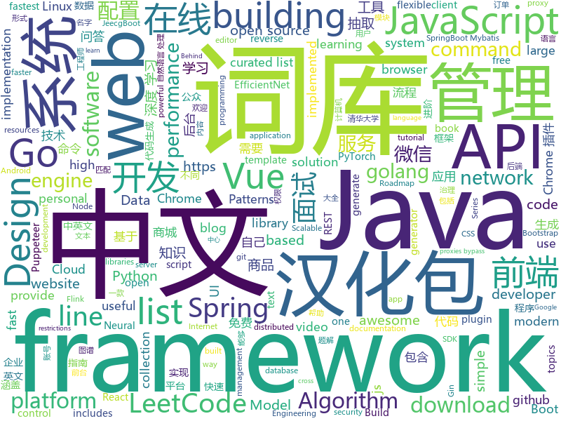

# 2019-06-04
See what the GitHub community is most excited about today.

## python
* [EfficientNet-PyTorch](https://github.com/lukemelas/EfficientNet-PyTorch)(**241 stars today**): A PyTorch implementation of EfficientNet
* [Python](https://github.com/TheAlgorithms/Python)(**151 stars today**): All Algorithms implemented in Python
* [naacl_transfer_learning_tutorial](https://github.com/huggingface/naacl_transfer_learning_tutorial)(**96 stars today**): Repository of code for the NAACL tutorial on Transfer Learning in NLP
* [AiLearning](https://github.com/apachecn/AiLearning)(**82 stars today**): AiLearning: 机器学习 - MachineLearning - ML、深度学习 - DeepLearning - DL、自然语言处理 NLP
* [rtv](https://github.com/michael-lazar/rtv)(**81 stars today**): Browse Reddit from your terminal
* [Super-mario-bros-A3C-pytorch](https://github.com/vietnguyen91/Super-mario-bros-A3C-pytorch)(**84 stars today**): Asynchronous Advantage Actor-Critic (A3C) algorithm for Super Mario Bros
* [sunfish](https://github.com/thomasahle/sunfish)(**80 stars today**): Sunfish: a Python Chess Engine in 111 lines of code
* [system-design-primer](https://github.com/donnemartin/system-design-primer)(**69 stars today**): Learn how to design large-scale systems. Prep for the system design interview. Includes Anki flashcards.
* [models](https://github.com/tensorflow/models)(**49 stars today**): Models and examples built with TensorFlow
* [bluekeep_CVE-2019-0708_poc_to_exploit](https://github.com/algo7/bluekeep_CVE-2019-0708_poc_to_exploit)(**60 stars today**): Porting BlueKeep PoC from @Ekultek to actual exploits
* [pytorch-image-models](https://github.com/rwightman/pytorch-image-models)(**64 stars today**): PyTorch image models, scripts, pretrained weights -- (SE)ResNet/ResNeXT, DPN, EfficientNet, MobileNet-V3/V2/V1, MNASNet, Single-Path NAS, FBNet, and more
* [awesome-python](https://github.com/vinta/awesome-python)(**62 stars today**): A curated list of awesome Python frameworks, libraries, software and resources
* [BlueKeep](https://github.com/Ekultek/BlueKeep)(**59 stars today**): Proof of concept for CVE-2019-0708
* [funNLP](https://github.com/fighting41love/funNLP)(**57 stars today**): 中英文敏感词、语言检测、中外手机/电话归属地/运营商查询、名字推断性别、手机号抽取、身份证抽取、邮箱抽取、中日文人名库、中文缩写库、拆字词典、词汇情感值、停用词、反动词表、暴恐词表、繁简体转换、英文模拟中文发音、汪峰歌词生成器、职业名称词库、同义词库、反义词库、否定词库、汽车品牌词库、汽车零件词库、连续英文切割、各种中文词向量、公司名字大全、古诗词库、IT词库、财经词库、成语词库、地名词库、历史名人词库、诗词词库、医学词库、饮食词库、法律词库、汽车词库、动物词库、中文聊天语料、中文谣言数据、百度中文问答数据集、句子相似度匹配算法集合、bert资源、文本生成&摘要相关工具、cocoNLP信息抽取工具、国内电话号码正则匹配、清华大学XLORE:中英文跨语言百科知识图谱、清华大学人工智能技术…
* [PySnooper](https://github.com/cool-RR/PySnooper)(**53 stars today**): Never use print for debugging again
* [CVE-2019-2725](https://github.com/lufeirider/CVE-2019-2725)(**48 stars today**): CVE-2019-2725 命令回显
* [MaskTrackRCNN](https://github.com/youtubevos/MaskTrackRCNN)(**53 stars today**): Open MMLab Detection Toolbox with PyTorch
* [CheatSheetSeries](https://github.com/OWASP/CheatSheetSeries)(**51 stars today**): The OWASP Cheat Sheet Series was created to provide a concise collection of high value information on specific application security topics.
* [public-apis](https://github.com/toddmotto/public-apis)(**47 stars today**): A collective list of free APIs for use in software and web development.
* [face_recognition](https://github.com/ageitgey/face_recognition)(**42 stars today**): The world's simplest facial recognition api for Python and the command line
* [youtube-dl](https://github.com/ytdl-org/youtube-dl)(**44 stars today**): Command-line program to download videos from YouTube.com and other video sites
* [EfficientNets-PyTorch](https://github.com/zsef123/EfficientNets-PyTorch)(**45 stars today**): A PyTorch implementation of " EfficientNet: Rethinking Model Scaling for Convolutional Neural Networks."
* [ChromeAppHeroes](https://github.com/zhaoolee/ChromeAppHeroes)(**42 stars today**): 🌈谷粒-Chrome插件英雄榜, 为优秀的Chrome插件写一本中文说明书, 让Chrome插件英雄们造福人类~ ChromePluginHeroes, Write a Chinese manual for the excellent Chrome plugin, let the Chrome plugin heroes benefit the human~
* [PhoneSploit](https://github.com/Zucccs/PhoneSploit)(**38 stars today**): Using open Adb ports we can exploit a Andriod Device
* [bert](https://github.com/google-research/bert)(**38 stars today**): TensorFlow code and pre-trained models for BERT

## java
* [halo](https://github.com/halo-dev/halo)(**312 stars today**): ✍ Halo 一款现代化的个人独立博客系统
* [LeetCodeAnimation](https://github.com/MisterBooo/LeetCodeAnimation)(**248 stars today**): Demonstrate all the questions on LeetCode in the form of animation.（用动画的形式呈现解LeetCode题目的思路）
* [CS-Notes](https://github.com/CyC2018/CS-Notes)(**222 stars today**): 📚技术面试必备基础知识、Leetcode 题解、后端面试、Java 面试、春招、秋招、操作系统、计算机网络、系统设计
* [JavaGuide](https://github.com/Snailclimb/JavaGuide)(**173 stars today**): 【Java学习+面试指南】 一份涵盖大部分Java程序员所需要掌握的核心知识。
* [mall](https://github.com/macrozheng/mall)(**103 stars today**): mall项目是一套电商系统，包括前台商城系统及后台管理系统，基于SpringBoot+MyBatis实现。 前台商城系统包含首页门户、商品推荐、商品搜索、商品展示、购物车、订单流程、会员中心、客户服务、帮助中心等模块。 后台管理系统包含商品管理、订单管理、会员管理、促销管理、运营管理、内容管理、统计报表、财务管理、权限管理、设置等模块。
* [algs4](https://github.com/kevin-wayne/algs4)(**86 stars today**): Algorithms, 4th edition textbook code and libraries
* [jeecg-boot](https://github.com/zhangdaiscott/jeecg-boot)(**84 stars today**): Jeecg-Boot 是一款基于代码生成器的快速开发平台！采用前后端分离架构：SpringBoot 2.x，Mybatis，Shiro，JWT，Vue&Ant Design。强大的代码生成器让前端和后台代码一键生成，不需要写任何代码，绝对是全栈开发福音！！ JeecgBoot的宗旨是提高UI能力的同时,降低前后分离的开发成本，JeecgBoot还独创在线开发模式，No代码概念，一系列在线智能开发：在线配置表单、在线配置报表、在线设计流程等等。
* [advanced-java](https://github.com/doocs/advanced-java)(**87 stars today**): 😮互联网 Java 工程师进阶知识完全扫盲：涵盖高并发、分布式、高可用、微服务等领域知识
* [sitewhere](https://github.com/sitewhere/sitewhere)(**73 stars today**): SiteWhere is an industrial strength open-source application enablement platform for the Internet of Things (IoT). It provides a multi-tenant microservice-based infrastructure that includes device/asset management, data ingestion, big-data storage, and integration through a modern, scalable architecture. SiteWhere provides REST APIs for all syste…
* [flink-learning](https://github.com/zhisheng17/flink-learning)(**62 stars today**): flink learning blog. http://www.54tianzhisheng.cn/tags/Flink/
* [spring-boot](https://github.com/spring-projects/spring-boot)(**48 stars today**): Spring Boot
* [litemall](https://github.com/linlinjava/litemall)(**40 stars today**): 又一个小商城。litemall = Spring Boot后端 + Vue管理员前端 + 微信小程序用户前端 + Vue用户移动端
* [toBeTopJavaer](https://github.com/hollischuang/toBeTopJavaer)(**42 stars today**): To Be Top Javaer - Java工程师成神之路
* [Moss](https://github.com/SpringCloud/Moss)(**42 stars today**): Moss(莫斯)-Spring Cloud体系的服务治理平台，让Spring Cloud应用不再流浪！欢迎Star！
* [java-design-patterns](https://github.com/iluwatar/java-design-patterns)(**36 stars today**): Design patterns implemented in Java
* [spring-framework](https://github.com/spring-projects/spring-framework)(**30 stars today**): Spring Framework
* [dubbo](https://github.com/apache/dubbo)(**36 stars today**): Apache Dubbo is a high-performance, java based, open source RPC framework.
* [tutorials](https://github.com/eugenp/tutorials)(**21 stars today**): The "REST With Spring" Course:
* [apollo](https://github.com/ctripcorp/apollo)(**32 stars today**): Apollo（阿波罗）是携程框架部门研发的分布式配置中心，能够集中化管理应用不同环境、不同集群的配置，配置修改后能够实时推送到应用端，并且具备规范的权限、流程治理等特性，适用于微服务配置管理场景。
* [arthas](https://github.com/alibaba/arthas)(**32 stars today**): Alibaba Java Diagnostic Tool Arthas/Alibaba Java诊断利器Arthas
* [ghidra](https://github.com/NationalSecurityAgency/ghidra)(**34 stars today**): Ghidra is a software reverse engineering (SRE) framework
* [WxJava](https://github.com/Wechat-Group/WxJava)(**30 stars today**): WxJava （微信开发 Java SDK），支持包括微信支付、开放平台、小程序、企业微信/企业号和公众号等的后端开发
* [Java](https://github.com/TheAlgorithms/Java)(**30 stars today**): All Algorithms implemented in Java
* [seata](https://github.com/seata/seata)(**30 stars today**): 🔥Seata is an easy-to-use, high-performance, open source distributed transaction solution.
* [HanLP](https://github.com/hankcs/HanLP)(**31 stars today**): 自然语言处理 中文分词 词性标注 命名实体识别 依存句法分析 新词发现 关键词短语提取 自动摘要 文本分类聚类 拼音简繁

## unknown
* [the-art-of-command-line](https://github.com/jlevy/the-art-of-command-line)(**774 stars today**): Master the command line, in one page
* [awesome-scalability](https://github.com/binhnguyennus/awesome-scalability)(**205 stars today**): The Patterns Behind Scalable, Reliable, and Performant Large-Scale Systems
* [You-Dont-Know-JS](https://github.com/getify/You-Dont-Know-JS)(**127 stars today**): A book series on JavaScript. @YDKJS on twitter.
* [economics-of-package-management](https://github.com/ceejbot/economics-of-package-management)(**100 stars today**): ceejbot's talk from JSConfEU 2019
* [gitignore](https://github.com/github/gitignore)(**57 stars today**): A collection of useful .gitignore templates
* [awesome](https://github.com/sindresorhus/awesome)(**77 stars today**): 😎Awesome lists about all kinds of interesting topics
* [free-programming-books](https://github.com/EbookFoundation/free-programming-books)(**65 stars today**): 📚Freely available programming books
* [hosts](https://github.com/googlehosts/hosts)(**55 stars today**): 镜像：https://coding.net/u/scaffrey/p/hosts/git
* [rust-notes](https://github.com/zkat/rust-notes)(**57 stars today**): Personal notes while learning Rust. Mainly documenting pain points along the way.
* [free-programming-books-zh_CN](https://github.com/justjavac/free-programming-books-zh_CN)(**48 stars today**): 📚免费的计算机编程类中文书籍，欢迎投稿
* [developer-roadmap](https://github.com/kamranahmedse/developer-roadmap)(**49 stars today**): Roadmap to becoming a web developer in 2019
* [PHP-Interview-QA](https://github.com/colinlet/PHP-Interview-QA)(**51 stars today**): PHP面试问答
* [hacker-laws](https://github.com/dwmkerr/hacker-laws)(**51 stars today**): 💻📖Laws, Theories, Principles and Patterns that developers will find useful. #hackerlaws
* [hacker-laws](https://github.com/solarrust/hacker-laws)(**48 stars today**): 💻📖Законы, теории, принципы и модели, которые полезно знать разработчикам.
* [Free-SS-SSR](https://github.com/dxxzst/Free-SS-SSR)(**46 stars today**): 免费的SS账号、SSR账号，定期更新
* [xiaozhi](https://github.com/qq449245884/xiaozhi)(**43 stars today**): 
* [ds-cheatsheets](https://github.com/FavioVazquez/ds-cheatsheets)(**37 stars today**): List of Data Science Cheatsheets to rule the world
* [Data-Engineering-HowTo](https://github.com/adilkhash/Data-Engineering-HowTo)(**41 stars today**): A list of useful resources to learn Data Engineering from scratch
* [Daily-Interview-Question](https://github.com/Advanced-Frontend/Daily-Interview-Question)(**39 stars today**): 我是木易杨，公众号「高级前端进阶」作者，每天搞定一道前端大厂面试题，祝大家天天进步，一年后会看到不一样的自己。
* [weekly](https://github.com/dt-fe/weekly)(**38 stars today**): 前端精读周刊
* [awesome-vue](https://github.com/vuejs/awesome-vue)(**35 stars today**): 🎉A curated list of awesome things related to Vue.js
* [trackerslist](https://github.com/ngosang/trackerslist)(**34 stars today**): Updated list of public BitTorrent trackers
* [android-developer-roadmap](https://github.com/anacoimbrag/android-developer-roadmap)(**33 stars today**): Android Developer Roadmap 2019
* [architect-awesome](https://github.com/xingshaocheng/architect-awesome)(**30 stars today**): 后端架构师技术图谱
* [DeepLearning-500-questions](https://github.com/scutan90/DeepLearning-500-questions)(**27 stars today**): 深度学习500问，以问答形式对常用的概率知识、线性代数、机器学习、深度学习、计算机视觉等热点问题进行阐述，以帮助自己及有需要的读者。 全书分为18个章节，50余万字。由于水平有限，书中不妥之处恳请广大读者批评指正。 未完待续............ 如有意合作，联系scutjy2015@163.com 版权所有，违权必究 Tan 2018.06

## javascript
* [algorithm-visualizer](https://github.com/algorithm-visualizer/algorithm-visualizer)(**612 stars today**): 🎆Interactive Online Platform that Visualizes Algorithms from Code
* [entropic](https://github.com/entropic-dev/entropic)(**497 stars today**): a package registry for anything, but mostly javascript
* [zdog](https://github.com/metafizzy/zdog)(**358 stars today**): Flat, round, designer-friendly pseudo-3D engine for canvas & SVG
* [medium-to-own-blog](https://github.com/mathieudutour/medium-to-own-blog)(**340 stars today**): Switch from Medium to your own blog in a few minutes
* [PapaParse](https://github.com/mholt/PapaParse)(**194 stars today**): Fast and powerful CSV (delimited text) parser that gracefully handles large files and malformed input
* [leetcode](https://github.com/azl397985856/leetcode)(**151 stars today**): LeetCode Solutions: A Record of My Problem Solving Journey.( leetcode题解，记录自己的leetcode解题之路。)
* [vue](https://github.com/vuejs/vue)(**117 stars today**): 🖖Vue.js is a progressive, incrementally-adoptable JavaScript framework for building UI on the web.
* [react](https://github.com/facebook/react)(**85 stars today**): A declarative, efficient, and flexible JavaScript library for building user interfaces.
* [graphql-engine](https://github.com/hasura/graphql-engine)(**85 stars today**): Blazing fast, instant realtime GraphQL APIs on Postgres with fine grained access control, also trigger webhooks on database events.
* [pickr](https://github.com/Simonwep/pickr)(**86 stars today**): 🍭Flat, simple, responsive and hackable Color-Picker library. No dependencies, no jQuery. Compatible with all CSS Frameworks e.g. Bootstrap, Materialize. Supports alpha channel, rgba, hsla, hsva and more!
* [nodebestpractices](https://github.com/i0natan/nodebestpractices)(**76 stars today**): ✅The largest Node.js best practices list (May 2019)
* [Motrix](https://github.com/agalwood/Motrix)(**73 stars today**): A full-featured download manager.
* [tiptap](https://github.com/scrumpy/tiptap)(**67 stars today**): A rich-text editor for Vue.js
* [sol-journal](https://github.com/gillkyle/sol-journal)(**64 stars today**): ✎ Simple, personal journaling progressive web app
* [Zettlr](https://github.com/Zettlr/Zettlr)(**64 stars today**): A powerful markdown editor.
* [gitfolio](https://github.com/imfunniee/gitfolio)(**61 stars today**): personal website + blog for every github user
* [normalizr](https://github.com/paularmstrong/normalizr)(**58 stars today**): Normalizes nested JSON according to a schema
* [axios](https://github.com/axios/axios)(**53 stars today**): Promise based HTTP client for the browser and node.js
* [create-react-app](https://github.com/facebook/create-react-app)(**49 stars today**): Set up a modern web app by running one command.
* [FunctionScript](https://github.com/FunctionScript/FunctionScript)(**54 stars today**): A language and specification for turning JavaScript functions into typed HTTP APIs
* [bootstrap](https://github.com/twbs/bootstrap)(**37 stars today**): The most popular HTML, CSS, and JavaScript framework for developing responsive, mobile first projects on the web.
* [pixi.js](https://github.com/pixijs/pixi.js)(**50 stars today**): The HTML5 Creation Engine: Create beautiful digital content with the fastest, most flexible 2D WebGL renderer.
* [puppeteer-recorder](https://github.com/checkly/puppeteer-recorder)(**52 stars today**): Puppeteer recorder is a Chrome extension that records your browser interactions and generates a Puppeteer script.
* [react-native](https://github.com/facebook/react-native)(**44 stars today**): A framework for building native apps with React.
* [material-ui](https://github.com/mui-org/material-ui)(**35 stars today**): React components for faster and easier web development. Build your own design system, or start with Material Design.

## html
* [nullboard](https://github.com/apankrat/nullboard)(**80 stars today**): Nullboard is a minimalist kanban board, focused on compactness and readability.
* [linux-command](https://github.com/jaywcjlove/linux-command)(**57 stars today**): Linux命令大全搜索工具，内容包含Linux命令手册、详解、学习、搜集。https://git.io/linux
* [evtjs](https://github.com/everitoken/evtjs)(**22 stars today**): API Binding (SDK) for the everiToken blockchain.
* [nginxconfig.io](https://github.com/0xB4LINT/nginxconfig.io)(**22 stars today**): ⚙️NGiИX config generator on steroids💉
* [flutter-in-action](https://github.com/flutterchina/flutter-in-action)(**19 stars today**): 《Flutter实战》电子书
* [AdminLTE](https://github.com/ColorlibHQ/AdminLTE)(**19 stars today**): AdminLTE - Free Premium Admin control Panel Theme Based On Bootstrap 3.x
* [scikit-learn-doc-zh](https://github.com/apachecn/scikit-learn-doc-zh)(**21 stars today**): 📖[译] scikit-learn（sklearn） 中文文档
* [website](https://github.com/kubernetes/website)(**13 stars today**): Kubernetes website and documentation repo:
* [professional-services](https://github.com/GoogleCloudPlatform/professional-services)(**19 stars today**): Common solutions and tools developed by Google Cloud's Professional Services team
* [linuxtools_rst](https://github.com/me115/linuxtools_rst)(**16 stars today**): Linux工具快速教程
* [screenfull.js](https://github.com/sindresorhus/screenfull.js)(**17 stars today**): Simple wrapper for cross-browser usage of the JavaScript Fullscreen API
* [en.javascript.info](https://github.com/javascript-tutorial/en.javascript.info)(**17 stars today**): Modern JavaScript Tutorial
* [nndl.github.io](https://github.com/nndl/nndl.github.io)(**15 stars today**): 《神经网络与深度学习》 Neural Network and Deep Learning
* [styleguide](https://github.com/google/styleguide)(**11 stars today**): Style guides for Google-originated open-source projects
* [portainer](https://github.com/portainer/portainer)(**12 stars today**): Simple management UI for Docker
* [zfaka](https://github.com/zlkbdotnet/zfaka)(**8 stars today**): 免费、安全、稳定、高效的发卡系统，值得拥有!
* [skf-flask](https://github.com/blabla1337/skf-flask)(**10 stars today**): Security Knowledge Framework (SKF) Python Flask / Angular project
* [swagger-codegen](https://github.com/swagger-api/swagger-codegen)(**10 stars today**): swagger-codegen contains a template-driven engine to generate documentation, API clients and server stubs in different languages by parsing your OpenAPI / Swagger definition.
* [patchwork](https://github.com/jlord/patchwork)(****): All the Git-it Workshop completers!
* [Spoon-Knife](https://github.com/octocat/Spoon-Knife)(****): This repo is for demonstration purposes only.
* [TranslatorX](https://github.com/pingfangx/TranslatorX)(**9 stars today**): JetBrains 系列软件汉化包 关键字: Android Studio 3.4 汉化包 CLion 2019.1 汉化包 DataGrip 2019.1 汉化包 GoLand 2019.1 汉化包 IntelliJ IDEA 2019.1 汉化包 PhpStorm 2019.1 汉化包 PyCharm 2019.1 汉化包 RubyMine 2019.1 汉化包 WebStorm 2019.1 汉化包
* [home](https://github.com/apachecn/home)(**9 stars today**): ApacheCN 开源组织：公告、介绍、成员、活动、交流方式
* [personal-website](https://github.com/github/personal-website)(**5 stars today**): Code that'll help you kickstart a personal website that showcases your work as a software developer.
* [awesome-modern-cpp](https://github.com/rigtorp/awesome-modern-cpp)(**9 stars today**): A collection of resources on modern C++
* [ru.javascript.info](https://github.com/javascript-tutorial/ru.javascript.info)(**6 stars today**): Современный учебник JavaScript

## go
* [v2ray-core](https://github.com/v2ray/v2ray-core)(**303 stars today**): A platform for building proxies to bypass network restrictions.
* [zinx](https://github.com/aceld/zinx)(**125 stars today**): 基于Golang解决的长连接并发服务器框架
* [lantern](https://github.com/getlantern/lantern)(**75 stars today**): 🔴蓝灯最新版本下载 https://github.com/getlantern/download🔴Lantern Latest Download https://github.com/getlantern/download🔴
* [go-for-apache-dubbo](https://github.com/dubbo/go-for-apache-dubbo)(**75 stars today**): Go Implementation For Apache Dubbo
* [brook](https://github.com/txthinking/brook)(**61 stars today**): Brook is a cross-platform(Linux/MacOS/Windows/Android/iOS) proxy/vpn software
* [go](https://github.com/golang/go)(**60 stars today**): The Go programming language
* [kubernetes](https://github.com/kubernetes/kubernetes)(**44 stars today**): Production-Grade Container Scheduling and Management
* [compress](https://github.com/klauspost/compress)(**48 stars today**): Optimized compression packages
* [frp](https://github.com/fatedier/frp)(**42 stars today**): A fast reverse proxy to help you expose a local server behind a NAT or firewall to the internet.
* [lk-chain](https://github.com/lianxiangcloud/lk-chain)(**35 stars today**): 由链享云打造的专注于数字经济创新业务的公链
* [awesome-go](https://github.com/avelino/awesome-go)(**43 stars today**): A curated list of awesome Go frameworks, libraries and software
* [ojichat](https://github.com/greymd/ojichat)(**37 stars today**): おじさんがLINEやメールで送ってきそうな文を生成する
* [gin](https://github.com/gin-gonic/gin)(**35 stars today**): Gin is a HTTP web framework written in Go (Golang). It features a Martini-like API with much better performance -- up to 40 times faster. If you need smashing performance, get yourself some Gin.
* [the-way-to-go_ZH_CN](https://github.com/Unknwon/the-way-to-go_ZH_CN)(**32 stars today**): 《The Way to Go》中文译本，中文正式名《Go 入门指南》
* [annie](https://github.com/iawia002/annie)(**33 stars today**): 👾Fast, simple and clean video downloader
* [v2ray-core](https://github.com/v2fly/v2ray-core)(**31 stars today**): A platform for building proxies to bypass network restrictions.
* [hugo](https://github.com/gohugoio/hugo)(**29 stars today**): The world’s fastest framework for building websites.
* [build-web-application-with-golang](https://github.com/astaxie/build-web-application-with-golang)(**28 stars today**): A golang ebook intro how to build a web with golang
* [MTBSystem](https://github.com/wiatingpub/MTBSystem)(**29 stars today**): 使用go-micro微服务实现的在线电影院订票系统
* [sqlflow](https://github.com/sql-machine-learning/sqlflow)(**26 stars today**): Brings SQL and AI together.
* [fzf](https://github.com/junegunn/fzf)(**29 stars today**): 🌸A command-line fuzzy finder
* [CovenantSQL](https://github.com/CovenantSQL/CovenantSQL)(**29 stars today**): Byzantine-Fault Tolerant distributed relational database built on SQLite
* [websocket](https://github.com/nhooyr/websocket)(**28 stars today**): A minimal and idiomatic WebSocket library for Go
* [dolphin](https://github.com/2SE/dolphin)(**28 stars today**): Distributed API Gateway
* [hey](https://github.com/rakyll/hey)(**26 stars today**): HTTP load generator, ApacheBench (ab) replacement, formerly known as rakyll/boom

## WordCloud

