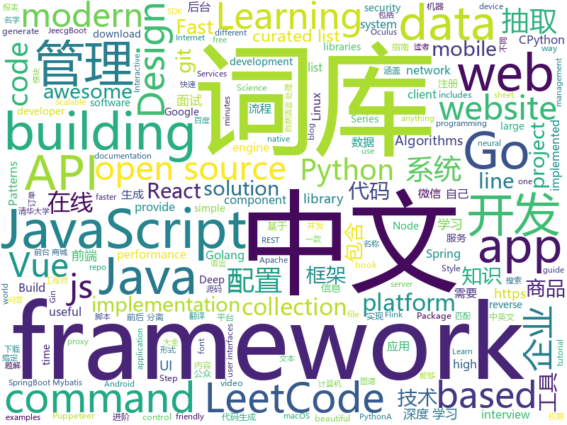

# 2019-06-05
See what the GitHub community is most excited about today.

## python
* [EfficientNet-PyTorch](https://github.com/lukemelas/EfficientNet-PyTorch)(**288 stars today**): A PyTorch implementation of EfficientNet
* [Python](https://github.com/TheAlgorithms/Python)(**146 stars today**): All Algorithms implemented in Python
* [kedro](https://github.com/quantumblacklabs/kedro)(**133 stars today**): A Python library for building robust production-ready data and analytics pipelines
* [macOS-Simple-KVM](https://github.com/foxlet/macOS-Simple-KVM)(**122 stars today**): Tools to set up a quick macOS VM in QEMU, accelerated by KVM.
* [gluon-ts](https://github.com/awslabs/gluon-ts)(**92 stars today**): GluonTS - Probabilistic Time Series Modeling in Python
* [AiLearning](https://github.com/apachecn/AiLearning)(**73 stars today**): AiLearning: 机器学习 - MachineLearning - ML、深度学习 - DeepLearning - DL、自然语言处理 NLP
* [funNLP](https://github.com/fighting41love/funNLP)(**78 stars today**): 中英文敏感词、语言检测、中外手机/电话归属地/运营商查询、名字推断性别、手机号抽取、身份证抽取、邮箱抽取、中日文人名库、中文缩写库、拆字词典、词汇情感值、停用词、反动词表、暴恐词表、繁简体转换、英文模拟中文发音、汪峰歌词生成器、职业名称词库、同义词库、反义词库、否定词库、汽车品牌词库、汽车零件词库、连续英文切割、各种中文词向量、公司名字大全、古诗词库、IT词库、财经词库、成语词库、地名词库、历史名人词库、诗词词库、医学词库、饮食词库、法律词库、汽车词库、动物词库、中文聊天语料、中文谣言数据、百度中文问答数据集、句子相似度匹配算法集合、bert资源、文本生成&摘要相关工具、cocoNLP信息抽取工具、国内电话号码正则匹配、清华大学XLORE:中英文跨语言百科知识图谱、清华大学人工智能技术…
* [models](https://github.com/tensorflow/models)(**66 stars today**): Models and examples built with TensorFlow
* [panel](https://github.com/pyviz/panel)(**77 stars today**): A high-level app and dashboarding solution for Python
* [awesome-python](https://github.com/vinta/awesome-python)(**67 stars today**): A curated list of awesome Python frameworks, libraries, software and resources
* [sunfish](https://github.com/thomasahle/sunfish)(**69 stars today**): Sunfish: a Python Chess Engine in 111 lines of code
* [PySnooper](https://github.com/cool-RR/PySnooper)(**62 stars today**): Never use print for debugging again
* [APT_REPORT](https://github.com/blackorbird/APT_REPORT)(**50 stars today**): Interesting apt report collection and some special ioc express
* [pytorch_GAN_zoo](https://github.com/facebookresearch/pytorch_GAN_zoo)(**61 stars today**): A mix of GAN implementations including progressive growing
* [Python-Interview-Problems-for-Practice](https://github.com/devAmoghS/Python-Interview-Problems-for-Practice)(**56 stars today**): 40+ Common code and interview problems solved in Python (it's growing...) Please go through the README.md before starting.
* [bluekeep_CVE-2019-0708_poc_to_exploit](https://github.com/algo7/bluekeep_CVE-2019-0708_poc_to_exploit)(**49 stars today**): Porting BlueKeep PoC from @Ekultek to actual exploits
* [face_recognition](https://github.com/ageitgey/face_recognition)(**46 stars today**): The world's simplest facial recognition api for Python and the command line
* [naacl_transfer_learning_tutorial](https://github.com/huggingface/naacl_transfer_learning_tutorial)(**46 stars today**): Repository of code for the NAACL tutorial on Transfer Learning in NLP
* [CheatSheetSeries](https://github.com/OWASP/CheatSheetSeries)(**45 stars today**): The OWASP Cheat Sheet Series was created to provide a concise collection of high value information on specific application security topics.
* [songoku](https://github.com/guille0/songoku)(**49 stars today**): Solve sudokus from video in real time with computer vision and neural networks
* [public-apis](https://github.com/public-apis/public-apis)(**46 stars today**): A collective list of free APIs for use in software and web development.
* [system-design-primer](https://github.com/donnemartin/system-design-primer)(**45 stars today**): Learn how to design large-scale systems. Prep for the system design interview. Includes Anki flashcards.
* [kg-2019](https://github.com/bojone/kg-2019)(**46 stars today**): 2019年百度的三元组抽取比赛，“科学空间队”源码
* [DeepLearningExamples](https://github.com/NVIDIA/DeepLearningExamples)(**45 stars today**): Deep Learning Examples
* [keras](https://github.com/keras-team/keras)(**37 stars today**): Deep Learning for humans

## java
* [CS-Notes](https://github.com/CyC2018/CS-Notes)(**191 stars today**): 📚Basic Knowledge of Technical Interview（技术面试必备基础知识、Leetcode 题解、后端面试、Java 面试、春招、秋招、操作系统、计算机网络、系统设计）
* [LeetCodeAnimation](https://github.com/MisterBooo/LeetCodeAnimation)(**206 stars today**): Demonstrate all the questions on LeetCode in the form of animation.（用动画的形式呈现解LeetCode题目的思路）
* [halo](https://github.com/halo-dev/halo)(**184 stars today**): ✍ Halo 一款现代化的个人独立博客系统
* [JavaGuide](https://github.com/Snailclimb/JavaGuide)(**167 stars today**): 【Java学习+面试指南】 一份涵盖大部分Java程序员所需要掌握的核心知识。
* [jeecg-boot](https://github.com/zhangdaiscott/jeecg-boot)(**142 stars today**): Jeecg-Boot 是一款基于代码生成器的快速开发平台！采用前后端分离架构：SpringBoot 2.x，Mybatis，Shiro，JWT，Vue&Ant Design。强大的代码生成器让前端和后台代码一键生成，不需要写任何代码，绝对是全栈开发福音！！ JeecgBoot的宗旨是提高UI能力的同时,降低前后分离的开发成本，JeecgBoot还独创在线开发模式，No代码概念，一系列在线智能开发：在线配置表单、在线配置报表、在线设计流程等等。
* [advanced-java](https://github.com/doocs/advanced-java)(**89 stars today**): 😮互联网 Java 工程师进阶知识完全扫盲：涵盖高并发、分布式、高可用、微服务等领域知识
* [mall](https://github.com/macrozheng/mall)(**79 stars today**): mall项目是一套电商系统，包括前台商城系统及后台管理系统，基于SpringBoot+MyBatis实现。 前台商城系统包含首页门户、商品推荐、商品搜索、商品展示、购物车、订单流程、会员中心、客户服务、帮助中心等模块。 后台管理系统包含商品管理、订单管理、会员管理、促销管理、运营管理、内容管理、统计报表、财务管理、权限管理、设置等模块。
* [sitewhere](https://github.com/sitewhere/sitewhere)(**59 stars today**): SiteWhere is an industrial strength open-source application enablement platform for the Internet of Things (IoT). It provides a multi-tenant microservice-based infrastructure that includes device/asset management, data ingestion, big-data storage, and integration through a modern, scalable architecture. SiteWhere provides REST APIs for all syste…
* [spring-boot](https://github.com/spring-projects/spring-boot)(**41 stars today**): Spring Boot
* [tutorials](https://github.com/eugenp/tutorials)(**30 stars today**): The "REST With Spring" Course:
* [spring-framework](https://github.com/spring-projects/spring-framework)(**36 stars today**): Spring Framework
* [poi-tl](https://github.com/Sayi/poi-tl)(**41 stars today**): Word模板引擎(Do Anything Anywhere)
* [dubbo](https://github.com/apache/dubbo)(**38 stars today**): Apache Dubbo is a high-performance, java based, open source RPC framework.
* [elasticsearch](https://github.com/elastic/elasticsearch)(**35 stars today**): Open Source, Distributed, RESTful Search Engine
* [toBeTopJavaer](https://github.com/hollischuang/toBeTopJavaer)(**36 stars today**): To Be Top Javaer - Java工程师成神之路
* [HanLP](https://github.com/hankcs/HanLP)(**36 stars today**): 自然语言处理 中文分词 词性标注 命名实体识别 依存句法分析 新词发现 关键词短语提取 自动摘要 文本分类聚类 拼音简繁
* [flink-learning](https://github.com/zhisheng17/flink-learning)(**35 stars today**): flink learning blog. http://www.54tianzhisheng.cn/tags/Flink/
* [SideQuest](https://github.com/the-expanse/SideQuest)(**36 stars today**): A open app store for mobile android based VR devices such as the Oculus Go, Oculus Quest or even the Moverio BT 300 ( IKR? )
* [WxJava](https://github.com/Wechat-Group/WxJava)(**33 stars today**): WxJava （微信开发 Java SDK），支持包括微信支付、开放平台、小程序、企业微信/企业号和公众号等的后端开发
* [ghidra](https://github.com/NationalSecurityAgency/ghidra)(**32 stars today**): Ghidra is a software reverse engineering (SRE) framework
* [apollo](https://github.com/ctripcorp/apollo)(**30 stars today**): Apollo（阿波罗）是携程框架部门研发的分布式配置中心，能够集中化管理应用不同环境、不同集群的配置，配置修改后能够实时推送到应用端，并且具备规范的权限、流程治理等特性，适用于微服务配置管理场景。
* [algs4](https://github.com/kevin-wayne/algs4)(**31 stars today**): Algorithms, 4th edition textbook code and libraries
* [Java](https://github.com/TheAlgorithms/Java)(**28 stars today**): All Algorithms implemented in Java
* [sia-task](https://github.com/siaorg/sia-task)(**28 stars today**): 微服务任务调度框架
* [java-design-patterns](https://github.com/iluwatar/java-design-patterns)(**26 stars today**): Design patterns implemented in Java

## unknown
* [the-art-of-command-line](https://github.com/jlevy/the-art-of-command-line)(**949 stars today**): Master the command line, in one page
* [awesome](https://github.com/sindresorhus/awesome)(**161 stars today**): 😎Awesome lists about all kinds of interesting topics
* [awesome-scalability](https://github.com/binhnguyennus/awesome-scalability)(**159 stars today**): The Patterns Behind Scalable, Reliable, and Performant Large-Scale Systems
* [Mathematics_for_Beginners](https://github.com/llSourcell/Mathematics_for_Beginners)(**136 stars today**): This is the formula sheet for "Mathematics for Beginners" by Siraj Raval on Youtube
* [kinto](https://github.com/ookamiinc/kinto)(**104 stars today**): 均等 — Kinto is a Japanese font family adapted to match size & balance with Latin characters in user interfaces. A project based off Google Noto fonts.
* [developer-roadmap](https://github.com/kamranahmedse/developer-roadmap)(**88 stars today**): Roadmap to becoming a web developer in 2019
* [gitignore](https://github.com/github/gitignore)(**62 stars today**): A collection of useful .gitignore templates
* [You-Dont-Know-JS](https://github.com/getify/You-Dont-Know-JS)(**81 stars today**): A book series on JavaScript. @YDKJS on twitter.
* [industry-machine-learning](https://github.com/firmai/industry-machine-learning)(**79 stars today**): A curated list of applied machine learning and data science notebooks and libraries across different industries.
* [CPython-Internals](https://github.com/zpoint/CPython-Internals)(**73 stars today**): Dive into CPython internals, trying to illustrate every detail of CPython implementation | CPython 源码阅读笔记, 多图展示底层实现细节
* [free-programming-books](https://github.com/EbookFoundation/free-programming-books)(**43 stars today**): 📚Freely available programming books
* [hacker-laws](https://github.com/dwmkerr/hacker-laws)(**49 stars today**): 💻📖Laws, Theories, Principles and Patterns that developers will find useful. #hackerlaws
* [free-programming-books-zh_CN](https://github.com/justjavac/free-programming-books-zh_CN)(**47 stars today**): 📚免费的计算机编程类中文书籍，欢迎投稿
* [rust-notes](https://github.com/zkat/rust-notes)(**48 stars today**): Personal notes while learning Rust. Mainly documenting pain points along the way.
* [hosts](https://github.com/googlehosts/hosts)(**35 stars today**): 镜像：https://coding.net/u/scaffrey/p/hosts/git
* [architect-awesome](https://github.com/xingshaocheng/architect-awesome)(**39 stars today**): 后端架构师技术图谱
* [Enterprise-Registration-Data-of-Chinese-Mainland](https://github.com/imhuster/Enterprise-Registration-Data-of-Chinese-Mainland)(**36 stars today**): 中国大陆 31 个省份1978 年至 2019 年一千多万工商企业注册信息，包含企业名称、注册地址、统一社会信用代码、地区、注册日期、经营范围、法人代表、注册资金、企业类型等详细资料。This repository is an dataset of over 10,000,000 enterprise registration data of 31 provinces in Chinese mainland from 1978 to 2019.【工商大数据】、【企业信息】、【enterprise registration data】。
* [awesome-vue](https://github.com/vuejs/awesome-vue)(**39 stars today**): 🎉A curated list of awesome things related to Vue.js
* [DeepLearning-500-questions](https://github.com/scutan90/DeepLearning-500-questions)(**32 stars today**): 深度学习500问，以问答形式对常用的概率知识、线性代数、机器学习、深度学习、计算机视觉等热点问题进行阐述，以帮助自己及有需要的读者。 全书分为18个章节，50余万字。由于水平有限，书中不妥之处恳请广大读者批评指正。 未完待续............ 如有意合作，联系scutjy2015@163.com 版权所有，违权必究 Tan 2018.06
* [economics-of-package-management](https://github.com/ceejbot/economics-of-package-management)(**40 stars today**): ceejbot's talk from JSConfEU 2019
* [xiaozhi](https://github.com/qq449245884/xiaozhi)(**39 stars today**): 
* [git_training](https://github.com/UnseenWizzard/git_training)(**11 stars today**): An interactive git training meant to teach you how git works, not just which commands to execute
* [Daily-Interview-Question](https://github.com/Advanced-Frontend/Daily-Interview-Question)(**37 stars today**): 我是木易杨，公众号「高级前端进阶」作者，每天搞定一道前端大厂面试题，祝大家天天进步，一年后会看到不一样的自己。
* [gold-miner](https://github.com/xitu/gold-miner)(**34 stars today**): 🥇掘金翻译计划，可能是世界最大最好的英译中技术社区，最懂读者和译者的翻译平台：
* [iOS13AdaptationTips](https://github.com/ChenYilong/iOS13AdaptationTips)(**36 stars today**): iOS13 AdaptationTips

## javascript
* [entropic](https://github.com/entropic-dev/entropic)(**415 stars today**): a package registry for anything, but mostly javascript
* [algorithm-visualizer](https://github.com/algorithm-visualizer/algorithm-visualizer)(**359 stars today**): 🎆Interactive Online Platform that Visualizes Algorithms from Code
* [zdog](https://github.com/metafizzy/zdog)(**267 stars today**): Flat, round, designer-friendly pseudo-3D engine for canvas & SVG
* [medium-to-own-blog](https://github.com/mathieudutour/medium-to-own-blog)(**173 stars today**): Switch from Medium to your own blog in a few minutes
* [vue](https://github.com/vuejs/vue)(**144 stars today**): 🖖Vue.js is a progressive, incrementally-adoptable JavaScript framework for building UI on the web.
* [leetcode](https://github.com/azl397985856/leetcode)(**127 stars today**): LeetCode Solutions: A Record of My Problem Solving Journey.( leetcode题解，记录自己的leetcode解题之路。)
* [mpx](https://github.com/didi/mpx)(**91 stars today**): MPX - An enhanced miniprogram framework with data reactivity and deep optimizition.
* [PapaParse](https://github.com/mholt/PapaParse)(**86 stars today**): Fast and powerful CSV (delimited text) parser that gracefully handles large files and malformed input
* [react](https://github.com/facebook/react)(**71 stars today**): A declarative, efficient, and flexible JavaScript library for building user interfaces.
* [puppeteer-recorder](https://github.com/checkly/puppeteer-recorder)(**71 stars today**): Puppeteer recorder is a Chrome extension that records your browser interactions and generates a Puppeteer script.
* [nodebestpractices](https://github.com/i0natan/nodebestpractices)(**63 stars today**): ✅The largest Node.js best practices list (May 2019)
* [baiduyun](https://github.com/syhyz1990/baiduyun)(**62 stars today**): 🖖油猴脚本 一个脚本搞定百度网盘下载
* [material-ui](https://github.com/mui-org/material-ui)(**53 stars today**): React components for faster and easier web development. Build your own design system, or start with Material Design.
* [axios](https://github.com/axios/axios)(**56 stars today**): Promise based HTTP client for the browser and node.js
* [30-seconds-of-code](https://github.com/30-seconds/30-seconds-of-code)(**57 stars today**): A curated collection of useful JavaScript snippets that you can understand in 30 seconds or less.
* [react-native](https://github.com/facebook/react-native)(**50 stars today**): A framework for building native apps with React.
* [uni-app](https://github.com/dcloudio/uni-app)(**55 stars today**): 使用 Vue.js 开发跨平台应用的前端框架
* [libpku](https://github.com/lib-pku/libpku)(**43 stars today**): 贵校课程资料民间整理
* [storybook](https://github.com/storybookjs/storybook)(**47 stars today**): UI component dev & test: React, Vue, Angular, React Native, Ember, Web Components & more!
* [node](https://github.com/nodejs/node)(**39 stars today**): Node.js JavaScript runtime✨🐢🚀✨
* [laravel](https://github.com/pipe-dream/laravel)(**49 stars today**): Create Laravel projects really fast
* [create-react-app](https://github.com/facebook/create-react-app)(**35 stars today**): Set up a modern web app by running one command.
* [bootstrap](https://github.com/twbs/bootstrap)(**33 stars today**): The most popular HTML, CSS, and JavaScript framework for developing responsive, mobile first projects on the web.
* [gatsby](https://github.com/gatsbyjs/gatsby)(**39 stars today**): Build blazing fast, modern apps and websites with React
* [drawio](https://github.com/jgraph/drawio)(**37 stars today**): Source to www.draw.io

## html
* [linux-command](https://github.com/jaywcjlove/linux-command)(**35 stars today**): Linux命令大全搜索工具，内容包含Linux命令手册、详解、学习、搜集。https://git.io/linux
* [professional-services](https://github.com/GoogleCloudPlatform/professional-services)(**34 stars today**): Common solutions and tools developed by Google Cloud's Professional Services team
* [comicgen](https://github.com/gramener/comicgen)(**33 stars today**): Create comics for your website or app
* [scikit-learn-doc-zh](https://github.com/apachecn/scikit-learn-doc-zh)(**26 stars today**): 📖[译] scikit-learn（sklearn） 中文文档
* [practical_ggplot2](https://github.com/clauswilke/practical_ggplot2)(**23 stars today**): Step-by-step examples of building publication-quality figures in ggplot2
* [beautiful-jekyll](https://github.com/daattali/beautiful-jekyll)(**6 stars today**): ✨Build a beautiful and simple website in literally minutes. Demo at http://deanattali.com/beautiful-jekyll
* [data-science-at-the-command-line](https://github.com/jeroenjanssens/data-science-at-the-command-line)(**23 stars today**): Data Science at the Command Line
* [Spoon-Knife](https://github.com/octocat/Spoon-Knife)(****): This repo is for demonstration purposes only.
* [AdminLTE](https://github.com/ColorlibHQ/AdminLTE)(**15 stars today**): AdminLTE - Free Premium Admin control Panel Theme Based On Bootstrap 3.x
* [website](https://github.com/kubernetes/website)(**10 stars today**): Kubernetes website and documentation repo:
* [flutter-in-action](https://github.com/flutterchina/flutter-in-action)(**17 stars today**): 《Flutter实战》电子书
* [styleguide](https://github.com/google/styleguide)(**14 stars today**): Style guides for Google-originated open-source projects
* [privacytools.io](https://github.com/privacytoolsIO/privacytools.io)(**15 stars today**): 🛡️encryption against global mass surveillance
* [awesome-modern-cpp](https://github.com/rigtorp/awesome-modern-cpp)(**14 stars today**): A collection of resources on modern C++
* [nullboard](https://github.com/apankrat/nullboard)(**12 stars today**): Nullboard is a minimalist kanban board, focused on compactness and readability.
* [nginxconfig.io](https://github.com/0xB4LINT/nginxconfig.io)(**11 stars today**): ⚙️NGiИX config generator on steroids💉
* [en.javascript.info](https://github.com/javascript-tutorial/en.javascript.info)(**10 stars today**): Modern JavaScript Tutorial
* [nndl.github.io](https://github.com/nndl/nndl.github.io)(**9 stars today**): 《神经网络与深度学习》 Neural Network and Deep Learning
* [mxgraph](https://github.com/jgraph/mxgraph)(**10 stars today**): mxGraph is a fully client side JavaScript diagramming library
* [swagger-codegen](https://github.com/swagger-api/swagger-codegen)(**6 stars today**): swagger-codegen contains a template-driven engine to generate documentation, API clients and server stubs in different languages by parsing your OpenAPI / Swagger definition.
* [linuxtools_rst](https://github.com/me115/linuxtools_rst)(**8 stars today**): Linux工具快速教程
* [evtjs](https://github.com/everitoken/evtjs)(****): API Binding (SDK) for the everiToken blockchain.
* [Iosevka](https://github.com/be5invis/Iosevka)(**9 stars today**): Slender typeface for code, from code.
* [owasp-mstg](https://github.com/OWASP/owasp-mstg)(**8 stars today**): The Mobile Security Testing Guide (MSTG) is a comprehensive manual for mobile app security development, testing and reverse engineering.
* [portainer](https://github.com/portainer/portainer)(**8 stars today**): Simple management UI for Docker

## go
* [v2ray-core](https://github.com/v2ray/v2ray-core)(**215 stars today**): A platform for building proxies to bypass network restrictions.
* [zinx](https://github.com/aceld/zinx)(**73 stars today**): 基于Golang解决的长连接并发服务器框架
* [go-for-apache-dubbo](https://github.com/dubbo/go-for-apache-dubbo)(**69 stars today**): Go Implementation For Apache Dubbo
* [go](https://github.com/golang/go)(**60 stars today**): The Go programming language
* [kubernetes](https://github.com/kubernetes/kubernetes)(**48 stars today**): Production-Grade Container Scheduling and Management
* [go-streams](https://github.com/reugn/go-streams)(**57 stars today**): Go stream processing library
* [lantern](https://github.com/getlantern/lantern)(**51 stars today**): 🔴蓝灯最新版本下载 https://github.com/getlantern/download🔴Lantern Latest Download https://github.com/getlantern/download🔴
* [brook](https://github.com/txthinking/brook)(**47 stars today**): Brook is a cross-platform(Linux/MacOS/Windows/Android/iOS) proxy/vpn software
* [hugo](https://github.com/gohugoio/hugo)(**44 stars today**): The world’s fastest framework for building websites.
* [frp](https://github.com/fatedier/frp)(**40 stars today**): A fast reverse proxy to help you expose a local server behind a NAT or firewall to the internet.
* [gin](https://github.com/gin-gonic/gin)(**36 stars today**): Gin is a HTTP web framework written in Go (Golang). It features a Martini-like API with much better performance -- up to 40 times faster. If you need smashing performance, get yourself some Gin.
* [awesome-go](https://github.com/avelino/awesome-go)(**38 stars today**): A curated list of awesome Go frameworks, libraries and software
* [v2ray-core](https://github.com/v2fly/v2ray-core)(**34 stars today**): A platform for building proxies to bypass network restrictions.
* [flipt](https://github.com/markphelps/flipt)(**34 stars today**): A feature flag solution that runs in your existing infrastructure
* [k9s](https://github.com/derailed/k9s)(**33 stars today**): 🐶Kubernetes CLI To Manage Your Clusters In Style!
* [istio](https://github.com/istio/istio)(**28 stars today**): Connect, secure, control, and observe services.
* [ojichat](https://github.com/greymd/ojichat)(**32 stars today**): おじさんがLINEやメールで送ってきそうな文を生成する
* [fzf](https://github.com/junegunn/fzf)(**31 stars today**): 🌸A command-line fuzzy finder
* [annie](https://github.com/iawia002/annie)(**30 stars today**): 👾Fast, simple and clean video downloader
* [gorm](https://github.com/jinzhu/gorm)(**27 stars today**): The fantastic ORM library for Golang, aims to be developer friendly
* [the-way-to-go_ZH_CN](https://github.com/Unknwon/the-way-to-go_ZH_CN)(**25 stars today**): 《The Way to Go》中文译本，中文正式名《Go 入门指南》
* [syncthing](https://github.com/syncthing/syncthing)(**26 stars today**): Open Source Continuous File Synchronization
* [compress](https://github.com/klauspost/compress)(**27 stars today**): Optimized compression packages
* [dolphin](https://github.com/2SE/dolphin)(**27 stars today**): Distributed API Gateway
* [helm](https://github.com/helm/helm)(**23 stars today**): The Kubernetes Package Manager

## WordCloud

