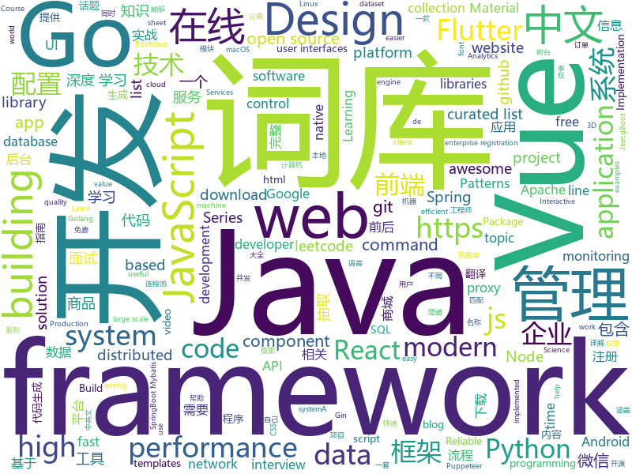

# 2019-06-06
See what the GitHub community is most excited about today.

## python
* [TensorNetwork](https://github.com/google/TensorNetwork)(**189 stars today**): A library for easy and efficient manipulation of tensor networks.
* [kedro](https://github.com/quantumblacklabs/kedro)(**188 stars today**): A Python library for building robust production-ready data and analytics pipelines
* [Python](https://github.com/TheAlgorithms/Python)(**151 stars today**): All Algorithms implemented in Python
* [EfficientNet-PyTorch](https://github.com/lukemelas/EfficientNet-PyTorch)(**159 stars today**): A PyTorch implementation of EfficientNet
* [sqlova](https://github.com/naver/sqlova)(**106 stars today**): 
* [Python-Interview-Problems-for-Practice](https://github.com/devAmoghS/Python-Interview-Problems-for-Practice)(**97 stars today**): 40+ Common code and interview problems solved in Python (it's growing...) Please go through the README.md before starting.
* [funNLP](https://github.com/fighting41love/funNLP)(**84 stars today**): 中英文敏感词、语言检测、中外手机/电话归属地/运营商查询、名字推断性别、手机号抽取、身份证抽取、邮箱抽取、中日文人名库、中文缩写库、拆字词典、词汇情感值、停用词、反动词表、暴恐词表、繁简体转换、英文模拟中文发音、汪峰歌词生成器、职业名称词库、同义词库、反义词库、否定词库、汽车品牌词库、汽车零件词库、连续英文切割、各种中文词向量、公司名字大全、古诗词库、IT词库、财经词库、成语词库、地名词库、历史名人词库、诗词词库、医学词库、饮食词库、法律词库、汽车词库、动物词库、中文聊天语料、中文谣言数据、百度中文问答数据集、句子相似度匹配算法集合、bert资源、文本生成&摘要相关工具、cocoNLP信息抽取工具、国内电话号码正则匹配、清华大学XLORE:中英文跨语言百科知识图谱、清华大学人工智能技术…
* [AiLearning](https://github.com/apachecn/AiLearning)(**81 stars today**): AiLearning: 机器学习 - MachineLearning - ML、深度学习 - DeepLearning - DL、自然语言处理 NLP
* [models](https://github.com/tensorflow/models)(**58 stars today**): Models and examples built with TensorFlow
* [psptool](https://github.com/cwerling/psptool)(**74 stars today**): Display, extract, and manipulate PSP firmware inside UEFI images
* [public-apis](https://github.com/public-apis/public-apis)(**63 stars today**): A collective list of free APIs for use in software and web development.
* [system-design-primer](https://github.com/donnemartin/system-design-primer)(**52 stars today**): Learn how to design large-scale systems. Prep for the system design interview. Includes Anki flashcards.
* [panel](https://github.com/pyviz/panel)(**55 stars today**): A high-level app and dashboarding solution for Python
* [macOS-Simple-KVM](https://github.com/foxlet/macOS-Simple-KVM)(**54 stars today**): Tools to set up a quick macOS VM in QEMU, accelerated by KVM.
* [awesome-python](https://github.com/vinta/awesome-python)(**45 stars today**): A curated list of awesome Python frameworks, libraries, software and resources
* [gluon-ts](https://github.com/awslabs/gluon-ts)(**46 stars today**): GluonTS - Probabilistic Time Series Modeling in Python
* [CheatSheetSeries](https://github.com/OWASP/CheatSheetSeries)(**43 stars today**): The OWASP Cheat Sheet Series was created to provide a concise collection of high value information on specific application security topics.
* [face_recognition](https://github.com/ageitgey/face_recognition)(**42 stars today**): The world's simplest facial recognition api for Python and the command line
* [bert](https://github.com/google-research/bert)(**37 stars today**): TensorFlow code and pre-trained models for BERT
* [ansible](https://github.com/ansible/ansible)(**29 stars today**): Ansible is a radically simple IT automation platform that makes your applications and systems easier to deploy. Avoid writing scripts or custom code to deploy and update your applications — automate in a language that approaches plain English, using SSH, with no agents to install on remote systems. https://docs.ansible.com/ansible/
* [machine-learning-course](https://github.com/machinelearningmindset/machine-learning-course)(**34 stars today**): 💬Machine Learning Course with Python
* [youtube-dl](https://github.com/ytdl-org/youtube-dl)(**33 stars today**): Command-line program to download videos from YouTube.com and other video sites
* [BlueKeep](https://github.com/Ekultek/BlueKeep)(**30 stars today**): Proof of concept for CVE-2019-0708
* [django](https://github.com/django/django)(**29 stars today**): The Web framework for perfectionists with deadlines.
* [black](https://github.com/python/black)(**34 stars today**): The uncompromising Python code formatter

## java
* [JavaGuide](https://github.com/Snailclimb/JavaGuide)(**278 stars today**): 【Java学习+面试指南】 一份涵盖大部分Java程序员所需要掌握的核心知识。
* [CS-Notes](https://github.com/CyC2018/CS-Notes)(**169 stars today**): 📚Basic Knowledge of Technical Interview（技术面试必备基础知识、Leetcode 题解、后端面试、Java 面试、春招、秋招、操作系统、计算机网络、系统设计）
* [advanced-java](https://github.com/doocs/advanced-java)(**150 stars today**): 😮互联网 Java 工程师进阶知识完全扫盲：涵盖高并发、分布式、高可用、微服务等领域知识
* [mall](https://github.com/macrozheng/mall)(**105 stars today**): mall项目是一套电商系统，包括前台商城系统及后台管理系统，基于SpringBoot+MyBatis实现。 前台商城系统包含首页门户、商品推荐、商品搜索、商品展示、购物车、订单流程、会员中心、客户服务、帮助中心等模块。 后台管理系统包含商品管理、订单管理、会员管理、促销管理、运营管理、内容管理、统计报表、财务管理、权限管理、设置等模块。
* [jeecg-boot](https://github.com/zhangdaiscott/jeecg-boot)(**107 stars today**): Jeecg-Boot 是一款基于代码生成器的快速开发平台！采用前后端分离架构：SpringBoot 2.x，Mybatis，Shiro，JWT，Vue&Ant Design。强大的代码生成器让前端和后台代码一键生成，不需要写任何代码，绝对是全栈开发福音！！ JeecgBoot的宗旨是提高UI能力的同时,降低前后分离的开发成本，JeecgBoot还独创在线开发模式，No代码概念，一系列在线智能开发：在线配置表单、在线配置报表、在线设计流程等等。
* [halo](https://github.com/halo-dev/halo)(**105 stars today**): ✍ Halo 一款现代化的个人独立博客系统
* [spring-boot](https://github.com/spring-projects/spring-boot)(**47 stars today**): Spring Boot
* [tutorials](https://github.com/eugenp/tutorials)(**32 stars today**): The "REST With Spring" Course:
* [litemall](https://github.com/linlinjava/litemall)(**47 stars today**): 又一个小商城。litemall = Spring Boot后端 + Vue管理员前端 + 微信小程序用户前端 + Vue用户移动端
* [dubbo](https://github.com/apache/dubbo)(**37 stars today**): Apache Dubbo is a high-performance, java based, open source RPC framework.
* [java-design-patterns](https://github.com/iluwatar/java-design-patterns)(**39 stars today**): Design patterns implemented in Java
* [toBeTopJavaer](https://github.com/hollischuang/toBeTopJavaer)(**42 stars today**): To Be Top Javaer - Java工程师成神之路
* [spring-framework](https://github.com/spring-projects/spring-framework)(**31 stars today**): Spring Framework
* [arthas](https://github.com/alibaba/arthas)(**37 stars today**): Alibaba Java Diagnostic Tool Arthas/Alibaba Java诊断利器Arthas
* [seata](https://github.com/seata/seata)(**34 stars today**): 🔥Seata is an easy-to-use, high-performance, open source distributed transaction solution.
* [apollo](https://github.com/ctripcorp/apollo)(**34 stars today**): Apollo（阿波罗）是携程框架部门研发的分布式配置中心，能够集中化管理应用不同环境、不同集群的配置，配置修改后能够实时推送到应用端，并且具备规范的权限、流程治理等特性，适用于微服务配置管理场景。
* [WxJava](https://github.com/Wechat-Group/WxJava)(**28 stars today**): WxJava （微信开发 Java SDK），支持包括微信支付、开放平台、小程序、企业微信/企业号和公众号等的后端开发
* [elasticsearch](https://github.com/elastic/elasticsearch)(**29 stars today**): Open Source, Distributed, RESTful Search Engine
* [AndroidUtilCode](https://github.com/Blankj/AndroidUtilCode)(**24 stars today**): 🔥Android developers should collect the following utils(updating).
* [JCSprout](https://github.com/crossoverJie/JCSprout)(**27 stars today**): 👨‍🎓Java Core Sprout : basic, concurrent, algorithm
* [okhttp](https://github.com/square/okhttp)(**28 stars today**): An HTTP+HTTP/2 client for Android and Java applications.
* [druid](https://github.com/alibaba/druid)(**27 stars today**): 阿里巴巴数据库事业部出品，为监控而生的数据库连接池。阿里云Data Lake Analytics(https://www.aliyun.com/product/datalakeanalytics )、DRDS、TDDL 连接池powered by Druid
* [skywalking](https://github.com/apache/skywalking)(**25 stars today**): APM, Application Performance Monitoring System
* [Sentinel](https://github.com/alibaba/Sentinel)(**23 stars today**): A lightweight powerful flow control component enabling reliability and monitoring for microservices. (轻量级的流量控制、熔断降级 Java 库)
* [flink](https://github.com/apache/flink)(**21 stars today**): Apache Flink

## unknown
* [Enterprise-Registration-Data-of-Chinese-Mainland](https://github.com/imhuster/Enterprise-Registration-Data-of-Chinese-Mainland)(**1,404 stars today**): 中国大陆 31 个省份1978 年至 2019 年一千多万工商企业注册信息，包含企业名称、注册地址、统一社会信用代码、地区、注册日期、经营范围、法人代表、注册资金、企业类型等详细资料。This repository is an dataset of over 10,000,000 enterprise registration data of 31 provinces in Chinese mainland from 1978 to 2019.【工商大数据】、【企业信息】、【enterprise registration data】。
* [the-art-of-command-line](https://github.com/jlevy/the-art-of-command-line)(**1,297 stars today**): Master the command line, in one page
* [awesome-scalability](https://github.com/binhnguyennus/awesome-scalability)(**314 stars today**): The Patterns Behind Scalable, Reliable, and Performant Large-Scale Systems
* [security](https://github.com/numirias/security)(**251 stars today**): Some of my security stuff, vulnerabilities and exploits. Nothing advanced. More to come.
* [awesome](https://github.com/sindresorhus/awesome)(**157 stars today**): 😎Awesome lists about all kinds of interesting topics
* [The-Documentation-Compendium](https://github.com/kylelobo/The-Documentation-Compendium)(**108 stars today**): 📢Various templates & tips on writing high-quality documentation that people want to read.
* [kinto](https://github.com/ookamiinc/kinto)(**99 stars today**): 均等 — Kinto is a Japanese font family adapted to match size & balance with Latin characters in user interfaces. A project based off Google Noto fonts.
* [GSYFlutterBook](https://github.com/CarGuo/GSYFlutterBook)(**91 stars today**): Flutter完整开发实战详解系列，提供在线预览和pdf下载，本系列将完整讲述：如何快速从 0 开发一个完整的 Flutter APP，配套高完成度 Flutter 开源项目 GSYGithubAppFlutter ，同时会提供一些Flutter的开发细节技巧，之后深入源码和实战为你全面解析 Flutter 。
* [You-Dont-Know-JS](https://github.com/getify/You-Dont-Know-JS)(**68 stars today**): A book series on JavaScript. @YDKJS on twitter.
* [fe-sibi-guide](https://github.com/thzt/fe-sibi-guide)(**71 stars today**): 前端撕逼指南
* [gitignore](https://github.com/github/gitignore)(**49 stars today**): A collection of useful .gitignore templates
* [DeepLearning-500-questions](https://github.com/scutan90/DeepLearning-500-questions)(**53 stars today**): 深度学习500问，以问答形式对常用的概率知识、线性代数、机器学习、深度学习、计算机视觉等热点问题进行阐述，以帮助自己及有需要的读者。 全书分为18个章节，50余万字。由于水平有限，书中不妥之处恳请广大读者批评指正。 未完待续............ 如有意合作，联系scutjy2015@163.com 版权所有，违权必究 Tan 2018.06
* [free-programming-books](https://github.com/EbookFoundation/free-programming-books)(**60 stars today**): 📚Freely available programming books
* [awesome-public-datasets](https://github.com/awesomedata/awesome-public-datasets)(**58 stars today**): A topic-centric list of HQ open datasets. PR ☛☛☛
* [free-programming-books-zh_CN](https://github.com/justjavac/free-programming-books-zh_CN)(**55 stars today**): 📚免费的计算机编程类中文书籍，欢迎投稿
* [awesome-vue](https://github.com/vuejs/awesome-vue)(**53 stars today**): 🎉A curated list of awesome things related to Vue.js
* [industry-machine-learning](https://github.com/firmai/industry-machine-learning)(**52 stars today**): A curated list of applied machine learning and data science notebooks and libraries across different industries.
* [Mathematics_for_Beginners](https://github.com/llSourcell/Mathematics_for_Beginners)(**44 stars today**): This is the formula sheet for "Mathematics for Beginners" by Siraj Raval on Youtube
* [hacker-laws](https://github.com/dwmkerr/hacker-laws)(**44 stars today**): 💻📖Laws, Theories, Principles and Patterns that developers will find useful. #hackerlaws
* [git_training](https://github.com/UnseenWizzard/git_training)(**16 stars today**): An interactive git training meant to teach you how git works, not just which commands to execute
* [xiaozhi](https://github.com/qq449245884/xiaozhi)(**36 stars today**): 
* [hosts](https://github.com/googlehosts/hosts)(**27 stars today**): 镜像：https://coding.net/u/scaffrey/p/hosts/git
* [architect-awesome](https://github.com/xingshaocheng/architect-awesome)(**32 stars today**): 后端架构师技术图谱
* [rfcs](https://github.com/vuejs/rfcs)(**37 stars today**): RFCs for substantial changes / feature additions to Vue core
* [gold-miner](https://github.com/xitu/gold-miner)(**33 stars today**): 🥇掘金翻译计划，可能是世界最大最好的英译中技术社区，最懂读者和译者的翻译平台：

## javascript
* [algorithm-visualizer](https://github.com/algorithm-visualizer/algorithm-visualizer)(**226 stars today**): 🎆Interactive Online Platform that Visualizes Algorithms from Code
* [zdog](https://github.com/metafizzy/zdog)(**205 stars today**): Flat, round, designer-friendly pseudo-3D engine for canvas & SVG
* [entropic](https://github.com/entropic-dev/entropic)(**189 stars today**): 🦝📦a package registry for anything, but mostly javascript 🦝 🦝 🦝
* [vue](https://github.com/vuejs/vue)(**135 stars today**): 🖖Vue.js is a progressive, incrementally-adoptable JavaScript framework for building UI on the web.
* [leetcode](https://github.com/azl397985856/leetcode)(**125 stars today**): LeetCode Solutions: A Record of My Problem Solving Journey.( leetcode题解，记录自己的leetcode解题之路。)
* [yapi](https://github.com/YMFE/yapi)(**117 stars today**): YApi 是一个可本地部署的、打通前后端及QA的、可视化的接口管理平台
* [medium-to-own-blog](https://github.com/mathieudutour/medium-to-own-blog)(**103 stars today**): Switch from Medium to your own blog in a few minutes
* [react](https://github.com/facebook/react)(**79 stars today**): A declarative, efficient, and flexible JavaScript library for building user interfaces.
* [uni-app](https://github.com/dcloudio/uni-app)(**71 stars today**): 使用 Vue.js 开发跨平台应用的前端框架
* [puppeteer-recorder](https://github.com/checkly/puppeteer-recorder)(**64 stars today**): Puppeteer recorder is a Chrome extension that records your browser interactions and generates a Puppeteer script.
* [vuetify](https://github.com/vuetifyjs/vuetify)(**61 stars today**): 🐉Material Component Framework for Vue.js 2
* [CSS-Inspiration](https://github.com/chokcoco/CSS-Inspiration)(**61 stars today**): CSS Inspiration，在这里找到写 CSS 的灵感！
* [axios](https://github.com/axios/axios)(**55 stars today**): Promise based HTTP client for the browser and node.js
* [bootstrap](https://github.com/twbs/bootstrap)(**41 stars today**): The most popular HTML, CSS, and JavaScript framework for developing responsive, mobile first projects on the web.
* [node](https://github.com/nodejs/node)(**47 stars today**): Node.js JavaScript runtime✨🐢🚀✨
* [quasar](https://github.com/quasarframework/quasar)(**51 stars today**): Quasar Framework - High performance, Material Design 2, full front end stack with Vue.js
* [three.js](https://github.com/mrdoob/three.js)(**46 stars today**): JavaScript 3D library.
* [gatsby](https://github.com/gatsbyjs/gatsby)(**44 stars today**): Build blazing fast, modern apps and websites with React
* [nodebestpractices](https://github.com/i0natan/nodebestpractices)(**50 stars today**): ✅The largest Node.js best practices list (May 2019)
* [FunctionScript](https://github.com/FunctionScript/FunctionScript)(**51 stars today**): A language and specification for turning JavaScript functions into typed HTTP APIs
* [puppeteer](https://github.com/GoogleChrome/puppeteer)(**47 stars today**): Headless Chrome Node API
* [storybook](https://github.com/storybookjs/storybook)(**46 stars today**): UI component dev & test: React, Vue, Angular, React Native, Ember, Web Components & more!
* [baiduyun](https://github.com/syhyz1990/baiduyun)(**48 stars today**): 🖖油猴脚本 一个脚本搞定百度网盘下载
* [react-native](https://github.com/facebook/react-native)(**42 stars today**): A framework for building native apps with React.
* [material-ui](https://github.com/mui-org/material-ui)(**37 stars today**): React components for faster and easier web development. Build your own design system, or start with Material Design.

## html
* [html_wysiwyg](https://github.com/secretGeek/html_wysiwyg)(**68 stars today**): A truly naked, brutalist html quine
* [data-science-at-the-command-line](https://github.com/jeroenjanssens/data-science-at-the-command-line)(**60 stars today**): Data Science at the Command Line
* [linux-command](https://github.com/jaywcjlove/linux-command)(**33 stars today**): Linux命令大全搜索工具，内容包含Linux命令手册、详解、学习、搜集。https://git.io/linux
* [practical_ggplot2](https://github.com/clauswilke/practical_ggplot2)(**33 stars today**): Step-by-step examples of building publication-quality figures in ggplot2
* [AdminLTE](https://github.com/ColorlibHQ/AdminLTE)(**20 stars today**): AdminLTE - Free Premium Admin control Panel Theme Based On Bootstrap 3.x
* [flutter-in-action](https://github.com/flutterchina/flutter-in-action)(**21 stars today**): 《Flutter实战》电子书
* [proposal-optional-chaining](https://github.com/tc39/proposal-optional-chaining)(**22 stars today**): 
* [scikit-learn-doc-zh](https://github.com/apachecn/scikit-learn-doc-zh)(**19 stars today**): 📖[译] scikit-learn（sklearn） 中文文档
* [en.javascript.info](https://github.com/javascript-tutorial/en.javascript.info)(**17 stars today**): Modern JavaScript Tutorial
* [JavaScript30](https://github.com/wesbos/JavaScript30)(**10 stars today**): 30 Day Vanilla JS Challenge
* [awesome-modern-cpp](https://github.com/rigtorp/awesome-modern-cpp)(**15 stars today**): A collection of resources on modern C++
* [IMGGraphBed](https://github.com/uk0/IMGGraphBed)(**15 stars today**): 图床 支持HDFS 本地存储等。
* [nndl.github.io](https://github.com/nndl/nndl.github.io)(**14 stars today**): 《神经网络与深度学习》 Neural Network and Deep Learning
* [Spoon-Knife](https://github.com/octocat/Spoon-Knife)(****): This repo is for demonstration purposes only.
* [styleguide](https://github.com/google/styleguide)(**11 stars today**): Style guides for Google-originated open-source projects
* [nginxconfig.io](https://github.com/0xB4LINT/nginxconfig.io)(**12 stars today**): ⚙️NGiИX config generator on steroids💉
* [hyperblog](https://github.com/freddier/hyperblog)(**7 stars today**): Un blog increíble para el curso de Git y Github de Platzi
* [comicgen](https://github.com/gramener/comicgen)(**11 stars today**): Create comics for your website or app
* [zfaka](https://github.com/zlkbdotnet/zfaka)(**11 stars today**): 免费、安全、稳定、高效的发卡系统，值得拥有!
* [personal-website](https://github.com/github/personal-website)(**7 stars today**): Code that'll help you kickstart a personal website that showcases your work as a software developer.
* [uix-kit](https://github.com/xizon/uix-kit)(**11 stars today**): A free web kits for fast web design and development, compatible with Bootstrap v4.
* [learning-area](https://github.com/mdn/learning-area)(**5 stars today**): Github repo for the MDN Learning Area.
* [curriculum](https://github.com/functionalCS/curriculum)(**10 stars today**): A Modern CompSci Curriculum
* [portainer](https://github.com/portainer/portainer)(**10 stars today**): Simple management UI for Docker
* [professional-services](https://github.com/GoogleCloudPlatform/professional-services)(**10 stars today**): Common solutions and tools developed by Google Cloud's Professional Services team

## go
* [v2ray-core](https://github.com/v2ray/v2ray-core)(**213 stars today**): A platform for building proxies to bypass network restrictions.
* [dubbo-go](https://github.com/apache/dubbo-go)(**68 stars today**): Go Implementation For Apache Dubbo
* [sqlflow](https://github.com/sql-machine-learning/sqlflow)(**61 stars today**): Brings SQL and AI together.
* [proposal](https://github.com/golang/proposal)(**64 stars today**): Go Project Design Documents
* [frp](https://github.com/fatedier/frp)(**50 stars today**): A fast reverse proxy to help you expose a local server behind a NAT or firewall to the internet.
* [lantern](https://github.com/getlantern/lantern)(**52 stars today**): 🔴蓝灯最新版本下载 https://github.com/getlantern/download🔴Lantern Latest Download https://github.com/getlantern/download🔴
* [kubernetes](https://github.com/kubernetes/kubernetes)(**43 stars today**): Production-Grade Container Scheduling and Management
* [go](https://github.com/golang/go)(**45 stars today**): The Go programming language
* [brook](https://github.com/txthinking/brook)(**46 stars today**): Brook is a cross-platform(Linux/MacOS/Windows/Android/iOS) proxy/vpn software
* [awesome-go](https://github.com/avelino/awesome-go)(**38 stars today**): A curated list of awesome Go frameworks, libraries and software
* [go-streams](https://github.com/reugn/go-streams)(**41 stars today**): Go stream processing library
* [reading-go](https://github.com/developer-learning/reading-go)(**40 stars today**): Go 夜读 > 每周通过 zoom 在线直播的方式分享 Go 相关的技术话题，每天大家在 微信/Slack 上及时沟通交流编程技术话题。
* [kratos](https://github.com/bilibili/kratos)(**34 stars today**): Kratos是bilibili开源的一套Go微服务框架，包含大量微服务相关框架及工具。
* [zinx](https://github.com/aceld/zinx)(**34 stars today**): 基于Golang轻量级TCP并发服务器框架
* [helm](https://github.com/helm/helm)(**32 stars today**): The Kubernetes Package Manager
* [hugo](https://github.com/gohugoio/hugo)(**33 stars today**): The world’s fastest framework for building websites.
* [prometheus](https://github.com/prometheus/prometheus)(**29 stars today**): The Prometheus monitoring system and time series database.
* [istio](https://github.com/istio/istio)(**27 stars today**): Connect, secure, control, and observe services.
* [cockroach](https://github.com/cockroachdb/cockroach)(**28 stars today**): CockroachDB - the open source, cloud-native SQL database.
* [gin](https://github.com/gin-gonic/gin)(**26 stars today**): Gin is a HTTP web framework written in Go (Golang). It features a Martini-like API with much better performance -- up to 40 times faster. If you need smashing performance, get yourself some Gin.
* [tidb](https://github.com/pingcap/tidb)(**28 stars today**): TiDB is a distributed HTAP database compatible with the MySQL protocol
* [fzf](https://github.com/junegunn/fzf)(**27 stars today**): 🌸A command-line fuzzy finder
* [etcd](https://github.com/etcd-io/etcd)(**26 stars today**): Distributed reliable key-value store for the most critical data of a distributed system
* [cobra](https://github.com/spf13/cobra)(**26 stars today**): A Commander for modern Go CLI interactions
* [goproxy.cn](https://github.com/goproxy/goproxy.cn)(**26 stars today**): The most trusted Go module proxy in China.

## WordCloud

