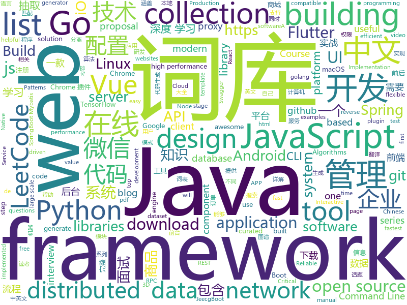

# 2019-06-07
See what the GitHub community is most excited about today.

## python
* [EverydayWechat](https://github.com/sfyc23/EverydayWechat)(**374 stars today**): 每日自动给女朋友发微信暖心话。
* [kedro](https://github.com/quantumblacklabs/kedro)(**225 stars today**): A Python library for building robust production-ready data and analytics pipelines
* [EfficientNet-PyTorch](https://github.com/lukemelas/EfficientNet-PyTorch)(**177 stars today**): A PyTorch implementation of EfficientNet
* [Python](https://github.com/TheAlgorithms/Python)(**148 stars today**): All Algorithms implemented in Python
* [TensorNetwork](https://github.com/google/TensorNetwork)(**135 stars today**): A library for easy and efficient manipulation of tensor networks.
* [funNLP](https://github.com/fighting41love/funNLP)(**88 stars today**): 中英文敏感词、语言检测、中外手机/电话归属地/运营商查询、名字推断性别、手机号抽取、身份证抽取、邮箱抽取、中日文人名库、中文缩写库、拆字词典、词汇情感值、停用词、反动词表、暴恐词表、繁简体转换、英文模拟中文发音、汪峰歌词生成器、职业名称词库、同义词库、反义词库、否定词库、汽车品牌词库、汽车零件词库、连续英文切割、各种中文词向量、公司名字大全、古诗词库、IT词库、财经词库、成语词库、地名词库、历史名人词库、诗词词库、医学词库、饮食词库、法律词库、汽车词库、动物词库、中文聊天语料、中文谣言数据、百度中文问答数据集、句子相似度匹配算法集合、bert资源、文本生成&摘要相关工具、cocoNLP信息抽取工具、国内电话号码正则匹配、清华大学XLORE:中英文跨语言百科知识图谱、清华大学人工智能技术…
* [machine-learning-course](https://github.com/machinelearningmindset/machine-learning-course)(**86 stars today**): 💬Machine Learning Course with Python. Refer to the course page for step-by-step explanations.
* [internetarchive](https://github.com/jjjake/internetarchive)(**76 stars today**): A Python and Command-Line Interface to Archive.org
* [AiLearning](https://github.com/apachecn/AiLearning)(**55 stars today**): AiLearning: 机器学习 - MachineLearning - ML、深度学习 - DeepLearning - DL、自然语言处理 NLP
* [psptool](https://github.com/cwerling/psptool)(**57 stars today**): Display, extract, and manipulate PSP firmware inside UEFI images
* [RDPassSpray](https://github.com/xFreed0m/RDPassSpray)(**53 stars today**): Python3 tool to perform password spraying using RDP
* [models](https://github.com/tensorflow/models)(**40 stars today**): Models and examples built with TensorFlow
* [algo](https://github.com/wangzheng0822/algo)(**48 stars today**): 数据结构和算法必知必会的50个代码实现
* [system-design-primer](https://github.com/donnemartin/system-design-primer)(**45 stars today**): Learn how to design large-scale systems. Prep for the system design interview. Includes Anki flashcards.
* [bert](https://github.com/google-research/bert)(**42 stars today**): TensorFlow code and pre-trained models for BERT
* [awesome-python](https://github.com/vinta/awesome-python)(**41 stars today**): A curated list of awesome Python frameworks, libraries, software and resources
* [CheatSheetSeries](https://github.com/OWASP/CheatSheetSeries)(**43 stars today**): The OWASP Cheat Sheet Series was created to provide a concise collection of high value information on specific application security topics.
* [public-apis](https://github.com/public-apis/public-apis)(**40 stars today**): A collective list of free APIs for use in software and web development.
* [sqlova](https://github.com/naver/sqlova)(**41 stars today**): 
* [youtube-dl](https://github.com/ytdl-org/youtube-dl)(**37 stars today**): Command-line program to download videos from YouTube.com and other video sites
* [ChromeAppHeroes](https://github.com/zhaoolee/ChromeAppHeroes)(**35 stars today**): 🌈谷粒-Chrome插件英雄榜, 为优秀的Chrome插件写一本中文说明书, 让Chrome插件英雄们造福人类~ ChromePluginHeroes, Write a Chinese manual for the excellent Chrome plugin, let the Chrome plugin heroes benefit the human~
* [macOS-Simple-KVM](https://github.com/foxlet/macOS-Simple-KVM)(**37 stars today**): Tools to set up a quick macOS VM in QEMU, accelerated by KVM.
* [loguru](https://github.com/Delgan/loguru)(**38 stars today**): Python logging made (stupidly) simple
* [flask](https://github.com/pallets/flask)(**29 stars today**): The Python micro framework for building web applications.
* [invertible-resnet](https://github.com/jhjacobsen/invertible-resnet)(**34 stars today**): Official Code for Invertible Residual Networks

## java
* [LeetCodeAnimation](https://github.com/MisterBooo/LeetCodeAnimation)(**302 stars today**): Demonstrate all the questions on LeetCode in the form of animation.（用动画的形式呈现解LeetCode题目的思路）
* [JavaGuide](https://github.com/Snailclimb/JavaGuide)(**266 stars today**): 【Java学习+面试指南】 一份涵盖大部分Java程序员所需要掌握的核心知识。
* [CS-Notes](https://github.com/CyC2018/CS-Notes)(**221 stars today**): 📚Basic Knowledge of Technical Interview（技术面试必备基础知识、Leetcode 题解、后端面试、Java 面试、春招、秋招、操作系统、计算机网络、系统设计）
* [advanced-java](https://github.com/doocs/advanced-java)(**148 stars today**): 😮互联网 Java 工程师进阶知识完全扫盲：涵盖高并发、分布式、高可用、微服务等领域知识
* [mall](https://github.com/macrozheng/mall)(**76 stars today**): mall项目是一套电商系统，包括前台商城系统及后台管理系统，基于SpringBoot+MyBatis实现。 前台商城系统包含首页门户、商品推荐、商品搜索、商品展示、购物车、订单流程、会员中心、客户服务、帮助中心等模块。 后台管理系统包含商品管理、订单管理、会员管理、促销管理、运营管理、内容管理、统计报表、财务管理、权限管理、设置等模块。
* [jeecg-boot](https://github.com/zhangdaiscott/jeecg-boot)(**58 stars today**): Jeecg-Boot 是一款基于代码生成器的快速开发平台！采用前后端分离架构：SpringBoot 2.x，Mybatis，Shiro，JWT，Vue&Ant Design。强大的代码生成器让前端和后台代码一键生成，不需要写任何代码，绝对是全栈开发福音！！ JeecgBoot的宗旨是提高UI能力的同时,降低前后分离的开发成本，JeecgBoot还独创在线开发模式，No代码概念，一系列在线智能开发：在线配置表单、在线配置报表、在线设计流程等等。
* [halo](https://github.com/halo-dev/halo)(**48 stars today**): ✍ Halo 一款现代化的个人独立博客系统
* [tutorials](https://github.com/eugenp/tutorials)(**30 stars today**): The "REST With Spring" Course:
* [spring-boot](https://github.com/spring-projects/spring-boot)(**40 stars today**): Spring Boot
* [litemall](https://github.com/linlinjava/litemall)(**34 stars today**): 又一个小商城。litemall = Spring Boot后端 + Vue管理员前端 + 微信小程序用户前端 + Vue用户移动端
* [seata](https://github.com/seata/seata)(**27 stars today**): 🔥Seata is an easy-to-use, high-performance, open source distributed transaction solution.
* [apollo](https://github.com/ctripcorp/apollo)(**27 stars today**): Apollo（阿波罗）是携程框架部门研发的分布式配置中心，能够集中化管理应用不同环境、不同集群的配置，配置修改后能够实时推送到应用端，并且具备规范的权限、流程治理等特性，适用于微服务配置管理场景。
* [spring-framework](https://github.com/spring-projects/spring-framework)(**23 stars today**): Spring Framework
* [dubbo](https://github.com/apache/dubbo)(**24 stars today**): Apache Dubbo is a high-performance, java based, open source RPC framework.
* [ghidra](https://github.com/NationalSecurityAgency/ghidra)(**25 stars today**): Ghidra is a software reverse engineering (SRE) framework
* [DoraemonKit](https://github.com/didi/DoraemonKit)(**25 stars today**): 简称 "DoKit" 。一款功能齐全的客户端（ iOS 、Android ）研发助手，你值得拥有。
* [elasticsearch](https://github.com/elastic/elasticsearch)(**21 stars today**): Open Source, Distributed, RESTful Search Engine
* [arthas](https://github.com/alibaba/arthas)(**23 stars today**): Alibaba Java Diagnostic Tool Arthas/Alibaba Java诊断利器Arthas
* [Java](https://github.com/TheAlgorithms/Java)(**23 stars today**): All Algorithms implemented in Java
* [JCSprout](https://github.com/crossoverJie/JCSprout)(**24 stars today**): 👨‍🎓Java Core Sprout : basic, concurrent, algorithm
* [retrofit](https://github.com/square/retrofit)(**23 stars today**): Type-safe HTTP client for Android and Java by Square, Inc.
* [toBeTopJavaer](https://github.com/hollischuang/toBeTopJavaer)(**23 stars today**): To Be Top Javaer - Java工程师成神之路
* [guava](https://github.com/google/guava)(**21 stars today**): Google core libraries for Java
* [WxJava](https://github.com/Wechat-Group/WxJava)(**20 stars today**): WxJava （微信开发 Java SDK），支持包括微信支付、开放平台、小程序、企业微信/企业号和公众号等的后端开发
* [netty](https://github.com/netty/netty)(**15 stars today**): Netty project - an event-driven asynchronous network application framework

## unknown
* [Enterprise-Registration-Data-of-Chinese-Mainland](https://github.com/imhuster/Enterprise-Registration-Data-of-Chinese-Mainland)(**1,709 stars today**): 中国大陆 31 个省份1978 年至 2019 年一千多万工商企业注册信息，包含企业名称、注册地址、统一社会信用代码、地区、注册日期、经营范围、法人代表、注册资金、企业类型等详细资料。This repository is an dataset of over 10,000,000 enterprise registration data of 31 provinces in Chinese mainland from 1978 to 2019.【工商大数据】、【企业信息】、【enterprise registration data】。
* [the-art-of-command-line](https://github.com/jlevy/the-art-of-command-line)(**736 stars today**): Master the command line, in one page
* [awesome-scalability](https://github.com/binhnguyennus/awesome-scalability)(**187 stars today**): 🌰The Patterns of Scalable, Reliable, and Performant Large-Scale Systems
* [security](https://github.com/numirias/security)(**153 stars today**): Some of my security stuff and vulnerabilities. Nothing advanced. More to come.
* [awesome](https://github.com/sindresorhus/awesome)(**116 stars today**): 😎Awesome lists about all kinds of interesting topics
* [fe-necessary-book](https://github.com/ddzy/fe-necessary-book)(**100 stars today**): A pdf and software collection about frontend
* [hacker-laws](https://github.com/dwmkerr/hacker-laws)(**67 stars today**): 💻📖Laws, Theories, Principles and Patterns that developers will find useful. #hackerlaws
* [gitignore](https://github.com/github/gitignore)(**42 stars today**): A collection of useful .gitignore templates
* [hacker-laws-zh](https://github.com/nusr/hacker-laws-zh)(**51 stars today**): 💻📖对开发人员有用的定律、理论、原则和模式。 ** 找工作中 **
* [DeepLearning-500-questions](https://github.com/scutan90/DeepLearning-500-questions)(**48 stars today**): 深度学习500问，以问答形式对常用的概率知识、线性代数、机器学习、深度学习、计算机视觉等热点问题进行阐述，以帮助自己及有需要的读者。 全书分为18个章节，50余万字。由于水平有限，书中不妥之处恳请广大读者批评指正。 未完待续............ 如有意合作，联系scutjy2015@163.com 版权所有，违权必究 Tan 2018.06
* [You-Dont-Know-JS](https://github.com/getify/You-Dont-Know-JS)(**50 stars today**): A book series on JavaScript. @YDKJS on twitter.
* [free-programming-books-zh_CN](https://github.com/justjavac/free-programming-books-zh_CN)(**47 stars today**): 📚免费的计算机编程类中文书籍，欢迎投稿
* [free-programming-books](https://github.com/EbookFoundation/free-programming-books)(**48 stars today**): 📚Freely available programming books
* [sealed-rust](https://github.com/ferrous-systems/sealed-rust)(**46 stars today**): Bringing Rust to the Safety Critical Domain
* [GSYFlutterBook](https://github.com/CarGuo/GSYFlutterBook)(**43 stars today**): Flutter完整开发实战详解系列，提供在线预览和pdf下载，本系列将完整讲述：如何快速从 0 开发一个完整的 Flutter APP，配套高完成度 Flutter 开源项目 GSYGithubAppFlutter ，同时会提供一些Flutter的开发细节技巧，之后深入源码和实战为你全面解析 Flutter 。
* [git_training](https://github.com/UnseenWizzard/git_training)(**10 stars today**): An interactive git training meant to teach you how git works, not just which commands to execute
* [the-book-of-secret-knowledge](https://github.com/trimstray/the-book-of-secret-knowledge)(**36 stars today**): A collection of inspiring lists, manuals, cheatsheets, blogs, hacks, one-liners, cli/web tools and more.
* [setup-examples](https://github.com/tailwindcss/setup-examples)(**31 stars today**): 
* [awesome-public-datasets](https://github.com/awesomedata/awesome-public-datasets)(**33 stars today**): A topic-centric list of HQ open datasets. PR ☛☛☛
* [architect-awesome](https://github.com/xingshaocheng/architect-awesome)(**32 stars today**): 后端架构师技术图谱
* [gold-miner](https://github.com/xitu/gold-miner)(**33 stars today**): 🥇掘金翻译计划，可能是世界最大最好的英译中技术社区，最懂读者和译者的翻译平台：
* [app-ideas](https://github.com/florinpop17/app-ideas)(**31 stars today**): A Collection of application ideas which can be used to improve your coding skills.
* [cli-cheatsheet](https://github.com/sw-yx/cli-cheatsheet)(**32 stars today**): helpful libraries for *building* CLIs. Not a list of CLIs.
* [proposal-const-value-types](https://github.com/rricard/proposal-const-value-types)(**30 stars today**): A proposal for immutable data structures in JavaScript | ⚠ Stage 0: it will change!
* [3D-BoNet](https://github.com/Yang7879/3D-BoNet)(**30 stars today**): 3D-BoNet in Tensorflow (preprint arXiv: 1906.01140)

## javascript
* [algorithm-visualizer](https://github.com/algorithm-visualizer/algorithm-visualizer)(**235 stars today**): 🎆Interactive Online Platform that Visualizes Algorithms from Code
* [leetcode](https://github.com/azl397985856/leetcode)(**180 stars today**): LeetCode Solutions: A Record of My Problem Solving Journey.( leetcode题解，记录自己的leetcode解题之路。)
* [zdog](https://github.com/metafizzy/zdog)(**168 stars today**): Flat, round, designer-friendly pseudo-3D engine for canvas & SVG
* [entropic](https://github.com/entropic-dev/entropic)(**140 stars today**): 🦝📦a package registry for anything, but mostly javascript 🦝 🦝 🦝
* [vue](https://github.com/vuejs/vue)(**102 stars today**): 🖖Vue.js is a progressive, incrementally-adoptable JavaScript framework for building UI on the web.
* [react](https://github.com/facebook/react)(**74 stars today**): A declarative, efficient, and flexible JavaScript library for building user interfaces.
* [medium-to-own-blog](https://github.com/mathieudutour/medium-to-own-blog)(**70 stars today**): Switch from Medium to your own blog in a few minutes
* [puppeteer-recorder](https://github.com/checkly/puppeteer-recorder)(**69 stars today**): Puppeteer recorder is a Chrome extension that records your browser interactions and generates a Puppeteer script.
* [30-seconds-of-code](https://github.com/30-seconds/30-seconds-of-code)(**60 stars today**): A curated collection of useful JavaScript snippets that you can understand in 30 seconds or less.
* [storefront-ui](https://github.com/DivanteLtd/storefront-ui)(**63 stars today**): Customization-first Vue.js UI framework for eCommerce.
* [axios](https://github.com/axios/axios)(**57 stars today**): Promise based HTTP client for the browser and node.js
* [material-ui](https://github.com/mui-org/material-ui)(**45 stars today**): React components for faster and easier web development. Build your own design system, or start with Material Design.
* [gatsby](https://github.com/gatsbyjs/gatsby)(**44 stars today**): Build blazing fast, modern apps and websites with React
* [node](https://github.com/nodejs/node)(**44 stars today**): Node.js JavaScript runtime✨🐢🚀✨
* [strapi](https://github.com/strapi/strapi)(**51 stars today**): 🚀Open source Node.js Headless CMS to easily build customisable APIs
* [generators](https://github.com/sugarkubes/generators)(**49 stars today**): API Generator - instantly generate REST and GraphQL APIs (openapi (OAS) 3.0.0)
* [Awesome-Design-Tools](https://github.com/LisaDziuba/Awesome-Design-Tools)(**50 stars today**): The best design tools for everything👉
* [baiduyun](https://github.com/syhyz1990/baiduyun)(**46 stars today**): 🖖油猴脚本 一个脚本搞定百度网盘下载
* [storybook](https://github.com/storybookjs/storybook)(**42 stars today**): UI component dev & test: React, Vue, Angular, React Native, Ember, Web Components & more!
* [joplin](https://github.com/laurent22/joplin)(**44 stars today**): Joplin - a note taking and to-do application with synchronization capabilities for Windows, macOS, Linux, Android and iOS. Forum: https://discourse.joplinapp.org/
* [pixi.js](https://github.com/pixijs/pixi.js)(**43 stars today**): The HTML5 Creation Engine: Create beautiful digital content with the fastest, most flexible 2D WebGL renderer.
* [yapi](https://github.com/YMFE/yapi)(**45 stars today**): YApi 是一个可本地部署的、打通前后端及QA的、可视化的接口管理平台
* [bootstrap](https://github.com/twbs/bootstrap)(**34 stars today**): The most popular HTML, CSS, and JavaScript framework for developing responsive, mobile first projects on the web.
* [libpku](https://github.com/lib-pku/libpku)(**39 stars today**): 贵校课程资料民间整理
* [Motrix](https://github.com/agalwood/Motrix)(**41 stars today**): A full-featured download manager.

## html
* [proposal-optional-chaining](https://github.com/tc39/proposal-optional-chaining)(**54 stars today**): 
* [flutter-in-action](https://github.com/flutterchina/flutter-in-action)(**35 stars today**): 《Flutter实战》电子书
* [linux-command](https://github.com/jaywcjlove/linux-command)(**21 stars today**): Linux命令大全搜索工具，内容包含Linux命令手册、详解、学习、搜集。https://git.io/linux
* [Front-end-Developer-Interview-Questions](https://github.com/h5bp/Front-end-Developer-Interview-Questions)(**22 stars today**): A list of helpful front-end related questions you can use to interview potential candidates, test yourself or completely ignore.
* [proposal-top-level-await](https://github.com/tc39/proposal-top-level-await)(**22 stars today**): top-level `await` proposal for ECMAScript (stage 3)
* [styleguide](https://github.com/google/styleguide)(**16 stars today**): Style guides for Google-originated open-source projects
* [practical_ggplot2](https://github.com/clauswilke/practical_ggplot2)(**17 stars today**): Step-by-step examples of building publication-quality figures in ggplot2
* [Spoon-Knife](https://github.com/octocat/Spoon-Knife)(****): This repo is for demonstration purposes only.
* [AdminLTE](https://github.com/ColorlibHQ/AdminLTE)(**11 stars today**): AdminLTE - Free Premium Admin control Panel Theme Based On Bootstrap 3.x
* [JavaScript30](https://github.com/wesbos/JavaScript30)(**7 stars today**): 30 Day Vanilla JS Challenge
* [html_wysiwyg](https://github.com/secretGeek/html_wysiwyg)(**14 stars today**): A truly naked, brutalist html quine
* [nndl.github.io](https://github.com/nndl/nndl.github.io)(**16 stars today**): 《神经网络与深度学习》 Neural Network and Deep Learning
* [unwalled.garden](https://github.com/beakerbrowser/unwalled.garden)(**16 stars today**): Schemas for a p2p social-media network built on the Dat Web.
* [swagger-codegen](https://github.com/swagger-api/swagger-codegen)(**12 stars today**): swagger-codegen contains a template-driven engine to generate documentation, API clients and server stubs in different languages by parsing your OpenAPI / Swagger definition.
* [IMGGraphBed](https://github.com/uk0/IMGGraphBed)(**14 stars today**): 图床 支持HDFS 本地存储等。
* [proposal-nullish-coalescing](https://github.com/tc39/proposal-nullish-coalescing)(**13 stars today**): Nullish coalescing proposal x ?? y
* [professional-services](https://github.com/GoogleCloudPlatform/professional-services)(**12 stars today**): Common solutions and tools developed by Google Cloud's Professional Services team
* [nginxconfig.io](https://github.com/0xB4LINT/nginxconfig.io)(**12 stars today**): ⚙️NGiИX config generator on steroids💉
* [hyperblog](https://github.com/freddier/hyperblog)(**7 stars today**): Un blog increíble para el curso de Git y Github de Platzi
* [Java_Study_Zhao](https://github.com/dixonzhao/Java_Study_Zhao)(**11 stars today**): 
* [portainer](https://github.com/portainer/portainer)(**10 stars today**): Simple management UI for Docker
* [en.javascript.info](https://github.com/javascript-tutorial/en.javascript.info)(**8 stars today**): Modern JavaScript Tutorial
* [awesome-modern-cpp](https://github.com/rigtorp/awesome-modern-cpp)(**8 stars today**): A collection of resources on modern C++
* [all-contributors](https://github.com/all-contributors/all-contributors)(**8 stars today**): ✨Recognize all contributors, not just the ones who push code✨
* [hover-effect](https://github.com/robin-dela/hover-effect)(**8 stars today**): Javascript library to draw and animate images on hover

## go
* [v2ray-core](https://github.com/v2ray/v2ray-core)(**179 stars today**): A platform for building proxies to bypass network restrictions.
* [kubernetes](https://github.com/kubernetes/kubernetes)(**51 stars today**): Production-Grade Container Scheduling and Management
* [go](https://github.com/golang/go)(**54 stars today**): The Go programming language
* [sqlflow](https://github.com/sql-machine-learning/sqlflow)(**44 stars today**): Brings SQL and AI together.
* [dubbo-go](https://github.com/apache/dubbo-go)(**41 stars today**): Go Implementation For Apache Dubbo
* [lantern](https://github.com/getlantern/lantern)(**37 stars today**): 🔴蓝灯最新版本下载 https://github.com/getlantern/download🔴Lantern Latest Download https://github.com/getlantern/download🔴
* [brook](https://github.com/txthinking/brook)(**37 stars today**): Brook is a cross-platform(Linux/MacOS/Windows/Android/iOS) proxy/vpn software
* [twirp](https://github.com/twitchtv/twirp)(**38 stars today**): A simple RPC framework with protobuf service definitions
* [hugo](https://github.com/gohugoio/hugo)(**36 stars today**): The world’s fastest framework for building websites.
* [awesome-go](https://github.com/avelino/awesome-go)(**37 stars today**): A curated list of awesome Go frameworks, libraries and software
* [frp](https://github.com/fatedier/frp)(**33 stars today**): A fast reverse proxy to help you expose a local server behind a NAT or firewall to the internet.
* [prometheus](https://github.com/prometheus/prometheus)(**31 stars today**): The Prometheus monitoring system and time series database.
* [reading-go](https://github.com/developer-learning/reading-go)(**33 stars today**): Go 夜读 > 每周通过 zoom 在线直播的方式分享 Go 相关的技术话题，每天大家在 微信/Slack 上及时沟通交流编程技术话题。
* [tidb](https://github.com/pingcap/tidb)(**31 stars today**): TiDB is a distributed HTAP database compatible with the MySQL protocol
* [minio](https://github.com/minio/minio)(**31 stars today**): MinIO is a high performance object storage server compatible with Amazon S3 APIs
* [CovenantSQL](https://github.com/CovenantSQL/CovenantSQL)(**31 stars today**): Byzantine-Fault Tolerant distributed relational database built on SQLite
* [cobra](https://github.com/spf13/cobra)(**29 stars today**): A Commander for modern Go CLI interactions
* [build-web-application-with-golang](https://github.com/astaxie/build-web-application-with-golang)(**24 stars today**): A golang ebook intro how to build a web with golang
* [gin](https://github.com/gin-gonic/gin)(**24 stars today**): Gin is a HTTP web framework written in Go (Golang). It features a Martini-like API with much better performance -- up to 40 times faster. If you need smashing performance, get yourself some Gin.
* [traefik](https://github.com/containous/traefik)(**23 stars today**): The Cloud Native Edge Router
* [dnote](https://github.com/dnote/dnote)(**25 stars today**): A simple notebook for developers
* [caddy](https://github.com/mholt/caddy)(**24 stars today**): Fast, cross-platform HTTP/2 web server with automatic HTTPS
* [etcd](https://github.com/etcd-io/etcd)(**19 stars today**): Distributed reliable key-value store for the most critical data of a distributed system
* [goproxy.cn](https://github.com/goproxy/goproxy.cn)(**22 stars today**): The most trusted Go module proxy in China.
* [mem](https://github.com/smasher164/mem)(**23 stars today**): A memory allocator for Go.

## WordCloud

