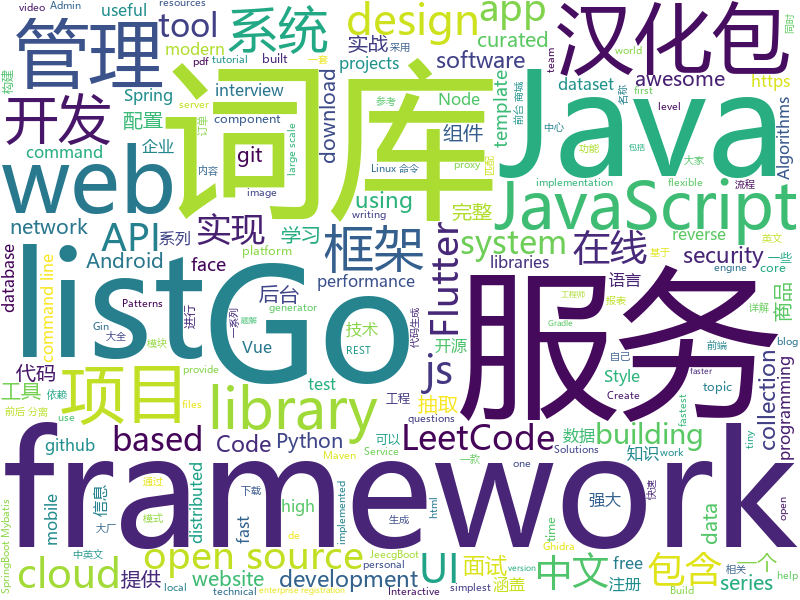

# 2019-06-08
See what the GitHub community is most excited about today.

## python
* [EverydayWechat](https://github.com/sfyc23/EverydayWechat)(**217 stars today**): 每日自动给女朋友发微信暖心话。
* [kedro](https://github.com/quantumblacklabs/kedro)(**141 stars today**): A Python library for building robust production-ready data and analytics pipelines
* [Python](https://github.com/TheAlgorithms/Python)(**80 stars today**): All Algorithms implemented in Python
* [system-design-primer](https://github.com/donnemartin/system-design-primer)(**48 stars today**): Learn how to design large-scale systems. Prep for the system design interview. Includes Anki flashcards.
* [football](https://github.com/google-research/football)(**44 stars today**): 
* [EfficientNet-PyTorch](https://github.com/lukemelas/EfficientNet-PyTorch)(**39 stars today**): A PyTorch implementation of EfficientNet
* [models](https://github.com/tensorflow/models)(**28 stars today**): Models and examples built with TensorFlow
* [awesome-python](https://github.com/vinta/awesome-python)(**37 stars today**): A curated list of awesome Python frameworks, libraries, software and resources
* [invertible-resnet](https://github.com/jhjacobsen/invertible-resnet)(**40 stars today**): Official Code for Invertible Residual Networks
* [train-departure-screen](https://github.com/chrishutchinson/train-departure-screen)(**39 stars today**): Python script to display replica real-time UK railway station departure screens for SSD13xx devices
* [TensorNetwork](https://github.com/google/TensorNetwork)(**36 stars today**): A library for easy and efficient manipulation of tensor networks.
* [RDPassSpray](https://github.com/xFreed0m/RDPassSpray)(**35 stars today**): Python3 tool to perform password spraying using RDP
* [cpython](https://github.com/python/cpython)(**30 stars today**): The Python programming language
* [public-apis](https://github.com/public-apis/public-apis)(**35 stars today**): A collective list of free APIs for use in software and web development.
* [Bitcoin-Trader-RL](https://github.com/notadamking/Bitcoin-Trader-RL)(**31 stars today**): A profitable cryptocurrency trading environment using deep reinforcement learning and OpenAI's gym
* [AiLearning](https://github.com/apachecn/AiLearning)(**27 stars today**): AiLearning: 机器学习 - MachineLearning - ML、深度学习 - DeepLearning - DL、自然语言处理 NLP
* [funNLP](https://github.com/fighting41love/funNLP)(**27 stars today**): 中英文敏感词、语言检测、中外手机/电话归属地/运营商查询、名字推断性别、手机号抽取、身份证抽取、邮箱抽取、中日文人名库、中文缩写库、拆字词典、词汇情感值、停用词、反动词表、暴恐词表、繁简体转换、英文模拟中文发音、汪峰歌词生成器、职业名称词库、同义词库、反义词库、否定词库、汽车品牌词库、汽车零件词库、连续英文切割、各种中文词向量、公司名字大全、古诗词库、IT词库、财经词库、成语词库、地名词库、历史名人词库、诗词词库、医学词库、饮食词库、法律词库、汽车词库、动物词库、中文聊天语料、中文谣言数据、百度中文问答数据集、句子相似度匹配算法集合、bert资源、文本生成&摘要相关工具、cocoNLP信息抽取工具、国内电话号码正则匹配、清华大学XLORE:中英文跨语言百科知识图谱、清华大学人工智能技术…
* [keras](https://github.com/keras-team/keras)(**28 stars today**): Deep Learning for humans
* [CheatSheetSeries](https://github.com/OWASP/CheatSheetSeries)(**28 stars today**): The OWASP Cheat Sheet Series was created to provide a concise collection of high value information on specific application security topics.
* [PhoneInfoga](https://github.com/sundowndev/PhoneInfoga)(**25 stars today**): Advanced information gathering & OSINT tool for phone numbers.
* [youtube-dl](https://github.com/ytdl-org/youtube-dl)(**26 stars today**): Command-line program to download videos from YouTube.com and other video sites
* [localstack](https://github.com/localstack/localstack)(**27 stars today**): 💻A fully functional local AWS cloud stack. Develop and test your cloud & Serverless apps offline!
* [face_recognition](https://github.com/ageitgey/face_recognition)(**23 stars today**): The world's simplest facial recognition api for Python and the command line
* [django](https://github.com/django/django)(**20 stars today**): The Web framework for perfectionists with deadlines.
* [bert](https://github.com/google-research/bert)(**23 stars today**): TensorFlow code and pre-trained models for BERT

## java
* [LeetCodeAnimation](https://github.com/MisterBooo/LeetCodeAnimation)(**119 stars today**): Demonstrate all the questions on LeetCode in the form of animation.（用动画的形式呈现解LeetCode题目的思路）
* [CS-Notes](https://github.com/CyC2018/CS-Notes)(**101 stars today**): 📚Basic Knowledge of Technical Interview（技术面试必备基础知识、Leetcode 题解、后端面试、Java 面试、春招、秋招、操作系统、计算机网络、系统设计）
* [JavaGuide](https://github.com/Snailclimb/JavaGuide)(**93 stars today**): 【Java学习+面试指南】 一份涵盖大部分Java程序员所需要掌握的核心知识。
* [advanced-java](https://github.com/doocs/advanced-java)(**65 stars today**): 😮互联网 Java 工程师进阶知识完全扫盲：涵盖高并发、分布式、高可用、微服务等领域知识
* [halo](https://github.com/halo-dev/halo)(**55 stars today**): ✍ Halo 一款现代化的个人独立博客系统
* [tutorials](https://github.com/eugenp/tutorials)(**18 stars today**): The "REST With Spring" Course:
* [mall](https://github.com/macrozheng/mall)(**30 stars today**): mall项目是一套电商系统，包括前台商城系统及后台管理系统，基于SpringBoot+MyBatis实现。 前台商城系统包含首页门户、商品推荐、商品搜索、商品展示、购物车、订单流程、会员中心、客户服务、帮助中心等模块。 后台管理系统包含商品管理、订单管理、会员管理、促销管理、运营管理、内容管理、统计报表、财务管理、权限管理、设置等模块。
* [spring-framework](https://github.com/spring-projects/spring-framework)(**26 stars today**): Spring Framework
* [spring-boot](https://github.com/spring-projects/spring-boot)(**24 stars today**): Spring Boot
* [elasticsearch](https://github.com/elastic/elasticsearch)(**19 stars today**): Open Source, Distributed, RESTful Search Engine
* [jeecg-boot](https://github.com/zhangdaiscott/jeecg-boot)(**18 stars today**): 一款基于代码生成器的Java快速开发平台！全新技术,前后端分离架构：SpringBoot 2.x，Mybatis，Shiro，JWT，Vue&Ant Design。强大的代码生成器让前端和后台代码一键生成，无需写任何代码，绝对是全栈开发福音！！ JeecgBoot的宗旨是提高UI能力的同时,降低前后分离的开发成本，JeecgBoot还独创在线开发模式，No代码概念，一系列在线智能开发：在线配置表单、在线配置报表、在线设计流程等等。
* [Markwon](https://github.com/noties/Markwon)(**21 stars today**): Android markdown library (no WebView)
* [syndesis](https://github.com/syndesisio/syndesis)(**19 stars today**): A flexible, customizable, open source platform that provides core integration capabilities as a service.
* [Java](https://github.com/TheAlgorithms/Java)(**17 stars today**): All Algorithms implemented in Java
* [toBeTopJavaer](https://github.com/hollischuang/toBeTopJavaer)(**18 stars today**): To Be Top Javaer - Java工程师成神之路
* [ghidra](https://github.com/NationalSecurityAgency/ghidra)(**16 stars today**): Ghidra is a software reverse engineering (SRE) framework
* [FlyCloud](https://github.com/geduo83/FlyCloud)(**16 stars today**): 🔥🔥🔥FlyClould 微服务实战项目框架，在该框架中，包括了用 Spring Cloud 构建微服务的一系列基本组件和框架，对于后台服务框架的搭建有很大的参考价值，大家可以参考甚至稍加修改可以直接应用于自己的实际的项目开发中，该项目没有采用Maven进行项目构建，Maven通过xml进行依赖管理，导致整个配置文件太过臃肿，另外灵活性也不是很强，所以我采用Gradle进行项目构建和依赖管理，在FlyTour项目中我们见证了Gradle的强大，通过简单的一些配置就可以轻松的实现组件化的功能。该项目共有11个Moudle工程。其中10个位微服务工程，这10个微服务工程构成了一个完整的微服务系统，微服务系统包含了8个基础服务，提供了一整套微服务治理功能，他们分别是配置中心moudle_c…
* [72crm-java](https://github.com/72crm/72crm-java)(**16 stars today**): The JAVA version for "72CRM"
* [haxademic](https://github.com/cacheflowe/haxademic)(**16 stars today**): A personal toolkit for Java/Processing projects in Eclipse
* [SRouter](https://github.com/SharryChoo/SRouter)(**16 stars today**): A framework of componentization related to Android platform
* [RxJava](https://github.com/ReactiveX/RxJava)(**15 stars today**): RxJava – Reactive Extensions for the JVM – a library for composing asynchronous and event-based programs using observable sequences for the Java VM.
* [dubbo](https://github.com/apache/dubbo)(**13 stars today**): Apache Dubbo is a high-performance, java based, open source RPC framework.
* [Component](https://github.com/xiaojinzi123/Component)(**14 stars today**): 一个强大完善的Android组件化方案.更新及时,后续我会跟上一个使用了组件化的 App 真实例子.
* [ghidra-firmware-utils](https://github.com/al3xtjames/ghidra-firmware-utils)(**14 stars today**): Ghidra utilities for analyzing firmware
* [guava](https://github.com/google/guava)(**12 stars today**): Google core libraries for Java

## unknown
* [the-art-of-command-line](https://github.com/jlevy/the-art-of-command-line)(**509 stars today**): Master the command line, in one page
* [Enterprise-Registration-Data-of-Chinese-Mainland](https://github.com/imhuster/Enterprise-Registration-Data-of-Chinese-Mainland)(**424 stars today**): 中国大陆 31 个省份1978 年至 2019 年一千多万工商企业注册信息，包含企业名称、注册地址、统一社会信用代码、地区、注册日期、经营范围、法人代表、注册资金、企业类型等详细资料。This repository is an dataset of over 10,000,000 enterprise registration data of 31 provinces in Chinese mainland from 1978 to 2019.【工商大数据】、【企业信息】、【enterprise registration data】。
* [GSYFlutterBook](https://github.com/CarGuo/GSYFlutterBook)(**234 stars today**): Flutter完整开发实战详解系列，提供在线预览和pdf下载，本系列将完整讲述：如何快速从 0 开发一个完整的 Flutter APP，配套高完成度 Flutter 开源项目 GSYGithubAppFlutter ，同时会提供一些Flutter的开发细节技巧，之后深入源码和实战为你全面解析 Flutter 。
* [awesome-casestudy](https://github.com/luruke/awesome-casestudy)(**144 stars today**): 📕Curated list of technical case studies on WebGL and creative development
* [awesome-scalability](https://github.com/binhnguyennus/awesome-scalability)(**114 stars today**): The Patterns of Scalable, Reliable, and Performant Large-Scale Systems
* [gitignore](https://github.com/github/gitignore)(**48 stars today**): A collection of useful .gitignore templates
* [The-Documentation-Compendium](https://github.com/kylelobo/The-Documentation-Compendium)(**68 stars today**): 📢Various README templates & tips on writing high-quality documentation that people want to read.
* [awesome](https://github.com/sindresorhus/awesome)(**64 stars today**): 😎Awesome lists about all kinds of interesting topics
* [hacker-laws](https://github.com/dwmkerr/hacker-laws)(**63 stars today**): 💻📖Laws, Theories, Principles and Patterns that developers will find useful. #hackerlaws
* [awesome-uikit](https://github.com/jaywcjlove/awesome-uikit)(**53 stars today**): Collect JS Frameworks, Web components library and Admin Template.
* [You-Dont-Know-JS](https://github.com/getify/You-Dont-Know-JS)(**46 stars today**): A book series on JavaScript. @YDKJS on twitter.
* [security](https://github.com/numirias/security)(**45 stars today**): Some of my security stuff and vulnerabilities. Nothing advanced. More to come.
* [papers-we-love](https://github.com/papers-we-love/papers-we-love)(**33 stars today**): Papers from the computer science community to read and discuss.
* [Internal-Pentest-Playbook](https://github.com/sdcampbell/Internal-Pentest-Playbook)(**29 stars today**): Internal Network Penetration Test Playbook
* [Weekly-FE-Interview](https://github.com/airuikun/Weekly-FE-Interview)(**28 stars today**): 每周十道前端大厂面试题，并收集大家在大厂面试中遇到的难题，一起共同成长。
* [trackerslist](https://github.com/ngosang/trackerslist)(**25 stars today**): Updated list of public BitTorrent trackers
* [git_training](https://github.com/UnseenWizzard/git_training)(**6 stars today**): An interactive git training meant to teach you how git works, not just which commands to execute
* [C-MS-Celeb](https://github.com/PINTOFSTU/C-MS-Celeb)(**21 stars today**): A clean version (wash list) of MS-Celeb-1M face dataset, containing 6,464,018 face images of 94,682 celebrities
* [free-programming-books](https://github.com/EbookFoundation/free-programming-books)(**26 stars today**): 📚Freely available programming books
* [fe-necessary-book](https://github.com/ddzy/fe-necessary-book)(**26 stars today**): A pdf and software collection about frontend
* [Awesome-Cellular-Hacking](https://github.com/W00t3k/Awesome-Cellular-Hacking)(**26 stars today**): Awesome-Cellular-Hacking
* [awesome-public-datasets](https://github.com/awesomedata/awesome-public-datasets)(**23 stars today**): A topic-centric list of HQ open datasets. PR ☛☛☛
* [Grad-school-application](https://github.com/ArayCHN/Grad-school-application)(**23 stars today**): 申请季材料汇总，给学弟学妹们提供一些参考。(PS, SOP, CV, etc.)
* [swiftui](https://github.com/ygit/swiftui)(**25 stars today**): A collaborative list of awesome SwiftUI resources. Feel free to contribute!
* [hacker-laws-zh](https://github.com/nusr/hacker-laws-zh)(**22 stars today**): 💻📖对开发人员有用的定律、理论、原则和模式。

## javascript
* [entropic](https://github.com/entropic-dev/entropic)(**138 stars today**): 🦝📦a package registry for anything, but mostly javascript 🦝 🦝 🦝
* [laravel](https://github.com/pipe-dream/laravel)(**137 stars today**): Create Laravel projects really fast
* [medium-to-own-blog](https://github.com/mathieudutour/medium-to-own-blog)(**125 stars today**): Switch from Medium to your own blog in a few minutes
* [algorithm-visualizer](https://github.com/algorithm-visualizer/algorithm-visualizer)(**95 stars today**): 🎆Interactive Online Platform that Visualizes Algorithms from Code
* [zdog](https://github.com/metafizzy/zdog)(**96 stars today**): Flat, round, designer-friendly pseudo-3D engine for canvas & SVG
* [leetcode](https://github.com/azl397985856/leetcode)(**73 stars today**): LeetCode Solutions: A Record of My Problem Solving Journey.( leetcode题解，记录自己的leetcode解题之路。)
* [osgameclones](https://github.com/opengaming/osgameclones)(**73 stars today**): Open Source Clones of Popular Games
* [vue](https://github.com/vuejs/vue)(**68 stars today**): 🖖Vue.js is a progressive, incrementally-adoptable JavaScript framework for building UI on the web.
* [storefront-ui](https://github.com/DivanteLtd/storefront-ui)(**69 stars today**): Customization-first Vue.js UI framework for eCommerce.
* [react](https://github.com/facebook/react)(**65 stars today**): A declarative, efficient, and flexible JavaScript library for building user interfaces.
* [ms](https://github.com/zeit/ms)(**58 stars today**): Tiny milisecond conversion utility
* [theme-ui](https://github.com/system-ui/theme-ui)(**50 stars today**): Build consistent, themeable React UIs based on design system constraints and design tokens
* [create-react-app](https://github.com/facebook/create-react-app)(**38 stars today**): Set up a modern web app by running one command.
* [pixelmatch](https://github.com/mapbox/pixelmatch)(**47 stars today**): The smallest, simplest and fastest JavaScript pixel-level image comparison library
* [gatsby-gitbook-starter](https://github.com/hasura/gatsby-gitbook-starter)(**47 stars today**): Generate GitBook style docs/tutorial websites using Gatsby + MDX
* [bootstrap](https://github.com/twbs/bootstrap)(**36 stars today**): The most popular HTML, CSS, and JavaScript framework for developing responsive, mobile first projects on the web.
* [streamx](https://github.com/mafintosh/streamx)(**45 stars today**): An iteration of the Node.js core streams with a series of improvements.
* [generators](https://github.com/sugarkubes/generators)(**44 stars today**): API Generator - instantly generate REST and GraphQL APIs (openapi (OAS) 3.0.0)
* [30-seconds-of-code](https://github.com/30-seconds/30-seconds-of-code)(**37 stars today**): A curated collection of useful JavaScript snippets that you can understand in 30 seconds or less.
* [strapi](https://github.com/strapi/strapi)(**39 stars today**): 🚀Open source Node.js Headless CMS to easily build customisable APIs
* [material-ui](https://github.com/mui-org/material-ui)(**29 stars today**): React components for faster and easier web development. Build your own design system, or start with Material Design.
* [axios](https://github.com/axios/axios)(**35 stars today**): Promise based HTTP client for the browser and node.js
* [gatsby](https://github.com/gatsbyjs/gatsby)(**30 stars today**): Build blazing fast, modern apps and websites with React
* [node](https://github.com/nodejs/node)(**31 stars today**): Node.js JavaScript runtime✨🐢🚀✨
* [tinydate](https://github.com/lukeed/tinydate)(**34 stars today**): A tiny (340B) reusable date formatter. Extremely fast!

## html
* [proposal-optional-chaining](https://github.com/tc39/proposal-optional-chaining)(**21 stars today**): 
* [globe.gl](https://github.com/vasturiano/globe.gl)(**17 stars today**): UI component for Globe Data Visualization using ThreeJS/WebGL
* [proposal-top-level-await](https://github.com/tc39/proposal-top-level-await)(**16 stars today**): top-level `await` proposal for ECMAScript (stage 3)
* [html_wysiwyg](https://github.com/secretGeek/html_wysiwyg)(**16 stars today**): A truly naked, brutalist html quine
* [Java_Study_Zhao](https://github.com/dixonzhao/Java_Study_Zhao)(**15 stars today**): 
* [Front-end-Developer-Interview-Questions](https://github.com/h5bp/Front-end-Developer-Interview-Questions)(**12 stars today**): A list of helpful front-end related questions you can use to interview potential candidates, test yourself or completely ignore.
* [personal-website](https://github.com/github/personal-website)(**10 stars today**): Code that'll help you kickstart a personal website that showcases your work as a software developer.
* [Spoon-Knife](https://github.com/octocat/Spoon-Knife)(****): This repo is for demonstration purposes only.
* [hyperblog](https://github.com/freddier/hyperblog)(**8 stars today**): Un blog increíble para el curso de Git y Github de Platzi
* [unwalled.garden](https://github.com/beakerbrowser/unwalled.garden)(**13 stars today**): Schemas for a p2p social-media network built on the Dat Web.
* [styleguide](https://github.com/google/styleguide)(**9 stars today**): Style guides for Google-originated open-source projects
* [awesome-modern-cpp](https://github.com/rigtorp/awesome-modern-cpp)(**12 stars today**): A collection of resources on modern C++
* [linux-command](https://github.com/jaywcjlove/linux-command)(**11 stars today**): Linux命令大全搜索工具，内容包含Linux命令手册、详解、学习、搜集。https://git.io/linux
* [portainer](https://github.com/portainer/portainer)(**11 stars today**): Simple management UI for Docker
* [neverssl.com](https://github.com/colmmacc/neverssl.com)(**10 stars today**): 
* [tc39.github.io](https://github.com/tc39/tc39.github.io)(**9 stars today**): Get involved in specifying JavaScript
* [ecma262](https://github.com/tc39/ecma262)(**8 stars today**): Status, process, and documents for ECMA262
* [owasp-mstg](https://github.com/OWASP/owasp-mstg)(**7 stars today**): The Mobile Security Testing Guide (MSTG) is a comprehensive manual for mobile app security development, testing and reverse engineering.
* [professional-services](https://github.com/GoogleCloudPlatform/professional-services)(**7 stars today**): Common solutions and tools developed by Google Cloud's Professional Services team
* [nginxconfig.io](https://github.com/0xB4LINT/nginxconfig.io)(**7 stars today**): ⚙️NGiИX config generator on steroids💉
* [devops-essentials-sample-app](https://github.com/linuxacademy/devops-essentials-sample-app)(****): 
* [AdminLTE](https://github.com/ColorlibHQ/AdminLTE)(**6 stars today**): AdminLTE - Free Premium Admin control Panel Theme Based On Bootstrap 3.x
* [en.javascript.info](https://github.com/javascript-tutorial/en.javascript.info)(**7 stars today**): Modern JavaScript Tutorial
* [flutter-in-action](https://github.com/flutterchina/flutter-in-action)(**7 stars today**): 《Flutter实战》电子书
* [TranslatorX](https://github.com/pingfangx/TranslatorX)(**5 stars today**): JetBrains 系列软件汉化包 关键字: Android Studio 3.4 汉化包 CLion 2019.1 汉化包 DataGrip 2019.1 汉化包 GoLand 2019.1 汉化包 IntelliJ IDEA 2019.1 汉化包 PhpStorm 2019.1 汉化包 PyCharm 2019.1 汉化包 RubyMine 2019.1 汉化包 WebStorm 2019.1 汉化包

## go
* [v2ray-core](https://github.com/v2ray/v2ray-core)(**98 stars today**): A platform for building proxies to bypass network restrictions.
* [CovenantSQL](https://github.com/CovenantSQL/CovenantSQL)(**65 stars today**): Byzantine-Fault Tolerant distributed relational database built on SQLite
* [kubernetes](https://github.com/kubernetes/kubernetes)(**43 stars today**): Production-Grade Container Scheduling and Management
* [gosec](https://github.com/securego/gosec)(**38 stars today**): Golang security checker
* [go](https://github.com/golang/go)(**34 stars today**): The Go programming language
* [go-cloud](https://github.com/google/go-cloud)(**31 stars today**): The Go Cloud Development Kit (Go CDK): A library and tools for open cloud development in Go.
* [lantern](https://github.com/getlantern/lantern)(**28 stars today**): 🔴蓝灯最新版本下载 https://github.com/getlantern/download🔴Lantern Latest Download https://github.com/getlantern/download🔴
* [compress](https://github.com/klauspost/compress)(**28 stars today**): Optimized compression packages
* [hugo](https://github.com/gohugoio/hugo)(**26 stars today**): The world’s fastest framework for building websites.
* [sshcode](https://github.com/cdr/sshcode)(**25 stars today**): Run VS Code on any server over SSH.
* [k9s](https://github.com/derailed/k9s)(**25 stars today**): 🐶Kubernetes CLI To Manage Your Clusters In Style!
* [awesome-go](https://github.com/avelino/awesome-go)(**24 stars today**): A curated list of awesome Go frameworks, libraries and software
* [frp](https://github.com/fatedier/frp)(**23 stars today**): A fast reverse proxy to help you expose a local server behind a NAT or firewall to the internet.
* [dnote](https://github.com/dnote/dnote)(**22 stars today**): A simple notebook for developers
* [excelize](https://github.com/360EntSecGroup-Skylar/excelize)(**22 stars today**): Golang library for reading and writing Microsoft Excel™ (XLSX) files.
* [goproxy](https://github.com/goproxy/goproxy)(**20 stars today**): A minimalist Go module proxy handler.
* [pigo](https://github.com/esimov/pigo)(**21 stars today**): Go implementation of Pico face detection library.
* [gin](https://github.com/gin-gonic/gin)(**19 stars today**): Gin is a HTTP web framework written in Go (Golang). It features a Martini-like API with much better performance -- up to 40 times faster. If you need smashing performance, get yourself some Gin.
* [fzf](https://github.com/junegunn/fzf)(**19 stars today**): 🌸A command-line fuzzy finder
* [prometheus](https://github.com/prometheus/prometheus)(**18 stars today**): The Prometheus monitoring system and time series database.
* [tidb](https://github.com/pingcap/tidb)(**15 stars today**): TiDB is a distributed HTAP database compatible with the MySQL protocol
* [mem](https://github.com/smasher164/mem)(**16 stars today**): A memory allocator for Go.
* [kratos](https://github.com/bilibili/kratos)(**14 stars today**): Kratos是bilibili开源的一套Go微服务框架，包含大量微服务相关框架及工具。
* [terraform](https://github.com/hashicorp/terraform)(**13 stars today**): Terraform enables you to safely and predictably create, change, and improve infrastructure. It is an open source tool that codifies APIs into declarative configuration files that can be shared amongst team members, treated as code, edited, reviewed, and versioned.
* [advanced-go-programming-book](https://github.com/chai2010/advanced-go-programming-book)(**15 stars today**): 📚《Go语言高级编程》开源图书，涵盖CGO、Go汇编语言、RPC实现、Protobuf插件实现、Web框架实现、分布式系统等高阶主题(完稿)

## WordCloud

