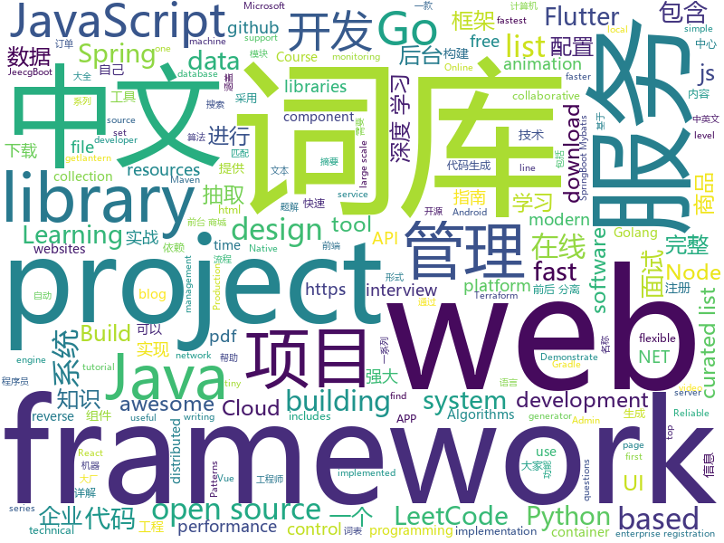

# 2019-06-09
See what the GitHub community is most excited about today.

## python
* [EverydayWechat](https://github.com/sfyc23/EverydayWechat)(**199 stars today**): 每日自动给女朋友发微信暖心话。
* [football](https://github.com/google-research/football)(**180 stars today**): 
* [Python](https://github.com/TheAlgorithms/Python)(**94 stars today**): All Algorithms implemented in Python
* [GPT2](https://github.com/ConnorJL/GPT2)(**77 stars today**): An implementation of training for GPT2, supports TPUs
* [fair_self_supervision_benchmark](https://github.com/facebookresearch/fair_self_supervision_benchmark)(**50 stars today**): Scaling and Benchmarking Self-Supervised Visual Representation Learning
* [kedro](https://github.com/quantumblacklabs/kedro)(**47 stars today**): A Python library for building robust production-ready data and analytics pipelines
* [system-design-primer](https://github.com/donnemartin/system-design-primer)(**43 stars today**): Learn how to design large-scale systems. Prep for the system design interview. Includes Anki flashcards.
* [AiLearning](https://github.com/apachecn/AiLearning)(**35 stars today**): AiLearning: 机器学习 - MachineLearning - ML、深度学习 - DeepLearning - DL、自然语言处理 NLP
* [machine-learning-course](https://github.com/machinelearningmindset/machine-learning-course)(**37 stars today**): 💬Machine Learning Course with Python. Refer to the course page for step-by-step explanations.
* [awesome-python](https://github.com/vinta/awesome-python)(**34 stars today**): A curated list of awesome Python frameworks, libraries, software and resources
* [pba](https://github.com/arcelien/pba)(**35 stars today**): Efficient Learning of Augmentation Policy Schedules
* [youtube-dl](https://github.com/ytdl-org/youtube-dl)(**32 stars today**): Command-line program to download videos from YouTube.com and other video sites
* [public-apis](https://github.com/public-apis/public-apis)(**29 stars today**): A collective list of free APIs for use in software and web development.
* [algo](https://github.com/wangzheng0822/algo)(**26 stars today**): 数据结构和算法必知必会的50个代码实现
* [you-get](https://github.com/soimort/you-get)(**24 stars today**): ⏬Dumb downloader that scrapes the web
* [home-assistant](https://github.com/home-assistant/home-assistant)(**21 stars today**): 🏡Open source home automation that puts local control and privacy first
* [funNLP](https://github.com/fighting41love/funNLP)(**19 stars today**): 中英文敏感词、语言检测、中外手机/电话归属地/运营商查询、名字推断性别、手机号抽取、身份证抽取、邮箱抽取、中日文人名库、中文缩写库、拆字词典、词汇情感值、停用词、反动词表、暴恐词表、繁简体转换、英文模拟中文发音、汪峰歌词生成器、职业名称词库、同义词库、反义词库、否定词库、汽车品牌词库、汽车零件词库、连续英文切割、各种中文词向量、公司名字大全、古诗词库、IT词库、财经词库、成语词库、地名词库、历史名人词库、诗词词库、医学词库、饮食词库、法律词库、汽车词库、动物词库、中文聊天语料、中文谣言数据、百度中文问答数据集、句子相似度匹配算法集合、bert资源、文本生成&摘要相关工具、cocoNLP信息抽取工具、国内电话号码正则匹配、清华大学XLORE:中英文跨语言百科知识图谱、清华大学人工智能技术…
* [cpython](https://github.com/python/cpython)(**20 stars today**): The Python programming language
* [models](https://github.com/tensorflow/models)(**18 stars today**): Models and examples built with TensorFlow
* [poetry](https://github.com/sdispater/poetry)(**24 stars today**): Python dependency management and packaging made easy.
* [keras](https://github.com/keras-team/keras)(**20 stars today**): Deep Learning for humans
* [flask](https://github.com/pallets/flask)(**20 stars today**): The Python micro framework for building web applications.
* [manim](https://github.com/3b1b/manim)(**21 stars today**): Animation engine for explanatory math videos
* [scikit-learn](https://github.com/scikit-learn/scikit-learn)(**18 stars today**): scikit-learn: machine learning in Python
* [django](https://github.com/django/django)(****): The Web framework for perfectionists with deadlines.

## java
* [LeetCodeAnimation](https://github.com/MisterBooo/LeetCodeAnimation)(**142 stars today**): Demonstrate all the questions on LeetCode in the form of animation.（用动画的形式呈现解LeetCode题目的思路）
* [JavaGuide](https://github.com/Snailclimb/JavaGuide)(**132 stars today**): 【Java学习+面试指南】 一份涵盖大部分Java程序员所需要掌握的核心知识。
* [CS-Notes](https://github.com/CyC2018/CS-Notes)(**119 stars today**): 📚Basic Knowledge of Technical Interview（技术面试必备基础知识、Leetcode 题解、后端面试、Java 面试、春招、秋招、操作系统、计算机网络、系统设计）
* [halo](https://github.com/halo-dev/halo)(**58 stars today**): ✍ Halo 一款现代化的个人独立博客系统
* [advanced-java](https://github.com/doocs/advanced-java)(**46 stars today**): 😮互联网 Java 工程师进阶知识完全扫盲：涵盖高并发、分布式、高可用、微服务等领域知识
* [mall](https://github.com/macrozheng/mall)(**38 stars today**): mall项目是一套电商系统，包括前台商城系统及后台管理系统，基于SpringBoot+MyBatis实现。 前台商城系统包含首页门户、商品推荐、商品搜索、商品展示、购物车、订单流程、会员中心、客户服务、帮助中心等模块。 后台管理系统包含商品管理、订单管理、会员管理、促销管理、运营管理、内容管理、统计报表、财务管理、权限管理、设置等模块。
* [jeecg-boot](https://github.com/zhangdaiscott/jeecg-boot)(**30 stars today**): 一款基于代码生成器的Java快速开发平台！全新技术,前后端分离架构：SpringBoot 2.x，Mybatis，Shiro，JWT，Vue&Ant Design。强大的代码生成器让前端和后台代码一键生成，无需写任何代码，绝对是全栈开发福音！！ JeecgBoot的宗旨是提高UI能力的同时,降低前后分离的开发成本，JeecgBoot还独创在线开发模式，No代码概念，一系列在线智能开发：在线配置表单、在线配置报表、在线设计流程等等。
* [spring-boot](https://github.com/spring-projects/spring-boot)(**24 stars today**): Spring Boot
* [elasticsearch](https://github.com/elastic/elasticsearch)(**20 stars today**): Open Source, Distributed, RESTful Search Engine
* [toBeTopJavaer](https://github.com/hollischuang/toBeTopJavaer)(**20 stars today**): To Be Top Javaer - Java工程师成神之路
* [FlyCloud](https://github.com/geduo83/FlyCloud)(**20 stars today**): 🔥🔥🔥FlyClould 微服务实战项目框架，在该框架中，包括了用 Spring Cloud 构建微服务的一系列基本组件和框架，对于后台服务框架的搭建有很大的参考价值，大家可以参考甚至稍加修改可以直接应用于自己的实际的项目开发中，该项目没有采用Maven进行项目构建，Maven通过xml进行依赖管理，导致整个配置文件太过臃肿，另外灵活性也不是很强，所以我采用Gradle进行项目构建和依赖管理，在FlyTour项目中我们见证了Gradle的强大，通过简单的一些配置就可以轻松的实现组件化的功能。该项目共有11个Moudle工程。其中10个位微服务工程，这10个微服务工程构成了一个完整的微服务系统，微服务系统包含了8个基础服务，提供了一整套微服务治理功能，他们分别是配置中心moudle_c…
* [tutorials](https://github.com/eugenp/tutorials)(**12 stars today**): The "REST With Spring" Course:
* [syndesis](https://github.com/syndesisio/syndesis)(**18 stars today**): A flexible, customizable, open source platform that provides core integration capabilities as a service.
* [hutool](https://github.com/looly/hutool)(**15 stars today**): A set of tools that keep Java sweet.
* [spring-framework](https://github.com/spring-projects/spring-framework)(**14 stars today**): Spring Framework
* [72crm-java](https://github.com/72crm/72crm-java)(**16 stars today**): The JAVA version for "72CRM"
* [dubbo](https://github.com/apache/dubbo)(**12 stars today**): Apache Dubbo is a high-performance, java based, open source RPC framework.
* [Component](https://github.com/xiaojinzi123/Component)(**15 stars today**): 一个最强大的完善的Android组件化方案.更新和修复issue及时
* [SRouter](https://github.com/SharryChoo/SRouter)(**15 stars today**): A framework of componentization related to Android platform
* [ghidra](https://github.com/NationalSecurityAgency/ghidra)(**14 stars today**): Ghidra is a software reverse engineering (SRE) framework
* [guava](https://github.com/google/guava)(**12 stars today**): Google core libraries for Java
* [flink-learning](https://github.com/zhisheng17/flink-learning)(**11 stars today**): flink learning blog. http://www.54tianzhisheng.cn/tags/Flink/
* [HanLP](https://github.com/hankcs/HanLP)(**10 stars today**): 自然语言处理 中文分词 词性标注 命名实体识别 依存句法分析 新词发现 关键词短语提取 自动摘要 文本分类聚类 拼音简繁
* [Java](https://github.com/TheAlgorithms/Java)(**9 stars today**): All Algorithms implemented in Java
* [flink](https://github.com/apache/flink)(**10 stars today**): Apache Flink

## unknown
* [the-art-of-command-line](https://github.com/jlevy/the-art-of-command-line)(**335 stars today**): Master the command line, in one page
* [Enterprise-Registration-Data-of-Chinese-Mainland](https://github.com/imhuster/Enterprise-Registration-Data-of-Chinese-Mainland)(**234 stars today**): 中国大陆 31 个省份1978 年至 2019 年一千多万工商企业注册信息，包含企业名称、注册地址、统一社会信用代码、地区、注册日期、经营范围、法人代表、注册资金、企业类型等详细资料。This repository is an dataset of over 10,000,000 enterprise registration data of 31 provinces in Chinese mainland from 1978 to 2019.【工商大数据】、【企业信息】、【enterprise registration data】。
* [GSYFlutterBook](https://github.com/CarGuo/GSYFlutterBook)(**153 stars today**): Flutter完整开发实战详解系列，提供在线预览和pdf下载，本系列将完整讲述：如何快速从 0 开发一个完整的 Flutter APP，配套高完成度 Flutter 开源项目 GSYGithubAppFlutter ，同时会提供一些Flutter的开发细节技巧，之后深入源码和实战为你全面解析 Flutter 。
* [from_coder_to_expert](https://github.com/0voice/from_coder_to_expert)(**118 stars today**): 2019年最新总结，从程序员到CTO，从专业走向卓越，分享大牛企业内部pdf与PPT
* [awesome-casestudy](https://github.com/luruke/awesome-casestudy)(**61 stars today**): 📕Curated list of technical case studies on WebGL and creative development
* [prometheus-book](https://github.com/yunlzheng/prometheus-book)(**54 stars today**): Prometheus操作指南
* [the-book-of-secret-knowledge](https://github.com/trimstray/the-book-of-secret-knowledge)(**46 stars today**): A collection of inspiring lists, manuals, cheatsheets, blogs, hacks, one-liners, cli/web tools and more.
* [awesome-scalability](https://github.com/binhnguyennus/awesome-scalability)(**44 stars today**): The Patterns of Scalable, Reliable, and Performant Large-Scale Systems
* [swiftui](https://github.com/ygit/swiftui)(**47 stars today**): A collaborative list of awesome SwiftUI resources. Feel free to contribute!
* [awesome](https://github.com/sindresorhus/awesome)(**43 stars today**): 😎Awesome lists about all kinds of interesting topics
* [trackerslist](https://github.com/ngosang/trackerslist)(**40 stars today**): Updated list of public BitTorrent trackers
* [free-programming-books](https://github.com/EbookFoundation/free-programming-books)(**39 stars today**): 📚Freely available programming books
* [gitignore](https://github.com/github/gitignore)(**31 stars today**): A collection of useful .gitignore templates
* [You-Dont-Know-JS](https://github.com/getify/You-Dont-Know-JS)(**30 stars today**): A book series on JavaScript. @YDKJS on twitter.
* [hacker-laws](https://github.com/dwmkerr/hacker-laws)(**35 stars today**): 💻📖Laws, Theories, Principles and Patterns that developers will find useful. #hackerlaws
* [awesome-uikit](https://github.com/jaywcjlove/awesome-uikit)(**32 stars today**): Collect JS Frameworks, Web components library and Admin Template.
* [Dork-Admin](https://github.com/No-Github/Dork-Admin)(**31 stars today**): 盘点近年来的数据泄露事件
* [free-programming-books-zh_CN](https://github.com/justjavac/free-programming-books-zh_CN)(**27 stars today**): 📚免费的计算机编程类中文书籍，欢迎投稿
* [The-Documentation-Compendium](https://github.com/kylelobo/The-Documentation-Compendium)(**29 stars today**): 📢Various README templates & tips on writing high-quality documentation that people want to read.
* [project-based-learning](https://github.com/tuvtran/project-based-learning)(**25 stars today**): Curated list of project-based tutorials
* [Weekly-FE-Interview](https://github.com/airuikun/Weekly-FE-Interview)(**22 stars today**): 每周十道前端大厂面试题，并收集大家在大厂面试中遇到的难题，一起共同成长。
* [DeepLearning-500-questions](https://github.com/scutan90/DeepLearning-500-questions)(**20 stars today**): 深度学习500问，以问答形式对常用的概率知识、线性代数、机器学习、深度学习、计算机视觉等热点问题进行阐述，以帮助自己及有需要的读者。 全书分为18个章节，50余万字。由于水平有限，书中不妥之处恳请广大读者批评指正。 未完待续............ 如有意合作，联系scutjy2015@163.com 版权所有，违权必究 Tan 2018.06
* [build-your-own-x](https://github.com/danistefanovic/build-your-own-x)(**20 stars today**): 🤓Build your own (insert technology here)
* [StanfordDoggoProject](https://github.com/Nate711/StanfordDoggoProject)(**18 stars today**): Stanford Doggo is an open source quadruped robot that jumps, flips, and trots!
* [awesome-bayes](https://github.com/dimenwarper/awesome-bayes)(**20 stars today**): List of resources for bayesian inference

## javascript
* [laravel](https://github.com/pipe-dream/laravel)(**167 stars today**): Create Laravel projects really fast
* [entropic](https://github.com/entropic-dev/entropic)(**114 stars today**): 🦝📦a package registry for anything, but mostly javascript 🦝 🦝 🦝
* [medium-to-own-blog](https://github.com/mathieudutour/medium-to-own-blog)(**109 stars today**): Switch from Medium to your own blog in a few minutes
* [theme-ui](https://github.com/system-ui/theme-ui)(**89 stars today**): Build consistent, themeable React UIs based on design system constraints and design tokens
* [leetcode](https://github.com/azl397985856/leetcode)(**74 stars today**): LeetCode Solutions: A Record of My Problem Solving Journey.( leetcode题解，记录自己的leetcode解题之路。)
* [NexClipper](https://github.com/NexClipper/NexClipper)(**65 stars today**): 🐳NexClipper is a fast and simple Kubernetes Monitoring solution.
* [algorithm-visualizer](https://github.com/algorithm-visualizer/algorithm-visualizer)(**60 stars today**): 🎆Interactive Online Platform that Visualizes Algorithms from Code
* [tinydate](https://github.com/lukeed/tinydate)(**63 stars today**): A tiny (340B) reusable date formatter. Extremely fast!
* [vue](https://github.com/vuejs/vue)(**55 stars today**): 🖖Vue.js is a progressive, incrementally-adoptable JavaScript framework for building UI on the web.
* [react](https://github.com/facebook/react)(**41 stars today**): A declarative, efficient, and flexible JavaScript library for building user interfaces.
* [pixelmatch](https://github.com/mapbox/pixelmatch)(**45 stars today**): The smallest, simplest and fastest JavaScript pixel-level image comparison library
* [frisky](https://github.com/prabhuomkar/frisky)(**42 stars today**): Open Source GraphQL API for Online Shows
* [axios](https://github.com/axios/axios)(**38 stars today**): Promise based HTTP client for the browser and node.js
* [react-native-web](https://github.com/necolas/react-native-web)(**38 stars today**): React Native for Web
* [zdog](https://github.com/metafizzy/zdog)(**34 stars today**): Flat, round, designer-friendly pseudo-3D engine for canvas & SVG
* [pdfkit](https://github.com/foliojs/pdfkit)(**35 stars today**): A JavaScript PDF generation library for Node and the browser
* [material-ui](https://github.com/mui-org/material-ui)(**29 stars today**): React components for faster and easier web development. Build your own design system, or start with Material Design.
* [react-spring](https://github.com/react-spring/react-spring)(**32 stars today**): ✌️A spring physics based React animation library
* [baiduyun](https://github.com/syhyz1990/baiduyun)(**31 stars today**): 🖖油猴脚本 一个脚本搞定百度网盘下载
* [node](https://github.com/nodejs/node)(**27 stars today**): Node.js JavaScript runtime✨🐢🚀✨
* [gatsby](https://github.com/gatsbyjs/gatsby)(**26 stars today**): Build blazing fast, modern apps and websites with React
* [bootstrap](https://github.com/twbs/bootstrap)(**27 stars today**): The most popular HTML, CSS, and JavaScript framework for developing responsive, mobile first projects on the web.
* [ms](https://github.com/zeit/ms)(**29 stars today**): Tiny milisecond conversion utility
* [strapi](https://github.com/strapi/strapi)(**25 stars today**): 🚀Open source Node.js Headless CMS to easily build customisable APIs
* [gatsby-gitbook-starter](https://github.com/hasura/gatsby-gitbook-starter)(**27 stars today**): Generate GitBook style docs/tutorial websites using Gatsby + MDX

## html
* [proposal-optional-chaining](https://github.com/tc39/proposal-optional-chaining)(**25 stars today**): 
* [Java_Study_Zhao](https://github.com/dixonzhao/Java_Study_Zhao)(**15 stars today**): 
* [globe.gl](https://github.com/vasturiano/globe.gl)(**15 stars today**): UI component for Globe Data Visualization using ThreeJS/WebGL
* [AdminLTE](https://github.com/ColorlibHQ/AdminLTE)(**10 stars today**): AdminLTE - Free Premium Admin control Panel Theme Based On Bootstrap 3.x
* [linux-command](https://github.com/jaywcjlove/linux-command)(**10 stars today**): Linux命令大全搜索工具，内容包含Linux命令手册、详解、学习、搜集。https://git.io/linux
* [styleguide](https://github.com/google/styleguide)(**9 stars today**): Style guides for Google-originated open-source projects
* [typedoc](https://github.com/TypeStrong/typedoc)(**9 stars today**): Documentation generator for TypeScript projects.
* [Spoon-Knife](https://github.com/octocat/Spoon-Knife)(****): This repo is for demonstration purposes only.
* [APubPlat](https://github.com/wangweianger/APubPlat)(**9 stars today**): Devops自动化部署、堡垒机开源项目、Web Terminal
* [Front-end-Developer-Interview-Questions](https://github.com/h5bp/Front-end-Developer-Interview-Questions)(**7 stars today**): A list of helpful front-end related questions you can use to interview potential candidates, test yourself or completely ignore.
* [nginxconfig.io](https://github.com/0xB4LINT/nginxconfig.io)(**7 stars today**): ⚙️NGiИX config generator on steroids💉
* [awesome-modern-cpp](https://github.com/rigtorp/awesome-modern-cpp)(**7 stars today**): A collection of resources on modern C++
* [portainer](https://github.com/portainer/portainer)(**7 stars today**): Simple management UI for Docker
* [pure](https://github.com/pure-css/pure)(**7 stars today**): A set of small, responsive CSS modules that you can use in every web project.
* [simple-icons](https://github.com/simple-icons/simple-icons)(**6 stars today**): SVG icons for popular brands
* [djangox](https://github.com/wsvincent/djangox)(**6 stars today**): A framework for launching new Django projects quickly.
* [en.javascript.info](https://github.com/javascript-tutorial/en.javascript.info)(**6 stars today**): Modern JavaScript Tutorial
* [ecma262](https://github.com/tc39/ecma262)(**6 stars today**): Status, process, and documents for ECMA262
* [html_wysiwyg](https://github.com/secretGeek/html_wysiwyg)(**6 stars today**): A truly naked, brutalist html quine
* [dotnet](https://github.com/microsoft/dotnet)(**6 stars today**): This repo is the official home of .NET on GitHub. It's a great starting point to find many .NET OSS projects from Microsoft and the community, including many that are part of the .NET Foundation.
* [nndl.github.io](https://github.com/nndl/nndl.github.io)(**6 stars today**): 《神经网络与深度学习》 Neural Network and Deep Learning
* [twofactorauth](https://github.com/2factorauth/twofactorauth)(**6 stars today**): List of sites with two factor auth support which includes SMS, email, phone calls, hardware, and software.
* [proposal-top-level-await](https://github.com/tc39/proposal-top-level-await)(**6 stars today**): top-level `await` proposal for ECMAScript (stage 3)
* [now-github-starter](https://github.com/zeit/now-github-starter)(****): Starter project to demonstrate a project whose pull requests get automatically deployed
* [devops-essentials-sample-app](https://github.com/linuxacademy/devops-essentials-sample-app)(****): 

## go
* [v2ray-core](https://github.com/v2ray/v2ray-core)(**87 stars today**): A platform for building proxies to bypass network restrictions.
* [kubernetes](https://github.com/kubernetes/kubernetes)(**30 stars today**): Production-Grade Container Scheduling and Management
* [go](https://github.com/golang/go)(**33 stars today**): The Go programming language
* [CovenantSQL](https://github.com/CovenantSQL/CovenantSQL)(**34 stars today**): Byzantine-Fault Tolerant distributed relational database built on SQLite
* [gin](https://github.com/gin-gonic/gin)(**30 stars today**): Gin is a HTTP web framework written in Go (Golang). It features a Martini-like API with much better performance -- up to 40 times faster. If you need smashing performance, get yourself some Gin.
* [go-cloud](https://github.com/google/go-cloud)(**31 stars today**): The Go Cloud Development Kit (Go CDK): A library and tools for open cloud development in Go.
* [hugo](https://github.com/gohugoio/hugo)(**27 stars today**): The world’s fastest framework for building websites.
* [gosec](https://github.com/securego/gosec)(**28 stars today**): Golang security checker
* [frp](https://github.com/fatedier/frp)(**23 stars today**): A fast reverse proxy to help you expose a local server behind a NAT or firewall to the internet.
* [lantern](https://github.com/getlantern/lantern)(**22 stars today**): 🔴蓝灯最新版本下载 https://github.com/getlantern/download🔴Lantern Latest Download https://github.com/getlantern/download🔴
* [traefik](https://github.com/containous/traefik)(**23 stars today**): The Cloud Native Edge Router
* [excelize](https://github.com/360EntSecGroup-Skylar/excelize)(**21 stars today**): Golang library for reading and writing Microsoft Excel™ (XLSX) files.
* [prometheus](https://github.com/prometheus/prometheus)(**18 stars today**): The Prometheus monitoring system and time series database.
* [syncthing](https://github.com/syncthing/syncthing)(**17 stars today**): Open Source Continuous File Synchronization
* [awesome-go](https://github.com/avelino/awesome-go)(**15 stars today**): A curated list of awesome Go frameworks, libraries and software
* [etcd](https://github.com/etcd-io/etcd)(**16 stars today**): Distributed reliable key-value store for the most critical data of a distributed system
* [terraformer](https://github.com/GoogleCloudPlatform/terraformer)(**16 stars today**): CLI tool to generate terraform files from existing infrastructure (reverse Terraform). Infrastructure to Code
* [the-way-to-go_ZH_CN](https://github.com/Unknwon/the-way-to-go_ZH_CN)(**14 stars today**): 《The Way to Go》中文译本，中文正式名《Go 入门指南》
* [sshcode](https://github.com/cdr/sshcode)(**15 stars today**): Run VS Code on any server over SSH.
* [gorm](https://github.com/jinzhu/gorm)(**15 stars today**): The fantastic ORM library for Golang, aims to be developer friendly
* [istio](https://github.com/istio/istio)(**14 stars today**): Connect, secure, control, and observe services.
* [pigo](https://github.com/esimov/pigo)(**14 stars today**): Go implementation of Pico face detection library.
* [moby](https://github.com/moby/moby)(**14 stars today**): Moby Project - a collaborative project for the container ecosystem to assemble container-based systems
* [influxdb](https://github.com/influxdata/influxdb)(**14 stars today**): Scalable datastore for metrics, events, and real-time analytics
* [kit](https://github.com/go-kit/kit)(**14 stars today**): A standard library for microservices.

## WordCloud

