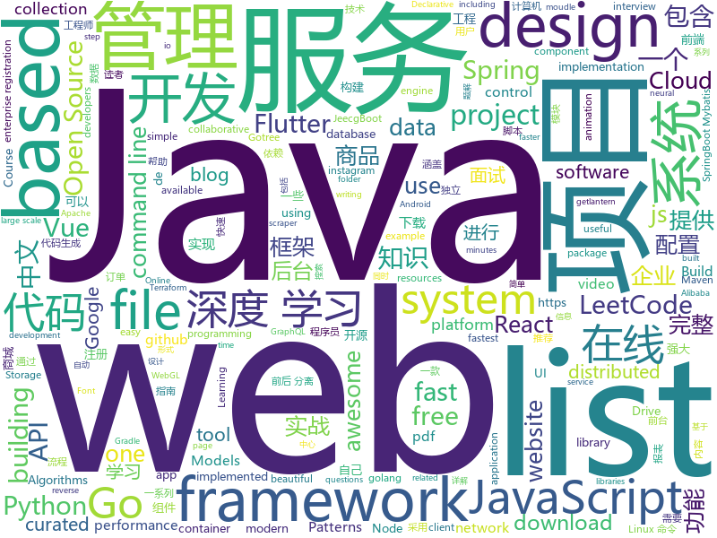

# 2019-06-10
See what the GitHub community is most excited about today.

## python
* [GPT2](https://github.com/ConnorJL/GPT2)(**326 stars today**): An implementation of training for GPT2, supports TPUs
* [football](https://github.com/google-research/football)(**210 stars today**): 
* [EverydayWechat](https://github.com/sfyc23/EverydayWechat)(**191 stars today**): 每日自动给女朋友发微信暖心话。
* [Python](https://github.com/TheAlgorithms/Python)(**115 stars today**): All Algorithms implemented in Python
* [machine-learning-course](https://github.com/machinelearningmindset/machine-learning-course)(**76 stars today**): 💬Machine Learning Course with Python. Refer to the course page for step-by-step explanations.
* [algo](https://github.com/wangzheng0822/algo)(**51 stars today**): 数据结构和算法必知必会的50个代码实现
* [d2l-zh](https://github.com/d2l-ai/d2l-zh)(**48 stars today**): 《动手学深度学习》，英文版即伯克利深度学习（STAT 157，2019春）教材。面向中文读者、能运行、可讨论。
* [AiLearning](https://github.com/apachecn/AiLearning)(**44 stars today**): AiLearning: 机器学习 - MachineLearning - ML、深度学习 - DeepLearning - DL、自然语言处理 NLP
* [system-design-primer](https://github.com/donnemartin/system-design-primer)(**40 stars today**): Learn how to design large-scale systems. Prep for the system design interview. Includes Anki flashcards.
* [models](https://github.com/tensorflow/models)(**32 stars today**): Models and examples built with TensorFlow
* [manim](https://github.com/3b1b/manim)(**38 stars today**): Animation engine for explanatory math videos
* [keras](https://github.com/keras-team/keras)(**31 stars today**): Deep Learning for humans
* [kedro](https://github.com/quantumblacklabs/kedro)(**34 stars today**): A Python library for building robust production-ready data and analytics pipelines
* [awesome-python](https://github.com/vinta/awesome-python)(**30 stars today**): A curated list of awesome Python frameworks, libraries, software and resources
* [public-apis](https://github.com/public-apis/public-apis)(**34 stars today**): A collective list of free APIs for use in software and web development.
* [youtube-dl](https://github.com/ytdl-org/youtube-dl)(**29 stars today**): Command-line program to download videos from YouTube.com and other video sites
* [fair_self_supervision_benchmark](https://github.com/facebookresearch/fair_self_supervision_benchmark)(**32 stars today**): Scaling and Benchmarking Self-Supervised Visual Representation Learning
* [liffy](https://github.com/mzfr/liffy)(**28 stars today**): Local file inclusion exploitation tool
* [mindsdb](https://github.com/mindsdb/mindsdb)(**28 stars today**): Framework to streamline use of neural networks
* [you-get](https://github.com/soimort/you-get)(**25 stars today**): ⏬Dumb downloader that scrapes the web
* [instagram-python-scraper](https://github.com/luengwaiban/instagram-python-scraper)(**27 stars today**): A instagram scraper wrote in python. Similar to instagram-php-scraper.Usages are in example.py. Enjoy it!
* [bert](https://github.com/google-research/bert)(**22 stars today**): TensorFlow code and pre-trained models for BERT
* [gpt-2](https://github.com/openai/gpt-2)(**23 stars today**): Code for the paper "Language Models are Unsupervised Multitask Learners"
* [Shadowrocket-ADBlock-Rules](https://github.com/h2y/Shadowrocket-ADBlock-Rules)(**25 stars today**): 提供多款 Shadowrocket 规则，带广告过滤功能。用于 iOS 未越狱设备选择性地自动翻墙。
* [home-assistant](https://github.com/home-assistant/home-assistant)(**20 stars today**): 🏡Open source home automation that puts local control and privacy first

## java
* [LeetCodeAnimation](https://github.com/MisterBooo/LeetCodeAnimation)(**247 stars today**): Demonstrate all the questions on LeetCode in the form of animation.（用动画的形式呈现解LeetCode题目的思路）
* [JavaGuide](https://github.com/Snailclimb/JavaGuide)(**170 stars today**): 【Java学习+面试指南】 一份涵盖大部分Java程序员所需要掌握的核心知识。
* [CS-Notes](https://github.com/CyC2018/CS-Notes)(**143 stars today**): 📚技术面试必备基础知识、Leetcode 题解、后端面试、Java 面试、春招、秋招、操作系统、计算机网络、系统设计
* [halo](https://github.com/halo-dev/halo)(**82 stars today**): ✍ Halo 一款现代化的个人独立博客系统
* [advanced-java](https://github.com/doocs/advanced-java)(**64 stars today**): 😮互联网 Java 工程师进阶知识完全扫盲：涵盖高并发、分布式、高可用、微服务等领域知识
* [mall](https://github.com/macrozheng/mall)(**53 stars today**): mall项目是一套电商系统，包括前台商城系统及后台管理系统，基于SpringBoot+MyBatis实现。 前台商城系统包含首页门户、商品推荐、商品搜索、商品展示、购物车、订单流程、会员中心、客户服务、帮助中心等模块。 后台管理系统包含商品管理、订单管理、会员管理、促销管理、运营管理、内容管理、统计报表、财务管理、权限管理、设置等模块。
* [jeecg-boot](https://github.com/zhangdaiscott/jeecg-boot)(**39 stars today**): 一款基于代码生成器的Java快速开发平台！全新技术,前后端分离架构：SpringBoot 2.x，Mybatis，Shiro，JWT，Vue&Ant Design。强大的代码生成器让前端和后台代码一键生成，无需写任何代码，绝对是全栈开发福音！！ JeecgBoot的宗旨是提高UI能力的同时,降低前后分离的开发成本，JeecgBoot还独创在线开发模式，No代码概念，一系列在线智能开发：在线配置表单、在线配置报表、在线设计流程等等。
* [spring-boot](https://github.com/spring-projects/spring-boot)(**29 stars today**): Spring Boot
* [toBeTopJavaer](https://github.com/hollischuang/toBeTopJavaer)(**35 stars today**): To Be Top Javaer - Java工程师成神之路
* [java-design-patterns](https://github.com/iluwatar/java-design-patterns)(**29 stars today**): Design patterns implemented in Java
* [Java](https://github.com/TheAlgorithms/Java)(**28 stars today**): All Algorithms implemented in Java
* [spring-framework](https://github.com/spring-projects/spring-framework)(**21 stars today**): Spring Framework
* [hutool](https://github.com/looly/hutool)(**25 stars today**): A set of tools that keep Java sweet.
* [FlyCloud](https://github.com/geduo83/FlyCloud)(**23 stars today**): 🔥🔥🔥FlyClould 微服务实战项目框架，在该框架中，包括了用 Spring Cloud 构建微服务的一系列基本组件和框架，对于后台服务框架的搭建有很大的参考价值，大家可以参考甚至稍加修改可以直接应用于自己的实际的项目开发中，该项目没有采用Maven进行项目构建，Maven通过xml进行依赖管理，导致整个配置文件太过臃肿，另外灵活性也不是很强，所以我采用Gradle进行项目构建和依赖管理，在FlyTour项目中我们见证了Gradle的强大，通过简单的一些配置就可以轻松的实现组件化的功能。该项目共有11个Moudle工程。其中10个位微服务工程，这10个微服务工程构成了一个完整的微服务系统，微服务系统包含了8个基础服务，提供了一整套微服务治理功能，他们分别是配置中心moudle_c…
* [tutorials](https://github.com/eugenp/tutorials)(**15 stars today**): The "REST With Spring" Course:
* [litemall](https://github.com/linlinjava/litemall)(**18 stars today**): 又一个小商城。litemall = Spring Boot后端 + Vue管理员前端 + 微信小程序用户前端 + Vue用户移动端
* [dubbo](https://github.com/apache/dubbo)(**15 stars today**): Apache Dubbo is a high-performance, java based, open source RPC framework.
* [poli](https://github.com/shzlw/poli)(**17 stars today**): An easy-to-use SQL reporting application
* [ghidra](https://github.com/NationalSecurityAgency/ghidra)(**16 stars today**): Ghidra is a software reverse engineering (SRE) framework
* [Component](https://github.com/xiaojinzi123/Component)(**17 stars today**): 一个使用最简单、功能最强大完善的Android组件化方案.更新和修复issue及时
* [elasticsearch](https://github.com/elastic/elasticsearch)(**11 stars today**): Open Source, Distributed, RESTful Search Engine
* [SRouter](https://github.com/SharryChoo/SRouter)(**17 stars today**): A framework of componentization related to Android platform
* [server](https://github.com/wildfirechat/server)(**15 stars today**): 全开源即时通讯(IM)系统
* [arthas](https://github.com/alibaba/arthas)(**12 stars today**): Alibaba Java Diagnostic Tool Arthas/Alibaba Java诊断利器Arthas
* [jadx](https://github.com/skylot/jadx)(**15 stars today**): Dex to Java decompiler

## unknown
* [the-art-of-command-line](https://github.com/jlevy/the-art-of-command-line)(**368 stars today**): Master the command line, in one page
* [Enterprise-Registration-Data-of-Chinese-Mainland](https://github.com/imhuster/Enterprise-Registration-Data-of-Chinese-Mainland)(**267 stars today**): 中国大陆 31 个省份1978 年至 2019 年一千多万工商企业注册信息，包含企业名称、注册地址、统一社会信用代码、地区、注册日期、经营范围、法人代表、注册资金、企业类型等详细资料。This repository is an dataset of over 10,000,000 enterprise registration data of 31 provinces in Chinese mainland from 1978 to 2019.【工商大数据】、【企业信息】、【enterprise registration data】。
* [from_coder_to_expert](https://github.com/0voice/from_coder_to_expert)(**227 stars today**): 2019年最新总结，从程序员到CTO，从专业走向卓越，分享大牛企业内部pdf与PPT
* [The-Documentation-Compendium](https://github.com/kylelobo/The-Documentation-Compendium)(**240 stars today**): 📢Various README templates & tips on writing high-quality documentation that people want to read.
* [the-book-of-secret-knowledge](https://github.com/trimstray/the-book-of-secret-knowledge)(**178 stars today**): A collection of inspiring lists, manuals, cheatsheets, blogs, hacks, one-liners, cli/web tools and more.
* [trackerslist](https://github.com/ngosang/trackerslist)(**111 stars today**): Updated list of public BitTorrent trackers
* [GSYFlutterBook](https://github.com/CarGuo/GSYFlutterBook)(**96 stars today**): Flutter完整开发实战详解系列，提供在线预览和pdf下载，本系列将完整讲述：如何快速从 0 开发一个完整的 Flutter APP，配套高完成度 Flutter 开源项目 GSYGithubAppFlutter ，同时会提供一些Flutter的开发细节技巧，之后深入源码和实战为你全面解析 Flutter 。
* [swiftui](https://github.com/ygit/swiftui)(**74 stars today**): A collaborative list of awesome SwiftUI resources. Feel free to contribute!
* [awesome](https://github.com/sindresorhus/awesome)(**57 stars today**): 😎Awesome lists about all kinds of interesting topics
* [gitignore](https://github.com/github/gitignore)(**46 stars today**): A collection of useful .gitignore templates
* [Shield-TLE5206](https://github.com/MaslowCommunityGarden/Shield-TLE5206)(**54 stars today**): Shield based on the TLE5206 H-bridge
* [hacker-laws](https://github.com/dwmkerr/hacker-laws)(**41 stars today**): 💻📖Laws, Theories, Principles and Patterns that developers will find useful. #hackerlaws
* [project-based-learning](https://github.com/tuvtran/project-based-learning)(**37 stars today**): Curated list of project-based tutorials
* [free-programming-books-zh_CN](https://github.com/justjavac/free-programming-books-zh_CN)(**35 stars today**): 📚免费的计算机编程类中文书籍，欢迎投稿
* [free-programming-books](https://github.com/EbookFoundation/free-programming-books)(**32 stars today**): 📚Freely available programming books
* [DeepLearning-500-questions](https://github.com/scutan90/DeepLearning-500-questions)(**29 stars today**): 深度学习500问，以问答形式对常用的概率知识、线性代数、机器学习、深度学习、计算机视觉等热点问题进行阐述，以帮助自己及有需要的读者。 全书分为18个章节，50余万字。由于水平有限，书中不妥之处恳请广大读者批评指正。 未完待续............ 如有意合作，联系scutjy2015@163.com 版权所有，违权必究 Tan 2018.06
* [awesome-scalability](https://github.com/binhnguyennus/awesome-scalability)(**30 stars today**): The Patterns of Scalable, Reliable, and Performant Large-Scale Systems
* [Links-uteis](https://github.com/OfficialMarinho/Links-uteis)(**30 stars today**): 📎Apunhado de links úteis para o desenvolvimento de projetos de programação e design
* [php_bug_wiki](https://github.com/aleenzz/php_bug_wiki)(**24 stars today**): 代码审计相关的一些知识
* [Dork-Admin](https://github.com/No-Github/Dork-Admin)(**26 stars today**): 盘点近年来的数据泄露事件
* [taotie](https://github.com/dr-guangtou/taotie)(**25 stars today**): 饕餮：A curated collection of resources for astrophysical research
* [StanfordDoggoProject](https://github.com/Nate711/StanfordDoggoProject)(**23 stars today**): Stanford Doggo is an open source quadruped robot that jumps, flips, and trots!
* [rfcs](https://github.com/vuejs/rfcs)(**24 stars today**): RFCs for substantial changes / feature additions to Vue core
* [awesome-casestudy](https://github.com/luruke/awesome-casestudy)(**22 stars today**): 📕Curated list of technical case studies on WebGL and creative development
* [app-ideas](https://github.com/florinpop17/app-ideas)(**18 stars today**): A Collection of application ideas which can be used to improve your coding skills.

## javascript
* [laravel](https://github.com/pipe-dream/laravel)(**147 stars today**): Create Laravel projects really fast
* [leetcode](https://github.com/azl397985856/leetcode)(**136 stars today**): LeetCode Solutions: A Record of My Problem Solving Journey.( leetcode题解，记录自己的leetcode解题之路。)
* [entropic](https://github.com/entropic-dev/entropic)(**86 stars today**): 🦝📦a package registry for anything, but mostly javascript 🦝 🦝 🦝
* [medium-to-own-blog](https://github.com/mathieudutour/medium-to-own-blog)(**79 stars today**): Switch from Medium to your own blog in a few minutes
* [vue](https://github.com/vuejs/vue)(**73 stars today**): 🖖Vue.js is a progressive, incrementally-adoptable JavaScript framework for building UI on the web.
* [tinydate](https://github.com/lukeed/tinydate)(**67 stars today**): A tiny (340B) reusable date formatter. Extremely fast!
* [react](https://github.com/facebook/react)(**51 stars today**): A declarative, efficient, and flexible JavaScript library for building user interfaces.
* [hat.sh](https://github.com/sh-dv/hat.sh)(**52 stars today**): Free, Fast, Secure client-side File Encryption and Decryption . encrypt and decrypt files in your browser using the web crypto api
* [algorithm-visualizer](https://github.com/algorithm-visualizer/algorithm-visualizer)(**51 stars today**): 🎆Interactive Online Platform that Visualizes Algorithms from Code
* [Stein](https://github.com/SteinHQ/Stein)(**54 stars today**): Use Google Sheets as your no-setup database
* [pixelmatch](https://github.com/mapbox/pixelmatch)(**49 stars today**): The smallest, simplest and fastest JavaScript pixel-level image comparison library
* [graphql-engine](https://github.com/hasura/graphql-engine)(**42 stars today**): Blazing fast, instant realtime GraphQL APIs on Postgres with fine grained access control, also trigger webhooks on database events.
* [frisky](https://github.com/prabhuomkar/frisky)(**44 stars today**): Open Source GraphQL API for Online Shows
* [react-spring](https://github.com/react-spring/react-spring)(**43 stars today**): ✌️A spring physics based React animation library
* [zdog](https://github.com/metafizzy/zdog)(**42 stars today**): Flat, round, designer-friendly pseudo-3D engine for canvas & SVG
* [baiduyun](https://github.com/syhyz1990/baiduyun)(**35 stars today**): 🖖油猴脚本 一个脚本搞定百度网盘下载
* [material-ui](https://github.com/mui-org/material-ui)(**25 stars today**): React components for faster and easier web development. Build your own design system, or start with Material Design.
* [pdfkit](https://github.com/foliojs/pdfkit)(**35 stars today**): A JavaScript PDF generation library for Node and the browser
* [gitfolio](https://github.com/imfunniee/gitfolio)(**34 stars today**): personal website + blog for every github user
* [create-react-app](https://github.com/facebook/create-react-app)(**28 stars today**): Set up a modern web app by running one command.
* [axios](https://github.com/axios/axios)(**31 stars today**): Promise based HTTP client for the browser and node.js
* [gatsby](https://github.com/gatsbyjs/gatsby)(**29 stars today**): Build blazing fast, modern apps and websites with React
* [theme-ui](https://github.com/system-ui/theme-ui)(**31 stars today**): Build consistent, themeable React UIs based on design system constraints and design tokens
* [react-devtools-experimental](https://github.com/bvaughn/react-devtools-experimental)(**30 stars today**): Experimental rewrite of the React DevTools extension
* [node](https://github.com/nodejs/node)(**26 stars today**): Node.js JavaScript runtime✨🐢🚀✨

## html
* [china-indie-podcasts](https://github.com/typlog/china-indie-podcasts)(**116 stars today**): 发现与推荐高质量的中文独立播客
* [linux-command](https://github.com/jaywcjlove/linux-command)(**38 stars today**): Linux命令大全搜索工具，内容包含Linux命令手册、详解、学习、搜集。https://git.io/linux
* [AdminLTE](https://github.com/ColorlibHQ/AdminLTE)(**14 stars today**): AdminLTE - Free Premium Admin control Panel Theme Based On Bootstrap 3.x
* [Java_Study_Zhao](https://github.com/dixonzhao/Java_Study_Zhao)(**15 stars today**): 
* [globe.gl](https://github.com/vasturiano/globe.gl)(**11 stars today**): UI component for Globe Data Visualization using ThreeJS/WebGL
* [flutter-in-action](https://github.com/flutterchina/flutter-in-action)(**10 stars today**): 《Flutter实战》电子书
* [fonts](https://github.com/google/fonts)(**9 stars today**): Font files available from Google Fonts
* [nndl.github.io](https://github.com/nndl/nndl.github.io)(**8 stars today**): 《神经网络与深度学习》 Neural Network and Deep Learning
* [JavaScript30](https://github.com/wesbos/JavaScript30)(**5 stars today**): 30 Day Vanilla JS Challenge
* [proposal-optional-chaining](https://github.com/tc39/proposal-optional-chaining)(**8 stars today**): 
* [Spoon-Knife](https://github.com/octocat/Spoon-Knife)(****): This repo is for demonstration purposes only.
* [en.javascript.info](https://github.com/javascript-tutorial/en.javascript.info)(**7 stars today**): Modern JavaScript Tutorial
* [HBBatchBeast](https://github.com/HaveAGitGat/HBBatchBeast)(**7 stars today**): A free GUI application for HandBrake and FFmpeg/FFprobe with an emphasis on batch conversion (including recursive folder scans and folder watching) -Windows, macOS and Linux
* [wpt](https://github.com/web-platform-tests/wpt)(**6 stars today**): Test suites for Web platform specs — including WHATWG, W3C, and others
* [Front-end-Developer-Interview-Questions](https://github.com/h5bp/Front-end-Developer-Interview-Questions)(**6 stars today**): A list of helpful front-end related questions you can use to interview potential candidates, test yourself or completely ignore.
* [blog_os](https://github.com/phil-opp/blog_os)(**5 stars today**): Writing an OS in Rust
* [devops-essentials-sample-app](https://github.com/linuxacademy/devops-essentials-sample-app)(****): 
* [simple-icons](https://github.com/simple-icons/simple-icons)(**5 stars today**): SVG icons for popular brands
* [qiubaiying.github.io](https://github.com/qiubaiying/qiubaiying.github.io)(****): BY Blog ->
* [now-github-starter](https://github.com/zeit/now-github-starter)(****): Starter project to demonstrate a project whose pull requests get automatically deployed
* [nginxconfig.io](https://github.com/0xB4LINT/nginxconfig.io)(**5 stars today**): ⚙️NGiИX config generator on steroids💉
* [zenbot](https://github.com/DeviaVir/zenbot)(**5 stars today**): Zenbot is a command-line cryptocurrency trading bot using Node.js and MongoDB.
* [APubPlat](https://github.com/wangweianger/APubPlat)(**5 stars today**): Devops自动化部署、堡垒机开源项目、Web Terminal
* [npmfs](https://github.com/g-harel/npmfs)(**5 stars today**): javascript package inspector
* [beautiful-jekyll](https://github.com/daattali/beautiful-jekyll)(****): ✨Build a beautiful and simple website in literally minutes. Demo at http://deanattali.com/beautiful-jekyll

## go
* [v2ray-core](https://github.com/v2ray/v2ray-core)(**80 stars today**): A platform for building proxies to bypass network restrictions.
* [go](https://github.com/golang/go)(**38 stars today**): The Go programming language
* [awesome-go](https://github.com/avelino/awesome-go)(**33 stars today**): A curated list of awesome Go frameworks, libraries and software
* [lantern](https://github.com/getlantern/lantern)(**33 stars today**): 🔴蓝灯最新版本下载 https://github.com/getlantern/download🔴Lantern Latest Download https://github.com/getlantern/download🔴
* [ferret](https://github.com/MontFerret/ferret)(**26 stars today**): Declarative web scraping
* [gin](https://github.com/gin-gonic/gin)(**24 stars today**): Gin is a HTTP web framework written in Go (Golang). It features a Martini-like API with much better performance -- up to 40 times faster. If you need smashing performance, get yourself some Gin.
* [annie](https://github.com/iawia002/annie)(**23 stars today**): 👾Fast, simple and clean video downloader
* [terraformer](https://github.com/GoogleCloudPlatform/terraformer)(**23 stars today**): CLI tool to generate terraform files from existing infrastructure (reverse Terraform). Infrastructure to Code
* [kubernetes](https://github.com/kubernetes/kubernetes)(**17 stars today**): Production-Grade Container Scheduling and Management
* [the-way-to-go_ZH_CN](https://github.com/Unknwon/the-way-to-go_ZH_CN)(**20 stars today**): 《The Way to Go》中文译本，中文正式名《Go 入门指南》
* [build-web-application-with-golang](https://github.com/astaxie/build-web-application-with-golang)(**17 stars today**): A golang ebook intro how to build a web with golang
* [dubbo-go](https://github.com/apache/dubbo-go)(**18 stars today**): Go Implementation For Apache Dubbo
* [CovenantSQL](https://github.com/CovenantSQL/CovenantSQL)(**18 stars today**): Byzantine-Fault Tolerant distributed relational database built on SQLite
* [syncthing](https://github.com/syncthing/syncthing)(**16 stars today**): Open Source Continuous File Synchronization
* [hugo](https://github.com/gohugoio/hugo)(**15 stars today**): The world’s fastest framework for building websites.
* [gotree](https://github.com/8treenet/gotree)(**16 stars today**): Gotree is a vertically distributed framework. Gotree's goal is to easily develop distributed services and liberate the mental burden of developers.
* [script](https://github.com/bitfield/script)(**15 stars today**): Making it easy to write shell-like scripts in Go
* [cloud-game](https://github.com/giongto35/cloud-game)(**15 stars today**): Web-based Cloud Gaming Service
* [fzf](https://github.com/junegunn/fzf)(**15 stars today**): 🌸A command-line fuzzy finder
* [moby](https://github.com/moby/moby)(**14 stars today**): Moby Project - a collaborative project for the container ecosystem to assemble container-based systems
* [gosec](https://github.com/securego/gosec)(**15 stars today**): Golang security checker
* [prometheus](https://github.com/prometheus/prometheus)(**13 stars today**): The Prometheus monitoring system and time series database.
* [minikube](https://github.com/kubernetes/minikube)(**14 stars today**): Run Kubernetes locally
* [go-ethereum](https://github.com/ethereum/go-ethereum)(**11 stars today**): Official Go implementation of the Ethereum protocol
* [rclone](https://github.com/ncw/rclone)(**13 stars today**): "rsync for cloud storage" - Google Drive, Amazon Drive, S3, Dropbox, Backblaze B2, One Drive, Swift, Hubic, Cloudfiles, Google Cloud Storage, Yandex Files

## WordCloud

