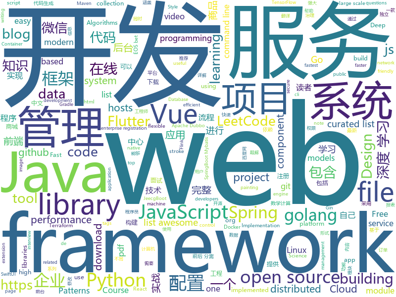

# 2019-06-11
See what the GitHub community is most excited about today.

## python
* [EverydayWechat](https://github.com/sfyc23/EverydayWechat)(**511 stars today**): 每日自动给女朋友发微信暖心话。
* [d2l-zh](https://github.com/d2l-ai/d2l-zh)(**241 stars today**): 《动手学深度学习》，英文版即伯克利深度学习（STAT 157，2019春）教材。面向中文读者、能运行、可讨论。
* [Python](https://github.com/TheAlgorithms/Python)(**200 stars today**): All Algorithms implemented in Python
* [GPT2](https://github.com/ConnorJL/GPT2)(**204 stars today**): An implementation of training for GPT2, supports TPUs
* [football](https://github.com/google-research/football)(**154 stars today**): 
* [begoneads](https://github.com/anned20/begoneads)(**131 stars today**): BeGoneAds is a script that puts some popular hosts file lists into the systems hosts file as a adblocker measure.
* [examples-of-web-crawlers](https://github.com/shengqiangzhang/examples-of-web-crawlers)(**92 stars today**): python爬虫例子,对新手比较友好,主要爬取淘宝、天猫、微信、豆瓣、QQ等网站。
* [system-design-primer](https://github.com/donnemartin/system-design-primer)(**74 stars today**): Learn how to design large-scale systems. Prep for the system design interview. Includes Anki flashcards.
* [models](https://github.com/tensorflow/models)(**64 stars today**): Models and examples built with TensorFlow
* [mathAI](https://github.com/Roujack/mathAI)(**66 stars today**): 一个拍照做题程序。输入一张包含数学计算题的图片，输出识别出的数学计算式以及计算结果。This is a mathematic expression recognition project.
* [machine-learning-course](https://github.com/machinelearningmindset/machine-learning-course)(**70 stars today**): 💬Machine Learning Course with Python. Refer to the course page for step-by-step explanations.
* [algo](https://github.com/wangzheng0822/algo)(**62 stars today**): 数据结构和算法必知必会的50个代码实现
* [keras](https://github.com/keras-team/keras)(**54 stars today**): Deep Learning for humans
* [hosts](https://github.com/StevenBlack/hosts)(**61 stars today**): Extending and consolidating hosts files from several well-curated sources like adaway.org, mvps.org, malwaredomainlist.com, someonewhocares.org, and potentially others. You can optionally invoke extensions to block additional sites by category.
* [AiLearning](https://github.com/apachecn/AiLearning)(**48 stars today**): AiLearning: 机器学习 - MachineLearning - ML、深度学习 - DeepLearning - DL、自然语言处理 NLP
* [awesome-python](https://github.com/vinta/awesome-python)(**53 stars today**): A curated list of awesome Python frameworks, libraries, software and resources
* [kedro](https://github.com/quantumblacklabs/kedro)(**53 stars today**): A Python library for building robust production-ready data and analytics pipelines
* [LearningToPaint](https://github.com/hzwer/LearningToPaint)(**53 stars today**): A painting AI that can reproduce paintings stroke by stroke using deep reinforcement learning.
* [bert](https://github.com/google-research/bert)(**44 stars today**): TensorFlow code and pre-trained models for BERT
* [ProtonDB-to-Steam-Library](https://github.com/CorruptComputer/ProtonDB-to-Steam-Library)(**42 stars today**): Pull ratings from ProtonDB and import them into your Steam library as tags.
* [Intensio-Obfuscator](https://github.com/Hnfull/Intensio-Obfuscator)(**42 stars today**): Obfuscate a python code 2.x and 3.x
* [city-vein](https://github.com/96486d9b/city-vein)(**41 stars today**): Urban structure characterized by public lines
* [youtube-dl](https://github.com/ytdl-org/youtube-dl)(**39 stars today**): Command-line program to download videos from YouTube.com and other video sites
* [RDPassSpray](https://github.com/xFreed0m/RDPassSpray)(**40 stars today**): Python3 tool to perform password spraying using RDP
* [cpython](https://github.com/python/cpython)(**27 stars today**): The Python programming language

## java
* [LeetCodeAnimation](https://github.com/MisterBooo/LeetCodeAnimation)(**385 stars today**): Demonstrate all the questions on LeetCode in the form of animation.（用动画的形式呈现解LeetCode题目的思路）
* [JavaGuide](https://github.com/Snailclimb/JavaGuide)(**265 stars today**): 【Java学习+面试指南】 一份涵盖大部分Java程序员所需要掌握的核心知识。
* [CS-Notes](https://github.com/CyC2018/CS-Notes)(**248 stars today**): 📚技术面试必备基础知识、Leetcode 题解、Java、C++、Python、后端面试、操作系统、计算机网络、系统设计
* [halo](https://github.com/halo-dev/halo)(**122 stars today**): ✍ Halo 一款现代化的个人独立博客系统
* [advanced-java](https://github.com/doocs/advanced-java)(**106 stars today**): 😮互联网 Java 工程师进阶知识完全扫盲：涵盖高并发、分布式、高可用、微服务等领域知识
* [mall](https://github.com/macrozheng/mall)(**81 stars today**): mall项目是一套电商系统，包括前台商城系统及后台管理系统，基于SpringBoot+MyBatis实现。 前台商城系统包含首页门户、商品推荐、商品搜索、商品展示、购物车、订单流程、会员中心、客户服务、帮助中心等模块。 后台管理系统包含商品管理、订单管理、会员管理、促销管理、运营管理、内容管理、统计报表、财务管理、权限管理、设置等模块。
* [spring-boot](https://github.com/spring-projects/spring-boot)(**54 stars today**): Spring Boot
* [jeecg-boot](https://github.com/zhangdaiscott/jeecg-boot)(**53 stars today**): 一款基于代码生成器的Java快速开发平台！全新技术,前后端分离架构：SpringBoot 2.x，Mybatis，Shiro，JWT，Vue&Ant Design。强大的代码生成器让前端和后台代码一键生成，无需写任何代码，绝对是全栈开发福音！！ JeecgBoot的宗旨是提高UI能力的同时,降低前后分离的开发成本，JeecgBoot还独创在线开发模式，No代码概念，一系列在线智能开发：在线配置表单、在线配置报表、在线设计流程等等。
* [dubbo](https://github.com/apache/dubbo)(**41 stars today**): Apache Dubbo is a high-performance, java based, open source RPC framework.
* [arthas](https://github.com/alibaba/arthas)(**43 stars today**): Alibaba Java Diagnostic Tool Arthas/Alibaba Java诊断利器Arthas
* [toBeTopJavaer](https://github.com/hollischuang/toBeTopJavaer)(**43 stars today**): To Be Top Javaer - Java工程师成神之路
* [Java](https://github.com/TheAlgorithms/Java)(**39 stars today**): All Algorithms implemented in Java
* [tutorials](https://github.com/eugenp/tutorials)(**19 stars today**): The "REST With Spring" Course:
* [litemall](https://github.com/linlinjava/litemall)(**39 stars today**): 又一个小商城。litemall = Spring Boot后端 + Vue管理员前端 + 微信小程序用户前端 + Vue用户移动端
* [elasticsearch](https://github.com/elastic/elasticsearch)(**32 stars today**): Open Source, Distributed, RESTful Search Engine
* [seata](https://github.com/seata/seata)(**35 stars today**): 🔥Seata is an easy-to-use, high-performance, open source distributed transaction solution.
* [java-design-patterns](https://github.com/iluwatar/java-design-patterns)(**36 stars today**): Design patterns implemented in Java
* [apollo](https://github.com/ctripcorp/apollo)(**30 stars today**): Apollo（阿波罗）是携程框架部门研发的分布式配置中心，能够集中化管理应用不同环境、不同集群的配置，配置修改后能够实时推送到应用端，并且具备规范的权限、流程治理等特性，适用于微服务配置管理场景。
* [server](https://github.com/wildfirechat/server)(**32 stars today**): 全开源即时通讯(IM)系统
* [WxJava](https://github.com/Wechat-Group/WxJava)(**30 stars today**): WxJava （微信开发 Java SDK），支持包括微信支付、开放平台、小程序、企业微信/企业号和公众号等的后端开发
* [spring-framework](https://github.com/spring-projects/spring-framework)(**24 stars today**): Spring Framework
* [SpringCloudLearning](https://github.com/forezp/SpringCloudLearning)(**24 stars today**): 《史上最简单的Spring Cloud教程源码》
* [nacos](https://github.com/alibaba/nacos)(**25 stars today**): an easy-to-use dynamic service discovery, configuration and service management platform for building cloud native applications.
* [FlyCloud](https://github.com/geduo83/FlyCloud)(**29 stars today**): 🔥🔥🔥FlyClould 微服务实战项目框架，在该框架中，包括了用 Spring Cloud 构建微服务的一系列基本组件和框架，对于后台服务框架的搭建有很大的参考价值，大家可以参考甚至稍加修改可以直接应用于自己的实际的项目开发中，该项目没有采用Maven进行项目构建，Maven通过xml进行依赖管理，导致整个配置文件太过臃肿，另外灵活性也不是很强，所以我采用Gradle进行项目构建和依赖管理，在FlyTour项目中我们见证了Gradle的强大，通过简单的一些配置就可以轻松的实现组件化的功能。该项目共有11个Module工程。其中10个位微服务工程，这10个微服务工程构成了一个完整的微服务系统，微服务系统包含了8个基础服务，提供了一整套微服务治理功能，他们分别是配置中心module_c…
* [flink-learning](https://github.com/zhisheng17/flink-learning)(**28 stars today**): flink learning blog. http://www.54tianzhisheng.cn/tags/Flink/

## unknown
* [from_coder_to_expert](https://github.com/0voice/from_coder_to_expert)(**797 stars today**): 2019年最新总结，从程序员到CTO，从专业走向卓越，分享大牛企业内部pdf与PPT
* [Enterprise-Registration-Data-of-Chinese-Mainland](https://github.com/imhuster/Enterprise-Registration-Data-of-Chinese-Mainland)(**653 stars today**): 中国大陆 31 个省份1978 年至 2019 年一千多万工商企业注册信息，包含企业名称、注册地址、统一社会信用代码、地区、注册日期、经营范围、法人代表、注册资金、企业类型等详细资料。This repository is an dataset of over 10,000,000 enterprise registration data of 31 provinces in Chinese mainland from 1978 to 2019.【工商大数据】、【企业信息】、【enterprise registration data】。
* [the-art-of-command-line](https://github.com/jlevy/the-art-of-command-line)(**442 stars today**): Master the command line, in one page
* [trackerslist](https://github.com/ngosang/trackerslist)(**379 stars today**): Updated list of public BitTorrent trackers
* [The-Documentation-Compendium](https://github.com/kylelobo/The-Documentation-Compendium)(**357 stars today**): 📢Various README templates & tips on writing high-quality documentation that people want to read.
* [GSYFlutterBook](https://github.com/CarGuo/GSYFlutterBook)(**291 stars today**): Flutter完整开发实战详解系列，提供在线预览和pdf下载，本系列将完整讲述：如何快速从 0 开发一个完整的 Flutter APP，配套高完成度 Flutter 开源项目 GSYGithubAppFlutter ，同时会提供一些Flutter的开发细节技巧，之后深入源码和实战为你全面解析 Flutter 。
* [SwiftUI-Cheat-Sheet](https://github.com/SimpleBoilerplates/SwiftUI-Cheat-Sheet)(**188 stars today**): SwiftUI Cheat Sheet
* [the-book-of-secret-knowledge](https://github.com/trimstray/the-book-of-secret-knowledge)(**127 stars today**): A collection of inspiring lists, manuals, cheatsheets, blogs, hacks, one-liners, cli/web tools and more.
* [gold-miner](https://github.com/xitu/gold-miner)(**95 stars today**): 🥇掘金翻译计划，可能是世界最大最好的英译中技术社区，最懂读者和译者的翻译平台：
* [awesome](https://github.com/sindresorhus/awesome)(**87 stars today**): 😎Awesome lists about all kinds of interesting topics
* [free-programming-books-zh_CN](https://github.com/justjavac/free-programming-books-zh_CN)(**62 stars today**): 📚免费的计算机编程类中文书籍，欢迎投稿
* [gitignore](https://github.com/github/gitignore)(**50 stars today**): A collection of useful .gitignore templates
* [awesome-scalability](https://github.com/binhnguyennus/awesome-scalability)(**64 stars today**): The Patterns of Scalable, Reliable, and Performant Large-Scale Systems
* [awesome-uikit](https://github.com/jaywcjlove/awesome-uikit)(**61 stars today**): Collect JS Frameworks, Web components library and Admin Template.
* [TAADpapers](https://github.com/thunlp/TAADpapers)(**54 stars today**): Must-read Papers on Textual Adversarial Attack and Defense
* [free-programming-books](https://github.com/EbookFoundation/free-programming-books)(**52 stars today**): 📚Freely available programming books
* [hosts](https://github.com/googlehosts/hosts)(**46 stars today**): 镜像：https://coding.net/u/scaffrey/p/hosts/git
* [hacker-laws](https://github.com/dwmkerr/hacker-laws)(**51 stars today**): 💻📖Laws, Theories, Principles and Patterns that developers will find useful. #hackerlaws
* [swiftui](https://github.com/ygit/swiftui)(**49 stars today**): A collaborative list of awesome SwiftUI resources. Feel free to contribute!
* [industry-machine-learning](https://github.com/firmai/industry-machine-learning)(**40 stars today**): A curated list of applied machine learning and data science notebooks and libraries across different industries.
* [Dork-Admin](https://github.com/No-Github/Dork-Admin)(**44 stars today**): 盘点近年来的数据泄露事件
* [DeepLearning-500-questions](https://github.com/scutan90/DeepLearning-500-questions)(**35 stars today**): 深度学习500问，以问答形式对常用的概率知识、线性代数、机器学习、深度学习、计算机视觉等热点问题进行阐述，以帮助自己及有需要的读者。 全书分为18个章节，50余万字。由于水平有限，书中不妥之处恳请广大读者批评指正。 未完待续............ 如有意合作，联系scutjy2015@163.com 版权所有，违权必究 Tan 2018.06
* [rfcs](https://github.com/vuejs/rfcs)(**40 stars today**): RFCs for substantial changes / feature additions to Vue core
* [awesome-vue](https://github.com/vuejs/awesome-vue)(**32 stars today**): 🎉A curated list of awesome things related to Vue.js
* [fe-necessary-book](https://github.com/ddzy/fe-necessary-book)(**30 stars today**): A pdf and software collection about frontend

## javascript
* [leetcode](https://github.com/azl397985856/leetcode)(**205 stars today**): LeetCode Solutions: A Record of My Problem Solving Journey.( leetcode题解，记录自己的leetcode解题之路。)
* [buster](https://github.com/dessant/buster)(**168 stars today**): Captcha solver extension for humans
* [entropic](https://github.com/entropic-dev/entropic)(**150 stars today**): 🦝📦a package registry for anything, but mostly javascript 🦝 🦝 🦝
* [laravel](https://github.com/pipe-dream/laravel)(**145 stars today**): Create Laravel projects really fast
* [vue](https://github.com/vuejs/vue)(**112 stars today**): 🖖Vue.js is a progressive, incrementally-adoptable JavaScript framework for building UI on the web.
* [rxdb](https://github.com/pubkey/rxdb)(**106 stars today**): 💻📱A realtime Database for the Web
* [filepond](https://github.com/pqina/filepond)(**97 stars today**): 🌊A flexible and fun JavaScript file upload library
* [zdog](https://github.com/metafizzy/zdog)(**94 stars today**): Flat, round, designer-friendly pseudo-3D engine for canvas & SVG
* [hat.sh](https://github.com/sh-dv/hat.sh)(**90 stars today**): Free, Fast, Secure client-side File Encryption and Decryption . encrypt and decrypt files in your browser using the web crypto api
* [breaking_the_physical_limits_of_fonts](https://github.com/graphitemaster/breaking_the_physical_limits_of_fonts)(**91 stars today**): Breaking the physical limits of fonts
* [Graviton-App](https://github.com/Graviton-Code-Editor/Graviton-App)(**88 stars today**): Minimalist Code Editor
* [algorithm-visualizer](https://github.com/algorithm-visualizer/algorithm-visualizer)(**84 stars today**): 🎆Interactive Online Platform that Visualizes Algorithms from Code
* [react](https://github.com/facebook/react)(**75 stars today**): A declarative, efficient, and flexible JavaScript library for building user interfaces.
* [bit](https://github.com/teambit/bit)(**85 stars today**): Easily share code between projects with your team.
* [medium-to-own-blog](https://github.com/mathieudutour/medium-to-own-blog)(**80 stars today**): Switch from Medium to your own blog in a few minutes
* [uni-app](https://github.com/dcloudio/uni-app)(**78 stars today**): 使用 Vue.js 开发跨平台应用的前端框架
* [remote-jobs](https://github.com/remoteintech/remote-jobs)(**74 stars today**): A list of semi to fully remote-friendly companies in tech.
* [galio](https://github.com/galio-org/galio)(**68 stars today**): Galio is a beautifully designed, Free and Open Source React Native Framework
* [pixelmatch](https://github.com/mapbox/pixelmatch)(**67 stars today**): The smallest, simplest and fastest JavaScript pixel-level image comparison library
* [baiduyun](https://github.com/syhyz1990/baiduyun)(**61 stars today**): 🖖油猴脚本 一个脚本搞定百度网盘下载
* [core-js](https://github.com/zloirock/core-js)(**61 stars today**): Standard Library
* [bootstrap](https://github.com/twbs/bootstrap)(**42 stars today**): The most popular HTML, CSS, and JavaScript framework for developing responsive, mobile first projects on the web.
* [create-react-app](https://github.com/facebook/create-react-app)(**46 stars today**): Set up a modern web app by running one command.
* [react-devtools-experimental](https://github.com/bvaughn/react-devtools-experimental)(**55 stars today**): Experimental rewrite of the React DevTools extension
* [material-ui](https://github.com/mui-org/material-ui)(**44 stars today**): React components for faster and easier web development. Build your own design system, or start with Material Design.

## html
* [china-indie-podcasts](https://github.com/typlog/china-indie-podcasts)(**138 stars today**): 发现与推荐高质量的中文独立播客
* [linux-command](https://github.com/jaywcjlove/linux-command)(**52 stars today**): Linux命令大全搜索工具，内容包含Linux命令手册、详解、学习、搜集。https://git.io/linux
* [flutter-in-action](https://github.com/flutterchina/flutter-in-action)(**26 stars today**): 《Flutter实战》电子书
* [styleguide](https://github.com/google/styleguide)(**20 stars today**): Style guides for Google-originated open-source projects
* [beautiful-web-type](https://github.com/ubuwaits/beautiful-web-type)(**21 stars today**): In-depth guide to the best open-source typefaces: https://beautifulwebtype.com
* [AdminLTE](https://github.com/ColorlibHQ/AdminLTE)(**16 stars today**): AdminLTE - Free Premium Admin control Panel Theme Based On Bootstrap 3.x
* [proposal-optional-chaining](https://github.com/tc39/proposal-optional-chaining)(**19 stars today**): 
* [Spoon-Knife](https://github.com/octocat/Spoon-Knife)(****): This repo is for demonstration purposes only.
* [Java_Study_Zhao](https://github.com/dixonzhao/Java_Study_Zhao)(**16 stars today**): 
* [EosioBet](https://github.com/EosioBet/EosioBet)(**15 stars today**): EosioBet , An Open Source EOS bet DAPP Project .You can deloy EOS bet game demo on your local computer . Welcome to star
* [Front-end-Developer-Interview-Questions](https://github.com/h5bp/Front-end-Developer-Interview-Questions)(**14 stars today**): A list of helpful front-end related questions you can use to interview potential candidates, test yourself or completely ignore.
* [JavaScript30](https://github.com/wesbos/JavaScript30)(**8 stars today**): 30 Day Vanilla JS Challenge
* [WebFundamentals](https://github.com/google/WebFundamentals)(**13 stars today**): Best practices for modern web development
* [qiubaiying.github.io](https://github.com/qiubaiying/qiubaiying.github.io)(**6 stars today**): BY Blog ->
* [data-science-at-the-command-line](https://github.com/jeroenjanssens/data-science-at-the-command-line)(**10 stars today**): Data Science at the Command Line
* [nndl.github.io](https://github.com/nndl/nndl.github.io)(**9 stars today**): 《神经网络与深度学习》 Neural Network and Deep Learning
* [hyperblog](https://github.com/freddier/hyperblog)(**6 stars today**): Un blog increíble para el curso de Git y Github de Platzi
* [html_wysiwyg](https://github.com/secretGeek/html_wysiwyg)(**10 stars today**): A truly naked, brutalist html quine
* [Micromodal](https://github.com/ghosh/Micromodal)(**9 stars today**): ⭕ Tiny javascript library for creating accessible modal dialogs
* [polymer](https://github.com/Polymer/polymer)(**9 stars today**): Our original Web Component library.
* [proposal-top-level-await](https://github.com/tc39/proposal-top-level-await)(**9 stars today**): top-level `await` proposal for ECMAScript (stage 3)
* [en.javascript.info](https://github.com/javascript-tutorial/en.javascript.info)(**8 stars today**): Modern JavaScript Tutorial
* [precis](https://github.com/abhin4v/precis)(**7 stars today**): A minimal note taking app build over Github Pages
* [cs231n.github.io](https://github.com/cs231n/cs231n.github.io)(**7 stars today**): Public facing notes page
* [nginxconfig.io](https://github.com/0xB4LINT/nginxconfig.io)(**8 stars today**): ⚙️NGiИX config generator on steroids💉

## go
* [cloud-game](https://github.com/giongto35/cloud-game)(**152 stars today**): Web-based Cloud Gaming Service
* [v2ray-core](https://github.com/v2ray/v2ray-core)(**126 stars today**): A platform for building proxies to bypass network restrictions.
* [script](https://github.com/bitfield/script)(**134 stars today**): Making it easy to write shell-like scripts in Go
* [dive](https://github.com/wagoodman/dive)(**102 stars today**): A tool for exploring each layer in a docker image
* [restic](https://github.com/restic/restic)(**69 stars today**): Fast, secure, efficient backup program
* [go](https://github.com/golang/go)(**54 stars today**): The Go programming language
* [kubernetes](https://github.com/kubernetes/kubernetes)(**42 stars today**): Production-Grade Container Scheduling and Management
* [lantern](https://github.com/getlantern/lantern)(**44 stars today**): 🔴蓝灯最新版本下载 https://github.com/getlantern/download🔴Lantern Latest Download https://github.com/getlantern/download🔴
* [awesome-go](https://github.com/avelino/awesome-go)(**44 stars today**): A curated list of awesome Go frameworks, libraries and software
* [terraformer](https://github.com/GoogleCloudPlatform/terraformer)(**47 stars today**): CLI tool to generate terraform files from existing infrastructure (reverse Terraform). Infrastructure to Code
* [diun](https://github.com/crazy-max/diun)(**43 stars today**): 🔔Receive notifications when an image is updated on a Docker registry
* [gotree](https://github.com/8treenet/gotree)(**41 stars today**): Gotree is a vertically distributed framework. Gotree's goal is to easily develop distributed services and liberate the mental burden of developers.
* [excelize](https://github.com/360EntSecGroup-Skylar/excelize)(**37 stars today**): Golang library for reading and writing Microsoft Excel™ (XLSX) files.
* [BaiduPCS-Go](https://github.com/iikira/BaiduPCS-Go)(**36 stars today**): 百度网盘客户端 - Go语言编写
* [gf](https://github.com/gogf/gf)(**37 stars today**): GoFrame is a modular, loose-coupled, production-ready and most-powerful application development framework of golang. Providing a series of core components and dozens of practical modules, such as: cache, logging, containers, timer, validator, database orm, etc. Supporting web server integrated with router, cookie, session, logger, configure, tem…
* [gin](https://github.com/gin-gonic/gin)(**34 stars today**): Gin is a HTTP web framework written in Go (Golang). It features a Martini-like API with much better performance -- up to 40 times faster. If you need smashing performance, get yourself some Gin.
* [hugo](https://github.com/gohugoio/hugo)(**33 stars today**): The world’s fastest framework for building websites.
* [casbin](https://github.com/casbin/casbin)(**33 stars today**): An authorization library that supports access control models like ACL, RBAC, ABAC in Golang
* [dubbo-go](https://github.com/apache/dubbo-go)(**32 stars today**): Go Implementation For Apache Dubbo
* [k9s](https://github.com/derailed/k9s)(**31 stars today**): 🐶Kubernetes CLI To Manage Your Clusters In Style!
* [annie](https://github.com/iawia002/annie)(**31 stars today**): 👾Fast, simple and clean video downloader
* [ferret](https://github.com/MontFerret/ferret)(**30 stars today**): Declarative web scraping
* [golang123](https://github.com/shen100/golang123)(**29 stars today**): golang123 是使用 vue、nuxt、node.js 和 golang 开发的知识分享系统
* [fzf](https://github.com/junegunn/fzf)(**27 stars today**): 🌸A command-line fuzzy finder
* [build-web-application-with-golang](https://github.com/astaxie/build-web-application-with-golang)(**26 stars today**): A golang ebook intro how to build a web with golang

## WordCloud

