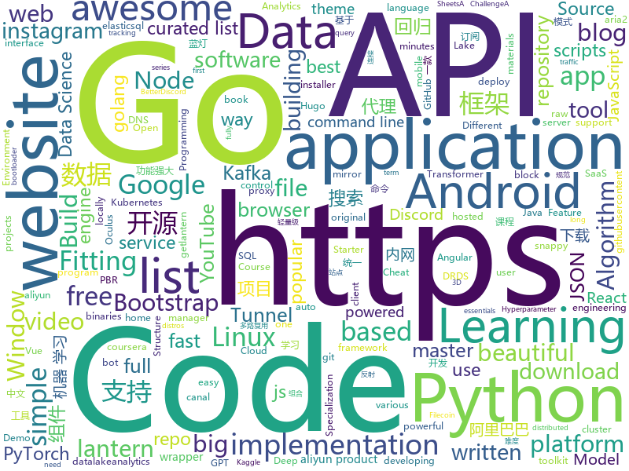

# 2019-06-24
See what the GitHub community is most excited about today.

## python
* [keras-tuner](https://github.com/keras-team/keras-tuner)(**122 stars today**): Hyperparameter tuning for humans
* [hacs](https://github.com/custom-components/hacs)(**16 stars today**): Manage (Install, track, upgrade) and discover custom elements for Home Assistant.
* [XLM](https://github.com/facebookresearch/XLM)(**35 stars today**): PyTorch original implementation of Cross-lingual Language Model Pretraining.
* [instabot.py](https://github.com/instabot-py/instabot.py)(**21 stars today**): Instagram bot. It works without instagram api, need only login and password. Write on python.
* [gryphon](https://github.com/garethdmm/gryphon)(**92 stars today**): Powerful, proven, and extensible framework for building trading strategies at any frequency, with a focus on crypto currencies. Battle-tested with billions traded.
* [Real-Time-Voice-Cloning](https://github.com/CorentinJ/Real-Time-Voice-Cloning)(**116 stars today**): Clone a voice in 5 seconds to generate arbitrary speech in real-time
* [Awesome-Linux-Software](https://github.com/luong-komorebi/Awesome-Linux-Software)(**41 stars today**): A list of awesome applications, software, tools and other materials for Linux distros.
* [discord.py](https://github.com/Rapptz/discord.py)(**5 stars today**): An API wrapper for Discord written in Python.
* [python-binance](https://github.com/sammchardy/python-binance)(**3 stars today**): Binance Exchange API python implementation for automated trading
* [youtube-dl](https://github.com/ytdl-org/youtube-dl)(**52 stars today**): Command-line program to download videos from YouTube.com and other video sites
* [HelloGitHub](https://github.com/521xueweihan/HelloGitHub)(**48 stars today**): 分享 GitHub 上有趣、入门级的开源项目「每月28号更新」
* [instabot](https://github.com/instagrambot/instabot)(**5 stars today**): 🐙Free Instagram scripts, bots and Python API wrapper. Get free instagram followers with our auto like, auto follow and other scripts!
* [USTC-Course](https://github.com/USTC-Resource/USTC-Course)(**15 stars today**): ❤️中国科学技术大学课程资源
* [gym](https://github.com/openai/gym)(**11 stars today**): A toolkit for developing and comparing reinforcement learning algorithms.
* [xlnet-pytorch](https://github.com/pingpong-ai/xlnet-pytorch)(**15 stars today**): 2019 Google Brain's XLNet Pytorch Implementation
* [DeDRM_tools](https://github.com/apprenticeharper/DeDRM_tools)(**4 stars today**): DeDRM tools for ebooks
* [Kosmos](https://github.com/AtlasNX/Kosmos)(**3 stars today**): All-in-One CFW Package for the Nintendo Switch - previously SDFilesSwitch
* [oppia](https://github.com/oppia/oppia)(**4 stars today**): Tool for collaboratively building interactive lessons.
* [data-science-ipython-notebooks](https://github.com/donnemartin/data-science-ipython-notebooks)(**15 stars today**): Data science Python notebooks: Deep learning (TensorFlow, Theano, Caffe, Keras), scikit-learn, Kaggle, big data (Spark, Hadoop MapReduce, HDFS), matplotlib, pandas, NumPy, SciPy, Python essentials, AWS, and various command lines.
* [OctoPrint](https://github.com/foosel/OctoPrint)(**6 stars today**): OctoPrint is the snappy web interface for your 3D printer!
* [esptool](https://github.com/espressif/esptool)(**6 stars today**): ESP8266 and ESP32 serial bootloader utility
* [pytorch-pretrained-BERT](https://github.com/huggingface/pytorch-pretrained-BERT)(**31 stars today**): 📖The Big-&-Extending-Repository-of-Transformers: Pretrained PyTorch models for Google's BERT, OpenAI GPT & GPT-2, Google/CMU Transformer-XL.
* [manim](https://github.com/3b1b/manim)(**39 stars today**): Animation engine for explanatory math videos
* [pyrobot](https://github.com/facebookresearch/pyrobot)(**67 stars today**): PyRobot: An Open Source Robotics Research Platform
* [keras](https://github.com/keras-team/keras)(**18 stars today**): Deep Learning for humans

## java
* [Anki-Android](https://github.com/ankidroid/Anki-Android)(**6 stars today**): AnkiDroid: Anki on Android
* [Leetcode](https://github.com/fishercoder1534/Leetcode)(**10 stars today**): Complete solutions to Leetcode problems; updated daily. (I'm looking for long-term contributors/partners to this repo! Send me PRs if you're interested! - 9/5/2018)
* [ripme](https://github.com/RipMeApp/ripme)(**4 stars today**): Downloads albums in bulk
* [JDA](https://github.com/DV8FromTheWorld/JDA)(**2 stars today**): Java wrapper for the popular chat & VOIP service: Discord https://discordapp.com
* [AndroidTutorialForBeginners](https://github.com/hussien89aa/AndroidTutorialForBeginners)(**4 stars today**): Step by step to build android apps with Android Studio. Code files for YouTube tutorial
* [Arduino](https://github.com/arduino/Arduino)(**3 stars today**): open-source electronics prototyping platform
* [canal](https://github.com/alibaba/canal)(**9 stars today**): 阿里巴巴mysql数据库binlog的增量订阅&消费组件 。阿里云DRDS( https://www.aliyun.com/product/drds )、阿里巴巴TDDL 二级索引、小表复制powerd by canal. Aliyun Data Lake Analytics https://www.aliyun.com/product/datalakeanalytics powered by canal
* [fastjson](https://github.com/alibaba/fastjson)(**11 stars today**): 🚄A fast JSON parser/generator for Java. (Aliyun Data Lake Analytics https://www.aliyun.com/product/datalakeanalytics powered by fastjson )
* [EhViewer](https://github.com/seven332/EhViewer)(**2 stars today**): An Unofficial E-Hentai Application for Android
* [presto](https://github.com/prestodb/presto)(**5 stars today**): The official home of the Presto distributed SQL query engine for big data
* [qksms](https://github.com/moezbhatti/qksms)(**2 stars today**): The most beautiful SMS messenger for Android
* [termux-app](https://github.com/termux/termux-app)(**6 stars today**): Android terminal and Linux environment - app repository.
* [Java](https://github.com/DuGuQiuBai/Java)(**10 stars today**): 27天成为Java大神
* [processing](https://github.com/processing/processing)(**0 stars today**): Source code for the Processing Core and Development Environment (PDE)
* [proxyee-down](https://github.com/proxyee-down-org/proxyee-down)(**12 stars today**): http下载工具，基于http代理，支持多连接分块下载
* [Shadow](https://github.com/Tencent/Shadow)(**150 stars today**): 零反射全动态Android插件框架
* [Cimoc](https://github.com/Arachnid-27/Cimoc)(**12 stars today**): Android 平台在线漫画阅读器
* [algs4](https://github.com/kevin-wayne/algs4)(**9 stars today**): Algorithms, 4th edition textbook code and libraries
* [FATE](https://github.com/WeBankFinTech/FATE)(**2 stars today**): An Industrial Level Federated Learning Framework
* [EdXposed](https://github.com/ElderDrivers/EdXposed)(**11 stars today**): Elder driver Xposed Framework.
* [NetGuard](https://github.com/M66B/NetGuard)(**1 stars today**): A simple way to block access to the internet per application
* [spring-cloud-config](https://github.com/spring-cloud/spring-cloud-config)(**2 stars today**): External configuration (server and client) for Spring Cloud
* [interview](https://github.com/mission-peace/interview)(**9 stars today**): Interview questions
* [dk-fitting](https://github.com/dkhadoop/dk-fitting)(**10 stars today**): Fitting是一个面向大数据的统一的开发框架，由大快搜索主导并完全开源，克服了大数据技术开发涉及技术面广,各组件间缺乏统一规范等问题，能有效降低大数据的学习难度，并提高大数据项目的开发效率并可与开源项目混用。 Fitting遵循Apache2.0开源协议，采用类黑箱框架模式，将大数据生态圈内各组件底层API根据应用组合封装为Fitting API服务。用户编程时直接引用Fitting框架，即可使用功能丰富的Fitting API，完成过去复杂的编码工作。 Fitting框架由数据处理（dataprocess）、数据源（datasource）、ElasticSQL引擎（elasticsql）、图计算（graphx）、机器学习（ml）、自然语言处理（nlp）、搜索(search)、SQL…
* [cruise-control](https://github.com/linkedin/cruise-control)(**1 stars today**): Cruise-control is the first of its kind to fully automate the dynamic workload rebalance and self-healing of a kafka cluster. It provides great value to Kafka users by simplifying the operation of Kafka clusters.

## unknown
* [rfcs](https://github.com/vuejs/rfcs)(**36 stars today**): RFCs for substantial changes / feature additions to Vue core
* [trackerslist](https://github.com/ngosang/trackerslist)(**86 stars today**): Updated list of public BitTorrent trackers
* [Data-Science--Cheat-Sheet](https://github.com/abhat222/Data-Science--Cheat-Sheet)(**70 stars today**): Cheat Sheets
* [awesome-deep-learning](https://github.com/ChristosChristofidis/awesome-deep-learning)(**31 stars today**): A curated list of awesome Deep Learning tutorials, projects and communities.
* [SwiftUI-Cheat-Sheet](https://github.com/SimpleBoilerplates/SwiftUI-Cheat-Sheet)(**32 stars today**): SwiftUI Cheat Sheet
* [Awesome](https://github.com/Awesome-Windows/Awesome)(**65 stars today**): 💻An awesome & curated list of best applications and tools for Windows.
* [games](https://github.com/leereilly/games)(**35 stars today**): 🎮A list of popular/awesome videos games, add-ons, maps, etc. hosted on GitHub. Any genre. Any platform. Any engine.
* [the-art-of-command-line](https://github.com/jlevy/the-art-of-command-line)(**91 stars today**): Master the command line, in one page
* [catj](https://github.com/soheilpro/catj)(**106 stars today**): Displays JSON files in a flat format.
* [distributed-consensus-reading-list](https://github.com/heidi-ann/distributed-consensus-reading-list)(**10 stars today**): 
* [free-programming-books](https://github.com/EbookFoundation/free-programming-books)(**29 stars today**): 📚Freely available programming books
* [hosts](https://github.com/googlehosts/hosts)(**15 stars today**): 镜像：https://coding.net/u/scaffrey/p/hosts/git
* [howto-make-more-money](https://github.com/easychen/howto-make-more-money)(**6 stars today**): 程序员如何优雅的挣零花钱
* [flink-training-course](https://github.com/flink-china/flink-training-course)(**6 stars today**): 
* [PBR-White-Paper](https://github.com/QianMo/PBR-White-Paper)(**6 stars today**): ⚡️基于物理的渲染（PBR）白皮书 | White Paper of Physically Based Rendering(PBR)
* [kubernetes-the-hard-way](https://github.com/kelseyhightower/kubernetes-the-hard-way)(**11 stars today**): Bootstrap Kubernetes the hard way on Google Cloud Platform. No scripts.
* [chromium](https://github.com/jjqqkk/chromium)(**27 stars today**): Chromium browser with SSL VPN. Use this browser to unblock websites.
* [Rules](https://github.com/lhie1/Rules)(**7 stars today**): Rules / 规则：Surge / Shadowrocket / Quantumult
* [steam-for-linux](https://github.com/ValveSoftware/steam-for-linux)(**4 stars today**): Issue tracking for the Steam for Linux beta client
* [Xiaomi_Kernel_OpenSource](https://github.com/MiCode/Xiaomi_Kernel_OpenSource)(**6 stars today**): Xiaomi Mobile Phone Kernel OpenSource
* [cpp-cheat-sheet](https://github.com/gibsjose/cpp-cheat-sheet)(**3 stars today**): C++ Syntax, Data Structures, and Algorithms Cheat Sheet
* [medical-data](https://github.com/beamandrew/medical-data)(**1 stars today**): 
* [awesome-react](https://github.com/enaqx/awesome-react)(**13 stars today**): A collection of awesome things regarding React ecosystem
* [webkit](https://github.com/WebKit/webkit)(**1 stars today**): Unofficial mirror of the WebKit SVN repository
* [blog](https://github.com/fouber/blog)(**42 stars today**): 没事写写文章，喜欢的话请点star，想订阅点watch，千万别fork！

## javascript
* [awesome-selfhosted](https://github.com/Kickball/awesome-selfhosted)(**59 stars today**): This is a list of Free Software network services and web applications which can be hosted locally. Selfhosting is the process of locally hosting and managing applications instead of renting from SaaS providers.
* [PaperWM](https://github.com/paperwm/PaperWM)(**24 stars today**): Tiled scrollable window management for Gnome Shell
* [wechatBot](https://github.com/gengchen528/wechatBot)(**24 stars today**): 微信每日说，爬虫脚本每天定时给女(男)朋友发微信暖心消息
* [awesome-mac](https://github.com/jaywcjlove/awesome-mac)(**39 stars today**):  Now we have become very big, Different from the original idea. Collect premium software in various categories.
* [clean-code-javascript](https://github.com/ryanmcdermott/clean-code-javascript)(**17 stars today**): 🛁Clean Code concepts adapted for JavaScript
* [wp-calypso](https://github.com/Automattic/wp-calypso)(**7 stars today**): The JavaScript and API powered WordPress.com
* [functions-samples](https://github.com/firebase/functions-samples)(**8 stars today**): Collection of sample apps showcasing popular use cases using Cloud Functions for Firebase
* [next.js](https://github.com/zeit/next.js)(**16 stars today**): The React Framework
* [gatsby](https://github.com/gatsbyjs/gatsby)(**14 stars today**): Build blazing fast, modern apps and websites with React
* [qdao-smartcontract-qdao-locker](https://github.com/platinum-engineering/qdao-smartcontract-qdao-locker)(**68 stars today**): 
* [InsiderDevTourDemos19](https://github.com/microsoft/InsiderDevTourDemos19)(**6 stars today**): Insider Dev Tour - Demos - 2019
* [hexbot](https://github.com/noops-challenge/hexbot)(**10 stars today**): Every request returns a different hex code—all 16,777,216 of them.
* [JSVerbalExpressions](https://github.com/VerbalExpressions/JSVerbalExpressions)(**35 stars today**): JavaScript Regular expressions made easy
* [nodebestpractices](https://github.com/i0natan/nodebestpractices)(**66 stars today**): ✅The largest Node.js best practices list (May 2019)
* [nodejs.org](https://github.com/nodejs/nodejs.org)(**7 stars today**): The Node.js website.
* [Motrix](https://github.com/agalwood/Motrix)(**20 stars today**): A full-featured download manager.
* [complete-javascript-course](https://github.com/jonasschmedtmann/complete-javascript-course)(**4 stars today**): Starter files, final projects and FAQ for my Complete JavaScript course
* [vue-function-api](https://github.com/liximomo/vue-function-api)(**50 stars today**): Provide logic composition capabilities for Vue.
* [shadowsocks-manager](https://github.com/shadowsocks/shadowsocks-manager)(**2 stars today**): A shadowsocks manager tool for multi user and traffic control.
* [BetterDiscordAddons](https://github.com/mwittrien/BetterDiscordAddons)(**3 stars today**): A series of plugins and themes for BetterDiscord.
* [brave-browser](https://github.com/brave/brave-browser)(**11 stars today**): Next generation Brave browser for macOS, Windows, Linux, and eventually Android
* [BaiduExporter](https://github.com/acgotaku/BaiduExporter)(**9 stars today**): Assistant for Baidu to export download links to aria2/aria2-rpc
* [template](https://github.com/sveltejs/template)(**4 stars today**): Template for building basic applications with Svelte
* [dribbble2react](https://github.com/react-ui-kit/dribbble2react)(**6 stars today**): Transform Dribbble designs to React-Native code & YouTube video tutorials
* [scratch-blocks](https://github.com/LLK/scratch-blocks)(**6 stars today**): Scratch Blocks is a library for building creative computing interfaces.

## html
* [FES](https://github.com/topepo/FES)(**10 stars today**): Code and Resources for "Feature Engineering and Selection: A Practical Approach for Predictive Models" by Kuhn and Johnson
* [Machine-Learning](https://github.com/Jack-Cherish/Machine-Learning)(**4 stars today**): ⚡️机器学习实战（Python3）：kNN、决策树、贝叶斯、逻辑回归、SVM、线性回归、树回归
* [awesome-competitive-programming](https://github.com/lnishan/awesome-competitive-programming)(**10 stars today**): 💎A curated list of awesome Competitive Programming, Algorithm and Data Structure resources
* [html](https://github.com/whatwg/html)(**0 stars today**): HTML Standard
* [Coursera-ML-AndrewNg-Notes](https://github.com/fengdu78/Coursera-ML-AndrewNg-Notes)(**16 stars today**): 吴恩达老师的机器学习课程个人笔记
* [JavaScript30](https://github.com/wesbos/JavaScript30)(**5 stars today**): 30 Day Vanilla JS Challenge
* [startbootstrap-resume](https://github.com/BlackrockDigital/startbootstrap-resume)(**7 stars today**): A Bootstrap 4 resume/CV theme created by Start Bootstrap
* [hugo-academic](https://github.com/gcushen/hugo-academic)(**2 stars today**): 📝The website builder for Hugo. Build and deploy a beautiful website in minutes!
* [csswg-drafts](https://github.com/w3c/csswg-drafts)(**2 stars today**): CSS Working Group Editor Drafts
* [bitcoin-whitepaper-chinese-translation](https://github.com/xiaolai/bitcoin-whitepaper-chinese-translation)(**5 stars today**): 
* [qiubaiying.github.io](https://github.com/qiubaiying/qiubaiying.github.io)(**1 stars today**): BY Blog ->
* [hylia](https://github.com/andybelldesign/hylia)(**7 stars today**): Hylia is a lightweight Eleventy starter kit to help you to create your own blog or personal website.
* [tcpdump-little-book](https://github.com/NanXiao/tcpdump-little-book)(**3 stars today**): A small book which introduces tcpdump.
* [datasciencecoursera](https://github.com/mGalarnyk/datasciencecoursera)(**2 stars today**): Data Science Repo and blog for John Hopkins Coursera Courses. Please let me know if you have any questions.
* [fluxion](https://github.com/FluxionNetwork/fluxion)(**0 stars today**): Fluxion is a remake of linset by vk496 with less bugs and enhanced functionality.
* [free-for-dev](https://github.com/ripienaar/free-for-dev)(**14 stars today**): A list of SaaS, PaaS and IaaS offerings that have free tiers of interest to devops and infradev
* [SideQuest](https://github.com/the-expanse/SideQuest)(**7 stars today**): A open app store for mobile android based VR devices such as the Oculus Go, Oculus Quest or even the Moverio BT 300 ( IKR? )
* [python](https://github.com/Show-Me-the-Code/python)(**3 stars today**): Show Me the Code Python version.
* [beautiful-jekyll](https://github.com/daattali/beautiful-jekyll)(**1 stars today**): ✨Build a beautiful and simple website in literally minutes. Demo at http://deanattali.com/beautiful-jekyll
* [linux-command](https://github.com/jaywcjlove/linux-command)(**13 stars today**): Linux命令大全搜索工具，内容包含Linux命令手册、详解、学习、搜集。https://git.io/linux
* [coreui-free-angular-admin-template](https://github.com/coreui/coreui-free-angular-admin-template)(**0 stars today**): CoreUI Angular is free Angular 2+ admin template based on Bootstrap 4
* [learning-area](https://github.com/mdn/learning-area)(**2 stars today**): Github repo for the MDN Learning Area.
* [courses](https://github.com/DataScienceSpecialization/courses)(**2 stars today**): Course materials for the Data Science Specialization: https://www.coursera.org/specialization/jhudatascience/1
* [hugo-coder](https://github.com/luizdepra/hugo-coder)(**0 stars today**): A minimalist blog theme for hugo.
* [playground](https://github.com/tailwindcss/playground)(**0 stars today**): 

## go
* [v](https://github.com/vlang/v)(**753 stars today**): Simple, fast, safe, compiled language for developing maintainable software. Supports translation from C and (soon) C++.
* [bigcache](https://github.com/allegro/bigcache)(**39 stars today**): Efficient cache for gigabytes of data written in Go.
* [go-filecoin](https://github.com/filecoin-project/go-filecoin)(**6 stars today**): Filecoin Full Node Implementation in Go
* [go-ipfs](https://github.com/ipfs/go-ipfs)(**13 stars today**): IPFS implementation in Go
* [circl](https://github.com/cloudflare/circl)(**17 stars today**): Cloudflare Interoperable Reusable Cryptographic Library
* [dnscrypt-proxy](https://github.com/jedisct1/dnscrypt-proxy)(**7 stars today**): dnscrypt-proxy 2 - A flexible DNS proxy, with support for encrypted DNS protocols.
* [gdrive](https://github.com/gdrive-org/gdrive)(**11 stars today**): Google Drive CLI Client
* [chat](https://github.com/tinode/chat)(**7 stars today**): Instant messaging server; backend in Go; Android, web command line clients; chatbots
* [kcptun](https://github.com/xtaci/kcptun)(**11 stars today**): A Stable & Secure Tunnel Based On KCP with N:M Multiplexing
* [go-ethereum](https://github.com/ethereum/go-ethereum)(**9 stars today**): Official Go implementation of the Ethereum protocol
* [chaosblade](https://github.com/chaosblade-io/chaosblade)(**9 stars today**): An easy to use and powerful chaos engineering experiment toolkit.（阿里巴巴开源的一款简单易用、功能强大的混沌实验注入工具）
* [btcd](https://github.com/btcsuite/btcd)(**5 stars today**): An alternative full node bitcoin implementation written in Go (golang)
* [olivia](https://github.com/olivia-ai/olivia)(**178 stars today**): 💁‍♀️Your new best friend built with an artificial neural network
* [Dragonfly](https://github.com/dragonflyoss/Dragonfly)(**5 stars today**): Dragonfly is an intelligent P2P based image and file distribution system.
* [the-way-to-go_ZH_CN](https://github.com/Unknwon/the-way-to-go_ZH_CN)(**10 stars today**): 《The Way to Go》中文译本，中文正式名《Go 入门指南》
* [wire](https://github.com/google/wire)(**19 stars today**): Compile-time Dependency Injection for Go
* [gron](https://github.com/tomnomnom/gron)(**26 stars today**): Make JSON greppable!
* [nps](https://github.com/cnlh/nps)(**9 stars today**): 一款轻量级、功能强大的内网穿透代理服务器。支持tcp、udp流量转发，支持内网http代理、内网socks5代理，同时支持snappy压缩、站点保护、加密传输、多路复用、header修改等。支持web图形化管理，集成多用户模式。
* [service](https://github.com/kardianos/service)(**13 stars today**): Run go programs as a service on major platforms.
* [btree](https://github.com/google/btree)(**5 stars today**): 
* [ko](https://github.com/google/ko)(**26 stars today**): Build and deploy Go applications on Kubernetes
* [crypto](https://github.com/golang/crypto)(**4 stars today**): [mirror] Go supplementary cryptography libraries
* [gost](https://github.com/ginuerzh/gost)(**10 stars today**): GO Simple Tunnel - a simple tunnel written in golang
* [lantern](https://github.com/getlantern/lantern)(**20 stars today**): 蓝灯Windows下载 https://raw.githubusercontent.com/getlantern/lantern-binaries/master/lantern-installer.exe 蓝灯安卓下载 https://raw.githubusercontent.com/getlantern/lantern-binaries/master/lantern-installer.apk
* [discordgo](https://github.com/bwmarrin/discordgo)(**4 stars today**): (Golang) Go bindings for Discord

## WordCloud

