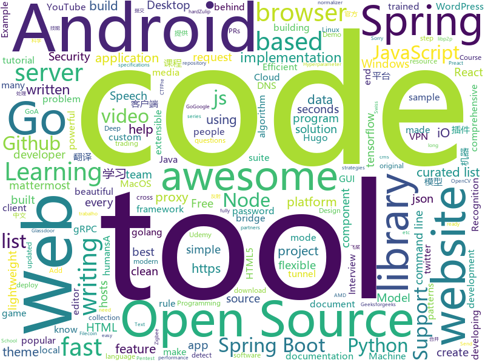

# 2019-06-25
See what the GitHub community is most excited about today.

## python
* [DeepFaceLab](https://github.com/iperov/DeepFaceLab)(**68 stars today**): DeepFaceLab is a tool that utilizes machine learning to replace faces in videos. Includes prebuilt ready to work standalone Windows 7,8,10 binary (look readme.md).
* [keras-tuner](https://github.com/keras-team/keras-tuner)(**118 stars today**): Hyperparameter tuning for humans
* [gym](https://github.com/openai/gym)(**20 stars today**): A toolkit for developing and comparing reinforcement learning algorithms.
* [XLM](https://github.com/facebookresearch/XLM)(**55 stars today**): PyTorch original implementation of Cross-lingual Language Model Pretraining.
* [gryphon](https://github.com/garethdmm/gryphon)(**83 stars today**): Powerful, proven, and extensible framework for building trading strategies at any frequency, with a focus on crypto currencies. Battle-tested with billions traded.
* [ChineseNLPCorpus](https://github.com/InsaneLife/ChineseNLPCorpus)(**23 stars today**): 中文自然语言处理数据集，平时做做实验的材料。欢迎补充提交合并。
* [LaZagne](https://github.com/AlessandroZ/LaZagne)(**3 stars today**): Credentials recovery project
* [hacs](https://github.com/custom-components/hacs)(**25 stars today**): Manage (Install, track, upgrade) and discover custom elements for Home Assistant.
* [darkflow](https://github.com/thtrieu/darkflow)(**9 stars today**): Translate darknet to tensorflow. Load trained weights, retrain/fine-tune using tensorflow, export constant graph def to mobile devices
* [PySimpleGUI](https://github.com/PySimpleGUI/PySimpleGUI)(**24 stars today**): Launched in 2018 Actively developed and supported. Supports tkinter, Qt, WxPython, Remi (in browser). Create custom layout GUI's simply. Python 2.7 & 3 Support. 100+ Demo programs & Cookbook for rapid start. Extensive documentation. Examples using Machine Learning(GUI, OpenCV Integration, Chatterbot), Floating Desktop Widgets, Matplotlib + Pyplo…
* [masr](https://github.com/lukhy/masr)(**18 stars today**): 中文语音识别，提供预训练模型，高识别率 Chinese Speech Recognition; Mandarin Automatic Speech Recognition;
* [requests](https://github.com/kennethreitz/requests)(**20 stars today**): Python HTTP Requests for Humans™✨🍰✨
* [youtube-dl](https://github.com/ytdl-org/youtube-dl)(**40 stars today**): Command-line program to download videos from YouTube.com and other video sites
* [speech-driven-animation](https://github.com/DinoMan/speech-driven-animation)(**35 stars today**): 
* [Real-Time-Voice-Cloning](https://github.com/CorentinJ/Real-Time-Voice-Cloning)(**194 stars today**): Clone a voice in 5 seconds to generate arbitrary speech in real-time
* [PayloadsAllTheThings](https://github.com/swisskyrepo/PayloadsAllTheThings)(**13 stars today**): A list of useful payloads and bypass for Web Application Security and Pentest/CTF
* [models](https://github.com/PaddlePaddle/models)(**26 stars today**): Pre-trained and Reproduced Deep Learning Models （『飞桨』官方模型库，包含多种学术前沿和工业场景验证有效的领先模型）
* [check_uscis_script](https://github.com/cczhong11/check_uscis_script)(**4 stars today**): A simple Python script help you know more about USCIS status
* [Shadowrocket-ADBlock-Rules](https://github.com/h2y/Shadowrocket-ADBlock-Rules)(**13 stars today**): 提供多款 Shadowrocket 规则，带广告过滤功能。用于 iOS 未越狱设备选择性地自动翻墙。
* [Grid-R-CNN](https://github.com/STVIR/Grid-R-CNN)(**20 stars today**): 
* [oppia](https://github.com/oppia/oppia)(**14 stars today**): Tool for collaboratively building interactive lessons.
* [discord.py](https://github.com/Rapptz/discord.py)(**11 stars today**): An API wrapper for Discord written in Python.
* [Tensorflow-Tutorial](https://github.com/MorvanZhou/Tensorflow-Tutorial)(**9 stars today**): Tensorflow tutorial from basic to hard
* [zulip](https://github.com/zulip/zulip)(**9 stars today**): Zulip server - powerful open source team chat
* [esptool](https://github.com/espressif/esptool)(**9 stars today**): ESP8266 and ESP32 serial bootloader utility

## java
* [FuckMFS](https://github.com/HiedaNaKan/FuckMFS)(**342 stars today**): 去他妈的取证
* [interview](https://github.com/mission-peace/interview)(**8 stars today**): Interview questions
* [SpringAll](https://github.com/wuyouzhuguli/SpringAll)(**65 stars today**): 循序渐进，学习Spring Boot、Spring Boot & Shiro、Spring Cloud和Spring Security，博客Spring系列源码
* [Leetcode](https://github.com/fishercoder1534/Leetcode)(**16 stars today**): Complete solutions to Leetcode problems; updated daily. (I'm looking for long-term contributors/partners to this repo! Send me PRs if you're interested! - 9/5/2018)
* [spring-petclinic](https://github.com/spring-projects/spring-petclinic)(**7 stars today**): A sample Spring-based application
* [termux-app](https://github.com/termux/termux-app)(**4 stars today**): Android terminal and Linux environment - app repository.
* [MigrationMiner](https://github.com/hussien89aa/MigrationMiner)(**13 stars today**): A tool to detect migration code between two Java third-party libraries
* [runelite](https://github.com/runelite/runelite)(**1 stars today**): Open source Old School RuneScape client
* [Cimoc](https://github.com/Arachnid-27/Cimoc)(**20 stars today**): Android 平台在线漫画阅读器
* [libgdx](https://github.com/libgdx/libgdx)(**2 stars today**): Desktop/Android/HTML5/iOS Java game development framework
* [EdXposed](https://github.com/ElderDrivers/EdXposed)(**11 stars today**): Elder driver Xposed Framework.
* [JAViewer](https://github.com/SplashCodes/JAViewer)(**12 stars today**): 更优雅的驾车体验
* [interviews](https://github.com/kdn251/interviews)(**38 stars today**): Everything you need to know to get the job.
* [Shadow](https://github.com/Tencent/Shadow)(**297 stars today**): 零反射全动态Android插件框架
* [Interview-Questions](https://github.com/rishabh115/Interview-Questions)(**3 stars today**): Most comprehensive list📋of interview questions📘of companies scraped from Geeksforgeeks, CareerCup and Glassdoor.
* [AndroidTutorialForBeginners](https://github.com/hussien89aa/AndroidTutorialForBeginners)(**4 stars today**): Step by step to build android apps with Android Studio. Code files for YouTube tutorial
* [HackerRank_solutions](https://github.com/RodneyShag/HackerRank_solutions)(**6 stars today**): 317 efficient solutions to HackerRank problems
* [spring-security-react-ant-design-polls-app](https://github.com/callicoder/spring-security-react-ant-design-polls-app)(**7 stars today**): Full Stack Polls App built using Spring Boot, Spring Security, JWT, React, and Ant Design
* [library](https://github.com/ddd-by-examples/library)(**4 stars today**): A comprehensive Domain-Driven Design example with problem space strategic analysis and various tactical patterns.
* [NewPipe](https://github.com/TeamNewPipe/NewPipe)(**6 stars today**): A libre lightweight streaming front-end for Android.
* [qksms](https://github.com/moezbhatti/qksms)(**6 stars today**): The most beautiful SMS messenger for Android
* [spring-mvc-showcase](https://github.com/spring-projects/spring-mvc-showcase)(**4 stars today**): Demonstrates the features of the Spring MVC web framework
* [ChatKit](https://github.com/stfalcon-studio/ChatKit)(**2 stars today**): Android library. Flexible components for chat UI implementation with flexible possibilities for styling, customizing and data management. Made by Stfalcon
* [ExoPlayer](https://github.com/google/ExoPlayer)(**10 stars today**): An extensible media player for Android
* [AppEnv](https://github.com/kingsollyu/AppEnv)(**20 stars today**): 应用变量

## unknown
* [every-programmer-should-know](https://github.com/mtdvio/every-programmer-should-know)(**134 stars today**): A collection of (mostly) technical things every software developer should know
* [awesome-yara](https://github.com/InQuest/awesome-yara)(**45 stars today**): A curated list of awesome YARA rules, tools, and people.
* [rfcs](https://github.com/vuejs/rfcs)(**127 stars today**): RFCs for substantial changes / feature additions to Vue core
* [clean-go-article](https://github.com/Pungyeon/clean-go-article)(**52 stars today**): The motivation behind writing this document, is to create a resource (and eventually a reference) for the Go community, which will help developers write cleaner code. This benefits every one of us. Whether we are writing code by ourselves, or writing code in larger teams. Establishing good paradigms for writing clean code and ensuring that this …
* [trackerslist](https://github.com/ngosang/trackerslist)(**117 stars today**): Updated list of public BitTorrent trackers
* [chromium](https://github.com/jjqqkk/chromium)(**11 stars today**): Chromium browser with SSL VPN. Use this browser to unblock websites.
* [gold-miner](https://github.com/xitu/gold-miner)(**126 stars today**): 🥇掘金翻译计划，可能是世界最大最好的英译中技术社区，最懂读者和译者的翻译平台：
* [golang-open-source-projects](https://github.com/hackstoic/golang-open-source-projects)(**46 stars today**): 为互联网IT人打造的中文版awesome-go
* [Data-Science--Cheat-Sheet](https://github.com/abhat222/Data-Science--Cheat-Sheet)(**81 stars today**): Cheat Sheets
* [dl-engineer-guidebook](https://github.com/ypwhs/dl-engineer-guidebook)(**35 stars today**): 深度学习工程师生存指南
* [hosts](https://github.com/googlehosts/hosts)(**24 stars today**): 镜像：https://coding.net/u/scaffrey/p/hosts/git
* [blog](https://github.com/sorrycc/blog)(**35 stars today**): 💡
* [You-Dont-Know-JS](https://github.com/getify/You-Dont-Know-JS)(**78 stars today**): A book series on JavaScript. @YDKJS on twitter.
* [games](https://github.com/leereilly/games)(**6 stars today**): 🎮A list of popular/awesome videos games, add-ons, maps, etc. hosted on GitHub. Any genre. Any platform. Any engine.
* [remote-jobs-brazil](https://github.com/lerrua/remote-jobs-brazil)(**12 stars today**): Lista de empresas com trabalho remoto no Brasil
* [docs](https://github.com/mimblewimble/docs)(**2 stars today**): Open wiki documentation for Grin and MimbleWimble
* [fancyss_history_package](https://github.com/hq450/fancyss_history_package)(**11 stars today**): 科学上网插件的离线安装包储存在这里
* [Awesome](https://github.com/Awesome-Windows/Awesome)(**39 stars today**): 💻An awesome & curated list of best applications and tools for Windows.
* [pumpkin-book](https://github.com/datawhalechina/pumpkin-book)(**47 stars today**): 《机器学习》（西瓜书）公式推导解析，在线阅读地址：https://datawhalechina.github.io/pumpkin-book
* [post-mortems](https://github.com/danluu/post-mortems)(**19 stars today**): A collection of postmortems. Sorry for the delay in merging PRs!
* [awesome-deep-learning](https://github.com/ChristosChristofidis/awesome-deep-learning)(**97 stars today**): A curated list of awesome Deep Learning tutorials, projects and communities.
* [AMD_Vanilla](https://github.com/AMD-OSX/AMD_Vanilla)(**3 stars today**): Native AMD macOS via Clover KernelToPatch
* [1024app-android](https://github.com/yuuwill/1024app-android)(**7 stars today**): 草榴官方客户端，小草客户端，Android
* [Probable-Wordlists](https://github.com/berzerk0/Probable-Wordlists)(**7 stars today**): Version 2 is live! Wordlists sorted by probability originally created for password generation and testing - make sure your passwords aren't popular!
* [vid](https://github.com/medvednikov/vid)(**9 stars today**): Open-source editor written in V with the performance of Sublime Text

## javascript
* [nodebestpractices](https://github.com/i0natan/nodebestpractices)(**36 stars today**): ✅The largest Node.js best practices list (May 2019)
* [InsiderDevTourDemos19](https://github.com/microsoft/InsiderDevTourDemos19)(**4 stars today**): Insider Dev Tour - Demos - 2019
* [freeCodeCamp](https://github.com/freeCodeCamp/freeCodeCamp)(**31 stars today**): The https://www.freeCodeCamp.org open source codebase and curriculum. Learn to code for free together with millions of people.
* [brackets](https://github.com/adobe/brackets)(**14 stars today**): An open source code editor for the web, written in JavaScript, HTML and CSS.
* [hexbot](https://github.com/noops-challenge/hexbot)(**12 stars today**): Every request returns a different hex code—all 16,777,216 of them.
* [Rocket.Chat](https://github.com/RocketChat/Rocket.Chat)(**16 stars today**): The ultimate Free Open Source Solution for team communications.
* [eslint](https://github.com/eslint/eslint)(**23 stars today**): A fully pluggable tool for identifying and reporting on patterns in JavaScript
* [zigbee2mqtt](https://github.com/Koenkk/zigbee2mqtt)(**7 stars today**): Zigbee🐝to MQTT bridge🌉, get rid of your proprietary Zigbee bridges🔨
* [openzeppelin-solidity](https://github.com/OpenZeppelin/openzeppelin-solidity)(**8 stars today**): OpenZeppelin is a library for secure smart contract development
* [nodejs.org](https://github.com/nodejs/nodejs.org)(**10 stars today**): The Node.js website.
* [generator-jhipster](https://github.com/jhipster/generator-jhipster)(**10 stars today**): Open Source application generator for creating Spring Boot + Angular/React projects in seconds!
* [RSSHub](https://github.com/DIYgod/RSSHub)(**33 stars today**): 🍰万物皆可 RSS
* [fusuma](https://github.com/hiroppy/fusuma)(**69 stars today**): ✍️Fusuma makes slides with Markdown easily.
* [JSVerbalExpressions](https://github.com/VerbalExpressions/JSVerbalExpressions)(**64 stars today**): JavaScript Regular expressions made easy
* [json-node-normalizer](https://github.com/benjamin-allion/json-node-normalizer)(**10 stars today**): 'json-node-normalizer' - NodeJS module that normalize json data types from json schema specifications.
* [udemy-docker-mastery](https://github.com/BretFisher/udemy-docker-mastery)(**2 stars today**): Udemy Course to build, compose, deploy, and manage containers from local development to high-availability in the cloud
* [Modernizr](https://github.com/Modernizr/Modernizr)(**7 stars today**): Modernizr is a JavaScript library that detects HTML5 and CSS3 features in the user’s browser.
* [ethereumbook](https://github.com/ethereumbook/ethereumbook)(**5 stars today**): Mastering Ethereum, by Andreas M. Antonopoulos, Gavin Wood
* [udemy-downloader-gui](https://github.com/FaisalUmair/udemy-downloader-gui)(**7 stars today**): A desktop application for downloading Udemy Courses
* [mattermost-webapp](https://github.com/mattermost/mattermost-webapp)(**1 stars today**): Webapp of Mattermost server: https://github.com/mattermost/mattermost-server
* [phaser3-examples](https://github.com/photonstorm/phaser3-examples)(**1 stars today**): Phaser 3 Examples
* [UnblockNeteaseMusic](https://github.com/nondanee/UnblockNeteaseMusic)(**19 stars today**): Revive unavailable songs for Netease Cloud Music
* [gatsby-starter-netlify-cms](https://github.com/netlify-templates/gatsby-starter-netlify-cms)(**2 stars today**): Example gatsby + netlify cms project
* [Darkmode.js](https://github.com/sandoche/Darkmode.js)(**77 stars today**): 🌓Add a dark-mode / night-mode to your website in a few seconds
* [gitalk](https://github.com/gitalk/gitalk)(**5 stars today**): Gitalk is a modern comment component based on Github Issue and Preact.

## html
* [skill-map](https://github.com/TeamStuQ/skill-map)(**14 stars today**): 程序员技能图谱
* [JavaScript30](https://github.com/wesbos/JavaScript30)(**8 stars today**): 30 Day Vanilla JS Challenge
* [shellphish](https://github.com/thelinuxchoice/shellphish)(**3 stars today**): Phishing Tool for 18 social media: Instagram, Facebook, Snapchat, Github, Twitter, Yahoo, Protonmail, Spotify, Netflix, Linkedin, Wordpress, Origin, Steam, Microsoft, InstaFollowers, Gitlab, Pinterest
* [favorites-web](https://github.com/cloudfavorites/favorites-web)(**4 stars today**): 云收藏 Spring Boot 2.X 开源项目
* [quickstart-js](https://github.com/firebase/quickstart-js)(**2 stars today**): Firebase Quickstart Samples for Web
* [Coursera-ML-AndrewNg-Notes](https://github.com/fengdu78/Coursera-ML-AndrewNg-Notes)(**27 stars today**): 吴恩达老师的机器学习课程个人笔记
* [blog_os](https://github.com/phil-opp/blog_os)(**4 stars today**): Writing an OS in Rust
* [modular-admin-html](https://github.com/modularcode/modular-admin-html)(**2 stars today**): ModularAdmin - Free Dashboard Theme Built On Bootstrap 4 | HTML Version
* [FES](https://github.com/topepo/FES)(**4 stars today**): Code and Resources for "Feature Engineering and Selection: A Practical Approach for Predictive Models" by Kuhn and Johnson
* [zenbot](https://github.com/DeviaVir/zenbot)(**4 stars today**): Zenbot is a command-line cryptocurrency trading bot using Node.js and MongoDB.
* [wpt](https://github.com/web-platform-tests/wpt)(**5 stars today**): Test suites for Web platform specs — including WHATWG, W3C, and others
* [webdevbootcamp](https://github.com/nax3t/webdevbootcamp)(**1 stars today**): All source code for back-end projects from the Web Developer Bootcamp
* [REKCARC-TSC-UHT](https://github.com/PKUanonym/REKCARC-TSC-UHT)(**386 stars today**): 清华大学计算机系课程攻略 Guidance for courses in Department of Computer Science and Technology, Tsinghua University
* [Spiral-Down-Cut-Router-Bit](https://github.com/MaslowCommunityGarden/Spiral-Down-Cut-Router-Bit)(**40 stars today**): 1/4&quot; Spiral Downcut Bits
* [hylia](https://github.com/andybelldesign/hylia)(**7 stars today**): Hylia is a lightweight Eleventy starter kit to help you to create your own blog or personal website.
* [polymer](https://github.com/Polymer/polymer)(**0 stars today**): Our original Web Component library.
* [Django-CRM](https://github.com/MicroPyramid/Django-CRM)(**0 stars today**): Open Source Python CRM based on Django
* [html_wysiwyg](https://github.com/secretGeek/html_wysiwyg)(**5 stars today**): A truly naked, brutalist html quine
* [ecma262](https://github.com/tc39/ecma262)(**7 stars today**): Status, process, and documents for ECMA262
* [hugo-academic](https://github.com/gcushen/hugo-academic)(**4 stars today**): 📝The website builder for Hugo. Build and deploy a beautiful website in minutes!
* [bitcoin-whitepaper-chinese-translation](https://github.com/xiaolai/bitcoin-whitepaper-chinese-translation)(**1 stars today**): 
* [zepto](https://github.com/madrobby/zepto)(**4 stars today**): Zepto.js is a minimalist JavaScript library for modern browsers, with a jQuery-compatible API
* [Mainroad](https://github.com/Vimux/Mainroad)(**1 stars today**): Responsive, simple, clean and content-focused Hugo theme based on the MH Magazine lite WordPress theme
* [awesome-competitive-programming](https://github.com/lnishan/awesome-competitive-programming)(**6 stars today**): 💎A curated list of awesome Competitive Programming, Algorithm and Data Structure resources
* [mkdocs-material](https://github.com/squidfunk/mkdocs-material)(**7 stars today**): A Material Design theme for MkDocs

## go
* [v](https://github.com/vlang/v)(**1,176 stars today**): Simple, fast, safe, compiled language for developing maintainable software. Supports translation from C and (soon) C++. Compiles itself in <1s.
* [grpc-tools](https://github.com/bradleyjkemp/grpc-tools)(**81 stars today**): A suite of gRPC debugging tools. Like Fiddler/Charles but for gRPC.
* [olivia](https://github.com/olivia-ai/olivia)(**76 stars today**): 💁‍♀️Your new best friend built with an artificial neural network
* [doom](https://github.com/vlang/doom)(**21 stars today**): DOOM translated from C to V. Builds in 0.7 seconds (x25 speed-up).
* [bigcache](https://github.com/allegro/bigcache)(**120 stars today**): Efficient cache for gigabytes of data written in Go.
* [chat](https://github.com/tinode/chat)(**14 stars today**): Instant messaging server; backend in Go; Android, web command line clients; chatbots
* [yay](https://github.com/Jguer/yay)(**10 stars today**): Yet another Yogurt - An AUR Helper written in Go
* [chisel](https://github.com/jpillora/chisel)(**12 stars today**): A fast TCP tunnel over HTTP
* [webhook](https://github.com/adnanh/webhook)(**12 stars today**): webhook is a lightweight incoming webhook server to run shell commands
* [go](https://github.com/golang/go)(**61 stars today**): The Go programming language
* [service](https://github.com/kardianos/service)(**19 stars today**): Run go programs as a service on major platforms.
* [annie](https://github.com/iawia002/annie)(**8 stars today**): 👾Fast, simple and clean video downloader
* [mattermost-server](https://github.com/mattermost/mattermost-server)(**28 stars today**): Open source Slack-alternative in Golang and React - Mattermost
* [dnscrypt-proxy](https://github.com/jedisct1/dnscrypt-proxy)(**10 stars today**): dnscrypt-proxy 2 - A flexible DNS proxy, with support for encrypted DNS protocols.
* [go-libp2p](https://github.com/libp2p/go-libp2p)(**3 stars today**): libp2p implementation in Go
* [brook](https://github.com/txthinking/brook)(**12 stars today**): Brook is a cross-platform(Linux/MacOS/Windows/Android/iOS) proxy/vpn software
* [req](https://github.com/imroc/req)(**9 stars today**): a golang http request library for humans
* [frp](https://github.com/fatedier/frp)(**45 stars today**): A fast reverse proxy to help you expose a local server behind a NAT or firewall to the internet.
* [go-filecoin](https://github.com/filecoin-project/go-filecoin)(**16 stars today**): Filecoin Full Node Implementation in Go
* [clash](https://github.com/Dreamacro/clash)(**2 stars today**): A rule-based tunnel in Go.
* [go-ipfs](https://github.com/ipfs/go-ipfs)(**11 stars today**): IPFS implementation in Go
* [gdrive](https://github.com/gdrive-org/gdrive)(**12 stars today**): Google Drive CLI Client
* [bettercap](https://github.com/bettercap/bettercap)(**17 stars today**): The Swiss Army knife for 802.11, BLE and Ethernet networks reconnaissance and MITM attacks.
* [gopeed](https://github.com/monkeyWie/gopeed)(**11 stars today**): A fast download client,support HTTP&P2P.
* [meg](https://github.com/tomnomnom/meg)(**13 stars today**): Fetch many paths for many hosts - without killing the hosts

## WordCloud

