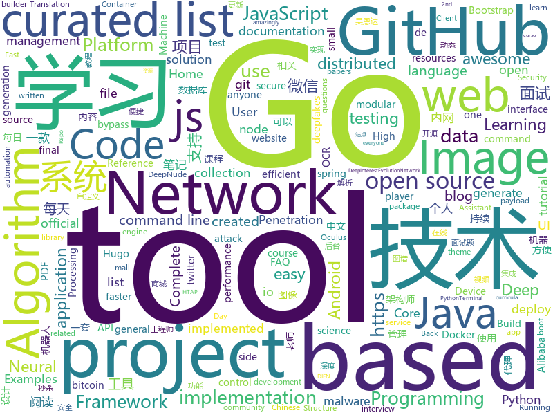

# 2019-07-02
See what the GitHub community is most excited about today.

## python
* [Python](https://github.com/TheAlgorithms/Python)(**428 stars today**): All Algorithms implemented in Python
* [mps-youtube](https://github.com/mps-youtube/mps-youtube)(**116 stars today**): Terminal based YouTube player and downloader
* [DeepNude-an-Image-to-Image-technology](https://github.com/yuanxiaosc/DeepNude-an-Image-to-Image-technology)(**156 stars today**): Research techniques and papers related to image generation and image restoration used by DeepNude. 研究DeepNude使用的图像生成和图像修复相关的技术和论文。
* [Infosec_Reference](https://github.com/rmusser01/Infosec_Reference)(**81 stars today**): An Information Security Reference That Doesn't Suck
* [100-Days-Of-ML-Code](https://github.com/Avik-Jain/100-Days-Of-ML-Code)(**71 stars today**): 100 Days of ML Coding
* [faceswap](https://github.com/deepfakes/faceswap)(**65 stars today**): Non official project based on original /r/Deepfakes thread. Many thanks to him!
* [machine_learning_examples](https://github.com/lazyprogrammer/machine_learning_examples)(**126 stars today**): A collection of machine learning examples and tutorials.
* [ptf](https://github.com/trustedsec/ptf)(**9 stars today**): The Penetration Testers Framework (PTF) is a way for modular support for up-to-date tools.
* [DeepCTR](https://github.com/shenweichen/DeepCTR)(**11 stars today**): Easy-to-use,Modular and Extendible package of deep-learning based CTR models.DeepFM,DeepInterestNetwork(DIN),DeepInterestEvolutionNetwork(DIEN),DeepCrossNetwork(DCN),AttentionalFactorizationMachine(AFM),Neural Factorization Machine(NFM),AutoInt,Deep Session Interest Network(DSIN)
* [home-assistant](https://github.com/home-assistant/home-assistant)(**46 stars today**): 🏡Open source home automation that puts local control and privacy first
* [manim](https://github.com/3b1b/manim)(**65 stars today**): Animation engine for explanatory math videos
* [Real-Time-Voice-Cloning](https://github.com/CorentinJ/Real-Time-Voice-Cloning)(**125 stars today**): Clone a voice in 5 seconds to generate arbitrary speech in real-time
* [byteps](https://github.com/bytedance/byteps)(**110 stars today**): A high performance and general PS framework for distributed training
* [deepfakes_faceswap](https://github.com/joshua-wu/deepfakes_faceswap)(**11 stars today**): from deekfakes' faceswap: https://www.reddit.com/user/deepfakes/
* [faster-rcnn.pytorch](https://github.com/jwyang/faster-rcnn.pytorch)(**13 stars today**): A faster pytorch implementation of faster r-cnn
* [professional-class](https://github.com/NJU-SE-15-share-review/professional-class)(**5 stars today**): 专业课
* [tensorlayer](https://github.com/tensorlayer/tensorlayer)(**11 stars today**): Deep Learning and Reinforcement Learning Library for Scientists
* [ItChat](https://github.com/littlecodersh/ItChat)(**24 stars today**): A complete and graceful API for Wechat. 微信个人号接口、微信机器人及命令行微信，三十行即可自定义个人号机器人。
* [nni](https://github.com/microsoft/nni)(**11 stars today**): An open source AutoML toolkit for neural architecture search and hyper-parameter tuning.
* [mindsdb](https://github.com/mindsdb/mindsdb)(**7 stars today**): Framework to streamline use of neural networks
* [fsociety](https://github.com/Manisso/fsociety)(**5 stars today**): fsociety Hacking Tools Pack – A Penetration Testing Framework
* [matplotlib](https://github.com/matplotlib/matplotlib)(**15 stars today**): matplotlib: plotting with Python
* [prefect](https://github.com/PrefectHQ/prefect)(**5 stars today**): The Prefect Core automation engine
* [facenet](https://github.com/davidsandberg/facenet)(**11 stars today**): Face recognition using Tensorflow
* [bitcoinbook](https://github.com/bitcoinbook/bitcoinbook)(**4 stars today**): Mastering Bitcoin 2nd Edition - Programming the Open Blockchain

## java
* [CS-Notes](https://github.com/CyC2018/CS-Notes)(**195 stars today**): 📚Tech Interview Guide 技术面试必备基础知识、Leetcode 题解、Java、C++、Python、后端面试、操作系统、计算机网络、系统设计
* [MyBookshelf](https://github.com/gedoor/MyBookshelf)(**29 stars today**): 阅读是一款可以自定义来源阅读网络内容的工具，为广大网络文学爱好者提供一种方便、快捷舒适的试读体验。
* [toBeTopJavaer](https://github.com/hollischuang/toBeTopJavaer)(**72 stars today**): To Be Top Javaer - Java工程师成神之路
* [SpringBootLearning](https://github.com/forezp/SpringBootLearning)(**23 stars today**): 《Spring Boot教程》源码
* [ZXBlog](https://github.com/ZXZxin/ZXBlog)(**36 stars today**): 记录各种学习笔记(算法、Java、数据库、并发......)
* [hsweb-framework](https://github.com/hs-web/hsweb-framework)(**21 stars today**): hsweb (haʊs wɛb) 是一个用于快速搭建企业后台管理系统的基础项目,集成一揽子便捷功能如:便捷的通用增删改查,强大的权限管理,动态多数据源,动态表单,在线数据库维护等. 基于 spring-boot,mybaits.
* [TheFatRat](https://github.com/Screetsec/TheFatRat)(**10 stars today**): Thefatrat a massive exploiting tool : Easy tool to generate backdoor and easy tool to post exploitation attack like browser attack,dll . This tool compiles a malware with popular payload and then the compiled malware can be execute on windows, android, mac . The malware that created with this tool also have an ability to bypass most AV software …
* [runelite](https://github.com/runelite/runelite)(**3 stars today**): Open source Old School RuneScape client
* [Mindustry](https://github.com/Anuken/Mindustry)(**3 stars today**): A sandbox tower defense game
* [spring-cloud-alibaba](https://github.com/spring-cloud-incubator/spring-cloud-alibaba)(**31 stars today**): Spring Cloud Alibaba provides a one-stop solution for application development for the distributed solutions of Alibaba middleware.
* [backtobackswe](https://github.com/bephrem1/backtobackswe)(**3 stars today**): Code Examples For Back To Back SWE Lessons
* [miaosha](https://github.com/qiurunze123/miaosha)(**35 stars today**): ⭐⭐⭐⭐秒杀系统设计与实现.互联网工程师进阶与分析🙋🐓
* [HackerRank](https://github.com/RyanFehr/HackerRank)(**4 stars today**): HackerRank solutions in Java/JS/Python/C++/C#
* [mall-learning](https://github.com/macrozheng/mall-learning)(**24 stars today**): mall学习教程，架构、业务、技术要点全方位解析。mall项目（16k+star）是一套电商系统，使用现阶段主流技术实现。 涵盖了SpringBoot2.1.3、MyBatis3.4.6、Elasticsearch6.2.2、RabbitMQ3.7.15、Redis3.2、Mongodb3.2、Mysql5.7等技术，采用Docker容器化部署。
* [tools-ocr](https://github.com/AnyListen/tools-ocr)(**12 stars today**): 树洞 OCR 文字识别（一款跨平台的 OCR 小工具）
* [AndroidAPS](https://github.com/MilosKozak/AndroidAPS)(**3 stars today**): 
* [v9porn](https://github.com/techGay/v9porn)(**17 stars today**): 9*Porn Android 客户端，突破游客每天观看10次视频的限制，还可以下载视频
* [Java](https://github.com/TheAlgorithms/Java)(**49 stars today**): All Algorithms implemented in Java
* [Telegram](https://github.com/DrKLO/Telegram)(**9 stars today**): Telegram for Android source
* [JCSprout](https://github.com/crossoverJie/JCSprout)(**16 stars today**): 👨‍🎓Java Core Sprout : basic, concurrent, algorithm
* [thingsboard](https://github.com/thingsboard/thingsboard)(**119 stars today**): Open-source IoT Platform - Device management, data collection, processing and visualization.
* [-v1.0](https://github.com/chinatso/-v1.0)(**3 stars today**): 冰蝎v1.0
* [DataX](https://github.com/alibaba/DataX)(**17 stars today**): 
* [Essentials](https://github.com/EssentialsX/Essentials)(**1 stars today**): EssentialsX: A maintained fork of Essentials 2.x.
* [learnxinyminutes-docs](https://github.com/adambard/learnxinyminutes-docs)(**5 stars today**): Code documentation written as code! How novel and totally my idea!

## unknown
* [Awesome-Chinese-NLP](https://github.com/crownpku/Awesome-Chinese-NLP)(**70 stars today**): A curated list of resources for Chinese NLP 中文自然语言处理相关资料
* [GitHubDaily](https://github.com/GitHubDaily/GitHubDaily)(**138 stars today**): GitHubDaily 分享内容定期整理与分类。欢迎推荐、自荐项目，让更多人知道你的项目。
* [the-art-of-command-line](https://github.com/jlevy/the-art-of-command-line)(**207 stars today**): Master the command line, in one page
* [architect-awesome](https://github.com/xingshaocheng/architect-awesome)(**124 stars today**): 后端架构师技术图谱
* [awesome-osint](https://github.com/jivoi/awesome-osint)(**57 stars today**): 😱A curated list of amazingly awesome OSINT
* [xray](https://github.com/chaitin/xray)(**26 stars today**): xray 安全评估工具
* [awesome-community-detection](https://github.com/benedekrozemberczki/awesome-community-detection)(**14 stars today**): A curated list of community detection research papers with implementations.
* [gans-awesome-applications](https://github.com/nashory/gans-awesome-applications)(**9 stars today**): Curated list of awesome GAN applications and demo
* [developer-roadmap](https://github.com/kamranahmedse/developer-roadmap)(**58 stars today**): Roadmap to becoming a web developer in 2019
* [Cheatsheet-God](https://github.com/OlivierLaflamme/Cheatsheet-God)(**2 stars today**): Penetration Testing / OSCP Biggest Reference Bank / Cheatsheet
* [Adult](https://github.com/no-Dark/Adult)(**5 stars today**): 
* [3y](https://github.com/ZhongFuCheng3y/3y)(**12 stars today**): 3y原创技术文章导航
* [p1xt-guides](https://github.com/P1xt/p1xt-guides)(**6 stars today**): Programming curricula
* [everyone-can-use-english](https://github.com/xiaolai/everyone-can-use-english)(**12 stars today**): 人人都能用英语
* [awesome-programming-books](https://github.com/royeo/awesome-programming-books)(**19 stars today**): 📚经典技术书籍 PDF 文件，持续更新...
* [open-source-cs](https://github.com/ForrestKnight/open-source-cs)(**9 stars today**): Video discussing this curriculum:
* [pumpkin-book](https://github.com/datawhalechina/pumpkin-book)(**23 stars today**): 《机器学习》（西瓜书）公式推导解析，在线阅读地址：https://datawhalechina.github.io/pumpkin-book
* [awesome-pentest](https://github.com/enaqx/awesome-pentest)(**9 stars today**): A collection of awesome penetration testing resources, tools and other shiny things
* [bugbounty-cheatsheet](https://github.com/EdOverflow/bugbounty-cheatsheet)(**4 stars today**): A list of interesting payloads, tips and tricks for bug bounty hunters.
* [API-Security-Checklist](https://github.com/shieldfy/API-Security-Checklist)(**8 stars today**): Checklist of the most important security countermeasures when designing, testing, and releasing your API
* [android](https://github.com/LineageOS/android)(**5 stars today**): 
* [Projects](https://github.com/karan/Projects)(**7 stars today**): 📃A list of practical projects that anyone can solve in any programming language.
* [You-Dont-Know-JS](https://github.com/getify/You-Dont-Know-JS)(**65 stars today**): A book series on JavaScript. @YDKJS on twitter.
* [Project-Based-Tutorials-in-C](https://github.com/rby90/Project-Based-Tutorials-in-C)(**4 stars today**): A curated list of project-based tutorials in C
* [The-Economist](https://github.com/nailperry-zd/The-Economist)(**6 stars today**): The Economist 经济学人，持续更新

## javascript
* [fe-interview](https://github.com/haizlin/fe-interview)(**405 stars today**): 前端面试每日 3+1，以面试题来驱动学习，提倡每日学习与思考，每天进步一点！每天早上5点纯手工发布面试题（死磕自己，愉悦大家）
* [opencti](https://github.com/OpenCTI-Platform/opencti)(**138 stars today**): Open Cyber Threat Intelligence Platform
* [javascript-algorithms](https://github.com/trekhleb/javascript-algorithms)(**83 stars today**): 📝Algorithms and data structures implemented in JavaScript with explanations and links to further readings
* [complete-javascript-course](https://github.com/jonasschmedtmann/complete-javascript-course)(**10 stars today**): Starter files, final projects and FAQ for my Complete JavaScript course
* [algorithm-visualizer](https://github.com/algorithm-visualizer/algorithm-visualizer)(**128 stars today**): 🎆Interactive Online Platform that Visualizes Algorithms from Code
* [fullstack-tutorial](https://github.com/frank-lam/fullstack-tutorial)(**43 stars today**): 🚀fullstack tutorial 2019，后台技术栈/架构师之路/全栈开发社区，春招/秋招/校招/面试
* [discord.js](https://github.com/discordjs/discord.js)(**21 stars today**): A powerful JavaScript library for interacting with the Discord API
* [yox](https://github.com/yoxjs/yox)(**79 stars today**): A lightweight mvvm framework
* [javascript-algorithms](https://github.com/mgechev/javascript-algorithms)(**45 stars today**): JavaScript implementation of different computer science algorithms.
* [uBlock](https://github.com/gorhill/uBlock)(**16 stars today**): uBlock Origin - An efficient blocker for Chromium and Firefox. Fast and lean.
* [CRMEB](https://github.com/crmeb/CRMEB)(**24 stars today**): 开源微信公众号商城 小程序商城系统，带分销、拼团、秒杀、砍价、优惠券、积分等功能，前后端全部开源，更是一套方便二次开发的框架
* [hiring-without-whiteboards](https://github.com/poteto/hiring-without-whiteboards)(**25 stars today**): ⭐️Companies that don't have a broken hiring process
* [p5.js](https://github.com/processing/p5.js)(**17 stars today**): p5.js is a client-side JS platform that empowers artists, designers, students, and anyone to learn to code and express themselves creatively on the web. It is based on the core principles of Processing. http://twitter.com/p5xjs —
* [website](https://github.com/CodingTrain/website)(**4 stars today**): Coding Train website
* [tabler](https://github.com/tabler/tabler)(**20 stars today**): Tabler is free and open-source HTML Dashboard UI Kit built on Bootstrap 5
* [pix2pix-tensorflow](https://github.com/affinelayer/pix2pix-tensorflow)(**15 stars today**): Tensorflow port of Image-to-Image Translation with Conditional Adversarial Nets https://phillipi.github.io/pix2pix/
* [SideQuest](https://github.com/the-expanse/SideQuest)(**12 stars today**): A open app store for mobile android based VR devices such as the Oculus Go, Oculus Quest or even the Moverio BT 300 ( IKR? )
* [now-examples](https://github.com/zeit/now-examples)(**12 stars today**): Examples of Now projects you can deploy yourself
* [complete-node-bootcamp](https://github.com/jonasschmedtmann/complete-node-bootcamp)(**19 stars today**): Starter files, final projects and FAQ for my Complete Node.js Bootcamp
* [styled-system](https://github.com/styled-system/styled-system)(**12 stars today**): ⬢ Style props for rapid UI development
* [github-hans](https://github.com/52cik/github-hans)(**13 stars today**): [废弃] {官方中文马上就来了} GitHub 汉化插件，GitHub 中文化界面。 (GitHub Translation To Chinese)
* [jsPDF](https://github.com/MrRio/jsPDF)(**27 stars today**): Client-side JavaScript PDF generation for everyone.
* [camp](https://github.com/ipfs/camp)(**15 stars today**): 🏕IPFS Camp is a 3 day hacker retreat designed for the builders of the Distributed Web.
* [git-js](https://github.com/steveukx/git-js)(**29 stars today**): A light weight interface for running git commands in any node.js application.
* [gekko](https://github.com/askmike/gekko)(**14 stars today**): A bitcoin trading bot written in node - https://gekko.wizb.it/

## html
* [Home-Assistant-Config](https://github.com/JamesMcCarthy79/Home-Assistant-Config)(**0 stars today**): Home Assistant Configuration & Documentation for my Smart House.
* [Coursera-ML-AndrewNg-Notes](https://github.com/fengdu78/Coursera-ML-AndrewNg-Notes)(**54 stars today**): 吴恩达老师的机器学习课程个人笔记
* [deeplearning_ai_books](https://github.com/fengdu78/deeplearning_ai_books)(**38 stars today**): deeplearning.ai（吴恩达老师的深度学习课程笔记及资源）
* [hugo-academic](https://github.com/gcushen/hugo-academic)(**6 stars today**): 📝The website builder for Hugo. Build and deploy a beautiful website in minutes!
* [zfaka](https://github.com/zlkbdotnet/zfaka)(**6 stars today**): 免费、安全、稳定、高效的发卡系统，值得拥有!
* [python-getting-started](https://github.com/heroku/python-getting-started)(**2 stars today**): Getting Started with Python on Heroku.
* [Markdown-Resume](https://github.com/CyC2018/Markdown-Resume)(**3 stars today**): ⭐️Markdown 简历模版
* [grao](https://github.com/fakedob/grao)(**9 stars today**): PoC Stara Zagora GRAO Personal data leak
* [portainer](https://github.com/portainer/portainer)(**37 stars today**): Making Docker management easy.
* [Front-end-Developer-Interview-Questions](https://github.com/h5bp/Front-end-Developer-Interview-Questions)(**20 stars today**): A list of helpful front-end related questions you can use to interview potential candidates, test yourself or completely ignore.
* [docs](https://github.com/pingcap/docs)(**1 stars today**): TiDB/TiKV/PD documents.
* [hyperblog](https://github.com/freddier/hyperblog)(**1 stars today**): Un blog increíble para el curso de Git y Github de Platzi
* [hugo-coder](https://github.com/luizdepra/hugo-coder)(**3 stars today**): A minimalist blog theme for hugo.
* [nndl.github.io](https://github.com/nndl/nndl.github.io)(**9 stars today**): 《神经网络与深度学习》 Neural Network and Deep Learning
* [flappy-royale](https://github.com/flappy-royale/flappy-royale)(**2 stars today**): A 99-player last-bird-flapping battle royale
* [pure](https://github.com/pure-css/pure)(**6 stars today**): A set of small, responsive CSS modules that you can use in every web project.
* [skill-map](https://github.com/TeamStuQ/skill-map)(**63 stars today**): 程序员技能图谱
* [datasciencecoursera](https://github.com/mGalarnyk/datasciencecoursera)(**3 stars today**): Data Science Repo and blog for John Hopkins Coursera Courses. Please let me know if you have any questions.
* [Terminus2049.github.io](https://github.com/Terminus2049/Terminus2049.github.io)(**2 stars today**): No more 404
* [startbootstrap-resume](https://github.com/BlackrockDigital/startbootstrap-resume)(**2 stars today**): A Bootstrap 4 resume/CV theme created by Start Bootstrap
* [ionicons](https://github.com/ionic-team/ionicons)(**3 stars today**): The premium icon font for Ionic Framework and web apps everywhere
* [roll20-character-sheets](https://github.com/Roll20/roll20-character-sheets)(**1 stars today**): Character sheet templates created by the community for use in Roll20.
* [web-moderno](https://github.com/cod3rcursos/web-moderno)(**7 stars today**): 
* [home-assistant.io](https://github.com/home-assistant/home-assistant.io)(**0 stars today**): 📘Home Assistant User documentation
* [awesome-competitive-programming](https://github.com/lnishan/awesome-competitive-programming)(**8 stars today**): 💎A curated list of awesome Competitive Programming, Algorithm and Data Structure resources

## go
* [vault](https://github.com/hashicorp/vault)(**16 stars today**): A tool for secrets management, encryption as a service, and privileged access management
* [gocui](https://github.com/jroimartin/gocui)(**109 stars today**): Minimalist Go package aimed at creating Console User Interfaces.
* [ko](https://github.com/google/ko)(**35 stars today**): Build and deploy Go applications on Kubernetes
* [lnd](https://github.com/lightningnetwork/lnd)(**10 stars today**): Lightning Network Daemon⚡️
* [rio](https://github.com/rancher/rio)(**14 stars today**): Kubernetes based MicroPaaS
* [dicom](https://github.com/suyashkumar/dicom)(**20 stars today**): ⚡High Performance DICOM Medical Image Parser in Go.
* [colly](https://github.com/gocolly/colly)(**8 stars today**): Elegant Scraper and Crawler Framework for Golang
* [lazygit](https://github.com/jesseduffield/lazygit)(**69 stars today**): simple terminal UI for git commands
* [nps](https://github.com/cnlh/nps)(**21 stars today**): 一款轻量级、功能强大的内网穿透代理服务器。支持tcp、udp流量转发，支持内网http代理、内网socks5代理，同时支持snappy压缩、站点保护、加密传输、多路复用、header修改等。支持web图形化管理，集成多用户模式。
* [opa](https://github.com/open-policy-agent/opa)(**12 stars today**): An open source, general-purpose policy engine.
* [Amass](https://github.com/OWASP/Amass)(**26 stars today**): In-depth DNS Enumeration and Network Mapping
* [restic](https://github.com/restic/restic)(**13 stars today**): Fast, secure, efficient backup program
* [v2ray-core](https://github.com/v2ray/v2ray-core)(**45 stars today**): A platform for building proxies to bypass network restrictions.
* [compress](https://github.com/klauspost/compress)(**6 stars today**): Optimized compression packages
* [istio](https://github.com/istio/istio)(**25 stars today**): Connect, secure, control, and observe services.
* [ontology](https://github.com/ontio/ontology)(**6 stars today**): Official Go implementation of the Ontology protocol. https://dev-docs.ont.io/#/
* [goquery](https://github.com/PuerkitoBio/goquery)(**11 stars today**): A little like that j-thing, only in Go.
* [GolangTraining](https://github.com/GoesToEleven/GolangTraining)(**15 stars today**): Training for Golang (go language)
* [tinygo](https://github.com/tinygo-org/tinygo)(**12 stars today**): Go compiler for small places. Microcontrollers, WebAssembly, and command-line tools. Based on LLVM.
* [learn-go-with-tests](https://github.com/quii/learn-go-with-tests)(**15 stars today**): Learn Go with test-driven development
* [go-algorand](https://github.com/algorand/go-algorand)(**2 stars today**): Algorand's official implementation in Go.
* [vuls](https://github.com/future-architect/vuls)(**8 stars today**): Agent-less vulnerability scanner for Linux, FreeBSD, Container Image, Running Container, WordPress, Programming language libraries, Network devices
* [gqlgen](https://github.com/99designs/gqlgen)(**6 stars today**): go generate based graphql server library
* [tidb](https://github.com/pingcap/tidb)(**36 stars today**): TiDB is a distributed HTAP database compatible with the MySQL protocol
* [transfer.sh](https://github.com/dutchcoders/transfer.sh)(**13 stars today**): Easy and fast file sharing from the command-line.

## WordCloud

