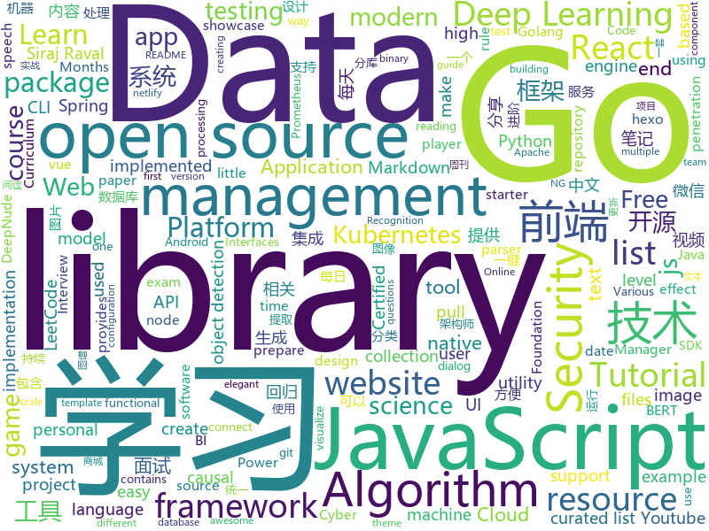

# 2019-07-03
See what the GitHub community is most excited about today.

## python
* [DeepNude-an-Image-to-Image-technology](https://github.com/yuanxiaosc/DeepNude-an-Image-to-Image-technology)(**258 stars today**): Research techniques and papers related to image generation and image restoration used by DeepNude. 研究DeepNude使用的图像生成和图像修复相关的技术和论文。
* [Python](https://github.com/TheAlgorithms/Python)(**311 stars today**): All Algorithms implemented in Python
* [PyRoyale](https://github.com/Igoorx/PyRoyale)(**32 stars today**): A open-source server emulator for Mario Royale browser game.
* [machine_learning_examples](https://github.com/lazyprogrammer/machine_learning_examples)(**85 stars today**): A collection of machine learning examples and tutorials.
* [mmaction](https://github.com/open-mmlab/mmaction)(**25 stars today**): 
* [DeepPavlov](https://github.com/deepmipt/DeepPavlov)(**8 stars today**): An open source library for deep learning end-to-end dialog systems and chatbots.
* [CRAFT-pytorch](https://github.com/clovaai/CRAFT-pytorch)(**14 stars today**): Pytorch implementation of CRAFT text detector
* [pytest](https://github.com/pytest-dev/pytest)(**10 stars today**): The pytest framework makes it easy to write small tests, yet scales to support complex functional testing
* [manim](https://github.com/3b1b/manim)(**47 stars today**): Animation engine for explanatory math videos
* [nlp_xiaojiang](https://github.com/yongzhuo/nlp_xiaojiang)(**16 stars today**): 自然语言处理（nlp），闲聊机器人（chatbot），BERT句向量-相似度（Sentence Similarity），文本分类（Text classify）， 实体提取（ner，bert+bilstm+crf），数据增强（text augment enhance），同义句同义词生成，句子主干提取（mainpart），中文汉语短文本相似度，文本特征工程，keras-http-service调用
* [Infosec_Reference](https://github.com/rmusser01/Infosec_Reference)(**45 stars today**): An Information Security Reference That Doesn't Suck
* [salt](https://github.com/saltstack/salt)(**7 stars today**): Software to automate the management and configuration of any infrastructure or application at scale. Get access to the Salt software package repository here:
* [PySnooper](https://github.com/cool-RR/PySnooper)(**29 stars today**): Never use print for debugging again
* [dowhy](https://github.com/microsoft/dowhy)(**15 stars today**): DoWhy is a Python library that makes it easy to estimate causal effects. DoWhy is based on a unified language for causal inference, combining causal graphical models and potential outcomes frameworks.
* [Real-Time-Voice-Cloning](https://github.com/CorentinJ/Real-Time-Voice-Cloning)(**157 stars today**): Clone a voice in 5 seconds to generate arbitrary speech in real-time
* [trains](https://github.com/allegroai/trains)(**18 stars today**): TRAINS - Auto-Magical Experiment Manager & Version Control for AI
* [100-Days-Of-ML-Code](https://github.com/Avik-Jain/100-Days-Of-ML-Code)(**71 stars today**): 100 Days of ML Coding
* [football](https://github.com/google-research/football)(**13 stars today**): 
* [mps-youtube](https://github.com/mps-youtube/mps-youtube)(**88 stars today**): Terminal based YouTube player and downloader
* [conda](https://github.com/conda/conda)(**6 stars today**): OS-agnostic, system-level binary package manager and ecosystem
* [PayloadsAllTheThings](https://github.com/swisskyrepo/PayloadsAllTheThings)(**20 stars today**): A list of useful payloads and bypass for Web Application Security and Pentest/CTF
* [TensorFlow-Object-Detection-API-Tutorial-Train-Multiple-Objects-Windows-10](https://github.com/EdjeElectronics/TensorFlow-Object-Detection-API-Tutorial-Train-Multiple-Objects-Windows-10)(**9 stars today**): How to train a TensorFlow Object Detection Classifier for multiple object detection on Windows
* [dronekit-python](https://github.com/dronekit/dronekit-python)(**3 stars today**): DroneKit-Python library for communicating with Drones via MAVLink.
* [models](https://github.com/PaddlePaddle/models)(**12 stars today**): Pre-trained and Reproduced Deep Learning Models （『飞桨』官方模型库，包含多种学术前沿和工业场景验证有效的领先模型）
* [ASRT_SpeechRecognition](https://github.com/nl8590687/ASRT_SpeechRecognition)(**14 stars today**): A Deep-Learning-Based Chinese Speech Recognition System 基于深度学习的中文语音识别系统

## java
* [LeetCodeAnimation](https://github.com/MisterBooo/LeetCodeAnimation)(**170 stars today**): Demonstrate all the questions on LeetCode in the form of animation.（用动画的形式呈现解LeetCode题目的思路）
* [thingsboard](https://github.com/thingsboard/thingsboard)(**58 stars today**): Open-source IoT Platform - Device management, data collection, processing and visualization.
* [miaosha](https://github.com/qiurunze123/miaosha)(**122 stars today**): ⭐⭐⭐⭐秒杀系统设计与实现.互联网工程师进阶与分析🙋🐓
* [SpringCloudLearning](https://github.com/forezp/SpringCloudLearning)(**52 stars today**): 《史上最简单的Spring Cloud教程源码》
* [v9porn](https://github.com/techGay/v9porn)(**59 stars today**): 9*Porn Android 客户端，突破游客每天观看10次视频的限制，还可以下载视频
* [server](https://github.com/wildfirechat/server)(**28 stars today**): 全开源即时通讯(IM)系统
* [MyBookshelf](https://github.com/gedoor/MyBookshelf)(**33 stars today**): 阅读是一款可以自定义来源阅读网络内容的工具，为广大网络文学爱好者提供一种方便、快捷舒适的试读体验。
* [tutorials](https://github.com/eugenp/tutorials)(**36 stars today**): The "REST With Spring" Course:
* [Interview-Questions](https://github.com/rishabh115/Interview-Questions)(**7 stars today**): Most comprehensive list📋of interview questions📘of companies scraped from Geeksforgeeks, CareerCup and Glassdoor.
* [ZXBlog](https://github.com/ZXZxin/ZXBlog)(**32 stars today**): 记录各种学习笔记(算法、Java、数据库、并发......)
* [Java](https://github.com/TheAlgorithms/Java)(**44 stars today**): All Algorithms implemented in Java
* [maps](https://github.com/react-native-mapbox-gl/maps)(**3 stars today**): A Mapbox GL react native module for creating custom maps
* [react-native-camera](https://github.com/react-native-community/react-native-camera)(**2 stars today**): A Camera component for React Native. Also supports barcode scanning!
* [reactor-core](https://github.com/reactor/reactor-core)(**4 stars today**): Non-Blocking Reactive Foundation for the JVM
* [resilience4j](https://github.com/resilience4j/resilience4j)(**12 stars today**): Resilience4j is a fault tolerance library designed for Java8 and functional programming
* [aws-doc-sdk-examples](https://github.com/awsdocs/aws-doc-sdk-examples)(**4 stars today**): Code examples used in the official AWS SDK documentation.
* [antlr4](https://github.com/antlr/antlr4)(**7 stars today**): ANTLR (ANother Tool for Language Recognition) is a powerful parser generator for reading, processing, executing, or translating structured text or binary files.
* [spring-framework](https://github.com/spring-projects/spring-framework)(**30 stars today**): Spring Framework
* [spring-boot](https://github.com/spring-projects/spring-boot)(**43 stars today**): Spring Boot
* [Zebra](https://github.com/Meituan-Dianping/Zebra)(**21 stars today**): 美团点评集团统一使用的MySQL数据库访问层的中间件。主要提供对业务开发透明、读写分库、分库分表能力，并提供了端到端SQL监控的集成方案。
* [CS-Notes](https://github.com/CyC2018/CS-Notes)(**187 stars today**): 📚Tech Interview Guide 技术面试必备基础知识、Leetcode 题解、Java、C++、Python、后端面试、操作系统、计算机网络、系统设计
* [rabbitmq-tutorials](https://github.com/rabbitmq/rabbitmq-tutorials)(**11 stars today**): Tutorials for using RabbitMQ in various ways
* [ghidra](https://github.com/NationalSecurityAgency/ghidra)(**17 stars today**): Ghidra is a software reverse engineering (SRE) framework
* [RxTool](https://github.com/vondear/RxTool)(**20 stars today**): Android开发人员不得不收集的工具类集合 | 支付宝支付 | 微信支付（统一下单） | 微信分享 | Zip4j压缩（支持分卷压缩与加密） | 一键集成UCrop选择圆形头像 | 一键集成二维码和条形码的扫描与生成 | 常用Dialog | WebView的封装可播放视频 | 仿斗鱼滑动验证码 | Toast封装 | 震动 | GPS | Location定位 | 图片缩放 | Exif 图片添加地理位置信息（经纬度） | 蛛网等级 | 颜色选择器 | ArcGis | VTPK | 编译运行一下说不定会找到惊喜
* [HikariCP](https://github.com/brettwooldridge/HikariCP)(**20 stars today**): 光 HikariCP・A solid, high-performance, JDBC connection pool at last.

## unknown
* [The-Documentation-Compendium](https://github.com/kylelobo/The-Documentation-Compendium)(**77 stars today**): 📢Various README templates & tips on writing high-quality documentation that people want to read.
* [GitHubDaily](https://github.com/GitHubDaily/GitHubDaily)(**115 stars today**): GitHubDaily 分享内容定期整理与分类。欢迎推荐、自荐项目，让更多人知道你的项目。
* [ds-cheatsheets](https://github.com/FavioVazquez/ds-cheatsheets)(**21 stars today**): List of Data Science Cheatsheets to rule the world
* [one-python-craftsman](https://github.com/piglei/one-python-craftsman)(**46 stars today**): 来自一位 Pythonista 的编程经验分享，内容涵盖编码技巧、最佳实践与思维模式等方面。
* [xray](https://github.com/chaitin/xray)(**11 stars today**): xray 安全评估工具
* [architect-awesome](https://github.com/xingshaocheng/architect-awesome)(**98 stars today**): 后端架构师技术图谱
* [zircon](https://github.com/fuchsia-mirror/zircon)(**2 stars today**): Zircon Kernel, Core Drivers, and Services
* [PENTESTING-BIBLE](https://github.com/blaCCkHatHacEEkr/PENTESTING-BIBLE)(**17 stars today**): Leran Ethical Hacking and penetration testing .hundreds of ethical hacking & penetration testing & red team & cyber security & computer science resources.
* [weekly](https://github.com/aliyunfe/weekly)(**8 stars today**): 《阿里云前端技术周刊》
* [SparkInternals](https://github.com/JerryLead/SparkInternals)(**5 stars today**): Notes talking about the design and implementation of Apache Spark
* [Learn_Machine_Learning_in_3_Months](https://github.com/llSourcell/Learn_Machine_Learning_in_3_Months)(**4 stars today**): This is the code for "Learn Machine Learning in 3 Months" by Siraj Raval on Youtube
* [task-1](https://github.com/yndx-shri-reviewer/task-1)(**1 stars today**): Задание 1. Реализуйте дизайн-систему — ШРИ, Москва, осень 2019
* [Awesome-Chinese-NLP](https://github.com/crownpku/Awesome-Chinese-NLP)(**34 stars today**): A curated list of resources for Chinese NLP 中文自然语言处理相关资料
* [Learn_Deep_Learning_in_6_Weeks](https://github.com/llSourcell/Learn_Deep_Learning_in_6_Weeks)(**5 stars today**): This is the Curriculum for "Learn Deep Learning in 6 Weeks" by Siraj Raval on Youtube
* [deep_learning_object_detection](https://github.com/hoya012/deep_learning_object_detection)(**10 stars today**): A paper list of object detection using deep learning.
* [git-flight-rules](https://github.com/k88hudson/git-flight-rules)(**42 stars today**): Flight rules for git
* [awesome-programming-books](https://github.com/royeo/awesome-programming-books)(**16 stars today**): 📚经典技术书籍 PDF 文件，持续更新...
* [Kubernetes-Certified-Administrator](https://github.com/walidshaari/Kubernetes-Certified-Administrator)(**3 stars today**): Online resources that will help you prepare for taking the CNCF CKA "Kubernetes Certified Administrator" Certification exam. with time, This is not likely the comprehensive up to date list - please make a pull request if there something that should be added here.
* [blog](https://github.com/EDDYCJY/blog)(**20 stars today**): 煎鱼的博客，有点忙。
* [weekly](https://github.com/dt-fe/weekly)(**11 stars today**): 前端精读周刊
* [Analyzing-Visualizing-Data-PowerBI](https://github.com/MicrosoftLearning/Analyzing-Visualizing-Data-PowerBI)(**2 stars today**): This repository contains the lab files and other resources for the free Microsoft course DAT207x: Analyzing and Visualizing Data with Power BI. To learn how to connect, explore, and visualize data with Power BI, sign up for this course on edX.
* [android-architecture](https://github.com/googlesamples/android-architecture)(**16 stars today**): A collection of samples to discuss and showcase different architectural tools and patterns for Android apps.
* [Learn_Data_Science_in_3_Months](https://github.com/llSourcell/Learn_Data_Science_in_3_Months)(**4 stars today**): This is the Curriculum for "Learn Data Science in 3 Months" By Siraj Raval on Youtube
* [awesome-osint](https://github.com/jivoi/awesome-osint)(**55 stars today**): 😱A curated list of amazingly awesome OSINT
* [CKAD-exercises](https://github.com/dgkanatsios/CKAD-exercises)(**6 stars today**): A set of exercises to prepare for Certified Kubernetes Application Developer exam by Cloud Native Computing Foundation

## javascript
* [algorithm-visualizer](https://github.com/algorithm-visualizer/algorithm-visualizer)(**215 stars today**): 🎆Interactive Online Platform that Visualizes Algorithms from Code
* [javascript-algorithms](https://github.com/trekhleb/javascript-algorithms)(**87 stars today**): 📝Algorithms and data structures implemented in JavaScript with explanations and links to further readings
* [opencti](https://github.com/OpenCTI-Platform/opencti)(**120 stars today**): Open Cyber Threat Intelligence Platform
* [fe-interview](https://github.com/haizlin/fe-interview)(**296 stars today**): 前端面试每日 3+1，以面试题来驱动学习，提倡每日学习与思考，每天进步一点！每天早上5点纯手工发布面试题（死磕自己，愉悦大家）
* [urlpages](https://github.com/jstrieb/urlpages)(**91 stars today**): Create and view web pages stored entirely in the URL
* [fullstack-tutorial](https://github.com/frank-lam/fullstack-tutorial)(**29 stars today**): 🚀fullstack tutorial 2019，后台技术栈/架构师之路/全栈开发社区，春招/秋招/校招/面试
* [TypeScript-Vue-Starter](https://github.com/microsoft/TypeScript-Vue-Starter)(**13 stars today**): A starter template for TypeScript and Vue with a detailed README describing how to use the two together.
* [react-material-dashboard](https://github.com/devias-io/react-material-dashboard)(**11 stars today**): React Dashboard made with Material UI’s components, React and of course create-react-app to boost your app development process!
* [javascript-algorithms](https://github.com/mgechev/javascript-algorithms)(**22 stars today**): JavaScript implementation of different computer science algorithms.
* [d2-admin](https://github.com/d2-projects/d2-admin)(**21 stars today**): 🌈An elegant dashboard
* [engine](https://github.com/cocos-creator/engine)(**5 stars today**): Cocos Creator is a complete package of game development tools and workflow, including a game engine, resource management, scene editing, game preview, debug and publish one project to multiple platforms.
* [antSword](https://github.com/AntSwordProject/antSword)(**5 stars today**): AntSword is a cross-platform website management toolkit.
* [pixelmatch](https://github.com/mapbox/pixelmatch)(**12 stars today**): The smallest, simplest and fastest JavaScript pixel-level image comparison library
* [elasticsearch-js](https://github.com/elastic/elasticsearch-js)(**6 stars today**): Official Elasticsearch client library for Node.js
* [Web](https://github.com/qianguyihao/Web)(**19 stars today**): 前端入门和进阶学习笔记，超详细的Web前端学习图文教程。从零开始学前端，做一个Web全栈工程师。持续更新...
* [nuclear](https://github.com/nukeop/nuclear)(**6 stars today**): Desktop music player for streaming from free sources
* [hexo-theme-yilia](https://github.com/litten/hexo-theme-yilia)(**3 stars today**): 一个简洁优雅的hexo主题 A simple and elegant theme for hexo.
* [redux-saga](https://github.com/redux-saga/redux-saga)(**10 stars today**): An alternative side effect model for Redux apps
* [jest](https://github.com/facebook/jest)(**16 stars today**): Delightful JavaScript Testing.
* [react](https://github.com/facebook/react)(**89 stars today**): A declarative, efficient, and flexible JavaScript library for building user interfaces.
* [date-fns](https://github.com/date-fns/date-fns)(**21 stars today**): ⏳Modern JavaScript date utility library⌛️
* [CRMEB](https://github.com/crmeb/CRMEB)(**28 stars today**): 开源微信公众号商城 小程序商城系统，带分销、拼团、秒杀、砍价、优惠券、积分等功能，前后端全部开源，更是一套方便二次开发的框架
* [amazeui](https://github.com/amazeui/amazeui)(**5 stars today**): Amaze UI, a mobile-first and modular front-end framework.
* [marked](https://github.com/markedjs/marked)(**15 stars today**): A markdown parser and compiler. Built for speed.
* [Rocket.Chat](https://github.com/RocketChat/Rocket.Chat)(**20 stars today**): The ultimate Free Open Source Solution for team communications.

## html
* [Coursera-ML-AndrewNg-Notes](https://github.com/fengdu78/Coursera-ML-AndrewNg-Notes)(**74 stars today**): 吴恩达老师的机器学习课程个人笔记
* [skill-map](https://github.com/TeamStuQ/skill-map)(**11 stars today**): 程序员技能图谱
* [hylia](https://github.com/andybelldesign/hylia)(**9 stars today**): Hylia is a lightweight Eleventy starter kit to help you to create your own blog or personal website.
* [flutter-in-action](https://github.com/flutterchina/flutter-in-action)(**36 stars today**): 《Flutter实战》电子书
* [hugo-academic](https://github.com/gcushen/hugo-academic)(**5 stars today**): 📝The website builder for Hugo. Build and deploy a beautiful website in minutes!
* [Markdown-Resume](https://github.com/CyC2018/Markdown-Resume)(**5 stars today**): ⭐️Markdown 简历模版
* [portainer](https://github.com/portainer/portainer)(**23 stars today**): Making Docker management easy.
* [grao](https://github.com/fakedob/grao)(**0 stars today**): PoC Stara Zagora GRAO Personal data leak
* [zh.javascript.info](https://github.com/javascript-tutorial/zh.javascript.info)(**1 stars today**): Modern JavaScript Tutorial
* [mescroll](https://github.com/mescroll/mescroll)(**4 stars today**): 精致的下拉刷新和上拉加载 js框架.支持vue,完美运行于移动端和主流PC浏览器 (JS framework for pull-refresh and pull-up-loading)
* [en.javascript.info](https://github.com/javascript-tutorial/en.javascript.info)(**26 stars today**): Modern JavaScript Tutorial
* [awesome-competitive-programming](https://github.com/lnishan/awesome-competitive-programming)(**2 stars today**): 💎A curated list of awesome Competitive Programming, Algorithm and Data Structure resources
* [sourcegraph](https://github.com/sourcegraph/sourcegraph)(**6 stars today**): Code search and navigation tool (self-hosted)
* [cypress-example-kitchensink](https://github.com/cypress-io/cypress-example-kitchensink)(**0 stars today**): This is an example app used to showcase Cypress.io testing.
* [proposal-nullish-coalescing](https://github.com/tc39/proposal-nullish-coalescing)(**0 stars today**): Nullish coalescing proposal x ?? y
* [js-xss](https://github.com/leizongmin/js-xss)(**2 stars today**): Sanitize untrusted HTML (to prevent XSS) with a configuration specified by a Whitelist
* [github-markdown-css](https://github.com/sindresorhus/github-markdown-css)(**7 stars today**): The minimal amount of CSS to replicate the GitHub Markdown style
* [raytracinginoneweekend](https://github.com/petershirley/raytracinginoneweekend)(**11 stars today**): The source for the ebook Ray Tracing in One Weekend by Peter Shirley. This work is in the public domain.
* [mkdocs-material](https://github.com/squidfunk/mkdocs-material)(**5 stars today**): A Material Design theme for MkDocs
* [Machine-Learning](https://github.com/Jack-Cherish/Machine-Learning)(**8 stars today**): ⚡️机器学习实战（Python3）：kNN、决策树、贝叶斯、逻辑回归、SVM、线性回归、树回归
* [intro.js](https://github.com/usablica/intro.js)(**7 stars today**): A better way for new feature introduction and step-by-step users guide for your website and project.
* [ng-alain](https://github.com/ng-alain/ng-alain)(**7 stars today**): NG-ZORRO admin panel front-end framework (netlify mirror https://netlify.ng-alain.com/)
* [personalsit.es](https://github.com/andybelldesign/personalsit.es)(**0 stars today**): A little directory of people's personal sites
* [Intro-to-Data-APIs-JS](https://github.com/CodingTrain/Intro-to-Data-APIs-JS)(**1 stars today**): Working with Data and APIs in JavaScript
* [TheHive](https://github.com/TheHive-Project/TheHive)(**5 stars today**): TheHive: a Scalable, Open Source and Free Security Incident Response Platform

## go
* [lazydocker](https://github.com/jesseduffield/lazydocker)(**1,074 stars today**): The lazier way to manage everything docker
* [gocui](https://github.com/jroimartin/gocui)(**114 stars today**): Minimalist Go package aimed at creating Console User Interfaces.
* [opa](https://github.com/open-policy-agent/opa)(**10 stars today**): An open source, general-purpose policy engine.
* [Amass](https://github.com/OWASP/Amass)(**35 stars today**): In-depth DNS Enumeration and Network Mapping
* [cloud-on-k8s](https://github.com/elastic/cloud-on-k8s)(**4 stars today**): Elastic Cloud on Kubernetes
* [cobra](https://github.com/spf13/cobra)(**16 stars today**): A Commander for modern Go CLI interactions
* [node_exporter](https://github.com/prometheus/node_exporter)(**11 stars today**): Exporter for machine metrics
* [operator-sdk](https://github.com/operator-framework/operator-sdk)(**4 stars today**): SDK for building Kubernetes applications. Provides high level APIs, useful abstractions, and project scaffolding.
* [learn-go-with-tests](https://github.com/quii/learn-go-with-tests)(**20 stars today**): Learn Go with test-driven development
* [hydra](https://github.com/ory/hydra)(**52 stars today**): OpenID Certified™ OpenID Connect & OAuth2 Server (OP, OpenID Provider) - cloud native, security-first, open source API security for your infrastructure. Written in Go. SDKs for any language.
* [nvm-windows](https://github.com/coreybutler/nvm-windows)(**21 stars today**): A node.js version management utility for Windows. Ironically written in Go.
* [excelize](https://github.com/360EntSecGroup-Skylar/excelize)(**9 stars today**): Golang library for reading and writing Microsoft Excel™ (XLSX) files.
* [dep](https://github.com/golang/dep)(**8 stars today**): Go dependency management tool
* [prometheus](https://github.com/prometheus/prometheus)(**32 stars today**): The Prometheus monitoring system and time series database.
* [kratos](https://github.com/bilibili/kratos)(**21 stars today**): Kratos是bilibili开源的一套Go微服务框架，包含大量微服务相关框架及工具。
* [rook](https://github.com/rook/rook)(**9 stars today**): Storage Orchestration for Kubernetes
* [sarama](https://github.com/Shopify/sarama)(**7 stars today**): Sarama is a Go library for Apache Kafka 0.8, and up.
* [migrate](https://github.com/golang-migrate/migrate)(**8 stars today**): Database migrations. CLI and Golang library.
* [client_golang](https://github.com/prometheus/client_golang)(**5 stars today**): Prometheus instrumentation library for Go applications
* [eksctl](https://github.com/weaveworks/eksctl)(**8 stars today**): a CLI for Amazon EKS
* [goquery](https://github.com/PuerkitoBio/goquery)(**8 stars today**): A little like that j-thing, only in Go.
* [helm](https://github.com/helm/helm)(**20 stars today**): The Kubernetes Package Manager
* [lazygit](https://github.com/jesseduffield/lazygit)(**62 stars today**): simple terminal UI for git commands
* [go-funk](https://github.com/thoas/go-funk)(**23 stars today**): A modern Go utility library which provides helpers (map, find, contains, filter, ...)
* [protobuf](https://github.com/golang/protobuf)(**11 stars today**): Go support for Google's protocol buffers

## WordCloud

