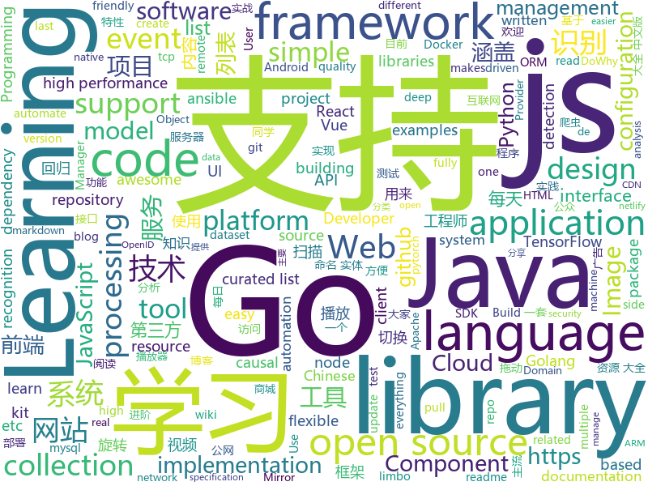

# 2019-07-04
See what the GitHub community is most excited about today.

## python
* [open-deepnude](https://github.com/open-deepnude/open-deepnude)(**169 stars today**): Open source reverse-engineered clone of DeepNude
* [DeepNude-an-Image-to-Image-technology](https://github.com/yuanxiaosc/DeepNude-an-Image-to-Image-technology)(**256 stars today**): DeepNude related Image-to-Image theory and practice research. DeepNude相关的Image-to-Image理论与实践研究。
* [Python](https://github.com/TheAlgorithms/Python)(**209 stars today**): All Algorithms implemented in Python
* [machine_learning_examples](https://github.com/lazyprogrammer/machine_learning_examples)(**77 stars today**): A collection of machine learning examples and tutorials.
* [Vxscan](https://github.com/al0ne/Vxscan)(**35 stars today**): python3写的综合扫描工具，主要用来敏感文件探测(目录扫描与js泄露接口)，WAF/CDN识别，端口扫描，指纹/服务识别，操作系统识别，弱口令探测，POC扫描，SQL注入，绕过CDN，查询旁站等功能，主要用来甲方自测或乙方授权测试，请勿用来搞破坏。
* [salt](https://github.com/saltstack/salt)(**7 stars today**): Software to automate the management and configuration of any infrastructure or application at scale. Get access to the Salt software package repository here:
* [100-Days-Of-ML-Code](https://github.com/Avik-Jain/100-Days-Of-ML-Code)(**31 stars today**): 100 Days of ML Coding
* [Real-Time-Voice-Cloning](https://github.com/CorentinJ/Real-Time-Voice-Cloning)(**144 stars today**): Clone a voice in 5 seconds to generate arbitrary speech in real-time
* [YOLOv3_TensorFlow](https://github.com/wizyoung/YOLOv3_TensorFlow)(**11 stars today**): Complete YOLO v3 TensorFlow implementation. Support training on your own dataset.
* [scikit-learn](https://github.com/scikit-learn/scikit-learn)(**16 stars today**): scikit-learn: machine learning in Python
* [trains](https://github.com/allegroai/trains)(**8 stars today**): TRAINS - Auto-Magical Experiment Manager & Version Control for AI
* [bitcoinbook](https://github.com/bitcoinbook/bitcoinbook)(**6 stars today**): Mastering Bitcoin 2nd Edition - Programming the Open Blockchain
* [DjangoBlog](https://github.com/liangliangyy/DjangoBlog)(**11 stars today**): 🍺基于Django的博客系统
* [EfficientNet-PyTorch](https://github.com/lukemelas/EfficientNet-PyTorch)(**13 stars today**): A PyTorch implementation of EfficientNet
* [zh-NER-TF](https://github.com/Determined22/zh-NER-TF)(**12 stars today**): A very simple BiLSTM-CRF model for Chinese Named Entity Recognition 中文命名实体识别 (TensorFlow)
* [pytorch_geometric](https://github.com/rusty1s/pytorch_geometric)(**17 stars today**): Geometric Deep Learning Extension Library for PyTorch
* [umap](https://github.com/lmcinnes/umap)(**5 stars today**): Uniform Manifold Approximation and Projection
* [argoverse-api](https://github.com/argoai/argoverse-api)(**8 stars today**): Official GitHub repository for Argoverse dataset
* [tensorlayer](https://github.com/tensorlayer/tensorlayer)(**6 stars today**): Deep Learning and Reinforcement Learning Library for Scientists
* [TensorFlow-Object-Detection-API-Tutorial-Train-Multiple-Objects-Windows-10](https://github.com/EdjeElectronics/TensorFlow-Object-Detection-API-Tutorial-Train-Multiple-Objects-Windows-10)(**7 stars today**): How to train a TensorFlow Object Detection Classifier for multiple object detection on Windows
* [spack](https://github.com/spack/spack)(**5 stars today**): A flexible package manager that supports multiple versions, configurations, platforms, and compilers.
* [ChineseBQB](https://github.com/zhaoolee/ChineseBQB)(**18 stars today**): 🇨🇳Chinese sticker pack / 中国表情包大集合
* [dowhy](https://github.com/microsoft/dowhy)(**14 stars today**): DoWhy is a Python library that makes it easy to estimate causal effects. DoWhy is based on a unified language for causal inference, combining causal graphical models and potential outcomes frameworks.
* [ansible](https://github.com/ansible/ansible)(**25 stars today**): Ansible is a radically simple IT automation platform that makes your applications and systems easier to deploy. Avoid writing scripts or custom code to deploy and update your applications — automate in a language that approaches plain English, using SSH, with no agents to install on remote systems. https://docs.ansible.com/ansible/
* [the-gan-zoo](https://github.com/hindupuravinash/the-gan-zoo)(**10 stars today**): A list of all named GANs!

## java
* [thingsboard](https://github.com/thingsboard/thingsboard)(**84 stars today**): Open-source IoT Platform - Device management, data collection, processing and visualization.
* [toBeTopJavaer](https://github.com/hollischuang/toBeTopJavaer)(**161 stars today**): To Be Top Javaer - Java工程师成神之路
* [GSYVideoPlayer](https://github.com/CarGuo/GSYVideoPlayer)(**42 stars today**): 视频播放器（IJKplayer、ExoPlayer、MediaPlayer），HTTPS，支持弹幕，支持滤镜、水印、gif截图，片头广告、中间广告，多个同时播放，支持基本的拖动，声音、亮度调节，支持边播边缓存，支持视频自带rotation的旋转（90,270之类），重力旋转与手动旋转的同步支持，支持列表播放 ，列表全屏动画，视频加载速度，列表小窗口支持拖动，动画效果，调整比例，多分辨率切换，支持切换播放器，进度条小窗口预览，列表切换详情页面无缝播放，rtsp、concat、mpeg。
* [SpringBootLearning](https://github.com/forezp/SpringBootLearning)(**20 stars today**): 《Spring Boot教程》源码
* [mall-learning](https://github.com/macrozheng/mall-learning)(**35 stars today**): mall学习教程，架构、业务、技术要点全方位解析。mall项目（16k+star）是一套电商系统，使用现阶段主流技术实现。 涵盖了SpringBoot2.1.3、MyBatis3.4.6、Elasticsearch6.2.2、RabbitMQ3.7.15、Redis3.2、Mongodb3.2、Mysql5.7等技术，采用Docker容器化部署。
* [ignite](https://github.com/apache/ignite)(**8 stars today**): Mirror of Apache Ignite
* [ZXBlog](https://github.com/ZXZxin/ZXBlog)(**35 stars today**): 记录各种学习笔记(算法、Java、数据库、并发......)
* [MyBookshelf](https://github.com/gedoor/MyBookshelf)(**28 stars today**): 阅读是一款可以自定义来源阅读网络内容的工具，为广大网络文学爱好者提供一种方便、快捷舒适的试读体验。
* [advanced-java](https://github.com/doocs/advanced-java)(**99 stars today**): 😮互联网 Java 工程师进阶知识完全扫盲：涵盖高并发、分布式、高可用、微服务等领域知识，后端同学必看，前端同学也可学习
* [SoloPi](https://github.com/alipay/SoloPi)(**30 stars today**): Soloπ 自动化测试工具
* [netty](https://github.com/netty/netty)(**19 stars today**): Netty project - an event-driven asynchronous network application framework
* [caffeine](https://github.com/ben-manes/caffeine)(**12 stars today**): A high performance caching library for Java 8
* [drools](https://github.com/kiegroup/drools)(**10 stars today**): Drools Expert is the rule engine and Drools Fusion does complex event processing (CEP).
* [lanproxy](https://github.com/ffay/lanproxy)(**26 stars today**): lanproxy是一个将局域网个人电脑、服务器代理到公网的内网穿透工具，目前仅支持tcp流量转发，可支持任何tcp上层协议（访问内网网站、本地支付接口调试、ssh访问、远程桌面...）。目前市面上提供类似服务的有花生壳、TeamView、GoToMyCloud等等，但要使用第三方的公网服务器就必须为第三方付费，并且这些服务都有各种各样的限制，此外，由于数据包会流经第三方，因此对数据安全也是一大隐患。
* [limbo](https://github.com/limboemu/limbo)(**2 stars today**): Limbo is a QEMU-based emulator for Android. It currently supports PC & ARM emulation for Intel x86 and ARM architecture. See our wiki https://github.com/limboemu/limbo/wiki for APK download and Instructions.
* [miaosha](https://github.com/qiurunze123/miaosha)(**91 stars today**): ⭐⭐⭐⭐秒杀系统设计与实现.互联网工程师进阶与分析🙋🐓
* [HikariCP](https://github.com/brettwooldridge/HikariCP)(**23 stars today**): 光 HikariCP・A solid, high-performance, JDBC connection pool at last.
* [tutorials](https://github.com/eugenp/tutorials)(**25 stars today**): The "REST With Spring" Course:
* [sonarqube](https://github.com/SonarSource/sonarqube)(**6 stars today**): Continuous Inspection
* [seata](https://github.com/seata/seata)(**38 stars today**): 🔥Seata is an easy-to-use, high-performance, open source distributed transaction solution.
* [vert.x](https://github.com/eclipse-vertx/vert.x)(**9 stars today**): Vert.x is a tool-kit for building reactive applications on the JVM
* [JavaGuide](https://github.com/Snailclimb/JavaGuide)(**136 stars today**): 【Java学习+面试指南】 一份涵盖大部分Java程序员所需要掌握的核心知识。
* [DependencyCheck](https://github.com/jeremylong/DependencyCheck)(**4 stars today**): OWASP dependency-check is a software composition analysis utility that detects publicly disclosed vulnerabilities in application dependencies.
* [HanLP](https://github.com/hankcs/HanLP)(**20 stars today**): 自然语言处理 中文分词 词性标注 命名实体识别 依存句法分析 新词发现 关键词短语提取 自动摘要 文本分类聚类 拼音简繁
* [aws-doc-sdk-examples](https://github.com/awsdocs/aws-doc-sdk-examples)(**7 stars today**): Code examples used in the official AWS SDK documentation.

## unknown
* [notes](https://github.com/darshanime/notes)(**100 stars today**): detailed notes on computer science topics, in one page
* [Learn-Natural-Language-Processing-Curriculum](https://github.com/llSourcell/Learn-Natural-Language-Processing-Curriculum)(**88 stars today**): This is the curriculum for "Learn Natural Language Processing" by Siraj Raval on Youtube
* [The-Documentation-Compendium](https://github.com/kylelobo/The-Documentation-Compendium)(**73 stars today**): 📢Various README templates & tips on writing high-quality documentation that people want to read.
* [OpenAPI-Specification](https://github.com/OAI/OpenAPI-Specification)(**13 stars today**): The OpenAPI Specification Repository
* [GitHubDaily](https://github.com/GitHubDaily/GitHubDaily)(**54 stars today**): GitHubDaily 分享内容定期整理与分类。欢迎推荐、自荐项目，让更多人知道你的项目。
* [awesome-java-cn](https://github.com/jobbole/awesome-java-cn)(**11 stars today**): Java资源大全中文版，包括开发库、开发工具、网站、博客、微信、微博等，由伯乐在线持续更新。
* [Specs](https://github.com/CocoaPods/Specs)(**5 stars today**): The CocoaPods Master Repo
* [GNNPapers](https://github.com/thunlp/GNNPapers)(**8 stars today**): Must-read papers on graph neural networks (GNN)
* [StudyBook](https://github.com/changwookjun/StudyBook)(**5 stars today**): Study E-Book(ComputerVision DeepLearning MachineLearning Math NLP Python ReinforcementLearning)
* [architect-awesome](https://github.com/xingshaocheng/architect-awesome)(**67 stars today**): 后端架构师技术图谱
* [Step-By-Step](https://github.com/YvetteLau/Step-By-Step)(**4 stars today**): 不积跬步,无以至千里；我是公众号【前端宇宙】作者刘小夕，我将和大家一起一步一个脚印，向前端专家迈进。
* [awesome-mysql-cn](https://github.com/jobbole/awesome-mysql-cn)(**5 stars today**): MySQL 资源大全中文版，分析工具、备份、性能测试、配置、部署、GUI 等
* [awesome-react](https://github.com/enaqx/awesome-react)(**18 stars today**): A collection of awesome things regarding React ecosystem
* [one-python-craftsman](https://github.com/piglei/one-python-craftsman)(**44 stars today**): 来自一位 Pythonista 的编程经验分享，内容涵盖编码技巧、最佳实践与思维模式等方面。
* [xiaozhi](https://github.com/qq449245884/xiaozhi)(**22 stars today**): 
* [OpenCLaP](https://github.com/thunlp/OpenCLaP)(**25 stars today**): Open Chinese Language Pre-trained Model Zoo
* [awesome-ddd](https://github.com/heynickc/awesome-ddd)(**7 stars today**): A curated list of Domain-Driven Design (DDD), Command Query Responsibility Segregation (CQRS), Event Sourcing, and Event Storming resources
* [awesome-design-systems](https://github.com/alexpate/awesome-design-systems)(**6 stars today**): 💅🏻⚒A collection of awesome design systems
* [awesome-point-cloud-analysis](https://github.com/Yochengliu/awesome-point-cloud-analysis)(**11 stars today**): A list of papers and datasets about point cloud analysis (processing)
* [android-developer-roadmap](https://github.com/mobile-roadmap/android-developer-roadmap)(**12 stars today**): Android Developer Roadmap 2019
* [awesome-test-automation](https://github.com/atinfo/awesome-test-automation)(**4 stars today**): A curated list of awesome test automation frameworks, tools, libraries, and software for different programming languages. Sponsored by http://sdclabs.com
* [Awesome-pytorch-list](https://github.com/bharathgs/Awesome-pytorch-list)(**7 stars today**): A comprehensive list of pytorch related content on github,such as different models,implementations,helper libraries,tutorials etc.
* [p1xt-guides](https://github.com/P1xt/p1xt-guides)(**3 stars today**): Programming curricula
* [awesome-deep-text-detection-recognition](https://github.com/hwalsuklee/awesome-deep-text-detection-recognition)(**3 stars today**): A curated list of resources for text detection/recognition (optical character recognition ) with deep learning methods.
* [show-me-the-code](https://github.com/Yixiaohan/show-me-the-code)(**16 stars today**): Python 练习册，每天一个小程序

## javascript
* [evergreen](https://github.com/segmentio/evergreen)(**88 stars today**): 🌲Evergreen React UI Framework by Segment
* [yox](https://github.com/yoxjs/yox)(**38 stars today**): A lightweight mvvm framework
* [node-elm](https://github.com/bailicangdu/node-elm)(**36 stars today**): 基于 node.js + Mongodb 构建的后台系统
* [p5.js](https://github.com/processing/p5.js)(**20 stars today**): p5.js is a client-side JS platform that empowers artists, designers, students, and anyone to learn to code and express themselves creatively on the web. It is based on the core principles of Processing. http://twitter.com/p5xjs —
* [fe-interview](https://github.com/haizlin/fe-interview)(**214 stars today**): 前端面试每日 3+1，以面试题来驱动学习，提倡每日学习与思考，每天进步一点！每天早上5点纯手工发布面试题（死磕自己，愉悦大家）
* [react](https://github.com/facebook/react)(**76 stars today**): A declarative, efficient, and flexible JavaScript library for building user interfaces.
* [vuetify](https://github.com/vuetifyjs/vuetify)(**28 stars today**): 🐉Material Component Framework for Vue.js 2
* [material-ui](https://github.com/mui-org/material-ui)(**45 stars today**): React components for faster and easier web development. Build your own design system, or start with Material Design.
* [lwc-recipes](https://github.com/trailheadapps/lwc-recipes)(**4 stars today**): A collection of easy-to-digest code examples for Lightning Web Components on Salesforce Platform
* [renovate](https://github.com/renovatebot/renovate)(**6 stars today**): Multi-language dependency update automation. Flexible, so you don't need to be.
* [Font-Awesome](https://github.com/FortAwesome/Font-Awesome)(**19 stars today**): The iconic SVG, font, and CSS toolkit
* [opencti](https://github.com/OpenCTI-Platform/opencti)(**48 stars today**): Open Cyber Threat Intelligence Platform
* [svelte-tic-tac-toe](https://github.com/jesseskinner/svelte-tic-tac-toe)(**7 stars today**): Tic Tac Toe game made with Svelte
* [react-router](https://github.com/ReactTraining/react-router)(**18 stars today**): Declarative routing for React
* [Leaflet](https://github.com/Leaflet/Leaflet)(**13 stars today**): 🍃JavaScript library for mobile-friendly interactive maps
* [learnVue](https://github.com/answershuto/learnVue)(**25 stars today**): Vue.js 源码解析
* [slick](https://github.com/kenwheeler/slick)(**11 stars today**): the last carousel you'll ever need
* [CRMEB](https://github.com/crmeb/CRMEB)(**31 stars today**): 开源微信公众号商城 小程序商城系统，带分销、拼团、秒杀、砍价、优惠券、积分等功能，前后端全部开源，更是一套方便二次开发的框架
* [remote-jobs](https://github.com/remoteintech/remote-jobs)(**18 stars today**): A list of semi to fully remote-friendly companies in tech.
* [spectrum](https://github.com/withspectrum/spectrum)(**14 stars today**): Simple, powerful online communities.
* [vuejs.org](https://github.com/vuejs/vuejs.org)(**8 stars today**): 📄The official documentation site for Vue.js.
* [tabler](https://github.com/tabler/tabler)(**18 stars today**): Tabler is free and open-source HTML Dashboard UI Kit built on Bootstrap 5
* [template](https://github.com/sveltejs/template)(**5 stars today**): Template for building basic applications with Svelte
* [Awesome-Design-Tools](https://github.com/LisaDziuba/Awesome-Design-Tools)(**15 stars today**): The best design tools for everything👉
* [serverless-offline](https://github.com/dherault/serverless-offline)(**26 stars today**): Emulate AWS λ and API Gateway locally when developing your Serverless project

## html
* [hylia](https://github.com/andybelldesign/hylia)(**89 stars today**): Hylia is a lightweight Eleventy starter kit to help you to create your own blog or personal website.
* [flutter-in-action](https://github.com/flutterchina/flutter-in-action)(**28 stars today**): 《Flutter实战》电子书
* [raytracinginoneweekend](https://github.com/petershirley/raytracinginoneweekend)(**8 stars today**): The source for the ebook Ray Tracing in One Weekend by Peter Shirley. This work is in the public domain.
* [mescroll](https://github.com/mescroll/mescroll)(**7 stars today**): 精致的下拉刷新和上拉加载 js框架.支持vue,完美运行于移动端和主流PC浏览器 (JS framework for pull-refresh and pull-up-loading)
* [sample-code](https://github.com/appium-boneyard/sample-code)(**2 stars today**): appium sample code (dotnet, java, node, perl, php, python, ruby, etc.)
* [Machine-Learning](https://github.com/Jack-Cherish/Machine-Learning)(**5 stars today**): ⚡️机器学习实战（Python3）：kNN、决策树、贝叶斯、逻辑回归、SVM、线性回归、树回归
* [webdevbootcamp](https://github.com/nax3t/webdevbootcamp)(**5 stars today**): All source code for back-end projects from the Web Developer Bootcamp
* [sourcegraph](https://github.com/sourcegraph/sourcegraph)(**4 stars today**): Code search and navigation tool (self-hosted)
* [istio.io](https://github.com/istio/istio.io)(**1 stars today**): Source for the istio.io site
* [hyperblog](https://github.com/freddier/hyperblog)(**6 stars today**): Un blog increíble para el curso de Git y Github de Platzi
* [excalibur](https://github.com/camelot-dev/excalibur)(**1 stars today**): Excalibur: A web interface to extract tabular data from PDFs
* [learning-area](https://github.com/mdn/learning-area)(**5 stars today**): Github repo for the MDN Learning Area.
* [wpt](https://github.com/web-platform-tests/wpt)(**2 stars today**): Test suites for Web platform specs — including WHATWG, W3C, and others
* [book](https://github.com/PaddlePaddle/book)(**7 stars today**): Deep Learning 101 with PaddlePaddle （『飞桨』深度学习框架入门教程）
* [mxgraph](https://github.com/jgraph/mxgraph)(**9 stars today**): mxGraph is a fully client side JavaScript diagramming library
* [ng-alain](https://github.com/ng-alain/ng-alain)(**2 stars today**): NG-ZORRO admin panel front-end framework (netlify mirror https://netlify.ng-alain.com/)
* [turndown](https://github.com/domchristie/turndown)(**6 stars today**): 🛏An HTML to Markdown converter written in JavaScript
* [en.javascript.info](https://github.com/javascript-tutorial/en.javascript.info)(**16 stars today**): Modern JavaScript Tutorial
* [webcomponents](https://github.com/w3c/webcomponents)(**1 stars today**): Web Components specifications
* [Anti-Anti-Spider](https://github.com/luyishisi/Anti-Anti-Spider)(**5 stars today**): 越来越多的网站具有反爬虫特性，有的用图片隐藏关键数据，有的使用反人类的验证码，建立反反爬虫的代码仓库，通过与不同特性的网站做斗争（无恶意）提高技术。（欢迎提交难以采集的网站）（因工作原因，项目暂停）
* [electron-api-demos](https://github.com/electron/electron-api-demos)(**7 stars today**): Explore the Electron APIs
* [ssl-config-generator](https://github.com/mozilla/ssl-config-generator)(**3 stars today**): Mozilla SSL Configuration Generator
* [EIPs](https://github.com/ethereum/EIPs)(**1 stars today**): The Ethereum Improvement Proposal repository
* [repo-badges](https://github.com/dwyl/repo-badges)(**2 stars today**): ⭐️Use repo badges (build passing, coverage, etc) in your readme/markdown file to signal code quality in a project.
* [styleguide](https://github.com/google/styleguide)(**14 stars today**): Style guides for Google-originated open-source projects

## go
* [hydra](https://github.com/ory/hydra)(**69 stars today**): OpenID Certified™ OpenID Connect & OAuth2 Server (OP, OpenID Provider) - cloud native, security-first, open source API security for your infrastructure. Written in Go. SDKs for any language.
* [gocui](https://github.com/jroimartin/gocui)(**128 stars today**): Minimalist Go package aimed at creating Console User Interfaces.
* [lazydocker](https://github.com/jesseduffield/lazydocker)(**944 stars today**): The lazier way to manage everything docker
* [sarama](https://github.com/Shopify/sarama)(**12 stars today**): Sarama is a Go library for Apache Kafka 0.8, and up.
* [cert-manager](https://github.com/jetstack/cert-manager)(**10 stars today**): Automatically provision and manage TLS certificates in Kubernetes
* [gorm](https://github.com/jinzhu/gorm)(**29 stars today**): The fantastic ORM library for Golang, aims to be developer friendly
* [btcd](https://github.com/btcsuite/btcd)(**8 stars today**): An alternative full node bitcoin implementation written in Go (golang)
* [influxdb](https://github.com/influxdata/influxdb)(**16 stars today**): Scalable datastore for metrics, events, and real-time analytics
* [GolangTraining](https://github.com/GoesToEleven/GolangTraining)(**16 stars today**): Training for Golang (go language)
* [lazygit](https://github.com/jesseduffield/lazygit)(**58 stars today**): simple terminal UI for git commands
* [jaeger-client-go](https://github.com/jaegertracing/jaeger-client-go)(**2 stars today**): Jaeger Bindings for Go OpenTracing API.
* [rancher](https://github.com/rancher/rancher)(**15 stars today**): Complete container management platform
* [terraform-provider-azurerm](https://github.com/terraform-providers/terraform-provider-azurerm)(**9 stars today**): Terraform provider for Azure Resource Manager
* [viper](https://github.com/spf13/viper)(**19 stars today**): Go configuration with fangs
* [gofpdf](https://github.com/jung-kurt/gofpdf)(**7 stars today**): A PDF document generator with high level support for text, drawing and images
* [aws-alb-ingress-controller](https://github.com/kubernetes-sigs/aws-alb-ingress-controller)(**6 stars today**): AWS ALB Ingress Controller for Kubernetes
* [logrus](https://github.com/sirupsen/logrus)(**11 stars today**): Structured, pluggable logging for Go.
* [libpod](https://github.com/containers/libpod)(**3 stars today**): libpod is a library used to create container pods. Home of Podman.
* [xorm](https://github.com/go-xorm/xorm)(**10 stars today**): Simple and Powerful ORM for Go, support mysql,postgres,tidb,sqlite3,mssql,oracle
* [google-cloud-go](https://github.com/googleapis/google-cloud-go)(**3 stars today**): Google Cloud Client Libraries for Go.
* [testify](https://github.com/stretchr/testify)(**16 stars today**): A toolkit with common assertions and mocks that plays nicely with the standard library
* [dep](https://github.com/golang/dep)(**5 stars today**): Go dependency management tool
* [dive](https://github.com/wagoodman/dive)(**13 stars today**): A tool for exploring each layer in a docker image
* [opa](https://github.com/open-policy-agent/opa)(**10 stars today**): An open source, general-purpose policy engine.
* [traefik](https://github.com/containous/traefik)(**17 stars today**): The Cloud Native Edge Router

## WordCloud

