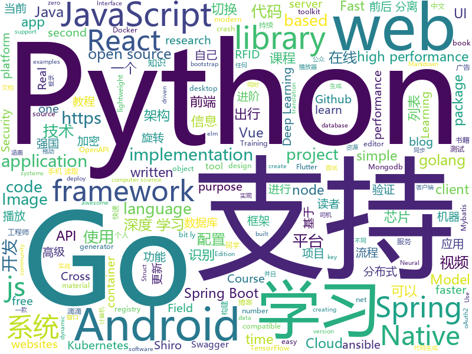

# 2019-07-06
See what the GitHub community is most excited about today.

## python
* [open-deepnude](https://github.com/open-deepnude/open-deepnude)(**228 stars today**): Open source reverse-engineered clone of DeepNude
* [dlrm](https://github.com/facebookresearch/dlrm)(**157 stars today**): An implementation of a deep learning recommendation model (DLRM)
* [AiLearning](https://github.com/apachecn/AiLearning)(**92 stars today**): AiLearning: 机器学习 - MachineLearning - ML、深度学习 - DeepLearning - DL、自然语言处理 NLP
* [DeepNude-an-Image-to-Image-technology](https://github.com/yuanxiaosc/DeepNude-an-Image-to-Image-technology)(**99 stars today**): DeepNude related Image-to-Image theory and practice research. DeepNude相关的Image-to-Image理论与实践研究。
* [marshmallow](https://github.com/marshmallow-code/marshmallow)(**30 stars today**): A lightweight library for converting complex objects to and from simple Python datatypes.
* [Real-Time-Voice-Cloning](https://github.com/CorentinJ/Real-Time-Voice-Cloning)(**100 stars today**): Clone a voice in 5 seconds to generate arbitrary speech in real-time
* [scikit-learn](https://github.com/scikit-learn/scikit-learn)(**17 stars today**): scikit-learn: machine learning in Python
* [USTC-Course](https://github.com/USTC-Resource/USTC-Course)(**28 stars today**): ❤️中国科学技术大学课程资源
* [tensorpack](https://github.com/tensorpack/tensorpack)(**9 stars today**): A Neural Net Training Interface on TensorFlow, with focus on speed + flexibility
* [python](https://github.com/kubernetes-client/python)(**9 stars today**): Official Python client library for kubernetes
* [TrumpScript](https://github.com/samshadwell/TrumpScript)(**2 stars today**): Make Python great again
* [chinese-poetry](https://github.com/chinese-poetry/chinese-poetry)(**12 stars today**): 最全中华古诗词数据库, 唐宋两朝近一万四千古诗人, 接近5.5万首唐诗加26万宋诗. 两宋时期1564位词人，21050首词。
* [proxy_pool](https://github.com/jhao104/proxy_pool)(**17 stars today**): Python爬虫代理IP池(proxy pool)
* [Python](https://github.com/TwoWater/Python)(**6 stars today**): Python 入门教程：【草根学 Python （基于Python3.6）】
* [models](https://github.com/tensorflow/models)(**39 stars today**): Models and examples built with TensorFlow
* [Panda-Learning](https://github.com/Alivon/Panda-Learning)(**7 stars today**): 学习强国 xuexiqiangguo 全网最好用学习强国助手：Panda_Learning 萌萌的熊猫帮你搞定学习强国
* [Python-100-Days](https://github.com/ZiniuLu/Python-100-Days)(**12 stars today**): 出处：https://github.com/jackfrued/Python-100-Days.git
* [examples](https://github.com/pyqt/examples)(**64 stars today**): PyQt examples show you how to create a desktop app with Python and Qt. Start with "Hello World" or browse the official PyQt demos.
* [ansible](https://github.com/ansible/ansible)(**38 stars today**): Ansible is a radically simple IT automation platform that makes your applications and systems easier to deploy. Avoid writing scripts or custom code to deploy and update your applications — automate in a language that approaches plain English, using SSH, with no agents to install on remote systems. https://docs.ansible.com/ansible/
* [compose](https://github.com/docker/compose)(**12 stars today**): Define and run multi-container applications with Docker
* [Detectron](https://github.com/facebookresearch/Detectron)(**9 stars today**): FAIR's research platform for object detection research, implementing popular algorithms like Mask R-CNN and RetinaNet.
* [CornerNet-Lite](https://github.com/princeton-vl/CornerNet-Lite)(**2 stars today**): 
* [gpt-2](https://github.com/openai/gpt-2)(**19 stars today**): Code for the paper "Language Models are Unsupervised Multitask Learners"
* [efficientnet](https://github.com/qubvel/efficientnet)(**1 stars today**): Implementation of EfficientNet model. Keras.
* [OpenCV-Face-Recognition](https://github.com/Mjrovai/OpenCV-Face-Recognition)(**5 stars today**): Real-time face recognition project with OpenCV and Python

## java
* [GSYVideoPlayer](https://github.com/CarGuo/GSYVideoPlayer)(**60 stars today**): 视频播放器（IJKplayer、ExoPlayer、MediaPlayer），HTTPS，支持弹幕，支持滤镜、水印、gif截图，片头广告、中间广告，多个同时播放，支持基本的拖动，声音、亮度调节，支持边播边缓存，支持视频自带rotation的旋转（90,270之类），重力旋转与手动旋转的同步支持，支持列表播放 ，列表全屏动画，视频加载速度，列表小窗口支持拖动，动画效果，调整比例，多分辨率切换，支持切换播放器，进度条小窗口预览，列表切换详情页面无缝播放，rtsp、concat、mpeg。
* [Qigsaw](https://github.com/iqiyi/Qigsaw)(**30 stars today**): 🔥🔥Qigsaw is a dynamic modularization library which is based on Android App Bundles. It supports dynamic delivery for split APKs without reinstalling the base one.
* [mall-learning](https://github.com/macrozheng/mall-learning)(**53 stars today**): mall学习教程，架构、业务、技术要点全方位解析。mall项目（16k+star）是一套电商系统，使用现阶段主流技术实现。 涵盖了SpringBoot2.1.3、MyBatis3.4.6、Elasticsearch6.2.2、RabbitMQ3.7.15、Redis3.2、Mongodb3.2、Mysql5.7等技术，采用Docker容器化部署。
* [piggymetrics](https://github.com/sqshq/piggymetrics)(**34 stars today**): Microservice Architecture with Spring Boot, Spring Cloud and Docker
* [seata](https://github.com/seata/seata)(**19 stars today**): 🔥Seata is an easy-to-use, high-performance, open source distributed transaction solution.
* [paascloud-master](https://github.com/paascloud/paascloud-master)(**25 stars today**): spring cloud + vue + oAuth2.0全家桶实战，前后端分离模拟商城，完整的购物流程、后端运营平台，可以实现快速搭建企业级微服务项目。支持微信登录等三方登录。
* [react-native-share](https://github.com/react-native-community/react-native-share)(**12 stars today**): Social share, sending simple data to other apps.
* [jeecg-boot](https://github.com/zhangdaiscott/jeecg-boot)(**46 stars today**): 一款基于代码生成器的JAVA快速开发平台！全新架构前后端分离：SpringBoot 2.x，Ant Design&Vue，Mybatis，Shiro，JWT。强大的代码生成器让前后端代码一键生成，无需写任何代码，绝对是全栈开发福音！！ JeecgBoot的宗旨是提高UI能力的同时,降低前后分离的开发成本，JeecgBoot还独创在线开发模式，No代码概念，一系列在线智能开发：在线配置表单、在线配置报表、在线设计流程等等。
* [halo](https://github.com/halo-dev/halo)(**49 stars today**): ✍ Halo 一款现代化的个人独立博客系统
* [lottie-android](https://github.com/airbnb/lottie-android)(**10 stars today**): Render After Effects animations natively on Android and iOS, Web, and React Native
* [server](https://github.com/wildfirechat/server)(**16 stars today**): 全开源即时通讯(IM)系统
* [butterknife](https://github.com/JakeWharton/butterknife)(**8 stars today**): Bind Android views and callbacks to fields and methods.
* [toBeTopJavaer](https://github.com/hollischuang/toBeTopJavaer)(**76 stars today**): To Be Top Javaer - Java工程师成神之路
* [otter](https://github.com/alibaba/otter)(**13 stars today**): 阿里巴巴分布式数据库同步系统(解决中美异地机房)
* [SpringAll](https://github.com/wuyouzhuguli/SpringAll)(**84 stars today**): 循序渐进，学习Spring Boot、Spring Boot & Shiro、Spring Cloud、Spring Security & Spring Security OAuth2，博客Spring系列源码
* [mybatis-plus](https://github.com/baomidou/mybatis-plus)(**15 stars today**): An powerful enhanced toolkit of MyBatis for simplify development
* [DiDiCallCar](https://github.com/18601949127/DiDiCallCar)(**29 stars today**): 这是我自己做的一个类似滴滴打车的Android出行项目，主要针对滴滴等出行平台一直饱受质疑的“人车不符”问题，以及当前越发火热的或计划和出海战略，给出行项目增加了下面几个功能： 1. RFID识别验证功能：在司机证件或者车内识别硬件嵌入RFID识别芯片，乘客使用手机读取到芯片信息，并且通过网络发送到出行平台数据库进行验证（我用JNI加了一个C语言的MD5加密算法对识别到的信息进行了加密）。如果不是合规的“人”或“车”，则不能完成订单并向平台或监管单位汇报当前位置。（为了方便读者测试，可以使用手机读取任何一个加密或非加密RFID芯片，比如银行卡、公交卡等，我在代码中的验证前阶段把芯片信息都换成我自己的司机信息，确保读者测试时可以收到服务器的回复） 2. 海外版功能：点击切换当前语言。 3…
* [v9porn](https://github.com/techGay/v9porn)(**67 stars today**): 9*Porn Android 客户端，突破游客每天观看10次视频的限制，还可以下载视频
* [DataX](https://github.com/alibaba/DataX)(**7 stars today**): 
* [jvm-sandbox](https://github.com/alibaba/jvm-sandbox)(**10 stars today**): Real - time non-invasive AOP framework container based on JVM
* [tutorials](https://github.com/eugenp/tutorials)(**26 stars today**): The "REST With Spring" Course:
* [Java-WebSocket](https://github.com/TooTallNate/Java-WebSocket)(**6 stars today**): A barebones WebSocket client and server implementation written in 100% Java.
* [advanced-java](https://github.com/doocs/advanced-java)(**73 stars today**): 😮互联网 Java 工程师进阶知识完全扫盲：涵盖高并发、分布式、高可用、微服务等领域知识，后端同学必看，前端同学也可学习
* [apollo](https://github.com/ctripcorp/apollo)(**17 stars today**): Apollo（阿波罗）是携程框架部门研发的分布式配置中心，能够集中化管理应用不同环境、不同集群的配置，配置修改后能够实时推送到应用端，并且具备规范的权限、流程治理等特性，适用于微服务配置管理场景。
* [retrofit](https://github.com/square/retrofit)(**5 stars today**): Type-safe HTTP client for Android and Java by Square, Inc.

## unknown
* [learn-regex](https://github.com/ziishaned/learn-regex)(**253 stars today**): Learn regex the easy way
* [DeepLearning-500-questions](https://github.com/scutan90/DeepLearning-500-questions)(**129 stars today**): 深度学习500问，以问答形式对常用的概率知识、线性代数、机器学习、深度学习、计算机视觉等热点问题进行阐述，以帮助自己及有需要的读者。 全书分为18个章节，50余万字。由于水平有限，书中不妥之处恳请广大读者批评指正。 未完待续............ 如有意合作，联系scutjy2015@163.com 版权所有，违权必究 Tan 2018.06
* [notes](https://github.com/darshanime/notes)(**120 stars today**): detailed notes on computer science topics, in one page
* [blog](https://github.com/yygmind/blog)(**15 stars today**): 我是木易杨，公众号「高级前端进阶」作者，跟着我每周重点攻克一个前端面试重难点。接下来让我带你走进高级前端的世界，在进阶的路上，共勉！
* [open-source-cs](https://github.com/ForrestKnight/open-source-cs)(**28 stars today**): Video discussing this curriculum:
* [free-programming-books-zh_CN](https://github.com/justjavac/free-programming-books-zh_CN)(**31 stars today**): 📚免费的计算机编程类中文书籍，欢迎投稿
* [bxaq](https://github.com/motherboardgithub/bxaq)(**13 stars today**): 
* [SJTU-Courses](https://github.com/CoolPhilChen/SJTU-Courses)(**24 stars today**): 上海交通大学课程资料分享
* [The-Flask-Mega-Tutorial-zh](https://github.com/luhuisicnu/The-Flask-Mega-Tutorial-zh)(**8 stars today**): 翻译自Miguel Grinberg的blog https://blog.miguelgrinberg.com 的2017年新版The Flask Mega-Tutorial教程
* [BERT_Paper_Chinese_Translation](https://github.com/yuanxiaosc/BERT_Paper_Chinese_Translation)(**7 stars today**): BERT: Pre-training of Deep Bidirectional Transformers for Language Understanding 论文的中文翻译 Chinese Translation!
* [Specs](https://github.com/CocoaPods/Specs)(**0 stars today**): The CocoaPods Master Repo
* [IntelliJ-IDEA-Tutorial](https://github.com/judasn/IntelliJ-IDEA-Tutorial)(**18 stars today**): IntelliJ IDEA 简体中文专题教程
* [OpenAPI-Specification](https://github.com/OAI/OpenAPI-Specification)(**7 stars today**): The OpenAPI Specification Repository
* [mqtt.github.io](https://github.com/mqtt/mqtt.github.io)(**4 stars today**): website
* [AndroidInterView](https://github.com/interviewandroid/AndroidInterView)(**5 stars today**): Android面试2019年最新版（每日更新），音视频，Android高级，性能优化，算法，Flutter技术，FFmpeg OppenGl，资源混淆,插件化，组件化，OkHttp，Rxjava,架构师，Android架构
* [You-Dont-Know-JS](https://github.com/getify/You-Dont-Know-JS)(**53 stars today**): A book series on JavaScript. @YDKJS on twitter.
* [awesome-macOS](https://github.com/iCHAIT/awesome-macOS)(**5 stars today**):  A curated list of awesome applications, softwares, tools and shiny things for macOS.
* [awesome-programming-books](https://github.com/royeo/awesome-programming-books)(**4 stars today**): 📚经典技术书籍 PDF 文件，持续更新...
* [My-blog](https://github.com/markyun/My-blog)(**3 stars today**): 马云云在Github的学习片段 https://www.yuque.com/markyun
* [autoware](https://github.com/autowarefoundation/autoware)(**3 stars today**): Open-source software for self-driving vehicles
* [you-dont-know-js-ru](https://github.com/azat-io/you-dont-know-js-ru)(**3 stars today**): 📚Russian translation of "You Don't Know JS" book series
* [chromium](https://github.com/jjqqkk/chromium)(**7 stars today**): Chromium browser with SSL VPN. Use this browser to unblock websites.
* [NightPi](https://github.com/Sekhan/NightPi)(**1 stars today**): An all-in-one briefcase for pentesting, OSINT and radio exploration
* [nlp-competitions-list-review](https://github.com/zhpmatrix/nlp-competitions-list-review)(**19 stars today**): 复盘所有NLP比赛的TOP方案，只关注NLP比赛，持续更新中！
* [Best-websites-a-programmer-should-visit](https://github.com/sdmg15/Best-websites-a-programmer-should-visit)(**9 stars today**): 🔗Some useful websites for programmers.

## javascript
* [material-shell](https://github.com/PapyElGringo/material-shell)(**71 stars today**): New shell for Gnome following the Material-design guidelines. Proposing a performant and simple opinionated mouse/keyboard workflow to increase daily productivity and comfort
* [cli](https://github.com/react-native-community/cli)(**22 stars today**): React Native command line tools
* [AnotherRedisDesktopManager](https://github.com/qishibo/AnotherRedisDesktopManager)(**23 stars today**): 🚀🚀🚀A faster, better and more stable redis desktop manager, compatible with Linux, windows, mac. What's more, it won't crash when loading a large number of keys.
* [AwesomeXSS](https://github.com/s0md3v/AwesomeXSS)(**24 stars today**): Awesome XSS stuff
* [openlayers](https://github.com/openlayers/openlayers)(**15 stars today**): OpenLayers
* [jsencrypt](https://github.com/travist/jsencrypt)(**7 stars today**): A Javascript library to perform OpenSSL RSA Encryption, Decryption, and Key Generation.
* [blockly](https://github.com/google/blockly)(**13 stars today**): The web-based visual programming editor.
* [js-xlsx](https://github.com/SheetJS/js-xlsx)(**21 stars today**): 📗SheetJS Community Edition -- Spreadsheet Toolkit
* [nuxt.js](https://github.com/nuxt/nuxt.js)(**21 stars today**): The Vue.js Framework
* [lodash](https://github.com/lodash/lodash)(**22 stars today**): A modern JavaScript utility library delivering modularity, performance, & extras.
* [material-table](https://github.com/mbrn/material-table)(**9 stars today**): Datatable for React based on material-ui's table with additional features
* [jimp](https://github.com/oliver-moran/jimp)(**66 stars today**): An image processing library written entirely in JavaScript for Node, with zero external or native dependencies.
* [iscroll](https://github.com/cubiq/iscroll)(**8 stars today**): Smooth scrolling for the web
* [react-select](https://github.com/JedWatson/react-select)(**8 stars today**): The Select Component for React.js
* [nodeclub](https://github.com/cnodejs/nodeclub)(**2 stars today**): 🐤Nodeclub 是使用 Node.js 和 MongoDB 开发的社区系统
* [entropic](https://github.com/entropic-dev/entropic)(**25 stars today**): 🦝📦a package registry for anything, but mostly javascript 🦝 🦝 🦝
* [gatsby](https://github.com/gatsbyjs/gatsby)(**22 stars today**): Build blazing fast, modern apps and websites with React
* [mobx](https://github.com/mobxjs/mobx)(**14 stars today**): Simple, scalable state management.
* [node-elm](https://github.com/bailicangdu/node-elm)(**13 stars today**): 基于 node.js + Mongodb 构建的后台系统
* [taro](https://github.com/NervJS/taro)(**21 stars today**): 多端统一开发框架，支持用 React 的开发方式编写一次代码，生成能运行在微信/百度/支付宝/字节跳动小程序、H5、React Native 等的应用。 https://taro.jd.com/
* [vue](https://github.com/vuejs/vue)(**79 stars today**): 🖖Vue.js is a progressive, incrementally-adoptable JavaScript framework for building UI on the web.
* [generator-jhipster](https://github.com/jhipster/generator-jhipster)(**4 stars today**): Open Source application generator for creating Spring Boot + Angular/React projects in seconds!
* [tui.editor](https://github.com/nhn/tui.editor)(**14 stars today**): 🍞📝Markdown WYSIWYG Editor. GFM Standard + Chart & UML Extensible.
* [intl-tel-input](https://github.com/jackocnr/intl-tel-input)(**5 stars today**): A JavaScript plugin for entering and validating international telephone numbers
* [dva](https://github.com/dvajs/dva)(**10 stars today**): 🌱React and redux based, lightweight and elm-style framework. (Inspired by elm and choo)

## html
* [book](https://github.com/PaddlePaddle/book)(**21 stars today**): Deep Learning 101 with PaddlePaddle （『飞桨』深度学习框架入门教程）
* [Coursera-ML-AndrewNg-Notes](https://github.com/fengdu78/Coursera-ML-AndrewNg-Notes)(**84 stars today**): 吴恩达老师的机器学习课程个人笔记
* [shiro-example](https://github.com/zhangkaitao/shiro-example)(**4 stars today**): 跟我学Shiro（我的公众号：kaitao-1234567，我的新书：《亿级流量网站架构核心技术》）
* [nndl.github.io](https://github.com/nndl/nndl.github.io)(**25 stars today**): 《神经网络与深度学习》 Neural Network and Deep Learning
* [REKCARC-TSC-UHT](https://github.com/PKUanonym/REKCARC-TSC-UHT)(**43 stars today**): 清华大学计算机系课程攻略 Guidance for courses in Department of Computer Science and Technology, Tsinghua University
* [inside_the_machine](https://github.com/collectiveidea/inside_the_machine)(**12 stars today**): 
* [skill-map](https://github.com/TeamStuQ/skill-map)(**10 stars today**): 程序员技能图谱
* [flutter-in-action](https://github.com/flutterchina/flutter-in-action)(**17 stars today**): 《Flutter实战》电子书
* [swagger-codegen](https://github.com/swagger-api/swagger-codegen)(**7 stars today**): swagger-codegen contains a template-driven engine to generate documentation, API clients and server stubs in different languages by parsing your OpenAPI / Swagger definition.
* [fastText](https://github.com/facebookresearch/fastText)(**9 stars today**): Library for fast text representation and classification.
* [hyperblog](https://github.com/freddier/hyperblog)(**0 stars today**): Un blog increíble para el curso de Git y Github de Platzi
* [webdevbootcamp](https://github.com/nax3t/webdevbootcamp)(**2 stars today**): All source code for back-end projects from the Web Developer Bootcamp
* [scikit-learn-doc-zh](https://github.com/apachecn/scikit-learn-doc-zh)(**3 stars today**): 📖[译] scikit-learn（sklearn） 中文文档
* [pcc_2e](https://github.com/ehmatthes/pcc_2e)(**7 stars today**): Online resources for Python Crash Course (Second Edition), from No Starch Press
* [typedoc](https://github.com/TypeStrong/typedoc)(**3 stars today**): Documentation generator for TypeScript projects.
* [Web-Security-Learning](https://github.com/CHYbeta/Web-Security-Learning)(**2 stars today**): Web-Security-Learning
* [qcloud-documents](https://github.com/tencentyun/qcloud-documents)(**0 stars today**): 腾讯云官方文档 使用Markdown自动构建
* [tiny-slider](https://github.com/ganlanyuan/tiny-slider)(**2 stars today**): Vanilla javascript slider for all purposes.
* [gopl-zh](https://github.com/golang-china/gopl-zh)(**1 stars today**): 📚Go语言圣经中文版
* [modular-admin-html](https://github.com/modularcode/modular-admin-html)(**1 stars today**): ModularAdmin - Free Dashboard Theme Built On Bootstrap 4 | HTML Version
* [weibo_android_sdk](https://github.com/sinaweibosdk/weibo_android_sdk)(**1 stars today**): 新浪微博 Android SDK
* [coreui-free-bootstrap-admin-template](https://github.com/coreui/coreui-free-bootstrap-admin-template)(**3 stars today**): CoreUI is free bootstrap admin template
* [Intro-to-Data-APIs-JS](https://github.com/CodingTrain/Intro-to-Data-APIs-JS)(**2 stars today**): Working with Data and APIs in JavaScript
* [python](https://github.com/Show-Me-the-Code/python)(**1 stars today**): Show Me the Code Python version.
* [ru.javascript.info](https://github.com/javascript-tutorial/ru.javascript.info)(**1 stars today**): Современный учебник JavaScript

## go
* [helm](https://github.com/helm/helm)(**26 stars today**): The Kubernetes Package Manager
* [go-ethereum](https://github.com/ethereum/go-ethereum)(**8 stars today**): Official Go implementation of the Ethereum protocol
* [cosmos-sdk](https://github.com/cosmos/cosmos-sdk)(**11 stars today**): ⛓Blockchain Application Framework✨
* [gocui](https://github.com/jroimartin/gocui)(**50 stars today**): Minimalist Go package aimed at creating Console User Interfaces.
* [harbor](https://github.com/goharbor/harbor)(**9 stars today**): An open source trusted cloud native registry project that stores, signs, and scans content.
* [volcano](https://github.com/volcano-sh/volcano)(**32 stars today**): A Kubernetes Native Batch System
* [GolangTraining](https://github.com/GoesToEleven/GolangTraining)(**15 stars today**): Training for Golang (go language)
* [go-swagger](https://github.com/go-swagger/go-swagger)(**11 stars today**): Swagger 2.0 implementation for go
* [pan-light](https://github.com/peterq/pan-light)(**106 stars today**): 百度网盘不限速客户端, golang + qt5, 跨平台图形界面
* [lindb](https://github.com/eleme/lindb)(**26 stars today**): LinDB is a scalable, distributed, high performance, high availability Time Series Database.
* [kubernetes](https://github.com/kubernetes/kubernetes)(**48 stars today**): Production-Grade Container Scheduling and Management
* [gin](https://github.com/gin-gonic/gin)(**34 stars today**): Gin is a HTTP web framework written in Go (Golang). It features a Martini-like API with much better performance -- up to 40 times faster. If you need smashing performance, get yourself some Gin.
* [caddy](https://github.com/caddyserver/caddy)(**43 stars today**): Fast, cross-platform HTTP/2 web server with automatic HTTPS
* [terraform](https://github.com/hashicorp/terraform)(**14 stars today**): Terraform enables you to safely and predictably create, change, and improve infrastructure. It is an open source tool that codifies APIs into declarative configuration files that can be shared amongst team members, treated as code, edited, reviewed, and versioned.
* [go](https://github.com/json-iterator/go)(**7 stars today**): A high-performance 100% compatible drop-in replacement of "encoding/json"
* [validator](https://github.com/go-playground/validator)(**11 stars today**): 💯Go Struct and Field validation, including Cross Field, Cross Struct, Map, Slice and Array diving
* [dashboard](https://github.com/kubernetes/dashboard)(**20 stars today**): General-purpose web UI for Kubernetes clusters
* [iris](https://github.com/kataras/iris)(**10 stars today**): Iris is the fastest community-driven web framework on (THIS) Earth. HTTP/2, MVC and more. Unbeatable free support for everyone. Can your old-fashioned web framework do that?👉http://bit.ly/iriscandothat1 or even http://bit.ly/iriscandothat2
* [testify](https://github.com/stretchr/testify)(**14 stars today**): A toolkit with common assertions and mocks that plays nicely with the standard library
* [btcd](https://github.com/btcsuite/btcd)(**1 stars today**): An alternative full node bitcoin implementation written in Go (golang)
* [fasthttp](https://github.com/valyala/fasthttp)(**8 stars today**): Fast HTTP package for Go. Tuned for high performance. Zero memory allocations in hot paths. Up to 10x faster than net/http
* [rook](https://github.com/rook/rook)(**8 stars today**): Storage Orchestration for Kubernetes
* [mongo-go-driver](https://github.com/mongodb/mongo-go-driver)(**11 stars today**): The Go driver for MongoDB
* [sqlx](https://github.com/jmoiron/sqlx)(**6 stars today**): general purpose extensions to golang's database/sql
* [metrics-server](https://github.com/kubernetes-incubator/metrics-server)(**3 stars today**): 

## WordCloud

