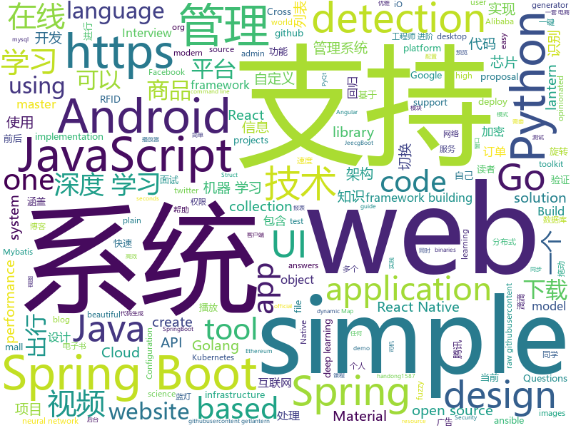

# 2019-07-07
See what the GitHub community is most excited about today.

## python
* [open-deepnude](https://github.com/open-deepnude/open-deepnude)(**107 stars today**): Open source reverse-engineered clone of DeepNude
* [numpy-ml](https://github.com/ddbourgin/numpy-ml)(**546 stars today**): Machine learning, in numpy
* [bokeh](https://github.com/bokeh/bokeh)(**106 stars today**): Interactive Web Plotting for Python
* [ChineseBQB](https://github.com/zhaoolee/ChineseBQB)(**224 stars today**): 🇨🇳Chinese sticker pack / 中国表情包大集合
* [autograd](https://github.com/HIPS/autograd)(**37 stars today**): Efficiently computes derivatives of numpy code.
* [dlrm](https://github.com/facebookresearch/dlrm)(**71 stars today**): An implementation of a deep learning recommendation model (DLRM)
* [mat2vec](https://github.com/materialsintelligence/mat2vec)(**50 stars today**): Supplementary Materials for Tshitoyan et al. "Unsupervised word embeddings capture latent knowledge from materials science literature", Nature (2019).
* [AiLearning](https://github.com/apachecn/AiLearning)(**66 stars today**): AiLearning: 机器学习 - MachineLearning - ML、深度学习 - DeepLearning - DL、自然语言处理 NLP
* [peewee](https://github.com/coleifer/peewee)(**6 stars today**): a small, expressive orm -- supports postgresql, mysql and sqlite
* [pix2pixHD](https://github.com/NVIDIA/pix2pixHD)(**41 stars today**): Synthesizing and manipulating 2048x1024 images with conditional GANs
* [mne-python](https://github.com/mne-tools/mne-python)(**4 stars today**): MNE : Magnetoencephalography (MEG) and Electroencephalography (EEG) in Python
* [flask](https://github.com/pallets/flask)(**21 stars today**): The Python micro framework for building web applications.
* [generative-models](https://github.com/wiseodd/generative-models)(**3 stars today**): Collection of generative models, e.g. GAN, VAE in Pytorch and Tensorflow.
* [marshmallow](https://github.com/marshmallow-code/marshmallow)(**4 stars today**): A lightweight library for converting complex objects to and from simple Python datatypes.
* [PythonSpiderNotes](https://github.com/lining0806/PythonSpiderNotes)(**7 stars today**): Python入门网络爬虫之精华版
* [examples](https://github.com/pyqt/examples)(**35 stars today**): PyQt examples show you how to create a desktop app with Python and Qt. Start with "Hello World" or browse the official PyQt demos.
* [pyod](https://github.com/yzhao062/pyod)(**3 stars today**): A Python Toolbox for Scalable Outlier Detection (Anomaly Detection)
* [ansible](https://github.com/ansible/ansible)(**10 stars today**): Ansible is a radically simple IT automation platform that makes your applications and systems easier to deploy. Avoid writing scripts or custom code to deploy and update your applications — automate in a language that approaches plain English, using SSH, with no agents to install on remote systems. https://docs.ansible.com/ansible/
* [gpt-2](https://github.com/openai/gpt-2)(**10 stars today**): Code for the paper "Language Models are Unsupervised Multitask Learners"
* [zvt](https://github.com/zvtvz/zvt)(**10 stars today**): zero vector trader
* [Real-Time-Voice-Cloning](https://github.com/CorentinJ/Real-Time-Voice-Cloning)(**53 stars today**): Clone a voice in 5 seconds to generate arbitrary speech in real-time
* [openshift-ansible](https://github.com/openshift/openshift-ansible)(**0 stars today**): OpenShift Installation and Configuration Management
* [spiderfoot](https://github.com/smicallef/spiderfoot)(**5 stars today**): SpiderFoot, the most complete OSINT collection and reconnaissance tool.
* [bips](https://github.com/bitcoin/bips)(**4 stars today**): Bitcoin Improvement Proposals
* [CenterNet](https://github.com/xingyizhou/CenterNet)(**4 stars today**): Object detection, 3D detection, and pose estimation using center point detection:

## java
* [SpringAll](https://github.com/wuyouzhuguli/SpringAll)(**114 stars today**): 循序渐进，学习Spring Boot、Spring Boot & Shiro、Spring Cloud、Spring Security & Spring Security OAuth2，博客Spring系列源码
* [v9porn](https://github.com/techGay/v9porn)(**59 stars today**): 9*Porn Android 客户端，突破游客每天观看10次视频的限制，还可以下载视频
* [mall-learning](https://github.com/macrozheng/mall-learning)(**50 stars today**): mall学习教程，架构、业务、技术要点全方位解析。mall项目（16k+star）是一套电商系统，使用现阶段主流技术实现。 涵盖了SpringBoot2.1.3、MyBatis3.4.6、Elasticsearch6.2.2、RabbitMQ3.7.15、Redis3.2、Mongodb3.2、Mysql5.7等技术，采用Docker容器化部署。
* [miaosha](https://github.com/qiurunze123/miaosha)(**36 stars today**): ⭐⭐⭐⭐秒杀系统设计与实现.互联网工程师进阶与分析🙋🐓
* [tech-weekly](https://github.com/mercyblitz/tech-weekly)(**19 stars today**): 「小马哥技术周报」
* [jeecg-boot](https://github.com/zhangdaiscott/jeecg-boot)(**43 stars today**): 一款基于代码生成器的JAVA快速开发平台！全新架构前后端分离：SpringBoot 2.x，Ant Design&Vue，Mybatis，Shiro，JWT。强大的代码生成器让前后端代码一键生成，无需写任何代码，绝对是全栈开发福音！！ JeecgBoot的宗旨是提高UI能力的同时,降低前后分离的开发成本，JeecgBoot还独创在线开发模式，No代码概念，一系列在线智能开发：在线配置表单、在线配置报表、在线设计流程等等。
* [FEBS-Shiro](https://github.com/wuyouzhuguli/FEBS-Shiro)(**7 stars today**): Spring Boot 2.1.3，Shiro1.4.0 & Layui 2.5.4 权限管理系统。预览地址：http://49.234.20.223:8080/login
* [advanced-java](https://github.com/doocs/advanced-java)(**36 stars today**): 😮互联网 Java 工程师进阶知识完全扫盲：涵盖高并发、分布式、高可用、微服务等领域知识，后端同学必看，前端同学也可学习
* [halo](https://github.com/halo-dev/halo)(**34 stars today**): ✍ Halo 一款现代化的个人独立博客系统
* [tutorials](https://github.com/eugenp/tutorials)(**15 stars today**): The "REST With Spring" Course:
* [canal](https://github.com/alibaba/canal)(**9 stars today**): 阿里巴巴 MySQL binlog 增量订阅&消费组件
* [CS-Notes](https://github.com/CyC2018/CS-Notes)(**82 stars today**): 📚Tech Interview Guide 技术面试必备基础知识、Leetcode 题解、Java、C++、Python、后端面试、操作系统、计算机网络、系统设计
* [mall](https://github.com/macrozheng/mall)(**24 stars today**): mall项目是一套电商系统，包括前台商城系统及后台管理系统，基于SpringBoot+MyBatis实现。 前台商城系统包含首页门户、商品推荐、商品搜索、商品展示、购物车、订单流程、会员中心、客户服务、帮助中心等模块。 后台管理系统包含商品管理、订单管理、会员管理、促销管理、运营管理、内容管理、统计报表、财务管理、权限管理、设置等模块。
* [springboot-learning-example](https://github.com/JeffLi1993/springboot-learning-example)(**10 stars today**): spring boot 实践学习案例，是 spring boot 初学者及核心技术巩固的最佳实践。
* [DiDiCallCar](https://github.com/18601949127/DiDiCallCar)(**32 stars today**): 这是我自己做的一个类似滴滴打车的Android出行项目，主要针对滴滴等出行平台一直饱受质疑的“人车不符”问题，以及当前越发火热的或计划和出海战略，给出行项目增加了下面几个功能： 1. RFID识别验证功能：在司机证件或者车内识别硬件嵌入RFID识别芯片，乘客使用手机读取到芯片信息，并且通过网络发送到出行平台数据库进行验证（我用JNI加了一个C语言的MD5加密算法对识别到的信息进行了加密）。如果不是合规的“人”或“车”，则不能完成订单并向平台或监管单位汇报当前位置。（为了方便读者测试，可以使用手机读取任何一个加密或非加密RFID芯片，比如银行卡、公交卡等，我在代码中的验证前阶段把芯片信息都换成我自己的司机信息，确保读者测试时可以收到服务器的回复） 2. 海外版功能：点击切换当前语言。 3…
* [JavaGuide](https://github.com/Snailclimb/JavaGuide)(**73 stars today**): 【Java学习+面试指南】 一份涵盖大部分Java程序员所需要掌握的核心知识。
* [easyexcel](https://github.com/alibaba/easyexcel)(**12 stars today**): 快速、简单避免OOM的java处理Excel工具
* [Qigsaw](https://github.com/iqiyi/Qigsaw)(**13 stars today**): 🔥🔥Qigsaw ['tʃiɪɡsɔ] is a dynamic modularization library which is based on Android App Bundles. It supports dynamic delivery for split APKs without reinstalling the base one.
* [piggymetrics](https://github.com/sqshq/piggymetrics)(**27 stars today**): Microservice Architecture with Spring Boot, Spring Cloud and Docker
* [CalendarView](https://github.com/huanghaibin-dev/CalendarView)(**1 stars today**): Android上一个优雅、万能自定义UI、支持周视图、自定义周起始、性能高效的日历控件，支持热插拔实现的UI定制！支持标记、自定义颜色、农历、自定义月视图各种显示模式等。Canvas绘制，速度快、占用内存低，你真的想不到日历居然还可以如此优雅！An elegant, highly customized and high-performance Calendar Widget on Android.
* [Osmand](https://github.com/osmandapp/Osmand)(**5 stars today**): OsmAnd
* [GSYVideoPlayer](https://github.com/CarGuo/GSYVideoPlayer)(**19 stars today**): 视频播放器（IJKplayer、ExoPlayer、MediaPlayer），HTTPS，支持弹幕，支持滤镜、水印、gif截图，片头广告、中间广告，多个同时播放，支持基本的拖动，声音、亮度调节，支持边播边缓存，支持视频自带rotation的旋转（90,270之类），重力旋转与手动旋转的同步支持，支持列表播放 ，列表全屏动画，视频加载速度，列表小窗口支持拖动，动画效果，调整比例，多分辨率切换，支持切换播放器，进度条小窗口预览，列表切换详情页面无缝播放，rtsp、concat、mpeg。
* [lottie-react-native](https://github.com/react-native-community/lottie-react-native)(**6 stars today**): Lottie wrapper for React Native.
* [otter](https://github.com/alibaba/otter)(**5 stars today**): 阿里巴巴分布式数据库同步系统(解决中美异地机房)
* [spring-cloud-alibaba](https://github.com/alibaba/spring-cloud-alibaba)(**12 stars today**): Spring Cloud Alibaba provides a one-stop solution for application development for the distributed solutions of Alibaba middleware.

## unknown
* [DeepLearning-500-questions](https://github.com/scutan90/DeepLearning-500-questions)(**170 stars today**): 深度学习500问，以问答形式对常用的概率知识、线性代数、机器学习、深度学习、计算机视觉等热点问题进行阐述，以帮助自己及有需要的读者。 全书分为18个章节，50余万字。由于水平有限，书中不妥之处恳请广大读者批评指正。 未完待续............ 如有意合作，联系scutjy2015@163.com 版权所有，违权必究 Tan 2018.06
* [learn-regex](https://github.com/ziishaned/learn-regex)(**189 stars today**): Learn regex the easy way
* [reactjs-interview-questions](https://github.com/sudheerj/reactjs-interview-questions)(**5 stars today**): List of top 500 ReactJS Interview Questions & Answers....Coding exercise questions are coming soon!!
* [nlp_chinese_corpus](https://github.com/brightmart/nlp_chinese_corpus)(**4 stars today**): 大规模中文自然语言处理语料 Large Scale Chinese Corpus for NLP
* [ToolChanger](https://github.com/e3donline/ToolChanger)(**6 stars today**): STPs / STLs / DXFs / PDFs
* [android-architecture](https://github.com/googlesamples/android-architecture)(**12 stars today**): A collection of samples to discuss and showcase different architectural tools and patterns for Android apps.
* [TidyverseSkeptic](https://github.com/matloff/TidyverseSkeptic)(**8 stars today**): An opinionated view of the Tidyverse "dialect" of the R language.
* [open-source-cs](https://github.com/ForrestKnight/open-source-cs)(**10 stars today**): Video discussing this curriculum:
* [The-Flask-Mega-Tutorial-zh](https://github.com/luhuisicnu/The-Flask-Mega-Tutorial-zh)(**2 stars today**): 翻译自Miguel Grinberg的blog https://blog.miguelgrinberg.com 的2017年新版The Flask Mega-Tutorial教程
* [Flutter-Course-Resources](https://github.com/londonappbrewery/Flutter-Course-Resources)(**5 stars today**): 
* [notes](https://github.com/darshanime/notes)(**39 stars today**): detailed notes on computer science topics, in one page
* [You-Dont-Know-JS](https://github.com/getify/You-Dont-Know-JS)(**48 stars today**): A book series on JavaScript. @YDKJS on twitter.
* [nogfw](https://github.com/gfw-breaker/nogfw)(**0 stars today**): 一键翻墙软件，包含自由门、无界等
* [awesome-object-detection](https://github.com/amusi/awesome-object-detection)(**21 stars today**): Awesome Object Detection based on handong1587 github: https://handong1587.github.io/deep_learning/2015/10/09/object-detection.html
* [swift-style-guide](https://github.com/raywenderlich/swift-style-guide)(**0 stars today**): The official Swift style guide for raywenderlich.com.
* [angular-interview-questions](https://github.com/sudheerj/angular-interview-questions)(**2 stars today**): List of 300 Angular Interview Questions and answers
* [SJTU-Courses](https://github.com/CoolPhilChen/SJTU-Courses)(**10 stars today**): 上海交通大学课程资料分享
* [android-open-project](https://github.com/Trinea/android-open-project)(**4 stars today**): A categorized collection of Android Open Source Projects, More powerful web version:
* [architecture.of.internet-product](https://github.com/davideuler/architecture.of.internet-product)(**26 stars today**): 互联网公司技术架构，微信/淘宝/微博/腾讯/阿里/美团点评/百度/Google/Facebook/Amazon/eBay的架构，欢迎PR补充
* [books](https://github.com/programthink/books)(**7 stars today**): 【编程随想】收藏的电子书清单（多个学科，含下载链接）
* [awesome-operators](https://github.com/operator-framework/awesome-operators)(**1 stars today**): A resource tracking a number of Operators out in the wild.
* [react-native-styling-cheat-sheet](https://github.com/vhpoet/react-native-styling-cheat-sheet)(**1 stars today**): Most of the React Native styling material in one page
* [Specs](https://github.com/CocoaPods/Specs)(**1 stars today**): The CocoaPods Master Repo
* [download](https://github.com/getlantern/download)(**18 stars today**): 蓝灯Windows下载 https://raw.githubusercontent.com/getlantern/lantern-binaries/master/lantern-installer.exe 蓝灯安卓下载 https://raw.githubusercontent.com/getlantern/lantern-binaries/master/lantern-installer.apk
* [ethereum-org-website](https://github.com/ethereum/ethereum-org-website)(**0 stars today**): Ethereum.org Website 2019 Redesign

## javascript
* [cesium](https://github.com/AnalyticalGraphicsInc/cesium)(**36 stars today**): An open-source JavaScript library for world-class 3D globes and maps🌎
* [cli](https://github.com/react-native-community/cli)(**30 stars today**): React Native command line tools
* [theme-ui](https://github.com/system-ui/theme-ui)(**12 stars today**): Build consistent, themeable React UIs based on design system constraints and design tokens
* [react-native](https://github.com/facebook/react-native)(**24 stars today**): A framework for building native apps with React.
* [openlayers](https://github.com/openlayers/openlayers)(**6 stars today**): OpenLayers
* [incubator-superset](https://github.com/apache/incubator-superset)(**7 stars today**): Apache Superset (incubating) is a modern, enterprise-ready business intelligence web application
* [AR.js](https://github.com/jeromeetienne/AR.js)(**10 stars today**): Efficient Augmented Reality for the Web - 60fps on mobile!
* [serverless-image-handler](https://github.com/awslabs/serverless-image-handler)(**6 stars today**): A solution to dynamically handle images on the fly, utilizing SharpJS
* [material-shell](https://github.com/PapyElGringo/material-shell)(**44 stars today**): New shell for Gnome following the Material-design guidelines. Proposing a performant and simple opinionated mouse/keyboard workflow to increase daily productivity and comfort
* [quasar](https://github.com/quasarframework/quasar)(**16 stars today**): Quasar Framework - Build high-performance VueJS user interfaces in record time
* [generator-jhipster](https://github.com/jhipster/generator-jhipster)(**10 stars today**): Open Source application generator for creating Spring Boot + Angular/React projects in seconds!
* [popmotion](https://github.com/Popmotion/popmotion)(**13 stars today**): Simple animation libraries for delightful user interfaces
* [Fuse](https://github.com/krisk/Fuse)(**20 stars today**): Lightweight fuzzy-search, in JavaScript
* [google-access-helper](https://github.com/haotian-wang/google-access-helper)(**15 stars today**): 谷歌访问助手破解版
* [umi-request](https://github.com/umijs/umi-request)(**3 stars today**): A request tool based on fetch.
* [axios](https://github.com/axios/axios)(**24 stars today**): Promise based HTTP client for the browser and node.js
* [Chart.js](https://github.com/chartjs/Chart.js)(**13 stars today**): Simple HTML5 Charts using the <canvas> tag
* [fullPage.js](https://github.com/alvarotrigo/fullPage.js)(**15 stars today**): fullPage plugin by Alvaro Trigo. Create full screen pages fast and simple
* [vue](https://github.com/vuejs/vue)(**47 stars today**): 🖖Vue.js is a progressive, incrementally-adoptable JavaScript framework for building UI on the web.
* [TIMSDK](https://github.com/tencentyun/TIMSDK)(**1 stars today**): 腾讯云通信消息服务SDK，简单快速的即时通讯解决方案。
* [send](https://github.com/mozilla/send)(**7 stars today**): Simple, private file sharing from the makers of Firefox
* [web3.js](https://github.com/ethereum/web3.js)(**5 stars today**): Ethereum JavaScript API
* [AwesomeXSS](https://github.com/s0md3v/AwesomeXSS)(**13 stars today**): Awesome XSS stuff
* [ethereumbook](https://github.com/ethereumbook/ethereumbook)(**6 stars today**): Mastering Ethereum, by Andreas M. Antonopoulos, Gavin Wood
* [react-native-gesture-handler](https://github.com/kmagiera/react-native-gesture-handler)(**8 stars today**): Declarative API exposing platform native touch and gesture system to React Native.

## html
* [nndl.github.io](https://github.com/nndl/nndl.github.io)(**10 stars today**): 《神经网络与深度学习》 Neural Network and Deep Learning
* [zfaka](https://github.com/zlkbdotnet/zfaka)(**8 stars today**): 免费、安全、稳定、高效的发卡系统，值得拥有!
* [electron-api-demos](https://github.com/electron/electron-api-demos)(**2 stars today**): Explore the Electron APIs
* [Coursera-ML-AndrewNg-Notes](https://github.com/fengdu78/Coursera-ML-AndrewNg-Notes)(**30 stars today**): 吴恩达老师的机器学习课程个人笔记
* [EIPs](https://github.com/ethereum/EIPs)(**2 stars today**): The Ethereum Improvement Proposal repository
* [book](https://github.com/PaddlePaddle/book)(**9 stars today**): Deep Learning 101 with PaddlePaddle （『飞桨』深度学习框架入门教程）
* [Machine-Learning](https://github.com/Jack-Cherish/Machine-Learning)(**4 stars today**): ⚡️机器学习实战（Python3）：kNN、决策树、贝叶斯、逻辑回归、SVM、线性回归、树回归
* [Adminator-admin-dashboard](https://github.com/puikinsh/Adminator-admin-dashboard)(**2 stars today**): Adminator is a easy to use and well design admin dashboard template for web apps, websites, services and more
* [fonts](https://github.com/google/fonts)(**3 stars today**): Font files available from Google Fonts
* [beautiful-jekyll](https://github.com/daattali/beautiful-jekyll)(**2 stars today**): ✨Build a beautiful and simple website in literally minutes. Demo at http://deanattali.com/beautiful-jekyll
* [proposal-pipeline-operator](https://github.com/tc39/proposal-pipeline-operator)(**4 stars today**): A proposal for adding the simple-but-useful pipeline operator to JavaScript.
* [keep-a-changelog](https://github.com/olivierlacan/keep-a-changelog)(**2 stars today**): If you build software, keep a changelog.
* [proposal-dynamic-import](https://github.com/tc39/proposal-dynamic-import)(**0 stars today**): import() proposal for JavaScript
* [shellphish](https://github.com/thelinuxchoice/shellphish)(**6 stars today**): Phishing Tool for 18 social media: Instagram, Facebook, Snapchat, Github, Twitter, Yahoo, Protonmail, Spotify, Netflix, Linkedin, Wordpress, Origin, Steam, Microsoft, InstaFollowers, Gitlab, Pinterest
* [flutter-in-action](https://github.com/flutterchina/flutter-in-action)(**14 stars today**): 《Flutter实战》电子书
* [kagerou](https://github.com/hibiyasleep/kagerou)(**1 stars today**): ACT-FF14 OverlayPlugin Skin - Modern, easily configurable, always up-to-date.
* [skrollr](https://github.com/Prinzhorn/skrollr)(**0 stars today**): Stand-alone parallax scrolling library for mobile (Android + iOS) and desktop. No jQuery. Just plain JavaScript (and some love).
* [mlog](https://github.com/mlogclub/mlog)(**1 stars today**): 基于Golang的社区系统
* [Screenshot-to-code](https://github.com/emilwallner/Screenshot-to-code)(**3 stars today**): A neural network that transforms a design mock-up into a static website.
* [typedoc](https://github.com/TypeStrong/typedoc)(**2 stars today**): Documentation generator for TypeScript projects.
* [bedrock](https://github.com/mozilla/bedrock)(**1 stars today**): Making mozilla.org awesome, one pebble at a time
* [stisla](https://github.com/stisla/stisla)(**1 stars today**): Free Bootstrap Admin Template
* [bitcoin-whitepaper-chinese-translation](https://github.com/xiaolai/bitcoin-whitepaper-chinese-translation)(**0 stars today**): 
* [CLRS](https://github.com/walkccc/CLRS)(**2 stars today**): 📚Solutions to Introduction to Algorithms Third Edition
* [qcloud-documents](https://github.com/tencentyun/qcloud-documents)(**0 stars today**): 腾讯云官方文档 使用Markdown自动构建

## go
* [logrus](https://github.com/sirupsen/logrus)(**38 stars today**): Structured, pluggable logging for Go.
* [goconvey](https://github.com/smartystreets/goconvey)(**18 stars today**): Go testing in the browser. Integrates with `go test`. Write behavioral tests in Go.
* [helm](https://github.com/helm/helm)(**28 stars today**): The Kubernetes Package Manager
* [pan-light](https://github.com/peterq/pan-light)(**128 stars today**): 百度网盘不限速客户端, golang + qt5, 跨平台图形界面
* [gocron](https://github.com/ouqiang/gocron)(**8 stars today**): 定时任务管理系统
* [validator](https://github.com/go-playground/validator)(**12 stars today**): 💯Go Struct and Field validation, including Cross Field, Cross Struct, Map, Slice and Array diving
* [dashboard](https://github.com/kubernetes/dashboard)(**9 stars today**): General-purpose web UI for Kubernetes clusters
* [fzf](https://github.com/junegunn/fzf)(**14 stars today**): 🌸A command-line fuzzy finder
* [caddy](https://github.com/caddyserver/caddy)(**17 stars today**): Fast, cross-platform HTTP/2 web server with automatic HTTPS
* [cosmos-sdk](https://github.com/cosmos/cosmos-sdk)(**7 stars today**): ⛓Blockchain Application Framework✨
* [rook](https://github.com/rook/rook)(**5 stars today**): Storage Orchestration for Kubernetes
* [mattermost-server](https://github.com/mattermost/mattermost-server)(**18 stars today**): Open source Slack-alternative in Golang and React - Mattermost
* [protobuf](https://github.com/golang/protobuf)(**4 stars today**): Go support for Google's protocol buffers
* [kubernetes](https://github.com/kubernetes/kubernetes)(**26 stars today**): Production-Grade Container Scheduling and Management
* [pgx](https://github.com/jackc/pgx)(**4 stars today**): PostgreSQL driver and toolkit for Go
* [buildkit](https://github.com/moby/buildkit)(**5 stars today**): concurrent, cache-efficient, and Dockerfile-agnostic builder toolkit
* [go-ipfs](https://github.com/ipfs/go-ipfs)(**0 stars today**): IPFS implementation in Go
* [terraform-provider-azurerm](https://github.com/terraform-providers/terraform-provider-azurerm)(**1 stars today**): Terraform provider for Azure Resource Manager
* [blackbox_exporter](https://github.com/prometheus/blackbox_exporter)(**4 stars today**): Blackbox prober exporter
* [go-swagger](https://github.com/go-swagger/go-swagger)(**4 stars today**): Swagger 2.0 implementation for go
* [pulumi](https://github.com/pulumi/pulumi)(**4 stars today**): Modern Infrastructure as Code - Create, deploy, and manage infrastructure on any cloud using your favorite language.
* [testify](https://github.com/stretchr/testify)(**6 stars today**): A toolkit with common assertions and mocks that plays nicely with the standard library
* [gin](https://github.com/gin-gonic/gin)(**21 stars today**): Gin is a HTTP web framework written in Go (Golang). It features a Martini-like API with much better performance -- up to 40 times faster. If you need smashing performance, get yourself some Gin.
* [errors](https://github.com/pkg/errors)(**4 stars today**): Simple error handling primitives
* [terraform](https://github.com/hashicorp/terraform)(**6 stars today**): Terraform enables you to safely and predictably create, change, and improve infrastructure. It is an open source tool that codifies APIs into declarative configuration files that can be shared amongst team members, treated as code, edited, reviewed, and versioned.

## WordCloud

