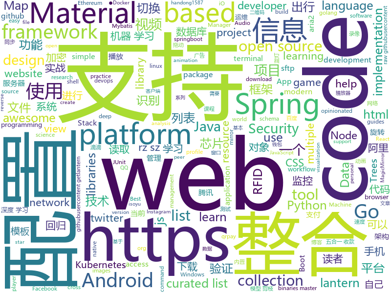

# 2019-07-08
See what the GitHub community is most excited about today.

## python
* [numpy-ml](https://github.com/ddbourgin/numpy-ml)(**642 stars today**): Machine learning, in numpy
* [mat2vec](https://github.com/materialsintelligence/mat2vec)(**57 stars today**): Supplementary Materials for Tshitoyan et al. "Unsupervised word embeddings capture latent knowledge from materials science literature", Nature (2019).
* [YOLOv3-model-pruning](https://github.com/Lam1360/YOLOv3-model-pruning)(**134 stars today**): 对 YOLOv3 做模型剪枝（network slimming），对于 oxford hand 数据集（因项目需要），模型剪枝后的参数量减少 80%，Infer 的速度达到原来 2 倍，mAP 基本不变
* [theZoo](https://github.com/ytisf/theZoo)(**70 stars today**): A repository of LIVE malwares for your own joy and pleasure. theZoo is a project created to make the possibility of malware analysis open and available to the public.
* [esim-response-selection](https://github.com/alibaba/esim-response-selection)(**89 stars today**): ESIM for Multi-turn Response Selection Task
* [bokeh](https://github.com/bokeh/bokeh)(**123 stars today**): Interactive Web Plotting for Python
* [pix2pixHD](https://github.com/NVIDIA/pix2pixHD)(**53 stars today**): Synthesizing and manipulating 2048x1024 images with conditional GANs
* [Fantasy-Premier-League](https://github.com/vaastav/Fantasy-Premier-League)(**19 stars today**): Creates a .csv file of all players in the English Player League with their respective team and total fantasy points
* [example-code](https://github.com/fluentpython/example-code)(**52 stars today**): Example code for the book Fluent Python
* [dvc](https://github.com/iterative/dvc)(**10 stars today**): 🦉Data Version Control | Git for Data & Models
* [RamanujanMachine](https://github.com/AnonGit90210/RamanujanMachine)(**18 stars today**): 
* [awesome-python](https://github.com/vinta/awesome-python)(**46 stars today**): A curated list of awesome Python frameworks, libraries, software and resources
* [persepolis](https://github.com/persepolisdm/persepolis)(**6 stars today**): Persepolis Download Manager is a GUI for aria2.
* [cryptofeed](https://github.com/bmoscon/cryptofeed)(**7 stars today**): Cryptocurrency Exchange Feed Handler with synthetic NBBO
* [autograd](https://github.com/HIPS/autograd)(**27 stars today**): Efficiently computes derivatives of numpy code.
* [webterminal](https://github.com/jimmy201602/webterminal)(**26 stars today**): ssh rdp vnc telnet sftp bastion/jump web putty xshell terminal jumpserver audit realtime monitor rz/sz 堡垒机 云桌面 linux devops sftp websocket file management rz/sz 自动化运维 审计 录像 文件管理 sftp上传 实时监控 录像回放 网页版rz/sz上传下载 django
* [code_snippets](https://github.com/CoreyMSchafer/code_snippets)(**10 stars today**): 
* [exercise](https://github.com/nndl/exercise)(**5 stars today**): exercise for nndl
* [trape](https://github.com/jofpin/trape)(**5 stars today**): People tracker on the Internet: OSINT analysis and research tool by Jose Pino
* [ChineseBQB](https://github.com/zhaoolee/ChineseBQB)(**398 stars today**): 🇨🇳Chinese sticker pack / 中国表情包大集合
* [wifiphisher](https://github.com/wifiphisher/wifiphisher)(**6 stars today**): The Rogue Access Point Framework
* [keras-vis](https://github.com/raghakot/keras-vis)(**9 stars today**): Neural network visualization toolkit for keras
* [kivy](https://github.com/kivy/kivy)(**19 stars today**): Open source UI framework written in Python, running on Windows, Linux, macOS, Android and iOS

## java
* [SpringAll](https://github.com/wuyouzhuguli/SpringAll)(**267 stars today**): 循序渐进，学习Spring Boot、Spring Boot & Shiro、Spring Cloud、Spring Security & Spring Security OAuth2，博客Spring系列源码
* [GSYVideoPlayer](https://github.com/CarGuo/GSYVideoPlayer)(**32 stars today**): 视频播放器（IJKplayer、ExoPlayer、MediaPlayer），HTTPS，支持弹幕，支持滤镜、水印、gif截图，片头广告、中间广告，多个同时播放，支持基本的拖动，声音、亮度调节，支持边播边缓存，支持视频自带rotation的旋转（90,270之类），重力旋转与手动旋转的同步支持，支持列表播放 ，列表全屏动画，视频加载速度，列表小窗口支持拖动，动画效果，调整比例，多分辨率切换，支持切换播放器，进度条小窗口预览，列表切换详情页面无缝播放，rtsp、concat、mpeg。
* [v9porn](https://github.com/techGay/v9porn)(**164 stars today**): 9*Porn Android 客户端，突破游客每天观看10次视频的限制，还可以下载视频
* [testcontainers-java](https://github.com/testcontainers/testcontainers-java)(**7 stars today**): Testcontainers is a Java library that supports JUnit tests, providing lightweight, throwaway instances of common databases, Selenium web browsers, or anything else that can run in a Docker container.
* [mall-learning](https://github.com/macrozheng/mall-learning)(**86 stars today**): mall学习教程，架构、业务、技术要点全方位解析。mall项目（16k+star）是一套电商系统，使用现阶段主流技术实现。 涵盖了SpringBoot2.1.3、MyBatis3.4.6、Elasticsearch6.2.2、RabbitMQ3.7.15、Redis3.2、Mongodb3.2、Mysql5.7等技术，采用Docker容器化部署。
* [baritone](https://github.com/cabaletta/baritone)(**15 stars today**): google maps for block game
* [shiro](https://github.com/apache/shiro)(**9 stars today**): Mirror of Apache Shiro
* [ForestBlog](https://github.com/saysky/ForestBlog)(**20 stars today**): 一个简单漂亮的SSM(Spring+SpringMVC+Mybatis)博客系统
* [SpringBoot](https://github.com/Foreveriss/SpringBoot)(**22 stars today**): springboot用法和与各种框架、组件等结合使用，包括springboot的注解分析、路径分析、取得内置对象、项目打包、配置环境属性、读取资源文件、Bean配置、模板渲染、基于yml的多profile配置、基于properties的多profile、添加数据验证、配置错误页、全局异常处理、配置Tomcat运行、配置https访问路径、信息显示、内置对象、显示对象信息、文件上传、使用文件服务器、拦截器、配置druid数据库连接池、整合MyBatis框架、事务控制、Druid监控、整合ActiveMQ、整合RabbitMQ、整合kafka、邮件发送、定时调度、Actuator监控、整合Redis数据库、整合Restfui框架、整合Shiro
* [dubbo](https://github.com/apache/dubbo)(**45 stars today**): Apache Dubbo is a high-performance, java based, open source RPC framework.
* [DiDiCallCar](https://github.com/18601949127/DiDiCallCar)(**42 stars today**): 这是我自己做的一个类似滴滴打车的Android出行项目，主要针对滴滴等出行平台一直饱受质疑的“人车不符”问题，以及当前越发火热的或计划和出海战略，给出行项目增加了下面几个功能： 1. RFID识别验证功能：在司机证件或者车内识别硬件嵌入RFID识别芯片，乘客使用手机读取到芯片信息，并且通过网络发送到出行平台数据库进行验证（我用JNI加了一个C语言的MD5加密算法对识别到的信息进行了加密）。如果不是合规的“人”或“车”，则不能完成订单并向平台或监管单位汇报当前位置。（为了方便读者测试，可以使用手机读取任何一个加密或非加密RFID芯片，比如银行卡、公交卡等，我在代码中的验证前阶段把芯片信息都换成我自己的司机信息，确保读者测试时可以收到服务器的回复） 2. 海外版功能：点击切换当前语言。 3…
* [SkyStone](https://github.com/FIRST-Tech-Challenge/SkyStone)(**1 stars today**): 
* [netty-learning-example](https://github.com/sanshengshui/netty-learning-example)(**29 stars today**): 🥚Netty实践学习案例，见微知著！带着你的心，跟着教程。我相信你行欧。
* [gecco](https://github.com/xtuhcy/gecco)(**12 stars today**): Easy to use lightweight web crawler（易用的轻量化网络爬虫）
* [micronaut-core](https://github.com/micronaut-projects/micronaut-core)(**8 stars today**): Micronaut Application Framework
* [Play-with-Algorithms](https://github.com/liuyubobobo/Play-with-Algorithms)(**13 stars today**): Codes of my MOOC Course <Play with Algorithms>, Both in C++ and Java language. Updated contents and practices are also included. 我在慕课网上的课程《算法与数据结构》示例代码，包括C++和Java版本。课程的更多更新内容及辅助练习也将逐步添加进这个代码仓。
* [opsCloud](https://github.com/ixrjog/opsCloud)(**15 stars today**): 运维管理平台(阿里云)，自动同步阿里云配置信息，给研发使用的跳板机，批量运维，Zabbix管理等功能
* [zuul](https://github.com/Netflix/zuul)(**8 stars today**): Zuul is a gateway service that provides dynamic routing, monitoring, resiliency, security, and more.
* [Osmand](https://github.com/osmandapp/Osmand)(**5 stars today**): OsmAnd
* [Algorithms](https://github.com/williamfiset/Algorithms)(**10 stars today**): A collection of algorithms
* [ShapeOfView](https://github.com/florent37/ShapeOfView)(**6 stars today**): Give a custom shape to any android view, Material Design 2 ready
* [Spring-Boot-In-Action](https://github.com/hansonwang99/Spring-Boot-In-Action)(**12 stars today**): Spring Boot 系列实战合集
* [MifareClassicTool](https://github.com/ikarus23/MifareClassicTool)(**5 stars today**): An Android NFC app for reading, writing, analyzing, etc. MIFARE Classic RFID tags.
* [junit5-samples](https://github.com/junit-team/junit5-samples)(**3 stars today**): Collection of sample applications using JUnit 5.
* [lwjgl3](https://github.com/LWJGL/lwjgl3)(**5 stars today**): LWJGL is a Java library that enables cross-platform access to popular native APIs useful in the development of graphics (OpenGL, Vulkan), audio (OpenAL), parallel computing (OpenCL, CUDA) and XR (OpenVR, LibOVR) applications.

## unknown
* [LiteratureDL4Graph](https://github.com/DeepGraphLearning/LiteratureDL4Graph)(**373 stars today**): 
* [DeepLearning-500-questions](https://github.com/scutan90/DeepLearning-500-questions)(**213 stars today**): 深度学习500问，以问答形式对常用的概率知识、线性代数、机器学习、深度学习、计算机视觉等热点问题进行阐述，以帮助自己及有需要的读者。 全书分为18个章节，50余万字。由于水平有限，书中不妥之处恳请广大读者批评指正。 未完待续............ 如有意合作，联系scutjy2015@163.com 版权所有，违权必究 Tan 2018.06
* [awesome-decision-tree-papers](https://github.com/benedekrozemberczki/awesome-decision-tree-papers)(**40 stars today**): A collection of research papers on decision, classification and regression trees with implementations.
* [learn-regex](https://github.com/ziishaned/learn-regex)(**128 stars today**): Learn regex the easy way
* [android](https://github.com/LineageOS/android)(**0 stars today**): 
* [android_guides](https://github.com/codepath/android_guides)(**7 stars today**): Extensive Open-Source Guides for Android Developers
* [opencollective](https://github.com/opencollective/opencollective)(**2 stars today**): A new form of association, transparent by design. Please report issues there. Feature requests and ideas welcome!
* [cppbestpractices](https://github.com/lefticus/cppbestpractices)(**2 stars today**): Collaborative Collection of C++ Best Practices
* [awesome-quant](https://github.com/wilsonfreitas/awesome-quant)(**1 stars today**): A curated list of insanely awesome libraries, packages and resources for Quants (Quantitative Finance)
* [Awesome-Hacking](https://github.com/Hack-with-Github/Awesome-Hacking)(**16 stars today**): A collection of various awesome lists for hackers, pentesters and security researchers
* [The-Economist](https://github.com/nailperry-zd/The-Economist)(**35 stars today**): The Economist 经济学人，持续更新
* [architecture.of.internet-product](https://github.com/davideuler/architecture.of.internet-product)(**27 stars today**): 互联网公司技术架构，微信/淘宝/微博/腾讯/阿里/美团点评/百度/Google/Facebook/Amazon/eBay的架构，欢迎PR补充
* [TidyverseSkeptic](https://github.com/matloff/TidyverseSkeptic)(**5 stars today**): An opinionated view of the Tidyverse "dialect" of the R language.
* [terminal-mac-cheatsheet](https://github.com/0nn0/terminal-mac-cheatsheet)(**4 stars today**): List of my most used commands and shortcuts in the terminal for Mac
* [awesome-object-detection](https://github.com/amusi/awesome-object-detection)(**23 stars today**): Awesome Object Detection based on handong1587 github: https://handong1587.github.io/deep_learning/2015/10/09/object-detection.html
* [blog](https://github.com/fouber/blog)(**7 stars today**): 没事写写文章，喜欢的话请点star，想订阅点watch，千万别fork！
* [awesome-roadmaps](https://github.com/orsanawwad/awesome-roadmaps)(**2 stars today**): View roadmaps about developer roles to help you learn
* [free-programming-books](https://github.com/EbookFoundation/free-programming-books)(**36 stars today**): 📚Freely available programming books
* [android-developer-roadmap](https://github.com/mobile-roadmap/android-developer-roadmap)(**84 stars today**): Android Developer Roadmap 2019
* [awesome-distributed-systems](https://github.com/theanalyst/awesome-distributed-systems)(**2 stars today**): A curated list to learn about distributed systems
* [SS-Rule-Snippet](https://github.com/Hackl0us/SS-Rule-Snippet)(**5 stars today**): 搜集、整理、维护 Surge / Quantumult / Shadowrocket / Surfboard / clash(X) 实用规则。
* [You-Dont-Know-JS](https://github.com/getify/You-Dont-Know-JS)(**54 stars today**): A book series on JavaScript. @YDKJS on twitter.
* [PLGradSchools](https://github.com/LeifAndersen/PLGradSchools)(**1 stars today**): 
* [fancyss_history_package](https://github.com/hq450/fancyss_history_package)(**17 stars today**): 科学上网插件的离线安装包储存在这里
* [gitignore](https://github.com/github/gitignore)(**39 stars today**): A collection of useful .gitignore templates

## javascript
* [edex-ui](https://github.com/GitSquared/edex-ui)(**87 stars today**): A cross-platform, customizable science fiction terminal emulator with advanced monitoring & touchscreen support.
* [AwesomeXSS](https://github.com/s0md3v/AwesomeXSS)(**126 stars today**): Awesome XSS stuff
* [p5.js](https://github.com/processing/p5.js)(**78 stars today**): p5.js is a client-side JS platform that empowers artists, designers, students, and anyone to learn to code and express themselves creatively on the web. It is based on the core principles of Processing. http://twitter.com/p5xjs —
* [MagicMirror](https://github.com/MichMich/MagicMirror)(**20 stars today**): MagicMirror² is an open source modular smart mirror platform. With a growing list of installable modules, the MagicMirror² allows you to convert your hallway or bathroom mirror into your personal assistant.
* [opensource.guide](https://github.com/github/opensource.guide)(**10 stars today**): Community guides for open source creators
* [webui-aria2](https://github.com/ziahamza/webui-aria2)(**23 stars today**): The aim for this project is to create the worlds best and hottest interface to interact with aria2. Very simple to use, just download and open index.html in any web browser.
* [strapi](https://github.com/strapi/strapi)(**54 stars today**): 🚀Open source Node.js Headless CMS to easily build customisable APIs
* [material-shell](https://github.com/PapyElGringo/material-shell)(**47 stars today**): New shell for Gnome following the Material-design guidelines. Proposing a performant and simple opinionated mouse/keyboard workflow to increase daily productivity and comfort
* [code-dot-org](https://github.com/code-dot-org/code-dot-org)(**5 stars today**): The code powering code.org and studio.code.org
* [redux-offline](https://github.com/redux-offline/redux-offline)(**10 stars today**): Build Offline-First Apps for Web and React Native
* [Fuse](https://github.com/krisk/Fuse)(**41 stars today**): Lightweight fuzzy-search, in JavaScript
* [cli](https://github.com/react-native-community/cli)(**16 stars today**): React Native command line tools
* [awesome-ctf](https://github.com/apsdehal/awesome-ctf)(**13 stars today**): A curated list of CTF frameworks, libraries, resources and softwares
* [AriaNg](https://github.com/mayswind/AriaNg)(**10 stars today**): AriaNg, a modern web frontend making aria2 easier to use.
* [cgm-remote-monitor](https://github.com/nightscout/cgm-remote-monitor)(**5 stars today**): nightscout web monitor
* [atom](https://github.com/atom/atom)(**17 stars today**): The hackable text editor
* [javascript](https://github.com/airbnb/javascript)(**28 stars today**): JavaScript Style Guide
* [popmotion](https://github.com/Popmotion/popmotion)(**16 stars today**): Simple animation libraries for delightful user interfaces
* [odoo](https://github.com/odoo/odoo)(**15 stars today**): Odoo. Open Source Apps To Grow Your Business.
* [Tone.js](https://github.com/Tonejs/Tone.js)(**15 stars today**): A Web Audio framework for making interactive music in the browser.
* [bitcore](https://github.com/bitpay/bitcore)(**5 stars today**): A full stack for bitcoin and blockchain-based applications
* [engine](https://github.com/cocos-creator/engine)(**6 stars today**): Cocos Creator is a complete package of game development tools and workflow, including a game engine, resource management, scene editing, game preview, debug and publish one project to multiple platforms.
* [cezerin](https://github.com/cezerin/cezerin)(**13 stars today**): Cezerin is React and Node.js based eCommerce platform.
* [jss](https://github.com/cssinjs/jss)(**15 stars today**): JSS is an authoring tool for CSS which uses JavaScript as a host language.
* [ogl](https://github.com/oframe/ogl)(**21 stars today**): Minimal WebGL framework

## html
* [shellphish](https://github.com/thelinuxchoice/shellphish)(**4 stars today**): Phishing Tool for 18 social media: Instagram, Facebook, Snapchat, Github, Twitter, Yahoo, Protonmail, Spotify, Netflix, Linkedin, Wordpress, Origin, Steam, Microsoft, InstaFollowers, Gitlab, Pinterest
* [python](https://github.com/Show-Me-the-Code/python)(**3 stars today**): Show Me the Code Python version.
* [zfaka](https://github.com/zlkbdotnet/zfaka)(**9 stars today**): 免费、安全、稳定、高效的发卡系统，值得拥有!
* [book](https://github.com/PaddlePaddle/book)(**1 stars today**): Deep Learning 101 with PaddlePaddle （『飞桨』深度学习框架入门教程）
* [material-design-lite](https://github.com/google/material-design-lite)(**4 stars today**): Material Design Components in HTML/CSS/JS
* [Web-Security-Learning](https://github.com/CHYbeta/Web-Security-Learning)(**4 stars today**): Web-Security-Learning
* [SVG-Loaders](https://github.com/SamHerbert/SVG-Loaders)(**3 stars today**): Loading icons and small animations built with pure SVG.
* [blog](https://github.com/hoc2019/blog)(**5 stars today**): 分享文章
* [Machine-Learning](https://github.com/Jack-Cherish/Machine-Learning)(**3 stars today**): ⚡️机器学习实战（Python3）：kNN、决策树、贝叶斯、逻辑回归、SVM、线性回归、树回归
* [qrpay](https://github.com/insoxin/qrpay)(**4 stars today**): 五合一收款码在线生成,40个模板 支持微信支付、支付宝支付、手机QQ支付、京东钱包、百度钱包,PayPal五合一收款，将其二维码合并为一个二维码，无需手续费,支持qq头像,昵称判断(HTML单页版多模板免安装) 腾讯云服务器 https://api.isoyu.com/qrpay/ 腾讯云COS https://qrpay.isoyu.com/
* [schemaorg](https://github.com/schemaorg/schemaorg)(**3 stars today**): Schema.org - schemas and (appengine) software
* [personal-website](https://github.com/github/personal-website)(**2 stars today**): Code that'll help you kickstart a personal website that showcases your work as a software developer.
* [geektime-ELK](https://github.com/onebirdrocks/geektime-ELK)(**9 stars today**): ELK Training
* [EIPs](https://github.com/ethereum/EIPs)(**5 stars today**): The Ethereum Improvement Proposal repository
* [Screenshot-to-code](https://github.com/emilwallner/Screenshot-to-code)(**0 stars today**): A neural network that transforms a design mock-up into a static website.
* [qiubaiying.github.io](https://github.com/qiubaiying/qiubaiying.github.io)(**2 stars today**): BY Blog ->
* [Web-Development](https://github.com/Internshala-Online-Trainings/Web-Development)(**1 stars today**): 
* [Machine-Learning-in-Action-Python3](https://github.com/wzy6642/Machine-Learning-in-Action-Python3)(**3 stars today**): 《机器学习实战》python3源码
* [free-for-dev](https://github.com/ripienaar/free-for-dev)(**4 stars today**): A list of SaaS, PaaS and IaaS offerings that have free tiers of interest to devops and infradev
* [lab-canvas-race-car](https://github.com/ironhack-labs/lab-canvas-race-car)(**1 stars today**): 
* [Summer_Course](https://github.com/Hussain-Alsalman/Summer_Course)(**1 stars today**): This Repos include all the relevant material for the summer bootcamp for TechniBits
* [lab-css-instagram-clone](https://github.com/ironhack-labs/lab-css-instagram-clone)(**1 stars today**): A CSS Lab to clone instagram and practice positioning
* [website](https://github.com/vlang/website)(**1 stars today**): 
* [wordsandbuttons](https://github.com/akalenuk/wordsandbuttons)(**13 stars today**): Interactive visualizations: math, algorithms, programming languages
* [how-dat-works](https://github.com/datprotocol/how-dat-works)(**7 stars today**): Protocol documentation for Dat

## go
* [pan-light](https://github.com/peterq/pan-light)(**399 stars today**): 百度网盘不限速客户端, golang + qt5, 跨平台图形界面
* [cruzbit](https://github.com/cruzbit/cruzbit)(**21 stars today**): A simple decentralized peer-to-peer ledger implementation
* [webrtc](https://github.com/pion/webrtc)(**23 stars today**): Pure Go implementation of the WebRTC API
* [sshcode](https://github.com/cdr/sshcode)(**19 stars today**): Run VS Code on any server over SSH.
* [lantern](https://github.com/getlantern/lantern)(**42 stars today**): 蓝灯Windows下载 https://raw.githubusercontent.com/getlantern/lantern-binaries/master/lantern-installer.exe 蓝灯安卓下载 https://raw.githubusercontent.com/getlantern/lantern-binaries/master/lantern-installer.apk
* [cue](https://github.com/cuelang/cue)(**13 stars today**): Validate and define text-based and dynamic configuration
* [gods](https://github.com/emirpasic/gods)(**28 stars today**): GoDS (Go Data Structures). Containers (Sets, Lists, Stacks, Maps, Trees), Sets (HashSet, TreeSet, LinkedHashSet), Lists (ArrayList, SinglyLinkedList, DoublyLinkedList), Stacks (LinkedListStack, ArrayStack), Maps (HashMap, TreeMap, HashBidiMap, TreeBidiMap, LinkedHashMap), Trees (RedBlackTree, AVLTree, BTree, BinaryHeap), Comparators, Iterators, …
* [hugo](https://github.com/gohugoio/hugo)(**31 stars today**): The world’s fastest framework for building websites.
* [helm](https://github.com/helm/helm)(**17 stars today**): The Kubernetes Package Manager
* [docker-ce](https://github.com/docker/docker-ce)(**6 stars today**): Docker CE
* [talos](https://github.com/talos-systems/talos)(**7 stars today**): A modern OS for Kubernetes.
* [gopl.io](https://github.com/adonovan/gopl.io)(**9 stars today**): Example programs from "The Go Programming Language"
* [gotraining](https://github.com/ardanlabs/gotraining)(**10 stars today**): Go Training Class Material :
* [build-web-application-with-golang](https://github.com/astaxie/build-web-application-with-golang)(**21 stars today**): A golang ebook intro how to build a web with golang
* [cache2go](https://github.com/muesli/cache2go)(**28 stars today**): Concurrency-safe Go caching library with expiration capabilities and access counters
* [rain](https://github.com/aws-cloudformation/rain)(**6 stars today**): A development workflow tool for working with AWS CloudFormation.
* [quorum](https://github.com/jpmorganchase/quorum)(**1 stars today**): A permissioned implementation of Ethereum supporting data privacy
* [go-filecoin](https://github.com/filecoin-project/go-filecoin)(**0 stars today**): Filecoin Full Node Implementation in Go
* [restic](https://github.com/restic/restic)(**11 stars today**): Fast, secure, efficient backup program
* [packer](https://github.com/hashicorp/packer)(**5 stars today**): Packer is a tool for creating identical machine images for multiple platforms from a single source configuration.
* [frp](https://github.com/fatedier/frp)(**42 stars today**): A fast reverse proxy to help you expose a local server behind a NAT or firewall to the internet.
* [opentelemetry-service](https://github.com/open-telemetry/opentelemetry-service)(**4 stars today**): OpenTelemetry Service
* [ngrok](https://github.com/inconshreveable/ngrok)(**10 stars today**): Introspected tunnels to localhost
* [postgres-operator](https://github.com/zalando/postgres-operator)(**9 stars today**): Postgres operator creates and manages PostgreSQL clusters running in Kubernetes
* [Platypus](https://github.com/WangYihang/Platypus)(**17 stars today**): 🔨A modern multiple reverse shell sessions manager written in go

## WordCloud

