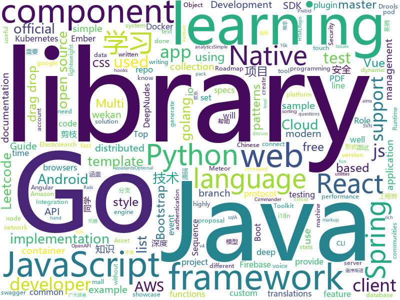

# 2019-07-10
See what the GitHub community is most excited about today.

## python
* [pipenv](https://github.com/pypa/pipenv)(**110 stars today**): Python Development Workflow for Humans.
* [insightface](https://github.com/deepinsight/insightface)(**103 stars today**): Face Analysis Project on MXNet
* [ChineseBQB](https://github.com/zhaoolee/ChineseBQB)(**339 stars today**): 🇨🇳Chinese sticker pack,More joy / 中国表情包大集合,更欢乐~
* [python_autocomplete](https://github.com/vpj/python_autocomplete)(**97 stars today**): A simple neural network for python autocompletion
* [zipline](https://github.com/quantopian/zipline)(**38 stars today**): Zipline, a Pythonic Algorithmic Trading Library
* [YOLOv3-model-pruning](https://github.com/Lam1360/YOLOv3-model-pruning)(**46 stars today**): 对 YOLOv3 做模型剪枝（network slimming），对于 oxford hand 数据集（因项目需要），模型剪枝后的参数量减少 80%，Infer 的速度达到原来 2 倍，mAP 基本不变
* [sagemaker-python-sdk](https://github.com/aws/sagemaker-python-sdk)(**2 stars today**): A library for training and deploying machine learning models on Amazon SageMaker
* [python-docs-samples](https://github.com/GoogleCloudPlatform/python-docs-samples)(**5 stars today**): Code samples used on cloud.google.com
* [celery](https://github.com/celery/celery)(**19 stars today**): Distributed Task Queue (development branch)
* [mne-python](https://github.com/mne-tools/mne-python)(**3 stars today**): MNE : Magnetoencephalography (MEG) and Electroencephalography (EEG) in Python
* [conda](https://github.com/conda/conda)(**4 stars today**): OS-agnostic, system-level binary package manager and ecosystem
* [rasa](https://github.com/RasaHQ/rasa)(**20 stars today**): 💬Open source machine learning framework to automate text- and voice-based conversations: NLU, dialogue management, connect to Slack, Facebook, and more - Create chatbots and voice assistants
* [mypy](https://github.com/python/mypy)(**12 stars today**): Optional static typing for Python 3 and 2 (PEP 484)
* [paramiko](https://github.com/paramiko/paramiko)(**14 stars today**): The leading native Python SSHv2 protocol library.
* [behave](https://github.com/behave/behave)(**9 stars today**): BDD, Python style.
* [example-code](https://github.com/fluentpython/example-code)(**9 stars today**): Example code for the book Fluent Python
* [integrations-core](https://github.com/DataDog/integrations-core)(**3 stars today**): Core integrations of the Datadog Agent
* [numpy-ml](https://github.com/ddbourgin/numpy-ml)(**301 stars today**): Machine learning, in numpy
* [fairseq](https://github.com/pytorch/fairseq)(**19 stars today**): Facebook AI Research Sequence-to-Sequence Toolkit written in Python.
* [examples](https://github.com/pytorch/examples)(**23 stars today**): A set of examples around pytorch in Vision, Text, Reinforcement Learning, etc.
* [pre-commit](https://github.com/pre-commit/pre-commit)(**5 stars today**): A framework for managing and maintaining multi-language pre-commit hooks.
* [python-patterns](https://github.com/faif/python-patterns)(**26 stars today**): A collection of design patterns/idioms in Python
* [xhtml2pdf](https://github.com/xhtml2pdf/xhtml2pdf)(**9 stars today**): A library for converting HTML into PDFs using ReportLab
* [esim-response-selection](https://github.com/alibaba/esim-response-selection)(**20 stars today**): ESIM for Multi-turn Response Selection Task
* [django-allauth](https://github.com/pennersr/django-allauth)(**9 stars today**): Integrated set of Django applications addressing authentication, registration, account management as well as 3rd party (social) account authentication.

## java
* [DeepNewdsForAndroid](https://github.com/Hengle/DeepNewdsForAndroid)(**34 stars today**): DeepNudes & deep nudes Android Source Code
* [toBeTopJavaer](https://github.com/hollischuang/toBeTopJavaer)(**123 stars today**): To Be Top Javaer - Java工程师成神之路
* [pentaho-kettle](https://github.com/pentaho/pentaho-kettle)(**9 stars today**): Pentaho Data Integration ( ETL ) a.k.a Kettle
* [interviews](https://github.com/kdn251/interviews)(**79 stars today**): Everything you need to know to get the job.
* [java](https://github.com/kubernetes-client/java)(**6 stars today**): Official Java client library for kubernetes
* [LeetCodeAnimation](https://github.com/MisterBooo/LeetCodeAnimation)(**142 stars today**): Demonstrate all the questions on LeetCode in the form of animation.（用动画的形式呈现解LeetCode题目的思路）
* [CS-Notes](https://github.com/CyC2018/CS-Notes)(**172 stars today**): 📚Tech Interview Guide 技术面试必备基础知识、Leetcode 题解、Java、C++、Python、后端面试、操作系统、计算机网络、系统设计
* [testcontainers-java](https://github.com/testcontainers/testcontainers-java)(**4 stars today**): Testcontainers is a Java library that supports JUnit tests, providing lightweight, throwaway instances of common databases, Selenium web browsers, or anything else that can run in a Docker container.
* [aws-sdk-java-v2](https://github.com/aws/aws-sdk-java-v2)(**3 stars today**): The official AWS SDK for Java - Version 2
* [cloudwatch_exporter](https://github.com/prometheus/cloudwatch_exporter)(**2 stars today**): Metrics exporter for Amazon AWS CloudWatch
* [react-native-push-notification](https://github.com/zo0r/react-native-push-notification)(**7 stars today**): React Native Local and Remote Notifications
* [parquet-mr](https://github.com/apache/parquet-mr)(**4 stars today**): Apache Parquet
* [advanced-java](https://github.com/doocs/advanced-java)(**100 stars today**): 😮互联网 Java 工程师进阶知识完全扫盲：涵盖高并发、分布式、高可用、微服务等领域知识，后端同学必看，前端同学也可学习
* [mall-learning](https://github.com/macrozheng/mall-learning)(**44 stars today**): mall学习教程，架构、业务、技术要点全方位解析。mall项目（16k+star）是一套电商系统，使用现阶段主流技术实现。 涵盖了SpringBoot2.1.3、MyBatis3.4.6、Elasticsearch6.2.2、RabbitMQ3.7.15、Redis3.2、Mongodb3.2、Mysql5.7等技术，采用Docker容器化部署。
* [drools](https://github.com/kiegroup/drools)(**2 stars today**): Drools Expert is the rule engine and Drools Fusion does complex event processing (CEP).
* [react-native-mapbox-gl](https://github.com/nitaliano/react-native-mapbox-gl)(**4 stars today**): A Mapbox GL react native module for creating custom maps
* [incubator-shardingsphere-example](https://github.com/apache/incubator-shardingsphere-example)(**5 stars today**): Sharding-Sphere examples
* [cucumber-jvm](https://github.com/cucumber/cucumber-jvm)(**4 stars today**): Cucumber for the JVM
* [SpringAll](https://github.com/wuyouzhuguli/SpringAll)(**115 stars today**): 循序渐进，学习Spring Boot、Spring Boot & Shiro、Spring Cloud、Spring Security & Spring Security OAuth2，博客Spring系列源码
* [cucumber-eclipse](https://github.com/cucumber/cucumber-eclipse)(**1 stars today**): Eclipse plugin for Cucumber
* [react-native-video](https://github.com/react-native-community/react-native-video)(**4 stars today**): A <Video /> component for react-native
* [open-liberty](https://github.com/OpenLiberty/open-liberty)(**1 stars today**): Open Liberty is a highly composable, fast to start, dynamic application server runtime environment
* [camel](https://github.com/apache/camel)(**7 stars today**): Apache Camel
* [apm-agent-java](https://github.com/elastic/apm-agent-java)(**4 stars today**): Elastic APM Java Agent

## unknown
* [xiaozhi](https://github.com/qq449245884/xiaozhi)(**52 stars today**): 
* [ansible-role-java](https://github.com/geerlingguy/ansible-role-java)(**1 stars today**): Ansible Role - Java.
* [conference](https://github.com/gopherchina/conference)(**5 stars today**): 
* [LiteratureDL4Graph](https://github.com/DeepGraphLearning/LiteratureDL4Graph)(**95 stars today**): 
* [Safety-Project-Collection](https://github.com/Bypass007/Safety-Project-Collection)(**24 stars today**): 收集一些比较优秀的开源安全项目，以帮助甲方安全从业人员构建企业安全能力。
* [weekly](https://github.com/ruanyf/weekly)(**14 stars today**): 科技爱好者周刊，每周五发布
* [ideas](https://github.com/laravel/ideas)(**2 stars today**): Issues board used for Laravel internals discussions.
* [Specs](https://github.com/CocoaPods/Specs)(**7 stars today**): The CocoaPods Master Repo
* [docs](https://github.com/nuxt/docs)(**1 stars today**): Documentation of Nuxt.js
* [computer-science](https://github.com/ossu/computer-science)(**32 stars today**): 🎓Path to a free self-taught education in Computer Science!
* [android-architecture](https://github.com/googlesamples/android-architecture)(**15 stars today**): A collection of samples to discuss and showcase different architectural tools and patterns for Android apps.
* [android-developer-roadmap](https://github.com/mobile-roadmap/android-developer-roadmap)(**49 stars today**): Android Developer Roadmap 2019
* [The-Economist](https://github.com/nailperry-zd/The-Economist)(**12 stars today**): The Economist 经济学人，持续更新
* [Data-Science--Cheat-Sheet](https://github.com/abhat222/Data-Science--Cheat-Sheet)(**54 stars today**): Cheat Sheets
* [webkit](https://github.com/WebKit/webkit)(**3 stars today**): Unofficial mirror of the WebKit SVN repository
* [swift-style-guide](https://github.com/raywenderlich/swift-style-guide)(**10 stars today**): The official Swift style guide for raywenderlich.com.
* [developer-roadmap](https://github.com/kamranahmedse/developer-roadmap)(**80 stars today**): Roadmap to becoming a web developer in 2019
* [Become-A-Full-Stack-Web-Developer](https://github.com/bmorelli25/Become-A-Full-Stack-Web-Developer)(**5 stars today**): Free resources for learning Full Stack Web Development
* [download](https://github.com/getfotiaoqiang/download)(**1 stars today**): 佛跳墙下载页
* [tdw](https://github.com/lehui99/tdw)(**2 stars today**): 
* [leetcode](https://github.com/grandyang/leetcode)(**34 stars today**): Provide all my solutions and explanations in Chinese for all the Leetcode coding problems.
* [hacker-laws](https://github.com/dwmkerr/hacker-laws)(**17 stars today**): 💻📖Laws, Theories, Principles and Patterns that developers will find useful. #hackerlaws
* [DeepNudes](https://github.com/deepfake-3687/DeepNudes)(**6 stars today**): Cracked version of DeepNudes software with everything working, free for download (Magnet Link)
* [DeepLearning-500-questions](https://github.com/scutan90/DeepLearning-500-questions)(**201 stars today**): 深度学习500问，以问答形式对常用的概率知识、线性代数、机器学习、深度学习、计算机视觉等热点问题进行阐述，以帮助自己及有需要的读者。 全书分为18个章节，50余万字。由于水平有限，书中不妥之处恳请广大读者批评指正。 未完待续............ 如有意合作，联系scutjy2015@163.com 版权所有，违权必究 Tan 2018.06
* [awesome-deep-learning](https://github.com/ChristosChristofidis/awesome-deep-learning)(**20 stars today**): A curated list of awesome Deep Learning tutorials, projects and communities.

## javascript
* [vue-design](https://github.com/HcySunYang/vue-design)(**115 stars today**): 📖master分支：《渲染器》 elegant分支：逐行级别的源码分析
* [styled-components](https://github.com/styled-components/styled-components)(**30 stars today**): Visual primitives for the component age. Use the best bits of ES6 and CSS to style your apps without stress💅
* [bootstrap-vue](https://github.com/bootstrap-vue/bootstrap-vue)(**20 stars today**): BootstrapVue, with over 40 plugins and more than 75 custom components, provides one of the most comprehensive implementations of Bootstrap v4 components and grid system for Vue.js. With extensive and automated WAI-ARIA accessibility markup.
* [amphtml](https://github.com/ampproject/amphtml)(**6 stars today**): The AMP web component framework.
* [wekan](https://github.com/wekan/wekan)(**3 stars today**): The open-source kanban (built with Meteor). NOTE: All Pull Requests should be done to master branch. Old devel branch will be removed in near future. For translations, only add PR changes to wekan/i18n/en.i18n.json , other translations are done at https://transifex.com/wekan/wekan only.
* [babel](https://github.com/babel/babel)(**20 stars today**): 🐠Babel is a compiler for writing next generation JavaScript.
* [swiper](https://github.com/nolimits4web/swiper)(**34 stars today**): Most modern mobile touch slider with hardware accelerated transitions
* [enzyme](https://github.com/airbnb/enzyme)(**9 stars today**): JavaScript Testing utilities for React
* [storybook](https://github.com/storybookjs/storybook)(**28 stars today**): UI component dev & test: React, Vue, Angular, React Native, Ember, Web Components & more!
* [puppeteer](https://github.com/GoogleChrome/puppeteer)(**47 stars today**): Headless Chrome Node API
* [Sortable](https://github.com/SortableJS/Sortable)(**26 stars today**): Sortable — is a JavaScript library for reorderable drag-and-drop lists on modern browsers and touch devices. No jQuery required. Supports Meteor, AngularJS, React, Polymer, Vue, Ember, Knockout and any CSS library, e.g. Bootstrap.
* [sentry-javascript](https://github.com/getsentry/sentry-javascript)(**13 stars today**): Official Sentry SDKs for Javascript
* [mocha](https://github.com/mochajs/mocha)(**9 stars today**): ☕️simple, flexible, fun javascript test framework for node.js & the browser
* [functions-samples](https://github.com/firebase/functions-samples)(**12 stars today**): Collection of sample apps showcasing popular use cases using Cloud Functions for Firebase
* [cucumber-js](https://github.com/cucumber/cucumber-js)(**6 stars today**): Cucumber for JavaScript
* [react-beautiful-dnd](https://github.com/atlassian/react-beautiful-dnd)(**15 stars today**): Beautiful and accessible drag and drop for lists with React
* [openlayers](https://github.com/openlayers/openlayers)(**16 stars today**): OpenLayers
* [33-js-concepts](https://github.com/leonardomso/33-js-concepts)(**20 stars today**): 📜33 concepts every JavaScript developer should know.
* [angular-drag-and-drop-lists](https://github.com/marceljuenemann/angular-drag-and-drop-lists)(**2 stars today**): Angular directives for sorting nested lists using the HTML5 Drag & Drop API
* [statsd](https://github.com/statsd/statsd)(**9 stars today**): Daemon for easy but powerful stats aggregation
* [cli](https://github.com/react-native-community/cli)(**9 stars today**): React Native command line tools
* [highcharts](https://github.com/highcharts/highcharts)(**10 stars today**): Highcharts JS, the JavaScript charting framework
* [react-native-firebase](https://github.com/invertase/react-native-firebase)(**20 stars today**): 🔥A well tested feature rich modular Firebase implementation for React Native. Supports both iOS & Android platforms for over 20 Firebase services.
* [Prebid.js](https://github.com/prebid/Prebid.js)(**1 stars today**): Setup and manage header bidding advertising partners without writing code or confusing line items. Prebid.js is open source and free.
* [Vulkan-Docs](https://github.com/KhronosGroup/Vulkan-Docs)(**2 stars today**): The Vulkan API Specification and related tools

## html
* [istio.io](https://github.com/istio/istio.io)(**1 stars today**): Source for the istio.io site
* [flutter-in-action](https://github.com/flutterchina/flutter-in-action)(**43 stars today**): 《Flutter实战》电子书
* [docs](https://github.com/aws-amplify/docs)(**1 stars today**): Amplify Framework Documentation
* [wpt](https://github.com/web-platform-tests/wpt)(**0 stars today**): Test suites for Web platform specs — including WHATWG, W3C, and others
* [Top10](https://github.com/OWASP/Top10)(**1 stars today**): Official OWASP Top 10 Document Repository
* [cypress-example-kitchensink](https://github.com/cypress-io/cypress-example-kitchensink)(**0 stars today**): This is an example app used to showcase Cypress.io testing.
* [proposal-pipeline-operator](https://github.com/tc39/proposal-pipeline-operator)(**3 stars today**): A proposal for adding the simple-but-useful pipeline operator to JavaScript.
* [swagger-codegen](https://github.com/swagger-api/swagger-codegen)(**11 stars today**): swagger-codegen contains a template-driven engine to generate documentation, API clients and server stubs in different languages by parsing your OpenAPI / Swagger definition.
* [JS-Group-Project](https://github.com/icecoffee92/JS-Group-Project)(**0 stars today**): 
* [proposal-object-values-entries](https://github.com/tc39/proposal-object-values-entries)(**0 stars today**): ECMAScript Proposal, specs, and reference implementation for Object.values/Object.entries
* [posterdown](https://github.com/brentthorne/posterdown)(**3 stars today**): Use RMarkdown to generate PDF Conference Posters via HTML
* [Home](https://github.com/NuGet/Home)(**1 stars today**): Repo for NuGet Client issues
* [twitter-bootstrap-rails](https://github.com/seyhunak/twitter-bootstrap-rails)(**2 stars today**): Twitter Bootstrap for Rails 5 - 4.x Asset Pipeline
* [stickyfill](https://github.com/wilddeer/stickyfill)(**1 stars today**): Polyfill for CSS `position: sticky`
* [moveit_tutorials](https://github.com/ros-planning/moveit_tutorials)(**0 stars today**): A sphinx-based centralized documentation repo for MoveIt
* [bibanon](https://github.com/bibanon/bibanon)(**0 stars today**): The Bibliotheca Anonoma: A wikified library of the internet's treasures. Researching Something Awful, 2channel, 4chan, and other imageboard/textboard communities.
* [test_files](https://github.com/SheetJS/test_files)(**0 stars today**): 📚SheetJS Test Files (XLS/XLSX/XLSB and other spreadsheet formats)
* [policy-templates](https://github.com/mozilla/policy-templates)(**8 stars today**): Policy Templates for Firefox
* [glTF](https://github.com/KhronosGroup/glTF)(**2 stars today**): glTF – Runtime 3D Asset Delivery
* [terraform-website](https://github.com/hashicorp/terraform-website)(**0 stars today**): Prototype of Terraform website being assembled from multiple repositories
* [learning-area](https://github.com/mdn/learning-area)(**2 stars today**): Github repo for the MDN Learning Area.
* [labstreaminglayer](https://github.com/sccn/labstreaminglayer)(**1 stars today**): LabStreamingLayer super repository comprising submodules for LSL and associated apps.
* [okta-aws-cli-assume-role](https://github.com/oktadeveloper/okta-aws-cli-assume-role)(**1 stars today**): Okta AWS CLI Assume Role Tool
* [docs](https://github.com/knative/docs)(**12 stars today**): User documentation for Knative components
* [elasticsearch-definitive-guide](https://github.com/elastic/elasticsearch-definitive-guide)(**1 stars today**): The Definitive Guide to Elasticsearch

## go
* [pan-light](https://github.com/peterq/pan-light)(**487 stars today**): 百度网盘不限速客户端, golang + qt5, 跨平台图形界面
* [cobra](https://github.com/spf13/cobra)(**63 stars today**): A Commander for modern Go CLI interactions
* [gin](https://github.com/gin-gonic/gin)(**78 stars today**): Gin is a HTTP web framework written in Go (Golang). It features a Martini-like API with much better performance -- up to 40 times faster. If you need smashing performance, get yourself some Gin.
* [dep](https://github.com/golang/dep)(**32 stars today**): Go dependency management tool
* [aws-sdk-go](https://github.com/aws/aws-sdk-go)(**19 stars today**): AWS SDK for the Go programming language.
* [kops](https://github.com/kubernetes/kops)(**46 stars today**): Kubernetes Operations (kops) - Production Grade K8s Installation, Upgrades, and Management
* [grpc-go](https://github.com/grpc/grpc-go)(**34 stars today**): The Go language implementation of gRPC. HTTP/2 based RPC
* [protobuf](https://github.com/golang/protobuf)(**29 stars today**): Go support for Google's protocol buffers
* [beats](https://github.com/elastic/beats)(**29 stars today**): 🐠Beats - Lightweight shippers for Elasticsearch & Logstash
* [consul](https://github.com/hashicorp/consul)(**36 stars today**): Consul is a distributed, highly available, and data center aware solution to connect and configure applications across dynamic, distributed infrastructure.
* [gorm](https://github.com/jinzhu/gorm)(**26 stars today**): The fantastic ORM library for Golang, aims to be developer friendly
* [cf-deployment](https://github.com/cloudfoundry/cf-deployment)(**2 stars today**): The canonical open source deployment manifest for Cloud Foundry
* [opencensus-go](https://github.com/census-instrumentation/opencensus-go)(**2 stars today**): A stats collection and distributed tracing framework
* [influxdb](https://github.com/influxdata/influxdb)(**12 stars today**): Scalable datastore for metrics, events, and real-time analytics
* [errors](https://github.com/pkg/errors)(**12 stars today**): Simple error handling primitives
* [yaml](https://github.com/go-yaml/yaml)(**6 stars today**): YAML support for the Go language.
* [redis](https://github.com/go-redis/redis)(**17 stars today**): Type-safe Redis client for Golang
* [sqlx](https://github.com/jmoiron/sqlx)(**14 stars today**): general purpose extensions to golang's database/sql
* [testify](https://github.com/stretchr/testify)(**13 stars today**): A toolkit with common assertions and mocks that plays nicely with the standard library
* [gocql](https://github.com/gocql/gocql)(**5 stars today**): Package gocql implements a fast and robust Cassandra client for the Go programming language.
* [stern](https://github.com/wercker/stern)(**18 stars today**): ⎈ Multi pod and container log tailing for Kubernetes
* [sprig](https://github.com/Masterminds/sprig)(**12 stars today**): Useful template functions for Go templates.
* [libpod](https://github.com/containers/libpod)(**5 stars today**): libpod is a library used to create container pods. Home of Podman.
* [installer](https://github.com/openshift/installer)(**3 stars today**): Install an OpenShift cluster
* [aws-iam-authenticator](https://github.com/kubernetes-sigs/aws-iam-authenticator)(**6 stars today**): A tool to use AWS IAM credentials to authenticate to a Kubernetes cluster

## WordCloud

