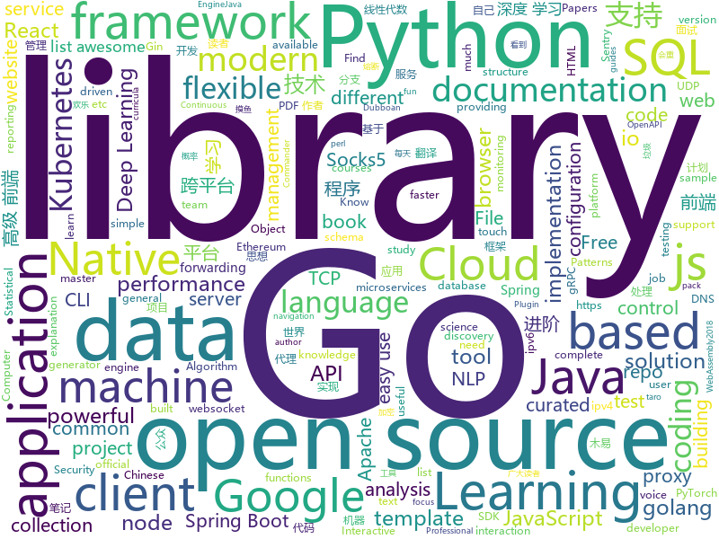

# 2019-07-11
See what the GitHub community is most excited about today.

## python
* [pepenude](https://github.com/deep-man-yy/pepenude)(**99 stars today**): PepeNude is an application that allows you to transform photos into entertaining results. CLI and GUI versions available.
* [sherlock](https://github.com/sherlock-project/sherlock)(**149 stars today**): 🔎Find usernames across social networks
* [jupyterhub](https://github.com/jupyterhub/jupyterhub)(**44 stars today**): Multi-user server for Jupyter notebooks
* [BigGAN-PyTorch](https://github.com/ajbrock/BigGAN-PyTorch)(**12 stars today**): The author's officially unofficial PyTorch BigGAN implementation.
* [google-api-python-client](https://github.com/googleapis/google-api-python-client)(**11 stars today**): 🐍The official Python client library for Google's discovery based APIs.
* [sentry](https://github.com/getsentry/sentry)(**16 stars today**): Sentry is cross-platform application monitoring, with a focus on error reporting.
* [yolov3](https://github.com/ultralytics/yolov3)(**14 stars today**): YOLOv3 in PyTorch > ONNX > CoreML > iOS
* [scikit-learn](https://github.com/scikit-learn/scikit-learn)(**25 stars today**): scikit-learn: machine learning in Python
* [rasa](https://github.com/RasaHQ/rasa)(**16 stars today**): 💬Open source machine learning framework to automate text- and voice-based conversations: NLU, dialogue management, connect to Slack, Facebook, and more - Create chatbots and voice assistants
* [gensim](https://github.com/RaRe-Technologies/gensim)(**17 stars today**): Topic Modelling for Humans
* [sentry-python](https://github.com/getsentry/sentry-python)(**5 stars today**): The new Python SDK for Sentry.io
* [ChineseBQB](https://github.com/zhaoolee/ChineseBQB)(**189 stars today**): 🇨🇳Chinese sticker pack,More joy / 中国表情包大集合,更欢乐~
* [pandas](https://github.com/pandas-dev/pandas)(**24 stars today**): Flexible and powerful data analysis / manipulation library for Python, providing labeled data structures similar to R data.frame objects, statistical functions, and much more
* [insightface](https://github.com/deepinsight/insightface)(**116 stars today**): Face Analysis Project on MXNet
* [mypy](https://github.com/python/mypy)(**9 stars today**): Optional static typing for Python 3 and 2 (PEP 484)
* [d2l-en](https://github.com/d2l-ai/d2l-en)(**7 stars today**): Dive into Deep Learning: an interactive deep learning book with code, math, and discussions
* [agents](https://github.com/tensorflow/agents)(**7 stars today**): TF-Agents is a library for Reinforcement Learning in TensorFlow
* [dvc](https://github.com/iterative/dvc)(**14 stars today**): 🦉Data Version Control | Git for Data & Models
* [pyodide](https://github.com/iodide-project/pyodide)(**7 stars today**): The Python scientific stack, compiled to WebAssembly
* [Algorithm_Interview_Notes-Chinese](https://github.com/imhuay/Algorithm_Interview_Notes-Chinese)(**44 stars today**): 2018/2019/校招/春招/秋招/算法/机器学习(Machine Learning)/深度学习(Deep Learning)/自然语言处理(NLP)/C/C++/Python/面试笔记
* [zipline](https://github.com/quantopian/zipline)(**7 stars today**): Zipline, a Pythonic Algorithmic Trading Library
* [home-assistant](https://github.com/home-assistant/home-assistant)(**38 stars today**): 🏡Open source home automation that puts local control and privacy first
* [OpsManage](https://github.com/welliamcao/OpsManage)(**14 stars today**): 自动化运维平台: 代码及应用部署CI/CD、资产管理CMDB、计划任务管理平台、SQL审核|回滚、任务调度、站内WIKI
* [records](https://github.com/kennethreitz/records)(**15 stars today**): SQL for Humans™
* [google-cloud-python](https://github.com/googleapis/google-cloud-python)(**4 stars today**): Google Cloud Client Library for Python

## java
* [staffjoy](https://github.com/spring2go/staffjoy)(**147 stars today**): 微服务和云原生架构教学案例项目，基于Spring Boot和Kubernetes技术栈
* [tech-weekly](https://github.com/mercyblitz/tech-weekly)(**60 stars today**): 「小马哥技术周报」
* [antlr4](https://github.com/antlr/antlr4)(**33 stars today**): ANTLR (ANother Tool for Language Recognition) is a powerful parser generator for reading, processing, executing, or translating structured text or binary files.
* [CtCI-6th-Edition](https://github.com/careercup/CtCI-6th-Edition)(**5 stars today**): Cracking the Coding Interview 6th Ed. Solutions
* [beam](https://github.com/apache/beam)(**5 stars today**): Apache Beam
* [interviews](https://github.com/kdn251/interviews)(**101 stars today**): Everything you need to know to get the job.
* [smile](https://github.com/haifengl/smile)(**7 stars today**): Statistical Machine Intelligence & Learning Engine
* [jna](https://github.com/java-native-access/jna)(**8 stars today**): Java Native Access
* [uid-generator](https://github.com/baidu/uid-generator)(**23 stars today**): UniqueID generator
* [RxAndroid](https://github.com/ReactiveX/RxAndroid)(**12 stars today**): RxJava bindings for Android
* [nifi](https://github.com/apache/nifi)(**5 stars today**): Mirror of Apache NiFi
* [camel](https://github.com/apache/camel)(**4 stars today**): Apache Camel
* [dubbo-admin](https://github.com/apache/dubbo-admin)(**4 stars today**): The ops and reference implementation for Apache Dubbo
* [nacos](https://github.com/alibaba/nacos)(**22 stars today**): an easy-to-use dynamic service discovery, configuration and service management platform for building cloud native applications.
* [spring-boot](https://github.com/spring-projects/spring-boot)(**42 stars today**): Spring Boot
* [CoreNLP](https://github.com/stanfordnlp/CoreNLP)(**8 stars today**): Stanford CoreNLP: A Java suite of core NLP tools.
* [Sentinel](https://github.com/alibaba/Sentinel)(**27 stars today**): A lightweight powerful flow control component enabling reliability and monitoring for microservices. (轻量级的流量控制、熔断降级 Java 库)
* [BaseRecyclerViewAdapterHelper](https://github.com/CymChad/BaseRecyclerViewAdapterHelper)(**13 stars today**): BRVAH:Powerful and flexible RecyclerAdapter
* [lucene-solr](https://github.com/apache/lucene-solr)(**8 stars today**): Mirror of Apache Lucene + Solr
* [janusgraph](https://github.com/JanusGraph/janusgraph)(**9 stars today**): JanusGraph: an open-source, distributed graph database
* [android-testing](https://github.com/googlesamples/android-testing)(**6 stars today**): A collection of samples demonstrating different frameworks and techniques for automated testing
* [poli](https://github.com/shzlw/poli)(**8 stars today**): An easy-to-use SQL reporting application built for SQL lovers. Power data analysis in SQL and gain faster business insights.
* [spring-cloud-gateway](https://github.com/spring-cloud/spring-cloud-gateway)(**6 stars today**): A Gateway built on Spring Framework 5.x and Spring Boot 2.x providing routing and more.
* [onemall](https://github.com/YunaiV/onemall)(**21 stars today**): mall 商城，基于微服务的思想，构建在 B2C 电商场景下的项目实战。核心技术栈，是 Spring Boot + Dubbo 。未来，会重构成 Spring Cloud Alibaba 。
* [easyexcel](https://github.com/alibaba/easyexcel)(**42 stars today**): 快速、简单避免OOM的java处理Excel工具

## unknown
* [nlp-library](https://github.com/mihail911/nlp-library)(**66 stars today**): curated collection of papers for the nlp practitioner📖👩‍🔬
* [frontend-challenges](https://github.com/felipefialho/frontend-challenges)(**72 stars today**): 💥Listing some playful open-source's challenges of jobs to test your knowledge
* [blog](https://github.com/yygmind/blog)(**168 stars today**): 我是木易杨，公众号「高级前端进阶」作者，跟着我每周重点攻克一个前端面试重难点。接下来让我带你走进高级前端的世界，在进阶的路上，共勉！
* [android-developer-roadmap](https://github.com/mobile-roadmap/android-developer-roadmap)(**41 stars today**): Android Developer Roadmap 2019
* [Specs](https://github.com/CocoaPods/Specs)(**20 stars today**): The CocoaPods Master Repo
* [you-dont-know-js-ru](https://github.com/azat-io/you-dont-know-js-ru)(**14 stars today**): 📚Russian translation of "You Don't Know JS" book series
* [xiaozhi](https://github.com/qq449245884/xiaozhi)(**30 stars today**): 
* [hacker-laws](https://github.com/dwmkerr/hacker-laws)(**13 stars today**): 💻📖Laws, Theories, Principles and Patterns that developers will find useful. #hackerlaws
* [coding-interview-university](https://github.com/jwasham/coding-interview-university)(**78 stars today**): A complete computer science study plan to become a software engineer.
* [leetcode](https://github.com/grandyang/leetcode)(**15 stars today**): Provide all my solutions and explanations in Chinese for all the Leetcode coding problems.
* [Data-Science--Cheat-Sheet](https://github.com/abhat222/Data-Science--Cheat-Sheet)(**19 stars today**): Cheat Sheets
* [everyone-can-use-english](https://github.com/xiaolai/everyone-can-use-english)(**7 stars today**): 人人都能用英语
* [udacity-nanodegrees](https://github.com/mikesprague/udacity-nanodegrees)(**6 stars today**): 🎓List of Udacity Nanodegree programs with links to the free courses in their curricula
* [DeepLearning-500-questions](https://github.com/scutan90/DeepLearning-500-questions)(**307 stars today**): 深度学习500问，以问答形式对常用的概率知识、线性代数、机器学习、深度学习、计算机视觉等热点问题进行阐述，以帮助自己及有需要的读者。 全书分为18个章节，50余万字。由于水平有限，书中不妥之处恳请广大读者批评指正。 未完待续............ 如有意合作，联系scutjy2015@163.com 版权所有，违权必究 Tan 2018.06
* [gold-miner](https://github.com/xitu/gold-miner)(**30 stars today**): 🥇掘金翻译计划，可能是世界最大最好的英译中技术社区，最懂读者和译者的翻译平台：
* [awesome-courses](https://github.com/prakhar1989/awesome-courses)(**19 stars today**): 📚List of awesome university courses for learning Computer Science!
* [wiki](https://github.com/ethereum/wiki)(**4 stars today**): The Ethereum Wiki
* [design-patterns-for-humans](https://github.com/kamranahmedse/design-patterns-for-humans)(**28 stars today**): An ultra-simplified explanation to design patterns
* [awesome-programming-books](https://github.com/royeo/awesome-programming-books)(**14 stars today**): 📚经典技术书籍 PDF 文件，持续更新...
* [996.Leave](https://github.com/623637646/996.Leave)(**4 stars today**): 逃离996
* [ganhacks](https://github.com/soumith/ganhacks)(**15 stars today**): starter from "How to Train a GAN?" at NIPS2016
* [azure-pipelines-yaml](https://github.com/microsoft/azure-pipelines-yaml)(**2 stars today**): Azure Pipelines YAML examples, templates, and community interaction
* [ru-test-assignments](https://github.com/Hexlet/ru-test-assignments)(**0 stars today**): Тестовые задания для самостоятельного выполнения от разных it компаний
* [OnJava8](https://github.com/LingCoder/OnJava8)(**10 stars today**): 《On Java 8》中文版，又名《Java编程思想》 第5版
* [awesome-deep-learning](https://github.com/ChristosChristofidis/awesome-deep-learning)(**16 stars today**): A curated list of awesome Deep Learning tutorials, projects and communities.

## javascript
* [Garbage](https://github.com/qi19901212/Garbage)(**102 stars today**): 小程序云开发的垃圾分类小程序
* [Daily-Interview-Question](https://github.com/Advanced-Frontend/Daily-Interview-Question)(**765 stars today**): 我是木易杨，公众号「高级前端进阶」作者，每天搞定一道前端大厂面试题，祝大家天天进步，一年后会看到不一样的自己。
* [d3](https://github.com/d3/d3)(**56 stars today**): Bring data to life with SVG, Canvas and HTML.📊📈🎉
* [awx](https://github.com/ansible/awx)(**24 stars today**): AWX Project
* [lodash](https://github.com/lodash/lodash)(**66 stars today**): A modern JavaScript utility library delivering modularity, performance, & extras.
* [mapbox-gl-js](https://github.com/mapbox/mapbox-gl-js)(**14 stars today**): Interactive, thoroughly customizable maps in the browser, powered by vector tiles and WebGL
* [react](https://github.com/facebook/react)(**80 stars today**): A declarative, efficient, and flexible JavaScript library for building user interfaces.
* [tech-interview-handbook](https://github.com/yangshun/tech-interview-handbook)(**34 stars today**): 💯Algorithms study materials, behavioral content and tips for rocking your coding interview
* [react-navigation](https://github.com/react-navigation/react-navigation)(**13 stars today**): Routing and navigation for your React Native apps
* [axios](https://github.com/axios/axios)(**61 stars today**): Promise based HTTP client for the browser and node.js
* [parcel](https://github.com/parcel-bundler/parcel)(**10 stars today**): 📦🚀Blazing fast, zero configuration web application bundler
* [mocha](https://github.com/mochajs/mocha)(**8 stars today**): ☕️simple, flexible, fun javascript test framework for node.js & the browser
* [Rocket.Chat](https://github.com/RocketChat/Rocket.Chat)(**23 stars today**): The ultimate Free Open Source Solution for team communications.
* [juice-shop](https://github.com/bkimminich/juice-shop)(**10 stars today**): OWASP Juice Shop: Probably the most modern and sophisticated insecure web application
* [Thief-Book](https://github.com/cteams/Thief-Book)(**47 stars today**): 一款真正的跨平台摸鱼神器
* [taro](https://github.com/NervJS/taro)(**38 stars today**): 多端统一开发框架，支持用 React 的开发方式编写一次代码，生成能运行在微信/百度/支付宝/字节跳动小程序、H5、React Native 等的应用。 https://taro.jd.com/
* [vue-design](https://github.com/HcySunYang/vue-design)(**56 stars today**): 📖master分支：《渲染器》 elegant分支：逐行级别的源码分析
* [swiper](https://github.com/nolimits4web/swiper)(**16 stars today**): Most modern mobile touch slider with hardware accelerated transitions
* [Verly.js](https://github.com/anuraghazra/Verly.js)(**25 stars today**): 🔴〰️🔵〰️⚫️Easy to integrate Verlet physics engine.🔗
* [yup](https://github.com/jquense/yup)(**18 stars today**): Dead simple Object schema validation
* [cypress-example-recipes](https://github.com/cypress-io/cypress-example-recipes)(**5 stars today**): Various recipes for testing common scenarios with Cypress
* [Sortable](https://github.com/SortableJS/Sortable)(**25 stars today**): Sortable — is a JavaScript library for reorderable drag-and-drop lists on modern browsers and touch devices. No jQuery required. Supports Meteor, AngularJS, React, Polymer, Vue, Ember, Knockout and any CSS library, e.g. Bootstrap.
* [sequelize](https://github.com/sequelize/sequelize)(**17 stars today**): An easy-to-use multi SQL dialect ORM for Node.js
* [monaco-editor](https://github.com/microsoft/monaco-editor)(**26 stars today**): A browser based code editor
* [gutenberg](https://github.com/WordPress/gutenberg)(**3 stars today**): The Block Editor project for WordPress and beyond. Plugin is available from the official repository.

## html
* [professional-services](https://github.com/GoogleCloudPlatform/professional-services)(**1 stars today**): Common solutions and tools developed by Google Cloud's Professional Services team
* [front-end-handbook-2019](https://github.com/FrontendMasters/front-end-handbook-2019)(**9 stars today**): [Book] 2019 edition of our front-end development handbook
* [docs](https://github.com/knative/docs)(**0 stars today**): User documentation for Knative components
* [18.06-linalg-notes](https://github.com/apachecn/18.06-linalg-notes)(**2 stars today**): MIT-18.06-线性代数-完整笔记
* [istio.io](https://github.com/istio/istio.io)(**1 stars today**): Source for the istio.io site
* [styleguide](https://github.com/google/styleguide)(**16 stars today**): Style guides for Google-originated open-source projects
* [JavaScript30](https://github.com/wesbos/JavaScript30)(**15 stars today**): 30 Day Vanilla JS Challenge
* [DIGITS](https://github.com/NVIDIA/DIGITS)(**2 stars today**): Deep Learning GPU Training System
* [html](https://github.com/whatwg/html)(**1 stars today**): HTML Standard
* [DetectionLab](https://github.com/clong/DetectionLab)(**10 stars today**): Vagrant & Packer scripts to build a lab environment complete with security tooling and logging best practices
* [lottie](https://github.com/airbnb/lottie)(**3 stars today**): Lottie documentation for http://airbnb.io/lottie
* [webProject](https://github.com/YUUXIAO/webProject)(**5 stars today**): 记录我在学习前端过程中做过的小demo，js部分全用源生js实现。
* [sample-code](https://github.com/appium-boneyard/sample-code)(**2 stars today**): appium sample code (dotnet, java, node, perl, php, python, ruby, etc.)
* [chosen](https://github.com/harvesthq/chosen)(**4 stars today**): Chosen is a library for making long, unwieldy select boxes more friendly.
* [pdfs](https://github.com/tpn/pdfs)(**1 stars today**): Technically-oriented PDF Collection (Papers, Specs, Decks, Manuals, etc)
* [website](https://github.com/kubernetes/website)(**1 stars today**): Kubernetes website and documentation repo:
* [proposal-class-fields](https://github.com/tc39/proposal-class-fields)(**1 stars today**): Orthogonally-informed combination of public and private fields proposals
* [schemaorg](https://github.com/schemaorg/schemaorg)(**2 stars today**): Schema.org - schemas and (appengine) software
* [css-grid](https://github.com/wesbos/css-grid)(**0 stars today**): Starter Files + Solutions to my CSSGrid.io Course
* [moveit_tutorials](https://github.com/ros-planning/moveit_tutorials)(**1 stars today**): A sphinx-based centralized documentation repo for MoveIt
* [swagger-codegen](https://github.com/swagger-api/swagger-codegen)(**10 stars today**): swagger-codegen contains a template-driven engine to generate documentation, API clients and server stubs in different languages by parsing your OpenAPI / Swagger definition.
* [awesome-angular](https://github.com/PatrickJS/awesome-angular)(**1 stars today**): 📄A curated list of awesome Angular resources
* [js-xss](https://github.com/leizongmin/js-xss)(**2 stars today**): Sanitize untrusted HTML (to prevent XSS) with a configuration specified by a Whitelist
* [TheHive](https://github.com/TheHive-Project/TheHive)(**4 stars today**): TheHive: a Scalable, Open Source and Free Security Incident Response Platform
* [computer-science-flash-cards](https://github.com/jwasham/computer-science-flash-cards)(**2 stars today**): Mini website for testing both general CS knowledge and enforce coding practice and common algorithm/data structure memorization.

## go
* [cobra](https://github.com/spf13/cobra)(**87 stars today**): A Commander for modern Go CLI interactions
* [pan-light](https://github.com/peterq/pan-light)(**434 stars today**): 百度网盘不限速客户端, golang + qt5, 跨平台图形界面
* [gin](https://github.com/gin-gonic/gin)(**59 stars today**): Gin is a HTTP web framework written in Go (Golang). It features a Martini-like API with much better performance -- up to 40 times faster. If you need smashing performance, get yourself some Gin.
* [protobuf](https://github.com/golang/protobuf)(**21 stars today**): Go support for Google's protocol buffers
* [hugo](https://github.com/gohugoio/hugo)(**39 stars today**): The world’s fastest framework for building websites.
* [sprig](https://github.com/Masterminds/sprig)(**16 stars today**): Useful template functions for Go templates.
* [learn-go-with-tests](https://github.com/quii/learn-go-with-tests)(**29 stars today**): Learn Go with test-driven development
* [grpc-gateway](https://github.com/grpc-ecosystem/grpc-gateway)(**16 stars today**): gRPC to JSON proxy generator following the gRPC HTTP spec
* [elastic](https://github.com/olivere/elastic)(**8 stars today**): Elasticsearch client for Go.
* [syncthing](https://github.com/syncthing/syncthing)(**35 stars today**): Open Source Continuous File Synchronization
* [snow](https://github.com/qit-team/snow)(**25 stars today**): 简洁易用的Go业务框架
* [eksctl](https://github.com/weaveworks/eksctl)(**6 stars today**): a CLI for Amazon EKS
* [aws-sdk-go](https://github.com/aws/aws-sdk-go)(**9 stars today**): AWS SDK for the Go programming language.
* [grpc-go](https://github.com/grpc/grpc-go)(**22 stars today**): The Go language implementation of gRPC. HTTP/2 based RPC
* [kit](https://github.com/go-kit/kit)(**16 stars today**): A standard library for microservices.
* [flux](https://github.com/fluxcd/flux)(**16 stars today**): The GitOps Kubernetes operator
* [node_exporter](https://github.com/prometheus/node_exporter)(**9 stars today**): Exporter for machine metrics
* [goproxy](https://github.com/snail007/goproxy)(**11 stars today**): Proxy is a high performance HTTP(S), websocket,TCP, UDP,Secure DNS,Socks5 proxy server .Chain-style proxies,nat forwarding in different lan,TCP/UDP port forwarding, SSH forwarding ,ipv4 and ipv6 supporting .Proxy是golang实现的高性能http,https,websocket,tcp,防污染DNS,socks5代理服务器,支持内网穿透,链式代理,通讯加密,智能HTTP,SOCKS5代理,前置CDN,域名黑白名单,跨平台,KCP协议支持,支持ipv4和ipv6,集成外部API。
* [sqlx](https://github.com/jmoiron/sqlx)(**5 stars today**): general purpose extensions to golang's database/sql
* [dep](https://github.com/golang/dep)(**18 stars today**): Go dependency management tool
* [singularity](https://github.com/sylabs/singularity)(**7 stars today**): Singularity: Application containers for Linux
* [redis](https://github.com/go-redis/redis)(**16 stars today**): Type-safe Redis client for Golang
* [sealed-secrets](https://github.com/bitnami-labs/sealed-secrets)(**13 stars today**): A Kubernetes controller and tool for one-way encrypted Secrets
* [go-ethereum](https://github.com/ethereum/go-ethereum)(**25 stars today**): Official Go implementation of the Ethereum protocol
* [cockroach](https://github.com/cockroachdb/cockroach)(**11 stars today**): CockroachDB - the open source, cloud-native SQL database.

## WordCloud

