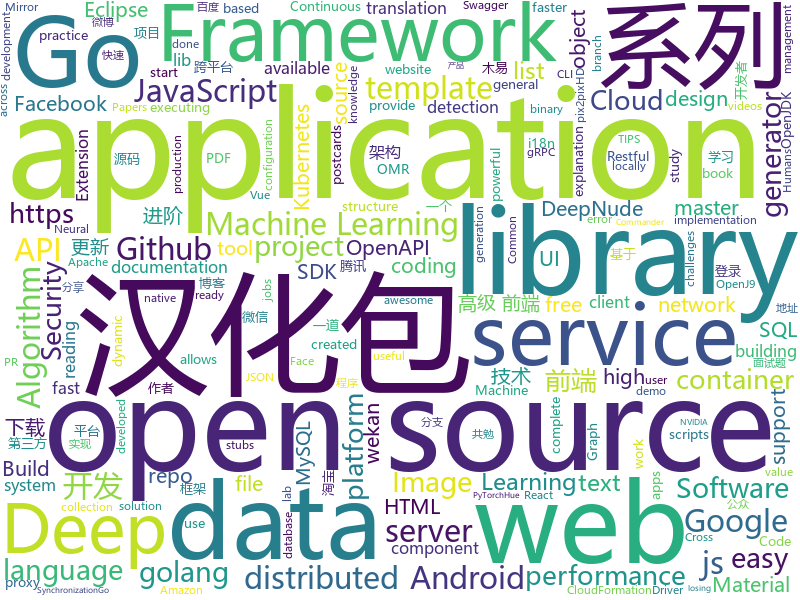

# 2019-07-12
See what the GitHub community is most excited about today.

## python
* [pepenude](https://github.com/deep-man-yy/pepenude)(**110 stars today**): PepeNude is an application that allows you to transform photos into entertaining results. CLI and GUI versions available.
* [sherlock](https://github.com/sherlock-project/sherlock)(**185 stars today**): 🔎Find usernames across social networks
* [DeepNude-an-Image-to-Image-technology](https://github.com/yuanxiaosc/DeepNude-an-Image-to-Image-technology)(**173 stars today**): DeepNude's pix2pixHD algorithms(proposed by NVIDIA) and general-purpose Image-to-Image theory and practice research. DeepNude的pix2pixHD算法（英伟达提出）以及通用的Image-to-Image理论与实践研究。
* [insightface](https://github.com/deepinsight/insightface)(**65 stars today**): Face Analysis Project on MXNet
* [faceswap](https://github.com/deepfakes/faceswap)(**66 stars today**): Deepfakes Software For All
* [DeepFaceLab](https://github.com/iperov/DeepFaceLab)(**62 stars today**): DeepFaceLab is a tool that utilizes machine learning to replace faces in videos. Includes prebuilt ready to work standalone Windows 7,8,10 binary (look readme.md).
* [Awesome-WAF](https://github.com/0xInfection/Awesome-WAF)(**12 stars today**): 🔥Everything awesome about web-application firewalls (WAF).
* [aws-cloudformation-templates](https://github.com/awslabs/aws-cloudformation-templates)(**9 stars today**): A collection of useful CloudFormation templates
* [pipenv](https://github.com/pypa/pipenv)(**12 stars today**): Python Development Workflow for Humans.
* [pytorch_geometric](https://github.com/rusty1s/pytorch_geometric)(**22 stars today**): Geometric Deep Learning Extension Library for PyTorch
* [hue](https://github.com/cloudera/hue)(**9 stars today**): Hue is an open source SQL Cloud Assistant for developing and accessing SQL/Data Apps.
* [DeepNude_NoWatermark_withModel](https://github.com/zhengyima/DeepNude_NoWatermark_withModel)(**127 stars today**): DeepNude源码，去水印，附demo演示地址，带三个模型文件下载地址 (cm.lib, mm.lib, mn.lib), 离线运行，下载即跑，基于GAN的一行命令给小姐姐"换"衣服。
* [deep_nude](https://github.com/lwlodo/deep_nude)(**13 stars today**): 
* [TensorFlow-Object-Detection-API-Tutorial-Train-Multiple-Objects-Windows-10](https://github.com/EdjeElectronics/TensorFlow-Object-Detection-API-Tutorial-Train-Multiple-Objects-Windows-10)(**6 stars today**): How to train a TensorFlow Object Detection Classifier for multiple object detection on Windows
* [jupyterhub](https://github.com/jupyterhub/jupyterhub)(**25 stars today**): Multi-user server for Jupyter notebooks
* [CheatSheetSeries](https://github.com/OWASP/CheatSheetSeries)(**48 stars today**): The OWASP Cheat Sheet Series was created to provide a concise collection of high value information on specific application security topics.
* [anomaly-detection-resources](https://github.com/yzhao062/anomaly-detection-resources)(**10 stars today**): Anomaly detection related books, papers, videos, and toolboxes
* [PayloadsAllTheThings](https://github.com/swisskyrepo/PayloadsAllTheThings)(**22 stars today**): A list of useful payloads and bypass for Web Application Security and Pentest/CTF
* [redis-rce](https://github.com/Ridter/redis-rce)(**24 stars today**): Redis 4.x/5.x RCE
* [app_spider](https://github.com/xingag/app_spider)(**8 stars today**): a spider on the apps
* [troposphere](https://github.com/cloudtools/troposphere)(**11 stars today**): troposphere - Python library to create AWS CloudFormation descriptions
* [boto3](https://github.com/boto/boto3)(**6 stars today**): AWS SDK for Python
* [google-research](https://github.com/google-research/google-research)(**23 stars today**): Google AI Research
* [azure-sdk-for-python](https://github.com/Azure/azure-sdk-for-python)(**6 stars today**): Microsoft Azure SDK for Python
* [gensim](https://github.com/RaRe-Technologies/gensim)(**11 stars today**): Topic Modelling for Humans

## java
* [vhr](https://github.com/lenve/vhr)(**330 stars today**): 微人事是一个前后端分离的人力资源管理系统，项目采用SpringBoot+Vue开发。
* [SoloPi](https://github.com/alipay/SoloPi)(**213 stars today**): Soloπ 自动化测试工具
* [DeepNewdsForAndroid](https://github.com/Hengle/DeepNewdsForAndroid)(**34 stars today**): DeepNudes & deep nudes Android Source Code
* [micronaut-core](https://github.com/micronaut-projects/micronaut-core)(**27 stars today**): Micronaut Application Framework
* [QMUI_Android](https://github.com/Tencent/QMUI_Android)(**28 stars today**): 提高 Android UI 开发效率的 UI 库
* [janusgraph](https://github.com/JanusGraph/janusgraph)(**9 stars today**): JanusGraph: an open-source, distributed graph database
* [staffjoy](https://github.com/spring2go/staffjoy)(**79 stars today**): 微服务和云原生架构教学案例项目，基于Spring Boot和Kubernetes技术栈
* [hazelcast](https://github.com/hazelcast/hazelcast)(**9 stars today**): Open Source In-Memory Data Grid
* [uid-generator](https://github.com/baidu/uid-generator)(**39 stars today**): UniqueID generator
* [cucumber-jvm](https://github.com/cucumber/cucumber-jvm)(**5 stars today**): Cucumber for the JVM
* [liugh-parent](https://github.com/qq53182347/liugh-parent)(**17 stars today**): SpringBoot+JWT+Shiro+MybatisPlus实现Restful快速开发后端脚手架
* [antlr4](https://github.com/antlr/antlr4)(**33 stars today**): ANTLR (ANother Tool for Language Recognition) is a powerful parser generator for reading, processing, executing, or translating structured text or binary files.
* [JustAuth](https://github.com/zhangyd-c/JustAuth)(**73 stars today**): 💯史上最全的整合第三方登录的工具,目前已支持Github、Gitee、微博、钉钉、百度、Coding、腾讯云开发者平台、OSChina、支付宝、QQ、微信、淘宝、Google、Facebook、抖音、领英、小米、微软和今日头条等第三方平台的授权登录。 Login, so easy!
* [beam](https://github.com/apache/beam)(**9 stars today**): Apache Beam
* [h2o-3](https://github.com/h2oai/h2o-3)(**5 stars today**): Open Source Fast Scalable Machine Learning Platform For Smarter Applications: Deep Learning, Gradient Boosting & XGBoost, Random Forest, Generalized Linear Modeling (Logistic Regression, Elastic Net), K-Means, PCA, Stacked Ensembles, Automatic Machine Learning (AutoML), etc.
* [nacos](https://github.com/alibaba/nacos)(**23 stars today**): an easy-to-use dynamic service discovery, configuration and service management platform for building cloud native applications.
* [openapi-generator](https://github.com/OpenAPITools/openapi-generator)(**19 stars today**): OpenAPI Generator allows generation of API client libraries (SDK generation), server stubs, documentation and configuration automatically given an OpenAPI Spec (v2, v3)
* [dropwizard](https://github.com/dropwizard/dropwizard)(**8 stars today**): A damn simple library for building production-ready RESTful web services.
* [tink](https://github.com/google/tink)(**10 stars today**): Tink is a multi-language, cross-platform, open source library that provides cryptographic APIs that are secure, easy to use correctly, and hard(er) to misuse.
* [jetty.project](https://github.com/eclipse/jetty.project)(**3 stars today**): Eclipse Jetty® - Web Container & Clients - supports HTTP/2, HTTP/1.1, HTTP/1.0, websocket, servlets, and more
* [jenkins](https://github.com/jenkinsci/jenkins)(**13 stars today**): Jenkins automation server
* [mybatis-plus](https://github.com/baomidou/mybatis-plus)(**19 stars today**): An powerful enhanced toolkit of MyBatis for simplify development
* [openj9](https://github.com/eclipse/openj9)(**2 stars today**): Eclipse OpenJ9: A Java Virtual Machine for OpenJDK that's optimized for small footprint, fast start-up, and high throughput. Builds on Eclipse OMR (https://github.com/eclipse/omr) and combines with the Extensions for OpenJDK for OpenJ9 repo.
* [Gadgetbridge](https://github.com/Freeyourgadget/Gadgetbridge)(**4 stars today**): Github mirror of Gadgetbridge - A free and cloudless replacement for your gadget vendors' closed source Android applications. Supports Pebble, Mi Band, Liveview, HPlus and more.
* [lucene-solr](https://github.com/apache/lucene-solr)(**6 stars today**): Mirror of Apache Lucene + Solr

## unknown
* [blog](https://github.com/yygmind/blog)(**92 stars today**): 我是木易杨，公众号「高级前端进阶」作者，跟着我每周重点攻克一个前端面试重难点。接下来让我带你走进高级前端的世界，在进阶的路上，共勉！
* [frontend-challenges](https://github.com/felipefialho/frontend-challenges)(**92 stars today**): 💥Listing some playful open-source's challenges of jobs to test your knowledge
* [awesome-osint](https://github.com/jivoi/awesome-osint)(**8 stars today**): 😱A curated list of amazingly awesome OSINT
* [coding-interview-university](https://github.com/jwasham/coding-interview-university)(**46 stars today**): A complete computer science study plan to become a software engineer.
* [pwc](https://github.com/zziz/pwc)(**22 stars today**): Papers with code. Sorted by stars. Updated weekly.
* [Android-Daily-Interview](https://github.com/Moosphan/Android-Daily-Interview)(**4 stars today**): 每工作日更新一道 Android 面试题，小聚成河，大聚成江，共勉之～
* [you-dont-know-js-ru](https://github.com/azat-io/you-dont-know-js-ru)(**4 stars today**): 📚Russian translation of "You Don't Know JS" book series
* [backend-challenges](https://github.com/CollabCodeTech/backend-challenges)(**20 stars today**): A public list of open-source challenges from jobs around the world
* [awesome-linux-rootkits](https://github.com/milabs/awesome-linux-rootkits)(**11 stars today**): awesome-linux-rootkits
* [azure-sdk](https://github.com/Azure/azure-sdk)(**0 stars today**): Azure SDK
* [from_coder_to_expert](https://github.com/0voice/from_coder_to_expert)(**74 stars today**): 2019年最新总结，从程序员到CTO，从专业走向卓越，分享大牛企业内部pdf与PPT
* [Awesome-Cellular-Hacking](https://github.com/W00t3k/Awesome-Cellular-Hacking)(**112 stars today**): Awesome-Cellular-Hacking
* [products](https://github.com/Embdefire/products)(**3 stars today**): 野火所有产品资料的下载链接
* [xiaozhi](https://github.com/qq449245884/xiaozhi)(**23 stars today**): 
* [Specs](https://github.com/CocoaPods/Specs)(**6 stars today**): The CocoaPods Master Repo
* [fe9-library](https://github.com/frontend9/fe9-library)(**10 stars today**): 九部知识库
* [free-programming-books](https://github.com/EbookFoundation/free-programming-books)(**79 stars today**): 📚Freely available programming books
* [Intranet_Penetration_Tips](https://github.com/Ridter/Intranet_Penetration_Tips)(**7 stars today**): 2018年初整理的一些内网渗透TIPS，后面更新的慢，所以公开出来希望跟小伙伴们一起更新维护~
* [DevMoneySharing](https://github.com/loonggg/DevMoneySharing)(**24 stars today**): 独立开发者赚钱经验分享
* [Blog](https://github.com/mqyqingfeng/Blog)(**25 stars today**): 冴羽写博客的地方，预计写四个系列：JavaScript深入系列、JavaScript专题系列、ES6系列、React系列。
* [architecture.of.internet-product](https://github.com/davideuler/architecture.of.internet-product)(**48 stars today**): 互联网公司技术架构，微信/淘宝/微博/腾讯/阿里/美团点评/百度/Google/Facebook/Amazon/eBay的架构，欢迎PR补充
* [awesome-ml-for-cybersecurity](https://github.com/jivoi/awesome-ml-for-cybersecurity)(**5 stars today**): Machine Learning for Cyber Security
* [blog](https://github.com/brickspert/blog)(**1 stars today**): 个人技术博客，博文写在 Issues 里。
* [design-patterns-for-humans](https://github.com/kamranahmedse/design-patterns-for-humans)(**11 stars today**): An ultra-simplified explanation to design patterns
* [azure-pipelines-yaml](https://github.com/microsoft/azure-pipelines-yaml)(**1 stars today**): Azure Pipelines YAML examples, templates, and community interaction

## javascript
* [Daily-Interview-Question](https://github.com/Advanced-Frontend/Daily-Interview-Question)(**512 stars today**): 我是木易杨，公众号「高级前端进阶」作者，每天搞定一道前端大厂面试题，祝大家天天进步，一年后会看到不一样的自己。
* [vCards](https://github.com/metowolf/vCards)(**112 stars today**): 📡️vCards 中国黄页 - 优化 iOS 来电、信息界面体验
* [vue-design](https://github.com/HcySunYang/vue-design)(**40 stars today**): 📖master分支：《渲染器》 elegant分支：逐行级别的源码分析
* [wekan](https://github.com/wekan/wekan)(**10 stars today**): The open-source kanban (built with Meteor). NOTE: All Pull Requests should be done to master branch. Old devel branch will be removed in near future. For translations, only add PR changes to wekan/i18n/en.i18n.json , other translations are done at https://transifex.com/wekan/wekan only.
* [awesome-selfhosted](https://github.com/Kickball/awesome-selfhosted)(**23 stars today**): This is a list of Free Software network services and web applications which can be hosted locally. Selfhosting is the process of locally hosting and managing applications instead of renting from SaaS providers.
* [next.js](https://github.com/zeit/next.js)(**51 stars today**): The React Framework
* [aws-serverless-workshops](https://github.com/aws-samples/aws-serverless-workshops)(**12 stars today**): Code and walkthrough labs to set up serverless applications for Wild Rydes workshops
* [d3](https://github.com/d3/d3)(**64 stars today**): Bring data to life with SVG, Canvas and HTML.📊📈🎉
* [amphtml](https://github.com/ampproject/amphtml)(**6 stars today**): The AMP web component framework.
* [javascript-algorithms](https://github.com/trekhleb/javascript-algorithms)(**76 stars today**): 📝Algorithms and data structures implemented in JavaScript with explanations and links to further readings
* [tech-interview-handbook](https://github.com/yangshun/tech-interview-handbook)(**40 stars today**): 💯Algorithms study materials, behavioral content and tips for rocking your coding interview
* [mapbox-gl-js](https://github.com/mapbox/mapbox-gl-js)(**13 stars today**): Interactive, thoroughly customizable maps in the browser, powered by vector tiles and WebGL
* [fullcalendar](https://github.com/fullcalendar/fullcalendar)(**17 stars today**): Full-sized drag & drop event calendar
* [Garbage](https://github.com/qi19901212/Garbage)(**51 stars today**): 小程序云开发的垃圾分类小程序
* [awx](https://github.com/ansible/awx)(**14 stars today**): AWX Project
* [searchbook](https://github.com/sowdust/searchbook)(**2 stars today**): A Firefox extension for executing some Graph-like searches against Facebook.
* [vuetify](https://github.com/vuetifyjs/vuetify)(**25 stars today**): 🐉Material Component Framework for Vue.js 2
* [netron](https://github.com/lutzroeder/netron)(**18 stars today**): Visualizer for neural network, deep learning and machine learning models
* [material-ui](https://github.com/mui-org/material-ui)(**33 stars today**): React components for faster and easier web development. Build your own design system, or start with Material Design.
* [algorithm-visualizer](https://github.com/algorithm-visualizer/algorithm-visualizer)(**95 stars today**): 🎆Interactive Online Platform that Visualizes Algorithms from Code
* [omi](https://github.com/Tencent/omi)(**12 stars today**): Front End Cross-Frameworks Framework - 前端跨框架跨平台框架
* [react](https://github.com/facebook/react)(**81 stars today**): A declarative, efficient, and flexible JavaScript library for building user interfaces.
* [jstree](https://github.com/vakata/jstree)(**4 stars today**): jquery tree plugin
* [crypto-js](https://github.com/brix/crypto-js)(**13 stars today**): JavaScript library of crypto standards.
* [redux](https://github.com/reduxjs/redux)(**23 stars today**): Predictable state container for JavaScript apps

## html
* [html-email-templates](https://github.com/designmodo/html-email-templates)(**30 stars today**): Free HTML Email Templates created using the Postcards - https://designmodo.com/postcards/
* [mtg-gpt-2-cloud-run](https://github.com/minimaxir/mtg-gpt-2-cloud-run)(**3 stars today**): Code and UI for running a Magic card text generator API via GPT-2
* [fastText](https://github.com/facebookresearch/fastText)(**5 stars today**): Library for fast text representation and classification.
* [learning-area](https://github.com/mdn/learning-area)(**3 stars today**): Github repo for the MDN Learning Area.
* [DetectionLab](https://github.com/clong/DetectionLab)(**14 stars today**): Vagrant & Packer scripts to build a lab environment complete with security tooling and logging best practices
* [styleguide](https://github.com/google/styleguide)(**16 stars today**): Style guides for Google-originated open-source projects
* [swagger-codegen](https://github.com/swagger-api/swagger-codegen)(**9 stars today**): swagger-codegen contains a template-driven engine to generate documentation, API clients and server stubs in different languages by parsing your OpenAPI / Swagger definition.
* [TranslatorX](https://github.com/pingfangx/TranslatorX)(**6 stars today**): JetBrains 系列软件汉化包 关键字: Android Studio 3.4 汉化包 CLion 2019.1 汉化包 DataGrip 2019.1 汉化包 GoLand 2019.1 汉化包 IntelliJ IDEA 2019.1 汉化包 PhpStorm 2019.1 汉化包 PyCharm 2019.1 汉化包 RubyMine 2019.1 汉化包 WebStorm 2019.1 汉化包
* [web-moderno](https://github.com/cod3rcursos/web-moderno)(**3 stars today**): 
* [labstreaminglayer](https://github.com/sccn/labstreaminglayer)(**0 stars today**): LabStreamingLayer super repository comprising submodules for LSL and associated apps.
* [nndl.github.io](https://github.com/nndl/nndl.github.io)(**11 stars today**): 《神经网络与深度学习》 Neural Network and Deep Learning
* [proposal-weakrefs](https://github.com/tc39/proposal-weakrefs)(**1 stars today**): WeakRefs
* [qiubaiying.github.io](https://github.com/qiubaiying/qiubaiying.github.io)(**5 stars today**): BY Blog ->
* [webProject](https://github.com/YUUXIAO/webProject)(**1 stars today**): 记录我在学习前端过程中做过的小demo，js部分全用源生js实现。
* [coreui-free-bootstrap-admin-template](https://github.com/coreui/coreui-free-bootstrap-admin-template)(**8 stars today**): CoreUI is free bootstrap admin template
* [docs](https://github.com/knative/docs)(**1 stars today**): User documentation for Knative components
* [csswg-drafts](https://github.com/w3c/csswg-drafts)(**2 stars today**): CSS Working Group Editor Drafts
* [dashboards](https://github.com/keen/dashboards)(**2 stars today**): Responsive dashboard templates📊✨
* [JavaScript30](https://github.com/wesbos/JavaScript30)(**10 stars today**): 30 Day Vanilla JS Challenge
* [personal-website](https://github.com/github/personal-website)(**2 stars today**): Code that'll help you kickstart a personal website that showcases your work as a software developer.
* [professional-services](https://github.com/GoogleCloudPlatform/professional-services)(**5 stars today**): Common solutions and tools developed by Google Cloud's Professional Services team
* [computer-science-flash-cards](https://github.com/jwasham/computer-science-flash-cards)(**1 stars today**): Mini website for testing both general CS knowledge and enforce coding practice and common algorithm/data structure memorization.
* [PyQt5](https://github.com/cxinping/PyQt5)(**2 stars today**): 《PyQt5快速开发与实战》配套代码
* [policy-templates](https://github.com/mozilla/policy-templates)(**1 stars today**): Policy Templates for Firefox
* [pdf2htmlEX](https://github.com/coolwanglu/pdf2htmlEX)(**1 stars today**): Convert PDF to HTML without losing text or format.

## go
* [cobra](https://github.com/spf13/cobra)(**78 stars today**): A Commander for modern Go CLI interactions
* [flux](https://github.com/fluxcd/flux)(**50 stars today**): The GitOps Kubernetes operator
* [nats-server](https://github.com/nats-io/nats-server)(**57 stars today**): High-Performance server for NATS, the cloud native messaging system.
* [script](https://github.com/bitfield/script)(**63 stars today**): Making it easy to write shell-like scripts in Go
* [consul](https://github.com/hashicorp/consul)(**36 stars today**): Consul is a distributed, highly available, and data center aware solution to connect and configure applications across dynamic, distributed infrastructure.
* [etcd](https://github.com/etcd-io/etcd)(**40 stars today**): Distributed reliable key-value store for the most critical data of a distributed system
* [gin](https://github.com/gin-gonic/gin)(**36 stars today**): Gin is a HTTP web framework written in Go (Golang). It features a Martini-like API with much better performance -- up to 40 times faster. If you need smashing performance, get yourself some Gin.
* [syncthing](https://github.com/syncthing/syncthing)(**28 stars today**): Open Source Continuous File Synchronization
* [mysql](https://github.com/go-sql-driver/mysql)(**12 stars today**): Go MySQL Driver is a MySQL driver for Go's (golang) database/sql package
* [node_exporter](https://github.com/prometheus/node_exporter)(**4 stars today**): Exporter for machine metrics
* [moby](https://github.com/moby/moby)(**14 stars today**): Moby Project - a collaborative project for the container ecosystem to assemble container-based systems
* [pan-light](https://github.com/peterq/pan-light)(**239 stars today**): 百度网盘不限速客户端, golang + qt5, 跨平台图形界面
* [grpc-go](https://github.com/grpc/grpc-go)(**11 stars today**): The Go language implementation of gRPC. HTTP/2 based RPC
* [argo-cd](https://github.com/argoproj/argo-cd)(**8 stars today**): Declarative continuous deployment for Kubernetes.
* [go-swagger](https://github.com/go-swagger/go-swagger)(**6 stars today**): Swagger 2.0 implementation for go
* [kops](https://github.com/kubernetes/kops)(**14 stars today**): Kubernetes Operations (kops) - Production Grade K8s Installation, Upgrades, and Management
* [grpc-gateway](https://github.com/grpc-ecosystem/grpc-gateway)(**14 stars today**): gRPC to JSON proxy generator following the gRPC HTTP spec
* [dep](https://github.com/golang/dep)(**10 stars today**): Go dependency management tool
* [kiali](https://github.com/kiali/kiali)(**10 stars today**): Kiali project, observability for the Istio service mesh
* [errors](https://github.com/cockroachdb/errors)(**109 stars today**): Go error library with error portability over the network
* [xlsx](https://github.com/tealeg/xlsx)(**14 stars today**): Google Go (golang) library for reading and writing XLSX files. You should probably also checkout: https://github.com/360EntSecGroup-Skylar/excelize
* [client_golang](https://github.com/prometheus/client_golang)(**3 stars today**): Prometheus instrumentation library for Go applications
* [protobuf](https://github.com/golang/protobuf)(**7 stars today**): Go support for Google's protocol buffers
* [minio](https://github.com/minio/minio)(**16 stars today**): MinIO is a high performance object storage server compatible with Amazon S3 APIs
* [Gaea](https://github.com/XiaoMi/Gaea)(**6 stars today**): Gaea is a mysql proxy, it's developed by xiaomi b2c-dev team.

## WordCloud

