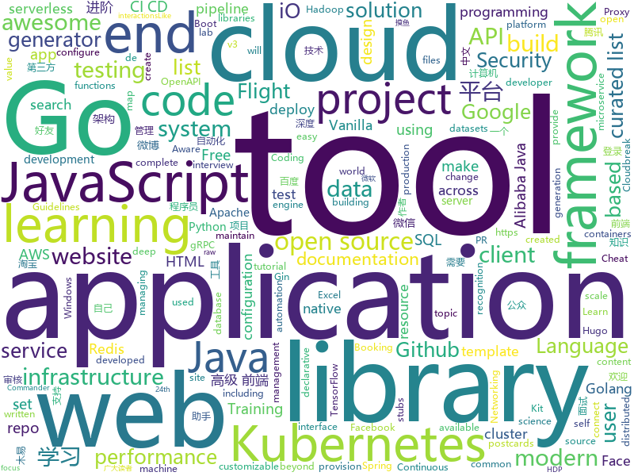

# 2019-07-13
See what the GitHub community is most excited about today.

## python
* [sherlock](https://github.com/sherlock-project/sherlock)(**211 stars today**): 🔎Find usernames across social networks
* [Archery](https://github.com/hhyo/Archery)(**34 stars today**): SQL审核查询平台
* [wagtail](https://github.com/wagtail/wagtail)(**33 stars today**): A Django content management system focused on flexibility and user experience
* [DeepSDF](https://github.com/facebookresearch/DeepSDF)(**21 stars today**): Learning Continuous Signed Distance Functions for Shape Representation
* [adaptive-span](https://github.com/facebookresearch/adaptive-span)(**29 stars today**): Adaptive Attention Span in Transformers
* [QCSuper](https://github.com/P1sec/QCSuper)(**48 stars today**): QCSuper is a tool communicating with Qualcomm-based phones and modems, allowing to capture raw 2G/3G/4G radio frames, among other things.
* [insightface](https://github.com/deepinsight/insightface)(**31 stars today**): Face Analysis Project on MXNet
* [CheatSheetSeries](https://github.com/OWASP/CheatSheetSeries)(**22 stars today**): The OWASP Cheat Sheet Series was created to provide a concise collection of high value information on specific application security topics.
* [Shielded_detector](https://github.com/tangzixiang0304/Shielded_detector)(**4 stars today**): 
* [system-design-primer](https://github.com/donnemartin/system-design-primer)(**45 stars today**): Learn how to design large-scale systems. Prep for the system design interview. Includes Anki flashcards.
* [facenet](https://github.com/davidsandberg/facenet)(**5 stars today**): Face recognition using Tensorflow
* [SinaSpider](https://github.com/LiuXingMing/SinaSpider)(**3 stars today**): 新浪微博爬虫（Scrapy、Redis）
* [tensor2tensor](https://github.com/tensorflow/tensor2tensor)(**8 stars today**): Library of deep learning models and datasets designed to make deep learning more accessible and accelerate ML research.
* [darts](https://github.com/quark0/darts)(**7 stars today**): Differentiable architecture search for convolutional and recurrent networks
* [mypy](https://github.com/python/mypy)(**11 stars today**): Optional static typing for Python 3 and 2 (PEP 484)
* [lihang_book_algorithm](https://github.com/WenDesi/lihang_book_algorithm)(**13 stars today**): 致力于将李航博士《统计学习方法》一书中所有算法实现一遍
* [tensorpack](https://github.com/tensorpack/tensorpack)(**4 stars today**): A Neural Net Training Interface on TensorFlow, with focus on speed + flexibility
* [mlflow](https://github.com/mlflow/mlflow)(**10 stars today**): Open source platform for the machine learning lifecycle
* [EverydayWechat](https://github.com/sfyc23/EverydayWechat)(**53 stars today**): 微信助手：1.每日定时给好友发送定制消息。2.自动回复好友。3.群助手功能。
* [OpsManage](https://github.com/welliamcao/OpsManage)(**18 stars today**): 自动化运维平台: 代码及应用部署CI/CD、资产管理CMDB、计划任务管理平台、SQL审核|回滚、任务调度、站内WIKI
* [tornado](https://github.com/tornadoweb/tornado)(**9 stars today**): Tornado is a Python web framework and asynchronous networking library, originally developed at FriendFeed.
* [FALdetector](https://github.com/PeterWang512/FALdetector)(**4 stars today**): Code for the paper: Detecting Photoshopped Faces by Scripting Photoshop
* [deep_nude](https://github.com/lwlodo/deep_nude)(**7 stars today**): 

## java
* [vhr](https://github.com/lenve/vhr)(**223 stars today**): 微人事是一个前后端分离的人力资源管理系统，项目采用SpringBoot+Vue开发。
* [SoloPi](https://github.com/alipay/SoloPi)(**130 stars today**): Soloπ 自动化测试工具
* [staffjoy](https://github.com/spring2go/staffjoy)(**30 stars today**): 微服务和云原生架构教学案例项目，基于Spring Boot和Kubernetes技术栈
* [lucene-solr](https://github.com/apache/lucene-solr)(**4 stars today**): Mirror of Apache Lucene + Solr
* [mockito](https://github.com/mockito/mockito)(**6 stars today**): Most popular Mocking framework for unit tests written in Java
* [uid-generator](https://github.com/baidu/uid-generator)(**14 stars today**): UniqueID generator
* [openapi-generator](https://github.com/OpenAPITools/openapi-generator)(**16 stars today**): OpenAPI Generator allows generation of API client libraries (SDK generation), server stubs, documentation and configuration automatically given an OpenAPI Spec (v2, v3)
* [cas](https://github.com/apereo/cas)(**6 stars today**): Apereo CAS - Enterprise Single Sign On for all earthlings and beyond.
* [dbeaver](https://github.com/dbeaver/dbeaver)(**11 stars today**): Free universal database tool and SQL client
* [CoolMeeting](https://github.com/lenve/CoolMeeting)(**9 stars today**): 更多 Java 教程----->
* [hutool](https://github.com/looly/hutool)(**14 stars today**): A set of tools that keep Java sweet.
* [arthas](https://github.com/alibaba/arthas)(**13 stars today**): Alibaba Java Diagnostic Tool Arthas/Alibaba Java诊断利器Arthas
* [micronaut-core](https://github.com/micronaut-projects/micronaut-core)(**23 stars today**): Micronaut Application Framework
* [mybatis-3](https://github.com/mybatis/mybatis-3)(**4 stars today**): MyBatis SQL mapper framework for Java
* [conductor](https://github.com/Netflix/conductor)(**4 stars today**): Conductor is a microservices orchestration engine - https://netflix.github.io/conductor/
* [easyexcel](https://github.com/alibaba/easyexcel)(**17 stars today**): 快速、简单避免OOM的java处理Excel工具
* [cloudbreak](https://github.com/hortonworks/cloudbreak)(**0 stars today**): A tool for provisioning and managing Apache Hadoop clusters in the cloud. Cloudbreak, as part of the Hortonworks Data Platform, makes it easy to provision, configure and elastically grow HDP clusters on cloud infrastructure. Cloudbreak can be used to provision Hadoop across cloud infrastructure providers including AWS, Azure, GCP and OpenStack.
* [dropwizard](https://github.com/dropwizard/dropwizard)(**1 stars today**): A damn simple library for building production-ready RESTful web services.
* [antlr4](https://github.com/antlr/antlr4)(**3 stars today**): ANTLR (ANother Tool for Language Recognition) is a powerful parser generator for reading, processing, executing, or translating structured text or binary files.
* [ExoPlayer](https://github.com/google/ExoPlayer)(**6 stars today**): An extensible media player for Android
* [FrameworkBenchmarks](https://github.com/TechEmpower/FrameworkBenchmarks)(**2 stars today**): Source for the TechEmpower Framework Benchmarks project
* [JustAuth](https://github.com/zhangyd-c/JustAuth)(**38 stars today**): 💯史上最全的整合第三方登录的工具,目前已支持Github、Gitee、微博、钉钉、百度、Coding、腾讯云开发者平台、OSChina、支付宝、QQ、微信、淘宝、Google、Facebook、抖音、领英、小米、微软和今日头条等第三方平台的授权登录。 Login, so easy!
* [kubernetes-client](https://github.com/fabric8io/kubernetes-client)(**2 stars today**): Java client for Kubernetes & OpenShift
* [JavaGuide](https://github.com/Snailclimb/JavaGuide)(**98 stars today**): 【Java学习+面试指南】 一份涵盖大部分Java程序员所需要掌握的核心知识。
* [p3c](https://github.com/alibaba/p3c)(**24 stars today**): Alibaba Java Coding Guidelines pmd implements and IDE plugin

## unknown
* [Awesome-Cellular-Hacking](https://github.com/W00t3k/Awesome-Cellular-Hacking)(**100 stars today**): Awesome-Cellular-Hacking
* [modern-js-cheatsheet](https://github.com/mbeaudru/modern-js-cheatsheet)(**54 stars today**): Cheatsheet for the JavaScript knowledge you will frequently encounter in modern projects.
* [cryptocoding](https://github.com/veorq/cryptocoding)(**50 stars today**): Guidelines for low-level cryptography software
* [ds-cheatsheets](https://github.com/FavioVazquez/ds-cheatsheets)(**10 stars today**): List of Data Science Cheatsheets to rule the world
* [DeepLearning-500-questions](https://github.com/scutan90/DeepLearning-500-questions)(**210 stars today**): 深度学习500问，以问答形式对常用的概率知识、线性代数、机器学习、深度学习、计算机视觉等热点问题进行阐述，以帮助自己及有需要的读者。 全书分为18个章节，50余万字。由于水平有限，书中不妥之处恳请广大读者批评指正。 未完待续............ 如有意合作，联系scutjy2015@163.com 版权所有，违权必究 Tan 2018.06
* [Data-Science--Cheat-Sheet](https://github.com/abhat222/Data-Science--Cheat-Sheet)(**34 stars today**): Cheat Sheets
* [flink-training-course](https://github.com/flink-china/flink-training-course)(**4 stars today**): Flink 中文视频课程（持续更新...）
* [awesome-computer-vision](https://github.com/jbhuang0604/awesome-computer-vision)(**16 stars today**): A curated list of awesome computer vision resources
* [frontend-challenges](https://github.com/felipefialho/frontend-challenges)(**38 stars today**): 💥Listing some playful open-source's challenges of jobs to test your knowledge
* [Specs](https://github.com/CocoaPods/Specs)(**1 stars today**): The CocoaPods Master Repo
* [from_coder_to_expert](https://github.com/0voice/from_coder_to_expert)(**48 stars today**): 2019年最新总结，从程序员到CTO，从专业走向卓越，分享大牛企业内部pdf与PPT
* [project-based-learning](https://github.com/tuvtran/project-based-learning)(**28 stars today**): Curated list of project-based tutorials
* [RenZhengfei](https://github.com/ttpianobirds/RenZhengfei)(**3 stars today**): 任正非思想
* [awesome-pipeline](https://github.com/pditommaso/awesome-pipeline)(**2 stars today**): A curated list of awesome pipeline toolkits inspired by Awesome Sysadmin
* [architecture.of.internet-product](https://github.com/davideuler/architecture.of.internet-product)(**38 stars today**): 互联网公司技术架构，微信/淘宝/微博/腾讯/阿里/美团点评/百度/Google/Facebook/Amazon/eBay的架构，欢迎PR补充
* [awesome-public-datasets](https://github.com/awesomedata/awesome-public-datasets)(**14 stars today**): A topic-centric list of HQ open datasets. PR ☛☛☛
* [Adult](https://github.com/no-Dark/Adult)(**4 stars today**): 
* [blog](https://github.com/yygmind/blog)(**22 stars today**): 我是木易杨，公众号「高级前端进阶」作者，跟着我每周重点攻克一个前端面试重难点。接下来让我带你走进高级前端的世界，在进阶的路上，共勉！
* [datascience](https://github.com/r0f1/datascience)(**5 stars today**): Curated list of Python resources for data science.
* [Free-Security-eBooks](https://github.com/Hack-with-Github/Free-Security-eBooks)(**2 stars today**): Free Security and Hacking eBooks
* [free-programming-books-zh_CN](https://github.com/justjavac/free-programming-books-zh_CN)(**29 stars today**): 📚免费的计算机编程类中文书籍，欢迎投稿
* [awesome-production-machine-learning](https://github.com/EthicalML/awesome-production-machine-learning)(**3 stars today**): A curated list of awesome open source libraries to deploy, monitor, version and scale your machine learning
* [free-programming-books](https://github.com/EbookFoundation/free-programming-books)(**36 stars today**): 📚Freely available programming books
* [awesome-interview-questions](https://github.com/MaximAbramchuck/awesome-interview-questions)(**14 stars today**): A curated awesome list of lists of interview questions. Feel free to contribute!🎓
* [aws-modern-application-workshop](https://github.com/aws-samples/aws-modern-application-workshop)(**1 stars today**): A tutorial for developers that want to learn about how to build modern applications on top of AWS. You will build a sample website that leverages infrastructure as code, containers, serverless code functions, CI/CD, and more.

## javascript
* [Daily-Interview-Question](https://github.com/Advanced-Frontend/Daily-Interview-Question)(**210 stars today**): 我是木易杨，公众号「高级前端进阶」作者，每天搞定一道前端大厂面试题，祝大家天天进步，一年后会看到不一样的自己。
* [swift-evolution](https://github.com/apple/swift-evolution)(**24 stars today**): This maintains proposals for changes and user-visible enhancements to the Swift Programming Language.
* [Thief-Book](https://github.com/cteams/Thief-Book)(**36 stars today**): 一款真正的跨平台摸鱼神器
* [vCards](https://github.com/metowolf/vCards)(**52 stars today**): 📡️vCards 中国黄页 - 优化 iOS 来电、信息界面体验
* [site-kit-wp](https://github.com/google/site-kit-wp)(**9 stars today**): Site Kit is a one-stop solution for WordPress users to use everything Google has to offer to make them successful on the web.
* [UnblockNeteaseMusic](https://github.com/nondanee/UnblockNeteaseMusic)(**13 stars today**): Revive unavailable songs for Netease Cloud Music
* [docusaurus](https://github.com/facebook/docusaurus)(**77 stars today**): Easy to maintain open source documentation websites.
* [js-xlsx](https://github.com/SheetJS/js-xlsx)(**19 stars today**): 📗SheetJS Community Edition -- Spreadsheet Toolkit
* [lodash](https://github.com/lodash/lodash)(**22 stars today**): A modern JavaScript utility library delivering modularity, performance, & extras.
* [material-components-web](https://github.com/material-components/material-components-web)(**13 stars today**): Modular and customizable Material Design UI components for the web
* [find-a-mentor](https://github.com/Coding-Coach/find-a-mentor)(**7 stars today**): Coding Coach alpha website
* [cypress-example-recipes](https://github.com/cypress-io/cypress-example-recipes)(**1 stars today**): Various recipes for testing common scenarios with Cypress
* [mapbox-gl-js](https://github.com/mapbox/mapbox-gl-js)(**8 stars today**): Interactive, thoroughly customizable maps in the browser, powered by vector tiles and WebGL
* [appium](https://github.com/appium/appium)(**9 stars today**): 📱Automation for iOS, Android, and Windows Apps.
* [Detox](https://github.com/wix/Detox)(**15 stars today**): Gray box end-to-end testing and automation framework for mobile apps
* [juice-shop](https://github.com/bkimminich/juice-shop)(**6 stars today**): OWASP Juice Shop: Probably the most modern and sophisticated insecure web application
* [d3](https://github.com/d3/d3)(**21 stars today**): Bring data to life with SVG, Canvas and HTML.📊📈🎉
* [enzyme](https://github.com/airbnb/enzyme)(**10 stars today**): JavaScript Testing utilities for React
* [react](https://github.com/facebook/react)(**54 stars today**): A declarative, efficient, and flexible JavaScript library for building user interfaces.
* [exceljs](https://github.com/exceljs/exceljs)(**10 stars today**): Excel Workbook Manager
* [baidu-netdisk-downloaderx](https://github.com/b3log/baidu-netdisk-downloaderx)(**29 stars today**): ⚡️百度网盘不限速下载器 BND，支持 Windows、Mac 和 Linux。
* [generator-jhipster](https://github.com/jhipster/generator-jhipster)(**8 stars today**): Open Source application generator for creating Spring Boot + Angular/React projects in seconds!
* [awx](https://github.com/ansible/awx)(**8 stars today**): AWX Project
* [aws-serverless-workshops](https://github.com/aws-samples/aws-serverless-workshops)(**5 stars today**): Code and walkthrough labs to set up serverless applications for Wild Rydes workshops
* [aws-serverless-airline-booking](https://github.com/aws-samples/aws-serverless-airline-booking)(**6 stars today**): Airline Booking is a complete web application that provides Flight Search, Flight Payment, Flight Booking, Flight Preferences and Loyalty points including end-to-end testing, GraphQL and CI/CD. This web application is the theme of Build on Serverless Season 2 on AWS Twitch running from April 24th until end of July.

## html
* [learning-area](https://github.com/mdn/learning-area)(**2 stars today**): Github repo for the MDN Learning Area.
* [hover-effect](https://github.com/robin-dela/hover-effect)(**13 stars today**): Javascript library to draw and animate images on hover
* [DetectionLab](https://github.com/clong/DetectionLab)(**2 stars today**): Vagrant & Packer scripts to build a lab environment complete with security tooling and logging best practices
* [html-email-templates](https://github.com/designmodo/html-email-templates)(**2 stars today**): Free HTML Email Templates created using the Postcards - https://designmodo.com/postcards/
* [professional-services](https://github.com/GoogleCloudPlatform/professional-services)(**5 stars today**): Common solutions and tools developed by Google Cloud's Professional Services team
* [JavaScript30](https://github.com/wesbos/JavaScript30)(**9 stars today**): 30 Day Vanilla JS Challenge
* [DIGITS](https://github.com/NVIDIA/DIGITS)(**1 stars today**): Deep Learning GPU Training System
* [masonry](https://github.com/desandro/masonry)(**2 stars today**): 🏩Cascading grid layout plugin
* [rellax](https://github.com/dixonandmoe/rellax)(**5 stars today**): Lightweight, vanilla javascript parallax library
* [website](https://github.com/kubernetes/website)(**4 stars today**): Kubernetes website and documentation repo:
* [hyperblog](https://github.com/freddier/hyperblog)(**1 stars today**): Un blog increíble para el curso de Git y Github de Platzi
* [docsy](https://github.com/google/docsy)(**47 stars today**): A set of Hugo doc templates for launching open source content.
* [js-xss](https://github.com/leizongmin/js-xss)(**1 stars today**): Sanitize untrusted HTML (to prevent XSS) with a configuration specified by a Whitelist
* [bootstrap-multiselect](https://github.com/davidstutz/bootstrap-multiselect)(**0 stars today**): JQuery multiselect plugin based on Twitter Bootstrap.
* [workshops](https://github.com/ansible/workshops)(**0 stars today**): Training Course for Ansible Automation
* [sourcegraph](https://github.com/sourcegraph/sourcegraph)(**13 stars today**): Code search and navigation tool (self-hosted)
* [phantomjs](https://github.com/ariya/phantomjs)(**2 stars today**): Scriptable Headless Browser
* [webdevbootcamp](https://github.com/nax3t/webdevbootcamp)(**1 stars today**): All source code for back-end projects from the Web Developer Bootcamp
* [swagger-codegen](https://github.com/swagger-api/swagger-codegen)(**11 stars today**): swagger-codegen contains a template-driven engine to generate documentation, API clients and server stubs in different languages by parsing your OpenAPI / Swagger definition.
* [tiny-slider](https://github.com/ganlanyuan/tiny-slider)(**4 stars today**): Vanilla javascript slider for all purposes.
* [cypress-example-kitchensink](https://github.com/cypress-io/cypress-example-kitchensink)(**0 stars today**): This is an example app used to showcase Cypress.io testing.
* [hugo-academic](https://github.com/gcushen/hugo-academic)(**7 stars today**): 📝The website builder for Hugo. Build and deploy a beautiful website in minutes!
* [labstreaminglayer](https://github.com/sccn/labstreaminglayer)(**0 stars today**): LabStreamingLayer super repository comprising submodules for LSL and associated apps.
* [foundation-sites](https://github.com/zurb/foundation-sites)(**4 stars today**): The most advanced responsive front-end framework in the world. Quickly create prototypes and production code for sites that work on any kind of device.
* [glTF](https://github.com/KhronosGroup/glTF)(**1 stars today**): glTF – Runtime 3D Asset Delivery

## go
* [ignite](https://github.com/weaveworks/ignite)(**66 stars today**): Ignite a Firecracker microVM
* [nats-server](https://github.com/nats-io/nats-server)(**39 stars today**): High-Performance server for NATS, the cloud native messaging system.
* [istio](https://github.com/istio/istio)(**8 stars today**): Connect, secure, control, and observe services.
* [kruise](https://github.com/openkruise/kruise)(**11 stars today**): Automate application workloads management on Kubernetes
* [terraform](https://github.com/hashicorp/terraform)(**23 stars today**): Terraform enables you to safely and predictably create, change, and improve infrastructure. It is an open source tool that codifies APIs into declarative configuration files that can be shared amongst team members, treated as code, edited, reviewed, and versioned.
* [consul](https://github.com/hashicorp/consul)(**33 stars today**): Consul is a distributed, highly available, and data center aware solution to connect and configure applications across dynamic, distributed infrastructure.
* [helmfile](https://github.com/roboll/helmfile)(**2 stars today**): Deploy Kubernetes Helm Charts
* [origin](https://github.com/openshift/origin)(**7 stars today**): The self-managing, auto-upgrading, Kubernetes distribution for everyone
* [go-cloud](https://github.com/google/go-cloud)(**7 stars today**): The Go Cloud Development Kit (Go CDK): A library and tools for open cloud development in Go.
* [go-micro](https://github.com/micro/go-micro)(**22 stars today**): A microservice development framework
* [argo-cd](https://github.com/argoproj/argo-cd)(**14 stars today**): Declarative continuous deployment for Kubernetes.
* [gin](https://github.com/gin-gonic/gin)(**35 stars today**): Gin is a HTTP web framework written in Go (Golang). It features a Martini-like API with much better performance -- up to 40 times faster. If you need smashing performance, get yourself some Gin.
* [pipeline](https://github.com/tektoncd/pipeline)(**15 stars today**): A K8s-native Pipeline resource.
* [codis](https://github.com/CodisLabs/codis)(**13 stars today**): Proxy based Redis cluster solution supporting pipeline and scaling dynamically
* [linkerd2](https://github.com/linkerd/linkerd2)(**2 stars today**): A service mesh for Kubernetes and beyond. Main repo for Linkerd 2.x.
* [cobra](https://github.com/spf13/cobra)(**26 stars today**): A Commander for modern Go CLI interactions
* [ldap](https://github.com/go-ldap/ldap)(**3 stars today**): Basic LDAP v3 functionality for the GO programming language.
* [grpc-gateway](https://github.com/grpc-ecosystem/grpc-gateway)(**14 stars today**): gRPC to JSON proxy generator following the gRPC HTTP spec
* [go-sqlmock](https://github.com/DATA-DOG/go-sqlmock)(**7 stars today**): Sql mock driver for golang to test database interactions
* [loki](https://github.com/grafana/loki)(**10 stars today**): Like Prometheus, but for logs.
* [cilium](https://github.com/cilium/cilium)(**8 stars today**): API Aware Networking and Security using BPF and XDP
* [mapstructure](https://github.com/mitchellh/mapstructure)(**7 stars today**): Go library for decoding generic map values into native Go structures.
* [sarama](https://github.com/Shopify/sarama)(**6 stars today**): Sarama is a Go library for Apache Kafka 0.8, and up.
* [singularity](https://github.com/sylabs/singularity)(**0 stars today**): Singularity: Application containers for Linux
* [redis](https://github.com/go-redis/redis)(**12 stars today**): Type-safe Redis client for Golang

## WordCloud

