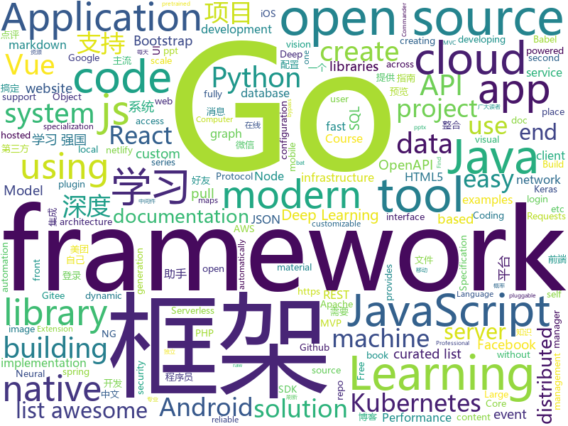

# 2019-07-14
See what the GitHub community is most excited about today.

## python
* [sherlock](https://github.com/sherlock-project/sherlock)(**152 stars today**): 🔎Find usernames across social networks
* [EverydayWechat](https://github.com/sfyc23/EverydayWechat)(**48 stars today**): 微信助手：1.每日定时给好友发送定制消息。2.自动回复好友。3.群助手功能。
* [QCSuper](https://github.com/P1sec/QCSuper)(**32 stars today**): QCSuper is a tool communicating with Qualcomm-based phones and modems, allowing to capture raw 2G/3G/4G radio frames, among other things.
* [vaex](https://github.com/vaexio/vaex)(**42 stars today**): Out-of-Core DataFrames for Python, visualize and explore big tabular data at a billion rows per second.
* [Archery](https://github.com/hhyo/Archery)(**17 stars today**): SQL审核查询平台
* [serverless-application-model](https://github.com/awslabs/serverless-application-model)(**6 stars today**): AWS Serverless Application Model (SAM) is an open-source framework for building serverless applications
* [airflow](https://github.com/apache/airflow)(**6 stars today**): Apache Airflow
* [Panda-Learning](https://github.com/Alivon/Panda-Learning)(**8 stars today**): 学习强国 xuexiqiangguo 全网最好用学习强国助手：Panda_Learning 萌萌的熊猫帮你搞定学习强国
* [DG-Net](https://github.com/NVlabs/DG-Net)(**11 stars today**): CVPR2019 Joint Discriminative and Generative Learning for Person Re-identification
* [kkFileView](https://github.com/kekingcn/kkFileView)(**18 stars today**): 使用spring boot打造文件文档在线预览项目解决方案，支持doc、docx、ppt、pptx、xls、xlsx、zip、rar、mp4，mp3以及众多类文本如txt、html、xml、java、properties、sql、js、md、json、conf、ini、vue、php、py、bat、gitignore等文件在线预览
* [segmentation_models](https://github.com/qubvel/segmentation_models)(**2 stars today**): Segmentation models with pretrained backbones. Keras.
* [tf-pose-estimation](https://github.com/ildoonet/tf-pose-estimation)(**6 stars today**): Deep Pose Estimation implemented using Tensorflow with Custom Architectures for fast inference.
* [python-cheatsheet](https://github.com/gto76/python-cheatsheet)(**40 stars today**): Comprehensive Python Cheatsheet
* [Advanced-Deep-Learning-with-Keras](https://github.com/PacktPublishing/Advanced-Deep-Learning-with-Keras)(**18 stars today**): Advanced Deep Learning with Keras, published by Packt
* [InstagramOSINT](https://github.com/sc1341/InstagramOSINT)(**8 stars today**): An Instagram Open Source Intellgence Tool
* [AB3DMOT](https://github.com/xinshuoweng/AB3DMOT)(**15 stars today**): Official python implementation for "A Baseline for 3D Multi-Object Tracking"
* [machine_learning_security](https://github.com/13o-bbr-bbq/machine_learning_security)(**9 stars today**): Source code about machine learning and security.
* [calibre](https://github.com/kovidgoyal/calibre)(**9 stars today**): The official source code repository for the calibre ebook manager
* [home-assistant](https://github.com/home-assistant/home-assistant)(**16 stars today**): 🏡Open source home automation that puts local control and privacy first
* [PySnooper](https://github.com/cool-RR/PySnooper)(**11 stars today**): Never use print for debugging again
* [XLM](https://github.com/facebookresearch/XLM)(**8 stars today**): PyTorch original implementation of Cross-lingual Language Model Pretraining.
* [FCOS](https://github.com/tianzhi0549/FCOS)(**17 stars today**): FCOS: Fully Convolutional One-Stage Object Detection
* [pytorch_geometric](https://github.com/rusty1s/pytorch_geometric)(**7 stars today**): Geometric Deep Learning Extension Library for PyTorch

## java
* [vhr](https://github.com/lenve/vhr)(**155 stars today**): 微人事是一个前后端分离的人力资源管理系统，项目采用SpringBoot+Vue开发。
* [SoloPi](https://github.com/alipay/SoloPi)(**50 stars today**): Soloπ 自动化测试工具
* [cat](https://github.com/dianping/cat)(**34 stars today**): CAT 作为服务端项目基础组件，提供了 Java, C/C++, Node.js, Python, Go 等多语言客户端，已经在美团点评的基础架构中间件框架（MVC框架，RPC框架，数据库框架，缓存框架等，消息队列，配置系统等）深度集成，为美团点评各业务线提供系统丰富的性能指标、健康状况、实时告警等。
* [APIJSON](https://github.com/APIJSON/APIJSON)(**18 stars today**): 🏆Gitee Most Valuable Project🚀A JSON Transmission Protocol and an ORM Library for auto providing APIs and Documents.
* [MVPArms](https://github.com/JessYanCoding/MVPArms)(**5 stars today**): ⚔️A common architecture for Android applications developing based on MVP, integrates many open source projects, to make your developing quicker and easier (一个整合了大量主流开源项目高度可配置化的 Android MVP 快速集成框架).
* [openapi-generator](https://github.com/OpenAPITools/openapi-generator)(**6 stars today**): OpenAPI Generator allows generation of API client libraries (SDK generation), server stubs, documentation and configuration automatically given an OpenAPI Spec (v2, v3)
* [Mycat-Server](https://github.com/MyCATApache/Mycat-Server)(**4 stars today**): 
* [JavaGuide](https://github.com/Snailclimb/JavaGuide)(**61 stars today**): 【Java学习+面试指南】 一份涵盖大部分Java程序员所需要掌握的核心知识。
* [JustAuth](https://github.com/zhangyd-c/JustAuth)(**41 stars today**): 💯史上最全的整合第三方登录的工具,目前已支持Github、Gitee、微博、钉钉、百度、Coding、腾讯云开发者平台、OSChina、支付宝、QQ、微信、淘宝、Google、Facebook、抖音、领英、小米、微软和今日头条等第三方平台的授权登录。 Login, so easy!
* [libgdx](https://github.com/libgdx/libgdx)(**3 stars today**): Desktop/Android/HTML5/iOS Java game development framework
* [maps](https://github.com/react-native-mapbox-gl/maps)(**2 stars today**): A Mapbox GL react native module for creating custom maps
* [halo](https://github.com/halo-dev/halo)(**25 stars today**): ✍ Halo 一款现代化的个人独立博客系统
* [swagger-core](https://github.com/swagger-api/swagger-core)(**1 stars today**): Examples and server integrations for generating the Swagger API Specification, which enables easy access to your REST API
* [ignite](https://github.com/apache/ignite)(**2 stars today**): Mirror of Apache Ignite
* [pinpoint](https://github.com/naver/pinpoint)(**7 stars today**): APM, (Application Performance Management) tool for large-scale distributed systems written in Java.
* [micronaut-core](https://github.com/micronaut-projects/micronaut-core)(**4 stars today**): Micronaut Application Framework
* [avro](https://github.com/apache/avro)(**2 stars today**): Apache Avro
* [tutorials](https://github.com/eugenp/tutorials)(**21 stars today**): The "REST With Spring" Course:
* [RxJava](https://github.com/ReactiveX/RxJava)(**10 stars today**): RxJava – Reactive Extensions for the JVM – a library for composing asynchronous and event-based programs using observable sequences for the Java VM.
* [react-native-fbsdk](https://github.com/facebook/react-native-fbsdk)(**2 stars today**): A React Native wrapper around the Facebook SDKs for Android and iOS. Provides access to Facebook login, sharing, graph requests, app events etc.
* [flink](https://github.com/apache/flink)(**9 stars today**): Apache Flink
* [nacos](https://github.com/alibaba/nacos)(**6 stars today**): an easy-to-use dynamic service discovery, configuration and service management platform for building cloud native applications.
* [dbeaver](https://github.com/dbeaver/dbeaver)(**6 stars today**): Free universal database tool and SQL client
* [azkaban](https://github.com/azkaban/azkaban)(**3 stars today**): Azkaban workflow manager.
* [javacv](https://github.com/bytedeco/javacv)(**4 stars today**): Java interface to OpenCV, FFmpeg, and more

## unknown
* [modern-js-cheatsheet](https://github.com/mbeaudru/modern-js-cheatsheet)(**29 stars today**): Cheatsheet for the JavaScript knowledge you will frequently encounter in modern projects.
* [Data-Science--Cheat-Sheet](https://github.com/abhat222/Data-Science--Cheat-Sheet)(**16 stars today**): Cheat Sheets
* [Awesome-Cellular-Hacking](https://github.com/W00t3k/Awesome-Cellular-Hacking)(**58 stars today**): Awesome-Cellular-Hacking
* [curriculum](https://github.com/PestoTech/curriculum)(**2 stars today**): 
* [from_coder_to_expert](https://github.com/0voice/from_coder_to_expert)(**14 stars today**): 2019年最新总结，从程序员到CTO，从专业走向卓越，分享大牛企业内部pdf与PPT
* [weekly](https://github.com/ruanyf/weekly)(**6 stars today**): 科技爱好者周刊，每周五发布
* [blog](https://github.com/EDDYCJY/blog)(**6 stars today**): 煎鱼的博客，有点忙。
* [presentation-2019-06-NDCOslo](https://github.com/SteveSandersonMS/presentation-2019-06-NDCOslo)(**7 stars today**): NDC Oslo 2019
* [prisma2](https://github.com/prisma/prisma2)(**3 stars today**): 👀Prisma 2 Preview
* [leetcode](https://github.com/grandyang/leetcode)(**25 stars today**): Provide all my solutions and explanations in Chinese for all the Leetcode coding problems.
* [You-Dont-Know-JS](https://github.com/getify/You-Dont-Know-JS)(**44 stars today**): A book series on JavaScript. @YDKJS on twitter.
* [DeepLearning-500-questions](https://github.com/scutan90/DeepLearning-500-questions)(**174 stars today**): 深度学习500问，以问答形式对常用的概率知识、线性代数、机器学习、深度学习、计算机视觉等热点问题进行阐述，以帮助自己及有需要的读者。 全书分为18个章节，50余万字。由于水平有限，书中不妥之处恳请广大读者批评指正。 未完待续............ 如有意合作，联系scutjy2015@163.com 版权所有，违权必究 Tan 2018.06
* [OpenAPI-Specification](https://github.com/OAI/OpenAPI-Specification)(**7 stars today**): The OpenAPI Specification Repository
* [awesome-swiftui](https://github.com/vlondon/awesome-swiftui)(**2 stars today**): A collaborative list of awesome articles, talks, books, videos and code examples about SwiftUI.
* [babel-handbook](https://github.com/jamiebuilds/babel-handbook)(**4 stars today**): 📘A guided handbook on how to use Babel and how to create plugins for Babel.
* [awesome-graph-embedding](https://github.com/benedekrozemberczki/awesome-graph-embedding)(**6 stars today**): A collection of important graph embedding, classification and representation learning papers with implementations.
* [deep-learning-drizzle](https://github.com/kmario23/deep-learning-drizzle)(**5 stars today**): Drench yourself in Deep Learning, Reinforcement Learning, Machine Learning, Computer Vision, and NLP by learning from these exciting lectures!!
* [idiomatic.js](https://github.com/rwaldron/idiomatic.js)(**4 stars today**): Principles of Writing Consistent, Idiomatic JavaScript
* [awesome-computer-vision](https://github.com/jbhuang0604/awesome-computer-vision)(**12 stars today**): A curated list of awesome computer vision resources
* [api-guidelines](https://github.com/microsoft/api-guidelines)(**3 stars today**): Microsoft REST API Guidelines
* [awesome-algorithms](https://github.com/tayllan/awesome-algorithms)(**4 stars today**): A curated list of awesome places to learn and/or practice algorithms.
* [awesome-scalability](https://github.com/binhnguyennus/awesome-scalability)(**12 stars today**): The Patterns of Scalable, Reliable, and Performant Large-Scale Systems
* [awesome-taro](https://github.com/NervJS/awesome-taro)(**1 stars today**): 多端统一开发框架 Taro 优秀学习资源汇总
* [Notes](https://github.com/gracenolan/Notes)(**6 stars today**): 
* [rt-n56u](https://github.com/hanwckf/rt-n56u)(**2 stars today**): Padavan

## javascript
* [vue](https://github.com/vuejs/vue)(**61 stars today**): 🖖Vue.js is a progressive, incrementally-adoptable JavaScript framework for building UI on the web.
* [material-components-web](https://github.com/material-components/material-components-web)(**11 stars today**): Modular and customizable Material Design UI components for the web
* [docusaurus](https://github.com/facebook/docusaurus)(**33 stars today**): Easy to maintain open source documentation websites.
* [netron](https://github.com/lutzroeder/netron)(**8 stars today**): Visualizer for neural network, deep learning and machine learning models
* [pixi.js](https://github.com/pixijs/pixi.js)(**22 stars today**): The HTML5 Creation Engine: Create beautiful digital content with the fastest, most flexible 2D WebGL renderer.
* [Rocket.Chat](https://github.com/RocketChat/Rocket.Chat)(**11 stars today**): The ultimate Free Open Source Solution for team communications.
* [mnmlurl](https://github.com/liyasthomas/mnmlurl)(**13 stars today**): 🔗Modern URL shortener with support for custom alias
* [react-native](https://github.com/facebook/react-native)(**25 stars today**): A framework for building native apps with React.
* [mapbox-gl-js](https://github.com/mapbox/mapbox-gl-js)(**1 stars today**): Interactive, thoroughly customizable maps in the browser, powered by vector tiles and WebGL
* [SmoothScrollAnimations](https://github.com/codrops/SmoothScrollAnimations)(**9 stars today**): Demo of a tutorial on how to add smooth page scrolling with an inner image animation
* [How-To-Ask-Questions-The-Smart-Way](https://github.com/ryanhanwu/How-To-Ask-Questions-The-Smart-Way)(**14 stars today**): 本文原文由知名 Hacker Eric S. Raymond 所撰寫，教你如何正確的提出技術問題並獲得你滿意的答案。
* [marked](https://github.com/markedjs/marked)(**39 stars today**): A markdown parser and compiler. Built for speed.
* [mui](https://github.com/dcloudio/mui)(**4 stars today**): 最接近原生APP体验的高性能框架
* [fullcalendar](https://github.com/fullcalendar/fullcalendar)(**15 stars today**): Full-sized drag & drop event calendar
* [baidu-netdisk-downloaderx](https://github.com/b3log/baidu-netdisk-downloaderx)(**57 stars today**): ⚡️百度网盘不限速下载器 BND，支持 Windows、Mac 和 Linux。
* [automerge](https://github.com/automerge/automerge)(**6 stars today**): A JSON-like data structure (a CRDT) that can be modified concurrently by different users, and merged again automatically.
* [Daily-Interview-Question](https://github.com/Advanced-Frontend/Daily-Interview-Question)(**133 stars today**): 我是木易杨，公众号「高级前端进阶」作者，每天搞定一道前端大厂面试题，祝大家天天进步，一年后会看到不一样的自己。
* [quasar](https://github.com/quasarframework/quasar)(**24 stars today**): Quasar Framework - Build high-performance VueJS user interfaces in record time
* [nodejs-api-starter](https://github.com/kriasoft/nodejs-api-starter)(**5 stars today**): Boilerplate and tooling for authoring data API backends with Node.js and GraphQL
* [create-react-app](https://github.com/facebook/create-react-app)(**25 stars today**): Set up a modern web app by running one command.
* [Detox](https://github.com/wix/Detox)(**4 stars today**): Gray box end-to-end testing and automation framework for mobile apps
* [gatsby](https://github.com/gatsbyjs/gatsby)(**14 stars today**): Build blazing fast, modern apps and websites with React
* [odoo](https://github.com/odoo/odoo)(**7 stars today**): Odoo. Open Source Apps To Grow Your Business.
* [react-table](https://github.com/tannerlinsley/react-table)(**6 stars today**): ⚛️Hooks for building fast and extendable tables and datagrids for React
* [vue-i18n](https://github.com/kazupon/vue-i18n)(**4 stars today**): 🌐Internationalization plugin for Vue.js

## html
* [docsy](https://github.com/google/docsy)(**20 stars today**): A set of Hugo doc templates for launching open source content.
* [hover-effect](https://github.com/robin-dela/hover-effect)(**6 stars today**): Javascript library to draw and animate images on hover
* [sourcegraph](https://github.com/sourcegraph/sourcegraph)(**2 stars today**): Code search and navigation tool (self-hosted)
* [startbootstrap-resume](https://github.com/BlackrockDigital/startbootstrap-resume)(**1 stars today**): A Bootstrap 4 resume/CV theme created by Start Bootstrap
* [website](https://github.com/kubernetes/website)(**2 stars today**): Kubernetes website and documentation repo:
* [foundation-sites](https://github.com/zurb/foundation-sites)(**1 stars today**): The most advanced responsive front-end framework in the world. Quickly create prototypes and production code for sites that work on any kind of device.
* [one-html-page-challenge](https://github.com/Metroxe/one-html-page-challenge)(**1 stars today**): Can you create something cool without modern tools?
* [core](https://github.com/stackblitz/core)(**2 stars today**): Online IDE powered by Visual Studio Code⚡️
* [speedtest](https://github.com/adolfintel/speedtest)(**7 stars today**): Self-hosted HTML5 Speedtest. Easy setup, examples, configurable, mobile friendly. Supports PHP, Node, Multiple servers, and more
* [nndl.github.io](https://github.com/nndl/nndl.github.io)(**9 stars today**): 《神经网络与深度学习》 Neural Network and Deep Learning
* [pcc_2e](https://github.com/ehmatthes/pcc_2e)(**1 stars today**): Online resources for Python Crash Course (Second Edition), from No Starch Press
* [nullboard](https://github.com/apankrat/nullboard)(**6 stars today**): Nullboard is a minimalist kanban board, focused on compactness and readability.
* [ng-alain](https://github.com/ng-alain/ng-alain)(**2 stars today**): NG-ZORRO admin panel front-end framework (netlify mirror https://netlify.ng-alain.com/)
* [courses](https://github.com/DataScienceSpecialization/courses)(**0 stars today**): Course materials for the Data Science Specialization: https://www.coursera.org/specialization/jhudatascience/1
* [tiny-slider](https://github.com/ganlanyuan/tiny-slider)(**1 stars today**): Vanilla javascript slider for all purposes.
* [repo-badges](https://github.com/dwyl/repo-badges)(**0 stars today**): ⭐️Use repo badges (build passing, coverage, etc) in your readme/markdown file to signal code quality in a project.
* [mescroll](https://github.com/mescroll/mescroll)(**0 stars today**): 精致的下拉刷新和上拉加载 js框架.支持vue,完美运行于移动端和主流PC浏览器 (JS framework for pull-refresh and pull-up-loading)
* [PowerBI-visuals](https://github.com/microsoft/PowerBI-visuals)(**0 stars today**): Documentation for creating visuals for Power BI
* [mxgraph](https://github.com/jgraph/mxgraph)(**2 stars today**): mxGraph is a fully client side JavaScript diagramming library
* [GTFOBins.github.io](https://github.com/GTFOBins/GTFOBins.github.io)(**5 stars today**): Curated list of Unix binaries that can be exploited to bypass system security restrictions
* [professional-services](https://github.com/GoogleCloudPlatform/professional-services)(**0 stars today**): Common solutions and tools developed by Google Cloud's Professional Services team
* [bootstrap.native](https://github.com/thednp/bootstrap.native)(**0 stars today**): If you are looking for Bootstrap without jQuery or vanilla Javascript for Bootstrap, this is the place to get started.
* [website](https://github.com/kubeflow/website)(**0 stars today**): Kubeflow's public website
* [github-markdown-css](https://github.com/sindresorhus/github-markdown-css)(**3 stars today**): The minimal amount of CSS to replicate the GitHub Markdown style
* [cs231n.github.io](https://github.com/cs231n/cs231n.github.io)(**2 stars today**): Public facing notes page

## go
* [nats-server](https://github.com/nats-io/nats-server)(**55 stars today**): High-Performance server for NATS, the cloud native messaging system.
* [inlets](https://github.com/alexellis/inlets)(**92 stars today**): Expose your local endpoints to the Internet
* [jx](https://github.com/jenkins-x/jx)(**7 stars today**): Jenkins X provides automated CI+CD for Kubernetes with Preview Environments on Pull Requests using Jenkins, Tekton, Knative, Prow, Skaffold and Helm
* [pq](https://github.com/lib/pq)(**5 stars today**): Pure Go Postgres driver for database/sql
* [go-cloud](https://github.com/google/go-cloud)(**4 stars today**): The Go Cloud Development Kit (Go CDK): A library and tools for open cloud development in Go.
* [helm](https://github.com/helm/helm)(**16 stars today**): The Kubernetes Package Manager
* [redis](https://github.com/go-redis/redis)(**8 stars today**): Type-safe Redis client for Golang
* [flux](https://github.com/fluxcd/flux)(**13 stars today**): The GitOps Kubernetes operator
* [logrus](https://github.com/sirupsen/logrus)(**12 stars today**): Structured, pluggable logging for Go.
* [contour](https://github.com/heptio/contour)(**5 stars today**): Contour is a Kubernetes ingress controller using Lyft's Envoy proxy.
* [go](https://github.com/golang/go)(**40 stars today**): The Go programming language
* [dgraph](https://github.com/dgraph-io/dgraph)(**16 stars today**): Fast, Distributed Graph DB
* [tendermint](https://github.com/tendermint/tendermint)(**6 stars today**): ⟁ Tendermint Core (BFT Consensus) in Go
* [ignite](https://github.com/weaveworks/ignite)(**53 stars today**): Ignite a Firecracker microVM
* [node_exporter](https://github.com/prometheus/node_exporter)(**3 stars today**): Exporter for machine metrics
* [awesome-go](https://github.com/avelino/awesome-go)(**20 stars today**): A curated list of awesome Go frameworks, libraries and software
* [cobra](https://github.com/spf13/cobra)(**12 stars today**): A Commander for modern Go CLI interactions
* [pulumi](https://github.com/pulumi/pulumi)(**5 stars today**): Modern Infrastructure as Code - Create, deploy, and manage infrastructure on any cloud using your favorite language.
* [prometheus](https://github.com/prometheus/prometheus)(**11 stars today**): The Prometheus monitoring system and time series database.
* [cf-deployment](https://github.com/cloudfoundry/cf-deployment)(**1 stars today**): The canonical open source deployment manifest for Cloud Foundry
* [containerd](https://github.com/containerd/containerd)(**5 stars today**): An open and reliable container runtime
* [consul](https://github.com/hashicorp/consul)(**7 stars today**): Consul is a distributed, highly available, and data center aware solution to connect and configure applications across dynamic, distributed infrastructure.
* [protobuf](https://github.com/gogo/protobuf)(**4 stars today**): Protocol Buffers for Go with Gadgets
* [the-way-to-go_ZH_CN](https://github.com/Unknwon/the-way-to-go_ZH_CN)(**7 stars today**): 《The Way to Go》中文译本，中文正式名《Go 入门指南》
* [aws-lambda-go](https://github.com/aws/aws-lambda-go)(**3 stars today**): Libraries, samples and tools to help Go developers develop AWS Lambda functions.

## WordCloud

