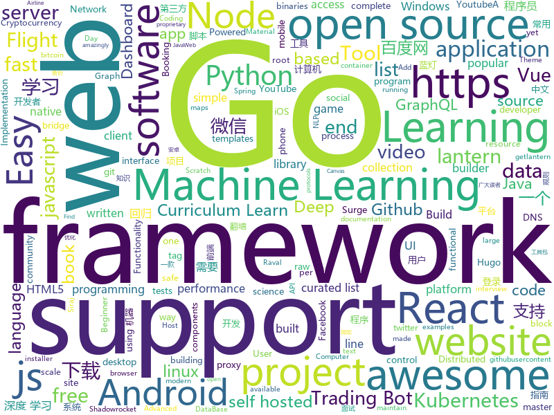

# 2019-07-15
See what the GitHub community is most excited about today.

## python
* [sherlock](https://github.com/sherlock-project/sherlock)(**186 stars today**): 🔎Find usernames across social networks
* [xarray](https://github.com/pydata/xarray)(**28 stars today**): N-D labeled arrays and datasets in Python
* [youtube-dl](https://github.com/ytdl-org/youtube-dl)(**89 stars today**): Command-line program to download videos from YouTube.com and other video sites
* [python-cheatsheet](https://github.com/gto76/python-cheatsheet)(**475 stars today**): Comprehensive Python Cheatsheet
* [anki](https://github.com/dae/anki)(**8 stars today**): Anki for desktop computers
* [unlocker](https://github.com/DrDonk/unlocker)(**18 stars today**): VMware Workstation macOS
* [scikit-learn](https://github.com/scikit-learn/scikit-learn)(**22 stars today**): scikit-learn: machine learning in Python
* [searx](https://github.com/asciimoo/searx)(**9 stars today**): Privacy-respecting metasearch engine
* [dc_tts](https://github.com/Kyubyong/dc_tts)(**21 stars today**): A TensorFlow Implementation of DC-TTS: yet another text-to-speech model
* [spaCy](https://github.com/explosion/spaCy)(**10 stars today**): 💫Industrial-strength Natural Language Processing (NLP) with Python and Cython
* [awesome-machine-learning](https://github.com/josephmisiti/awesome-machine-learning)(**11 stars today**): A curated list of awesome Machine Learning frameworks, libraries and software.
* [Cryptocurrency-Trading-Bots-Python-Beginner-Advance](https://github.com/Roibal/Cryptocurrency-Trading-Bots-Python-Beginner-Advance)(**6 stars today**): Crypto Trading Bots in Python - Triangular Arbitrage, Beginner & Advanced Cryptocurrency Trading Bots Written in Python
* [texar-pytorch](https://github.com/asyml/texar-pytorch)(**21 stars today**): Toolkit for Machine Learning and Text Generation, in PyTorch
* [mirth](https://github.com/mirth-lang/mirth)(**5 stars today**): Compiler for the Mirth programming language, a type-safe functional Forth.
* [python-telegram-bot](https://github.com/python-telegram-bot/python-telegram-bot)(**10 stars today**): We have made you a wrapper you can't refuse
* [pytest](https://github.com/pytest-dev/pytest)(**8 stars today**): The pytest framework makes it easy to write small tests, yet scales to support complex functional testing
* [azure-cli](https://github.com/Azure/azure-cli)(**3 stars today**): Command-line tools for Azure.
* [machine_learning_examples](https://github.com/lazyprogrammer/machine_learning_examples)(**4 stars today**): A collection of machine learning examples and tutorials.
* [deap](https://github.com/DEAP/deap)(**13 stars today**): Distributed Evolutionary Algorithms in Python
* [chromego](https://github.com/killgcd/chromego)(**13 stars today**): ChromeGo 翻墙工具包
* [youtube_tutorials](https://github.com/vprusso/youtube_tutorials)(**3 stars today**): Collection of scripts corresponding to LucidProgramming YouTube tutorials
* [electrum](https://github.com/spesmilo/electrum)(**2 stars today**): Electrum; Bitcoin thin client
* [bips](https://github.com/bitcoin/bips)(**5 stars today**): Bitcoin Improvement Proposals
* [vaex](https://github.com/vaexio/vaex)(**36 stars today**): Out-of-Core DataFrames for Python, visualize and explore big tabular data at a billion rows per second.

## java
* [vhr](https://github.com/lenve/vhr)(**261 stars today**): 微人事是一个前后端分离的人力资源管理系统，项目采用SpringBoot+Vue开发。
* [Document](https://github.com/FangWW/Document)(**49 stars today**): 📘各种编程学习资料 (Android C C++ DataBase HTML5 JavaWeb ios python uml 人工智能 操作系统 数学 数据结构 程序员需要的技术 程序设计 编译原理 计算机组成与结构 计算机网络 设计模式 软件工程 面试经验)
* [Nukkit](https://github.com/NukkitX/Nukkit)(**5 stars today**): Nuclear-Powered Server Software for Minecraft: Bedrock Edition.
* [pipeline](https://github.com/PipelineAI/pipeline)(**7 stars today**): PipelineAI: Real-Time Enterprise AI Platform
* [JavaGuide](https://github.com/Snailclimb/JavaGuide)(**131 stars today**): 【Java学习+面试指南】 一份涵盖大部分Java程序员所需要掌握的核心知识。
* [interview](https://github.com/mission-peace/interview)(**6 stars today**): Interview questions
* [baritone](https://github.com/cabaletta/baritone)(**25 stars today**): google maps for block game
* [SoloPi](https://github.com/alipay/SoloPi)(**220 stars today**): Soloπ 自动化测试工具
* [litemall](https://github.com/linlinjava/litemall)(**28 stars today**): 又一个小商城。litemall = Spring Boot后端 + Vue管理员前端 + 微信小程序用户前端 + Vue用户移动端
* [kubernetes-client](https://github.com/fabric8io/kubernetes-client)(**6 stars today**): Java client for Kubernetes & OpenShift
* [NetGuard](https://github.com/M66B/NetGuard)(**4 stars today**): A simple way to block access to the internet per application
* [JustAuth](https://github.com/zhangyd-c/JustAuth)(**101 stars today**): 💯史上最全的整合第三方登录的工具,目前已支持Github、Gitee、微博、钉钉、百度、Coding、腾讯云开发者平台、OSChina、支付宝、QQ、微信、淘宝、Google、Facebook、抖音、领英、小米、微软和今日头条等第三方平台的授权登录。 Login, so easy!
* [Arduino](https://github.com/arduino/Arduino)(**2 stars today**): open-source electronics prototyping platform
* [mockito](https://github.com/mockito/mockito)(**8 stars today**): Most popular Mocking framework for unit tests written in Java
* [Auto.js](https://github.com/hyb1996/Auto.js)(**8 stars today**): A UiAutomator on android, does not need root access
* [community](https://github.com/codedrinker/community)(**1 stars today**): Majiang community
* [solo](https://github.com/b3log/solo)(**46 stars today**): 🎸一款小而美的博客系统，专为程序员设计。https://hacpai.com/tag/solo
* [material-components-android](https://github.com/material-components/material-components-android)(**11 stars today**): Modular and customizable Material Design UI components for Android
* [spring-framework](https://github.com/spring-projects/spring-framework)(**16 stars today**): Spring Framework
* [hazelcast](https://github.com/hazelcast/hazelcast)(**7 stars today**): Open Source In-Memory Data Grid
* [journaldev](https://github.com/journaldev/journaldev)(**2 stars today**): JournalDev Projects
* [Tusky](https://github.com/tuskyapp/Tusky)(**3 stars today**): An Android client for the microblogging server Mastodon
* [spring-security-oauth](https://github.com/spring-projects/spring-security-oauth)(**8 stars today**): Support for adding OAuth1(a) and OAuth2 features (consumer and provider) for Spring web applications.
* [runelite](https://github.com/runelite/runelite)(**2 stars today**): Open source Old School RuneScape client
* [tomcat](https://github.com/apache/tomcat)(**9 stars today**): Apache Tomcat

## unknown
* [DeepLearning-500-questions](https://github.com/scutan90/DeepLearning-500-questions)(**398 stars today**): 深度学习500问，以问答形式对常用的概率知识、线性代数、机器学习、深度学习、计算机视觉等热点问题进行阐述，以帮助自己及有需要的读者。 全书分为18个章节，50余万字。由于水平有限，书中不妥之处恳请广大读者批评指正。 未完待续............ 如有意合作，联系scutjy2015@163.com 版权所有，违权必究 Tan 2018.06
* [Awesome-Cellular-Hacking](https://github.com/W00t3k/Awesome-Cellular-Hacking)(**120 stars today**): Awesome-Cellular-Hacking
* [Learn_Deep_Learning_in_6_Weeks](https://github.com/llSourcell/Learn_Deep_Learning_in_6_Weeks)(**2 stars today**): This is the Curriculum for "Learn Deep Learning in 6 Weeks" by Siraj Raval on Youtube
* [awesome-graph-classification](https://github.com/benedekrozemberczki/awesome-graph-classification)(**8 stars today**): A collection of important graph embedding, classification and representation learning papers with implementations.
* [developer-roadmap](https://github.com/kamranahmedse/developer-roadmap)(**48 stars today**): Roadmap to becoming a web developer in 2019
* [coding-interview-university](https://github.com/jwasham/coding-interview-university)(**41 stars today**): A complete computer science study plan to become a software engineer.
* [Beginner-Network-Pentesting](https://github.com/hmaverickadams/Beginner-Network-Pentesting)(**17 stars today**): Notes for Beginner Network Pentesting Course
* [A-to-Z-Resources-for-Students](https://github.com/dipakkr/A-to-Z-Resources-for-Students)(**13 stars today**): Curated list of resources for college students
* [awesome-scalability](https://github.com/binhnguyennus/awesome-scalability)(**18 stars today**): The Patterns of Scalable, Reliable, and Performant Large-Scale Systems
* [electron-ssr-backup](https://github.com/qingshuisiyuan/electron-ssr-backup)(**12 stars today**): electron-ssr原作者删除了这个伟大的项目，故备份了下来，不继续开发,且用且珍惜
* [Profiles](https://github.com/ConnersHua/Profiles)(**13 stars today**): Clash、Kitsunebi、Quantumult、Shadowrocket、Pepi(ShadowRay)、Surge 的配置规则文件
* [Learn_Data_Science_in_3_Months](https://github.com/llSourcell/Learn_Data_Science_in_3_Months)(**3 stars today**): This is the Curriculum for "Learn Data Science in 3 Months" By Siraj Raval on Youtube
* [You-Dont-Know-JS](https://github.com/getify/You-Dont-Know-JS)(**58 stars today**): A book series on JavaScript. @YDKJS on twitter.
* [awesome-react-hooks](https://github.com/rehooks/awesome-react-hooks)(**20 stars today**): Awesome React Hooks
* [free-programming-books](https://github.com/EbookFoundation/free-programming-books)(**62 stars today**): 📚Freely available programming books
* [awesome-osint](https://github.com/jivoi/awesome-osint)(**5 stars today**): 😱A curated list of amazingly awesome OSINT
* [games](https://github.com/leereilly/games)(**10 stars today**): 🎮A list of popular/awesome videos games, add-ons, maps, etc. hosted on GitHub. Any genre. Any platform. Any engine.
* [SS-Collection](https://github.com/Tsuk1ko/SS-Collection)(**4 stars today**): 常用资源汇集，仅个人收集向
* [hosts](https://github.com/googlehosts/hosts)(**17 stars today**): 镜像：https://coding.net/u/scaffrey/p/hosts/git
* [123-Essential-JavaScript-Interview-Questions](https://github.com/ganqqwerty/123-Essential-JavaScript-Interview-Questions)(**2 stars today**): JavaScript interview Questions
* [Awesome](https://github.com/Awesome-Windows/Awesome)(**14 stars today**): 💻An awesome & curated list of best applications and tools for Windows.
* [deep-learning-drizzle](https://github.com/kmario23/deep-learning-drizzle)(**15 stars today**): Drench yourself in Deep Learning, Reinforcement Learning, Machine Learning, Computer Vision, and NLP by learning from these exciting lectures!!
* [gfwlist](https://github.com/gfwlist/gfwlist)(**13 stars today**): The one and only one gfwlist here
* [curriculum](https://github.com/TheOdinProject/curriculum)(**3 stars today**): The open curriculum for learning web development
* [platform_manifest](https://github.com/ResurrectionRemix/platform_manifest)(**0 stars today**): Resurrection Remix Android Manifest

## javascript
* [listmonk](https://github.com/knadh/listmonk)(**354 stars today**): High performance, self-hosted newsletter and mailing list manager with a modern dashboard. Go + React.
* [Rules](https://github.com/lhie1/Rules)(**21 stars today**): Rules / 规则：Surge / Shadowrocket / Quantumult
* [zigbee2mqtt](https://github.com/Koenkk/zigbee2mqtt)(**32 stars today**): Zigbee🐝to MQTT bridge🌉, get rid of your proprietary Zigbee bridges🔨
* [scratch-gui](https://github.com/LLK/scratch-gui)(**10 stars today**): Graphical User Interface for creating and running Scratch 3.0 projects.
* [react-native](https://github.com/facebook/react-native)(**48 stars today**): A framework for building native apps with React.
* [reaction](https://github.com/reactioncommerce/reaction)(**15 stars today**): Reaction is an API-first, headless commerce platform built using Node.js, React, GraphQL. Deployed via Docker and Kubernetes.
* [graphql-engine](https://github.com/hasura/graphql-engine)(**15 stars today**): Blazing fast, instant realtime GraphQL APIs on Postgres with fine grained access control, also trigger webhooks on database events.
* [aws-serverless-airline-booking](https://github.com/aws-samples/aws-serverless-airline-booking)(**14 stars today**): Airline Booking is a complete web application that provides Flight Search, Flight Payment, Flight Booking, Flight Preferences and Loyalty points including end-to-end testing, GraphQL and CI/CD. This web application is the theme of Build on Serverless Season 2 on AWS Twitch running from April 24th until end of July.
* [VvvebJs](https://github.com/givanz/VvvebJs)(**32 stars today**): Drag and drop website builder javascript library.
* [baidu-netdisk-downloaderx](https://github.com/b3log/baidu-netdisk-downloaderx)(**201 stars today**): ⚡️一款图形界面的百度网盘不限速下载器，支持 Windows、Linux 和 Mac。
* [freeCodeCamp](https://github.com/freeCodeCamp/freeCodeCamp)(**35 stars today**): The https://www.freeCodeCamp.org open source codebase and curriculum. Learn to code for free together with millions of people.
* [docusaurus](https://github.com/facebook/docusaurus)(**43 stars today**): Easy to maintain open source documentation websites.
* [homebridge](https://github.com/nfarina/homebridge)(**16 stars today**): HomeKit support for the impatient
* [quasar](https://github.com/quasarframework/quasar)(**50 stars today**): Quasar Framework - Build high-performance VueJS user interfaces in record time
* [gekko](https://github.com/askmike/gekko)(**6 stars today**): A bitcoin trading bot written in node - https://gekko.wizb.it/
* [tabler](https://github.com/tabler/tabler)(**10 stars today**): Tabler is free and open-source HTML Dashboard UI Kit built on Bootstrap
* [nuxt.js](https://github.com/nuxt/nuxt.js)(**19 stars today**): The Vue.js Framework
* [fanqiang](https://github.com/bannedbook/fanqiang)(**44 stars today**): 翻墙-科学上网
* [vCards](https://github.com/metowolf/vCards)(**58 stars today**): 📡️vCards 中国黄页 - 优化 iOS 来电、信息界面体验
* [hexo](https://github.com/hexojs/hexo)(**18 stars today**): A fast, simple & powerful blog framework, powered by Node.js.
* [baiduyun](https://github.com/syhyz1990/baiduyun)(**45 stars today**): 🖖油猴脚本 一个脚本搞定百度网盘下载
* [not-paid](https://github.com/kleampa/not-paid)(**14 stars today**): Client did not pay? Add opacity to the body tag and decrease it every day until their site completely fades away
* [react-material-dashboard](https://github.com/devias-io/react-material-dashboard)(**5 stars today**): React Dashboard made with Material UI’s components, React and of course create-react-app to boost your app development process!
* [phaser](https://github.com/photonstorm/phaser)(**10 stars today**): Phaser is a fun, free and fast 2D game framework for making HTML5 games for desktop and mobile web browsers, supporting Canvas and WebGL rendering.
* [scratch-vm](https://github.com/LLK/scratch-vm)(**8 stars today**): Virtual Machine used to represent, run, and maintain the state of programs for Scratch 3.0

## html
* [JavaScript30](https://github.com/wesbos/JavaScript30)(**9 stars today**): 30 Day Vanilla JS Challenge
* [hugo-academic](https://github.com/gcushen/hugo-academic)(**9 stars today**): 📝The website builder for Hugo. Build and deploy a beautiful website in minutes!
* [docsy](https://github.com/google/docsy)(**16 stars today**): A set of Hugo doc templates for launching open source content.
* [HiddenEye](https://github.com/DarkSecDevelopers/HiddenEye)(**0 stars today**): Modern Phishing Tool With Advanced Functionality [ Android-Support-Available ]
* [zfaka](https://github.com/zlkbdotnet/zfaka)(**5 stars today**): 免费、安全、稳定、高效的发卡系统，值得拥有!
* [webdevbootcamp](https://github.com/nax3t/webdevbootcamp)(**3 stars today**): All source code for back-end projects from the Web Developer Bootcamp
* [Machine-Learning](https://github.com/Jack-Cherish/Machine-Learning)(**3 stars today**): ⚡️机器学习实战（Python3）：kNN、决策树、贝叶斯、逻辑回归、SVM、线性回归、树回归
* [AdminLTE](https://github.com/ColorlibHQ/AdminLTE)(**11 stars today**): AdminLTE - Free Premium Admin control Panel Theme Based On Bootstrap 3.x
* [wechat_web_devtools](https://github.com/cytle/wechat_web_devtools)(**3 stars today**): 微信开发者工具(微信小程序)linux完美支持
* [metasploitable3](https://github.com/rapid7/metasploitable3)(**3 stars today**): Metasploitable3 is a VM that is built from the ground up with a large amount of security vulnerabilities.
* [twofactorauth](https://github.com/2factorauth/twofactorauth)(**1 stars today**): List of sites with two factor auth support which includes SMS, email, phone calls, hardware, and software.
* [ecma262](https://github.com/tc39/ecma262)(**10 stars today**): Status, process, and documents for ECMA-262
* [nndl.github.io](https://github.com/nndl/nndl.github.io)(**12 stars today**): 《神经网络与深度学习》 Neural Network and Deep Learning
* [fluxion](https://github.com/FluxionNetwork/fluxion)(**2 stars today**): Fluxion is a remake of linset by vk496 with less bugs and enhanced functionality.
* [roll20-character-sheets](https://github.com/Roll20/roll20-character-sheets)(**0 stars today**): Character sheet templates created by the community for use in Roll20.
* [speedtest](https://github.com/adolfintel/speedtest)(**2 stars today**): Self-hosted HTML5 Speedtest. Easy setup, examples, configurable, mobile friendly. Supports PHP, Node, Multiple servers, and more
* [compat-table](https://github.com/kangax/compat-table)(**2 stars today**): ECMAScript 5/6/7 compatibility tables
* [quickstart-js](https://github.com/firebase/quickstart-js)(**4 stars today**): Firebase Quickstart Samples for Web
* [website](https://github.com/kubernetes/website)(**5 stars today**): Kubernetes website and documentation repo:
* [machinelearninginaction](https://github.com/pbharrin/machinelearninginaction)(**3 stars today**): Source Code for the book: Machine Learning in Action published by Manning
* [shellphish](https://github.com/thelinuxchoice/shellphish)(**9 stars today**): Phishing Tool for 18 social media: Instagram, Facebook, Snapchat, Github, Twitter, Yahoo, Protonmail, Spotify, Netflix, Linkedin, Wordpress, Origin, Steam, Microsoft, InstaFollowers, Gitlab, Pinterest
* [node-ytdl-core](https://github.com/fent/node-ytdl-core)(**2 stars today**): YouTube video downloader in javascript.
* [boost](https://github.com/boostorg/boost)(**3 stars today**): Super-project for modularized Boost
* [zenbot](https://github.com/DeviaVir/zenbot)(**2 stars today**): Zenbot is a command-line cryptocurrency trading bot using Node.js and MongoDB.
* [simple-icons](https://github.com/simple-icons/simple-icons)(**6 stars today**): SVG icons for popular brands

## go
* [pipeline](https://github.com/tektoncd/pipeline)(**54 stars today**): A K8s-native Pipeline resource.
* [hostyoself](https://github.com/schollz/hostyoself)(**100 stars today**): Host yo' self from your browser, your phone, your toaster.
* [ignite](https://github.com/weaveworks/ignite)(**62 stars today**): Ignite a Firecracker microVM
* [lantern](https://github.com/getlantern/lantern)(**25 stars today**): 蓝灯Windows下载 https://raw.githubusercontent.com/getlantern/lantern-binaries/master/lantern-installer.exe 蓝灯安卓下载 https://raw.githubusercontent.com/getlantern/lantern-binaries/master/lantern-installer.apk
* [nats-server](https://github.com/nats-io/nats-server)(**35 stars today**): High-Performance server for NATS, the cloud native messaging system.
* [go](https://github.com/golang/go)(**53 stars today**): The Go programming language
* [lumberjack](https://github.com/natefinch/lumberjack)(**10 stars today**): lumberjack is a log rolling package for Go
* [BaiduPCS-Go](https://github.com/iikira/BaiduPCS-Go)(**39 stars today**): 百度网盘客户端 - Go语言编写
* [gitea](https://github.com/go-gitea/gitea)(**15 stars today**): Git with a cup of tea, painless self-hosted git service
* [logrus](https://github.com/sirupsen/logrus)(**13 stars today**): Structured, pluggable logging for Go.
* [v](https://github.com/vlang/v)(**33 stars today**): Simple, fast, safe, compiled language for developing maintainable software. Supports translation from C and (soon) C++. Compiles itself in <1s.
* [pspy](https://github.com/DominicBreuker/pspy)(**28 stars today**): Monitor linux processes without root permissions
* [the-way-to-go_ZH_CN](https://github.com/Unknwon/the-way-to-go_ZH_CN)(**23 stars today**): 《The Way to Go》中文译本，中文正式名《Go 入门指南》
* [argo](https://github.com/argoproj/argo)(**4 stars today**): Argo Workflows: Get stuff done with Kubernetes.
* [martian](https://github.com/google/martian)(**49 stars today**): Martian is a library for building custom HTTP/S proxies
* [goqu](https://github.com/doug-martin/goqu)(**25 stars today**): SQL builder and query library for golang
* [moby](https://github.com/moby/moby)(**12 stars today**): Moby Project - a collaborative project for the container ecosystem to assemble container-based systems
* [v2ray-plugin](https://github.com/shadowsocks/v2ray-plugin)(**4 stars today**): A SIP003 plugin based on v2ray
* [dnscrypt-proxy](https://github.com/jedisct1/dnscrypt-proxy)(**6 stars today**): dnscrypt-proxy 2 - A flexible DNS proxy, with support for encrypted DNS protocols.
* [skaffold](https://github.com/GoogleContainerTools/skaffold)(**6 stars today**): Easy and Repeatable Kubernetes Development
* [dgraph](https://github.com/dgraph-io/dgraph)(**10 stars today**): Fast, Distributed Graph DB
* [examples](https://github.com/micro/examples)(**9 stars today**): Learn by example
* [db](https://github.com/upper/db)(**9 stars today**): Productive data access layer for Go.
* [otto](https://github.com/robertkrimen/otto)(**9 stars today**): A JavaScript interpreter in Go (golang)
* [blackfriday](https://github.com/russross/blackfriday)(**9 stars today**): Blackfriday: a markdown processor for Go

## WordCloud

