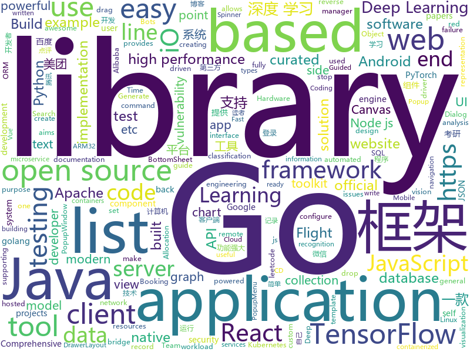

# 2019-07-17
See what the GitHub community is most excited about today.

## python
* [python-cheatsheet](https://github.com/gto76/python-cheatsheet)(**824 stars today**): Comprehensive Python Cheatsheet
* [Osmedeus](https://github.com/j3ssie/Osmedeus)(**147 stars today**): Fully automated offensive security framework for reconnaissance and vulnerability scanning
* [Shielded_detector](https://github.com/tangzixiang0304/Shielded_detector)(**18 stars today**): 
* [ludwig](https://github.com/uber/ludwig)(**61 stars today**): Ludwig is a toolbox built on top of TensorFlow that allows to train and test deep learning models without the need to write code.
* [AB3DMOT](https://github.com/xinshuoweng/AB3DMOT)(**36 stars today**): Official python implementation for "A Baseline for 3D Multi-Object Tracking"
* [stylegan](https://github.com/NVlabs/stylegan)(**19 stars today**): StyleGAN - Official TensorFlow Implementation
* [dagster](https://github.com/dagster-io/dagster)(**22 stars today**): Dagster is an open-source system for building data applications.
* [models](https://github.com/tensorflow/models)(**69 stars today**): Models and examples built with TensorFlow
* [text-detection-ctpn](https://github.com/eragonruan/text-detection-ctpn)(**13 stars today**): text detection mainly based on ctpn model in tensorflow, id card detect, connectionist text proposal network
* [sherlock](https://github.com/sherlock-project/sherlock)(**194 stars today**): 🔎Find usernames across social networks
* [faceswap](https://github.com/deepfakes/faceswap)(**56 stars today**): Deepfakes Software For All
* [Deep-Flow-Guided-Video-Inpainting](https://github.com/nbei/Deep-Flow-Guided-Video-Inpainting)(**114 stars today**): pytorch implementation for "Deep Flow-Guided Video Inpainting"(CVPR'19)
* [bcc](https://github.com/iovisor/bcc)(**13 stars today**): BCC - Tools for BPF-based Linux IO analysis, networking, monitoring, and more
* [Cryptocurrency-Trading-Bots-Python-Beginner-Advance](https://github.com/Roibal/Cryptocurrency-Trading-Bots-Python-Beginner-Advance)(**2 stars today**): Crypto Trading Bots in Python - Triangular Arbitrage, Beginner & Advanced Cryptocurrency Trading Bots Written in Python
* [DeepLearningExamples](https://github.com/NVIDIA/DeepLearningExamples)(**27 stars today**): Deep Learning Examples
* [tfpyth](https://github.com/BlackHC/tfpyth)(**20 stars today**): Putting TensorFlow back in PyTorch, back in TensorFlow (differentiable TensorFlow PyTorch adapters).
* [deep-text-recognition-benchmark](https://github.com/clovaai/deep-text-recognition-benchmark)(**14 stars today**): Text recognition (optical character recognition) with deep learning methods.
* [PyTorch_BlazeFace](https://github.com/tkat0/PyTorch_BlazeFace)(**11 stars today**): Unofficial PyTorch implementation of BlazeFace
* [PySyft](https://github.com/OpenMined/PySyft)(**13 stars today**): A library for encrypted, privacy preserving deep learning
* [code_snippets](https://github.com/CoreyMSchafer/code_snippets)(**10 stars today**): 
* [public-apis](https://github.com/public-apis/public-apis)(**67 stars today**): A collective list of free APIs for use in software and web development.
* [d2l-zh](https://github.com/d2l-ai/d2l-zh)(**45 stars today**): 《动手学深度学习》：面向中文读者、能运行、可讨论。英文版即伯克利“深度学习导论（STAT 157）”教材。
* [airflow](https://github.com/apache/airflow)(**17 stars today**): Apache Airflow
* [bee-university](https://github.com/beecost/bee-university)(**3 stars today**): Project thu thập điểm chuẩn đại học 2014 - 2018 và phân tích dữ liệu
* [PhoneInfoga](https://github.com/sundowndev/PhoneInfoga)(**10 stars today**): Advanced information gathering & OSINT tool for phone numbers.

## java
* [seata](https://github.com/seata/seata)(**40 stars today**): 🔥Seata is an easy-to-use, high-performance, open source distributed transaction solution.
* [SoloPi](https://github.com/alipay/SoloPi)(**121 stars today**): Soloπ 自动化测试工具
* [curator](https://github.com/apache/curator)(**6 stars today**): Apache Curator
* [cat](https://github.com/dianping/cat)(**71 stars today**): CAT 作为服务端项目基础组件，提供了 Java, C/C++, Node.js, Python, Go 等多语言客户端，已经在美团点评的基础架构中间件框架（MVC框架，RPC框架，数据库框架，缓存框架等，消息队列，配置系统等）深度集成，为美团点评各业务线提供系统丰富的性能指标、健康状况、实时告警等。
* [solo](https://github.com/b3log/solo)(**80 stars today**): 🎸一款小而美的博客系统，专为程序员设计。https://hacpai.com/tag/solo
* [MPAndroidChart](https://github.com/PhilJay/MPAndroidChart)(**16 stars today**): A powerful🚀Android chart view / graph view library, supporting line- bar- pie- radar- bubble- and candlestick charts as well as scaling, dragging and animations.
* [easyexcel](https://github.com/alibaba/easyexcel)(**56 stars today**): 快速、简单避免OOM的java处理Excel工具
* [Hystrix](https://github.com/Netflix/Hystrix)(**7 stars today**): Hystrix is a latency and fault tolerance library designed to isolate points of access to remote systems, services and 3rd party libraries, stop cascading failure and enable resilience in complex distributed systems where failure is inevitable.
* [YCSB](https://github.com/brianfrankcooper/YCSB)(**1 stars today**): Yahoo! Cloud Serving Benchmark
* [XPopup](https://github.com/li-xiaojun/XPopup)(**15 stars today**): 🔥功能强大，UI简洁，交互优雅的通用弹窗！可以替代Dialog，PopupWindow，PopupMenu，BottomSheet，DrawerLayout，Spinner等组件，自带十几种效果良好的动画， 支持完全的UI和动画自定义！(Powerful and Beautiful Popup，can absolutely replace Dialog，PopupWindow，PopupMenu，BottomSheet，DrawerLayout，Spinner. With built-in animators , very easy to custom popup view.)
* [arthas](https://github.com/alibaba/arthas)(**55 stars today**): Alibaba Java Diagnostic Tool Arthas/Alibaba Java诊断利器Arthas
* [pipeline](https://github.com/PipelineAI/pipeline)(**3 stars today**): PipelineAI: Real-Time Enterprise AI Platform
* [debezium](https://github.com/debezium/debezium)(**5 stars today**): Change data capture for a variety of databases. https://debezium.io Please log issues in our JIRA at https://issues.jboss.org/projects/DBZ/issues
* [kafka-streams-examples](https://github.com/confluentinc/kafka-streams-examples)(**1 stars today**): Demo applications and code examples for Apache Kafka's Streams API.
* [JustAuth](https://github.com/zhangyd-c/JustAuth)(**80 stars today**): 💯史上最全的整合第三方登录的工具,目前已支持Github、Gitee、微博、钉钉、百度、Coding、腾讯云开发者平台、OSChina、支付宝、QQ、微信、淘宝、Google、Facebook、抖音、领英、小米、微软和今日头条等第三方平台的授权登录。 Login, so easy!
* [ksql](https://github.com/confluentinc/ksql)(**3 stars today**): KSQL - the Streaming SQL Engine for Apache Kafka
* [jvm-sandbox-repeater](https://github.com/alibaba/jvm-sandbox-repeater)(**6 stars today**): A Java server-side recording and playback solution based on JVM-Sandbox
* [hadoop](https://github.com/apache/hadoop)(**8 stars today**): Apache Hadoop
* [fastjson-rce-exploit](https://github.com/MagicZer0/fastjson-rce-exploit)(**7 stars today**): exploit for fastjson remote code execution vulnerability
* [DoraemonKit](https://github.com/didi/DoraemonKit)(**16 stars today**): 简称 "DoKit" 。一款功能齐全的客户端（ iOS 、Android ）研发助手，你值得拥有。
* [jsonschema2pojo](https://github.com/joelittlejohn/jsonschema2pojo)(**2 stars today**): Generate Java types from JSON or JSON Schema and annotates those types for data-binding with Jackson, Gson, etc
* [elasticsearch-sql](https://github.com/NLPchina/elasticsearch-sql)(**10 stars today**): Use SQL to query Elasticsearch
* [karate](https://github.com/intuit/karate)(**3 stars today**): Web-Services Testing Made Simple
* [sofa-boot](https://github.com/sofastack/sofa-boot)(**7 stars today**): SOFABoot is a framework that enhances Spring Boot and fully compatible with it, provides readiness check, class isolation, etc.
* [unidbg](https://github.com/zhkl0228/unidbg)(**3 stars today**): Allows you to emulate an Android ARM32 and/or ARM64 native library, and an experimental iOS ARM32 emulation

## unknown
* [interview_internal_reference](https://github.com/0voice/interview_internal_reference)(**656 stars today**): 2019年最新总结，阿里，腾讯，百度，美团，头条等技术面试题目，以及答案，专家出题人分析汇总。
* [Penetration_Testing_Case](https://github.com/r35tart/Penetration_Testing_Case)(**85 stars today**): 用于记录分享一些有趣的案例
* [awesome-graph-classification](https://github.com/benedekrozemberczki/awesome-graph-classification)(**247 stars today**): A collection of important graph embedding, classification and representation learning papers with implementations.
* [1x.engineer](https://github.com/cutenode/1x.engineer)(**195 stars today**): The official website of 1x Engineers around the world
* [the-art-of-command-line](https://github.com/jlevy/the-art-of-command-line)(**116 stars today**): Master the command line, in one page
* [AD-Attack-Defense](https://github.com/infosecn1nja/AD-Attack-Defense)(**8 stars today**): Attack and defend active directory using modern post exploitation adversary tradecraft activity
* [architect-awesome](https://github.com/xingshaocheng/architect-awesome)(**58 stars today**): 后端架构师技术图谱
* [DeepLearning-500-questions](https://github.com/scutan90/DeepLearning-500-questions)(**239 stars today**): 深度学习500问，以问答形式对常用的概率知识、线性代数、机器学习、深度学习、计算机视觉等热点问题进行阐述，以帮助自己及有需要的读者。 全书分为18个章节，50余万字。由于水平有限，书中不妥之处恳请广大读者批评指正。 未完待续............ 如有意合作，联系scutjy2015@163.com 版权所有，违权必究 Tan 2018.06
* [blog](https://github.com/EDDYCJY/blog)(**12 stars today**): 煎鱼的博客，有点忙。
* [OnJava8](https://github.com/LingCoder/OnJava8)(**44 stars today**): 《On Java 8》中文版，又名《Java编程思想》 第5版
* [GNNPapers](https://github.com/thunlp/GNNPapers)(**22 stars today**): Must-read papers on graph neural networks (GNN)
* [cskaoyan](https://github.com/csseky/cskaoyan)(**9 stars today**): 提供计算机考研和软件工程考研专业的各个学校 考研真题
* [deep-learning-drizzle](https://github.com/kmario23/deep-learning-drizzle)(**14 stars today**): Drench yourself in Deep Learning, Reinforcement Learning, Machine Learning, Computer Vision, and NLP by learning from these exciting lectures!!
* [A-to-Z-Resources-for-Students](https://github.com/dipakkr/A-to-Z-Resources-for-Students)(**46 stars today**): Curated list of resources for college students
* [Red-Teaming-Toolkit](https://github.com/infosecn1nja/Red-Teaming-Toolkit)(**2 stars today**): A collection of open source and commercial tools that aid in red team operations.
* [xamarin-forms-goodlooking-UI](https://github.com/jsuarezruiz/xamarin-forms-goodlooking-UI)(**3 stars today**): Xamarin.Forms goodlooking UI samples
* [The-Economist](https://github.com/nailperry-zd/The-Economist)(**7 stars today**): The Economist 经济学人，持续更新
* [Learn_Deep_Learning_in_6_Weeks](https://github.com/llSourcell/Learn_Deep_Learning_in_6_Weeks)(**4 stars today**): This is the Curriculum for "Learn Deep Learning in 6 Weeks" by Siraj Raval on Youtube
* [golang-developer-roadmap-cn](https://github.com/Quorafind/golang-developer-roadmap-cn)(**5 stars today**): 在 2019 成为一名 Go 开发者的路线图。为学习 Go 的人而准备。
* [weekly](https://github.com/dt-fe/weekly)(**17 stars today**): 前端精读周刊
* [eloquente-javascript](https://github.com/braziljs/eloquente-javascript)(**1 stars today**): Tradução do livro Eloquent JavaScript - 2ª edição.
* [awesome-burp-extensions](https://github.com/snoopysecurity/awesome-burp-extensions)(**4 stars today**): A curated list of amazingly awesome Burp Extensions
* [awesome-point-cloud-analysis](https://github.com/Yochengliu/awesome-point-cloud-analysis)(**3 stars today**): A list of papers and datasets about point cloud analysis (processing)
* [redteam-hardware-toolkit](https://github.com/ismailtasdelen/redteam-hardware-toolkit)(**4 stars today**): 🔺Red Team Hardware Toolkit🔺
* [awesome-visual-slam](https://github.com/tzutalin/awesome-visual-slam)(**2 stars today**): 📚The list of vision-based SLAM / Visual Odometry open source, blogs, and papers

## javascript
* [leetcode](https://github.com/azl397985856/leetcode)(**195 stars today**): LeetCode Solutions: A Record of My Problem Solving Journey.( leetcode题解，记录自己的leetcode解题之路。)
* [baidu-netdisk-downloaderx](https://github.com/b3log/baidu-netdisk-downloaderx)(**393 stars today**): ⚡️一款图形界面的百度网盘不限速下载器，支持 Windows、Linux 和 Mac。
* [realworld](https://github.com/gothinkster/realworld)(**145 stars today**): "The mother of all demo apps" — Exemplary fullstack Medium.com clone powered by React, Angular, Node, Django, and many more🏅
* [mongoose](https://github.com/Automattic/mongoose)(**35 stars today**): MongoDB object modeling designed to work in an asynchronous environment.
* [zigbee2mqtt](https://github.com/Koenkk/zigbee2mqtt)(**37 stars today**): Zigbee🐝to MQTT bridge🌉, get rid of your proprietary Zigbee bridges🔨
* [yapi](https://github.com/YMFE/yapi)(**90 stars today**): YApi 是一个可本地部署的、打通前后端及QA的、可视化的接口管理平台
* [vuetify](https://github.com/vuetifyjs/vuetify)(**20 stars today**): 🐉Material Component Framework for Vue.js 2
* [taro](https://github.com/NervJS/taro)(**30 stars today**): 多端统一开发框架，支持用 React 的开发方式编写一次代码，生成能运行在微信/百度/支付宝/字节跳动小程序、H5、React Native 等的应用。 https://taro.jd.com/
* [VvvebJs](https://github.com/givanz/VvvebJs)(**24 stars today**): Drag and drop website builder javascript library.
* [500lines](https://github.com/aosabook/500lines)(**20 stars today**): 500 Lines or Less
* [docusaurus](https://github.com/facebook/docusaurus)(**38 stars today**): Easy to maintain open source documentation websites.
* [jsPDF](https://github.com/MrRio/jsPDF)(**19 stars today**): Client-side JavaScript PDF generation for everyone.
* [trilium](https://github.com/zadam/trilium)(**15 stars today**): Build your personal knowledge base with Trilium Notes
* [quasar](https://github.com/quasarframework/quasar)(**94 stars today**): Quasar Framework - Build high-performance VueJS user interfaces in record time
* [javascript-algorithms](https://github.com/trekhleb/javascript-algorithms)(**59 stars today**): 📝Algorithms and data structures implemented in JavaScript with explanations and links to further readings
* [wepy](https://github.com/Tencent/wepy)(**14 stars today**): 小程序组件化开发框架
* [scratch-gui](https://github.com/LLK/scratch-gui)(**11 stars today**): Graphical User Interface for creating and running Scratch 3.0 projects.
* [selectize.js](https://github.com/selectize/selectize.js)(**5 stars today**): Selectize is the hybrid of a textbox and <select> box. It's jQuery based and it has autocomplete and native-feeling keyboard navigation; useful for tagging, contact lists, etc.
* [recharts](https://github.com/recharts/recharts)(**14 stars today**): Redefined chart library built with React and D3
* [aws-serverless-airline-booking](https://github.com/aws-samples/aws-serverless-airline-booking)(**8 stars today**): Airline Booking is a complete web application that provides Flight Search, Flight Payment, Flight Booking, Flight Preferences and Loyalty points including end-to-end testing, GraphQL and CI/CD. This web application is the theme of Build on Serverless Season 2 on AWS Twitch running from April 24th until end of July.
* [engine](https://github.com/playcanvas/engine)(**7 stars today**): Fast and lightweight WebGL game engine
* [site-kit-wp](https://github.com/google/site-kit-wp)(**6 stars today**): Site Kit is a one-stop solution for WordPress users to use everything Google has to offer to make them successful on the web.
* [Vue.Draggable](https://github.com/SortableJS/Vue.Draggable)(**26 stars today**): Vue drag-and-drop component based on Sortable.js
* [deck.gl](https://github.com/uber/deck.gl)(**6 stars today**): WebGL2 powered geospatial visualization layers
* [fabric.js](https://github.com/fabricjs/fabric.js)(**13 stars today**): Javascript Canvas Library, SVG-to-Canvas (& canvas-to-SVG) Parser

## html
* [awesome-piracy](https://github.com/Igglybuff/awesome-piracy)(**63 stars today**): A curated list of awesome warez and piracy links
* [workshops](https://github.com/ansible/workshops)(**3 stars today**): Training Course for Ansible Automation
* [styleguide](https://github.com/google/styleguide)(**16 stars today**): Style guides for Google-originated open-source projects
* [JavaScript30](https://github.com/wesbos/JavaScript30)(**11 stars today**): 30 Day Vanilla JS Challenge
* [owasp-mstg](https://github.com/OWASP/owasp-mstg)(**6 stars today**): The Mobile Security Testing Guide (MSTG) is a comprehensive manual for mobile app security development, testing and reverse engineering.
* [fastText](https://github.com/facebookresearch/fastText)(**9 stars today**): Library for fast text representation and classification.
* [flexboxgrid](https://github.com/kristoferjoseph/flexboxgrid)(**3 stars today**): Grid based on CSS3 flexbox
* [500LineorLess_CN](https://github.com/HT524/500LineorLess_CN)(**7 stars today**): 500 line or less 中文翻译计划。
* [keep-a-changelog](https://github.com/olivierlacan/keep-a-changelog)(**4 stars today**): If you build software, keep a changelog.
* [design-blocks](https://github.com/froala/design-blocks)(**4 stars today**): A set of 170+ Bootstrap based design blocks ready to be used to create clean modern websites.
* [cypress-example-kitchensink](https://github.com/cypress-io/cypress-example-kitchensink)(**1 stars today**): This is an example app used to showcase Cypress.io testing.
* [book](https://github.com/PaddlePaddle/book)(**8 stars today**): Deep Learning 101 with PaddlePaddle （『飞桨』深度学习框架入门教程）
* [anycubic-photon-docs](https://github.com/Photonsters/anycubic-photon-docs)(**1 stars today**): This repo aims to collect curate and compile information on anycubic photon hardware software and use
* [EIPs](https://github.com/ethereum/EIPs)(**1 stars today**): The Ethereum Improvement Proposal repository
* [30-seconds-of-css](https://github.com/30-seconds/30-seconds-of-css)(**8 stars today**): A curated collection of useful CSS snippets you can understand in 30 seconds or less.
* [elements-examples](https://github.com/stripe/elements-examples)(**2 stars today**): Stripe Elements examples.
* [webdevbootcamp](https://github.com/nax3t/webdevbootcamp)(**5 stars today**): All source code for back-end projects from the Web Developer Bootcamp
* [learnyounode](https://github.com/workshopper/learnyounode)(**5 stars today**): Learn You The Node.js For Much Win! An intro to Node.js via a set of self-guided workshops.
* [web-moderno](https://github.com/cod3rcursos/web-moderno)(**4 stars today**): 
* [mxgraph](https://github.com/jgraph/mxgraph)(**1 stars today**): mxGraph is a fully client side JavaScript diagramming library
* [sourcegraph](https://github.com/sourcegraph/sourcegraph)(**5 stars today**): Code search and navigation tool (self-hosted)
* [awesome-creative-coding](https://github.com/terkelg/awesome-creative-coding)(**5 stars today**): Creative Coding: Generative Art, Data visualization, Interaction Design, Resources.
* [android_interview](https://github.com/LRH1993/android_interview)(**1 stars today**): gitbook地址
* [swagger-codegen](https://github.com/swagger-api/swagger-codegen)(**4 stars today**): swagger-codegen contains a template-driven engine to generate documentation, API clients and server stubs in different languages by parsing your OpenAPI / Swagger definition.
* [Front-end-Developer-Interview-Questions](https://github.com/h5bp/Front-end-Developer-Interview-Questions)(**21 stars today**): A list of helpful front-end related questions you can use to interview potential candidates, test yourself or completely ignore.

## go
* [listmonk](https://github.com/knadh/listmonk)(**277 stars today**): High performance, self-hosted newsletter and mailing list manager with a modern dashboard. Go + React.
* [helm](https://github.com/helm/helm)(**24 stars today**): The Kubernetes Package Manager
* [fasthttp](https://github.com/valyala/fasthttp)(**25 stars today**): Fast HTTP package for Go. Tuned for high performance. Zero memory allocations in hot paths. Up to 10x faster than net/http
* [Modlishka](https://github.com/drk1wi/Modlishka)(**16 stars today**): Modlishka. Reverse Proxy.
* [kruise](https://github.com/openkruise/kruise)(**15 stars today**): Automate application workloads management on Kubernetes
* [nomad](https://github.com/hashicorp/nomad)(**5 stars today**): Nomad is an easy-to-use, flexible, and performant workload orchestrator that can deploy a mix of microservice, batch, containerized, and non-containerized applications. Nomad is easy to operate and scale and has native Consul and Vault integrations.
* [learn-go-with-tests](https://github.com/quii/learn-go-with-tests)(**38 stars today**): Learn Go with test-driven development
* [gf](https://github.com/gogf/gf)(**15 stars today**): GoFrame is a modular, full-featured and production-ready application development framework of golang. Providing a series of core components and dozens of practical modules, such as: cache, logging, containers, timer, validator, database orm, etc. Supporting web server integrated with router, cookie, session, logger, configure, template, https, h…
* [martian](https://github.com/google/martian)(**39 stars today**): Martian is a library for building custom HTTP/S proxies
* [agola](https://github.com/agola-io/agola)(**27 stars today**): Agola: CI/CD Redefined
* [terratest](https://github.com/gruntwork-io/terratest)(**9 stars today**): Terratest is a Go library that makes it easier to write automated tests for your infrastructure code.
* [chaosblade](https://github.com/chaosblade-io/chaosblade)(**11 stars today**): An easy to use and powerful chaos engineering experiment toolkit.（阿里巴巴开源的一款简单易用、功能强大的混沌实验注入工具）
* [sqlx](https://github.com/jmoiron/sqlx)(**7 stars today**): general purpose extensions to golang's database/sql
* [go-elasticsearch](https://github.com/elastic/go-elasticsearch)(**4 stars today**): The official Go client for Elasticsearch
* [zerolog](https://github.com/rs/zerolog)(**6 stars today**): Zero Allocation JSON Logger
* [roadrunner](https://github.com/spiral/roadrunner)(**6 stars today**): High-performance PHP application server, load-balancer and process manager written in Golang
* [chat](https://github.com/tinode/chat)(**13 stars today**): Instant messaging server; backend in Go; Android, web command line clients; chatbots
* [opa](https://github.com/open-policy-agent/opa)(**9 stars today**): An open source, general-purpose policy engine.
* [sling](https://github.com/dghubble/sling)(**12 stars today**): A Go HTTP client library for creating and sending API requests
* [pq](https://github.com/lib/pq)(**10 stars today**): Pure Go Postgres driver for database/sql
* [trivy](https://github.com/knqyf263/trivy)(**12 stars today**): A Simple and Comprehensive Vulnerability Scanner for Containers, Suitable for CI
* [prometheus-operator](https://github.com/coreos/prometheus-operator)(**7 stars today**): Prometheus Operator creates/configures/manages Prometheus clusters atop Kubernetes
* [pgx](https://github.com/jackc/pgx)(**3 stars today**): PostgreSQL driver and toolkit for Go
* [gorm](https://github.com/jinzhu/gorm)(**19 stars today**): The fantastic ORM library for Golang, aims to be developer friendly
* [monday](https://github.com/eko/monday)(**63 stars today**): ⚡️A dev tool for microservice developers that run local applications and/or forward some others from Kubernetes or over SSH

## WordCloud

